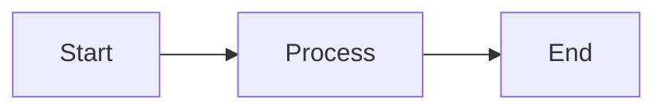

# Slidev Markdown Syntax — Quick Reference

Reference for generating Slidev slides from extracted PPTX content.

## Slide Structure

```markdown
---
theme: default
title: "Presentation Title"
canvasWidth: 1280
canvasHeight: 720
transition: slide-left
mdc: true
---

# First Slide Title

Content here.

---
transition: fade-out
---

# Second Slide Title

More content.
```

## Slide Separators

- `---` separates slides
- YAML frontmatter between `---` fences applies to that specific slide
- Global frontmatter only at the top of the file

## Per-Slide Frontmatter

```yaml
---
layout: center          # Built-in layout
transition: fade-out    # Slide transition
class: text-center      # CSS class on slide container
background: ./images/bg.jpg  # Background image
---
```

## Built-in Layouts

| Layout | Use Case |
|--------|----------|
| `default` | Standard content slide |
| `center` | Vertically + horizontally centered |
| `cover` | Title/cover slide |
| `two-cols` | Two-column layout |
| `image-right` | Content left, image right |
| `image-left` | Image left, content right |
| `image` | Full-bleed background image |
| `fact` | Large fact/statistic |
| `quote` | Styled blockquote |
| `section` | Section divider |
| `end` | Closing slide |
| `iframe` | Embedded iframe |

## Animations

### Click-to-reveal (single element)

```html
<v-click>

This appears on click.

</v-click>
```

### Sequential reveal (each child)

```html
<v-clicks>

- Item 1 (appears first)
- Item 2 (appears second)
- Item 3 (appears third)

</v-clicks>
```

### Click with order

```html
<v-click at="2">Appears second</v-click>
<v-click at="1">Appears first</v-click>
```

## Code Blocks

### Basic syntax highlighting

````markdown
```python
def hello():
    print("Hello, world!")
```
````

### Line highlighting

````markdown
```python {2,3|5|all}
def process():
    data = load()      # highlighted first
    result = parse()   # highlighted first
    validate()
    return result      # highlighted second
```
````

### Shiki Magic Move (animated code transitions)

````markdown
````md magic-move
```python
# Step 1
x = 1
```
```python
# Step 2 — variable changed
x = 42
y = x + 1
```
````
````

## Images

### Markdown image

```markdown

```

### HTML image with sizing

```html

```

### Background image

```yaml
---
background: ./images/hero.jpg
class: text-white
---
```

## Tables

```markdown
| Column A | Column B | Column C |
|----------|----------|----------|
| Cell 1   | Cell 2   | Cell 3   |
| Cell 4   | Cell 5   | Cell 6   |
```

## Speaker Notes

```markdown
---

# Slide Title

Content here.

<!--
These are speaker notes visible in presenter mode (press 'p').
They support **Markdown** formatting.
-->
```

## UnoCSS Utility Classes

Slidev includes UnoCSS (Tailwind-compatible). Commonly used classes:

### Layout

| Class | Effect |
|-------|--------|
| `flex` | Flexbox container |
| `flex-col` | Column direction |
| `grid` | CSS Grid container |
| `grid-cols-2` | Two-column grid |
| `grid-cols-3` | Three-column grid |
| `gap-4` | 1rem gap |
| `items-center` | Align items center |
| `justify-center` | Justify content center |

### Sizing

| Class | Effect |
|-------|--------|
| `w-full` | Width 100% |
| `h-full` | Height 100% |
| `w-1/2` | Width 50% |
| `w-1/3` | Width 33% |
| `max-h-96` | Max height 24rem |

### Spacing

| Class | Effect |
|-------|--------|
| `p-4` | Padding 1rem all sides |
| `px-16` | Padding left/right 4rem |
| `mt-8` | Margin top 2rem |
| `mb-4` | Margin bottom 1rem |
| `gap-8` | Gap 2rem |

### Typography

| Class | Effect |
|-------|--------|
| `text-4xl` | Font size 2.25rem |
| `text-2xl` | Font size 1.5rem |
| `text-lg` | Font size 1.125rem |
| `text-sm` | Font size 0.875rem |
| `text-center` | Center text |
| `font-bold` | Bold text |
| `leading-tight` | Line height 1.25 |
| `opacity-70` | 70% opacity |

### Visual

| Class | Effect |
|-------|--------|
| `rounded-xl` | Large border radius |
| `shadow-xl` | Large shadow |
| `border-2` | 2px border |
| `bg-white` | White background |

## Inline HTML

Slidev supports full HTML within slides. Use `<div>` containers with
UnoCSS classes or inline styles for complex layouts:

```html
<div class="flex w-full h-full">
  <div class="w-1/2 flex flex-col justify-center px-16">
    <h1 style="color: var(--theme-dk2);">Title</h1>
    <p>Subtitle text</p>
  </div>
  <div class="w-1/2 flex items-center justify-center">
    
  </div>
</div>
```

## Mermaid Diagrams

````markdown

````

## Running Commands

```bash
# Development server with hot reload
pnpm slidev presentations/<name>/slides.md

# Build static SPA
pnpm slidev build presentations/<name>/slides.md

# Export to PDF
pnpm slidev export presentations/<name>/slides.md

# Keyboard shortcuts during presentation:
#   f     — Toggle fullscreen
#   o     — Slide overview
#   p     — Presenter mode
#   ←/→   — Navigate slides
#   Space — Next animation/slide
```
