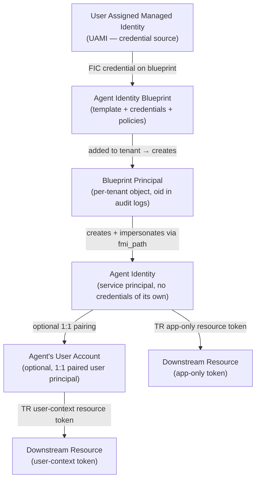

## The Agent Identity Model

### Three operating modes

An agent's operating mode determines how it acquires tokens and what context it acts within. There
are three primary modes:

| Mode | Identity type | User context | Permission type | Typical use case |
|------|--------------|-------------|-----------------|-----------------|
| *Autonomous (app-only)* | Agent identity (service principal) | None | Application permissions (admin consent) | Background jobs, scheduled tasks, proactive notifications, system-to-system orchestration |
| *On-behalf-of (OBO)* | Agent identity (service principal) | Signed-in user | Delegated permissions (user or admin consent) | Chat assistants, user-facing copilots, agents acting on a user's data |
| *User-account impersonation* | Agent's user account (user principal) | Dedicated agent user | Delegated (via 3-stage FIC chain) | Digital worker with its own mailbox, Teams presence, or Calendar |

#### Autonomous mode

The agent acts entirely on its own behalf using application permissions. No human is present in the
token exchange. Tenant admins must pre-consent all application permissions. This is the right pattern
for background processing, nightly batch jobs, proactive email delivery, and orchestrator agents that
coordinate other systems without human instruction. The token subject (`sub`) is the agent identity.

#### On-behalf-of (OBO) mode

A signed-in user triggers an action and the agent performs that action with delegated access scoped
to the user's data. The resulting token carries both the user's identity (who) and the agent identity
(how). This pattern suits chat-based assistants and any workflow where the agent should only see data
the user is already authorized to see. User or admin consent governs the delegated permissions. An
agent identity refresh token can be used to continue background operations after the user's session
ends, without requiring re-authentication.

#### User-account impersonation mode

Some systems — Exchange, Teams, OneDrive — require a *user object* rather than a service principal.
The **agent's user account** is a purpose-built Microsoft Entra user account (flagged as AI agent,
not a human employee) that is paired 1:1 with an agent identity. The agent authenticates as its agent
identity, then uses a three-stage FIC chain to impersonate the paired user account when calling
those specific resources. This pattern supports "digital worker" scenarios such as an AI sales
representative with a real mailbox listed in the Global Address List.

Some agents need both autonomous and OBO modes — for example, a nightly background sync combined with
a chat interface. Implement both OAuth flows and select the appropriate token based on the operation.

---

### Agent identity object model

Four distinct constructs form the object model:



#### Agent identity blueprint

The blueprint is the template and authentication foundation. It:

- Holds the **credentials** (federated identity credentials, certificates, or client secrets) that the
  blueprint uses to impersonate agent identities. Agent identities themselves have *no credentials*.
- Declares `RequiredResourceAccess` — the APIs and permissions the agent needs, visible to admins
  during consent review.
- Defines **inheritable permissions** — permissions on resource APIs that automatically propagate to
  all child agent identities when an admin grants them on the blueprint principal.
- Can be *single-tenant* (used within one tenant) or *multitenant* (published and added to customer
  tenants via Microsoft catalogs, where it creates local agent identities).

#### Agent identity blueprint principal

When a blueprint is added to a tenant, Microsoft Entra creates a corresponding **blueprint principal**
object. This object:

- Is referenced by the `oid` claim in tokens issued for blueprint operations.
- Appears in audit logs as the actor when the blueprint creates agent identities or performs actions.
- Is the object admins target when granting inheritable permissions.

#### Agent identity

An agent identity is a special service principal with *no credentials of its own*. Token acquisition
is delegated to the blueprint via the FIC chain.

| Property | Description |
|----------|-------------|
| `id` / `appId` | Always identical; unique object ID in the tenant |
| Credentials | None — blueprint acquires tokens on its behalf |
| Display name | Surfaced in admin center, Azure portal, sign-in logs |
| Sponsor | Optional human user or group accountable for the agent |
| Blueprint | The parent blueprint that created and manages this identity |
| Agent's user account | Optional; 1:1 paired user principal for systems requiring a user object |

#### Agent's user account

An optional Microsoft Entra user account (user type, decorated as AI agent) that is paired 1:1 with
a single agent identity. It has a UPN, manager assignment, and can appear in the GAL. It cannot be
shared across multiple agent identities.

---

### FIC credential chain

All token acquisition for agent identities uses **Federated Identity Credentials (FIC)** — not shared
secrets. The chain is cryptographically verifiable:

```
User Assigned Managed Identity (UAMI)
    ↓  TUAMI — acquired from Azure IMDS (no secrets required)
Agent Identity Blueprint
    ↓  T1 — FIC exchange token (aud = blueprint client ID)
        grant_type=client_credentials, fmi_path=AgentIdentity
Agent Identity (uses T1 as client_assertion)
    ↓  TR — app-only resource access token  [autonomous flow]
    ↓  TR — delegated resource access token [OBO flow]
    ↓  T2 — second FIC exchange token       [user-account flow]
Agent's User Account (presents T1 + T2 via user_fic grant)
    ↓  TR — user-context resource access token [user-account flow]
```

All intermediate FIC exchange steps use the fixed scope `api://AzureADTokenExchange/.default` — the
well-known scope that signals the resulting token (T1, T2) is a non-resource exchange credential,
not a resource access token.

Because credentials reside on the blueprint rather than on individual agent identities, credential
rotation affects all children together. A blueprint can own many agent identities without per-identity
secret management.

---

### Agent identity vs. app registration vs. managed identity

| Dimension | App registration / service principal | Managed identity | Agent identity |
|-----------|-------------------------------------|-----------------|----------------|
| Designed for | Deterministic, long-lived services | Azure-hosted compute | AI agents (dynamic, ephemeral, scalable) |
| Credentials | Client secrets or certificates | Azure-managed, no secrets | None — delegates to blueprint |
| Lifecycle management | Manual; long-term stability assumed | Tied to Azure resource | Blueprint-managed; bulk create/delete; ephemeral at runtime |
| Dedicated audit log entries | No | No | Yes — dedicated agent identity sign-in entries |
| Enforced sponsor (accountability) | No | No | Yes |
| Inheritable permissions | No | No | Yes (from blueprint principal) |
| Agent-specific Conditional Access | No | No | Yes |
| Platform restrictions on high-privilege ops | No | No | Yes (reduced blast radius) |
| User account pairing | No | No | Yes (1:1 agent's user account) |
| Ephemeral / runtime creation | Possible but operationally heavy | Not ephemeral | First-class support |

---

### Key concepts

**Sponsor** — an optional human user or group declared as accountable for an agent identity. Used
when a security incident occurs to identify the business owner. Enforced sponsorship is a governance
control unavailable on service principals.

**Inheritable permissions** — permissions granted on the blueprint principal that automatically
propagate to all child agent identities from that blueprint. Reduces per-agent consent overhead
while maintaining least-privilege boundaries. Requires the resource application to be declared in
the blueprint's inheritable permissions list.

**Ephemeral agent identities** — agent identities created at runtime (e.g., by an orchestrator for
a specific task), granted permissions inherited from the blueprint, and deleted when the task
completes. This limits the blast radius of a compromise to the duration of a single operation.

**Single-tenant agent identities** — agent identities always operate within a single tenant; they
cannot acquire tokens for resources in other tenants. Blueprints, however, can be multitenant.
