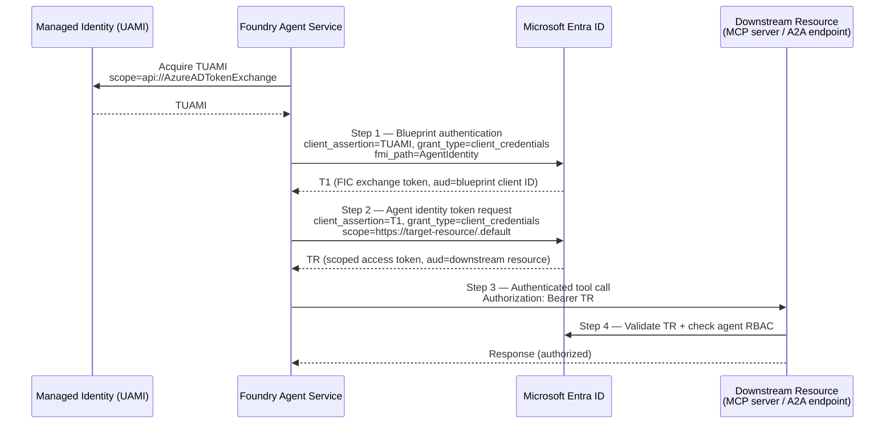

## Foundry Agent Service Integration

Microsoft Foundry Agent Service is a fully managed platform for building, deploying, and scaling
AI agents. It supports any framework and any model from the Foundry model catalog (GPT-4o, Llama,
DeepSeek, and others). Foundry handles hosting, scaling, identity provisioning, observability, and
enterprise security — including automatic Entra Agent ID integration — so developers focus on agent
logic rather than infrastructure plumbing.

### Agent types

Foundry supports the following agent types, each with different identity implications:

| Type | Code required | Hosting | Identity behaviour |
|------|--------------|---------|-------------------|
| **Prompt agent** (standard) | No | Fully managed | Shares project identity until published; receives distinct identity on publish |
| **Workflow agent** | No (YAML optional) | Fully managed | Same shared/distinct pattern; supports A2A coordination |
| **Hosted agent** | Yes | Container-based, Micro VMs | Code-first; developer controls orchestration. Each hosted agent receives a per-agent Entra agent identity auto-created at deploy (see [Hosted agents](#hosted-agents-public-preview)) |

Prompt and workflow agents are configured declaratively; hosted agents are code-based containers
(Agent Framework, LangGraph, or custom code). All types participate in the same Entra Agent
ID lifecycle.

> **Note (as of 2026-06-03):** The current
> [Foundry agents overview](https://learn.microsoft.com/en-us/azure/foundry/agents/overview)
> presents **prompt agents** and **hosted agents** as the two primary agent types. Workflow agents
> remain available as a declarative configuration option rather than a top-level type, so the
> workflow row above still applies.

---

### Hosted agents (public preview)

Hosted agents in Foundry Agent Service are in **public preview** as of Build 2026, with **general
availability expected early July 2026**
([Hosted agents concepts](https://learn.microsoft.com/en-us/azure/foundry/agents/concepts/hosted-agents),
updated 2026-06-03;
[Foundry Build recap](https://aka.ms/FoundryBuildNews)). Do not treat hosted agents as GA until that
milestone is confirmed.

**Dual-identity model.** Each hosted agent uses two distinct identities
([Hosted agents concepts](https://learn.microsoft.com/en-us/azure/foundry/agents/concepts/hosted-agents),
updated 2026-06-03):

| Identity | Lifecycle | Purpose |
|----------|-----------|---------|
| **Per-agent Entra agent identity** | Auto-created at deploy time | The runtime identity — used for model invocation, tool access, and downstream Azure service calls |
| **Project managed identity** | System-assigned on the Foundry project | Infrastructure operations only (e.g., Container Registry pull). **Not** the agent's runtime identity |

**Invocation modes.** A hosted agent authenticates differently depending on how it is invoked
([Hosted agents concepts](https://learn.microsoft.com/en-us/azure/foundry/agents/concepts/hosted-agents),
updated 2026-06-03):

- **User-invoked / interactive:** when a user token is present, the agent calls downstream services
  via OAuth 2.0 On-Behalf-Of (OBO), using the user's delegated permissions subject to Entra tenant
  policies.
- **Autonomous / background:** when no user token is available, the agent authenticates with its own
  Entra agent identity (via managed identity) to access downstream services.

In both modes the agent retains its dedicated Entra agent identity for authentication,
authorization, and auditability.

---

### How Foundry provisions Entra Agent ID

Foundry integrates with Entra Agent ID automatically — at project creation and again at publish
time.

**At project creation (first agent created):**

1. Foundry provisions a **default agent identity blueprint** for the project — the reusable template
   that governs all project agent identities.
2. Foundry provisions a **shared agent identity** (service principal) derived from that blueprint —
   used by all in-development agents in the project.

**Key object definitions:**

| Object | Description |
|--------|-------------|
| Agent identity blueprint | Entra ID object governing a class of agent identities; management template for lifecycle operations |
| Agent identity | Entra ID service principal representing the agent at runtime |
| `agentIdentityId` | Identifier used when assigning RBAC roles to the agent identity |
| Audience | OAuth resource identifier for the downstream service (e.g., `https://storage.azure.com`) |

The blueprint carries the OAuth credentials (federated identity credential backed by the project's
managed identity, certificate, or client secret). The agent identity carries no credentials of its
own — it is authenticated by the blueprint at runtime via the 4-step token exchange.

---

### Shared vs distinct agent identity

#### Shared project identity

All unpublished or in-development agents within the same Foundry project share a single common
identity, automatically provisioned when the first agent is created.

- **Benefits:** simplified administration; reduced identity sprawl during prototyping; developers
  can build and test independently without configuring separate identities.
- **Locate in portal:** Foundry project → Overview → JSON View → latest API version → copy
  `agentIdentityBlueprintId` and `agentIdentityId`.

#### Distinct agent identity

Published agents receive a dedicated blueprint and a dedicated agent identity, bound to the agent
application resource.

- **When required:** integration testing, production deployment, unique permission sets, independent
  audit trails.
- **RBAC migration:** roles assigned to the shared identity do **not** carry over. Re-assign all
  required RBAC roles to the new distinct `agentIdentityId` after publishing.
- **Locate in portal:** agent application resource → Overview → JSON View → copy `agentIdentityId`.

> `azd` automatically assigns the **Foundry User** role at account scope to the shared project agent
> identity for unpublished agents. Published agents require *manual* role assignment — `azd` does not
> configure Container Registry, Application Insights, or custom resource permissions.
>
> **Foundry RBAC role rename (as of 2026-06-03):** **Foundry User / Foundry Owner / Foundry Account
> Owner / Foundry Project Manager** were previously named **Azure AI User / Azure AI Owner / Azure AI
> Account Owner / Azure AI Project Manager**. This is a rename only — the **role IDs and core
> permissions are unchanged**, and the previous names may still appear in some places while the
> rename rolls out
> ([Hosted agents concepts](https://learn.microsoft.com/en-us/azure/foundry/agents/concepts/hosted-agents),
> updated 2026-06-03).

---

### Runtime token exchange (4-step flow)

When an agent calls a tool, Foundry Agent Service executes a multi-step OAuth 2.0 token exchange
automatically. Developers never handle tokens directly.



**Step 1 — Blueprint authentication:** Agent Service presents the blueprint's managed identity
credential (`TUAMI`) to Entra ID. The `fmi_path=AgentIdentity` parameter identifies which child
agent identity is being impersonated. Returns `T1`.

**Step 2 — Agent identity token issuance:** Entra ID validates `T1.aud == blueprint client ID`.
Agent Service presents `T1` as the agent identity's credential and requests a scoped access token
for the downstream resource's audience. Returns `TR`.

**Step 3 — Authenticated tool call:** Agent Service passes `TR` to the MCP server or A2A endpoint.

**Step 4 — Token validation and RBAC check:** The downstream resource validates `TR` and checks the
agent identity's RBAC role assignments before granting or denying access.

**Common audience values:**

| Downstream service | Audience |
|-------------------|---------|
| Azure Storage | `https://storage.azure.com` |
| Azure Logic Apps | `https://logic.azure.com` |
| Azure Cosmos DB | `https://cosmos.azure.com` |
| Microsoft Graph | `https://graph.microsoft.com` |
| Azure Key Vault | `https://vault.azure.net` |

> An incorrect audience value causes authentication failures even when RBAC is correctly assigned.
> The audience must match the resource identifier of the downstream service — not the URL of the
> MCP server itself.

---

### MCP tool authentication options

Five authentication methods are available for connecting MCP servers to Foundry agents:

| Method | Description | Preserves user context | Best for |
|--------|-------------|----------------------|----------|
| **Key-based** | API key or PAT stored in a project connection | No | Third-party APIs (GitHub, external services) |
| **Microsoft Entra — agent identity** | Scoped to the specific agent's Entra identity (`AgenticIdentityToken`) | No | Multiple agents needing different access levels to the same MCP server |
| **Microsoft Entra — project managed identity** | All agents in project share one identity | No | Homogeneous access across all project agents |
| **OAuth identity passthrough** | Per-user sign-in and consent flow | Yes | User-scoped data (personal files, calendar, email) |
| **Unauthenticated** | No authentication required | No | Public or VNet-isolated MCP servers |

**Choosing a method:**

| Scenario | Recommended method |
|----------|--------------------|
| Avoid secret management; MCP server supports Entra | Microsoft Entra — agent identity |
| All users share the same access level | Key-based or Microsoft Entra authentication |
| Each user needs separate permissions | OAuth identity passthrough |
| Public or privately-networked MCP server | Unauthenticated |

OAuth identity passthrough prompts each user once per tool per project. Agent Service securely
stores and auto-refreshes tokens. Cross-tenant token exchange is not supported — the user's Entra
tenant must match the Foundry project tenant.

---

### A2A agent authentication options

Foundry supports the same five methods for A2A (Agent-to-Agent) connections, using the same
authentication semantics:

| Method | Shared identity | Per-user | Connection type |
|--------|----------------|---------|------------------|
| Key-based | Yes | No | Credentials in project connection |
| Entra — agent identity | Yes (before publish) / distinct (after publish) | No | `AgenticIdentity` on `RemoteA2A` |
| Entra — project MI | Yes | No | Project MI on `RemoteA2A` |
| OAuth identity passthrough | No | Yes | 4-step consent; tokens auto-refreshed |
| Unauthenticated | — | — | Public or network-isolated endpoints only |

---

### RBAC assignment for agent identities

Agent identities are service principals in Entra ID. Assign RBAC roles using the `agentIdentityId`
from the portal JSON view:

```bash
az role assignment create \
    --assignee "<agentIdentityId>" \
    --role "Storage Blob Data Contributor" \
    --scope "/subscriptions/<sub>/resourceGroups/<rg>/providers/Microsoft.Storage/storageAccounts/<sa>"
```

**Common role assignments for agent tools:**

| Scenario | Role | Scope |
|----------|------|-------|
| MCP server reads/writes blobs | Storage Blob Data Contributor | Storage account |
| MCP server triggers Logic Apps | Logic Apps Standard Operator | Logic App resource |
| A2A tool queries Cosmos DB | Cosmos DB Built-in Data Reader | Cosmos DB account |

**Tool connection auth type reference:**

| Tool | Connection auth type | Connection type |
|------|---------------------|------------------|
| MCP server (agent identity) | `AgenticIdentityToken` | `RemoteTool` |
| A2A endpoint (agent identity) | `AgenticIdentity` | `RemoteA2A` |

Manage all agent identities (Foundry, Copilot Studio, and others) from:
**Entra admin center → Entra ID → Agent ID → All agent identities**
