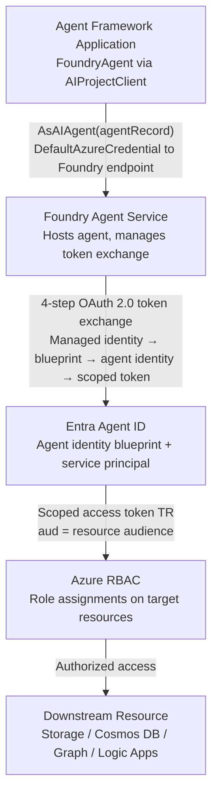

## Agent Framework Integration

Microsoft Agent Framework is the next-generation unified framework for building AI agents and
multi-agent workflows in .NET (C#) and Python. It is the successor to both **Semantic Kernel** and
**AutoGen**, combining AutoGen's simple agent abstractions with Semantic Kernel's enterprise
features — type-safe state management, middleware, telemetry, and extensive model support — and
adding graph-based workflows for explicit multi-agent orchestration with checkpointing and
human-in-the-loop support.

In the context of Entra identity, Agent Framework is the layer that determines *which credential
the agent runs under*. When a Foundry-backed agent is used, Agent Framework delegates identity
management entirely to Foundry Agent Service — including Entra Agent ID provisioning and the
runtime token exchange described in Section 04.

---

### Two Foundry provider agent types

Agent Framework's Foundry provider exposes two distinct agent types, both created via
`AIProjectClient.AsAIAgent(...)` but with fundamentally different identity models:

| | Class | Server-side resource | Versioned | Tools mutable | Entra identity |
|---|---|---|---|---|---|
| **Responses Agent** | `ChatClientAgent` | ❌ No | ❌ No | ✅ Yes | Calling application identity only |
| **Foundry Agent** | `FoundryAgent` | ✅ Yes | ✅ Yes | ❌ No | Application identity + optional Entra Agent ID |

Both are standard `AIAgent` instances and support all standard operations: sessions, tools,
middleware, and streaming.

#### `ChatClientAgent` (Responses Agent — model-only)

The application programmatically provides the model, instructions, and tools at runtime via
`AIProjectClient.AsAIAgent(model, name, instructions)`. No server-side agent resource is created —
everything is ephemeral.

**Identity:** the calling application's credential authenticates to the Foundry endpoint. No
separate Entra Agent ID is created for the agent. The agent inherits the hosting application's
identity for any resource access.

Best for rapid prototyping, flexible definitions, or cases where full control over the agent
lifecycle in code is required.

#### `FoundryAgent` (Foundry-backed — server-managed)

The agent definition lives in Foundry Agent Service, created via the portal or
`AgentAdministrationClient` and retrieved by name. Tools and instructions are **fixed** at creation
time — runtime modification is not supported.

**Identity:** Foundry can provision an Entra Agent ID (a dedicated service principal) for the
agent, allowing it to authenticate as its own identity, hold independent RBAC assignments, and
acquire tokens scoped to itself rather than the hosting application.

Best for versioned, production-grade agents managed centrally in the Foundry portal.

---

### Authentication: model-only agents (`ChatClientAgent`)

For `ChatClientAgent`, authentication to Foundry is handled entirely by the `AIProjectClient`
credential. `DefaultAzureCredential` is the standard choice:

```csharp
// Development — Azure CLI credential
AIAgent agent = new AIProjectClient(
        new Uri("https://your-foundry-service.services.ai.azure.com/api/projects/your-project"),
        new AzureCliCredential())
    .AsAIAgent(
        model: "gpt-4o-mini",
        instructions: "You are a friendly assistant. Keep your answers brief.");

Console.WriteLine(await agent.RunAsync("What is the largest city in France?"));
```

`DefaultAzureCredential` probes a chain at runtime: environment variables → workload identity →
managed identity → Visual Studio → VS Code → Azure CLI → Azure PowerShell. In production, prefer
`ManagedIdentityCredential` directly to avoid credential-probe latency and unintended fallback:

```csharp
var aiProjectClient = new AIProjectClient(
    new Uri("<your-foundry-project-endpoint>"),
    new ManagedIdentityCredential());
```

---

### Authentication: Foundry-backed agents (`FoundryAgent`)

Retrieve the server-managed agent definition by name and wrap it with `AsAIAgent(...)`:

```csharp
using Azure.AI.Projects;
using Azure.AI.Projects.Agents;
using Azure.Identity;
using Microsoft.Agents.AI;
using Microsoft.Agents.AI.Foundry;

var aiProjectClient = new AIProjectClient(
    new Uri("<your-foundry-project-endpoint>"),
    new DefaultAzureCredential());

// Retrieve existing server-side agent by name (uses latest version automatically)
ProjectsAgentRecord agentRecord = await aiProjectClient
    .AgentAdministrationClient
    .GetAgentAsync("MyAgent");

FoundryAgent agent = aiProjectClient.AsAIAgent(agentRecord);

Console.WriteLine(await agent.RunAsync("What can you help me with?"));
```

When this agent calls tools or downstream resources, Foundry Agent Service executes the 4-step
token exchange (see Section 04) using the agent's provisioned Entra Agent ID — not the calling
application's identity. The hosting application only needs sufficient permissions to reach the
Foundry endpoint; the agent identity governs all downstream resource access.

---

### Entra Agent ID provisioning via Foundry

Agent Framework code does not change between the shared and distinct identity states — Foundry
manages the identity lifecycle transparently.

- **Before publish:** the agent shares the project's shared agent identity (provisioned when the
  first agent was created in the project).
- **After publish:** Foundry creates a dedicated blueprint and distinct agent identity bound to the
  published agent application resource. The agent now holds its own Entra service principal with
  independent RBAC assignments.

The visible change is which `agentIdentityId` appears in the agent application's JSON view in the
Azure portal. All RBAC roles assigned to the shared identity must be re-assigned to the new
distinct identity after publishing.

---

### A2A integration and identity

Agent Framework supports A2A (Agent-to-Agent) protocol for hosting agents that can be called by
other agents. The `Microsoft.Agents.AI.Hosting.A2A.AspNetCore` package exposes an `AIAgent` via
`MapA2A(...)`:

```csharp
var agent = builder.AddAIAgent("assistant", instructions: "You are a helpful assistant.");

app.MapA2A(agent, path: "/a2a/assistant", agentCard: new()
{
    Name = "Assistant",
    Description = "A general-purpose assistant.",
    Version = "1.0"
});
```

When A2A endpoints are secured with Entra authentication, the calling agent's identity token is
validated before the request reaches the `AIAgent`. The A2A provider (for consuming remote agents)
uses the same `DefaultAzureCredential` chain to authenticate outbound calls.

---

### Provider identity support

| Provider | Auth mechanism | Separate Entra Agent ID |
|----------|---------------|-------------------------|
| **Microsoft Foundry** (Responses Agent) | `DefaultAzureCredential` to Foundry endpoint | ❌ Application identity only |
| **Microsoft Foundry** (Foundry Agent) | `DefaultAzureCredential` to Foundry; agent may have its own Entra Agent ID | ✅ Optional distinct agent identity |
| **Azure OpenAI** | `DefaultAzureCredential` or API key | ❌ |
| **OpenAI** | API key | ❌ |
| **Anthropic** | API key | ❌ |
| **Ollama** | None (local) | ❌ |
| **GitHub Copilot** | OAuth / GitHub token | ❌ |
| **Copilot Studio** | Entra / Azure AD | ❌ |

Only the Microsoft Foundry provider with a Foundry-backed `FoundryAgent` supports provisioning an
independent Entra Agent ID for the agent itself.

---

### Architecture: Agent Framework → Foundry → Entra Agent ID → downstream resource



The calling application authenticates to Foundry using the application's own credential. Once
inside Foundry, the agent's provisioned identity takes over for all downstream resource access —
the hosting application's credential never appears on calls to Storage, Cosmos DB, Graph, or other
target services.
