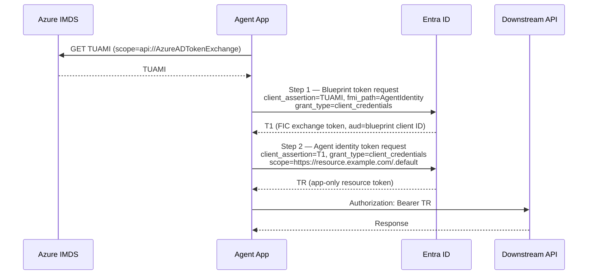
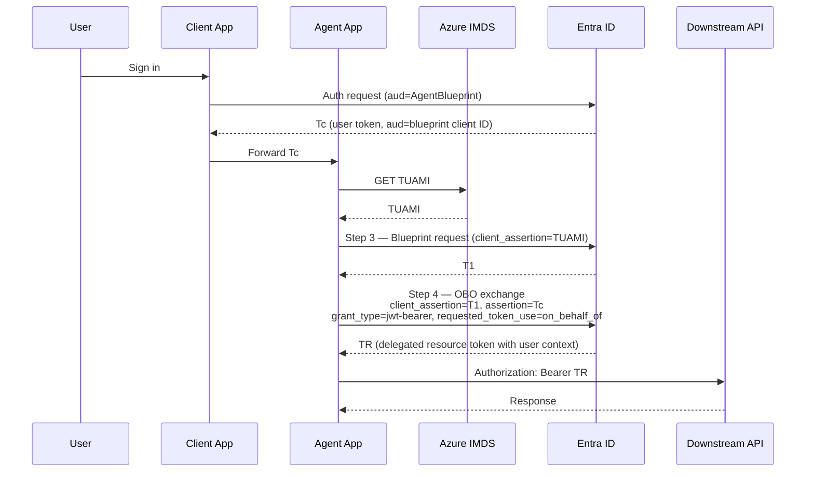
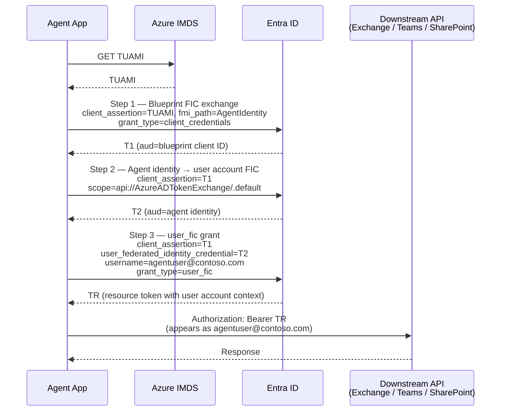

## Authentication Patterns & OAuth Flows

All agent authentication in Microsoft Entra Agent ID is built on OAuth 2.0 with specialized
**Federated Identity Credential (FIC)** token exchange patterns. There are no interactive flows,
no redirect URIs, and no public-client grants — every agent entity is a confidential client and
all token acquisition is fully programmatic.

Three primary operating modes determine which flow applies:

| Mode | Flow | When to use |
|------|------|-------------|
| **Autonomous** | App-Only / Client Credentials | Background jobs, scheduled tasks, system-to-system; no user involved |
| **On-Behalf-Of (OBO)** | OBO + FIC combination | User-initiated actions; agent acts on behalf of a signed-in user |
| **User-account impersonation** | Three-stage FIC chain with `user_fic` | Agent needs a mailbox, Teams presence, or other user-principal-only resource |

---

### The FIC chain concept

A **Federated Identity Credential (FIC)** is a trust relationship configured on an application or
user account that allows an external identity token to act as the credential — no shared secret
required between the entities in the chain.

In the agent model, the FIC chain establishes a cryptographically verifiable delegation pathway
from the compute environment all the way to the downstream resource:

```
User Assigned Managed Identity (UAMI)
    ↓  TUAMI  [UAMI's access token — scope: api://AzureADTokenExchange]
Agent Identity Blueprint
    ↓  T1     [FIC exchange token — aud: blueprint client ID]
Agent Identity
    ↓  TR     [app-only or delegated resource access token]   ← Flows 1 & 2
    ↓  T2     [second FIC exchange token — aud: agent identity]  ← Flow 3 only
Agent's User Account
    ↓  TR     [resource access token with user context]       ← Flow 3
```

All intermediate FIC exchange steps use the fixed scope `api://AzureADTokenExchange/.default`.
This signals to Entra ID that the resulting token (`T1`, `T2`) is a non-resource exchange
credential, not a resource access token.

#### How managed identity plugs into the chain

A **User Assigned Managed Identity (UAMI)** is configured as a federated identity credential on
the agent identity blueprint. Azure manages key rotation automatically — no secrets in code or
configuration. At runtime, the agent acquires `TUAMI` from the Azure Instance Metadata Service
(IMDS):

```
GET http://169.254.169.254/metadata/identity/oauth2/token
    ?api-version=2018-02-01
    &resource=api://AzureADTokenExchange
Metadata: true
```

`TUAMI` is submitted as `client_assertion` in the blueprint's token request (the first step of
every flow). The UAMI never directly accesses the downstream resource — it only authenticates the
blueprint to Entra ID. The agent identity — not the UAMI — is the principal that requires RBAC
role assignments on target resources.

Client secrets and certificates are alternative blueprint credential types but are explicitly
not recommended for production environments.

---

### Flow 1: Autonomous (App-Only / Client Credentials)

**When to use:** Fully autonomous agents with no user context — background processing, scheduled
jobs, proactive notifications, system-to-system orchestration. Tenant admins must pre-consent all
application permissions. The token subject is the agent identity.

#### Protocol sequence

**Step 1 — Blueprint acquires FIC exchange token T1:**

```http
POST /oauth2/v2.0/token
Content-Type: application/x-www-form-urlencoded

client_id=AgentBlueprint
&scope=api://AzureADTokenExchange/.default
&fmi_path=AgentIdentity
&client_assertion_type=urn:ietf:params:oauth:client-assertion-type:jwt-bearer
&client_assertion=TUAMI
&grant_type=client_credentials
```

`fmi_path=AgentIdentity` identifies which child agent identity the blueprint is impersonating.
Returns **T1** (`aud = blueprint client ID`).

**Step 2 — Agent identity exchanges T1 for an app-only resource token:**

```http
POST /oauth2/v2.0/token
Content-Type: application/x-www-form-urlencoded

client_id=AgentIdentity
&scope=https://resource.example.com/.default
&client_assertion_type=urn:ietf:params:oauth:client-assertion-type:jwt-bearer
&client_assertion={T1}
&grant_type=client_credentials
```

Entra ID validates `T1.aud == blueprint client ID` and issues **TR** (app-only resource token).



---

### Flow 2: On-Behalf-Of (OBO) — User Delegated

**When to use:** Agent acts as API middleware on behalf of a signed-in user. The resulting token
carries both user context and agent identity. Use when the agent should only see data the user is
already authorized to see.

#### Protocol sequence

**Step 1 — User authenticates with the client application:**
The calling client app obtains a user access token `Tc` scoped to the agent identity blueprint
(`aud = blueprint client ID`).

**Step 2 — Client forwards `Tc` to the agent.**

**Step 3 — Blueprint acquires T1** (identical to Flow 1, Step 1).

**Step 4 — Agent identity performs OBO exchange presenting both T1 and Tc:**

```http
POST /oauth2/v2.0/token
Content-Type: application/x-www-form-urlencoded

client_id=AgentIdentity
&scope=https://resource.example.com/scope1
&client_assertion_type=urn:ietf:params:oauth:client-assertion-type:jwt-bearer
&client_assertion={T1}
&grant_type=urn:ietf:params:oauth:grant-type:jwt-bearer
&assertion={Tc}
&requested_token_use=on_behalf_of
```

`client_assertion={T1}` proves the agent identity. `assertion={Tc}` carries the user context.

Entra ID validates both:

- `T1.aud == blueprint client ID`
- `Tc.aud == blueprint client ID`

Returns **TR** (delegated resource access token carrying user context).



**Background continuation with refresh tokens:** After the initial OBO exchange, the agent can
acquire an `AgentIdentityRefreshToken` and use it to continue background operations without
requiring the user to re-authenticate:

```http
POST /oauth2/v2.0/token

client_id=AgentIdentity
&scope=https://resource.example.com/scope1
&client_assertion_type=urn:ietf:params:oauth:client-assertion-type:jwt-bearer
&client_assertion={T1}
&grant_type=refresh_token
&refresh_token={AgentIdentityRefreshToken}
```

**`InheritDelegatedPermissions`:** When enabled on an agent identity, it inherits delegated
permissions from the parent blueprint. This reduces per-agent consent complexity in multi-instance
deployments. Inheritance applies only when FIC impersonation is used and only within tenant
boundaries.

---

### Flow 3: User Account Impersonation

**When to use:** The agent requires a user principal — a mailbox, Teams presence, or calendar.
The agent's user account is a dedicated Entra user (flagged as AI agent, not a human employee)
paired 1:1 with the agent identity. Systems such as Exchange and Teams require a user object
rather than a service principal.

This flow uses a **three-stage FIC chain**: blueprint → agent identity → agent's user account.

> **Critical constraint:** The same `client_id=AgentIdentity` must be used across both phase
> transitions (Steps 2 and 3) to prevent privilege escalation.

#### Protocol sequence

**Step 1 — Blueprint acquires T1** (identical to Flows 1 & 2, Step 1).

**Step 2 — Agent identity acquires T2 (agent identity → user account FIC):**

```http
POST /oauth2/v2.0/token
Content-Type: application/x-www-form-urlencoded

client_id=AgentIdentity
&scope=api://AzureADTokenExchange/.default
&client_assertion_type=urn:ietf:params:oauth:client-assertion-type:jwt-bearer
&client_assertion={T1}
&grant_type=client_credentials
```

Entra ID validates `T1.aud == blueprint client ID` and issues **T2** (`aud = agent identity`).

**Step 3 — Agent identity acquires resource token impersonating the user account:**

```http
POST /oauth2/v2.0/token
Content-Type: application/x-www-form-urlencoded

client_id=AgentIdentity
&scope=https://resource.example.com/scope1
&client_assertion_type=urn:ietf:params:oauth:client-assertion-type:jwt-bearer
&client_assertion={T1}
&user_federated_identity_credential={T2}
&username=agentuser@contoso.com
&grant_type=user_fic
&requested_token_use=on_behalf_of
```

- `client_assertion={T1}` — agent identity still proves itself via T1.
- `user_federated_identity_credential={T2}` — the second FIC token proving delegation to the user
  account.
- `username=agentuser@contoso.com` — the UPN of the agent's user account.
- `grant_type=user_fic` — the agent-specific grant type for user account FIC.

Returns **TR** (resource token with user account context).



**Ownership constraint:** An agent's user account can be impersonated by exactly one agent
identity, which is owned by exactly one blueprint. The chain is strict: one blueprint → one agent
identity → one user account. A blueprint may own many agent identities, each with their own paired
user account.

---

### Token types reference

| Token | Symbol | Audience | Description |
|-------|--------|----------|-------------|
| UAMI token | `TUAMI` | `api://AzureADTokenExchange` | Managed identity token from IMDS; blueprint credential source |
| FIC exchange token (level 1) | `T1` | Blueprint client ID | Blueprint impersonating agent identity; used in all three flows |
| FIC exchange token (level 2) | `T2` | Agent identity | Agent identity impersonating user account; Flow 3 only |
| User access token | `Tc` | Blueprint client ID | User token from calling client app; Flow 2 only |
| App-only resource token | `TR` | Downstream resource | Final access token with agent identity context (Flows 1 & 3 autonomous steps) |
| Delegated resource token | `TR` | Downstream resource | Final access token carrying user context (Flow 2 and Flow 3 user step) |
| Agent identity refresh token | `AgentIdentityRefreshToken` | n/a | Enables background operations with preserved user context (Flow 2 continuation) |

---

### Supported and unsupported grant types

**Supported:**

| Entity | Grant type | Use case |
|--------|-----------|----------|
| Agent identity blueprint | `client_credentials` | Acquire FIC exchange token T1 (all flows) |
| Agent identity blueprint | `jwt-bearer` | OBO token exchange using incoming user token |
| Agent identity blueprint | `refresh_token` | Background user-delegated operations |
| Agent identity | `client_credentials` | App-only token (Flow 1); T2 FIC exchange (Flow 3, Step 2) |
| Agent identity | `urn:ietf:params:oauth:grant-type:jwt-bearer` | OBO with user context (Flow 2, Step 4) |
| Agent identity | `refresh_token` | Async continuation with user context (Flow 2 continuation) |
| Agent identity | `user_fic` | User account impersonation (Flow 3, Step 3) |

**Not supported:**

| Flow / grant type | Reason |
|-------------------|--------|
| Authorization code flow (`/authorize`) | No interactive or redirect flows |
| Device code flow | Public client — not supported |
| ROPC (Resource Owner Password Credentials) | Public client — not supported |
| Implicit flow | No redirect URIs supported |
| Any public client flow | All agents must be confidential clients |
| OBO via `/authorize` endpoint | Not supported for agents |

---

### SDK recommendation

Microsoft recommends using the **Microsoft Entra SDK for Agent ID** — a containerized sidecar web
service that abstracts all token acquisition via a simple HTTP API — rather than implementing these
protocol flows directly. The sidecar handles IMDS token acquisition, FIC chaining, and OBO
exchange, and exposes a language-agnostic endpoint:

```http
# App-only (Flow 1)
GET /AuthorizationHeader/Graph?AgentIdentity=<agent-id-client-ID>
Authorization: Bearer <blueprint-token>

# User account impersonation (Flow 3)
GET /AuthorizationHeader/Graph?AgentIdentity=<agent-id-client-id>&AgentUsername=agentuser@contoso.com
Authorization: Bearer <blueprint-token>

# OBO (Flow 2) — validate user token first, then exchange
GET /Validate
Authorization: Bearer <user-token>

GET /AuthorizationHeader/Graph?AgentIdentity=<agent-client-id>
Authorization: Bearer <user-token>
```

`Microsoft.Identity.Web` is also recommended as an approved library when implementing flows within
.NET applications.
