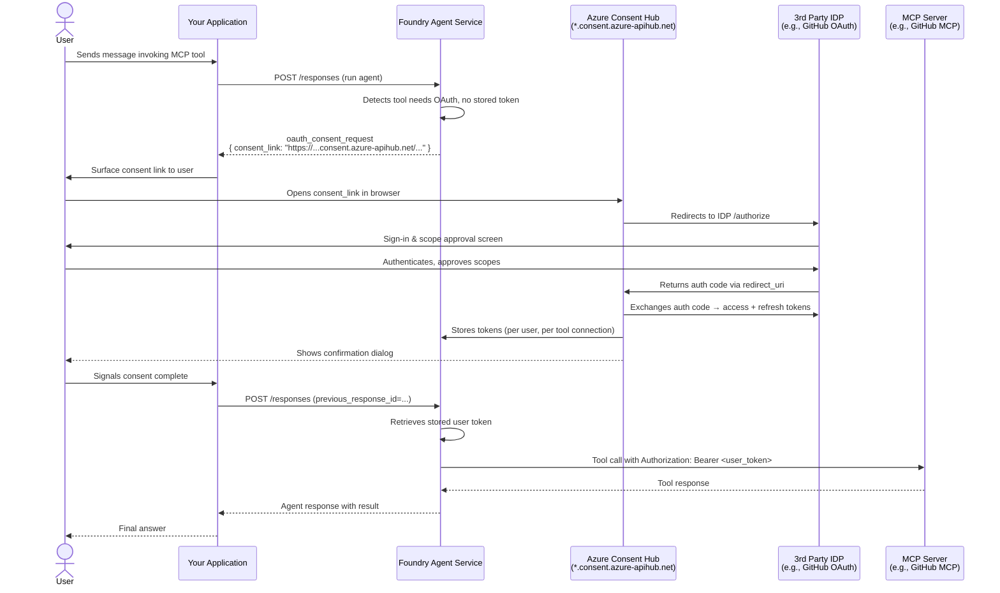

## 3rd Party MCP & Non-Entra IDP Scenarios

AI agents frequently need to cross identity trust boundaries — either because
the agent itself lives outside Azure, or because the MCP server it calls is
protected by a non-Microsoft identity provider. This section covers both
directions.

### Two Integration Directions

| Direction | Pattern | When it arises |
|---|---|---|
| Foundry agent → non-Entra MCP server | **OAuth Identity Passthrough** | Agent calls GitHub, Jira, Salesforce, or any SaaS MCP server whose IDP is not Entra ID |
| Non-Microsoft agent → Entra-protected API | **Sidecar / Auth SDK** | AWS Bedrock, n8n, or Ollama agent needs to call Microsoft Graph or Azure services |

The core challenge in both cases is the same: the two sides of the connection
live in different identity trust domains. There is no native token that works
in both.

---

## Pattern A: Foundry OAuth Passthrough (Custom OAuth App)

### What OAuth Identity Passthrough Is

OAuth Identity Passthrough is the Foundry Agent Service mechanism that allows a
prompt-based agent to call an MCP server whose IDP is *any* OAuth 2.0-compliant
provider — including GitHub OAuth, Okta, Auth0, or a custom authorization
server. This is **per-user** passthrough: each user of the agent must authorize
the connection using their own account with the third-party IDP. The agent
cannot use a shared service account — it preserves real user identity through to
the downstream service.

Foundry supports two sub-variants:

| Sub-variant | Who manages the OAuth app | When to use |
|---|---|---|
| **Managed OAuth** | Microsoft or the MCP server publisher | Use when available — simplest setup, no app registration needed |
| **Custom OAuth** | You register an app with the third-party IDP | Required for non-Microsoft IDPs, or when you need specific scopes or branding |

### How the Consent Flow Works

When a user first triggers a tool backed by an OAuth-protected MCP server,
Agent Service has no stored token for that user with the third-party IDP. Rather
than silently failing, it surfaces a consent request:

1. Agent Service detects the tool requires OAuth authorization and has no stored token.
2. The Responses API returns an `oauth_consent_request` item in `response.output_item`:

```json
{
  "type": "oauth_consent_request",
  "id": "oauthreq_10b0f026610e2b76006981547b53d481...",
  "consent_link": "https://logic-swedencentral-001.consent.azure-apihub.net/login?data=xxxx"
}
```

3. Your application surfaces the `consent_link` URL to the user (in the chat UI
   as a clickable link or button).
4. The user follows the link and signs in to the **third-party IDP** (GitHub,
   Okta, etc.) — not to Entra ID. They review and approve the requested scopes.
5. Agent Service completes the OAuth authorization code exchange via the consent
   hub and **securely stores** the resulting access token and refresh token.
6. Your application re-submits the conversation referencing the previous response ID:

```python
# Requires: azure-ai-projects >= 2.0.0
from azure.ai.projects import AIProjectClient
from azure.identity import DefaultAzureCredential

response = client.responses.create(
    previous_response_id="YOUR_PREVIOUS_RESPONSE_ID",
    input=user_input,
    extra_body={
        "agent_reference": {"name": agent.name, "type": "agent_reference"},
        "tool_choice": "required",
        "stream": True
    },
)
```

7. Agent Service retrieves the stored token and calls the MCP server. On future
   requests from the same user to the same tool connection in the same project,
   no re-prompt occurs. Tokens are refreshed automatically when `offline_access`
   is included in the scopes.

### Configuration Fields for Custom OAuth Apps

When configuring a Custom OAuth MCP connection in the Foundry portal (**Tools >
Custom > MCP > OAuth Identity Passthrough > Custom OAuth**):

| Field | Required? | Description |
|---|---|---|
| `Client ID` | Yes | OAuth application ID from your IDP app registration |
| `Client Secret` | Conditional | Required by most providers; depends on app type |
| `Auth URL` | Yes | Authorization endpoint where users sign in and approve scopes |
| `Token URL` | Yes | Token endpoint where Agent Service exchanges the auth code for tokens |
| `Refresh URL` | Yes | Endpoint to refresh expired access tokens (can be the same as `Token URL`) |
| `Scopes` | Recommended | Permissions to request; **always include `offline_access`** to enable automatic silent refresh |

**Critical post-setup step:** After saving the configuration, Foundry generates a
**redirect URL**. You *must* add this URL to your OAuth app registration's allowed
redirect URIs before any user can complete the consent flow. Without it the
authorization code redirect will fail and no token will be issued.

### The Consent Hub Infrastructure

The `consent_link` hostname (`*.consent.azure-apihub.net`) is part of the Azure
API Management / Logic Apps consent infrastructure. Foundry intermediates the
authorization code exchange through this infrastructure — the IDP redirect goes
to Azure's consent hub, not back to your application directly. This is why the
redirect URL you register with your OAuth app is a Foundry/Azure-owned endpoint,
not your own service URL.

### Key Constraints

| Constraint | Detail |
|---|---|
| **Cross-tenant** | The user's Entra tenant must match the Foundry project's tenant. This restricts the Entra consent infrastructure — not the third-party IDP sign-in itself. |
| **`offline_access` scope** | Without it, Agent Service cannot refresh expired tokens and must re-prompt users after each token expiry. |
| **Foundry User role** | Users must have at least the Foundry User role on the project to complete the consent flow. |
| **Declined consent** | If the user declines, the MCP tool call fails. Handle this gracefully — surface a clear message. |
| **Refresh token expiry** | If a user is inactive long enough that their refresh token expires, they must re-consent. |

### Full OAuth Consent + Token Flow



---

## Pattern B: Sidecar Pattern for Non-Microsoft Agents

The sidecar pattern is the **inverse direction**: the agent lives outside Azure
(AWS Bedrock, n8n, Ollama, a containerized LangGraph agent) but needs to call
Microsoft APIs protected by Entra ID (Microsoft Graph, Azure services, or custom
Entra-protected APIs).

The **Microsoft Entra Auth SDK** runs as a companion container on the same
Docker bridge network or Kubernetes pod as the agent. The agent never handles
credentials or talks to Entra ID directly. It calls the sidecar's HTTP endpoint
to get a ready-to-use `Authorization` header:

```
GET /AuthorizationHeader/{serviceName}?AgentIdentity={agentId}
```

The sidecar acquires and caches tokens using the blueprint's OAuth credentials,
handles refresh automatically, and returns the bearer value directly. The agent
appends this to its downstream API call unchanged.

**Three-container reference topology (AWS Bedrock sample):**

| Container | Role | Network exposure |
|---|---|---|
| `llm-agent-aws` | Flask chat UI + LangGraph ReAct agent + Amazon Bedrock (Claude) | Port 3001 exposed to host |
| `agent-id-sidecar-aws` | Microsoft Entra Auth SDK — acquires and caches agent tokens | Internal only (Docker bridge) |
| `weather-api-aws` (or target API) | Downstream API validating the JWT on every request | Internal only (Docker bridge) |

### Sidecar vs Workload Identity Federation (WIF)

| Approach | Mechanism | Best for |
|---|---|---|
| **Sidecar** | Companion container; agent calls HTTP endpoint for auth header | Any cloud or on-prem; universally applicable |
| **WIF** | External OIDC token (AWS STS, GCP Workload Identity) exchanged directly for Entra token | Agents already using native OIDC federation; no extra container |

Both approaches avoid storing Entra credentials inside the non-Microsoft agent.
WIF is simpler when native OIDC is available; the sidecar is more universal.

---

## Scenario Walkthrough: Foundry Agent Calling a GitHub MCP Server

*Full end-to-end narrative using Pattern A.*

A Foundry prompt-based agent is deployed to help an enterprise developer team
query issues, pull requests, and repository data. The GitHub MCP server is
protected by GitHub OAuth — it does not accept Entra ID tokens.

**Why per-user tokens are required here:** Each developer should see only the
GitHub repositories and organizations they personally have access to. A shared
service account token would be either over-privileged (all repos in the org) or
under-privileged (missing personal repos). OAuth passthrough preserves the
correct access boundary.

### One-Time Setup (Agent Operator)

1. Register a **GitHub OAuth App** at `github.com/settings/developers`.
   Note the Client ID and Client Secret. Leave the redirect URI blank initially.
2. In the Foundry portal → **Tools > Custom > MCP**:
   - Provide the MCP server endpoint URL and a unique connection name.
   - Authentication: **OAuth Identity Passthrough > Custom OAuth**.
   - Fill in the fields:
     - `Client ID` and `Client Secret` from step 1
     - `Auth URL`: `https://github.com/login/oauth/authorize`
     - `Token URL`: `https://github.com/login/oauth/access_token`
     - `Refresh URL`: `https://github.com/login/oauth/access_token`
     - `Scopes`: `repo read:org offline_access`
3. After saving, copy the Foundry-generated **redirect URL**.
4. Return to the GitHub OAuth App settings and add the redirect URL to
   "Authorization callback URL".
5. Associate the MCP connection with the agent via `project_connection_id`.

### First Use (Per User)

The first time a developer invokes the agent with a GitHub-related query, Agent
Service returns an `oauth_consent_request`. The application surfaces the
`consent_link` as a clickable link in the chat response. The developer clicks
it, authenticates with their GitHub account, and approves the requested scopes.
Agent Service stores the GitHub access token and refresh token, then resumes the
conversation automatically.

### Subsequent Uses

Completely transparent to the user. Agent Service retrieves the stored token,
refreshes it as needed, and passes it to the GitHub MCP server in every tool call.

---

## Security Considerations for Non-Entra IDPs

- **Token storage scope:** Agent Service stores tokens scoped to the connection name
  within the Foundry project. A user's token for one tool connection is not accessible
  to other tool connections or other projects.
- **Scope minimization:** Request the minimum scopes required. For GitHub, prefer
  `repo:status` and `read:org` over broad write access if read-only is sufficient.
- **Refresh token lifetime:** Third-party IDPs control refresh token expiry. Design
  applications to handle re-consent gracefully rather than treating it as a fatal error.
- **Project access and secret visibility:** Anyone with access to the Foundry project
  can read the configured Custom OAuth Client ID and Secret from the project connection.
  Restrict project membership and use dedicated least-privilege OAuth app registrations.
- **Cross-tenant boundary enforcement:** The consent infrastructure is tenant-scoped.
  Users in external tenants cannot complete the consent flow. Surface a clear error
  message rather than silently failing.
- **Third-party audit trail:** Actions taken on GitHub, Okta, or other third-party
  systems appear in those systems' audit logs under the *user's own account*, not under
  any agent identity. Document this explicitly in your security model so compliance
  reviewers understand the attribution chain.
