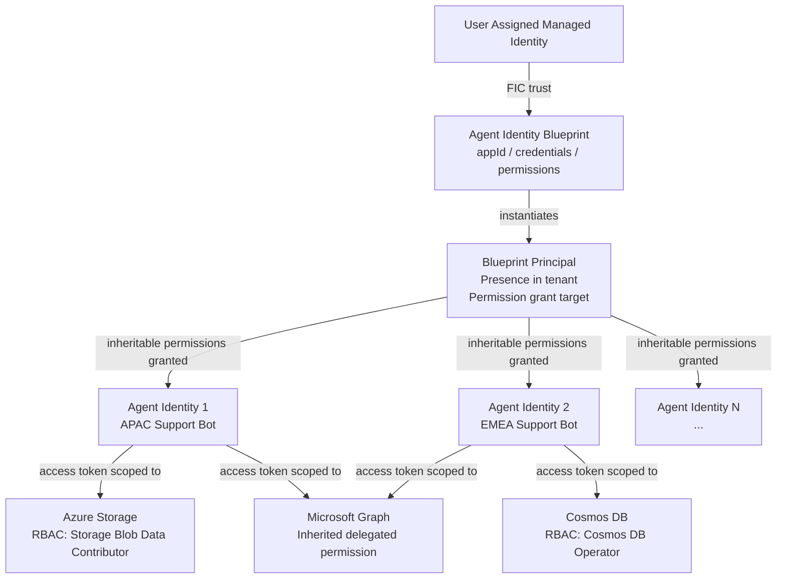

## Agent Identity Blueprint

The agent identity blueprint is the central governance object in Microsoft Entra
Agent ID. Every agent identity that exists in a tenant must come from a
blueprint. Understanding blueprints is required before any other aspect of Entra
Agent ID makes sense.

### What a Blueprint Is and Why It Matters

Like an architectural blueprint that encodes structural, electrical, and plumbing
details before any building is constructed, an agent identity blueprint encodes
authentication configuration, permissions, and lifecycle policy once — and all
agent identities created from it inherit those characteristics automatically.

**The problem it solves:** Organizations deploying multiple AI agents of the same
type (say, ten customer support agents across ten business units) need consistent
configuration. Without blueprints, each agent identity would need individual
credential management, separate permission grants, and its own lifecycle
operations. A single credential rotation would require ten separate updates.

With a blueprint:
- Credentials live on the blueprint, not on individual agent identities.
- Permissions consented at the blueprint level propagate automatically to all child
  agent identities (inheritable permissions).
- Disabling the blueprint stops *all* its agent identities from authenticating.
- Deleting the blueprint triggers automatic cleanup of all child agent identities.

**Key relationship:** One blueprint → N agent identities. An agent identity
belongs to exactly one blueprint; a blueprint may own many agent identities.

---

## Blueprint Object Model

The blueprint is an application object in Microsoft Entra ID with these properties:

| Property | Description |
|---|---|
| `displayName` | Human-readable name shown in the Entra admin center and audit logs |
| `description` | Brief summary of the agent's purpose and functions |
| `appId` | OAuth client ID — used to request access tokens from Entra ID |
| `identifierUris` | Array of URIs identifying the blueprint; must be set explicitly (e.g., `api://{appId}`) — **required for token acquisition to work** |
| `appRoles` | Roles that can be assigned to users and other principals when using the agent |
| `verifiedPublisher` | Organization that published the agent |
| `api.oauth2PermissionScopes` | OAuth2 scopes the blueprint exposes for incoming delegated requests |
| `requiredResourceAccess` | Declares APIs and permissions the agent needs (visible to admins during consent review) |
| `keyCredentials` / `passwordCredentials` | Certificate or secret credentials (on the blueprint only — never on agent identities) |
| `federatedIdentityCredentials` | Managed identity FIC trust (recommended for production) |
| `optionalClaims` | Controls which claims appear in access tokens |

**Special Graph permission on the blueprint:**
The blueprint holds `AgentIdentity.CreateAsManager` — the Graph permission that
authorizes the blueprint to create agent identities in the tenant. This permission
is what makes the blueprint the *authority* for its agent identities.

---

## Blueprint Principal

An **agent identity blueprint principal** is a separate object that must be
explicitly provisioned — creating the blueprint application does **not**
automatically create it.

```http
POST https://graph.microsoft.com/v1.0/servicePrincipals/microsoft.graph.agentIdentityBlueprintPrincipal
OData-Version: 4.0
Content-Type: application/json
Authorization: Bearer <token>

{
  "appId": "<agent-blueprint-app-id>"
}
```

The blueprint principal plays three roles in the trust chain:

1. **Token issuance traceability:** When the blueprint acquires tokens in a
   tenant, the resulting token's `oid` claim references the blueprint principal.
   All authentication by the blueprint is traceable back to this object.
2. **Audit logging:** Actions performed by the blueprint (creating agent
   identities, acquiring tokens) are recorded in Entra audit logs as being
   executed by the blueprint principal.
3. **Permission grant target:** Admins grant permissions *on the blueprint
   principal*. Those permissions can then be inherited by all agent identities
   in the tenant.

In multi-tenant scenarios, a blueprint principal exists in each customer tenant
that has added the blueprint. Removing the principal removes the blueprint from
that tenant.

---

## Inheritable Permissions vs Required Resource Access

The blueprint includes two distinct but related permission configurations that
are commonly confused:

### `requiredResourceAccess` — Declaration Only

- **What it is:** A declaration of the APIs and permissions the agent needs.
- **Who sees it:** Visible to administrators during the consent review workflow.
  It helps admins evaluate whether to approve the agent before deployment.
- **Does it grant permissions?** No. It is informational only. Admins must still
  explicitly consent.
- **Analogy:** The ingredient list on a food package — it tells you what's in
  it, it doesn't give you permission to eat it.

### Inheritable Permissions — Policy Propagation

- **What they are:** A configuration on the blueprint that defines which resource
  apps have permissions that automatically flow down to all agent identities.
- **How inheritance works:** When an administrator grants permissions on the
  blueprint principal from an "inheritable resource app," all agent identities
  created from that blueprint automatically receive those permissions. No
  per-identity consent is needed.
- **Does it grant permissions?** Still no — the admin must consent on the
  blueprint principal. But once consented, the permission propagates to every
  existing and future child agent identity automatically.
- **Analogy:** A company policy that says "all employees in this role get access
  to the HR system" — HR still controls access, but enrollment is automatic for
  anyone in the role.

| Dimension | `requiredResourceAccess` | Inheritable Permissions |
|---|---|---|
| Purpose | Governance visibility — what does this agent need? | Automatic permission propagation to all instances |
| Requires admin consent? | Yes, separate step | Yes, once on blueprint principal |
| Scope of effect | Informational | All child agent identities |
| Analogous to | App permission declaration on any app registration | Policy flowing to instances |

---

## Single-Tenant vs Multi-Tenant Blueprints

| Aspect | Single-Tenant | Multi-Tenant |
|---|---|---|
| Definition | Blueprint created in and used within the same tenant | Blueprint published for use by external customer tenants |
| Blueprint principal location | Same tenant as the blueprint application | Created in each adopting customer tenant |
| How customers add it | N/A (same tenant) | Customer adds blueprint to their tenant; Entra creates the blueprint principal automatically |
| How customers remove it | Delete the blueprint | Delete the blueprint principal from their tenant |
| Typical use case | Internal enterprise agents, first-party development | ISV agents, marketplace agents distributed via Microsoft catalogs |
| Admin center nav | Entra ID > Agents > Agent blueprints | Blueprint principal visible in each adopting tenant's directory |

In both tenancy models, a blueprint principal always exists in the tenant where
agent identities will be created. Its presence indicates the blueprint has been
provisioned and is authorized to create agent identities in that tenant.

---

## Creating a Blueprint: Step-by-Step

### Required Roles

| Role | Capabilities |
|---|---|
| **Agent ID Developer** | Create blueprints, principals, FICs — *cannot* add secrets/certs |
| **Agent ID Administrator** | Full access including secrets/certs |
| **Privileged Role Administrator** | Required to grant Graph *application* permissions |
| **Cloud Application Administrator** / **Application Administrator** | Required to grant Graph *delegated* permissions |

Blueprint creators are automatically set as owners of both the blueprint and the
blueprint principal. Owners can create agent identities without an Agent ID role.

### Option A: Admin Center Wizard

1. Sign in to [entra.microsoft.com](https://entra.microsoft.com/).
2. Navigate to **Entra ID > Agents > Agent blueprints**.
3. Select **New agent blueprint (Preview)**.
4. **Basics tab:** Enter the agent blueprint name → **Next**.
5. **Owners & Sponsors tab:**
   - Owners: users who can manage the blueprint.
   - Sponsors: users, dynamic groups, or Microsoft 365 groups accountable for
     the agent. Security groups and role-assignable groups are **not supported**.
6. **Next** → review → **Create**.

> **Limitation:** The wizard sets name, owners, and sponsors only. Credentials,
> identifier URIs, scopes, and permissions must be configured separately via
> Graph API or the blueprint's detail pages.

### Option B: Microsoft Graph API (Full Programmatic Workflow)

**Step 1 — Create the blueprint:**

```http
POST https://graph.microsoft.com/v1.0/applications/
OData-Version: 4.0
Content-Type: application/json
Authorization: Bearer <token>

{
  "@odata.type": "Microsoft.Graph.AgentIdentityBlueprint",
  "displayName": "Contoso Support Agent Blueprint",
  "sponsors@odata.bind": [
    "https://graph.microsoft.com/v1.0/users/<sponsor-user-object-id>"
  ],
  "owners@odata.bind": [
    "https://graph.microsoft.com/v1.0/users/<owner-user-object-id>"
  ]
}
```

Record the `appId` from the response.

**Step 2 — Configure credentials (managed identity FIC — recommended):**

```http
POST https://graph.microsoft.com/v1.0/applications/<blueprint-obj-id>/microsoft.graph.agentIdentityBlueprint/federatedIdentityCredentials
OData-Version: 4.0
Content-Type: application/json
Authorization: Bearer <token>

{
  "name": "contoso-support-agent-mi",
  "issuer": "https://login.microsoftonline.com/<tenant-id>/v2.0",
  "subject": "<managed-identity-principal-id>",
  "audiences": ["api://AzureADTokenExchange"]
}
```

**Step 3 — Set identifier URI and scope:**

```http
PATCH https://graph.microsoft.com/v1.0/applications/<blueprint-obj-id>
OData-Version: 4.0
Content-Type: application/json
Authorization: Bearer <token>

{
  "identifierUris": ["api://<blueprint-app-id>"],
  "api": {
    "oauth2PermissionScopes": [{
      "adminConsentDescription": "Access this agent on behalf of the signed-in user.",
      "adminConsentDisplayName": "Access agent",
      "id": "<new-guid>",
      "isEnabled": true,
      "type": "User",
      "value": "access_agent"
    }]
  }
}
```

**Step 4 — Create the blueprint principal (mandatory, separate step):**

```http
POST https://graph.microsoft.com/v1.0/serviceprincipals/microsoft.graph.agentIdentityBlueprintPrincipal
OData-Version: 4.0
Content-Type: application/json
Authorization: Bearer <token>

{
  "appId": "<blueprint-app-id>"
}
```

---

## Common Pitfalls

These are real failure modes documented in the AI-guided setup experience:

| # | Pitfall | Symptom | Fix |
|---|---|---|---|
| 1 | **`OData-Version: 4.0` header missing** | API silently creates a standard app registration instead of a blueprint — no error | Always include the header; use typed endpoints (`/applications/microsoft.graph.agentIdentityBlueprint`) |
| 2 | **Blueprint principal not created** | `400: The Agent Blueprint Principal for the Agent Blueprint does not exist` on all agent identity operations | Explicitly POST to `servicePrincipals/microsoft.graph.agentIdentityBlueprintPrincipal` after blueprint creation |
| 3 | **Sponsors not specified** | `400: No sponsor specified` | Sponsors must be users, dynamic groups, or Microsoft 365 groups — not security groups or role-assignable groups |
| 4 | **Permission propagation delay** | 403 errors immediately after granting admin consent | Implement retry with exponential backoff (20–120 seconds); disconnect and reconnect `Connect-MgGraph` for fresh token |
| 5 | **Password credentials on agent identity** | `PropertyNotCompatibleWithAgentIdentity` | All credentials must be on the blueprint, not on agent identities |
| 6 | **Identifier URI not set** | Token acquisition fails with scope resolution errors | PATCH blueprint to set `identifierUris: ["api://{appId}"]` |
| 7 | **Wrong FIC endpoint path** | FIC operations fail | Use `/applications/{blueprint-obj-id}/microsoft.graph.agentIdentityBlueprint/federatedIdentityCredentials` |
| 8 | **`DefaultAzureCredential` / `az login` token used** | 403 error — includes `Directory.AccessAsUser.All` claim | Use `Connect-MgGraph` with explicit delegated scopes or a dedicated app with `client_credentials` |
| 9 | **Issuer mismatch in token validation** | Token validation rejects issued tokens | Accept both `https://sts.windows.net/{tenant-id}/` (v1.0) and `https://login.microsoftonline.com/{tenant-id}/v2.0` (v2.0) |
| 10 | **Credential lifetime policy violation** | Error setting `endDateTime` beyond the allowed maximum | Reduce `endDateTime` to comply with your organization's policy |

---

## Creating Agent Identity Instances from a Blueprint

Once the blueprint is set up, agent identities are created programmatically by
presenting the blueprint's credentials:

**Step 1 — Blueprint acquires access token using its credential:**

```http
POST https://login.microsoftonline.com/<tenant-id>/oauth2/v2.0/token
Content-Type: application/x-www-form-urlencoded

client_id=<blueprint-app-id>
&scope=https://graph.microsoft.com/.default
&client_assertion_type=urn:ietf:params:oauth:client-assertion-type:jwt-bearer
&client_assertion=<managed-identity-token>
&grant_type=client_credentials
```

**Step 2 — Create the agent identity:**

```http
POST https://graph.microsoft.com/v1.0/servicePrincipals/microsoft.graph.agentIdentity
OData-Version: 4.0
Content-Type: application/json
Authorization: Bearer <blueprint-token>

{
  "appId": "<blueprint-app-id>",
  "displayName": "Contoso Support Agent — APAC",
  "sponsors@odata.bind": [
    "https://graph.microsoft.com/v1.0/users/<sponsor-object-id>"
  ]
}
```

Record the `id` from the response — this is the `agentIdentityId` used for RBAC
role assignments on downstream resources.

**Step 3 — Assign RBAC roles on target resources:**

```bash
az role assignment create \
    --assignee "<agentIdentityId>" \
    --role "Storage Blob Data Contributor" \
    --scope "/subscriptions/<sub>/resourceGroups/<rg>/providers/Microsoft.Storage/storageAccounts/<sa>"
```

---

## Blueprint Lifecycle Management

| Operation | Effect |
|---|---|
| **Update blueprint credentials** | All agent identities that use this blueprint's FIC chain immediately use the new credential on the next token acquisition |
| **Disable blueprint** | All agent identities stop authenticating — prevents any child from acquiring tokens |
| **Delete blueprint** | Triggers automatic cleanup of all child agent identities in the tenant |
| **Remove blueprint principal** (multi-tenant) | Removes the blueprint from the adopting customer tenant; stops all child agent identities in that tenant |
| **Update permissions** | Re-grant permissions on the blueprint principal; inheritable permissions propagate to existing child identities automatically |

---

## Blueprint → Identity → Permissions: Structural Diagram



The managed identity authenticates the blueprint; the blueprint principal is the
consent and audit anchor; each agent identity is the least-privilege principal
that actually touches downstream resources.
