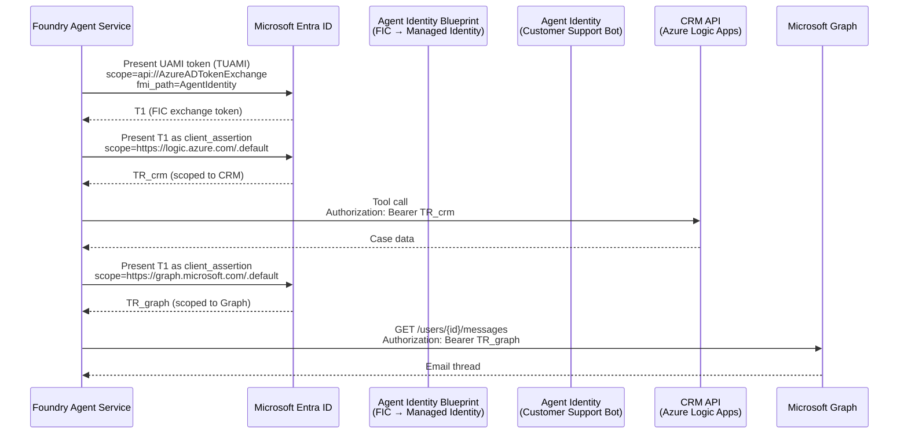
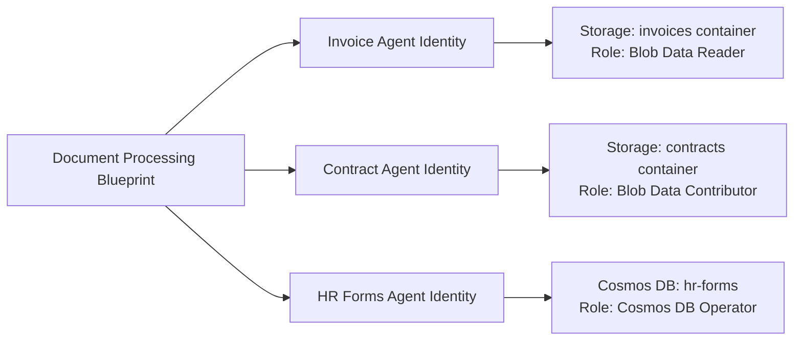
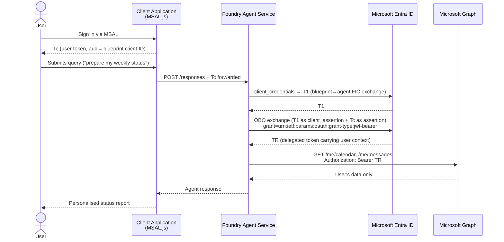
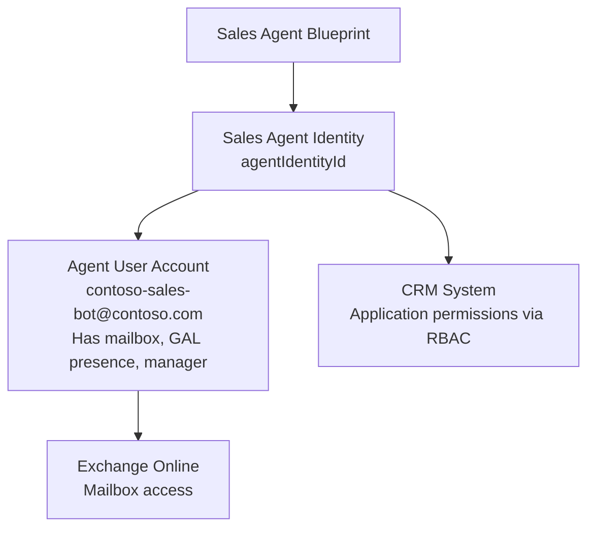
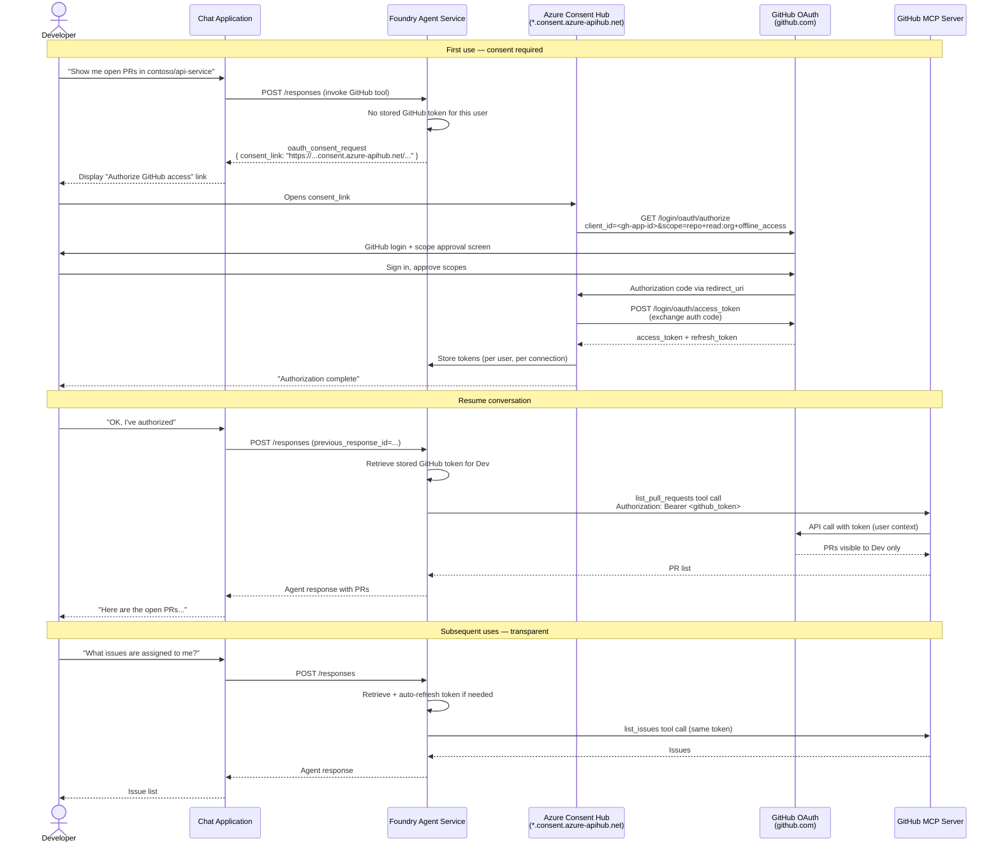
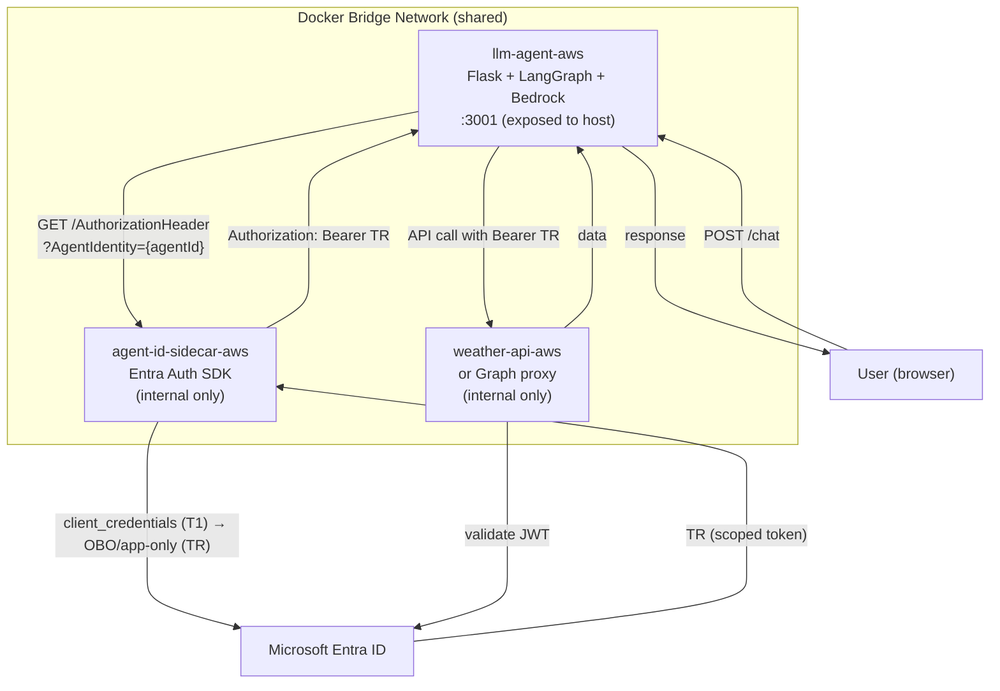

## Real-World Scenarios & Architecture Diagrams

This section walks through seven concrete scenarios that cover the breadth of
Entra Agent ID usage patterns. Each scenario includes the identity model decision
rationale and an architecture or sequence diagram.

---

## Scenario 1: Customer Support AI Agent (Singleton Autonomous)

*A single Foundry-hosted agent that handles customer support enquiries, calling a
CRM API and Microsoft Graph to look up case history and customer data.*

### Who / What / Why

An enterprise deploys one always-on support agent per region. The agent acts
autonomously (no human user context required) — it calls the internal CRM REST
API and Microsoft Graph to read customer records, send emails, and update tickets.
There is no per-user token: the agent acts entirely under its own authority.

### Identity Model Decision

**Use: One blueprint → one agent identity (singleton autonomous pattern).**

The singleton pattern is appropriate because there is a single agent instance
per deployment, and it always acts as itself (application-only, no user context).
A single blueprint provides governance infrastructure (Conditional Access,
audit logs, lifecycle management) with minimal overhead. Permissions are granted
directly on the agent identity.

The agent is published in Foundry → it gets a **distinct agent identity** with
its own `agentIdentityId`. RBAC roles are assigned to this identity on the CRM
API's backing Azure service and Microsoft Graph.

### Architecture Diagram



---

## Scenario 2: Document Processing Service (Domain Worker Pattern)

*Multiple concurrent agent instances processing documents in parallel — each
instance handles a different document type: invoices, contracts, and HR forms.*

### Who / What / Why

A finance operations team deploys three document-processing agents. All three
run in the same Kubernetes namespace, share the same codebase, and were built
by the same team. Each agent has a distinct role and needs access to different
Azure Storage containers and Cosmos DB collections. They run unattended and
concurrently.

### Identity Model Decision

**Use: One blueprint → multiple agent identities (domain worker pattern).**

A single blueprint is appropriate because all three agents share the same trust
boundary (same namespace, same team, same security posture). Using one blueprint
simplifies credential management and allows shared baseline permissions via
inheritable permissions.

Each agent gets its own `agentIdentityId` so:
- Actions can be attributed to the specific agent in audit logs.
- Each identity holds only the permissions it needs (least-privilege per role).
- A compromise of one identity does not grant access to sibling identities' resources.



---

## Scenario 3: HR Orchestrator + Specialist Workers (Ephemeral Identities)

*An orchestrator agent receives an HR request, dynamically spins up specialist
workers for salary benchmarking, compliance checking, and HRIS updates, then
tears them down when the task completes.*

### Who / What / Why

An HR automation platform routes complex requests through a central orchestrator
that coordinates specialist sub-agents. The specialist agents run on different
platforms and are maintained by different teams (compliance team, HRIS team),
so they cross trust boundaries. The orchestrator creates ephemeral identities
for coordination tasks that require specific minimum-privilege access.

### Identity Model Decision

**Use: Multiple blueprints (orchestrator + separate blueprint per trust boundary).**

Because domain workers cross trust boundaries (separate runtimes, separate
teams, different secrets), they require separate blueprints. Blueprint
credentials are scoped to their trust domain — a compromise in one does not
affect peer agents.

For short-lived coordination tasks, the orchestrator creates an **ephemeral agent
identity** at runtime: it inherits baseline permissions from the blueprint,
gets the exact permissions needed for the task, and is deleted when the session ends.

> Trade-off: Ephemeral identity creation adds nondeterministic latency at
> runtime. Evaluate for latency-sensitive workflows before adopting this pattern.

```mermaid
flowchart TD
    BPOrch[Orchestrator Blueprint]
    BPComp[Compliance Blueprint\n(Compliance Team)]
    BPHRIS[HRIS Blueprint\n(HRIS Team)]

    OrcAI[Orchestrator Agent Identity]
    EphAI[Ephemeral Agent Identity\ncreated at runtime]
    CompAI[Compliance Agent Identity]
    HRISAI[HRIS Agent Identity]

    BPOrch --> OrcAI
    BPOrch -->|creates at runtime| EphAI
    BPComp --> CompAI
    BPHRIS --> HRISAI

    OrcAI -->|A2A auth: spawns task| CompAI
    OrcAI -->|A2A auth: spawns task| HRISAI
    EphAI -->|minimum-privilege resource access| ExtAPI[External HR Data API]
    OrcAI -->|deletes on session end| EphAI
```

---

## Scenario 4: User-Facing Copilot (Per-User Pattern, OBO Flow)

*A department-level copilot with one agent identity per business unit. Each
instance acts on behalf of the signed-in user — accessing only their own data
in SharePoint, Teams, and internal APIs.*

### Who / What / Why

A consulting firm deploys a work copilot that reads the signed-in consultant's
calendar, project documents, and Teams messages to generate status reports.
Because the agent operates on user-owned data, it must carry the user's
delegated permissions — not broad application-level access. Each department runs
its own agent instance to provide independent audit trails and lifecycle control.

### Identity Model Decision

**Use: One blueprint → one agent identity per department (per-user OBO pattern).**

Each department's agent identity can be independently disabled without affecting
others. Permissions are inherited from the blueprint baseline plus department-specific
resource grants. The OBO flow ensures the agent can only access what the signed-in
user is authorized to see.

### OBO Token Flow



The OBO token TR carries both the agent identity and the user's delegated
permissions. Microsoft Graph enforces the user's own access boundaries —
the agent cannot access data the user does not have permission to see.

---

## Scenario 5: Automated RPA Agent (Digital Worker with User Account)

*A sales AI representative with its own Exchange mailbox that receives, reads,
and responds to customer email, appears in the company directory, and is
assigned a human manager in the org chart.*

### Who / What / Why

A sales automation team wants to deploy an AI agent as a named sales
representative for a product line. The agent must have:
- An Exchange mailbox that customers can email directly (e.g., `contoso-sales-bot@contoso.com`).
- A presence in the Global Address List.
- A manager in the org chart for governance and approval routing.

A regular service principal cannot have a mailbox. This requires an **agent's
user account** — a special Entra user account created and owned exclusively by
one agent identity.

### Identity Model Decision

**Use: One blueprint → one agent identity → one agent's user account (digital worker pattern).**

The 1:1:1 chain is strict — an agent's user account can be paired with exactly
one agent identity. Each digital worker requires its own dedicated user account.
The agent's user account gets Exchange/Teams/OneDrive permissions; the agent
identity gets application-level permissions for other systems.



The three-stage FIC chain enables the agent identity to impersonate the user
account at runtime (see Section 06 for the `user_fic` flow details). The agent
can read/send email as `contoso-sales-bot@contoso.com` while maintaining a clear
identity separation from any human employee.

---

## Scenario 6: Foundry Agent Calling GitHub MCP Server (OAuth Passthrough)

*A Foundry prompt-based agent that helps developers query GitHub issues and pull
requests. The GitHub MCP server uses GitHub OAuth — not Entra ID.*

### Who / What / Why

An enterprise developer team uses a Foundry agent to surface GitHub data
(issues, PRs, code search) in their internal chat interface. Each developer
should see exactly the repositories they personally have access to — not a
shared token with broader permissions. The GitHub MCP server authenticates using
GitHub OAuth 2.0.

### Identity Model Decision

**Use: Foundry OAuth Identity Passthrough with Custom OAuth App (non-Entra IDP).**

Because GitHub OAuth does not accept Entra ID tokens, the Foundry agent cannot
use its own agent identity to authenticate to the GitHub MCP server. Instead,
each user authorizes the agent to act on their behalf using their own GitHub
account. Agent Service stores and manages the per-user GitHub tokens.

This preserves GitHub's own access control: if a developer leaves the company
and their GitHub access is revoked, the stored token immediately becomes invalid
— no separate agent permission needs to be removed.

### Full End-to-End Flow



### Configuration Reference

| Setting | Value |
|---|---|
| MCP server endpoint | GitHub MCP server URL |
| Auth type | OAuth Identity Passthrough > Custom OAuth |
| Auth URL | `https://github.com/login/oauth/authorize` |
| Token URL | `https://github.com/login/oauth/access_token` |
| Refresh URL | `https://github.com/login/oauth/access_token` |
| Scopes | `repo read:org offline_access` |
| Redirect URI | Foundry-generated (add to GitHub OAuth App callback URL) |

### What the GitHub MCP Server Sees

Every tool call from Agent Service carries the individual developer's GitHub
access token. The GitHub API enforces that developer's repository membership,
organization roles, and branch protection rules — the agent inherits the user's
exact permission set. There is no service account, no elevated access, and no
way for the agent to see repositories the developer cannot see.

---

## Scenario 7: AWS Bedrock Agent Calling Microsoft Graph (Sidecar Pattern)

*An AWS Bedrock (Claude) agent that answers questions about an enterprise's
Microsoft 365 data. The agent runs on AWS but needs to call Microsoft Graph.*

### Who / What / Why

A data analytics team has an existing AWS Bedrock workflow using Claude for
reasoning. They want to augment it with Microsoft 365 data (user profiles, team
memberships, SharePoint documents). The agent lives entirely on AWS — it cannot
use Azure Managed Identity. The sidecar pattern provides Entra authentication
without moving the agent to Azure.

### Identity Model Decision

**Use: Microsoft Entra Auth SDK sidecar companion container (Pattern B).**

The sidecar pattern is chosen over WIF because the team's AWS deployment does
not use OIDC federation today, and the sidecar can be added to the existing
Docker Compose stack with minimal changes. In production on Azure Container Apps
the sidecar uses a Managed Identity (`SignedAssertionFromManagedIdentity`) so no
secrets are stored.

### Architecture



### Three-Token Model

| Token | Held by | When issued |
|---|---|---|
| `Tc` | Signed-in user (MSAL.js in browser) | OBO flow only |
| `T1` | Sidecar — blueprint app credential | Both autonomous and OBO flows |
| `TR` | Agent identity scoped to downstream API | Both flows — passed to the downstream API |

**Autonomous flow:** Sidecar acquires T1 via client credentials → exchanges for
TR scoped to Graph. Agent calls Graph with TR.

**OBO flow:** Browser authenticates user via MSAL.js → Tc. Tc is passed to the
sidecar. Sidecar acquires T1 via client credentials, performs OBO exchange
(T1 + Tc → TR acting on behalf of the user).

### Sidecar Credential Configuration

| Environment | `AzureAd__ClientCredentials__0__SourceType` | Notes |
|---|---|---|
| Local development | `ClientSecret` | Set `BLUEPRINT_CLIENT_SECRET` in `.env` |
| Azure Container Apps (production) | `SignedAssertionFromManagedIdentity` | Zero secrets — Azure rotates keys automatically |
| Certificate from Key Vault | `KeyVault` | Suitable for on-prem or strict cert policies |

### Required Entra Objects

| Object | Purpose |
|---|---|
| Agent identity blueprint | App registration with FIC; sidecar authenticates as this |
| Agent identity | The agent's service principal; RBAC roles assigned here |
| (OBO only) SPA app registration | Client app for browser MSAL.js sign-in |

### Sample Repository

Reference implementation: `github.com/microsoft/entra-agentid-samples`

- `sidecar/aws/` — AWS Bedrock + Claude sample
- `sidecar/dev/` — Local LLM (Ollama) development edition
- `scripts/` — PowerShell to provision Blueprint, Agent Identity, SPA client
- `deploy/azure/container-apps/` — Production deployment to Azure Container Apps
- `n8n/` — n8n platform deployment on Azure Container Apps
