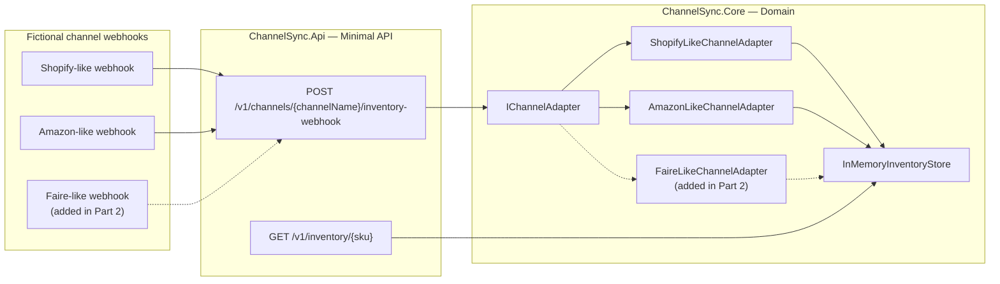

# ChannelSync — HVE-Core RPI Demo

A complete, copy-paste-ready walkthrough for demonstrating the HVE-Core **RPI** (Research → Plan → Implement → Review) workflow in GitHub Copilot. The scenario builds **ChannelSync** — a small, self-contained multi-channel inventory normalization service in the style of a fictional multi-channel inventory/order management SaaS platform, **Contoso Commerce**, running on Azure.

> **Disclaimer:** ChannelSync and Contoso Commerce are entirely fictional, from-scratch sample applications invented for demo purposes. They are not derived from, and have no dependency on, any real company's codebase, APIs, or confidential information. Every payload schema, channel name, and business rule in this document is invented.

---

> **Audience:** ISV partner engineering teams building multi-channel inventory or order management SaaS who want to see HVE-Core's RPI methodology take a service from an empty folder to a reviewed, tested feature — plus GitHub Backlog Manager turning review findings into tracked work.

---

## Scenario

Contoso Commerce's core value proposition is real-time stock visibility across every sales channel — Shopify, Amazon, Etsy, wholesale marketplaces, and more. ChannelSync mirrors that problem in miniature: it receives inventory webhooks from different channels, each with its own payload shape, and normalizes them into one canonical stock record.

This demo has three parts, each using HVE-Core's RPI workflow:

- **Part 1 — Bootstrap** — use RPI to scaffold ChannelSync from an empty solution into a working Minimal API with two channel adapters (Shopify-like, Amazon-like), an in-memory inventory store, and unit tests.
- **Part 2 — Live feature (the centerpiece)** — use the autonomous **RPI Agent** to add a **third** channel adapter — a Faire-like B2B wholesale marketplace — that must convert case-pack quantities into individual units. The audience sees a single agent run Research → Plan → Implement → Review → Discover in one session, discover the *exact* conventions Part 1 established, and follow them without improvising.
- **Part 3 — GitHub Backlog Manager** — turn the follow-up items the RPI Agent surfaced in Part 2 into tracked GitHub issues, then run Discovery → Triage → Sprint Planning → Execution against them.

**Total demo time:** ~45 minutes end to end. Part 1 can be pre-run before the audience arrives — see the [Quick Path](#quick-path-live-demo-only-25-minutes) below.

### Why this demo works for RPI

- **A real pattern to discover, not invent.** Part 1 establishes the `IChannelAdapter` contract and two concrete adapters. Part 2's Task Researcher must *find* that pattern in the codebase — this is the "12 existing modules use `resource_prefix`, not `prefix`" moment, live.
- **A genuine engineering wrinkle, not a copy-paste.** The Faire-like channel reports quantity in whole *cases*, not individual units, so the new adapter needs a real conversion rule and edge-case handling (zero/negative case size, fractional returns) — enough complexity to justify Research and Plan phases without turning into a marathon.
- **Multi-file, testable change.** The fix spans the adapter class, DI registration in `Program.cs`, and new unit tests — small enough to implement live in minutes, big enough that "just write the code" would visibly skip verification.
- **A natural bridge to Backlog Manager.** The RPI Agent's Review and Discover phases surface follow-up findings (no idempotency on webhook retries, no persistence, no rate limiting) that become real GitHub issues, which the Backlog Manager then discovers, triages, sprints, and executes against.

### Quick path (live demo only, ~25 minutes)

If you're short on time, pre-run Part 1 before your talk (or before the meeting starts) so the repo already has both adapters, then present only:

1. Part 0 — First Interaction (~2 min)
2. Part 2 — Live Faire-like adapter with the RPI Agent (~18 min)
3. Part 3 — GitHub Backlog Manager, Discovery + Triage only (~5 min)

---

## Architecture



---

## Prerequisites

### Software

| Tool | Version | Install |
|------|---------|---------|
| [VS Code Insiders](https://code.visualstudio.com/insiders/) | Latest | `winget install Microsoft.VisualStudioCode.Insiders` |
| [HVE-Core extension](https://marketplace.visualstudio.com/items?itemName=ise-hve-essentials.hve-core) | Latest | Install `ise-hve-essentials.hve-core` from the Marketplace |
| [GitHub Copilot](https://marketplace.visualstudio.com/items?itemName=GitHub.copilot) + [Copilot Chat](https://marketplace.visualstudio.com/items?itemName=GitHub.copilot-chat) | Latest | Installed in VS Code Insiders |
| [.NET SDK](https://dotnet.microsoft.com/download/dotnet/10.0) | 10.0+ | `winget install Microsoft.DotNet.SDK.10` |
| [Node.js](https://nodejs.org/) | 22+ | `winget install OpenJS.NodeJS.LTS` (needed for the `context7` MCP server) |
| [Git](https://git-scm.com/) | Latest | `winget install Git.Git` |
| [GitHub CLI](https://cli.github.com/) | Latest | `winget install GitHub.cli` |

Run `dotnet --version`, `node --version`, `git --version`, and `gh --version` in a PowerShell terminal to confirm before the talk. Sign in to GitHub CLI once with `gh auth login` and to GitHub in VS Code (required for the `github` MCP server and GitHub Backlog Manager).

### Why .NET 10 Minimal API

ChannelSync intentionally uses **.NET 10 Minimal API** over a full Clean Architecture solution — the domain is small enough that a two-project split (API + Core) satisfies SOLID and testability without YAGNI violations. This is also a good talking point: RPI's Research phase is where you'd catch a Copilot suggestion to over-engineer a four-project solution for a service this size.

---

## MCP server configuration

HVE-Core's `task-researcher` and `task-planner` agents use MCP tools for external documentation lookup (optional but recommended). GitHub Backlog Manager **requires** the `github` MCP server — it has no other way to read or mutate GitHub issues.

Create `.vscode/mcp.json` in the ChannelSync workspace root:

```jsonc
{
  "servers": {
    "agent-finder": {
      "type": "http",
      "url": "https://agentfinder.github.com/api/v1/mcp"
    },
    "context7": {
      "type": "stdio",
      "command": "npx",
      "args": ["-y", "@upstash/context7-mcp@latest"]
    },
    "microsoft-learn": {
      "type": "http",
      "url": "https://learn.microsoft.com/api/mcp/"
    },
    "microsoft-web-iq": {
      "type": "http",
      "url": "https://api.microsoft.ai/v3/mcp",
      "headers": {
        "x-apikey": "${input:webIqApiKey}"
      }
    },
    "github": {
      "type": "http",
      "url": "https://api.githubcopilot.com/mcp/"
    }
  },
  "inputs": [
    {
      "id": "webIqApiKey",
      "type": "promptString",
      "description": "Microsoft Web IQ API key",
      "password": true
    }
  ]
}
```

| Server | Purpose | Required for this demo? |
|---|---|---|
| `context7` | Library/SDK documentation lookup for Task Researcher | Optional — improves Part 1/2 research quality |
| `microsoft-learn` | Microsoft Learn documentation access (HVE-Core's own template names this server `microsoft-docs`; the key name doesn't need to match — agents use whatever MCP tools are available, not a literal config key) | Optional |
| `microsoft-web-iq` | Microsoft-internal web intelligence tool | Optional — **Microsoft-internal only**; requires an internal API key. Delete this block if presenting outside Microsoft or if you don't have access |
| `agent-finder` | Discover other installable Copilot skills/agents | Optional — not used by RPI directly, useful if the audience asks "what else is out there?" |
| `github` | GitHub issue/repo access | **Required for Part 3** (GitHub Backlog Manager) |

> **Azure DevOps alternative:** If your audience uses Azure DevOps instead of GitHub for backlog management, swap the `github` server for the `ado` server (`@azure-devops/mcp`) and use the `ado-prd-to-wit` agent's planning workflow instead of GitHub Backlog Manager in Part 3.
>
> See [MCP Configuration](https://microsoft.github.io/hve-core/docs/getting-started/mcp-configuration) for the exact `ado` server definition and required `ado_org`/`ado_tenant` inputs. Keep only one of `github` or `ado` configured — HVE-Core's own guidance is not to run both unless you genuinely work across platforms.

After creating the file, open the Output panel (**View → Output**, select **MCP Servers**) and confirm each configured server connects successfully.

---

## Setup

Run these commands in a PowerShell terminal.

### Step 1 — Create the project directory and scaffold the solution

```powershell
# Create a clean working directory for the demo
New-Item -ItemType Directory -Path "$env:USERPROFILE\demos\channelsync" -Force
Set-Location "$env:USERPROFILE\demos\channelsync"

git init
git checkout -b main

# Solution + three projects: Api (Minimal API), Core (domain), Core.Tests (MSTest)
dotnet new sln -n ChannelSync

dotnet new web -n ChannelSync.Api -o src/ChannelSync.Api
dotnet new classlib -n ChannelSync.Core -o src/ChannelSync.Core
dotnet new mstest -n ChannelSync.Core.Tests -o tests/ChannelSync.Core.Tests --test-runner Microsoft.Testing.Platform

dotnet sln add src/ChannelSync.Api/ChannelSync.Api.csproj
dotnet sln add src/ChannelSync.Core/ChannelSync.Core.csproj
dotnet sln add tests/ChannelSync.Core.Tests/ChannelSync.Core.Tests.csproj

dotnet add src/ChannelSync.Api/ChannelSync.Api.csproj reference src/ChannelSync.Core/ChannelSync.Core.csproj
dotnet add tests/ChannelSync.Core.Tests/ChannelSync.Core.Tests.csproj reference src/ChannelSync.Core/ChannelSync.Core.csproj

dotnet build
```

> **Why scaffold with `dotnet new` instead of asking Copilot to create projects?** Project scaffolding is mechanical and deterministic — there's no ambiguity for RPI to add value to. Reserve RPI for the parts that require judgment: the domain model, the adapter pattern, and the endpoints.

### Step 2 — Add a `.gitignore` and open in VS Code Insiders

```powershell
dotnet new gitignore
code-insiders .
```

Create `.vscode/mcp.json` as shown in [MCP server configuration](#mcp-server-configuration), then switch to the **GitHub Copilot Chat** panel. Everything from here happens in Copilot Chat unless a code block is explicitly marked PowerShell.

---

## Part 0 — First Interaction: verify HVE-Core (~2 minutes)

Confirm HVE-Core is installed and agents respond before diving into RPI.

1. Open GitHub Copilot Chat (`Ctrl+Alt+I`).
2. Click the agent picker dropdown and select **memory**.
3. Type:

    ```text
    Remember that I am demonstrating HVE-Core's RPI workflow using a new
    service called ChannelSync — a multi-channel inventory normalization
    service for a fictional company called Contoso Commerce. The current
    demo goal is adding a Faire-like wholesale channel adapter.
    ```

4. Open a **new** Copilot Chat thread and type:

    ```text
    Explain what this repository does.
    ```

The response should reference ChannelSync and the demo context without you repeating it — proving HVE-Core is installed, agents respond, and memory persists across sessions.

---

## Part 1 — Bootstrap ChannelSync with RPI (~15 minutes, or pre-run)

This full RPI cycle turns the three empty projects into a working service with two channel adapters. If you pre-run this before your talk, skip to [Part 2](#part-2--live-demo-add-the-faire-like-wholesale-adapter-18-minutes).

### Phase 1: Research

1. Type `/clear`.
2. Select **Task Researcher** from the agent picker.
3. Paste:

    ```text
    /task-research Design a .NET 10 Minimal API architecture for ChannelSync,
    a small service that receives inventory webhooks from multiple sales
    channels and normalizes them into one canonical stock record.

    Context:
    - src/ChannelSync.Api is an empty ASP.NET Core Minimal API project
    - src/ChannelSync.Core is an empty class library for domain logic
    - tests/ChannelSync.Core.Tests is an empty MSTest test project (using
      the Microsoft.Testing.Platform runner)
    - No database - inventory levels are held in memory for this demo
    - Two channels exist today: a Shopify-like channel and an Amazon-like
      channel, each with its own JSON webhook payload shape:

      Shopify-like payload:
      { "inventory_item_id": "gid://shopify/InventoryItem/48212",
        "sku": "WIDGET-RED-L", "available": 42,
        "location_name": "Auckland DC" }

      Amazon-like payload:
      { "asin": "B0FAKE1234", "sellerSku": "WIDGET-RED-L",
        "sellableQuantity": 17, "fulfillmentCenterId": "AKL1" }

      Both normalize to the same canonical shape: SKU, channel name,
      quantity (individual units), and an observed-at UTC timestamp.

    Research:
    1. Current .NET 10 Minimal API conventions - endpoint grouping via
       MapGroup, request/response DTOs, DI registration
    2. The Adapter/Strategy pattern in C# for normalizing heterogeneous
       payloads into one canonical model
    3. A project layout that separates Domain (Core) from Api following
       SOLID and Clean Code, without over-engineering (YAGNI) - this is a
       small demo service, not a full Clean Architecture solution
    4. MSTest 3.x/4.x conventions for testing adapter/strategy classes,
       including its built-in assertion APIs (Assert.Contains, HasCount,
       IsGreaterThan, and similar) in place of FluentAssertions

    Recommend ONE approach: the IChannelAdapter interface shape, how the two
    adapters and DI registration should be organized so a THIRD adapter can
    be added later by following the same pattern with minimal changes to
    existing code (Open/Closed Principle).
    ```

Let the researcher work (2-5 minutes). Point out the file citations once it references any existing project files, and that it commits to ONE recommended shape for `IChannelAdapter` rather than listing options.

### Phase 2: Plan

1. Type `/clear`.
2. Open the generated `.copilot-tracking/research/*-research.md` in the editor.
3. Select **Task Planner** and paste:

    ```text
    /task-plan research=...
    
    Focus on:
    - The IChannelAdapter interface and two adapters recommended in research
    - An in-memory InventoryStore (no database) keyed by SKU
    - Two Minimal API endpoints: POST /v1/channels/{channelName}/inventory-webhook
      and GET /v1/inventory/{sku}
    - Unit tests for both adapters covering normal and malformed payloads
    - DI registration in Program.cs
    ```

### Phase 3: Implement

1. Type `/clear`.
2. Open the generated `.copilot-tracking/plans/*-plan.instructions.md` in the editor.
3. Select **Task Implementor** and paste:

    ```text
    /task-implement plan=...
    ```

4. Confirm each tool call when prompted. Let it run to completion (`phaseStop=true` is fine — approve each phase).

### Phase 4: Review

1. Type `/clear`.
2. Select **Task Reviewer** and paste:

    ```text
    /task-review changes=...
    
    Review the ChannelSync bootstrap implementation completed today.
    ```

3. Confirm `dotnet build` and `dotnet test` both succeed (Task Reviewer runs these automatically as part of validation; re-run manually if you want the audience to see the terminal output directly).

### Commit and create the GitHub repository

```powershell
git add -A
git commit -m "Bootstrap ChannelSync with Shopify-like and Amazon-like adapters"

gh repo create channelsync-demo --private --source=. --remote=origin --push
```

Note the repository name (`<your-github-username>/channelsync-demo`) — Part 3 uses it.

---

## Part 2 — Live demo: add the Faire-like wholesale adapter (~18 minutes)

This is the centerpiece. Part 1 ran the four RPI phases as **separate agents** with a `/clear` between each — the clearest way to *see* each phase produce its own artifact. Part 2 shows the other way to run RPI: the **RPI Agent**, a single autonomous orchestrator that runs the whole workflow in one session and adds a fifth phase, **Discover**, that surfaces the follow-up work we carry into Part 3.

### RPI Agent vs. the four Task agents

Both approaches enforce the same Research → Plan → Implement → Review discipline. They differ in *who drives the phase transitions* and *how much ceremony each phase carries*.

| Aspect | Individual Task agents (Part 1) | RPI Agent (Part 2) |
|---|---|---|
| Invocation | Switch agent + `/task-research` → `/task-plan` → `/task-implement` → `/task-review` | Select **RPI Agent** once, describe the task |
| Context between phases | You type `/clear` and re-open the artifact before each phase | Managed automatically within one session |
| Phases | Four: Research → Plan → Implement → Review | Five: adds **Discover**, which proposes next work |
| Artifacts | Always writes research / plan / changes / review files | Writes `.copilot-tracking/` artifacts only when task *difficulty* warrants; simple and medium work stays in context |
| Subagents | You drive each agent yourself | Delegates to `Researcher Subagent` and `Phase Implementor` when difficulty is medium-hard or challenging |
| Iteration | You decide when to loop back | Iterates autonomously until the request is met, then runs Discover |
| Best for | Teaching the method; maximum step-by-step control | Day-to-day flow; letting the agent right-size the ceremony |

### How the RPI Agent decides what to do

The RPI Agent isn't just the four Task agents stitched together — it *assesses difficulty* first and scales its own behavior:

- **Simple / Medium** work stays in the agent's own context. It reasons through the phases without writing research or plan files and without spawning subagents — no ceremony you don't need.
- **Medium-hard / Challenging** work switches to the document-backed model: it writes the same `.copilot-tracking/` research, plan, details, changes, and review artifacts the individual agents produce, and delegates isolated investigation to `Researcher Subagent` and phase execution to `Phase Implementor`.
- Difficulty is **dynamic** — if implementation reveals more complexity than expected, the agent upgrades the task mid-run and switches to the heavier workflow automatically.

Adding a channel adapter that follows an established pattern is a good medium / medium-hard example: enough real logic (case conversion, edge cases, tests) to justify Research and Plan, but bounded enough that the agent can often complete it without the full document-backed ceremony.

> [!IMPORTANT]
> The RPI Agent delegates to subagents, so it requires a subagent tool (`runSubagent` or `task`) enabled in your Copilot chat settings. If neither is available it will say so. The individual Task agents in Part 1 do not have this requirement.

### The wrinkle that makes this a genuine feature, not a copy-paste

Faire-like wholesale orders report quantity in whole **cases**, not individual units, and each SKU has a `unitsPerCase` multiplier in the payload. The new adapter must convert cases to the canonical individual-unit quantity — a real piece of logic, with real edge cases (zero/negative `unitsPerCase`, missing case count, fractional case returns).

### Run the full cycle with one invocation

1. Type `/clear` to start from a clean session.
2. Select **RPI Agent** from the agent picker.
3. Paste the whole task — research intent, implementation, and test expectations in one prompt. The agent sequences the phases itself:

    ```text
    Add support for a new B2B wholesale marketplace channel called
    "Faire-like" to ChannelSync, following the existing channel adapter
    pattern.

    Faire-like webhook payload:
    { "productSku": "WIDGET-RED-L", "caseQuantity": 3,
      "unitsPerCase": 12, "warehouseCode": "AKL-WHOLESALE" }

    Requirements:
    - Add FaireLikeChannelAdapter matching the exact conventions used by the
      existing ShopifyLikeChannelAdapter and AmazonLikeChannelAdapter:
      naming, folder location, class visibility, DI registration in
      Program.cs, and MSTest test conventions in ChannelSync.Core.Tests
    - Convert caseQuantity * unitsPerCase into the canonical
      InventoryLevel.Quantity (individual units) without changing the
      IChannelAdapter contract
    - Handle edge cases: zero or negative unitsPerCase, missing caseQuantity,
      and fractional case quantities (e.g. a returned half-case)
    - Add MSTest unit tests: one normal case, one fractional-case return,
      one zero/negative unitsPerCase rejection, one missing caseQuantity
      rejection
    ```

4. Confirm tool calls when prompted, and use the handoff buttons the agent surfaces to steer it — **1️⃣ / 2️⃣ / 3️⃣** to pick a suggested item, **▶️ All** to run everything, **🔄 Suggest** to re-run Discover, and **💾 Save** to checkpoint the session.

### What to narrate while it runs

- **Difficulty call, up front.** Early in the Research phase the agent classifies the task. Point out that it *right-sizes* the workflow — it won't spin up a four-project ceremony for a bounded change.
- **One session, no `/clear`.** Unlike Part 1, you never switch agents or clear context. The agent carries Research → Plan → Implement → Review internally; `.copilot-tracking/` artifacts appear only if difficulty warrants them.
- **Pattern discovery, same as Part 1.** During Research it reads `ShopifyLikeChannelAdapter.cs` and `AmazonLikeChannelAdapter.cs`, cites their exact paths and line numbers, and matches the DI registration in `Program.cs` — it finds the existing pattern rather than inventing one.
- **Validation is built in.** The Implement phase runs `dotnet build` and `dotnet test` and iterates on failures before it will move to Review — you don't have to prompt it to fix a broken test.
- **The extra phase.** After Review passes, the Discover phase proposes follow-up work — the hook into Part 3.

### The Discover phase — a fifth phase the Task agents don't have

When Review passes, the RPI Agent runs **Discover** and presents a short, ranked list of follow-up work grounded in what it just built:

```markdown
## Suggested Next Work

Based on conversation history, artifacts, and codebase analysis:

1. **Webhook idempotency** — a retried delivery double-adjusts inventory because there is no deduplication key (High)
2. **Durable inventory store** — InventoryStore is in-memory only; all state is lost on restart (Medium)
3. **Webhook rate limiting** — protect the endpoint from a misbehaving channel integration (Medium)

> 1️⃣ Webhook idempotency | 2️⃣ Durable inventory store | 3️⃣ Webhook rate limiting

Reply with option numbers to continue, or describe different work.
```

Those three items are exactly what Part 3 turns into tracked GitHub issues. Rather than selecting a number here, we hand them to the GitHub Backlog Manager.

### Commit

```powershell
git add -A
git commit -m "Add Faire-like wholesale channel adapter"
git push
```

---

## Part 3 — GitHub Backlog Manager (~10 minutes)

Turn the follow-up items the RPI Agent surfaced in Part 2 (from its Review and Discover phases) into tracked GitHub issues, then run them through the full backlog pipeline. Replace `<owner>/channelsync-demo` below with the repository from Part 1's `gh repo create` step.

### Step 1 — Log the follow-up items (single issue workflow)

1. Type `/clear`.
2. Select **github-backlog-manager** from the agent picker.
3. Create each issue with a natural-language request (one at a time, clearing between if the agent picker resets):

    ```text
    Create a GitHub issue in <owner>/channelsync-demo titled "Webhook endpoint
    has no idempotency protection". Describe the risk: a retried delivery from
    any channel double-adjusts inventory because there is no deduplication key.
    Apply standard labels for a bug affecting the api area.
    ```

    ```text
    Create a GitHub issue in <owner>/channelsync-demo titled "InventoryStore is
    in-memory only". Describe that restarting the API loses all inventory
    state, and this needs a persistence follow-up before production use.
    Apply standard labels for an enhancement affecting the api area.
    ```

    ```text
    Create a GitHub issue in <owner>/channelsync-demo titled "No rate limiting
    on the inventory webhook endpoint". Describe the risk of a misbehaving
    channel integration overwhelming the endpoint. Apply standard labels for
    an enhancement affecting the api area.
    ```

### Step 2 — Discovery

```text
/clear
```

```text
Discover open issues assigned to me in <owner>/channelsync-demo
```

Task output lands in `.copilot-tracking/github-issues/discovery/<scope-name>/issue-analysis.md`. Open it and point out the categorized inventory.

### Step 3 — Triage

```text
/clear
```

```text
Triage all issues from my latest discovery pass for <owner>/channelsync-demo.
Apply the standard label taxonomy and flag any potential duplicates with
confidence scores above 70%.
```

Open `.copilot-tracking/github-issues/triage/<date>/triage-plan.md` and point out the 17-label taxonomy applied per issue with reasoning.

### Step 4 — Sprint planning

```text
/clear
```

```text
Plan the next sprint for <owner>/channelsync-demo using my latest triage
results. Create a new milestone called "v0.2 - Wholesale Channel Hardening"
for these three issues.
```

### Step 5 — Execution

```text
/clear
```

```text
Execute the sprint planning handoff for <owner>/channelsync-demo.
```

Review `.copilot-tracking/github-issues/sprint/<milestone-kebab>/handoff.md` before running this step — uncheck any recommendation you don't want applied. Execution only processes checked items, applies labels/milestones via the `github` MCP server, and marks each checkbox complete as it goes.

**Wrap-up point for the audience:** the follow-up items the RPI Agent surfaced in its Discover phase are now real, labeled, milestone-assigned GitHub issues — not a bullet point that got lost when the chat window closed.

---

## Demo wrap-up script

> "In about 45 minutes — or 25 if you pre-ran the bootstrap — we went from an empty solution to a reviewed, tested feature, and turned the review's own follow-up findings into a tracked sprint. Every step left an artifact: research, plan, changes, review, and now three GitHub issues on a real milestone. None of that lives only in chat history."

### Key takeaway

> "The Faire-like adapter is the important part to notice: the RPI Agent's research phase didn't invent a new pattern — it found the one we already had and matched it. That's the same discipline any inventory or order management SaaS team needs when a fourth, fifth, and twentieth marketplace integration shows up."

---

## Troubleshooting

| Problem | Solution |
|---|---|
| Agents not appearing in the picker | Reload window (`Ctrl+Shift+P` → *Developer: Reload Window*); confirm GitHub Copilot Chat is active |
| Task Planner refuses to proceed | Research document is missing or not open in the editor — re-run `/task-research` first |
| Task Implementor invents a different adapter shape | Context wasn't cleared before switching agents (Part 1) — `/clear` and re-open the plan file, then retry |
| RPI Agent reports a subagent tool is required | Enable `runSubagent` or `task` in Copilot chat settings, then re-run — the RPI Agent delegates to subagents for harder work |
| RPI Agent pauses mid-run | Use the handoff buttons it surfaces (**1️⃣ / 2️⃣ / ▶️ All**) to continue, or reply with what to do next |
| `github-backlog-manager` reports the GitHub MCP tool is unavailable | Verify `.vscode/mcp.json` exists in the workspace root and the `github` server shows connected in *View → Output → MCP Servers* |
| Discovery finds no issues | Confirm the three issues from Step 1 were created in `<owner>/channelsync-demo`, not a different repository |
| `dotnet build` fails after implementation | Let Task Reviewer's findings guide the fix, or say *"the review phase would catch this and the implementor would iterate"* and move on |
| Running short on time | Skip to the [Quick Path](#quick-path-live-demo-only-25-minutes) — pre-baked Part 1, live Part 2, Discovery + Triage only for Part 3 |

---

## Appendix: fictional payload reference

For quick copy-paste during the live demo.

**Shopify-like:**

```json
{
  "inventory_item_id": "gid://shopify/InventoryItem/48212",
  "sku": "WIDGET-RED-L",
  "available": 42,
  "location_name": "Auckland DC"
}
```

**Amazon-like:**

```json
{
  "asin": "B0FAKE1234",
  "sellerSku": "WIDGET-RED-L",
  "sellableQuantity": 17,
  "fulfillmentCenterId": "AKL1"
}
```

**Faire-like (added live in Part 2):**

```json
{
  "productSku": "WIDGET-RED-L",
  "caseQuantity": 3,
  "unitsPerCase": 12,
  "warehouseCode": "AKL-WHOLESALE"
}
```
