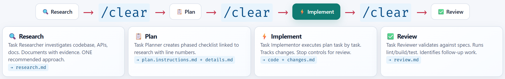

<!-- markdownlint-disable-next-line MD025 -->
# HVE principles

HVE is the methodology. HVE-Core is tooling that provides one proven, opinionated starting point for applying it. HVE-Core evolves rapidly, but the engineering principles remain the anchor.

## Connect the presentation to the lab

- [ ] Have your presenter cover the principles of Hypervelocity Engineering from slides [1 through 12](https://plagueho.github.io/plagueho.learn/hypervelocity-engineering/#/1), or review these on your own.
- [ ] Identify the four HVE pillars described in the presentation: Multidisciplinary Teams, Design Thinking, Production-Ready Starting Points, and AI Agents & Tools.
- [ ] Make sure you can name the four phases of RPI in order.

📸 Screenshot: the RPI cycle

## Apply the principles

The four canonical HVE principles describe how the pillars guide daily engineering:

| Principle | Lab behavior |
|-----------|--------------|
| Iterate in Small Steps | Work in bounded, verifiable increments. Give each agent one phase and an explicit stop condition. |
| Validate and Verify | Check AI output against repository evidence, Vitest results, and browser behavior. |
| Prioritize Business Value | Keep issue acceptance criteria and user outcomes ahead of technology novelty. |
| Embed Security & Quality | Treat tests, review, security, observability, and responsible AI as lifecycle work rather than final checks. |

Use all four pillars together. Multidisciplinary Teams bring the right expertise, Design Thinking keeps work tied to a valuable problem, Production-Ready Starting Points reduce reinvention, and AI Agents & Tools accelerate the full lifecycle without removing human accountability.

## Prepare for the tooling

In module 01 you will inspect the HVE-Core components that operationalize this cycle. The tooling is not the methodology itself. You can adapt the delivery mechanism while preserving small-step iteration, validation, business value, and embedded security and quality.

If you need a concise recap, compare your notes with [the principles map](./solution/principles-map.md).

## Completion check

- [ ] You can distinguish HVE from HVE-Core.
- [ ] You can describe all four RPI phases.
