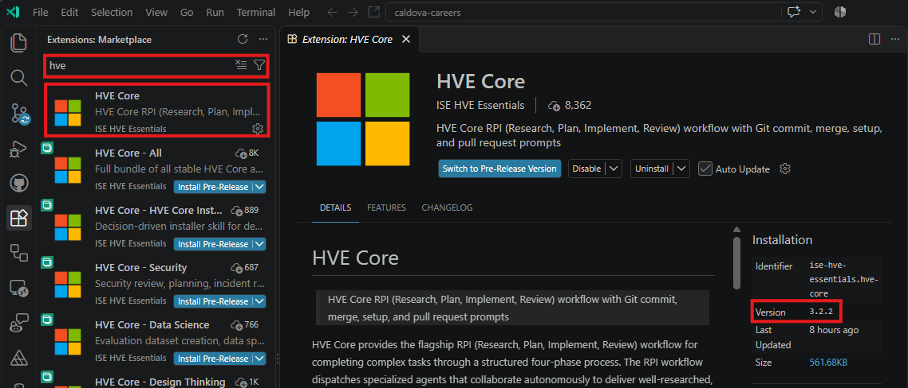

<!-- markdownlint-disable-next-line MD025 -->
# Install HVE-Core and inspect its components

This lab uses the stable HVE-Core 3.2.2 extension, not the current source tree.

## Install the extension

- [ ] Install HVE-Core in your selected editor.

  For VS Code Insiders:

  ```powershell
  code-insiders --install-extension ise-hve-essentials.hve-core@3.2.2
  ```

  For VS Code Stable:

  ```powershell
  code --install-extension ise-hve-essentials.hve-core@3.2.2
  ```

- [ ] From the attendee `caldova-careers` repository root, start the same editor edition where you installed HVE-Core:

  For VS Code Insiders:

  ```powershell
  code-insiders .
  ```

  For VS Code Stable:

  ```powershell
  code .
  ```

  If that editor was already open while you installed HVE-Core, reload its window before continuing.

- [ ] Open the VS Code extension details page and confirm that the installed version is exactly **3.2.2**.

<details class="screenshot-expander">
<summary>📸 Screenshot: HVE-Core Extension 3.2.2 installed</summary>



</details>

## Verify the agents and prompts

- [ ] Open GitHub Copilot Chat and click the **Agent** button.
- [ ] Confirm these eight agents appear in the picker: Memory, PR Review, Prompt Builder, RPI Agent, Task Implementor, Task Planner, Task Researcher, and Task Reviewer.

<details class="screenshot-expander">
<summary>📸 Screenshot: HVE-Core 3.2.2 agents</summary>


</details>

The screenshot shows six of the eight agents. Confirm Memory and Prompt Builder in your own agent picker.

If the names differ, verify the extension version before continuing.

> [!NOTE]
> A newer HVE-Core release will change to expose skills instead of the separate Task agents.

## Completion check

- [ ] HVE-Core 3.2.2 is installed.
- [ ] All eight agents are visible in the agent picker.
