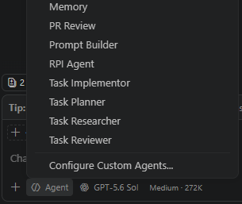

<!-- markdownlint-disable-next-line MD025 -->
# Install HVE-Core and inspect its components

This lab uses the stable HVE-Core 3.2.2 extension, not the current source tree.

## Install the extension

- [ ] Install HVE-Core in your selected editor.

For VS Code Insiders:

```powershell
code-insiders --install-extension ise-hve-essentials.hve-core
```

For VS Code Stable:

```powershell
code --install-extension ise-hve-essentials.hve-core
```

- [ ] Open the extension details page and confirm that the installed version is exactly **3.2.2**.
- [ ] Disable automatic updating for this lab if your environment could replace the pinned version during the session.
- [ ] Reload the editor window.

## Verify the agents and prompts

- [ ] Open GitHub Copilot Chat and inspect the agent picker.
- [ ] Confirm these six agents: Task Researcher, Task Planner, Task Implementor, Task Reviewer, PR Review, and RPI Agent.
- [ ] Type `/` in chat.
- [ ] Confirm `/rpi`, `/task-research`, `/task-plan`, `/task-implement`, `/task-review`, and `/pull-request`.

<details class="screenshot-expander">
<summary>📸 Screenshot: HVE-Core 3.2.2 agents</summary>



</details>

If the names differ, verify the extension version before continuing. A newer HVE-Core release may expose skills instead of the separate Task agents.

## Identify the component types

| Component | Role in your workflow |
|-----------|-----------------------|
| Instructions | Guardrails applied everywhere or to matching files. |
| Prompts | Slash-command workflows with repeatable inputs. |
| Agents | Named specialists selected from the agent picker, with explicit handoffs. |
| Skills | Capability packs loaded when a task needs them. |
| Plugins and extensions | Delivery mechanisms that package these components. |

The caldova-careers repository already contains its own `.github` instructions, agents, and skills. Those repository-specific guardrails remain relevant when HVE-Core agents work in the project.

- [ ] Find one existing caldova-careers instruction file.
- [ ] Explain which component starts a repeatable workflow.
- [ ] Explain which component constrains a TypeScript edit.

Use the [component checklist](./solution/component-checklist.md) if the picker or prompt list is incomplete.

## Completion check

- [ ] HVE-Core 3.2.2 is installed.
- [ ] All six agents and six prompts are visible.
- [ ] You can distinguish the five component categories.
