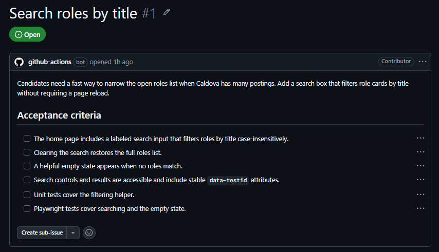
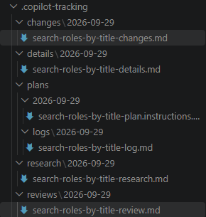

<!-- markdownlint-disable-next-line MD025 -->
# Run RPI one agent at a time

Implement the GitHub issue **Search roles by title** in your attendee repository while retaining control of every RPI decision. Review the issue in GitHub before you start, and keep Vitest unit tests required while treating Playwright as optional.

## Create a feature branch

- [ ] Switch to your IDE (VS Code or VS Code Insiders).
- [ ] Confirm that `.copilot-tracking/` is in `.gitignore`.
- [ ] From the attendee `caldova-careers` repository, create and check out a branch for issue 01:

  ```powershell
  git switch -c feature/search-roles-by-title
  ```

- [ ] In the **Issues** tab of your attendee `caldova-careers` repository on GitHub, open the GitHub issue titled **Search roles by title**. Read its description and acceptance criteria, note the issue number assigned in your repository, and keep the issue open while you work.

<details class="screenshot-expander">
<summary>📸 Screenshot: GitHub issue #1, Search roles by title</summary>



</details>

## Research the feature

- [ ] Open GitHub Copilot Chat.
- [ ] Recommend setting the model to `Auto`, `Balance`.
- [ ] Select the `Task Researcher` agent.
- [ ] Run the research command in the Task Researcher agent, replacing `{issue-number}` with the number you recorded above.

  ```text
  Research GitHub issue {issue-number}, search roles by title
  ```

> [!NOTE]
> If you don't have the GitHub MCP server enabled in VS Code then it should fall back to retrieving
> the GitHub Issue via the `gh` command.

- [ ] Inspect the date-scoped research file under `.copilot-tracking/research/{date}/`.
- [ ] Check the **File Analysis** and confirm that the research refers to actual repository files.

<details>
<summary>🔮 Coming soon: the /rpi-research skills equivalent</summary>

An update to HVE-Core is in development that replaces Task Researcher with a skill. The equivalent shape is:

```text
/rpi-research topic="Research GitHub issue {issue-number}, search roles by title" posture=balanced
```

But for simplicity of this lab we will use the Task Researcher flow for HVE-Core 3.2.2.
You can switch to the `/rpi-research` skills by using one of the other [installation methods](https://microsoft.github.io/hve-core/docs/getting-started/install).

</details>

## Plan the feature

> [!TIP]
> If you're ever stuck on what to do next, ensure the appropriate HVE (task) agent is selected and ask what you should do next.

- [ ] Run `/clear` or start a new agent session.
- [ ] Select the `Task Planner` agent.
- [ ] Run the planner command in the Task Planner agent, specifying the research file.

  ```text
  Create implementation plan for .copilot-tracking/research/{date}/{issue-01-research-file}.md
  ```

> [!TIP]
> If you've already got the research file open, you can just say `Create implementation plan`

  Confirm the plan follows the GitHub issue's acceptance criteria.

- [ ] Inspect `.copilot-tracking/plans/{date}/*-plan.instructions.md`.
- [ ] Inspect the corresponding `.copilot-tracking/details/{date}/` file.
- [ ] Confirm that the plan names source files, test files, acceptance criteria, and validation commands.

<details>
<summary>🔮 Coming soon: the /rpi-plan skills equivalent</summary>

Newer HVE-Core source uses:

```text
/rpi-plan task="Implement issue 01, search roles by title, with required Vitest tests and optional Playwright tests." research=".copilot-tracking/research/{date}/{issue-01-research-file}.md" critique=standard
```

The newer skill writes `*-plan.md`; HVE-Core 3.2.2 writes `*-plan.instructions.md`.

</details>

## Implement the feature

- [ ] Run `/clear` or start a new agent session.
- [ ] Select the `Task Implementor` agent.
- [ ] Run the implement plan command in the Task Implementor agent, specifying the plan instructions file.

  ```text
  Implement plan .copilot-tracking/plans/{date}/{issue-01-plan}-plan.instructions.md
  ```

> [!TIP]
> If you've already got the plan instructions file open, you can just say `Implement plan`

- [ ] Confirm that the plan and implementation refer to the GitHub issue **Search roles by title** in your attendee repository. Do not accept a different feature or changed acceptance criteria.
- [ ] Require Vitest tests for the search behavior.
- [ ] Inspect `.copilot-tracking/changes/{date}/` and compare the changes log with the plan.
- [ ] Run the required unit tests:

  ```powershell
  npm run test:unit
  ```

- [ ] Start the application, search for a role title at `http://localhost:4321`, and verify matching and nonmatching states.
- [ ] Observe the **✅ Review** handoff.

<details>
<summary>🔮 Coming soon: the /rpi-implement skills equivalent</summary>

Newer HVE-Core source uses:

```text
/rpi-implement plan=".copilot-tracking/plans/{date}/{issue-01-plan}-plan.md"
```

Use the Task Implementor and its 3.2.2 plan format during this lab.

</details>

## Review the feature

> [!TIP]
> Ask the Task Implementor, "What is the next step?" Review its recommendation. It should tell you to run `/clear`, then `/task-review` with the exact plan, changes, and research artifact paths.

- [ ] Run `/clear` or start a new agent session.
- [ ] Select the `Task Review` agent.
- [ ] Run the review command in the Task Review agent, specifying the plan instructions file, the changes file and the research file.

  ```text
  Review changes=".copilot-tracking/changes/{date}/{issue-01-changes}.md" plan=".copilot-tracking/plans/{date}/{issue-01-plan}-plan.instructions.md" research=".copilot-tracking/research/{date}/{issue-01-research-file}.md"
  ```

> [!TIP]
> If you've already got the changes, plan instructions and research file open, you can just say `Review`.

- [ ] Confirm that the review evaluates the implementation against the GitHub issue **Search roles by title** and its acceptance criteria.
- [ ] Inspect the date-scoped result under `.copilot-tracking/reviews/{date}/`.
- [ ] Confirm that review findings distinguish the four known baseline typecheck errors from regressions introduced by your branch.
- [ ] Resolve material findings, then rerun `npm run test:unit` and the browser check.

> [!NOTE]
> It is possible that the review stage identifies either incomplete tasks or gaps in the implementation that need to be addressed before considering the issue fully resolved.
> This is by design and you will simply go back and run `Implement plan` or the appropriate command to address the findings.

<details>
<summary>🔮 Coming soon: the /rpi-review skills equivalent</summary>

Newer HVE-Core source uses:

```text
/rpi-review task="Review issue 01, search roles by title." plan=".copilot-tracking/plans/{date}/{issue-01-plan}-plan.md" changes=".copilot-tracking/changes/{date}/{issue-01-changes}.md" depth=standard
```

The newer workflow writes review logs to a different location. Use `.copilot-tracking/reviews/{date}/` for 3.2.2.

</details>

<details class="screenshot-expander">
<summary>📸 Screenshot: artifacts created by RPI</summary>



</details>

## Optional PR Review

- [ ] If issue 01 changes are still uncommitted, review `git status --short`, stage only the intended source and test files, and commit them on `feature/search-roles-by-title`. An uncommitted feature cannot appear in a pull request.
- [ ] Push the feature branch:

  ```powershell
  git push -u origin feature/search-roles-by-title
  ```

- [ ] In your attendee repository on GitHub, open **Pull requests** > **New pull request**. Set the base to `main` and the compare branch to `feature/search-roles-by-title`, then create the pull request.
- [ ] Fetch `origin/main` while keeping the feature branch checked out:

  ```powershell
  git fetch origin main
  git branch --show-current
  ```

  The branch name printed by the last command should be `feature/search-roles-by-title`.

- [ ] Select **PR Review** from the agent picker. It needs no prompt in HVE-Core 3.2.2.
- [ ] Inspect `.copilot-tracking/pr/review/{branch}/`.
- [ ] Compare its diff findings with the Task Reviewer output. This local exercise does not need to post review comments.

## Optional Playwright check

If Chromium is installed, run the issue's Playwright criteria as extra credit. A Playwright result does not replace the required Vitest suite.

## Completion check

- [ ] Issue 01 search works in the browser.
- [ ] All required Vitest unit tests pass.
- [ ] Research, plan, details, changes, and review artifacts are present.
- [ ] You inspected every RPI artifact rather than accepting it automatically.

Representative recovery artifacts are in [the solution folder](./solution/expected-artifacts.md).
