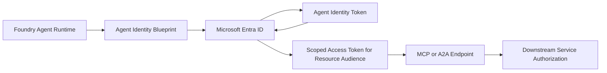
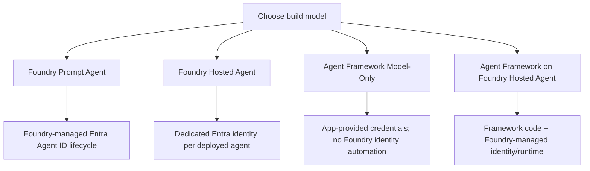
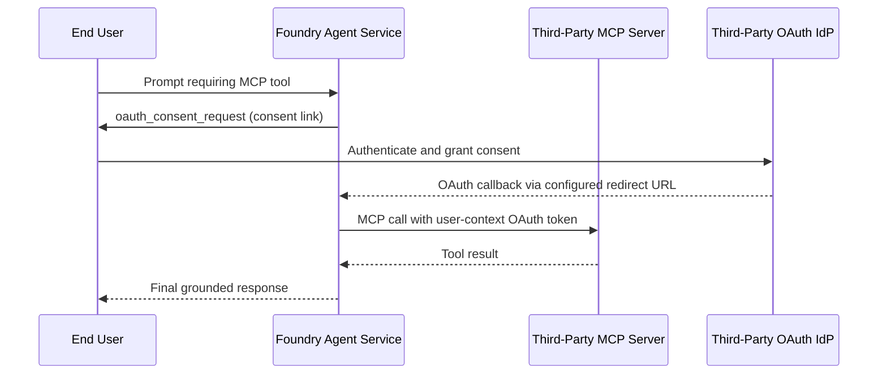

# Guidance: Microsoft Entra Agent ID with Foundry Agent Service and Microsoft Agent Framework

This guide explains how Microsoft Entra Agent ID fits across:

- Microsoft Foundry Agent Service prompt agents
- Microsoft Foundry Agent Service Hosted agents
- Microsoft Agent Framework (model-only)
- Microsoft Agent Framework deployed as a Foundry Hosted agent

It also covers practical authentication patterns for MCP servers, including a real-world scenario where the MCP server uses a third-party OAuth identity provider (not Microsoft Entra ID).

## Executive summary

- Microsoft Entra Agent ID is the identity and security framework for AI agents in Microsoft Entra.
- Foundry Agent Service is deeply integrated with Entra Agent ID and automatically provisions and manages agent identities and blueprints.
- Prompt agents and Hosted agents in Foundry can use agent identities for non-user (application) access and can use OAuth On-Behalf-Of (OBO) / identity passthrough for user-context access where supported.
- Microsoft Agent Framework by itself is an SDK/runtime. In model-only deployments outside Foundry, you use the credential model you provide (for example, Azure.Identity credentials), not Foundry-managed Entra Agent ID lifecycle automation.
- For MCP integrations with non-Microsoft identity providers, use OAuth identity passthrough with custom OAuth configuration in Foundry.

## What Entra Agent ID is

Microsoft Entra Agent ID extends Microsoft Entra identity, security, and governance to AI agents. It introduces:

- Agent identities: specialized service principals for agents
- Agent identity blueprints: governance templates for classes of agents
- Security controls at scale: conditional access, identity protection, governance, logging, and network controls for agents

In practice, this gives you a first-class way to separate agent actions from human and workload actions while maintaining least privilege and auditability.

## How Foundry Agent Service uses Entra Agent ID

Foundry Agent Service automatically creates and manages Entra agent identity artifacts as you create and publish agents.

### Identity lifecycle in Foundry

- Unpublished/in-development agents in one project share a project-level agent identity.
- Publishing an agent creates a distinct identity for that published agent/application.
- You must reapply required RBAC permissions to the newly published identity for downstream resources.

### Runtime token pattern

When a Foundry agent calls a protected downstream service (for example, through MCP/A2A with Entra auth), Foundry handles a multi-step OAuth exchange:

1. Blueprint authenticates to Entra.
2. Entra issues token for the specific agent identity.
3. Foundry requests a scoped token for the downstream service audience.
4. Tool call is executed with that scoped token.

Audience must match the downstream resource identifier (for example, `https://storage.azure.com`), not an MCP endpoint URL.

## Prompt agents vs Hosted agents vs Agent Framework model-only

| Build path | Identity behavior | Operational implication |
|---|---|---|
| Foundry prompt agent | Foundry-managed Entra agent identity lifecycle (shared pre-publish, distinct post-publish) | Fastest path; identity governance is native to Foundry |
| Foundry Hosted agent | Per-agent dedicated Entra identity at deploy time; project managed identity is separate for platform operations | Best for custom code and full control with managed runtime identity |
| Agent Framework model-only (outside Foundry) | Uses credential you configure in app/runtime (for example, AzureCliCredential/DefaultAzureCredential) | No automatic Foundry agent identity lifecycle unless you host/deploy in Foundry |
| Agent Framework hosted on Foundry | Inherits Foundry Hosted agent identity model | Best of both: framework flexibility + Foundry identity/runtime governance |

## MCP authentication choices in Foundry

Foundry supports these MCP authentication patterns:

- Key-based authentication
- Microsoft Entra authentication (agent identity or project managed identity)
- OAuth identity passthrough (managed OAuth or custom OAuth)
- Unauthenticated access (only where appropriate)

Use this rule of thumb:

- Shared identity required and service supports Entra: use Entra auth.
- Per-user authorization required: use OAuth identity passthrough.
- Non-Entra OAuth provider: use custom OAuth identity passthrough.

## Real-world scenarios

### Scenario 1: Internal prompt agent, shared service access

Context:

- A prompt-based policy assistant reads internal policy blobs through an MCP server backed by Azure Storage.
- No per-user data partitioning is needed.

Recommended auth:

- Foundry MCP connection using Entra agent identity auth.
- Assign least-privilege RBAC (for example, Storage Blob Data Reader/Contributor as needed) to the agent identity.

Why:

- No shared secret handling.
- Rotating token management handled by platform.

### Scenario 2: Hosted agent with autonomous operations

Context:

- A Hosted agent built with Agent Framework runs background remediation tasks and writes status to Cosmos DB and Storage.
- No user token is present.

Recommended auth:

- Application-only flow through the hosted agent's dedicated Entra identity.
- Explicit RBAC on each downstream service scope.

Why:

- Clear, auditable nonhuman identity boundary.
- Least-privilege role assignment per resource.

### Scenario 3: Prompt agent calling third-party MCP with non-Entra OAuth IdP

Context:

- A Foundry prompt agent calls a third-party MCP server (for example, GitHub/Jira-class ecosystem) whose OAuth provider is not Entra.
- You need per-user permissions in the third-party system.

Recommended auth:

- OAuth identity passthrough with custom OAuth in the Foundry MCP connection.
- Configure Client ID, (optional) Client Secret, Auth URL, Token URL, Refresh URL, and scopes from the third-party IdP.
- Include `offline_access` scope where the provider supports refresh token issuance.
- Add the redirect URL generated by Foundry to the third-party OAuth app registration.

Key operational points:

- First-time user/tool call returns `oauth_consent_request` with a consent link.
- User completes consent, then client submits a follow-up response using `previous_response_id`.
- Consent scope is per tool/connection per Foundry project.
- Users still need required Foundry project role (Foundry User or above) to use passthrough.

### Scenario 4: Agent Framework model-only in your own host

Context:

- Team uses Microsoft Agent Framework directly with model clients and MCP in a self-hosted app/runtime.
- No Foundry Agent Service deployment.

Identity model:

- You control credentials directly in code/runtime (for example, AzureCliCredential or DefaultAzureCredential to supported services).
- Entra Agent ID governance/lifecycle automation from Foundry does not automatically apply unless the agent is run through Foundry Agent Service integration.

Why this matters:

- Maximum flexibility.
- You own identity plumbing and governance implementation choices.

## Implementation blueprint

1. Classify each agent as user-attended, autonomous, or mixed.
2. Choose deployment mode:
   - Prompt agent for fastest delivery.
   - Hosted agent (including Agent Framework-on-Foundry) for custom runtime logic.
3. For each MCP/A2A/OpenAPI integration, choose auth mode:
   - Entra agent identity for service-to-service access.
   - OAuth passthrough for per-user access (including non-Entra IdPs).
4. Apply least-privilege RBAC to the correct principal:
   - Shared project identity (pre-publish) and/or distinct published agent identity.
5. Validate end-to-end auth behavior:
   - First-run consent path (if OAuth passthrough)
   - Token refresh behavior
   - Access denied behavior and fallback UX
6. Add governance controls in Entra:
   - Conditional Access, Identity Protection, Governance, sign-in/audit monitoring.

## Pitfalls to avoid

- Assigning RBAC only to the shared project identity, then forgetting to reassign for published distinct identities.
- Using MCP endpoint URL as OAuth audience for Entra-based token exchange.
- Using key-based auth where per-user authorization is required.
- Omitting redirect URL registration for custom OAuth passthrough.
- Assuming cross-tenant token exchange for OAuth passthrough flows.

## Reference map

- Entra Agent ID overview:
  - [What is Microsoft Entra Agent ID?](https://learn.microsoft.com/en-us/entra/agent-id/what-is-microsoft-entra-agent-id)
- Foundry Agent Service:
  - [What is Microsoft Foundry Agent Service?](https://learn.microsoft.com/en-us/azure/foundry/agents/overview)
  - [Agent identity concepts in Microsoft Foundry](https://learn.microsoft.com/en-us/azure/foundry/agents/concepts/agent-identity)
  - [What are hosted agents?](https://learn.microsoft.com/en-us/azure/foundry/agents/concepts/hosted-agents)
  - [Set up authentication for MCP tools](https://learn.microsoft.com/en-us/azure/foundry/agents/how-to/mcp-authentication)
- Microsoft Agent Framework:
  - [Microsoft Agent Framework overview](https://learn.microsoft.com/en-us/agent-framework/overview/?pivots=programming-language-csharp)
  - [Foundry Hosted Agents in Agent Framework](https://learn.microsoft.com/en-us/agent-framework/hosting/foundry-hosted-agent)

## Quick decision matrix

| Requirement | Recommended pattern |
|---|---|
| Need fastest no-code/low-code agent with enterprise identity | Foundry prompt agent + Entra agent identity |
| Need custom code and managed runtime identity | Foundry Hosted agent (or Agent Framework hosted on Foundry) |
| Need per-user permissions on third-party MCP | OAuth identity passthrough (custom OAuth to third-party IdP) |
| Need pure framework-level flexibility, self-managed infra | Agent Framework model-only with app-managed credentials |
