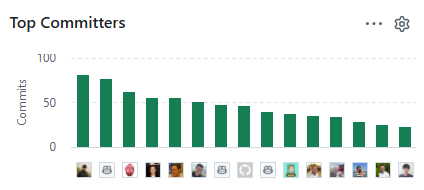
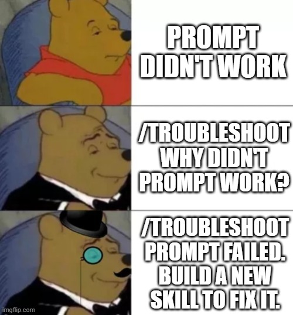

<!-- ═══════════════════════════════════════════════════════════
     SLIDE 1 — TITLE HERO                                ~1 min
     ═══════════════════════════════════════════════════════════ -->

  
GitHub Copilot · Skills · MCP · Orchestration

  <h1 class="hero-heading">Agentic Development Evolution</h1>
  

    A view of the last 6 months — how the workflow shifted from prompts and
    chat assistance to <strong>governed skills</strong>, <strong>agent coordination</strong>,
    <strong>MCP tools</strong>, and <strong>spec-driven determinism</strong>.
  

  

    Daniel Scott-Raynsford (DSR)
    Sr. Partner Solution Architect · Cloud & AI Apps · Microsoft EPS
    40 minutes · demo-heavy
  

  

    

      <strong>🛠️ Skills over prompts</strong>
      Reusable, governed, portable behavior
    

    

      <strong>🔌 MCP everywhere</strong>
      Tools are now first-class context
    

    

      <strong>📐 Determinism beats vibe</strong>
      Specs, guardrails, and observability
    

    

      <strong>🤖 Scale the work out</strong>
      Subagents → Squads → Fleets
    

  

<!--
Open with the thesis: the biggest change in the last 6 months is NOT better
autocomplete. It's the move from isolated assistance to a governed operating
model. Slides are signposts — demos carry the proof.
-->

---
transition: fade-out
---

<!-- ═══════════════════════════════════════════════════════════
     SLIDE 2 — ABOUT ME                                  ~1 min
     ═══════════════════════════════════════════════════════════ -->

  

    <h1>About Me</h1>
    

  

  

    

      

        <ul class="dense-list">
          <li><strong>Daniel Scott-Raynsford</strong> (PlagueHO)</li>
          <li>Partner Solution Architect — Cloud & AI Apps, Microsoft EPS</li>
          <li>Open-source contributor, recovering software engineer</li>
          <li><a href="https://danielscottraynsford.com" target="_blank">danielscottraynsford.com</a> · <a href="https://github.com/PlagueHO" target="_blank">github.com/PlagueHO</a></li>
        </ul>
      

      

        
Session contract

        <ul class="dense-list">
          <li>This is <strong>not</strong> a feature dump. It's a workflow shift.</li>
          <li>Slides are signposts — <strong>demos carry the proof</strong>.</li>
          <li>Each section is short so we can jump to live code.</li>
          <li>If a pattern is repeatable, it probably wants to be a <strong>skill</strong>.</li>
        </ul>
      

    

  

<!--
Keep this quick — 60 seconds max. The goal is to set expectations:
short slides, frequent demos, and a focus on operating patterns not features.
-->

---
transition: slide-up
---

<!-- ═══════════════════════════════════════════════════════════
     SLIDE 3 — AGENDA                                  ~30 sec
     ═══════════════════════════════════════════════════════════ -->

  

    <h1>Agenda</h1>
    

  

  

    

      

        
01

        <h2>The Agentic Operating Model</h2>
        
Customization hierarchy, skills, MCP, the ecosystem

      

      

        
02

        <h2>Determinism & Orchestration</h2>
        
/troubleshoot, Spec Kit, gh-aw, WorkIQ

      

      

        
03

        <h2>Scaling Intelligence Out</h2>
        
Subagents → Squads → Monitoring & Memory

      

      

        
04

        <h2>Beyond Dev + Prototype-First</h2>
        
HVE Core, RPI, Design Thinking, <code>az prototype</code>

      

    

    

      

        🎬
        Demo 1
        Insiders + Skills + /Troubleshoot
      

      

        🎬
        Demo 2
        Squads & Fleets
      

      

        🎬
        Demo 3
        Sessions + RPI / HVE
      

      

        🎬
        Demo 4
        az prototype
      

    

  

<!--
Quick scan of the agenda — don't dwell. Point out the 4 demo markers so people
know when to pay extra attention. "We'll be jumping out to live code 4 times."
-->

---
transition: fade-out
---

<!-- ═══════════════════════════════════════════════════════════
     SLIDE 4 — THE AGENTIC OPERATING MODEL               ~5 min
     ═══════════════════════════════════════════════════════════ -->

  

    <h1>The Agentic Operating Model</h1>
    

  

  

    

      

        
The 7-layer customization stack

        

          

            1
            Instructions
            Always-on repo/path conventions
          

          

            2
            Prompts
            Reusable task templates
          

          

            3
            Agents
            Specialist personas with tool scopes
          

          

            4
            Subagents
            Isolated child contexts for delegation
          

          

            5
            Skills
            Demand-loaded expertise bundles
          

          

            6
            Hooks
            Deterministic lifecycle commands
          

          

            7
            MCP
            External tool & API integration
          

        

        

          <strong>The shift:</strong> AI loads the right expertise per task, executes multi-step
          workflows, and enforces deterministic lifecycle events.
        

      

      

        
        

          <h3>🧩 Skills Ecosystem</h3>
          
<a href="https://agentskills.io/" target="_blank">agentskills.io</a> — open standard adopted by 15+ agent products.
          Three distribution tiers: community (<a href="https://github.com/github/awesome-copilot" target="_blank">awesome-copilot</a>),
          vendor (<a href="https://github.com/dotnet/skills" target="_blank">dotnet/skills</a>),
          personal (<a href="https://github.com/PlagueHO/plagueho.skills" target="_blank">plagueho.skills</a>).

        

        

          <h3>🔌 MCP = USB-C for AI</h3>
          
N×M → N+M. Tools, resources, prompts — one protocol, all agent products.

        

      

    

  

<!--
Walk through the 7-layer stack top to bottom. Emphasize the spectrum from
"always-on / low-detail" (instructions) to "on-demand / high-detail" (MCP).

Key points:
- Skills are demand-loaded — the agent reads the description and decides
- agentskills.io is open, adopted by GitHub, Claude Code, Cursor, Codex, etc.
- MCP reduces N×M integrations to N+M
- This replaces hope-based prompting with governed behavior

Point at the VS Code top committers chart: "Look who's writing the code now."
-->

---
transition: fade-out
---

<!-- ═══════════════════════════════════════════════════════════
     SLIDE 5 — DEMO 1: Insiders + Skills + /Troubleshoot  ~5 min
     ═══════════════════════════════════════════════════════════ -->

  
🔬

  <h1 class="demo-title">Demo 1: Insiders + Skills + /Troubleshoot</h1>
  
See the customization stack in action — and observe why things happen

  
🎬 ~5 minutes

  

    
▸ Show VS Code Insiders agent panel & skill discovery

    
▸ Trigger a skill via chat — watch demand-loading

    
▸ Run /troubleshoot — inspect tool calls & activation

    
▸ Show Sensei improving skill frontmatter quality

  

  

<!--
DEMO SCRIPT — Insiders + Skills + /Troubleshoot (~5 min)
═════════════════════════════════════════════════════════

SETUP: VS Code Insiders open with a repo that has .github/skills/ configured.
Pre-run a task that uses a skill so /troubleshoot has data.

1. SKILL DISCOVERY (1 min)
   - Open a repo with skills in .github/skills/
   - Chat: "migrate this project to .NET 10"
   - Point out: Copilot reads SKILL.md descriptions, picks the right skill
   - Show the skill's YAML frontmatter — triggers, anti-triggers

2. /TROUBLESHOOT (2 min)
   - Run: /troubleshoot why did the migration skill activate?
   - Walk through the JSONL event tree:
     * discovery events — which files scanned, loaded, skipped
     * tool_call events — what tools fired, args, results
     * llm_request — which model, token count, time-to-first-token
   - Key message: "This is the observability layer for the entire agentic stack"

3. SENSEI (1.5 min)
   - Run: "run sensei on my-skill-name"
   - Show before/after frontmatter (vague → routed)
   - Point out: triggers, anti-triggers, INVOKES declarations
   - Key message: "Skill reliability is a frontmatter quality problem"

4. WRAP (30 sec)
   - "Skills replaced ad-hoc prompting. /troubleshoot tells you why.
      Sensei makes the descriptions good enough for routing."
-->

---
transition: fade-out
---

<!-- ═══════════════════════════════════════════════════════════
     SLIDE 6 — DETERMINISM & ORCHESTRATION                ~4 min
     ═══════════════════════════════════════════════════════════ -->

  

    <h1>Determinism, Visibility & Orchestration</h1>
    

  

  

    

      

        

          
📐

          <h3>Spec Kit & SDD</h3>
          
Specifications become executable — code serves specs, not the other way around. 8 slash commands: <code>/speckit.specify</code> → <code>.plan</code> → <code>.implement</code>. "Unit tests for English."

        

        

          
⚙️

          <h3>GitHub Agentic Workflows</h3>
          
Write <code>.md</code> workflows, compile to guarded Actions with <code>gh aw compile</code>. Three-layer security: substrate, configuration, plan-level trust with SafeOutputs.

        

        

          
🔍

          <h3>/troubleshoot</h3>
          
The observability layer — JSONL debug logs, event trees, discovery/tool_call/llm_request tracing. Answers: "Why did the AI do what it did?"

        

        

          
💼

          <h3>WorkIQ & Enterprise Context</h3>
          
MCP bridge to Microsoft 365 — meetings, emails, Teams. Makes prompts like "build me a demo from the Zava meeting" operational.

        

      

      

        

          <strong>SDD vs. Vibe Coding</strong> 
          Vibe: one-shot → code. No traceability. 
          SDD: spec → plan → tasks → code. Every step auditable.
        

        

          <strong>Key insight</strong> 
          Better models helped, but <strong>better process helped more</strong>.
        

      

    

  

<!--
Four pillars of determinism. Don't try to cover everything — hit the thesis
for each:

- Spec Kit: "Specs generate code, not the other way around"
- gh-aw: "Markdown → compiled Actions with security baked in"
- /troubleshoot: "You covered this in the demo — just reference it"
- WorkIQ: "Enterprise context makes prompts real, not hypothetical"

Close with: "Better models helped. Better process helped more."
-->

---
transition: fade-out
---

<!-- ═══════════════════════════════════════════════════════════
     SLIDE 7 — SCALING INTELLIGENCE OUT                   ~4 min
     ═══════════════════════════════════════════════════════════ -->

  

    <h1>Scaling Intelligence Out</h1>
    

  

  

    

      

        
From subagents to squads

        

          <h3>🔀 Subagents as a Primitive</h3>
          
Three types: <code>search_subagent</code> (fast read-only), <code>execution_subagent</code> (command runner), <code>runSubagent</code> (general delegation). Each runs in its own context — parallel-safe, no contamination.

        

        

          <h3>📂 Squad — Durable Multi-Agent Teams</h3>
          
<code>.squad/</code> lives in your repo: team.md, routing.md, decisions.md, agent charters + history. Parallel fan-out. Memory persists in git — the team gets smarter the more you use it.

        

        

          <strong>When does multi-agent pay off?</strong> When the context cost of one giant agent exceeds the coordination cost of several focused ones.
        

      

      

        
Monitoring, memory & recovery

        

          

            
📊

            <h3>Monitor</h3>
            
Observe active, blocked, completed work. <code>/status</code>, <code>gh aw logs</code>

          

          

            
🧠

            <h3>Memory</h3>
            
decisions.md, history.md, wisdom.md — all in git, all searchable

          

          

            
🔄

            <h3>Recovery</h3>
            
Checkpoint resume, SafeOutputs rollback, session persistence

          

        

        <pre class="terminal-snippet" style="font-size: 0.72rem;">&#35; Squad parallel fan-out — You: "Team, build the login page"
🏗️ Lead    — analyzing requirements
⚛️ Frontend — building login form         all launched
🔧 Backend  — setting up auth endpoints   in parallel
🧪 Tester   — writing tests from spec
📋 Scribe   — logging everything</pre>
      

    

  

<!--
Two halves:
LEFT — the progression from subagents to squads.
  - Subagents: "One agent splits work into focused parallel tasks"
  - Squad: "Persistent multi-agent team that lives in your repo"
  - The key question: "Context cost vs. coordination cost"

RIGHT — the three operational surfaces.
  - Without these, multi-agent is academic
  - With these, it's practical for real teams
  - Point at the terminal snippet: "This is what 'team, build X' looks like"

Transition: "Let me show you this live..."
-->

---
transition: fade-out
---

<!-- ═══════════════════════════════════════════════════════════
     SLIDE 8 — DEMO 2: Squads & Fleets                    ~5 min
     ═══════════════════════════════════════════════════════════ -->

  
🤖

  <h1 class="demo-title">Demo 2: Squads & Fleets</h1>
  
Persistent multi-agent teams with parallel execution and memory

  
🎬 ~5 minutes

  

    
▸ Init a Squad from scratch — roster, routing, casting

    
▸ Give a team task — watch parallel fan-out

    
▸ Inspect .squad/ — decisions.md, history.md, orchestration log

    
▸ Show memory persistence across sessions

  

<!--
DEMO SCRIPT — Squads & Fleets (~5 min)
═══════════════════════════════════════

SETUP: Fresh repo (or existing one without .squad/).
Have Squad agent mode available in VS Code Insiders.

1. SQUAD INIT (1.5 min)
   - Switch to Squad mode in Copilot chat
   - Say: "I'm building a Node.js REST API for a task manager"
   - Watch: coordinator proposes 4-5 named agents + Scribe
   - Confirm the roster → .squad/ directory created
   - Quick tour: team.md, routing.md, ceremonies.md, agents/

2. PARALLEL FAN-OUT (2 min)
   - Say: "Team, set up the project structure with Express and tests"
   - Watch: multiple agents spawn simultaneously
   - Point out: each agent runs in its own context
   - Show the launch table: who's working, what model, what task
   - Wait for results — show coordinator synthesizing

3. MEMORY & DECISIONS (1 min)
   - Open .squad/decisions.md — team decisions recorded
   - Open an agent's history.md — learnings about YOUR project
   - Key message: "This is in git. Clone the repo, get the team."

4. WRAP (30 sec)
   - "Not a chatbot wearing hats. Each agent has its own context,
      knowledge, and writes back what it learned."
-->

---
transition: fade-out
---

<!-- ═══════════════════════════════════════════════════════════
     SLIDE 9 — BEYOND DEVELOPMENT                         ~4 min
     ═══════════════════════════════════════════════════════════ -->

  

    <h1>Beyond Development: More Roles, More Artifacts</h1>
    

  

  

    

      

        

          
HVE Core — RPI Workflow

          

            "AI can't tell the difference between investigating and implementing.
            The solution isn't teaching AI to be smarter — it's <strong>preventing AI from
            doing certain things at certain times</strong>."
          

          

            
🔍 Research

            →
            
📋 Plan

            →
            
⚡ Implement

            →
            
✅ Review

          

          

            Each phase produces artifacts. Context cleared between phases. The constraint changes the goal.
          

        

        

          
Design Thinking + 10 Roles

          

            

              <strong>Problem</strong> Scope · Research · Synthesize
            

            

              <strong>Solution</strong> Brainstorm · Concept · Prototype
            

            

              <strong>Validation</strong> Hi-Fi · Test · Scale
            

          

          

            👨‍💻 Engineer
            📊 TPM
            🏗️ Architect
            🔒 Security
            📈 Data
            ⚙️ SRE
            💼 BPM
            🆕 New
            🎨 UX
            🔧 Utility
          

        

      

      

        <strong>The important shift:</strong> Better agentic systems don't just generate code faster. They make
        <strong>research</strong>, <strong>planning</strong>, and <strong>review</strong> first-class outputs that more roles can work on.
      

    

  

<!--
Two key stories:

LEFT — HVE Core RPI:
  - The core insight: AI writes first, thinks never. The fix is constraints.
  - Walk the pipeline: Research → Plan → Implement → Review
  - Each produces artifacts, context cleared between phases
  - "When AI knows it can't implement during research, it optimizes for truth"

RIGHT — Design Thinking + 10 Roles:
  - Three spaces (Problem, Solution, Validation)
  - 10 role-specific entry points — PMs, architects, analysts, UX, security
  - Not just engineering anymore

Bottom callout: "Research, planning, and review are first-class outputs"
-->

---
transition: fade-out
---

<!-- ═══════════════════════════════════════════════════════════
     SLIDE 10 — DEMO 3: Sessions + RPI / HVE              ~4 min
     ═══════════════════════════════════════════════════════════ -->

  
🧪

  <h1 class="demo-title">Demo 3: Sessions + RPI Workflow</h1>
  
VS Code sessions make multi-role collaboration visible — RPI shows constrained AI

  
🎬 ~4 minutes

  

    
▸ Show VS Code sessions — multiple roles in one surface

    
▸ Run RPI Research phase — AI investigates, doesn't implement

    
▸ Show research artifact — citations, file references, evidence

    
▸ Transition to Plan phase — clear context, structured output

  

<!--
DEMO SCRIPT — Sessions + RPI / HVE (~4 min)
═══════════════════════════════════════════

SETUP: VS Code with HVE Core configured and a repo with existing code.
Pre-create a research artifact so you have a fallback.

1. VS CODE SESSIONS (1 min)
   - Show the sessions panel / experience
   - Point out: multiple participants, shared artifacts, visible state
   - "This is how PMs and architects participate in the same surface"

2. RPI RESEARCH PHASE (2 min)
   - Chat: use the Task Researcher agent
   - Give it a task: "Add error handling to the export function"
   - Watch: agent SEARCHES for existing patterns, CITES file+line
   - Show output: research document with evidence, not code
   - Key message: "It stopped optimizing for 'plausible code' and
     started optimizing for 'verified truth'"

3. PLAN PHASE (1 min)
   - Clear context (/clear or new chat)
   - Switch to Task Planner agent
   - Feed it the research document
   - Show: structured plan with success criteria, checkboxes
   - "Every step traces back to research"

4. WRAP (30 sec)
   - "The constraint changes the goal. Separate investigating from
     implementing, and both get better."
-->

---
transition: fade-out
---

<!-- ═══════════════════════════════════════════════════════════
     SLIDE 11 — PROTOTYPE-FIRST WORKFLOWS                 ~3 min
     ═══════════════════════════════════════════════════════════ -->

  

    <h1>Prototype-First: Concept to Deploy</h1>
    

  

  

    

      

        <pre class="terminal-snippet" style="font-size: 0.78rem;">az prototype init --name retail-assistant --template ai-app
az prototype design --interactive
az prototype build
az prototype deploy
az prototype analyze costs        &#35; T-shirt pricing (S/M/L)
az prototype analyze error        &#35; Even accepts screenshots!
az prototype generate speckit     &#35; Bridge to SDD
az prototype generate backlog     &#35; to GitHub Issues</pre>
        

          <strong>A working app beats a beautiful mockup</strong> — because the cost of
          generating the first useful slice is now lower than reviewing a slide deck.
        

      

      

        
11 built-in agents

        

          

            📋<strong>biz-analyst</strong> — always engaged
          

          

            🏗️<strong>cloud-architect</strong> — design
          

          

            💰<strong>cost-analyst</strong> — pricing
          

          

            🔒<strong>security-reviewer</strong>
          

          

            👨‍💻<strong>app-developer</strong> — code
          

          

            🧱<strong>terraform / bicep</strong> — IaC
          

          

            🧪<strong>qa-engineer</strong> — testing
          

          

            📝<strong>documentation</strong>
          

          

            📡<strong>monitoring-agent</strong> — observability
          

        

        

          <strong>Cross-role:</strong> PMs run <code>design</code>, finance runs <code>analyze costs</code>, anyone runs <code>generate backlog</code>
        

      

    

  

<!--
Focus on two things:

1. The 4-step flow: init → design → build → deploy
   - Each stage re-entrant — you can go back
   - design has --interactive for refinement loops
   - Supporting commands extend it: costs, error analysis, speckit, backlog

2. Cross-role participation:
   - PM: "az prototype design" — gets architecture, no dev needed to start
   - Finance: "az prototype analyze costs" — real Azure pricing before code
   - Anyone: "az prototype generate backlog --provider github" — Issues with criteria
   - The team can dry-run before committing resources

Close with: "A working app beats a beautiful mockup."
-->

---
transition: fade-out
---

<!-- ═══════════════════════════════════════════════════════════
     SLIDE 12 — DEMO 4: az prototype                      ~4 min
     ═══════════════════════════════════════════════════════════ -->

  
⚡

  <h1 class="demo-title">Demo 4: az prototype</h1>
  
From concept to deployed Azure resources in one iterative flow

  
🎬 ~4 minutes

  

    
▸ az prototype init — scaffold with AI provider

    
▸ az prototype design --interactive — refine architecture

    
▸ az prototype analyze costs — T-shirt pricing

    
▸ az prototype build + deploy — staged output to Azure

  

<!--
DEMO SCRIPT — az prototype (~4 min)
════════════════════════════════════

SETUP: Azure CLI with prototype extension installed. Azure subscription
ready. Have a concept in mind (e.g., "retail AI assistant").

1. INIT (30 sec)
   - Run: az prototype init --name retail-assistant --template ai-app
   - Show: prototype.yaml created, project scaffolded
   - Point out: AI provider choice (copilot, azure-openai, github-models)

2. DESIGN (1.5 min)
   - Run: az prototype design --interactive
   - Watch: biz-analyst agent engages, asks clarifying questions
   - Answer 2-3 questions to shape the architecture
   - Show output: architecture documentation generated
   - "A PM could do this without a developer"

3. COSTS (30 sec)
   - Run: az prototype analyze costs
   - Show: three consumption tiers (S/M/L) with real Azure pricing
   - "Finance gets this before any code exists"

4. BUILD + DEPLOY (1 min)
   - Run: az prototype build (show staged output, progress indicators)
   - Run: az prototype deploy --dry-run (show preflight checks)
   - If time: deploy for real, show slash commands (/status, /plan)
   - "From concept to deployed Azure in under 5 minutes"

5. WRAP (30 sec)
   - "This is why prototypes beat mockups. The cost calculus changed."
-->

---
transition: slide-up
---

<!-- ═══════════════════════════════════════════════════════════
     SLIDE 13 — WHAT TO DO NOW                            ~2 min
     ═══════════════════════════════════════════════════════════ -->

  

    <h1>What To Do Now</h1>
    

  

  

    

      

        01
        <h3>🚀 Adopt Insiders + CLI</h3>
        
When your team can handle preview cadence. Agent features land here weeks before stable.

      

      

        02
        <h3>🧩 Convert to Skills</h3>
        
If you'll do it more than once and it needs determinism — make it a skill. Use agentskills.io for portability.

      

      

        03
        <h3>📐 Scale Deliberately</h3>
        
Start with subagents. Move to squads only when persistent coordination beats one giant context window.

      

      

        04
        <h3>👥 Include More Roles</h3>
        
PMs, designers, analysts, business managers — into the same visible artifact chain. RPI and az prototype make this real.

      

      

        05
        <h3>🏗️ Build Demos of Everything</h3>
        
A working slice teaches faster than a polished plan. <code>az prototype init</code> is the fastest path from concept to proof.

      

    

  

<!--
Concrete adoption checklist. Each item maps to a section they just saw:
01 → Slide 4 (Operating Model)
02 → Slide 4+5 (Skills + Demo)
03 → Slide 7+8 (Scaling + Demo)
04 → Slide 9+10 (Beyond Dev + Demo)
05 → Slide 11+12 (Prototype-First + Demo)
-->

---
transition: fade-out
---

<!-- ═══════════════════════════════════════════════════════════
     SLIDE 14 — KEY TAKEAWAYS                             ~2 min
     ═══════════════════════════════════════════════════════════ -->

  

    <h1>Key Takeaways</h1>
    

  

  

    

      

        1
        
<strong>The constraint changes the goal.</strong> Preventing AI from doing everything at once makes each thing better. Squad constrains by role. gh-aw constrains by security. RPI constrains research from implementation.

      

      

        2
        
<strong>Governance must be in code, not prompts.</strong> Prompts can be ignored; code cannot. SDK hooks, compiled workflows, and the customization hierarchy enforce behavior.

      

      

        3
        
<strong>Memory makes teams compound.</strong> .squad/ is committed to git. Research documents accumulate. Skills persist organizational knowledge. The team gets smarter the more it works.

      

      

        4
        
<strong>The workflow belongs to more roles than engineering.</strong> Research, planning, cost analysis, security review, and documentation are all first-class outputs.

      

      

        5
        
<strong>Standardization enables the ecosystem.</strong> MCP solves N x M. agentskills.io enables portability. Canonical layouts enable federated distribution.

      

    

  

<!--
Progressive reveal — build each takeaway one click at a time.
These connect ALL the sections:
1. Constraint → Squad, gh-aw, RPI, Spec Kit
2. Governance → Hooks, SDK, compiled workflows
3. Memory → .squad/, research docs, skills
4. More roles → HVE 10 roles, az prototype, Design Thinking
5. Standards → MCP, agentskills.io, plugin layout
-->

---
transition: fade-out
---

<!-- ═══════════════════════════════════════════════════════════
     SLIDE 15 — CHEAT SHEET (photographable reference card)
     ═══════════════════════════════════════════════════════════ -->

  

    <h1>📸 Cheat Sheet — Photograph This!</h1>
    

  

  

    

      

        

          <h3>1. The constraint changes the goal</h3>
          
Prevent AI from doing everything at once. Squad constrains by role. gh-aw by security. RPI separates research from implementation. <strong>The constraint is the feature.</strong>

        

        

          <h3>2. Governance in code, not prompts</h3>
          
Prompts can be ignored; code cannot. SDK hooks, compiled workflows, the 7-layer customization hierarchy. <strong>Enforce, don't suggest.</strong>

        

        

          <h3>3. Memory makes teams compound</h3>
          
<code>.squad/</code> committed to git. Research docs accumulate. Skills persist org knowledge. <strong>The team gets smarter every session.</strong>

        

      

      

        

          <h3>4. More roles than engineering</h3>
          
Research, planning, cost analysis, security review, and docs are first-class outputs. PMs, architects, analysts — same artifact chain. <strong>Not just code faster.</strong>

        

        

          <h3>5. Standards enable the ecosystem</h3>
          
MCP solves N x M. agentskills.io enables portability. Canonical plugin layout enables federated distribution. <strong>Open standards are the foundation.</strong>

        

        

          <strong>Start here (links): </strong>
          <a href="https://agentskills.io">agentskills.io</a> ·
          <a href="https://github.com/github/spec-kit">Spec Kit</a> ·
          <a href="https://github.com/bradygaster/squad">Squad</a> ·
          <a href="https://github.com/dotnet/skills">dotnet/skills</a> ·
          <a href="https://github.com/github/gh-aw">gh-aw</a> ·
          <a href="https://microsoft.github.io/hve-core/">HVE Core</a> ·
          <a href="https://learn.microsoft.com/en-us/cli/azure/prototype">az prototype</a>
        

      

    

  

<!--
This is the "photograph this" slide — pause here and let people take photos.
It's a condensed reference card of the 5 cross-cutting principles plus the
key links from the talk. Everything they need to get started after the session.
-->

---
layout: center
class: text-center
---

<!-- ═══════════════════════════════════════════════════════════
     SLIDE 16 — THANK YOU / Q&A                           ~3 min
     ═══════════════════════════════════════════════════════════ -->

  <h1 style="font-size: 2.8rem;">Thank You!</h1>
  

    Questions? Let's go deeper on anything you saw — or I can spin up a live demo on the spot.
  

  

    <a href="https://github.com/PlagueHO" target="_blank">GitHub</a>
    <a href="https://danielscottraynsford.com" target="_blank">Website</a>
    <a href="https://github.com/PlagueHO/plagueho.learn" target="_blank">Slides Source</a>
  

  

    

      
Dive deeper — all the links

      

        <a href="https://github.com/github/spec-kit" target="_blank" style="color: rgba(255,255,255,0.85);">Spec Kit</a> ·
        <a href="https://github.com/bradygaster/squad" target="_blank" style="color: rgba(255,255,255,0.85);">Squad</a> ·
        <a href="https://agentskills.io/" target="_blank" style="color: rgba(255,255,255,0.85);">agentskills.io</a> ·
        <a href="https://github.com/dotnet/skills" target="_blank" style="color: rgba(255,255,255,0.85);">dotnet/skills</a> ·
        <a href="https://github.com/PlagueHO/plagueho.skills" target="_blank" style="color: rgba(255,255,255,0.85);">plagueho.skills</a> ·
        <a href="https://github.com/github/awesome-copilot" target="_blank" style="color: rgba(255,255,255,0.85);">awesome-copilot</a> ·
        <a href="https://github.com/github/gh-aw" target="_blank" style="color: rgba(255,255,255,0.85);">gh-aw</a> ·
        <a href="https://microsoft.github.io/hve-core/" target="_blank" style="color: rgba(255,255,255,0.85);">HVE Core</a> ·
        <a href="https://learn.microsoft.com/en-us/cli/azure/prototype" target="_blank" style="color: rgba(255,255,255,0.85);">az prototype</a>
      

    

  

<!--
Open for questions. Offer to do another live demo if time allows.
"Everything in this talk is in the repo — clone it, use it, extend it."
-->
