# Projects and dependencies analysis

This document provides a comprehensive overview of the projects and their dependencies in the context of upgrading to .NETCoreApp,Version=v10.0.

## Table of Contents

- [Executive Summary](#executive-Summary)
  - [Highlevel Metrics](#highlevel-metrics)
  - [Projects Compatibility](#projects-compatibility)
  - [Package Compatibility](#package-compatibility)
  - [API Compatibility](#api-compatibility)
- [Aggregate NuGet packages details](#aggregate-nuget-packages-details)
- [Top API Migration Challenges](#top-api-migration-challenges)
  - [Technologies and Features](#technologies-and-features)
  - [Most Frequent API Issues](#most-frequent-api-issues)
- [Projects Relationship Graph](#projects-relationship-graph)
- [Project Details](#project-details)

  - [Libraries\NHibernate\NHibernate.Linq\NHibernate.Linq.csproj](#librariesnhibernatenhibernatelinqnhibernatelinqcsproj)
  - [Orchard.Azure.Tests\Orchard.Azure.Tests.csproj](#orchardazuretestsorchardazuretestscsproj)
  - [Orchard.Core.Tests\Orchard.Core.Tests.csproj](#orchardcoretestsorchardcoretestscsproj)
  - [Orchard.Profile\Orchard.Profile.csproj](#orchardprofileorchardprofilecsproj)
  - [Orchard.Specs\Orchard.Specs.csproj](#orchardspecsorchardspecscsproj)
  - [Orchard.Tests.Modules\Orchard.Tests.Modules.csproj](#orchardtestsmodulesorchardtestsmodulescsproj)
  - [Orchard.Tests\Orchard.Framework.Tests.csproj](#orchardtestsorchardframeworktestscsproj)
  - [Orchard.WarmupStarter\Orchard.WarmupStarter.csproj](#orchardwarmupstarterorchardwarmupstartercsproj)
  - [Orchard.Web.Tests\Orchard.Web.Tests.csproj](#orchardwebtestsorchardwebtestscsproj)
  - [Orchard.Web\Core\Orchard.Core.csproj](#orchardwebcoreorchardcorecsproj)
  - [Orchard.Web\Modules\Lucene\Lucene.csproj](#orchardwebmoduleslucenelucenecsproj)
  - [Orchard.Web\Modules\Markdown\Markdown.csproj](#orchardwebmodulesmarkdownmarkdowncsproj)
  - [Orchard.Web\Modules\Orchard.Alias\Orchard.Alias.csproj](#orchardwebmodulesorchardaliasorchardaliascsproj)
  - [Orchard.Web\Modules\Orchard.AntiSpam\Orchard.AntiSpam.csproj](#orchardwebmodulesorchardantispamorchardantispamcsproj)
  - [Orchard.Web\Modules\Orchard.ArchiveLater\Orchard.ArchiveLater.csproj](#orchardwebmodulesorchardarchivelaterorchardarchivelatercsproj)
  - [Orchard.Web\Modules\Orchard.AuditTrail\Orchard.AuditTrail.csproj](#orchardwebmodulesorchardaudittrailorchardaudittrailcsproj)
  - [Orchard.Web\Modules\Orchard.Autoroute\Orchard.Autoroute.csproj](#orchardwebmodulesorchardautorouteorchardautoroutecsproj)
  - [Orchard.Web\Modules\Orchard.Azure\Orchard.Azure.csproj](#orchardwebmodulesorchardazureorchardazurecsproj)
  - [Orchard.Web\Modules\Orchard.Blogs\Orchard.Blogs.csproj](#orchardwebmodulesorchardblogsorchardblogscsproj)
  - [Orchard.Web\Modules\Orchard.Caching\Orchard.Caching.csproj](#orchardwebmodulesorchardcachingorchardcachingcsproj)
  - [Orchard.Web\Modules\Orchard.CodeGeneration\Orchard.CodeGeneration.csproj](#orchardwebmodulesorchardcodegenerationorchardcodegenerationcsproj)
  - [Orchard.Web\Modules\Orchard.Comments\Orchard.Comments.csproj](#orchardwebmodulesorchardcommentsorchardcommentscsproj)
  - [Orchard.Web\Modules\Orchard.Conditions\Orchard.Conditions.csproj](#orchardwebmodulesorchardconditionsorchardconditionscsproj)
  - [Orchard.Web\Modules\Orchard.ContentPermissions\Orchard.ContentPermissions.csproj](#orchardwebmodulesorchardcontentpermissionsorchardcontentpermissionscsproj)
  - [Orchard.Web\Modules\Orchard.ContentPicker\Orchard.ContentPicker.csproj](#orchardwebmodulesorchardcontentpickerorchardcontentpickercsproj)
  - [Orchard.Web\Modules\Orchard.ContentPreview\Orchard.ContentPreview.csproj](#orchardwebmodulesorchardcontentprevieworchardcontentpreviewcsproj)
  - [Orchard.Web\Modules\Orchard.ContentTypes\Orchard.ContentTypes.csproj](#orchardwebmodulesorchardcontenttypesorchardcontenttypescsproj)
  - [Orchard.Web\Modules\Orchard.CustomForms\Orchard.CustomForms.csproj](#orchardwebmodulesorchardcustomformsorchardcustomformscsproj)
  - [Orchard.Web\Modules\Orchard.Dashboards\Orchard.Dashboards.csproj](#orchardwebmodulesorcharddashboardsorcharddashboardscsproj)
  - [Orchard.Web\Modules\Orchard.DesignerTools\Orchard.DesignerTools.csproj](#orchardwebmodulesorcharddesignertoolsorcharddesignertoolscsproj)
  - [Orchard.Web\Modules\Orchard.DynamicForms\Orchard.DynamicForms.csproj](#orchardwebmodulesorcharddynamicformsorcharddynamicformscsproj)
  - [Orchard.Web\Modules\Orchard.Email\Orchard.Email.csproj](#orchardwebmodulesorchardemailorchardemailcsproj)
  - [Orchard.Web\Modules\Orchard.Fields\Orchard.Fields.csproj](#orchardwebmodulesorchardfieldsorchardfieldscsproj)
  - [Orchard.Web\Modules\Orchard.Forms\Orchard.Forms.csproj](#orchardwebmodulesorchardformsorchardformscsproj)
  - [Orchard.Web\Modules\Orchard.Glimpse\Orchard.Glimpse.csproj](#orchardwebmodulesorchardglimpseorchardglimpsecsproj)
  - [Orchard.Web\Modules\Orchard.ImageEditor\Orchard.ImageEditor.csproj](#orchardwebmodulesorchardimageeditororchardimageeditorcsproj)
  - [Orchard.Web\Modules\Orchard.ImportExport\Orchard.ImportExport.csproj](#orchardwebmodulesorchardimportexportorchardimportexportcsproj)
  - [Orchard.Web\Modules\Orchard.Indexing\Orchard.Indexing.csproj](#orchardwebmodulesorchardindexingorchardindexingcsproj)
  - [Orchard.Web\Modules\Orchard.JobsQueue\Orchard.JobsQueue.csproj](#orchardwebmodulesorchardjobsqueueorchardjobsqueuecsproj)
  - [Orchard.Web\Modules\Orchard.Layouts\Orchard.Layouts.csproj](#orchardwebmodulesorchardlayoutsorchardlayoutscsproj)
  - [Orchard.Web\Modules\Orchard.Lists\Orchard.Lists.csproj](#orchardwebmodulesorchardlistsorchardlistscsproj)
  - [Orchard.Web\Modules\Orchard.Localization\Orchard.Localization.csproj](#orchardwebmodulesorchardlocalizationorchardlocalizationcsproj)
  - [Orchard.Web\Modules\Orchard.Media\Orchard.Media.csproj](#orchardwebmodulesorchardmediaorchardmediacsproj)
  - [Orchard.Web\Modules\Orchard.MediaLibrary.WebSearch\Orchard.MediaLibrary.WebSearch.csproj](#orchardwebmodulesorchardmedialibrarywebsearchorchardmedialibrarywebsearchcsproj)
  - [Orchard.Web\Modules\Orchard.MediaLibrary\Orchard.MediaLibrary.csproj](#orchardwebmodulesorchardmedialibraryorchardmedialibrarycsproj)
  - [Orchard.Web\Modules\Orchard.MediaPicker\Orchard.MediaPicker.csproj](#orchardwebmodulesorchardmediapickerorchardmediapickercsproj)
  - [Orchard.Web\Modules\Orchard.MediaProcessing\Orchard.MediaProcessing.csproj](#orchardwebmodulesorchardmediaprocessingorchardmediaprocessingcsproj)
  - [Orchard.Web\Modules\Orchard.MessageBus\Orchard.MessageBus.csproj](#orchardwebmodulesorchardmessagebusorchardmessagebuscsproj)
  - [Orchard.Web\Modules\Orchard.Migrations\Orchard.Migrations.csproj](#orchardwebmodulesorchardmigrationsorchardmigrationscsproj)
  - [Orchard.Web\Modules\Orchard.Modules\Orchard.Modules.csproj](#orchardwebmodulesorchardmodulesorchardmodulescsproj)
  - [Orchard.Web\Modules\Orchard.MultiTenancy\Orchard.MultiTenancy.csproj](#orchardwebmodulesorchardmultitenancyorchardmultitenancycsproj)
  - [Orchard.Web\Modules\Orchard.OpenId\Orchard.OpenId.csproj](#orchardwebmodulesorchardopenidorchardopenidcsproj)
  - [Orchard.Web\Modules\Orchard.OutputCache\Orchard.OutputCache.csproj](#orchardwebmodulesorchardoutputcacheorchardoutputcachecsproj)
  - [Orchard.Web\Modules\Orchard.Packaging\Orchard.Packaging.csproj](#orchardwebmodulesorchardpackagingorchardpackagingcsproj)
  - [Orchard.Web\Modules\Orchard.Pages\Orchard.Pages.csproj](#orchardwebmodulesorchardpagesorchardpagescsproj)
  - [Orchard.Web\Modules\Orchard.Projections\Orchard.Projections.csproj](#orchardwebmodulesorchardprojectionsorchardprojectionscsproj)
  - [Orchard.Web\Modules\Orchard.Projections\Tests\Orchard.Projections.Tests.csproj](#orchardwebmodulesorchardprojectionstestsorchardprojectionstestscsproj)
  - [Orchard.Web\Modules\Orchard.PublishLater\Orchard.PublishLater.csproj](#orchardwebmodulesorchardpublishlaterorchardpublishlatercsproj)
  - [Orchard.Web\Modules\Orchard.Recipes\Orchard.Recipes.csproj](#orchardwebmodulesorchardrecipesorchardrecipescsproj)
  - [Orchard.Web\Modules\Orchard.Redis\Orchard.Redis.csproj](#orchardwebmodulesorchardredisorchardrediscsproj)
  - [Orchard.Web\Modules\Orchard.Resources\Orchard.Resources.csproj](#orchardwebmodulesorchardresourcesorchardresourcescsproj)
  - [Orchard.Web\Modules\Orchard.Roles\Orchard.Roles.csproj](#orchardwebmodulesorchardrolesorchardrolescsproj)
  - [Orchard.Web\Modules\Orchard.Rules\Orchard.Rules.csproj](#orchardwebmodulesorchardrulesorchardrulescsproj)
  - [Orchard.Web\Modules\Orchard.Scripting.CSharp\Orchard.Scripting.CSharp.csproj](#orchardwebmodulesorchardscriptingcsharporchardscriptingcsharpcsproj)
  - [Orchard.Web\Modules\Orchard.Scripting.Dlr\Orchard.Scripting.Dlr.csproj](#orchardwebmodulesorchardscriptingdlrorchardscriptingdlrcsproj)
  - [Orchard.Web\Modules\Orchard.Scripting\Orchard.Scripting.csproj](#orchardwebmodulesorchardscriptingorchardscriptingcsproj)
  - [Orchard.Web\Modules\Orchard.Search\Orchard.Search.csproj](#orchardwebmodulesorchardsearchorchardsearchcsproj)
  - [Orchard.Web\Modules\Orchard.SecureSocketsLayer\Orchard.SecureSocketsLayer.csproj](#orchardwebmodulesorchardsecuresocketslayerorchardsecuresocketslayercsproj)
  - [Orchard.Web\Modules\Orchard.Setup\Orchard.Setup.csproj](#orchardwebmodulesorchardsetuporchardsetupcsproj)
  - [Orchard.Web\Modules\Orchard.Tags\Orchard.Tags.csproj](#orchardwebmodulesorchardtagsorchardtagscsproj)
  - [Orchard.Web\Modules\Orchard.Taxonomies\Orchard.Taxonomies.csproj](#orchardwebmodulesorchardtaxonomiesorchardtaxonomiescsproj)
  - [Orchard.Web\Modules\Orchard.Templates\Orchard.Templates.csproj](#orchardwebmodulesorchardtemplatesorchardtemplatescsproj)
  - [Orchard.Web\Modules\Orchard.Themes\Orchard.Themes.csproj](#orchardwebmodulesorchardthemesorchardthemescsproj)
  - [Orchard.Web\Modules\Orchard.Tokens\Orchard.Tokens.csproj](#orchardwebmodulesorchardtokensorchardtokenscsproj)
  - [Orchard.Web\Modules\Orchard.Tokens\Tests\Orchard.Tokens.Tests.csproj](#orchardwebmodulesorchardtokenstestsorchardtokenstestscsproj)
  - [Orchard.Web\Modules\Orchard.Users\Orchard.Users.csproj](#orchardwebmodulesorchardusersorcharduserscsproj)
  - [Orchard.Web\Modules\Orchard.WarmUp\Orchard.Warmup.csproj](#orchardwebmodulesorchardwarmuporchardwarmupcsproj)
  - [Orchard.Web\Modules\Orchard.Widgets\Orchard.Widgets.csproj](#orchardwebmodulesorchardwidgetsorchardwidgetscsproj)
  - [Orchard.Web\Modules\Orchard.Workflows\Orchard.Workflows.csproj](#orchardwebmodulesorchardworkflowsorchardworkflowscsproj)
  - [Orchard.Web\Modules\SysCache\SysCache.csproj](#orchardwebmodulessyscachesyscachecsproj)
  - [Orchard.Web\Modules\TinyMce\TinyMce.csproj](#orchardwebmodulestinymcetinymcecsproj)
  - [Orchard.Web\Modules\Upgrade\Upgrade.csproj](#orchardwebmodulesupgradeupgradecsproj)
  - [Orchard.Web\Orchard.Web.csproj](#orchardweborchardwebcsproj)
  - [Orchard.Web\Themes\Themes.csproj](#orchardwebthemesthemescsproj)
  - [Orchard\Orchard.Framework.csproj](#orchardorchardframeworkcsproj)
  - [Tools\MSBuild.Orchard.Tasks\MSBuild.Orchard.Tasks.csproj](#toolsmsbuildorchardtasksmsbuildorchardtaskscsproj)
  - [Tools\Orchard.Tests\Orchard.Tests.csproj](#toolsorchardtestsorchardtestscsproj)
  - [Tools\Orchard\Orchard.csproj](#toolsorchardorchardcsproj)


## Executive Summary

### Highlevel Metrics

| Metric | Count | Status |
| :--- | :---: | :--- |
| Total Projects | 88 | All require upgrade |
| Total NuGet Packages | 93 | 41 need upgrade |
| Total Code Files | 4549 |  |
| Total Code Files with Incidents | 485 |  |
| Total Lines of Code | 286292 |  |
| Total Number of Issues | 5016 |  |
| Estimated LOC to modify | 4316+ | at least 1.5% of codebase |

### Projects Compatibility

| Project | Target Framework | Difficulty | Package Issues | API Issues | Est. LOC Impact | Description |
| :--- | :---: | :---: | :---: | :---: | :---: | :--- |
| [Libraries\NHibernate\NHibernate.Linq\NHibernate.Linq.csproj](#librariesnhibernatenhibernatelinqnhibernatelinqcsproj) | net48 | 🟢 Low | 0 | 30 | 30+ | ClassicClassLibrary, Sdk Style = False |
| [Orchard.Azure.Tests\Orchard.Azure.Tests.csproj](#orchardazuretestsorchardazuretestscsproj) | net48 | 🟢 Low | 7 | 3 | 3+ | ClassicClassLibrary, Sdk Style = False |
| [Orchard.Core.Tests\Orchard.Core.Tests.csproj](#orchardcoretestsorchardcoretestscsproj) | net48 | 🟢 Low | 7 | 21 | 21+ | ClassicClassLibrary, Sdk Style = False |
| [Orchard.Profile\Orchard.Profile.csproj](#orchardprofileorchardprofilecsproj) | net48 | 🟢 Low | 5 | 0 |  | ClassicClassLibrary, Sdk Style = False |
| [Orchard.Specs\Orchard.Specs.csproj](#orchardspecsorchardspecscsproj) | net48 | 🟢 Low | 12 | 0 |  | ClassicClassLibrary, Sdk Style = False |
| [Orchard.Tests.Modules\Orchard.Tests.Modules.csproj](#orchardtestsmodulesorchardtestsmodulescsproj) | net48 | 🟢 Low | 9 | 79 | 79+ | ClassicClassLibrary, Sdk Style = False |
| [Orchard.Tests\Orchard.Framework.Tests.csproj](#orchardtestsorchardframeworktestscsproj) | net48 | 🟢 Low | 14 | 0 |  | ClassicClassLibrary, Sdk Style = False |
| [Orchard.WarmupStarter\Orchard.WarmupStarter.csproj](#orchardwarmupstarterorchardwarmupstartercsproj) | net48 | 🟢 Low | 0 | 60 | 60+ | ClassicClassLibrary, Sdk Style = False |
| [Orchard.Web.Tests\Orchard.Web.Tests.csproj](#orchardwebtestsorchardwebtestscsproj) | net48 | 🟢 Low | 2 | 18 | 18+ | ClassicClassLibrary, Sdk Style = False |
| [Orchard.Web\Core\Orchard.Core.csproj](#orchardwebcoreorchardcorecsproj) | net48 | 🔴 High | 5 | 272 | 272+ | Wap, Sdk Style = False |
| [Orchard.Web\Modules\Lucene\Lucene.csproj](#orchardwebmoduleslucenelucenecsproj) | net48 | 🔴 High | 6 | 0 |  | Wap, Sdk Style = False |
| [Orchard.Web\Modules\Markdown\Markdown.csproj](#orchardwebmodulesmarkdownmarkdowncsproj) | net48 | 🔴 High | 8 | 0 |  | Wap, Sdk Style = False |
| [Orchard.Web\Modules\Orchard.Alias\Orchard.Alias.csproj](#orchardwebmodulesorchardaliasorchardaliascsproj) | net48 | 🔴 High | 5 | 133 | 133+ | Wap, Sdk Style = False |
| [Orchard.Web\Modules\Orchard.AntiSpam\Orchard.AntiSpam.csproj](#orchardwebmodulesorchardantispamorchardantispamcsproj) | net48 | 🔴 High | 6 | 58 | 58+ | Wap, Sdk Style = False |
| [Orchard.Web\Modules\Orchard.ArchiveLater\Orchard.ArchiveLater.csproj](#orchardwebmodulesorchardarchivelaterorchardarchivelatercsproj) | net48 | 🔴 High | 5 | 0 |  | Wap, Sdk Style = False |
| [Orchard.Web\Modules\Orchard.AuditTrail\Orchard.AuditTrail.csproj](#orchardwebmodulesorchardaudittrailorchardaudittrailcsproj) | net48 | 🔴 High | 7 | 8 | 8+ | Wap, Sdk Style = False |
| [Orchard.Web\Modules\Orchard.Autoroute\Orchard.Autoroute.csproj](#orchardwebmodulesorchardautorouteorchardautoroutecsproj) | net48 | 🔴 High | 5 | 40 | 40+ | Wap, Sdk Style = False |
| [Orchard.Web\Modules\Orchard.Azure\Orchard.Azure.csproj](#orchardwebmodulesorchardazureorchardazurecsproj) | net48 | 🔴 High | 11 | 20 | 20+ | Wap, Sdk Style = False |
| [Orchard.Web\Modules\Orchard.Blogs\Orchard.Blogs.csproj](#orchardwebmodulesorchardblogsorchardblogscsproj) | net48 | 🔴 High | 5 | 276 | 276+ | Wap, Sdk Style = False |
| [Orchard.Web\Modules\Orchard.Caching\Orchard.Caching.csproj](#orchardwebmodulesorchardcachingorchardcachingcsproj) | net48 | 🔴 High | 4 | 21 | 21+ | Wap, Sdk Style = False |
| [Orchard.Web\Modules\Orchard.CodeGeneration\Orchard.CodeGeneration.csproj](#orchardwebmodulesorchardcodegenerationorchardcodegenerationcsproj) | net48 | 🔴 High | 4 | 25 | 25+ | Wap, Sdk Style = False |
| [Orchard.Web\Modules\Orchard.Comments\Orchard.Comments.csproj](#orchardwebmodulesorchardcommentsorchardcommentscsproj) | net48 | 🔴 High | 5 | 18 | 18+ | Wap, Sdk Style = False |
| [Orchard.Web\Modules\Orchard.Conditions\Orchard.Conditions.csproj](#orchardwebmodulesorchardconditionsorchardconditionscsproj) | net48 | 🔴 High | 4 | 7 | 7+ | Wap, Sdk Style = False |
| [Orchard.Web\Modules\Orchard.ContentPermissions\Orchard.ContentPermissions.csproj](#orchardwebmodulesorchardcontentpermissionsorchardcontentpermissionscsproj) | net48 | 🔴 High | 5 | 0 |  | Wap, Sdk Style = False |
| [Orchard.Web\Modules\Orchard.ContentPicker\Orchard.ContentPicker.csproj](#orchardwebmodulesorchardcontentpickerorchardcontentpickercsproj) | net48 | 🔴 High | 5 | 29 | 29+ | Wap, Sdk Style = False |
| [Orchard.Web\Modules\Orchard.ContentPreview\Orchard.ContentPreview.csproj](#orchardwebmodulesorchardcontentprevieworchardcontentpreviewcsproj) | net48 | 🔴 High | 10 | 4 | 4+ | Wap, Sdk Style = False |
| [Orchard.Web\Modules\Orchard.ContentTypes\Orchard.ContentTypes.csproj](#orchardwebmodulesorchardcontenttypesorchardcontenttypescsproj) | net48 | 🔴 High | 5 | 30 | 30+ | Wap, Sdk Style = False |
| [Orchard.Web\Modules\Orchard.CustomForms\Orchard.CustomForms.csproj](#orchardwebmodulesorchardcustomformsorchardcustomformscsproj) | net48 | 🔴 High | 5 | 30 | 30+ | Wap, Sdk Style = False |
| [Orchard.Web\Modules\Orchard.Dashboards\Orchard.Dashboards.csproj](#orchardwebmodulesorcharddashboardsorcharddashboardscsproj) | net48 | 🔴 High | 5 | 33 | 33+ | Wap, Sdk Style = False |
| [Orchard.Web\Modules\Orchard.DesignerTools\Orchard.DesignerTools.csproj](#orchardwebmodulesorcharddesignertoolsorcharddesignertoolscsproj) | net48 | 🔴 High | 5 | 31 | 31+ | Wap, Sdk Style = False |
| [Orchard.Web\Modules\Orchard.DynamicForms\Orchard.DynamicForms.csproj](#orchardwebmodulesorcharddynamicformsorcharddynamicformscsproj) | net48 | 🔴 High | 6 | 9 | 9+ | Wap, Sdk Style = False |
| [Orchard.Web\Modules\Orchard.Email\Orchard.Email.csproj](#orchardwebmodulesorchardemailorchardemailcsproj) | net48 | 🔴 High | 12 | 43 | 43+ | Wap, Sdk Style = False |
| [Orchard.Web\Modules\Orchard.Fields\Orchard.Fields.csproj](#orchardwebmodulesorchardfieldsorchardfieldscsproj) | net48 | 🔴 High | 5 | 1 | 1+ | Wap, Sdk Style = False |
| [Orchard.Web\Modules\Orchard.Forms\Orchard.Forms.csproj](#orchardwebmodulesorchardformsorchardformscsproj) | net48 | 🔴 High | 5 | 0 |  | Wap, Sdk Style = False |
| [Orchard.Web\Modules\Orchard.Glimpse\Orchard.Glimpse.csproj](#orchardwebmodulesorchardglimpseorchardglimpsecsproj) | net48 | 🔴 High | 15 | 28 | 28+ | Wap, Sdk Style = False |
| [Orchard.Web\Modules\Orchard.ImageEditor\Orchard.ImageEditor.csproj](#orchardwebmodulesorchardimageeditororchardimageeditorcsproj) | net48 | 🔴 High | 5 | 3 | 3+ | Wap, Sdk Style = False |
| [Orchard.Web\Modules\Orchard.ImportExport\Orchard.ImportExport.csproj](#orchardwebmodulesorchardimportexportorchardimportexportcsproj) | net48 | 🔴 High | 6 | 23 | 23+ | Wap, Sdk Style = False |
| [Orchard.Web\Modules\Orchard.Indexing\Orchard.Indexing.csproj](#orchardwebmodulesorchardindexingorchardindexingcsproj) | net48 | 🔴 High | 5 | 0 |  | Wap, Sdk Style = False |
| [Orchard.Web\Modules\Orchard.JobsQueue\Orchard.JobsQueue.csproj](#orchardwebmodulesorchardjobsqueueorchardjobsqueuecsproj) | net48 | 🔴 High | 6 | 1 | 1+ | Wap, Sdk Style = False |
| [Orchard.Web\Modules\Orchard.Layouts\Orchard.Layouts.csproj](#orchardwebmodulesorchardlayoutsorchardlayoutscsproj) | net48 | 🔴 High | 11 | 87 | 87+ | Wap, Sdk Style = False |
| [Orchard.Web\Modules\Orchard.Lists\Orchard.Lists.csproj](#orchardwebmodulesorchardlistsorchardlistscsproj) | net48 | 🔴 High | 5 | 65 | 65+ | Wap, Sdk Style = False |
| [Orchard.Web\Modules\Orchard.Localization\Orchard.Localization.csproj](#orchardwebmodulesorchardlocalizationorchardlocalizationcsproj) | net48 | 🔴 High | 5 | 112 | 112+ | Wap, Sdk Style = False |
| [Orchard.Web\Modules\Orchard.Media\Orchard.Media.csproj](#orchardwebmodulesorchardmediaorchardmediacsproj) | net48 | 🔴 High | 5 | 13 | 13+ | Wap, Sdk Style = False |
| [Orchard.Web\Modules\Orchard.MediaLibrary.WebSearch\Orchard.MediaLibrary.WebSearch.csproj](#orchardwebmodulesorchardmedialibrarywebsearchorchardmedialibrarywebsearchcsproj) | net48 | 🔴 High | 15 | 2 | 2+ | Wap, Sdk Style = False |
| [Orchard.Web\Modules\Orchard.MediaLibrary\Orchard.MediaLibrary.csproj](#orchardwebmodulesorchardmedialibraryorchardmedialibrarycsproj) | net48 | 🔴 High | 6 | 24 | 24+ | Wap, Sdk Style = False |
| [Orchard.Web\Modules\Orchard.MediaPicker\Orchard.MediaPicker.csproj](#orchardwebmodulesorchardmediapickerorchardmediapickercsproj) | net48 | 🔴 High | 5 | 0 |  | Wap, Sdk Style = False |
| [Orchard.Web\Modules\Orchard.MediaProcessing\Orchard.MediaProcessing.csproj](#orchardwebmodulesorchardmediaprocessingorchardmediaprocessingcsproj) | net48 | 🔴 High | 6 | 47 | 47+ | Wap, Sdk Style = False |
| [Orchard.Web\Modules\Orchard.MessageBus\Orchard.MessageBus.csproj](#orchardwebmodulesorchardmessagebusorchardmessagebuscsproj) | net48 | 🔴 High | 4 | 50 | 50+ | Wap, Sdk Style = False |
| [Orchard.Web\Modules\Orchard.Migrations\Orchard.Migrations.csproj](#orchardwebmodulesorchardmigrationsorchardmigrationscsproj) | net48 | 🔴 High | 4 | 0 |  | Wap, Sdk Style = False |
| [Orchard.Web\Modules\Orchard.Modules\Orchard.Modules.csproj](#orchardwebmodulesorchardmodulesorchardmodulescsproj) | net48 | 🔴 High | 6 | 9 | 9+ | Wap, Sdk Style = False |
| [Orchard.Web\Modules\Orchard.MultiTenancy\Orchard.MultiTenancy.csproj](#orchardwebmodulesorchardmultitenancyorchardmultitenancycsproj) | net48 | 🔴 High | 6 | 14 | 14+ | Wap, Sdk Style = False |
| [Orchard.Web\Modules\Orchard.OpenId\Orchard.OpenId.csproj](#orchardwebmodulesorchardopenidorchardopenidcsproj) | net48 | 🔴 High | 22 | 58 | 58+ | Wap, Sdk Style = False |
| [Orchard.Web\Modules\Orchard.OutputCache\Orchard.OutputCache.csproj](#orchardwebmodulesorchardoutputcacheorchardoutputcachecsproj) | net48 | 🔴 High | 6 | 131 | 131+ | Wap, Sdk Style = False |
| [Orchard.Web\Modules\Orchard.Packaging\Orchard.Packaging.csproj](#orchardwebmodulesorchardpackagingorchardpackagingcsproj) | net48 | 🔴 High | 5 | 53 | 53+ | Wap, Sdk Style = False |
| [Orchard.Web\Modules\Orchard.Pages\Orchard.Pages.csproj](#orchardwebmodulesorchardpagesorchardpagescsproj) | net48 | 🔴 High | 0 | 0 |  | Wap, Sdk Style = False |
| [Orchard.Web\Modules\Orchard.Projections\Orchard.Projections.csproj](#orchardwebmodulesorchardprojectionsorchardprojectionscsproj) | net48 | 🔴 High | 5 | 38 | 38+ | Wap, Sdk Style = False |
| [Orchard.Web\Modules\Orchard.Projections\Tests\Orchard.Projections.Tests.csproj](#orchardwebmodulesorchardprojectionstestsorchardprojectionstestscsproj) | net48 | 🟢 Low | 3 | 0 |  | ClassicClassLibrary, Sdk Style = False |
| [Orchard.Web\Modules\Orchard.PublishLater\Orchard.PublishLater.csproj](#orchardwebmodulesorchardpublishlaterorchardpublishlatercsproj) | net48 | 🔴 High | 5 | 7 | 7+ | Wap, Sdk Style = False |
| [Orchard.Web\Modules\Orchard.Recipes\Orchard.Recipes.csproj](#orchardwebmodulesorchardrecipesorchardrecipescsproj) | net48 | 🔴 High | 6 | 17 | 17+ | Wap, Sdk Style = False |
| [Orchard.Web\Modules\Orchard.Redis\Orchard.Redis.csproj](#orchardwebmodulesorchardredisorchardrediscsproj) | net48 | 🔴 High | 1 | 14 | 14+ | Wap, Sdk Style = False |
| [Orchard.Web\Modules\Orchard.Resources\Orchard.Resources.csproj](#orchardwebmodulesorchardresourcesorchardresourcescsproj) | net48 | 🔴 High | 5 | 0 |  | Wap, Sdk Style = False |
| [Orchard.Web\Modules\Orchard.Roles\Orchard.Roles.csproj](#orchardwebmodulesorchardrolesorchardrolescsproj) | net48 | 🔴 High | 6 | 4 | 4+ | Wap, Sdk Style = False |
| [Orchard.Web\Modules\Orchard.Rules\Orchard.Rules.csproj](#orchardwebmodulesorchardrulesorchardrulescsproj) | net48 | 🔴 High | 5 | 11 | 11+ | Wap, Sdk Style = False |
| [Orchard.Web\Modules\Orchard.Scripting.CSharp\Orchard.Scripting.CSharp.csproj](#orchardwebmodulesorchardscriptingcsharporchardscriptingcsharpcsproj) | net48 | 🔴 High | 6 | 0 |  | Wap, Sdk Style = False |
| [Orchard.Web\Modules\Orchard.Scripting.Dlr\Orchard.Scripting.Dlr.csproj](#orchardwebmodulesorchardscriptingdlrorchardscriptingdlrcsproj) | net48 | 🔴 High | 0 | 0 |  | Wap, Sdk Style = False |
| [Orchard.Web\Modules\Orchard.Scripting\Orchard.Scripting.csproj](#orchardwebmodulesorchardscriptingorchardscriptingcsproj) | net48 | 🔴 High | 0 | 0 |  | Wap, Sdk Style = False |
| [Orchard.Web\Modules\Orchard.Search\Orchard.Search.csproj](#orchardwebmodulesorchardsearchorchardsearchcsproj) | net48 | 🔴 High | 5 | 51 | 51+ | Wap, Sdk Style = False |
| [Orchard.Web\Modules\Orchard.SecureSocketsLayer\Orchard.SecureSocketsLayer.csproj](#orchardwebmodulesorchardsecuresocketslayerorchardsecuresocketslayercsproj) | net48 | 🔴 High | 7 | 72 | 72+ | Wap, Sdk Style = False |
| [Orchard.Web\Modules\Orchard.Setup\Orchard.Setup.csproj](#orchardwebmodulesorchardsetuporchardsetupcsproj) | net48 | 🔴 High | 6 | 20 | 20+ | Wap, Sdk Style = False |
| [Orchard.Web\Modules\Orchard.Tags\Orchard.Tags.csproj](#orchardwebmodulesorchardtagsorchardtagscsproj) | net48 | 🔴 High | 5 | 18 | 18+ | Wap, Sdk Style = False |
| [Orchard.Web\Modules\Orchard.Taxonomies\Orchard.Taxonomies.csproj](#orchardwebmodulesorchardtaxonomiesorchardtaxonomiescsproj) | net48 | 🔴 High | 11 | 36 | 36+ | Wap, Sdk Style = False |
| [Orchard.Web\Modules\Orchard.Templates\Orchard.Templates.csproj](#orchardwebmodulesorchardtemplatesorchardtemplatescsproj) | net48 | 🔴 High | 5 | 38 | 38+ | Wap, Sdk Style = False |
| [Orchard.Web\Modules\Orchard.Themes\Orchard.Themes.csproj](#orchardwebmodulesorchardthemesorchardthemescsproj) | net48 | 🔴 High | 5 | 37 | 37+ | Wap, Sdk Style = False |
| [Orchard.Web\Modules\Orchard.Tokens\Orchard.Tokens.csproj](#orchardwebmodulesorchardtokensorchardtokenscsproj) | net48 | 🔴 High | 5 | 36 | 36+ | Wap, Sdk Style = False |
| [Orchard.Web\Modules\Orchard.Tokens\Tests\Orchard.Tokens.Tests.csproj](#orchardwebmodulesorchardtokenstestsorchardtokenstestscsproj) | net48 | 🟢 Low | 1 | 2 | 2+ | ClassicClassLibrary, Sdk Style = False |
| [Orchard.Web\Modules\Orchard.Users\Orchard.Users.csproj](#orchardwebmodulesorchardusersorcharduserscsproj) | net48 | 🔴 High | 5 | 143 | 143+ | Wap, Sdk Style = False |
| [Orchard.Web\Modules\Orchard.WarmUp\Orchard.Warmup.csproj](#orchardwebmodulesorchardwarmuporchardwarmupcsproj) | net48 | 🔴 High | 5 | 9 | 9+ | Wap, Sdk Style = False |
| [Orchard.Web\Modules\Orchard.Widgets\Orchard.Widgets.csproj](#orchardwebmodulesorchardwidgetsorchardwidgetscsproj) | net48 | 🔴 High | 5 | 26 | 26+ | Wap, Sdk Style = False |
| [Orchard.Web\Modules\Orchard.Workflows\Orchard.Workflows.csproj](#orchardwebmodulesorchardworkflowsorchardworkflowscsproj) | net48 | 🔴 High | 6 | 25 | 25+ | Wap, Sdk Style = False |
| [Orchard.Web\Modules\SysCache\SysCache.csproj](#orchardwebmodulessyscachesyscachecsproj) | net48 | 🔴 High | 1 | 0 |  | Wap, Sdk Style = False |
| [Orchard.Web\Modules\TinyMce\TinyMce.csproj](#orchardwebmodulestinymcetinymcecsproj) | net48 | 🔴 High | 5 | 0 |  | Wap, Sdk Style = False |
| [Orchard.Web\Modules\Upgrade\Upgrade.csproj](#orchardwebmodulesupgradeupgradecsproj) | net48 | 🔴 High | 11 | 0 |  | Wap, Sdk Style = False |
| [Orchard.Web\Orchard.Web.csproj](#orchardweborchardwebcsproj) | net48 | 🔴 High | 18 | 0 |  | Wap, Sdk Style = False |
| [Orchard.Web\Themes\Themes.csproj](#orchardwebthemesthemescsproj) | net48 | 🔴 High | 5 | 0 |  | Wap, Sdk Style = False |
| [Orchard\Orchard.Framework.csproj](#orchardorchardframeworkcsproj) | net48 | 🔴 High | 16 | 1664 | 1664+ | ClassicClassLibrary, Sdk Style = False |
| [Tools\MSBuild.Orchard.Tasks\MSBuild.Orchard.Tasks.csproj](#toolsmsbuildorchardtasksmsbuildorchardtaskscsproj) | net48 | 🟢 Low | 0 | 0 |  | ClassicClassLibrary, Sdk Style = False |
| [Tools\Orchard.Tests\Orchard.Tests.csproj](#toolsorchardtestsorchardtestscsproj) | net48 | 🟢 Low | 2 | 0 |  | ClassicClassLibrary, Sdk Style = False |
| [Tools\Orchard\Orchard.csproj](#toolsorchardorchardcsproj) | net48 | 🟢 Low | 0 | 29 | 29+ | ClassicDotNetApp, Sdk Style = False |

### Package Compatibility

| Status | Count | Percentage |
| :--- | :---: | :---: |
| ✅ Compatible | 52 | 55.9% |
| ⚠️ Incompatible | 39 | 41.9% |
| 🔄 Upgrade Recommended | 2 | 2.2% |
| ***Total NuGet Packages*** | ***93*** | ***100%*** |

### API Compatibility

| Category | Count | Impact |
| :--- | :---: | :--- |
| 🔴 Binary Incompatible | 2269 | High - Require code changes |
| 🟡 Source Incompatible | 1930 | Medium - Needs re-compilation and potential conflicting API error fixing |
| 🔵 Behavioral change | 117 | Low - Behavioral changes that may require testing at runtime |
| ✅ Compatible | 144797 |  |
| ***Total APIs Analyzed*** | ***149113*** |  |

## Aggregate NuGet packages details

| Package | Current Version | Suggested Version | Projects | Description |
| :--- | :---: | :---: | :--- | :--- |
| Antlr3.Runtime | 3.5.1 |  | [NHibernate.Linq.csproj](#librariesnhibernatenhibernatelinqnhibernatelinqcsproj)<br/>[Orchard.AuditTrail.csproj](#orchardwebmodulesorchardaudittrailorchardaudittrailcsproj)<br/>[Orchard.Azure.csproj](#orchardwebmodulesorchardazureorchardazurecsproj)<br/>[Orchard.ContentPicker.csproj](#orchardwebmodulesorchardcontentpickerorchardcontentpickercsproj)<br/>[Orchard.Core.csproj](#orchardwebcoreorchardcorecsproj)<br/>[Orchard.Core.Tests.csproj](#orchardcoretestsorchardcoretestscsproj)<br/>[Orchard.Framework.csproj](#orchardorchardframeworkcsproj)<br/>[Orchard.Framework.Tests.csproj](#orchardtestsorchardframeworktestscsproj)<br/>[Orchard.Glimpse.csproj](#orchardwebmodulesorchardglimpseorchardglimpsecsproj)<br/>[Orchard.ImportExport.csproj](#orchardwebmodulesorchardimportexportorchardimportexportcsproj)<br/>[Orchard.MessageBus.csproj](#orchardwebmodulesorchardmessagebusorchardmessagebuscsproj)<br/>[Orchard.MultiTenancy.csproj](#orchardwebmodulesorchardmultitenancyorchardmultitenancycsproj)<br/>[Orchard.OpenId.csproj](#orchardwebmodulesorchardopenidorchardopenidcsproj)<br/>[Orchard.Projections.csproj](#orchardwebmodulesorchardprojectionsorchardprojectionscsproj)<br/>[Orchard.Projections.Tests.csproj](#orchardwebmodulesorchardprojectionstestsorchardprojectionstestscsproj)<br/>[Orchard.Redis.csproj](#orchardwebmodulesorchardredisorchardrediscsproj)<br/>[Orchard.Specs.csproj](#orchardspecsorchardspecscsproj)<br/>[Orchard.Tags.csproj](#orchardwebmodulesorchardtagsorchardtagscsproj)<br/>[Orchard.Taxonomies.csproj](#orchardwebmodulesorchardtaxonomiesorchardtaxonomiescsproj)<br/>[Orchard.Tests.Modules.csproj](#orchardtestsmodulesorchardtestsmodulescsproj)<br/>[SysCache.csproj](#orchardwebmodulessyscachesyscachecsproj)<br/>[Upgrade.csproj](#orchardwebmodulesupgradeupgradecsproj) | ✅Compatible |
| Autofac | 3.5.2 | 9.1.0 | [Orchard.Core.Tests.csproj](#orchardcoretestsorchardcoretestscsproj)<br/>[Orchard.Framework.csproj](#orchardorchardframeworkcsproj)<br/>[Orchard.Framework.Tests.csproj](#orchardtestsorchardframeworktestscsproj)<br/>[Orchard.Glimpse.csproj](#orchardwebmodulesorchardglimpseorchardglimpsecsproj)<br/>[Orchard.ImportExport.csproj](#orchardwebmodulesorchardimportexportorchardimportexportcsproj)<br/>[Orchard.Modules.csproj](#orchardwebmodulesorchardmodulesorchardmodulescsproj)<br/>[Orchard.MultiTenancy.csproj](#orchardwebmodulesorchardmultitenancyorchardmultitenancycsproj)<br/>[Orchard.OutputCache.csproj](#orchardwebmodulesorchardoutputcacheorchardoutputcachecsproj)<br/>[Orchard.Projections.Tests.csproj](#orchardwebmodulesorchardprojectionstestsorchardprojectionstestscsproj)<br/>[Orchard.Recipes.csproj](#orchardwebmodulesorchardrecipesorchardrecipescsproj)<br/>[Orchard.Setup.csproj](#orchardwebmodulesorchardsetuporchardsetupcsproj)<br/>[Orchard.Specs.csproj](#orchardspecsorchardspecscsproj)<br/>[Orchard.Tests.Modules.csproj](#orchardtestsmodulesorchardtestsmodulescsproj)<br/>[Orchard.Tokens.Tests.csproj](#orchardwebmodulesorchardtokenstestsorchardtokenstestscsproj)<br/>[Orchard.Web.csproj](#orchardweborchardwebcsproj)<br/>[Orchard.Web.Tests.csproj](#orchardwebtestsorchardwebtestscsproj) | ⚠️NuGet package is incompatible |
| Autofac.Configuration | 3.3.0 | 7.0.0 | [Orchard.Framework.csproj](#orchardorchardframeworkcsproj) | ⚠️NuGet package is incompatible |
| Autofac.Web | 3.2.0 |  | [Orchard.Framework.Tests.csproj](#orchardtestsorchardframeworktestscsproj)<br/>[Orchard.Web.Tests.csproj](#orchardwebtestsorchardwebtestscsproj) | ⚠️NuGet package is incompatible |
| BouncyCastle.Cryptography | 2.6.2 |  | [Orchard.Email.csproj](#orchardwebmodulesorchardemailorchardemailcsproj) | ✅Compatible |
| Castle.Core | 3.3.3 | 5.2.1 | [Orchard.Azure.Tests.csproj](#orchardazuretestsorchardazuretestscsproj)<br/>[Orchard.Core.Tests.csproj](#orchardcoretestsorchardcoretestscsproj)<br/>[Orchard.Framework.csproj](#orchardorchardframeworkcsproj)<br/>[Orchard.Framework.Tests.csproj](#orchardtestsorchardframeworktestscsproj)<br/>[Orchard.Projections.Tests.csproj](#orchardwebmodulesorchardprojectionstestsorchardprojectionstestscsproj)<br/>[Orchard.Specs.csproj](#orchardspecsorchardspecscsproj)<br/>[Orchard.Tests.csproj](#toolsorchardtestsorchardtestscsproj)<br/>[Orchard.Tests.Modules.csproj](#orchardtestsmodulesorchardtestsmodulescsproj) | ⚠️NuGet package is incompatible |
| DocumentFormat.OpenXml | 3.3.0 |  | [Orchard.DynamicForms.csproj](#orchardwebmodulesorcharddynamicformsorcharddynamicformscsproj) | ✅Compatible |
| DocumentFormat.OpenXml.Framework | 3.3.0 |  | [Orchard.DynamicForms.csproj](#orchardwebmodulesorcharddynamicformsorcharddynamicformscsproj) | ✅Compatible |
| FluentNHibernate | 3.4.1 |  | [Orchard.Core.Tests.csproj](#orchardcoretestsorchardcoretestscsproj)<br/>[Orchard.Framework.csproj](#orchardorchardframeworkcsproj)<br/>[Orchard.Framework.Tests.csproj](#orchardtestsorchardframeworktestscsproj)<br/>[Orchard.Glimpse.csproj](#orchardwebmodulesorchardglimpseorchardglimpsecsproj)<br/>[Orchard.Projections.Tests.csproj](#orchardwebmodulesorchardprojectionstestsorchardprojectionstestscsproj)<br/>[Orchard.Specs.csproj](#orchardspecsorchardspecscsproj)<br/>[Orchard.Tests.Modules.csproj](#orchardtestsmodulesorchardtestsmodulescsproj) | ✅Compatible |
| Glimpse | 1.8.6 |  | [Orchard.Glimpse.csproj](#orchardwebmodulesorchardglimpseorchardglimpsecsproj)<br/>[Orchard.Web.csproj](#orchardweborchardwebcsproj) | ⚠️NuGet package is incompatible |
| Glimpse.Ado | 1.7.3 |  | [Orchard.Glimpse.csproj](#orchardwebmodulesorchardglimpseorchardglimpsecsproj) | ⚠️NuGet package is incompatible |
| Glimpse.AspNet | 1.9.2 |  | [Orchard.Glimpse.csproj](#orchardwebmodulesorchardglimpseorchardglimpsecsproj)<br/>[Orchard.Web.csproj](#orchardweborchardwebcsproj) | ⚠️NuGet package is incompatible |
| Glimpse.Mvc5 | 1.5.3 |  | [Orchard.Glimpse.csproj](#orchardwebmodulesorchardglimpseorchardglimpsecsproj)<br/>[Orchard.Web.csproj](#orchardweborchardwebcsproj) | ⚠️NuGet package is incompatible |
| HtmlAgilityPack | 1.4.9.5 | 1.12.4 | [Orchard.Specs.csproj](#orchardspecsorchardspecscsproj) | ⚠️NuGet package is incompatible |
| Iesi.Collections | 4.1.1 |  | [NHibernate.Linq.csproj](#librariesnhibernatenhibernatelinqnhibernatelinqcsproj)<br/>[Orchard.AuditTrail.csproj](#orchardwebmodulesorchardaudittrailorchardaudittrailcsproj)<br/>[Orchard.Azure.csproj](#orchardwebmodulesorchardazureorchardazurecsproj)<br/>[Orchard.ContentPicker.csproj](#orchardwebmodulesorchardcontentpickerorchardcontentpickercsproj)<br/>[Orchard.Core.csproj](#orchardwebcoreorchardcorecsproj)<br/>[Orchard.Core.Tests.csproj](#orchardcoretestsorchardcoretestscsproj)<br/>[Orchard.Framework.csproj](#orchardorchardframeworkcsproj)<br/>[Orchard.Framework.Tests.csproj](#orchardtestsorchardframeworktestscsproj)<br/>[Orchard.Glimpse.csproj](#orchardwebmodulesorchardglimpseorchardglimpsecsproj)<br/>[Orchard.ImportExport.csproj](#orchardwebmodulesorchardimportexportorchardimportexportcsproj)<br/>[Orchard.MessageBus.csproj](#orchardwebmodulesorchardmessagebusorchardmessagebuscsproj)<br/>[Orchard.MultiTenancy.csproj](#orchardwebmodulesorchardmultitenancyorchardmultitenancycsproj)<br/>[Orchard.OpenId.csproj](#orchardwebmodulesorchardopenidorchardopenidcsproj)<br/>[Orchard.Projections.csproj](#orchardwebmodulesorchardprojectionsorchardprojectionscsproj)<br/>[Orchard.Projections.Tests.csproj](#orchardwebmodulesorchardprojectionstestsorchardprojectionstestscsproj)<br/>[Orchard.Redis.csproj](#orchardwebmodulesorchardredisorchardrediscsproj)<br/>[Orchard.Specs.csproj](#orchardspecsorchardspecscsproj)<br/>[Orchard.Tags.csproj](#orchardwebmodulesorchardtagsorchardtagscsproj)<br/>[Orchard.Taxonomies.csproj](#orchardwebmodulesorchardtaxonomiesorchardtaxonomiescsproj)<br/>[Orchard.Tests.Modules.csproj](#orchardtestsmodulesorchardtestsmodulescsproj)<br/>[SysCache.csproj](#orchardwebmodulessyscachesyscachecsproj)<br/>[Upgrade.csproj](#orchardwebmodulesupgradeupgradecsproj) | ✅Compatible |
| ImageResizer | 4.2.8 |  | [Orchard.MediaProcessing.csproj](#orchardwebmodulesorchardmediaprocessingorchardmediaprocessingcsproj) | ⚠️NuGet package is incompatible |
| IronRuby | 1.1.3 |  | [Orchard.Framework.Tests.csproj](#orchardtestsorchardframeworktestscsproj)<br/>[Orchard.Scripting.Dlr.csproj](#orchardwebmodulesorchardscriptingdlrorchardscriptingdlrcsproj)<br/>[Orchard.Tests.Modules.csproj](#orchardtestsmodulesorchardtestsmodulescsproj) | ✅Compatible |
| log4net | 3.2.0 |  | [Orchard.Azure.csproj](#orchardwebmodulesorchardazureorchardazurecsproj)<br/>[Orchard.Azure.Tests.csproj](#orchardazuretestsorchardazuretestscsproj)<br/>[Orchard.ContentPreview.csproj](#orchardwebmodulesorchardcontentprevieworchardcontentpreviewcsproj)<br/>[Orchard.Framework.csproj](#orchardorchardframeworkcsproj)<br/>[Orchard.Framework.Tests.csproj](#orchardtestsorchardframeworktestscsproj)<br/>[Orchard.Glimpse.csproj](#orchardwebmodulesorchardglimpseorchardglimpsecsproj)<br/>[Orchard.MediaLibrary.WebSearch.csproj](#orchardwebmodulesorchardmedialibrarywebsearchorchardmedialibrarywebsearchcsproj)<br/>[Orchard.OpenId.csproj](#orchardwebmodulesorchardopenidorchardopenidcsproj)<br/>[Orchard.Recipes.csproj](#orchardwebmodulesorchardrecipesorchardrecipescsproj)<br/>[Orchard.Specs.csproj](#orchardspecsorchardspecscsproj)<br/>[Orchard.Web.csproj](#orchardweborchardwebcsproj) | ✅Compatible |
| Lucene.Net | 3.0.3 |  | [Lucene.csproj](#orchardwebmoduleslucenelucenecsproj)<br/>[Orchard.Tests.Modules.csproj](#orchardtestsmodulesorchardtestsmodulescsproj) | ⚠️NuGet package is incompatible |
| MailKit | 4.15.1 |  | [Orchard.Email.csproj](#orchardwebmodulesorchardemailorchardemailcsproj) | ✅Compatible |
| Markdig.Signed | 0.42.0 |  | [Markdown.csproj](#orchardwebmodulesmarkdownmarkdowncsproj) | ✅Compatible |
| Microsoft.AspNet.Mvc | 5.3.0 |  | [Lucene.csproj](#orchardwebmoduleslucenelucenecsproj)<br/>[Markdown.csproj](#orchardwebmodulesmarkdownmarkdowncsproj)<br/>[Orchard.Alias.csproj](#orchardwebmodulesorchardaliasorchardaliascsproj)<br/>[Orchard.AntiSpam.csproj](#orchardwebmodulesorchardantispamorchardantispamcsproj)<br/>[Orchard.ArchiveLater.csproj](#orchardwebmodulesorchardarchivelaterorchardarchivelatercsproj)<br/>[Orchard.AuditTrail.csproj](#orchardwebmodulesorchardaudittrailorchardaudittrailcsproj)<br/>[Orchard.Autoroute.csproj](#orchardwebmodulesorchardautorouteorchardautoroutecsproj)<br/>[Orchard.Azure.csproj](#orchardwebmodulesorchardazureorchardazurecsproj)<br/>[Orchard.Blogs.csproj](#orchardwebmodulesorchardblogsorchardblogscsproj)<br/>[Orchard.Caching.csproj](#orchardwebmodulesorchardcachingorchardcachingcsproj)<br/>[Orchard.CodeGeneration.csproj](#orchardwebmodulesorchardcodegenerationorchardcodegenerationcsproj)<br/>[Orchard.Comments.csproj](#orchardwebmodulesorchardcommentsorchardcommentscsproj)<br/>[Orchard.Conditions.csproj](#orchardwebmodulesorchardconditionsorchardconditionscsproj)<br/>[Orchard.ContentPermissions.csproj](#orchardwebmodulesorchardcontentpermissionsorchardcontentpermissionscsproj)<br/>[Orchard.ContentPicker.csproj](#orchardwebmodulesorchardcontentpickerorchardcontentpickercsproj)<br/>[Orchard.ContentPreview.csproj](#orchardwebmodulesorchardcontentprevieworchardcontentpreviewcsproj)<br/>[Orchard.ContentTypes.csproj](#orchardwebmodulesorchardcontenttypesorchardcontenttypescsproj)<br/>[Orchard.Core.csproj](#orchardwebcoreorchardcorecsproj)<br/>[Orchard.Core.Tests.csproj](#orchardcoretestsorchardcoretestscsproj)<br/>[Orchard.CustomForms.csproj](#orchardwebmodulesorchardcustomformsorchardcustomformscsproj)<br/>[Orchard.Dashboards.csproj](#orchardwebmodulesorcharddashboardsorcharddashboardscsproj)<br/>[Orchard.DesignerTools.csproj](#orchardwebmodulesorcharddesignertoolsorcharddesignertoolscsproj)<br/>[Orchard.DynamicForms.csproj](#orchardwebmodulesorcharddynamicformsorcharddynamicformscsproj)<br/>[Orchard.Email.csproj](#orchardwebmodulesorchardemailorchardemailcsproj)<br/>[Orchard.Fields.csproj](#orchardwebmodulesorchardfieldsorchardfieldscsproj)<br/>[Orchard.Forms.csproj](#orchardwebmodulesorchardformsorchardformscsproj)<br/>[Orchard.Framework.csproj](#orchardorchardframeworkcsproj)<br/>[Orchard.Framework.Tests.csproj](#orchardtestsorchardframeworktestscsproj)<br/>[Orchard.Glimpse.csproj](#orchardwebmodulesorchardglimpseorchardglimpsecsproj)<br/>[Orchard.ImageEditor.csproj](#orchardwebmodulesorchardimageeditororchardimageeditorcsproj)<br/>[Orchard.ImportExport.csproj](#orchardwebmodulesorchardimportexportorchardimportexportcsproj)<br/>[Orchard.Indexing.csproj](#orchardwebmodulesorchardindexingorchardindexingcsproj)<br/>[Orchard.JobsQueue.csproj](#orchardwebmodulesorchardjobsqueueorchardjobsqueuecsproj)<br/>[Orchard.Layouts.csproj](#orchardwebmodulesorchardlayoutsorchardlayoutscsproj)<br/>[Orchard.Lists.csproj](#orchardwebmodulesorchardlistsorchardlistscsproj)<br/>[Orchard.Localization.csproj](#orchardwebmodulesorchardlocalizationorchardlocalizationcsproj)<br/>[Orchard.Media.csproj](#orchardwebmodulesorchardmediaorchardmediacsproj)<br/>[Orchard.MediaLibrary.csproj](#orchardwebmodulesorchardmedialibraryorchardmedialibrarycsproj)<br/>[Orchard.MediaLibrary.WebSearch.csproj](#orchardwebmodulesorchardmedialibrarywebsearchorchardmedialibrarywebsearchcsproj)<br/>[Orchard.MediaPicker.csproj](#orchardwebmodulesorchardmediapickerorchardmediapickercsproj)<br/>[Orchard.MediaProcessing.csproj](#orchardwebmodulesorchardmediaprocessingorchardmediaprocessingcsproj)<br/>[Orchard.MessageBus.csproj](#orchardwebmodulesorchardmessagebusorchardmessagebuscsproj)<br/>[Orchard.Migrations.csproj](#orchardwebmodulesorchardmigrationsorchardmigrationscsproj)<br/>[Orchard.Modules.csproj](#orchardwebmodulesorchardmodulesorchardmodulescsproj)<br/>[Orchard.MultiTenancy.csproj](#orchardwebmodulesorchardmultitenancyorchardmultitenancycsproj)<br/>[Orchard.OpenId.csproj](#orchardwebmodulesorchardopenidorchardopenidcsproj)<br/>[Orchard.OutputCache.csproj](#orchardwebmodulesorchardoutputcacheorchardoutputcachecsproj)<br/>[Orchard.Packaging.csproj](#orchardwebmodulesorchardpackagingorchardpackagingcsproj)<br/>[Orchard.Projections.csproj](#orchardwebmodulesorchardprojectionsorchardprojectionscsproj)<br/>[Orchard.PublishLater.csproj](#orchardwebmodulesorchardpublishlaterorchardpublishlatercsproj)<br/>[Orchard.Recipes.csproj](#orchardwebmodulesorchardrecipesorchardrecipescsproj)<br/>[Orchard.Resources.csproj](#orchardwebmodulesorchardresourcesorchardresourcescsproj)<br/>[Orchard.Roles.csproj](#orchardwebmodulesorchardrolesorchardrolescsproj)<br/>[Orchard.Rules.csproj](#orchardwebmodulesorchardrulesorchardrulescsproj)<br/>[Orchard.Scripting.CSharp.csproj](#orchardwebmodulesorchardscriptingcsharporchardscriptingcsharpcsproj)<br/>[Orchard.Search.csproj](#orchardwebmodulesorchardsearchorchardsearchcsproj)<br/>[Orchard.SecureSocketsLayer.csproj](#orchardwebmodulesorchardsecuresocketslayerorchardsecuresocketslayercsproj)<br/>[Orchard.Setup.csproj](#orchardwebmodulesorchardsetuporchardsetupcsproj)<br/>[Orchard.Specs.csproj](#orchardspecsorchardspecscsproj)<br/>[Orchard.Tags.csproj](#orchardwebmodulesorchardtagsorchardtagscsproj)<br/>[Orchard.Taxonomies.csproj](#orchardwebmodulesorchardtaxonomiesorchardtaxonomiescsproj)<br/>[Orchard.Templates.csproj](#orchardwebmodulesorchardtemplatesorchardtemplatescsproj)<br/>[Orchard.Tests.Modules.csproj](#orchardtestsmodulesorchardtestsmodulescsproj)<br/>[Orchard.Themes.csproj](#orchardwebmodulesorchardthemesorchardthemescsproj)<br/>[Orchard.Tokens.csproj](#orchardwebmodulesorchardtokensorchardtokenscsproj)<br/>[Orchard.Users.csproj](#orchardwebmodulesorchardusersorcharduserscsproj)<br/>[Orchard.Warmup.csproj](#orchardwebmodulesorchardwarmuporchardwarmupcsproj)<br/>[Orchard.Web.csproj](#orchardweborchardwebcsproj)<br/>[Orchard.Widgets.csproj](#orchardwebmodulesorchardwidgetsorchardwidgetscsproj)<br/>[Orchard.Workflows.csproj](#orchardwebmodulesorchardworkflowsorchardworkflowscsproj)<br/>[Themes.csproj](#orchardwebthemesthemescsproj)<br/>[TinyMce.csproj](#orchardwebmodulestinymcetinymcecsproj)<br/>[Upgrade.csproj](#orchardwebmodulesupgradeupgradecsproj) | NuGet package functionality is included with framework reference |
| Microsoft.AspNet.Razor | 3.3.0 |  | [Lucene.csproj](#orchardwebmoduleslucenelucenecsproj)<br/>[Markdown.csproj](#orchardwebmodulesmarkdownmarkdowncsproj)<br/>[Orchard.Alias.csproj](#orchardwebmodulesorchardaliasorchardaliascsproj)<br/>[Orchard.AntiSpam.csproj](#orchardwebmodulesorchardantispamorchardantispamcsproj)<br/>[Orchard.ArchiveLater.csproj](#orchardwebmodulesorchardarchivelaterorchardarchivelatercsproj)<br/>[Orchard.AuditTrail.csproj](#orchardwebmodulesorchardaudittrailorchardaudittrailcsproj)<br/>[Orchard.Autoroute.csproj](#orchardwebmodulesorchardautorouteorchardautoroutecsproj)<br/>[Orchard.Azure.csproj](#orchardwebmodulesorchardazureorchardazurecsproj)<br/>[Orchard.Blogs.csproj](#orchardwebmodulesorchardblogsorchardblogscsproj)<br/>[Orchard.Caching.csproj](#orchardwebmodulesorchardcachingorchardcachingcsproj)<br/>[Orchard.CodeGeneration.csproj](#orchardwebmodulesorchardcodegenerationorchardcodegenerationcsproj)<br/>[Orchard.Comments.csproj](#orchardwebmodulesorchardcommentsorchardcommentscsproj)<br/>[Orchard.Conditions.csproj](#orchardwebmodulesorchardconditionsorchardconditionscsproj)<br/>[Orchard.ContentPermissions.csproj](#orchardwebmodulesorchardcontentpermissionsorchardcontentpermissionscsproj)<br/>[Orchard.ContentPicker.csproj](#orchardwebmodulesorchardcontentpickerorchardcontentpickercsproj)<br/>[Orchard.ContentPreview.csproj](#orchardwebmodulesorchardcontentprevieworchardcontentpreviewcsproj)<br/>[Orchard.ContentTypes.csproj](#orchardwebmodulesorchardcontenttypesorchardcontenttypescsproj)<br/>[Orchard.Core.csproj](#orchardwebcoreorchardcorecsproj)<br/>[Orchard.Core.Tests.csproj](#orchardcoretestsorchardcoretestscsproj)<br/>[Orchard.CustomForms.csproj](#orchardwebmodulesorchardcustomformsorchardcustomformscsproj)<br/>[Orchard.Dashboards.csproj](#orchardwebmodulesorcharddashboardsorcharddashboardscsproj)<br/>[Orchard.DesignerTools.csproj](#orchardwebmodulesorcharddesignertoolsorcharddesignertoolscsproj)<br/>[Orchard.DynamicForms.csproj](#orchardwebmodulesorcharddynamicformsorcharddynamicformscsproj)<br/>[Orchard.Email.csproj](#orchardwebmodulesorchardemailorchardemailcsproj)<br/>[Orchard.Fields.csproj](#orchardwebmodulesorchardfieldsorchardfieldscsproj)<br/>[Orchard.Forms.csproj](#orchardwebmodulesorchardformsorchardformscsproj)<br/>[Orchard.Framework.csproj](#orchardorchardframeworkcsproj)<br/>[Orchard.Framework.Tests.csproj](#orchardtestsorchardframeworktestscsproj)<br/>[Orchard.Glimpse.csproj](#orchardwebmodulesorchardglimpseorchardglimpsecsproj)<br/>[Orchard.ImageEditor.csproj](#orchardwebmodulesorchardimageeditororchardimageeditorcsproj)<br/>[Orchard.ImportExport.csproj](#orchardwebmodulesorchardimportexportorchardimportexportcsproj)<br/>[Orchard.Indexing.csproj](#orchardwebmodulesorchardindexingorchardindexingcsproj)<br/>[Orchard.JobsQueue.csproj](#orchardwebmodulesorchardjobsqueueorchardjobsqueuecsproj)<br/>[Orchard.Layouts.csproj](#orchardwebmodulesorchardlayoutsorchardlayoutscsproj)<br/>[Orchard.Lists.csproj](#orchardwebmodulesorchardlistsorchardlistscsproj)<br/>[Orchard.Localization.csproj](#orchardwebmodulesorchardlocalizationorchardlocalizationcsproj)<br/>[Orchard.Media.csproj](#orchardwebmodulesorchardmediaorchardmediacsproj)<br/>[Orchard.MediaLibrary.csproj](#orchardwebmodulesorchardmedialibraryorchardmedialibrarycsproj)<br/>[Orchard.MediaLibrary.WebSearch.csproj](#orchardwebmodulesorchardmedialibrarywebsearchorchardmedialibrarywebsearchcsproj)<br/>[Orchard.MediaPicker.csproj](#orchardwebmodulesorchardmediapickerorchardmediapickercsproj)<br/>[Orchard.MediaProcessing.csproj](#orchardwebmodulesorchardmediaprocessingorchardmediaprocessingcsproj)<br/>[Orchard.MessageBus.csproj](#orchardwebmodulesorchardmessagebusorchardmessagebuscsproj)<br/>[Orchard.Migrations.csproj](#orchardwebmodulesorchardmigrationsorchardmigrationscsproj)<br/>[Orchard.Modules.csproj](#orchardwebmodulesorchardmodulesorchardmodulescsproj)<br/>[Orchard.MultiTenancy.csproj](#orchardwebmodulesorchardmultitenancyorchardmultitenancycsproj)<br/>[Orchard.OpenId.csproj](#orchardwebmodulesorchardopenidorchardopenidcsproj)<br/>[Orchard.OutputCache.csproj](#orchardwebmodulesorchardoutputcacheorchardoutputcachecsproj)<br/>[Orchard.Packaging.csproj](#orchardwebmodulesorchardpackagingorchardpackagingcsproj)<br/>[Orchard.Projections.csproj](#orchardwebmodulesorchardprojectionsorchardprojectionscsproj)<br/>[Orchard.PublishLater.csproj](#orchardwebmodulesorchardpublishlaterorchardpublishlatercsproj)<br/>[Orchard.Recipes.csproj](#orchardwebmodulesorchardrecipesorchardrecipescsproj)<br/>[Orchard.Resources.csproj](#orchardwebmodulesorchardresourcesorchardresourcescsproj)<br/>[Orchard.Roles.csproj](#orchardwebmodulesorchardrolesorchardrolescsproj)<br/>[Orchard.Rules.csproj](#orchardwebmodulesorchardrulesorchardrulescsproj)<br/>[Orchard.Scripting.CSharp.csproj](#orchardwebmodulesorchardscriptingcsharporchardscriptingcsharpcsproj)<br/>[Orchard.Search.csproj](#orchardwebmodulesorchardsearchorchardsearchcsproj)<br/>[Orchard.SecureSocketsLayer.csproj](#orchardwebmodulesorchardsecuresocketslayerorchardsecuresocketslayercsproj)<br/>[Orchard.Setup.csproj](#orchardwebmodulesorchardsetuporchardsetupcsproj)<br/>[Orchard.Specs.csproj](#orchardspecsorchardspecscsproj)<br/>[Orchard.Tags.csproj](#orchardwebmodulesorchardtagsorchardtagscsproj)<br/>[Orchard.Taxonomies.csproj](#orchardwebmodulesorchardtaxonomiesorchardtaxonomiescsproj)<br/>[Orchard.Templates.csproj](#orchardwebmodulesorchardtemplatesorchardtemplatescsproj)<br/>[Orchard.Tests.Modules.csproj](#orchardtestsmodulesorchardtestsmodulescsproj)<br/>[Orchard.Themes.csproj](#orchardwebmodulesorchardthemesorchardthemescsproj)<br/>[Orchard.Tokens.csproj](#orchardwebmodulesorchardtokensorchardtokenscsproj)<br/>[Orchard.Users.csproj](#orchardwebmodulesorchardusersorcharduserscsproj)<br/>[Orchard.Warmup.csproj](#orchardwebmodulesorchardwarmuporchardwarmupcsproj)<br/>[Orchard.Web.csproj](#orchardweborchardwebcsproj)<br/>[Orchard.Widgets.csproj](#orchardwebmodulesorchardwidgetsorchardwidgetscsproj)<br/>[Orchard.Workflows.csproj](#orchardwebmodulesorchardworkflowsorchardworkflowscsproj)<br/>[Themes.csproj](#orchardwebthemesthemescsproj)<br/>[TinyMce.csproj](#orchardwebmodulestinymcetinymcecsproj)<br/>[Upgrade.csproj](#orchardwebmodulesupgradeupgradecsproj) | NuGet package functionality is included with framework reference |
| Microsoft.AspNet.WebApi.Client | 6.0.0 |  | [Orchard.Framework.csproj](#orchardorchardframeworkcsproj)<br/>[Orchard.Framework.Tests.csproj](#orchardtestsorchardframeworktestscsproj)<br/>[Orchard.Layouts.csproj](#orchardwebmodulesorchardlayoutsorchardlayoutscsproj)<br/>[Orchard.MediaLibrary.WebSearch.csproj](#orchardwebmodulesorchardmedialibrarywebsearchorchardmedialibrarywebsearchcsproj)<br/>[Orchard.Taxonomies.csproj](#orchardwebmodulesorchardtaxonomiesorchardtaxonomiescsproj)<br/>[Upgrade.csproj](#orchardwebmodulesupgradeupgradecsproj) | ✅Compatible |
| Microsoft.AspNet.WebApi.Core | 5.3.0 |  | [Orchard.Framework.csproj](#orchardorchardframeworkcsproj)<br/>[Orchard.Framework.Tests.csproj](#orchardtestsorchardframeworktestscsproj)<br/>[Orchard.Layouts.csproj](#orchardwebmodulesorchardlayoutsorchardlayoutscsproj)<br/>[Orchard.MediaLibrary.WebSearch.csproj](#orchardwebmodulesorchardmedialibrarywebsearchorchardmedialibrarywebsearchcsproj)<br/>[Orchard.Taxonomies.csproj](#orchardwebmodulesorchardtaxonomiesorchardtaxonomiescsproj)<br/>[Upgrade.csproj](#orchardwebmodulesupgradeupgradecsproj) | ⚠️NuGet package is incompatible |
| Microsoft.AspNet.WebApi.WebHost | 5.3.0 |  | [Orchard.Framework.csproj](#orchardorchardframeworkcsproj) | ⚠️NuGet package is incompatible |
| Microsoft.AspNet.WebPages | 3.3.0 |  | [Lucene.csproj](#orchardwebmoduleslucenelucenecsproj)<br/>[Markdown.csproj](#orchardwebmodulesmarkdownmarkdowncsproj)<br/>[Orchard.Alias.csproj](#orchardwebmodulesorchardaliasorchardaliascsproj)<br/>[Orchard.AntiSpam.csproj](#orchardwebmodulesorchardantispamorchardantispamcsproj)<br/>[Orchard.ArchiveLater.csproj](#orchardwebmodulesorchardarchivelaterorchardarchivelatercsproj)<br/>[Orchard.AuditTrail.csproj](#orchardwebmodulesorchardaudittrailorchardaudittrailcsproj)<br/>[Orchard.Autoroute.csproj](#orchardwebmodulesorchardautorouteorchardautoroutecsproj)<br/>[Orchard.Azure.csproj](#orchardwebmodulesorchardazureorchardazurecsproj)<br/>[Orchard.Blogs.csproj](#orchardwebmodulesorchardblogsorchardblogscsproj)<br/>[Orchard.Caching.csproj](#orchardwebmodulesorchardcachingorchardcachingcsproj)<br/>[Orchard.CodeGeneration.csproj](#orchardwebmodulesorchardcodegenerationorchardcodegenerationcsproj)<br/>[Orchard.Comments.csproj](#orchardwebmodulesorchardcommentsorchardcommentscsproj)<br/>[Orchard.Conditions.csproj](#orchardwebmodulesorchardconditionsorchardconditionscsproj)<br/>[Orchard.ContentPermissions.csproj](#orchardwebmodulesorchardcontentpermissionsorchardcontentpermissionscsproj)<br/>[Orchard.ContentPicker.csproj](#orchardwebmodulesorchardcontentpickerorchardcontentpickercsproj)<br/>[Orchard.ContentPreview.csproj](#orchardwebmodulesorchardcontentprevieworchardcontentpreviewcsproj)<br/>[Orchard.ContentTypes.csproj](#orchardwebmodulesorchardcontenttypesorchardcontenttypescsproj)<br/>[Orchard.Core.csproj](#orchardwebcoreorchardcorecsproj)<br/>[Orchard.Core.Tests.csproj](#orchardcoretestsorchardcoretestscsproj)<br/>[Orchard.CustomForms.csproj](#orchardwebmodulesorchardcustomformsorchardcustomformscsproj)<br/>[Orchard.Dashboards.csproj](#orchardwebmodulesorcharddashboardsorcharddashboardscsproj)<br/>[Orchard.DesignerTools.csproj](#orchardwebmodulesorcharddesignertoolsorcharddesignertoolscsproj)<br/>[Orchard.DynamicForms.csproj](#orchardwebmodulesorcharddynamicformsorcharddynamicformscsproj)<br/>[Orchard.Email.csproj](#orchardwebmodulesorchardemailorchardemailcsproj)<br/>[Orchard.Fields.csproj](#orchardwebmodulesorchardfieldsorchardfieldscsproj)<br/>[Orchard.Forms.csproj](#orchardwebmodulesorchardformsorchardformscsproj)<br/>[Orchard.Framework.csproj](#orchardorchardframeworkcsproj)<br/>[Orchard.Framework.Tests.csproj](#orchardtestsorchardframeworktestscsproj)<br/>[Orchard.Glimpse.csproj](#orchardwebmodulesorchardglimpseorchardglimpsecsproj)<br/>[Orchard.ImageEditor.csproj](#orchardwebmodulesorchardimageeditororchardimageeditorcsproj)<br/>[Orchard.ImportExport.csproj](#orchardwebmodulesorchardimportexportorchardimportexportcsproj)<br/>[Orchard.Indexing.csproj](#orchardwebmodulesorchardindexingorchardindexingcsproj)<br/>[Orchard.JobsQueue.csproj](#orchardwebmodulesorchardjobsqueueorchardjobsqueuecsproj)<br/>[Orchard.Layouts.csproj](#orchardwebmodulesorchardlayoutsorchardlayoutscsproj)<br/>[Orchard.Lists.csproj](#orchardwebmodulesorchardlistsorchardlistscsproj)<br/>[Orchard.Localization.csproj](#orchardwebmodulesorchardlocalizationorchardlocalizationcsproj)<br/>[Orchard.Media.csproj](#orchardwebmodulesorchardmediaorchardmediacsproj)<br/>[Orchard.MediaLibrary.csproj](#orchardwebmodulesorchardmedialibraryorchardmedialibrarycsproj)<br/>[Orchard.MediaLibrary.WebSearch.csproj](#orchardwebmodulesorchardmedialibrarywebsearchorchardmedialibrarywebsearchcsproj)<br/>[Orchard.MediaPicker.csproj](#orchardwebmodulesorchardmediapickerorchardmediapickercsproj)<br/>[Orchard.MediaProcessing.csproj](#orchardwebmodulesorchardmediaprocessingorchardmediaprocessingcsproj)<br/>[Orchard.MessageBus.csproj](#orchardwebmodulesorchardmessagebusorchardmessagebuscsproj)<br/>[Orchard.Migrations.csproj](#orchardwebmodulesorchardmigrationsorchardmigrationscsproj)<br/>[Orchard.Modules.csproj](#orchardwebmodulesorchardmodulesorchardmodulescsproj)<br/>[Orchard.MultiTenancy.csproj](#orchardwebmodulesorchardmultitenancyorchardmultitenancycsproj)<br/>[Orchard.OpenId.csproj](#orchardwebmodulesorchardopenidorchardopenidcsproj)<br/>[Orchard.OutputCache.csproj](#orchardwebmodulesorchardoutputcacheorchardoutputcachecsproj)<br/>[Orchard.Packaging.csproj](#orchardwebmodulesorchardpackagingorchardpackagingcsproj)<br/>[Orchard.Projections.csproj](#orchardwebmodulesorchardprojectionsorchardprojectionscsproj)<br/>[Orchard.PublishLater.csproj](#orchardwebmodulesorchardpublishlaterorchardpublishlatercsproj)<br/>[Orchard.Recipes.csproj](#orchardwebmodulesorchardrecipesorchardrecipescsproj)<br/>[Orchard.Resources.csproj](#orchardwebmodulesorchardresourcesorchardresourcescsproj)<br/>[Orchard.Roles.csproj](#orchardwebmodulesorchardrolesorchardrolescsproj)<br/>[Orchard.Rules.csproj](#orchardwebmodulesorchardrulesorchardrulescsproj)<br/>[Orchard.Scripting.CSharp.csproj](#orchardwebmodulesorchardscriptingcsharporchardscriptingcsharpcsproj)<br/>[Orchard.Search.csproj](#orchardwebmodulesorchardsearchorchardsearchcsproj)<br/>[Orchard.SecureSocketsLayer.csproj](#orchardwebmodulesorchardsecuresocketslayerorchardsecuresocketslayercsproj)<br/>[Orchard.Setup.csproj](#orchardwebmodulesorchardsetuporchardsetupcsproj)<br/>[Orchard.Specs.csproj](#orchardspecsorchardspecscsproj)<br/>[Orchard.Tags.csproj](#orchardwebmodulesorchardtagsorchardtagscsproj)<br/>[Orchard.Taxonomies.csproj](#orchardwebmodulesorchardtaxonomiesorchardtaxonomiescsproj)<br/>[Orchard.Templates.csproj](#orchardwebmodulesorchardtemplatesorchardtemplatescsproj)<br/>[Orchard.Tests.Modules.csproj](#orchardtestsmodulesorchardtestsmodulescsproj)<br/>[Orchard.Themes.csproj](#orchardwebmodulesorchardthemesorchardthemescsproj)<br/>[Orchard.Tokens.csproj](#orchardwebmodulesorchardtokensorchardtokenscsproj)<br/>[Orchard.Users.csproj](#orchardwebmodulesorchardusersorcharduserscsproj)<br/>[Orchard.Warmup.csproj](#orchardwebmodulesorchardwarmuporchardwarmupcsproj)<br/>[Orchard.Web.csproj](#orchardweborchardwebcsproj)<br/>[Orchard.Widgets.csproj](#orchardwebmodulesorchardwidgetsorchardwidgetscsproj)<br/>[Orchard.Workflows.csproj](#orchardwebmodulesorchardworkflowsorchardworkflowscsproj)<br/>[Themes.csproj](#orchardwebthemesthemescsproj)<br/>[TinyMce.csproj](#orchardwebmodulestinymcetinymcecsproj)<br/>[Upgrade.csproj](#orchardwebmodulesupgradeupgradecsproj) | NuGet package functionality is included with framework reference |
| Microsoft.Azure.ActiveDirectory.GraphClient | 2.1.1 |  | [Orchard.OpenId.csproj](#orchardwebmodulesorchardopenidorchardopenidcsproj) | ⚠️NuGet package is incompatible |
| Microsoft.Azure.KeyVault.Core | 3.0.5 |  | [Orchard.Azure.csproj](#orchardwebmodulesorchardazureorchardazurecsproj)<br/>[Orchard.Azure.Tests.csproj](#orchardazuretestsorchardazuretestscsproj) | ⚠️NuGet package is deprecated |
| Microsoft.CodeDom.Providers.DotNetCompilerPlatform | 4.1.0 |  | [Lucene.csproj](#orchardwebmoduleslucenelucenecsproj)<br/>[Markdown.csproj](#orchardwebmodulesmarkdownmarkdowncsproj)<br/>[Orchard.Alias.csproj](#orchardwebmodulesorchardaliasorchardaliascsproj)<br/>[Orchard.AntiSpam.csproj](#orchardwebmodulesorchardantispamorchardantispamcsproj)<br/>[Orchard.ArchiveLater.csproj](#orchardwebmodulesorchardarchivelaterorchardarchivelatercsproj)<br/>[Orchard.AuditTrail.csproj](#orchardwebmodulesorchardaudittrailorchardaudittrailcsproj)<br/>[Orchard.Autoroute.csproj](#orchardwebmodulesorchardautorouteorchardautoroutecsproj)<br/>[Orchard.Blogs.csproj](#orchardwebmodulesorchardblogsorchardblogscsproj)<br/>[Orchard.Comments.csproj](#orchardwebmodulesorchardcommentsorchardcommentscsproj)<br/>[Orchard.ContentPermissions.csproj](#orchardwebmodulesorchardcontentpermissionsorchardcontentpermissionscsproj)<br/>[Orchard.ContentPicker.csproj](#orchardwebmodulesorchardcontentpickerorchardcontentpickercsproj)<br/>[Orchard.ContentPreview.csproj](#orchardwebmodulesorchardcontentprevieworchardcontentpreviewcsproj)<br/>[Orchard.ContentTypes.csproj](#orchardwebmodulesorchardcontenttypesorchardcontenttypescsproj)<br/>[Orchard.Core.csproj](#orchardwebcoreorchardcorecsproj)<br/>[Orchard.CustomForms.csproj](#orchardwebmodulesorchardcustomformsorchardcustomformscsproj)<br/>[Orchard.Dashboards.csproj](#orchardwebmodulesorcharddashboardsorcharddashboardscsproj)<br/>[Orchard.DesignerTools.csproj](#orchardwebmodulesorcharddesignertoolsorcharddesignertoolscsproj)<br/>[Orchard.DynamicForms.csproj](#orchardwebmodulesorcharddynamicformsorcharddynamicformscsproj)<br/>[Orchard.Email.csproj](#orchardwebmodulesorchardemailorchardemailcsproj)<br/>[Orchard.Fields.csproj](#orchardwebmodulesorchardfieldsorchardfieldscsproj)<br/>[Orchard.Glimpse.csproj](#orchardwebmodulesorchardglimpseorchardglimpsecsproj)<br/>[Orchard.ImageEditor.csproj](#orchardwebmodulesorchardimageeditororchardimageeditorcsproj)<br/>[Orchard.ImportExport.csproj](#orchardwebmodulesorchardimportexportorchardimportexportcsproj)<br/>[Orchard.Indexing.csproj](#orchardwebmodulesorchardindexingorchardindexingcsproj)<br/>[Orchard.JobsQueue.csproj](#orchardwebmodulesorchardjobsqueueorchardjobsqueuecsproj)<br/>[Orchard.Layouts.csproj](#orchardwebmodulesorchardlayoutsorchardlayoutscsproj)<br/>[Orchard.Lists.csproj](#orchardwebmodulesorchardlistsorchardlistscsproj)<br/>[Orchard.Localization.csproj](#orchardwebmodulesorchardlocalizationorchardlocalizationcsproj)<br/>[Orchard.Media.csproj](#orchardwebmodulesorchardmediaorchardmediacsproj)<br/>[Orchard.MediaLibrary.csproj](#orchardwebmodulesorchardmedialibraryorchardmedialibrarycsproj)<br/>[Orchard.MediaLibrary.WebSearch.csproj](#orchardwebmodulesorchardmedialibrarywebsearchorchardmedialibrarywebsearchcsproj)<br/>[Orchard.MediaPicker.csproj](#orchardwebmodulesorchardmediapickerorchardmediapickercsproj)<br/>[Orchard.MediaProcessing.csproj](#orchardwebmodulesorchardmediaprocessingorchardmediaprocessingcsproj)<br/>[Orchard.Modules.csproj](#orchardwebmodulesorchardmodulesorchardmodulescsproj)<br/>[Orchard.MultiTenancy.csproj](#orchardwebmodulesorchardmultitenancyorchardmultitenancycsproj)<br/>[Orchard.OpenId.csproj](#orchardwebmodulesorchardopenidorchardopenidcsproj)<br/>[Orchard.OutputCache.csproj](#orchardwebmodulesorchardoutputcacheorchardoutputcachecsproj)<br/>[Orchard.Packaging.csproj](#orchardwebmodulesorchardpackagingorchardpackagingcsproj)<br/>[Orchard.Projections.csproj](#orchardwebmodulesorchardprojectionsorchardprojectionscsproj)<br/>[Orchard.PublishLater.csproj](#orchardwebmodulesorchardpublishlaterorchardpublishlatercsproj)<br/>[Orchard.Recipes.csproj](#orchardwebmodulesorchardrecipesorchardrecipescsproj)<br/>[Orchard.Resources.csproj](#orchardwebmodulesorchardresourcesorchardresourcescsproj)<br/>[Orchard.Roles.csproj](#orchardwebmodulesorchardrolesorchardrolescsproj)<br/>[Orchard.Rules.csproj](#orchardwebmodulesorchardrulesorchardrulescsproj)<br/>[Orchard.Scripting.CSharp.csproj](#orchardwebmodulesorchardscriptingcsharporchardscriptingcsharpcsproj)<br/>[Orchard.Search.csproj](#orchardwebmodulesorchardsearchorchardsearchcsproj)<br/>[Orchard.SecureSocketsLayer.csproj](#orchardwebmodulesorchardsecuresocketslayerorchardsecuresocketslayercsproj)<br/>[Orchard.Setup.csproj](#orchardwebmodulesorchardsetuporchardsetupcsproj)<br/>[Orchard.Tags.csproj](#orchardwebmodulesorchardtagsorchardtagscsproj)<br/>[Orchard.Taxonomies.csproj](#orchardwebmodulesorchardtaxonomiesorchardtaxonomiescsproj)<br/>[Orchard.Templates.csproj](#orchardwebmodulesorchardtemplatesorchardtemplatescsproj)<br/>[Orchard.Themes.csproj](#orchardwebmodulesorchardthemesorchardthemescsproj)<br/>[Orchard.Tokens.csproj](#orchardwebmodulesorchardtokensorchardtokenscsproj)<br/>[Orchard.Users.csproj](#orchardwebmodulesorchardusersorcharduserscsproj)<br/>[Orchard.Warmup.csproj](#orchardwebmodulesorchardwarmuporchardwarmupcsproj)<br/>[Orchard.Web.csproj](#orchardweborchardwebcsproj)<br/>[Orchard.Widgets.csproj](#orchardwebmodulesorchardwidgetsorchardwidgetscsproj)<br/>[Orchard.Workflows.csproj](#orchardwebmodulesorchardworkflowsorchardworkflowscsproj)<br/>[Themes.csproj](#orchardwebthemesthemescsproj)<br/>[TinyMce.csproj](#orchardwebmodulestinymcetinymcecsproj)<br/>[Upgrade.csproj](#orchardwebmodulesupgradeupgradecsproj) | NuGet package functionality is included with framework reference |
| Microsoft.Data.Edm | 5.8.4 |  | [Orchard.Azure.csproj](#orchardwebmodulesorchardazureorchardazurecsproj)<br/>[Orchard.Azure.Tests.csproj](#orchardazuretestsorchardazuretestscsproj)<br/>[Orchard.OpenId.csproj](#orchardwebmodulesorchardopenidorchardopenidcsproj) | ✅Compatible |
| Microsoft.Data.OData | 5.8.4 |  | [Orchard.Azure.csproj](#orchardwebmodulesorchardazureorchardazurecsproj)<br/>[Orchard.Azure.Tests.csproj](#orchardazuretestsorchardazuretestscsproj)<br/>[Orchard.OpenId.csproj](#orchardwebmodulesorchardopenidorchardopenidcsproj) | ✅Compatible |
| Microsoft.Data.Services.Client | 5.8.4 |  | [Orchard.Azure.csproj](#orchardwebmodulesorchardazureorchardazurecsproj)<br/>[Orchard.Azure.Tests.csproj](#orchardazuretestsorchardazuretestscsproj)<br/>[Orchard.OpenId.csproj](#orchardwebmodulesorchardopenidorchardopenidcsproj) | ✅Compatible |
| Microsoft.IdentityModel.Clients.ActiveDirectory | 3.19.8 |  | [Orchard.OpenId.csproj](#orchardwebmodulesorchardopenidorchardopenidcsproj) | ⚠️Replace with Microsoft.Identity.Client: Switch to MSAL-based authentication; adjust code for scopes/resources; update token caching |
| Microsoft.IdentityModel.JsonWebTokens | 5.7.0 |  | [Orchard.OpenId.csproj](#orchardwebmodulesorchardopenidorchardopenidcsproj) | ✅Compatible |
| Microsoft.IdentityModel.Logging | 5.7.0 |  | [Orchard.OpenId.csproj](#orchardwebmodulesorchardopenidorchardopenidcsproj) | ✅Compatible |
| Microsoft.IdentityModel.Protocol.Extensions | 1.0.4.403061554 |  | [Orchard.OpenId.csproj](#orchardwebmodulesorchardopenidorchardopenidcsproj) | ⚠️NuGet package is incompatible |
| Microsoft.IdentityModel.Protocols | 5.7.0 |  | [Orchard.OpenId.csproj](#orchardwebmodulesorchardopenidorchardopenidcsproj) | ✅Compatible |
| Microsoft.IdentityModel.Protocols.OpenIdConnect | 5.7.0 |  | [Orchard.OpenId.csproj](#orchardwebmodulesorchardopenidorchardopenidcsproj) | ✅Compatible |
| Microsoft.IdentityModel.Protocols.WsFederation | 5.7.0 |  | [Orchard.OpenId.csproj](#orchardwebmodulesorchardopenidorchardopenidcsproj) | ✅Compatible |
| Microsoft.IdentityModel.Tokens | 5.7.0 |  | [Orchard.OpenId.csproj](#orchardwebmodulesorchardopenidorchardopenidcsproj) | ✅Compatible |
| Microsoft.IdentityModel.Tokens.Saml | 5.7.0 |  | [Orchard.OpenId.csproj](#orchardwebmodulesorchardopenidorchardopenidcsproj) | ✅Compatible |
| Microsoft.IdentityModel.Xml | 5.7.0 |  | [Orchard.OpenId.csproj](#orchardwebmodulesorchardopenidorchardopenidcsproj) | ✅Compatible |
| Microsoft.Owin | 4.2.3 |  | [Orchard.ContentPreview.csproj](#orchardwebmodulesorchardcontentprevieworchardcontentpreviewcsproj)<br/>[Orchard.Framework.csproj](#orchardorchardframeworkcsproj)<br/>[Orchard.Glimpse.csproj](#orchardwebmodulesorchardglimpseorchardglimpsecsproj)<br/>[Orchard.MediaLibrary.WebSearch.csproj](#orchardwebmodulesorchardmedialibrarywebsearchorchardmedialibrarywebsearchcsproj)<br/>[Orchard.OpenId.csproj](#orchardwebmodulesorchardopenidorchardopenidcsproj)<br/>[Orchard.SecureSocketsLayer.csproj](#orchardwebmodulesorchardsecuresocketslayerorchardsecuresocketslayercsproj)<br/>[Orchard.Web.csproj](#orchardweborchardwebcsproj) | ⚠️NuGet package is incompatible |
| Microsoft.Owin.Host.SystemWeb | 4.2.3 |  | [Orchard.ContentPreview.csproj](#orchardwebmodulesorchardcontentprevieworchardcontentpreviewcsproj)<br/>[Orchard.Glimpse.csproj](#orchardwebmodulesorchardglimpseorchardglimpsecsproj)<br/>[Orchard.MediaLibrary.WebSearch.csproj](#orchardwebmodulesorchardmedialibrarywebsearchorchardmedialibrarywebsearchcsproj)<br/>[Orchard.OpenId.csproj](#orchardwebmodulesorchardopenidorchardopenidcsproj)<br/>[Orchard.Web.csproj](#orchardweborchardwebcsproj) | ⚠️NuGet package is incompatible |
| Microsoft.Owin.Security | 4.2.3 |  | [Orchard.ContentPreview.csproj](#orchardwebmodulesorchardcontentprevieworchardcontentpreviewcsproj)<br/>[Orchard.Glimpse.csproj](#orchardwebmodulesorchardglimpseorchardglimpsecsproj)<br/>[Orchard.MediaLibrary.WebSearch.csproj](#orchardwebmodulesorchardmedialibrarywebsearchorchardmedialibrarywebsearchcsproj)<br/>[Orchard.OpenId.csproj](#orchardwebmodulesorchardopenidorchardopenidcsproj) | ⚠️NuGet package is incompatible |
| Microsoft.Owin.Security.ActiveDirectory | 4.2.3 |  | [Orchard.OpenId.csproj](#orchardwebmodulesorchardopenidorchardopenidcsproj) | ⚠️NuGet package is incompatible |
| Microsoft.Owin.Security.Cookies | 4.2.3 |  | [Orchard.OpenId.csproj](#orchardwebmodulesorchardopenidorchardopenidcsproj) | ⚠️Replace with Microsoft.AspNetCore.Authentication.Cookies: Use AddAuthentication().AddCookie() in Startup; adjust cookie options |
| Microsoft.Owin.Security.Facebook | 4.2.3 |  | [Orchard.OpenId.csproj](#orchardwebmodulesorchardopenidorchardopenidcsproj) | ⚠️NuGet package is incompatible |
| Microsoft.Owin.Security.Google | 4.2.3 |  | [Orchard.OpenId.csproj](#orchardwebmodulesorchardopenidorchardopenidcsproj) | ⚠️NuGet package is incompatible |
| Microsoft.Owin.Security.Jwt | 4.2.3 |  | [Orchard.OpenId.csproj](#orchardwebmodulesorchardopenidorchardopenidcsproj) | ⚠️NuGet package is incompatible |
| Microsoft.Owin.Security.OAuth | 4.2.3 |  | [Orchard.OpenId.csproj](#orchardwebmodulesorchardopenidorchardopenidcsproj) | ⚠️Replace with Microsoft.AspNetCore.Authentication.JwtBearer: Use JWT Bearer for token validation; adopt IdentityServer or Azure AD for issuing tokens |
| Microsoft.Owin.Security.OpenIdConnect | 4.2.3 |  | [Orchard.OpenId.csproj](#orchardwebmodulesorchardopenidorchardopenidcsproj) | ⚠️Replace with Microsoft.AspNetCore.Authentication.OpenIdConnect: Configure via AddOpenIdConnect(); integrate with cookie auth properly |
| Microsoft.Owin.Security.Twitter | 4.2.3 |  | [Orchard.OpenId.csproj](#orchardwebmodulesorchardopenidorchardopenidcsproj) | ⚠️NuGet package is incompatible |
| Microsoft.Rest.ClientRuntime | 2.3.24 |  | [Orchard.Azure.csproj](#orchardwebmodulesorchardazureorchardazurecsproj)<br/>[Orchard.Azure.Tests.csproj](#orchardazuretestsorchardazuretestscsproj) | ⚠️NuGet package is deprecated |
| Microsoft.Rest.ClientRuntime.Azure | 3.3.19 |  | [Orchard.Azure.csproj](#orchardwebmodulesorchardazureorchardazurecsproj)<br/>[Orchard.Azure.Tests.csproj](#orchardazuretestsorchardazuretestscsproj) | ⚠️NuGet package is deprecated |
| Microsoft.Web.Infrastructure | 1.0.0.0 |  | [Lucene.csproj](#orchardwebmoduleslucenelucenecsproj)<br/>[Markdown.csproj](#orchardwebmodulesmarkdownmarkdowncsproj)<br/>[Orchard.Alias.csproj](#orchardwebmodulesorchardaliasorchardaliascsproj)<br/>[Orchard.AntiSpam.csproj](#orchardwebmodulesorchardantispamorchardantispamcsproj)<br/>[Orchard.ArchiveLater.csproj](#orchardwebmodulesorchardarchivelaterorchardarchivelatercsproj)<br/>[Orchard.AuditTrail.csproj](#orchardwebmodulesorchardaudittrailorchardaudittrailcsproj)<br/>[Orchard.Autoroute.csproj](#orchardwebmodulesorchardautorouteorchardautoroutecsproj)<br/>[Orchard.Azure.csproj](#orchardwebmodulesorchardazureorchardazurecsproj)<br/>[Orchard.Blogs.csproj](#orchardwebmodulesorchardblogsorchardblogscsproj)<br/>[Orchard.Caching.csproj](#orchardwebmodulesorchardcachingorchardcachingcsproj)<br/>[Orchard.CodeGeneration.csproj](#orchardwebmodulesorchardcodegenerationorchardcodegenerationcsproj)<br/>[Orchard.Comments.csproj](#orchardwebmodulesorchardcommentsorchardcommentscsproj)<br/>[Orchard.Conditions.csproj](#orchardwebmodulesorchardconditionsorchardconditionscsproj)<br/>[Orchard.ContentPermissions.csproj](#orchardwebmodulesorchardcontentpermissionsorchardcontentpermissionscsproj)<br/>[Orchard.ContentPicker.csproj](#orchardwebmodulesorchardcontentpickerorchardcontentpickercsproj)<br/>[Orchard.ContentPreview.csproj](#orchardwebmodulesorchardcontentprevieworchardcontentpreviewcsproj)<br/>[Orchard.ContentTypes.csproj](#orchardwebmodulesorchardcontenttypesorchardcontenttypescsproj)<br/>[Orchard.Core.csproj](#orchardwebcoreorchardcorecsproj)<br/>[Orchard.Core.Tests.csproj](#orchardcoretestsorchardcoretestscsproj)<br/>[Orchard.CustomForms.csproj](#orchardwebmodulesorchardcustomformsorchardcustomformscsproj)<br/>[Orchard.Dashboards.csproj](#orchardwebmodulesorcharddashboardsorcharddashboardscsproj)<br/>[Orchard.DesignerTools.csproj](#orchardwebmodulesorcharddesignertoolsorcharddesignertoolscsproj)<br/>[Orchard.DynamicForms.csproj](#orchardwebmodulesorcharddynamicformsorcharddynamicformscsproj)<br/>[Orchard.Email.csproj](#orchardwebmodulesorchardemailorchardemailcsproj)<br/>[Orchard.Fields.csproj](#orchardwebmodulesorchardfieldsorchardfieldscsproj)<br/>[Orchard.Forms.csproj](#orchardwebmodulesorchardformsorchardformscsproj)<br/>[Orchard.Framework.csproj](#orchardorchardframeworkcsproj)<br/>[Orchard.Framework.Tests.csproj](#orchardtestsorchardframeworktestscsproj)<br/>[Orchard.Glimpse.csproj](#orchardwebmodulesorchardglimpseorchardglimpsecsproj)<br/>[Orchard.ImageEditor.csproj](#orchardwebmodulesorchardimageeditororchardimageeditorcsproj)<br/>[Orchard.ImportExport.csproj](#orchardwebmodulesorchardimportexportorchardimportexportcsproj)<br/>[Orchard.Indexing.csproj](#orchardwebmodulesorchardindexingorchardindexingcsproj)<br/>[Orchard.JobsQueue.csproj](#orchardwebmodulesorchardjobsqueueorchardjobsqueuecsproj)<br/>[Orchard.Layouts.csproj](#orchardwebmodulesorchardlayoutsorchardlayoutscsproj)<br/>[Orchard.Lists.csproj](#orchardwebmodulesorchardlistsorchardlistscsproj)<br/>[Orchard.Localization.csproj](#orchardwebmodulesorchardlocalizationorchardlocalizationcsproj)<br/>[Orchard.Media.csproj](#orchardwebmodulesorchardmediaorchardmediacsproj)<br/>[Orchard.MediaLibrary.csproj](#orchardwebmodulesorchardmedialibraryorchardmedialibrarycsproj)<br/>[Orchard.MediaLibrary.WebSearch.csproj](#orchardwebmodulesorchardmedialibrarywebsearchorchardmedialibrarywebsearchcsproj)<br/>[Orchard.MediaPicker.csproj](#orchardwebmodulesorchardmediapickerorchardmediapickercsproj)<br/>[Orchard.MediaProcessing.csproj](#orchardwebmodulesorchardmediaprocessingorchardmediaprocessingcsproj)<br/>[Orchard.MessageBus.csproj](#orchardwebmodulesorchardmessagebusorchardmessagebuscsproj)<br/>[Orchard.Migrations.csproj](#orchardwebmodulesorchardmigrationsorchardmigrationscsproj)<br/>[Orchard.Modules.csproj](#orchardwebmodulesorchardmodulesorchardmodulescsproj)<br/>[Orchard.MultiTenancy.csproj](#orchardwebmodulesorchardmultitenancyorchardmultitenancycsproj)<br/>[Orchard.OpenId.csproj](#orchardwebmodulesorchardopenidorchardopenidcsproj)<br/>[Orchard.OutputCache.csproj](#orchardwebmodulesorchardoutputcacheorchardoutputcachecsproj)<br/>[Orchard.Packaging.csproj](#orchardwebmodulesorchardpackagingorchardpackagingcsproj)<br/>[Orchard.Projections.csproj](#orchardwebmodulesorchardprojectionsorchardprojectionscsproj)<br/>[Orchard.PublishLater.csproj](#orchardwebmodulesorchardpublishlaterorchardpublishlatercsproj)<br/>[Orchard.Recipes.csproj](#orchardwebmodulesorchardrecipesorchardrecipescsproj)<br/>[Orchard.Resources.csproj](#orchardwebmodulesorchardresourcesorchardresourcescsproj)<br/>[Orchard.Roles.csproj](#orchardwebmodulesorchardrolesorchardrolescsproj)<br/>[Orchard.Rules.csproj](#orchardwebmodulesorchardrulesorchardrulescsproj)<br/>[Orchard.Scripting.CSharp.csproj](#orchardwebmodulesorchardscriptingcsharporchardscriptingcsharpcsproj)<br/>[Orchard.Search.csproj](#orchardwebmodulesorchardsearchorchardsearchcsproj)<br/>[Orchard.SecureSocketsLayer.csproj](#orchardwebmodulesorchardsecuresocketslayerorchardsecuresocketslayercsproj)<br/>[Orchard.Setup.csproj](#orchardwebmodulesorchardsetuporchardsetupcsproj)<br/>[Orchard.Specs.csproj](#orchardspecsorchardspecscsproj)<br/>[Orchard.Tags.csproj](#orchardwebmodulesorchardtagsorchardtagscsproj)<br/>[Orchard.Taxonomies.csproj](#orchardwebmodulesorchardtaxonomiesorchardtaxonomiescsproj)<br/>[Orchard.Templates.csproj](#orchardwebmodulesorchardtemplatesorchardtemplatescsproj)<br/>[Orchard.Tests.Modules.csproj](#orchardtestsmodulesorchardtestsmodulescsproj)<br/>[Orchard.Themes.csproj](#orchardwebmodulesorchardthemesorchardthemescsproj)<br/>[Orchard.Tokens.csproj](#orchardwebmodulesorchardtokensorchardtokenscsproj)<br/>[Orchard.Users.csproj](#orchardwebmodulesorchardusersorcharduserscsproj)<br/>[Orchard.Warmup.csproj](#orchardwebmodulesorchardwarmuporchardwarmupcsproj)<br/>[Orchard.Web.csproj](#orchardweborchardwebcsproj)<br/>[Orchard.Widgets.csproj](#orchardwebmodulesorchardwidgetsorchardwidgetscsproj)<br/>[Orchard.Workflows.csproj](#orchardwebmodulesorchardworkflowsorchardworkflowscsproj)<br/>[Themes.csproj](#orchardwebthemesthemescsproj)<br/>[TinyMce.csproj](#orchardwebmodulestinymcetinymcecsproj)<br/>[Upgrade.csproj](#orchardwebmodulesupgradeupgradecsproj) | NuGet package functionality is included with framework reference |
| Microsoft.WindowsAzure.ConfigurationManager | 3.2.3 |  | [Orchard.Azure.csproj](#orchardwebmodulesorchardazureorchardazurecsproj) | ⚠️NuGet package is incompatible |
| MimeKit | 4.15.1 |  | [Orchard.Email.csproj](#orchardwebmodulesorchardemailorchardemailcsproj) | ✅Compatible |
| Mono.CSharp | 4.0.0.143 |  | [Orchard.Scripting.CSharp.csproj](#orchardwebmodulesorchardscriptingcsharporchardscriptingcsharpcsproj) | ⚠️NuGet package is incompatible |
| Moq | 4.5.30 | 4.20.72 | [Orchard.Azure.Tests.csproj](#orchardazuretestsorchardazuretestscsproj)<br/>[Orchard.Core.Tests.csproj](#orchardcoretestsorchardcoretestscsproj)<br/>[Orchard.Framework.Tests.csproj](#orchardtestsorchardframeworktestscsproj)<br/>[Orchard.Projections.Tests.csproj](#orchardwebmodulesorchardprojectionstestsorchardprojectionstestscsproj)<br/>[Orchard.Tests.csproj](#toolsorchardtestsorchardtestscsproj)<br/>[Orchard.Tests.Modules.csproj](#orchardtestsmodulesorchardtestsmodulescsproj) | ⚠️NuGet package is incompatible |
| MySql.Data | 6.10.9 |  | [Orchard.Web.csproj](#orchardweborchardwebcsproj) | ✅Compatible |
| Newtonsoft.Json | 13.0.3 | 13.0.4 | [Orchard.AntiSpam.csproj](#orchardwebmodulesorchardantispamorchardantispamcsproj)<br/>[Orchard.AuditTrail.csproj](#orchardwebmodulesorchardaudittrailorchardaudittrailcsproj)<br/>[Orchard.Azure.csproj](#orchardwebmodulesorchardazureorchardazurecsproj)<br/>[Orchard.Azure.Tests.csproj](#orchardazuretestsorchardazuretestscsproj)<br/>[Orchard.ContentPreview.csproj](#orchardwebmodulesorchardcontentprevieworchardcontentpreviewcsproj)<br/>[Orchard.DynamicForms.csproj](#orchardwebmodulesorcharddynamicformsorcharddynamicformscsproj)<br/>[Orchard.Email.csproj](#orchardwebmodulesorchardemailorchardemailcsproj)<br/>[Orchard.Forms.csproj](#orchardwebmodulesorchardformsorchardformscsproj)<br/>[Orchard.Framework.csproj](#orchardorchardframeworkcsproj)<br/>[Orchard.Framework.Tests.csproj](#orchardtestsorchardframeworktestscsproj)<br/>[Orchard.Glimpse.csproj](#orchardwebmodulesorchardglimpseorchardglimpsecsproj)<br/>[Orchard.JobsQueue.csproj](#orchardwebmodulesorchardjobsqueueorchardjobsqueuecsproj)<br/>[Orchard.Layouts.csproj](#orchardwebmodulesorchardlayoutsorchardlayoutscsproj)<br/>[Orchard.MediaLibrary.csproj](#orchardwebmodulesorchardmedialibraryorchardmedialibrarycsproj)<br/>[Orchard.MediaLibrary.WebSearch.csproj](#orchardwebmodulesorchardmedialibrarywebsearchorchardmedialibrarywebsearchcsproj)<br/>[Orchard.OpenId.csproj](#orchardwebmodulesorchardopenidorchardopenidcsproj)<br/>[Orchard.Profile.csproj](#orchardprofileorchardprofilecsproj)<br/>[Orchard.Redis.csproj](#orchardwebmodulesorchardredisorchardrediscsproj)<br/>[Orchard.Roles.csproj](#orchardwebmodulesorchardrolesorchardrolescsproj)<br/>[Orchard.Specs.csproj](#orchardspecsorchardspecscsproj)<br/>[Orchard.Taxonomies.csproj](#orchardwebmodulesorchardtaxonomiesorchardtaxonomiescsproj)<br/>[Orchard.Tests.Modules.csproj](#orchardtestsmodulesorchardtestsmodulescsproj)<br/>[Orchard.Web.csproj](#orchardweborchardwebcsproj)<br/>[Orchard.Workflows.csproj](#orchardwebmodulesorchardworkflowsorchardworkflowscsproj)<br/>[Upgrade.csproj](#orchardwebmodulesupgradeupgradecsproj) | NuGet package upgrade is recommended |
| Newtonsoft.Json.Bson | 1.0.2 |  | [Orchard.Framework.csproj](#orchardorchardframeworkcsproj)<br/>[Orchard.Framework.Tests.csproj](#orchardtestsorchardframeworktestscsproj)<br/>[Orchard.Layouts.csproj](#orchardwebmodulesorchardlayoutsorchardlayoutscsproj)<br/>[Orchard.MediaLibrary.WebSearch.csproj](#orchardwebmodulesorchardmedialibrarywebsearchorchardmedialibrarywebsearchcsproj)<br/>[Orchard.Taxonomies.csproj](#orchardwebmodulesorchardtaxonomiesorchardtaxonomiescsproj)<br/>[Upgrade.csproj](#orchardwebmodulesupgradeupgradecsproj) | ✅Compatible |
| NHibernate | 5.6.0 |  | [NHibernate.Linq.csproj](#librariesnhibernatenhibernatelinqnhibernatelinqcsproj)<br/>[Orchard.AuditTrail.csproj](#orchardwebmodulesorchardaudittrailorchardaudittrailcsproj)<br/>[Orchard.Azure.csproj](#orchardwebmodulesorchardazureorchardazurecsproj)<br/>[Orchard.ContentPicker.csproj](#orchardwebmodulesorchardcontentpickerorchardcontentpickercsproj)<br/>[Orchard.Core.csproj](#orchardwebcoreorchardcorecsproj)<br/>[Orchard.Core.Tests.csproj](#orchardcoretestsorchardcoretestscsproj)<br/>[Orchard.Framework.csproj](#orchardorchardframeworkcsproj)<br/>[Orchard.Framework.Tests.csproj](#orchardtestsorchardframeworktestscsproj)<br/>[Orchard.Glimpse.csproj](#orchardwebmodulesorchardglimpseorchardglimpsecsproj)<br/>[Orchard.ImportExport.csproj](#orchardwebmodulesorchardimportexportorchardimportexportcsproj)<br/>[Orchard.MessageBus.csproj](#orchardwebmodulesorchardmessagebusorchardmessagebuscsproj)<br/>[Orchard.MultiTenancy.csproj](#orchardwebmodulesorchardmultitenancyorchardmultitenancycsproj)<br/>[Orchard.OpenId.csproj](#orchardwebmodulesorchardopenidorchardopenidcsproj)<br/>[Orchard.Projections.csproj](#orchardwebmodulesorchardprojectionsorchardprojectionscsproj)<br/>[Orchard.Projections.Tests.csproj](#orchardwebmodulesorchardprojectionstestsorchardprojectionstestscsproj)<br/>[Orchard.Redis.csproj](#orchardwebmodulesorchardredisorchardrediscsproj)<br/>[Orchard.Specs.csproj](#orchardspecsorchardspecscsproj)<br/>[Orchard.Tags.csproj](#orchardwebmodulesorchardtagsorchardtagscsproj)<br/>[Orchard.Taxonomies.csproj](#orchardwebmodulesorchardtaxonomiesorchardtaxonomiescsproj)<br/>[Orchard.Tests.Modules.csproj](#orchardtestsmodulesorchardtestsmodulescsproj)<br/>[SysCache.csproj](#orchardwebmodulessyscachesyscachecsproj)<br/>[Upgrade.csproj](#orchardwebmodulesupgradeupgradecsproj) | ✅Compatible |
| NHibernate.Caches.SysCache2 | 5.9.0 |  | [SysCache.csproj](#orchardwebmodulessyscachesyscachecsproj) | ⚠️NuGet package is incompatible |
| Npgsql | 4.0.17 |  | [Orchard.Web.csproj](#orchardweborchardwebcsproj) | ✅Compatible |
| NUnit | 2.7.1 |  | [Orchard.Azure.Tests.csproj](#orchardazuretestsorchardazuretestscsproj)<br/>[Orchard.Core.Tests.csproj](#orchardcoretestsorchardcoretestscsproj)<br/>[Orchard.Framework.Tests.csproj](#orchardtestsorchardframeworktestscsproj)<br/>[Orchard.Profile.csproj](#orchardprofileorchardprofilecsproj)<br/>[Orchard.Projections.Tests.csproj](#orchardwebmodulesorchardprojectionstestsorchardprojectionstestscsproj)<br/>[Orchard.Specs.csproj](#orchardspecsorchardspecscsproj)<br/>[Orchard.Tests.csproj](#toolsorchardtestsorchardtestscsproj)<br/>[Orchard.Tests.Modules.csproj](#orchardtestsmodulesorchardtestsmodulescsproj)<br/>[Orchard.Tokens.Tests.csproj](#orchardwebmodulesorchardtokenstestsorchardtokenstestscsproj)<br/>[Orchard.Web.Tests.csproj](#orchardwebtestsorchardwebtestscsproj) | ✅Compatible |
| NUnit.Runners | 2.7.1 |  | [Orchard.Framework.Tests.csproj](#orchardtestsorchardframeworktestscsproj) | ✅Compatible |
| NUnitTestAdapter | 2.3.0 |  | [Orchard.Framework.Tests.csproj](#orchardtestsorchardframeworktestscsproj) | ✅Compatible |
| Orchard.FluentPath | 1.0.0.1 |  | [Orchard.Specs.csproj](#orchardspecsorchardspecscsproj)<br/>[Orchard.Tests.Modules.csproj](#orchardtestsmodulesorchardtestsmodulescsproj) | ✅Compatible |
| Orchard.MSTranslitTools | 6.0.0.0 |  | [Orchard.Localization.csproj](#orchardwebmodulesorchardlocalizationorchardlocalizationcsproj) | ✅Compatible |
| Orchard.NuGet.Core | 1.1.0.0 |  | [Orchard.Packaging.csproj](#orchardwebmodulesorchardpackagingorchardpackagingcsproj)<br/>[Orchard.Tests.Modules.csproj](#orchardtestsmodulesorchardtestsmodulescsproj)<br/>[Orchard.Web.csproj](#orchardweborchardwebcsproj) | ✅Compatible |
| Owin | 1.0 |  | [Orchard.ContentPreview.csproj](#orchardwebmodulesorchardcontentprevieworchardcontentpreviewcsproj)<br/>[Orchard.Framework.csproj](#orchardorchardframeworkcsproj)<br/>[Orchard.Glimpse.csproj](#orchardwebmodulesorchardglimpseorchardglimpsecsproj)<br/>[Orchard.MediaLibrary.WebSearch.csproj](#orchardwebmodulesorchardmedialibrarywebsearchorchardmedialibrarywebsearchcsproj)<br/>[Orchard.OpenId.csproj](#orchardwebmodulesorchardopenidorchardopenidcsproj)<br/>[Orchard.SecureSocketsLayer.csproj](#orchardwebmodulesorchardsecuresocketslayerorchardsecuresocketslayercsproj)<br/>[Orchard.Web.csproj](#orchardweborchardwebcsproj) | ⚠️NuGet package is incompatible |
| Portable.BouncyCastle | 1.9.0 |  | [Orchard.Email.csproj](#orchardwebmodulesorchardemailorchardemailcsproj) | ✅Compatible |
| Remotion.Linq | 2.2.0 |  | [NHibernate.Linq.csproj](#librariesnhibernatenhibernatelinqnhibernatelinqcsproj)<br/>[Orchard.AuditTrail.csproj](#orchardwebmodulesorchardaudittrailorchardaudittrailcsproj)<br/>[Orchard.Azure.csproj](#orchardwebmodulesorchardazureorchardazurecsproj)<br/>[Orchard.ContentPicker.csproj](#orchardwebmodulesorchardcontentpickerorchardcontentpickercsproj)<br/>[Orchard.Core.csproj](#orchardwebcoreorchardcorecsproj)<br/>[Orchard.Core.Tests.csproj](#orchardcoretestsorchardcoretestscsproj)<br/>[Orchard.Framework.csproj](#orchardorchardframeworkcsproj)<br/>[Orchard.Framework.Tests.csproj](#orchardtestsorchardframeworktestscsproj)<br/>[Orchard.Glimpse.csproj](#orchardwebmodulesorchardglimpseorchardglimpsecsproj)<br/>[Orchard.ImportExport.csproj](#orchardwebmodulesorchardimportexportorchardimportexportcsproj)<br/>[Orchard.MessageBus.csproj](#orchardwebmodulesorchardmessagebusorchardmessagebuscsproj)<br/>[Orchard.MultiTenancy.csproj](#orchardwebmodulesorchardmultitenancyorchardmultitenancycsproj)<br/>[Orchard.OpenId.csproj](#orchardwebmodulesorchardopenidorchardopenidcsproj)<br/>[Orchard.Projections.csproj](#orchardwebmodulesorchardprojectionsorchardprojectionscsproj)<br/>[Orchard.Projections.Tests.csproj](#orchardwebmodulesorchardprojectionstestsorchardprojectionstestscsproj)<br/>[Orchard.Redis.csproj](#orchardwebmodulesorchardredisorchardrediscsproj)<br/>[Orchard.Specs.csproj](#orchardspecsorchardspecscsproj)<br/>[Orchard.Tags.csproj](#orchardwebmodulesorchardtagsorchardtagscsproj)<br/>[Orchard.Taxonomies.csproj](#orchardwebmodulesorchardtaxonomiesorchardtaxonomiescsproj)<br/>[Orchard.Tests.Modules.csproj](#orchardtestsmodulesorchardtestsmodulescsproj)<br/>[SysCache.csproj](#orchardwebmodulessyscachesyscachecsproj)<br/>[Upgrade.csproj](#orchardwebmodulesupgradeupgradecsproj) | ✅Compatible |
| Remotion.Linq.EagerFetching | 2.2.0 |  | [NHibernate.Linq.csproj](#librariesnhibernatenhibernatelinqnhibernatelinqcsproj)<br/>[Orchard.AuditTrail.csproj](#orchardwebmodulesorchardaudittrailorchardaudittrailcsproj)<br/>[Orchard.Azure.csproj](#orchardwebmodulesorchardazureorchardazurecsproj)<br/>[Orchard.ContentPicker.csproj](#orchardwebmodulesorchardcontentpickerorchardcontentpickercsproj)<br/>[Orchard.Core.csproj](#orchardwebcoreorchardcorecsproj)<br/>[Orchard.Core.Tests.csproj](#orchardcoretestsorchardcoretestscsproj)<br/>[Orchard.Framework.csproj](#orchardorchardframeworkcsproj)<br/>[Orchard.Framework.Tests.csproj](#orchardtestsorchardframeworktestscsproj)<br/>[Orchard.Glimpse.csproj](#orchardwebmodulesorchardglimpseorchardglimpsecsproj)<br/>[Orchard.ImportExport.csproj](#orchardwebmodulesorchardimportexportorchardimportexportcsproj)<br/>[Orchard.MessageBus.csproj](#orchardwebmodulesorchardmessagebusorchardmessagebuscsproj)<br/>[Orchard.MultiTenancy.csproj](#orchardwebmodulesorchardmultitenancyorchardmultitenancycsproj)<br/>[Orchard.OpenId.csproj](#orchardwebmodulesorchardopenidorchardopenidcsproj)<br/>[Orchard.Projections.csproj](#orchardwebmodulesorchardprojectionsorchardprojectionscsproj)<br/>[Orchard.Projections.Tests.csproj](#orchardwebmodulesorchardprojectionstestsorchardprojectionstestscsproj)<br/>[Orchard.Redis.csproj](#orchardwebmodulesorchardredisorchardrediscsproj)<br/>[Orchard.Specs.csproj](#orchardspecsorchardspecscsproj)<br/>[Orchard.Tags.csproj](#orchardwebmodulesorchardtagsorchardtagscsproj)<br/>[Orchard.Taxonomies.csproj](#orchardwebmodulesorchardtaxonomiesorchardtaxonomiescsproj)<br/>[Orchard.Tests.Modules.csproj](#orchardtestsmodulesorchardtestsmodulescsproj)<br/>[SysCache.csproj](#orchardwebmodulessyscachesyscachecsproj)<br/>[Upgrade.csproj](#orchardwebmodulesupgradeupgradecsproj) | ✅Compatible |
| RestEase | 1.6.4 |  | [Orchard.MediaLibrary.WebSearch.csproj](#orchardwebmodulesorchardmedialibrarywebsearchorchardmedialibrarywebsearchcsproj) | ✅Compatible |
| SpecFlow | 2.4.1 | 3.9.74 | [Orchard.Profile.csproj](#orchardprofileorchardprofilecsproj)<br/>[Orchard.Specs.csproj](#orchardspecsorchardspecscsproj) | ⚠️NuGet package is incompatible |
| SpecFlow.Tools.MsBuild.Generation | 2.4.1 |  | [Orchard.Profile.csproj](#orchardprofileorchardprofilecsproj)<br/>[Orchard.Specs.csproj](#orchardspecsorchardspecscsproj) | ⚠️NuGet package is deprecated |
| StackExchange.Redis | 1.2.6 |  | [Orchard.Redis.csproj](#orchardwebmodulesorchardredisorchardrediscsproj) | ✅Compatible |
| System.Buffers | 4.6.1 |  | [Markdown.csproj](#orchardwebmodulesmarkdownmarkdowncsproj)<br/>[Orchard.Email.csproj](#orchardwebmodulesorchardemailorchardemailcsproj)<br/>[Orchard.Framework.csproj](#orchardorchardframeworkcsproj)<br/>[Orchard.Framework.Tests.csproj](#orchardtestsorchardframeworktestscsproj)<br/>[Orchard.Layouts.csproj](#orchardwebmodulesorchardlayoutsorchardlayoutscsproj)<br/>[Orchard.MediaLibrary.WebSearch.csproj](#orchardwebmodulesorchardmedialibrarywebsearchorchardmedialibrarywebsearchcsproj)<br/>[Orchard.Taxonomies.csproj](#orchardwebmodulesorchardtaxonomiesorchardtaxonomiescsproj)<br/>[Orchard.Web.csproj](#orchardweborchardwebcsproj)<br/>[Upgrade.csproj](#orchardwebmodulesupgradeupgradecsproj) | NuGet package functionality is included with framework reference |
| System.Formats.Asn1 | 8.0.1 | 10.0.5 | [Orchard.Email.csproj](#orchardwebmodulesorchardemailorchardemailcsproj) | NuGet package upgrade is recommended |
| System.IdentityModel.Tokens.Jwt | 5.7.0 |  | [Orchard.OpenId.csproj](#orchardwebmodulesorchardopenidorchardopenidcsproj) | ✅Compatible |
| System.Memory | 4.6.3 |  | [Markdown.csproj](#orchardwebmodulesmarkdownmarkdowncsproj)<br/>[Orchard.Email.csproj](#orchardwebmodulesorchardemailorchardemailcsproj)<br/>[Orchard.Framework.csproj](#orchardorchardframeworkcsproj)<br/>[Orchard.Framework.Tests.csproj](#orchardtestsorchardframeworktestscsproj)<br/>[Orchard.Layouts.csproj](#orchardwebmodulesorchardlayoutsorchardlayoutscsproj)<br/>[Orchard.MediaLibrary.WebSearch.csproj](#orchardwebmodulesorchardmedialibrarywebsearchorchardmedialibrarywebsearchcsproj)<br/>[Orchard.Taxonomies.csproj](#orchardwebmodulesorchardtaxonomiesorchardtaxonomiescsproj)<br/>[Orchard.Web.csproj](#orchardweborchardwebcsproj)<br/>[Upgrade.csproj](#orchardwebmodulesupgradeupgradecsproj) | NuGet package functionality is included with framework reference |
| System.Numerics.Vectors | 4.6.1 |  | [Markdown.csproj](#orchardwebmodulesmarkdownmarkdowncsproj)<br/>[Orchard.Email.csproj](#orchardwebmodulesorchardemailorchardemailcsproj)<br/>[Orchard.Framework.csproj](#orchardorchardframeworkcsproj)<br/>[Orchard.Framework.Tests.csproj](#orchardtestsorchardframeworktestscsproj)<br/>[Orchard.Layouts.csproj](#orchardwebmodulesorchardlayoutsorchardlayoutscsproj)<br/>[Orchard.MediaLibrary.WebSearch.csproj](#orchardwebmodulesorchardmedialibrarywebsearchorchardmedialibrarywebsearchcsproj)<br/>[Orchard.Taxonomies.csproj](#orchardwebmodulesorchardtaxonomiesorchardtaxonomiescsproj)<br/>[Orchard.Web.csproj](#orchardweborchardwebcsproj)<br/>[Upgrade.csproj](#orchardwebmodulesupgradeupgradecsproj) | NuGet package functionality is included with framework reference |
| System.Runtime.CompilerServices.Unsafe | 6.1.2 |  | [Markdown.csproj](#orchardwebmodulesmarkdownmarkdowncsproj)<br/>[Orchard.Email.csproj](#orchardwebmodulesorchardemailorchardemailcsproj)<br/>[Orchard.Framework.csproj](#orchardorchardframeworkcsproj)<br/>[Orchard.Framework.Tests.csproj](#orchardtestsorchardframeworktestscsproj)<br/>[Orchard.Layouts.csproj](#orchardwebmodulesorchardlayoutsorchardlayoutscsproj)<br/>[Orchard.MediaLibrary.WebSearch.csproj](#orchardwebmodulesorchardmedialibrarywebsearchorchardmedialibrarywebsearchcsproj)<br/>[Orchard.Taxonomies.csproj](#orchardwebmodulesorchardtaxonomiesorchardtaxonomiescsproj)<br/>[Orchard.Web.csproj](#orchardweborchardwebcsproj)<br/>[Upgrade.csproj](#orchardwebmodulesupgradeupgradecsproj) | ✅Compatible |
| System.Spatial | 5.8.4 |  | [Orchard.Azure.csproj](#orchardwebmodulesorchardazureorchardazurecsproj)<br/>[Orchard.Azure.Tests.csproj](#orchardazuretestsorchardazuretestscsproj)<br/>[Orchard.OpenId.csproj](#orchardwebmodulesorchardopenidorchardopenidcsproj) | ✅Compatible |
| System.Threading.Tasks.Extensions | 4.6.3 |  | [Orchard.Email.csproj](#orchardwebmodulesorchardemailorchardemailcsproj)<br/>[Orchard.Framework.csproj](#orchardorchardframeworkcsproj)<br/>[Orchard.Framework.Tests.csproj](#orchardtestsorchardframeworktestscsproj)<br/>[Orchard.Layouts.csproj](#orchardwebmodulesorchardlayoutsorchardlayoutscsproj)<br/>[Orchard.MediaLibrary.WebSearch.csproj](#orchardwebmodulesorchardmedialibrarywebsearchorchardmedialibrarywebsearchcsproj)<br/>[Orchard.Taxonomies.csproj](#orchardwebmodulesorchardtaxonomiesorchardtaxonomiescsproj)<br/>[Orchard.Web.csproj](#orchardweborchardwebcsproj)<br/>[Upgrade.csproj](#orchardwebmodulesupgradeupgradecsproj) | NuGet package functionality is included with framework reference |
| System.ValueTuple | 4.5.0 |  | [Orchard.Email.csproj](#orchardwebmodulesorchardemailorchardemailcsproj)<br/>[Orchard.Profile.csproj](#orchardprofileorchardprofilecsproj)<br/>[Orchard.Specs.csproj](#orchardspecsorchardspecscsproj)<br/>[Orchard.Web.csproj](#orchardweborchardwebcsproj) | NuGet package functionality is included with framework reference |
| WindowsAzure.Storage | 9.3.3 |  | [Orchard.Azure.csproj](#orchardwebmodulesorchardazureorchardazurecsproj)<br/>[Orchard.Azure.Tests.csproj](#orchardazuretestsorchardazuretestscsproj) | ⚠️Replace with Azure.Storage.Blobs: Adopt new Azure Storage SDKs (Azure.Storage.Blobs/Queues/Files/Tables); update blob, queue, file, and table operations accordingly |
| XMLDiffPatch | 1.0.8.28 |  | [Orchard.AuditTrail.csproj](#orchardwebmodulesorchardaudittrailorchardaudittrailcsproj) | ⚠️NuGet package is incompatible |
| YamlDotNet | 16.3.0 |  | [Orchard.Layouts.csproj](#orchardwebmodulesorchardlayoutsorchardlayoutscsproj) | ✅Compatible |

## Top API Migration Challenges

### Technologies and Features

| Technology | Issues | Percentage | Migration Path |
| :--- | :---: | :---: | :--- |
| ASP.NET Framework (System.Web) | 3741 | 86.7% | Legacy ASP.NET Framework APIs for web applications (System.Web.*) that don't exist in ASP.NET Core due to architectural differences. ASP.NET Core represents a complete redesign of the web framework. Migrate to ASP.NET Core equivalents or consider System.Web.Adapters package for compatibility. |
| Legacy Configuration System | 53 | 1.2% | Legacy XML-based configuration system (app.config/web.config) that has been replaced by a more flexible configuration model in .NET Core. The old system was rigid and XML-based. Migrate to Microsoft.Extensions.Configuration with JSON/environment variables; use System.Configuration.ConfigurationManager NuGet package as interim bridge if needed. |
| WCF Data Services | 47 | 1.1% | WCF Data Services (OData) APIs for exposing data through OData endpoints that are not supported in .NET Core/.NET. WCF Data Services provided OData v1-v3 support but is obsolete. Migrate to OData v4+ libraries or ASP.NET Core OData. |
| GDI+ / System.Drawing | 40 | 0.9% | System.Drawing APIs for 2D graphics, imaging, and printing that are available via NuGet package System.Drawing.Common. Note: Not recommended for server scenarios due to Windows dependencies; consider cross-platform alternatives like SkiaSharp or ImageSharp for new code. |
| CodeDom & Dynamic Code Generation | 30 | 0.7% | Runtime code generation, compilation, and scripting APIs including CodeDom and JScript that have limited support in .NET Core/.NET. These were used for dynamic code generation but are largely obsolete. Consider Roslyn APIs for code generation or alternative scripting solutions. |
| Deprecated Remoting & Serialization | 21 | 0.5% | Legacy .NET Remoting, BinaryFormatter, and related serialization APIs that are deprecated and removed for security reasons. Remoting provided distributed object communication but had significant security vulnerabilities. Migrate to gRPC, HTTP APIs, or modern serialization (System.Text.Json, protobuf). |
| WCF Client APIs | 17 | 0.4% | WCF client-side APIs for building service clients that communicate with WCF services. These APIs are available as exact equivalents via NuGet packages - add System.ServiceModel.* NuGet packages (System.ServiceModel.Http, System.ServiceModel.Primitives, System.ServiceModel.NetTcp, etc.) |
| Legacy Cryptography | 9 | 0.2% | Obsolete or insecure cryptographic algorithms that have been deprecated for security reasons. These algorithms are no longer considered secure by modern standards. Migrate to modern cryptographic APIs using secure algorithms. |
| Windows Access Control Lists (ACLs) | 2 | 0.0% | Windows Access Control List (ACL) APIs for file, directory, and synchronization object security that have moved to extension methods or different types. While .NET Core supports Windows ACLs, the APIs have been reorganized. Use System.IO.FileSystem.AccessControl and similar packages for ACL functionality. |

### Most Frequent API Issues

| API | Count | Percentage | Category |
| :--- | :---: | :---: | :--- |
| T:System.Web.Routing.RouteValueDictionary | 528 | 12.2% | Binary Incompatible |
| M:System.Web.Routing.RouteValueDictionary.Add(System.String,System.Object) | 329 | 7.6% | Binary Incompatible |
| T:System.Web.HttpContextBase | 300 | 7.0% | Source Incompatible |
| T:System.Web.HttpRequestBase | 177 | 4.1% | Source Incompatible |
| M:System.Web.Routing.RouteValueDictionary.#ctor | 173 | 4.0% | Binary Incompatible |
| T:System.Web.Routing.RequestContext | 148 | 3.4% | Binary Incompatible |
| P:System.Web.HttpContextBase.Request | 103 | 2.4% | Source Incompatible |
| T:System.Web.HttpResponseBase | 100 | 2.3% | Source Incompatible |
| T:System.Uri | 88 | 2.0% | Behavioral Change |
| T:System.Web.Routing.RouteBase | 79 | 1.8% | Binary Incompatible |
| P:System.Web.Routing.RouteValueDictionary.Item(System.String) | 64 | 1.5% | Binary Incompatible |
| T:System.Web.Security.MembershipPasswordFormat | 63 | 1.5% | Binary Incompatible |
| T:System.Web.Routing.RouteCollection | 62 | 1.4% | Binary Incompatible |
| T:System.Web.Routing.RouteData | 53 | 1.2% | Binary Incompatible |
| P:System.Web.Routing.RouteData.Values | 53 | 1.2% | Binary Incompatible |
| T:System.Web.Hosting.HostingEnvironment | 51 | 1.2% | Source Incompatible |
| T:System.Web.VirtualPathUtility | 44 | 1.0% | Source Incompatible |
| T:System.Web.HttpContext | 38 | 0.9% | Source Incompatible |
| T:System.Web.HtmlString | 37 | 0.9% | Source Incompatible |
| M:System.Web.HtmlString.#ctor(System.String) | 37 | 0.9% | Source Incompatible |
| P:System.Web.HttpRequestBase.RequestContext | 30 | 0.7% | Binary Incompatible |
| M:System.Web.Hosting.HostingEnvironment.MapPath(System.String) | 30 | 0.7% | Binary Incompatible |
| M:System.TimeSpan.FromMinutes(System.Double) | 24 | 0.6% | Source Incompatible |
| P:System.Web.Routing.RequestContext.HttpContext | 22 | 0.5% | Binary Incompatible |
| T:System.Web.Caching.Cache | 22 | 0.5% | Source Incompatible |
| T:System.Web.Security.MembershipCreateStatus | 21 | 0.5% | Binary Incompatible |
| M:System.Web.Routing.RouteData.#ctor | 20 | 0.5% | Binary Incompatible |
| P:System.IO.DirectoryInfo.FullName | 20 | 0.5% | Binary Incompatible |
| T:System.Web.SessionState.SessionStateBehavior | 20 | 0.5% | Source Incompatible |
| P:System.Web.Routing.RequestContext.RouteData | 18 | 0.4% | Binary Incompatible |
| P:System.Web.HttpRequestBase.Form | 18 | 0.4% | Source Incompatible |
| T:System.Drawing.ContentAlignment | 18 | 0.4% | Source Incompatible |
| P:System.Web.HttpContext.Current | 17 | 0.4% | Source Incompatible |
| M:System.Web.Routing.RouteValueDictionary.TryGetValue(System.String,System.Object@) | 16 | 0.4% | Binary Incompatible |
| T:System.Configuration.ConfigurationManager | 16 | 0.4% | Source Incompatible |
| P:System.Web.HttpContextBase.Items | 15 | 0.3% | Source Incompatible |
| M:System.Uri.#ctor(System.String) | 14 | 0.3% | Behavioral Change |
| P:System.Web.HttpRequestBase.QueryString | 14 | 0.3% | Source Incompatible |
| T:System.Web.HttpSessionStateBase | 14 | 0.3% | Source Incompatible |
| T:System.Web.HttpApplication | 14 | 0.3% | Source Incompatible |
| P:System.Web.HttpRequestBase.ApplicationPath | 13 | 0.3% | Source Incompatible |
| M:System.Web.Routing.RouteValueDictionary.ContainsKey(System.String) | 13 | 0.3% | Binary Incompatible |
| T:System.Web.Security.FormsAuthenticationTicket | 13 | 0.3% | Binary Incompatible |
| T:System.Web.HttpCookie | 13 | 0.3% | Source Incompatible |
| T:System.Web.HttpCookieCollection | 13 | 0.3% | Source Incompatible |
| T:System.Web.IHttpHandler | 13 | 0.3% | Source Incompatible |
| P:System.Web.HttpContextBase.Cache | 13 | 0.3% | Source Incompatible |
| T:System.Web.UI.TemplateControl | 13 | 0.3% | Binary Incompatible |
| T:System.Web.Hosting.VirtualPathProvider | 13 | 0.3% | Source Incompatible |
| T:System.Data.Services.DataServiceException | 12 | 0.3% | Binary Incompatible |

## Projects Relationship Graph

Legend:
📦 SDK-style project
⚙️ Classic project

```mermaid
flowchart LR
    P1["<b>⚙️&nbsp;Orchard.Web.csproj</b><br/><small>net48</small>"]
    P2["<b>⚙️&nbsp;Orchard.Framework.csproj</b><br/><small>net48</small>"]
    P3["<b>⚙️&nbsp;Orchard.Framework.Tests.csproj</b><br/><small>net48</small>"]
    P4["<b>⚙️&nbsp;Orchard.Web.Tests.csproj</b><br/><small>net48</small>"]
    P5["<b>⚙️&nbsp;Orchard.Users.csproj</b><br/><small>net48</small>"]
    P6["<b>⚙️&nbsp;Orchard.Tests.Modules.csproj</b><br/><small>net48</small>"]
    P7["<b>⚙️&nbsp;Orchard.Roles.csproj</b><br/><small>net48</small>"]
    P8["<b>⚙️&nbsp;Orchard.Core.csproj</b><br/><small>net48</small>"]
    P9["<b>⚙️&nbsp;Orchard.Core.Tests.csproj</b><br/><small>net48</small>"]
    P10["<b>⚙️&nbsp;Orchard.Setup.csproj</b><br/><small>net48</small>"]
    P11["<b>⚙️&nbsp;MSBuild.Orchard.Tasks.csproj</b><br/><small>net48</small>"]
    P12["<b>⚙️&nbsp;Orchard.Specs.csproj</b><br/><small>net48</small>"]
    P13["<b>⚙️&nbsp;Orchard.csproj</b><br/><small>net48</small>"]
    P14["<b>⚙️&nbsp;Orchard.Themes.csproj</b><br/><small>net48</small>"]
    P15["<b>⚙️&nbsp;Orchard.Profile.csproj</b><br/><small>net48</small>"]
    P16["<b>⚙️&nbsp;Orchard.Tests.csproj</b><br/><small>net48</small>"]
    P17["<b>⚙️&nbsp;Orchard.Modules.csproj</b><br/><small>net48</small>"]
    P18["<b>⚙️&nbsp;Orchard.Packaging.csproj</b><br/><small>net48</small>"]
    P19["<b>⚙️&nbsp;Orchard.ContentTypes.csproj</b><br/><small>net48</small>"]
    P20["<b>⚙️&nbsp;Orchard.Blogs.csproj</b><br/><small>net48</small>"]
    P21["<b>⚙️&nbsp;Orchard.Tags.csproj</b><br/><small>net48</small>"]
    P22["<b>⚙️&nbsp;TinyMce.csproj</b><br/><small>net48</small>"]
    P23["<b>⚙️&nbsp;Orchard.MultiTenancy.csproj</b><br/><small>net48</small>"]
    P24["<b>⚙️&nbsp;Orchard.Media.csproj</b><br/><small>net48</small>"]
    P25["<b>⚙️&nbsp;Orchard.Email.csproj</b><br/><small>net48</small>"]
    P26["<b>⚙️&nbsp;Orchard.Comments.csproj</b><br/><small>net48</small>"]
    P27["<b>⚙️&nbsp;Orchard.ArchiveLater.csproj</b><br/><small>net48</small>"]
    P28["<b>⚙️&nbsp;Orchard.Indexing.csproj</b><br/><small>net48</small>"]
    P29["<b>⚙️&nbsp;Orchard.Search.csproj</b><br/><small>net48</small>"]
    P30["<b>⚙️&nbsp;Lucene.csproj</b><br/><small>net48</small>"]
    P31["<b>⚙️&nbsp;Orchard.Widgets.csproj</b><br/><small>net48</small>"]
    P32["<b>⚙️&nbsp;Orchard.CodeGeneration.csproj</b><br/><small>net48</small>"]
    P33["<b>⚙️&nbsp;Orchard.Migrations.csproj</b><br/><small>net48</small>"]
    P34["<b>⚙️&nbsp;Themes.csproj</b><br/><small>net48</small>"]
    P35["<b>⚙️&nbsp;Orchard.PublishLater.csproj</b><br/><small>net48</small>"]
    P36["<b>⚙️&nbsp;Orchard.Lists.csproj</b><br/><small>net48</small>"]
    P37["<b>⚙️&nbsp;Orchard.Pages.csproj</b><br/><small>net48</small>"]
    P38["<b>⚙️&nbsp;Orchard.Localization.csproj</b><br/><small>net48</small>"]
    P39["<b>⚙️&nbsp;Orchard.Scripting.Dlr.csproj</b><br/><small>net48</small>"]
    P40["<b>⚙️&nbsp;Orchard.Scripting.csproj</b><br/><small>net48</small>"]
    P41["<b>⚙️&nbsp;Orchard.DesignerTools.csproj</b><br/><small>net48</small>"]
    P42["<b>⚙️&nbsp;Orchard.MediaPicker.csproj</b><br/><small>net48</small>"]
    P43["<b>⚙️&nbsp;Orchard.Recipes.csproj</b><br/><small>net48</small>"]
    P44["<b>⚙️&nbsp;Orchard.ImportExport.csproj</b><br/><small>net48</small>"]
    P45["<b>⚙️&nbsp;Orchard.Warmup.csproj</b><br/><small>net48</small>"]
    P46["<b>⚙️&nbsp;Orchard.WarmupStarter.csproj</b><br/><small>net48</small>"]
    P47["<b>⚙️&nbsp;Orchard.Tokens.csproj</b><br/><small>net48</small>"]
    P48["<b>⚙️&nbsp;Orchard.Forms.csproj</b><br/><small>net48</small>"]
    P49["<b>⚙️&nbsp;Orchard.Rules.csproj</b><br/><small>net48</small>"]
    P50["<b>⚙️&nbsp;Markdown.csproj</b><br/><small>net48</small>"]
    P51["<b>⚙️&nbsp;Orchard.Tokens.Tests.csproj</b><br/><small>net48</small>"]
    P52["<b>⚙️&nbsp;Orchard.Projections.csproj</b><br/><small>net48</small>"]
    P53["<b>⚙️&nbsp;Orchard.Projections.Tests.csproj</b><br/><small>net48</small>"]
    P54["<b>⚙️&nbsp;Orchard.Fields.csproj</b><br/><small>net48</small>"]
    P55["<b>⚙️&nbsp;Orchard.Alias.csproj</b><br/><small>net48</small>"]
    P56["<b>⚙️&nbsp;Orchard.Autoroute.csproj</b><br/><small>net48</small>"]
    P57["<b>⚙️&nbsp;Orchard.AntiSpam.csproj</b><br/><small>net48</small>"]
    P58["<b>⚙️&nbsp;Orchard.CustomForms.csproj</b><br/><small>net48</small>"]
    P59["<b>⚙️&nbsp;Orchard.ContentPicker.csproj</b><br/><small>net48</small>"]
    P60["<b>⚙️&nbsp;Orchard.ContentPermissions.csproj</b><br/><small>net48</small>"]
    P61["<b>⚙️&nbsp;SysCache.csproj</b><br/><small>net48</small>"]
    P62["<b>⚙️&nbsp;Orchard.Workflows.csproj</b><br/><small>net48</small>"]
    P63["<b>⚙️&nbsp;Orchard.MediaProcessing.csproj</b><br/><small>net48</small>"]
    P64["<b>⚙️&nbsp;Orchard.Scripting.CSharp.csproj</b><br/><small>net48</small>"]
    P65["<b>⚙️&nbsp;Orchard.Taxonomies.csproj</b><br/><small>net48</small>"]
    P66["<b>⚙️&nbsp;Orchard.ImageEditor.csproj</b><br/><small>net48</small>"]
    P67["<b>⚙️&nbsp;Orchard.MediaLibrary.csproj</b><br/><small>net48</small>"]
    P68["<b>⚙️&nbsp;Orchard.OutputCache.csproj</b><br/><small>net48</small>"]
    P69["<b>⚙️&nbsp;Upgrade.csproj</b><br/><small>net48</small>"]
    P70["<b>⚙️&nbsp;Orchard.Azure.csproj</b><br/><small>net48</small>"]
    P71["<b>⚙️&nbsp;Orchard.SecureSocketsLayer.csproj</b><br/><small>net48</small>"]
    P72["<b>⚙️&nbsp;Orchard.Templates.csproj</b><br/><small>net48</small>"]
    P73["<b>⚙️&nbsp;Orchard.JobsQueue.csproj</b><br/><small>net48</small>"]
    P74["<b>⚙️&nbsp;Orchard.Caching.csproj</b><br/><small>net48</small>"]
    P75["<b>⚙️&nbsp;Orchard.AuditTrail.csproj</b><br/><small>net48</small>"]
    P76["<b>⚙️&nbsp;Orchard.MessageBus.csproj</b><br/><small>net48</small>"]
    P77["<b>⚙️&nbsp;Orchard.Redis.csproj</b><br/><small>net48</small>"]
    P78["<b>⚙️&nbsp;Orchard.Layouts.csproj</b><br/><small>net48</small>"]
    P79["<b>⚙️&nbsp;Orchard.DynamicForms.csproj</b><br/><small>net48</small>"]
    P80["<b>⚙️&nbsp;Orchard.Dashboards.csproj</b><br/><small>net48</small>"]
    P81["<b>⚙️&nbsp;Orchard.Conditions.csproj</b><br/><small>net48</small>"]
    P82["<b>⚙️&nbsp;Orchard.Resources.csproj</b><br/><small>net48</small>"]
    P83["<b>⚙️&nbsp;Orchard.OpenId.csproj</b><br/><small>net48</small>"]
    P84["<b>⚙️&nbsp;Orchard.Glimpse.csproj</b><br/><small>net48</small>"]
    P85["<b>⚙️&nbsp;Orchard.ContentPreview.csproj</b><br/><small>net48</small>"]
    P86["<b>⚙️&nbsp;Orchard.MediaLibrary.WebSearch.csproj</b><br/><small>net48</small>"]
    P87["<b>⚙️&nbsp;NHibernate.Linq.csproj</b><br/><small>net48</small>"]
    P88["<b>⚙️&nbsp;Orchard.Azure.Tests.csproj</b><br/><small>net48</small>"]
    P1 --> P46
    P1 --> P2
    P1 --> P13
    P1 --> P8
    P1 --> P84
    P2 --> P87
    P3 --> P8
    P3 --> P2
    P4 --> P1
    P4 --> P2
    P5 --> P2
    P5 --> P8
    P5 --> P48
    P5 --> P62
    P6 --> P3
    P6 --> P8
    P6 --> P30
    P6 --> P56
    P6 --> P32
    P6 --> P26
    P6 --> P81
    P6 --> P41
    P6 --> P79
    P6 --> P25
    P6 --> P44
    P6 --> P28
    P6 --> P63
    P6 --> P24
    P6 --> P17
    P6 --> P18
    P6 --> P43
    P6 --> P7
    P6 --> P39
    P6 --> P40
    P6 --> P10
    P6 --> P21
    P6 --> P14
    P6 --> P5
    P6 --> P45
    P6 --> P31
    P6 --> P62
    P6 --> P2
    P7 --> P2
    P7 --> P8
    P7 --> P48
    P7 --> P5
    P7 --> P62
    P8 --> P2
    P9 --> P6
    P9 --> P3
    P9 --> P8
    P9 --> P2
    P10 --> P2
    P10 --> P8
    P10 --> P43
    P10 --> P14
    P12 --> P8
    P12 --> P7
    P12 --> P10
    P12 --> P1
    P12 --> P2
    P12 --> P13
    P14 --> P2
    P14 --> P8
    P14 --> P18
    P16 --> P13
    P17 --> P2
    P18 --> P2
    P18 --> P17
    P19 --> P2
    P19 --> P8
    P19 --> P14
    P20 --> P2
    P20 --> P8
    P20 --> P55
    P20 --> P56
    P20 --> P59
    P20 --> P38
    P20 --> P31
    P21 --> P2
    P21 --> P8
    P21 --> P56
    P21 --> P31
    P22 --> P2
    P23 --> P2
    P24 --> P2
    P24 --> P8
    P25 --> P2
    P25 --> P8
    P25 --> P48
    P25 --> P62
    P26 --> P2
    P26 --> P8
    P26 --> P47
    P26 --> P62
    P27 --> P8
    P27 --> P2
    P28 --> P2
    P28 --> P8
    P29 --> P2
    P29 --> P8
    P29 --> P20
    P29 --> P67
    P29 --> P31
    P30 --> P2
    P31 --> P8
    P31 --> P2
    P31 --> P81
    P31 --> P78
    P31 --> P38
    P31 --> P40
    P31 --> P14
    P32 --> P2
    P32 --> P8
    P33 --> P2
    P33 --> P8
    P34 --> P2
    P34 --> P78
    P35 --> P2
    P35 --> P8
    P36 --> P2
    P36 --> P8
    P37 --> P2
    P37 --> P8
    P37 --> P56
    P37 --> P59
    P38 --> P2
    P38 --> P8
    P38 --> P55
    P38 --> P56
    P38 --> P47
    P39 --> P2
    P39 --> P40
    P40 --> P2
    P41 --> P2
    P41 --> P31
    P42 --> P2
    P42 --> P8
    P42 --> P24
    P43 --> P2
    P43 --> P19
    P43 --> P18
    P44 --> P2
    P44 --> P8
    P44 --> P43
    P44 --> P10
    P45 --> P2
    P45 --> P8
    P47 --> P2
    P47 --> P8
    P48 --> P2
    P48 --> P8
    P49 --> P2
    P49 --> P8
    P49 --> P48
    P49 --> P40
    P49 --> P47
    P50 --> P2
    P50 --> P8
    P50 --> P67
    P51 --> P2
    P51 --> P8
    P51 --> P47
    P52 --> P2
    P52 --> P8
    P52 --> P19
    P52 --> P81
    P52 --> P48
    P52 --> P47
    P53 --> P3
    P53 --> P2
    P53 --> P8
    P53 --> P52
    P54 --> P2
    P54 --> P8
    P54 --> P47
    P55 --> P2
    P55 --> P8
    P56 --> P2
    P56 --> P8
    P56 --> P55
    P56 --> P19
    P56 --> P47
    P57 --> P2
    P57 --> P8
    P57 --> P47
    P58 --> P2
    P58 --> P8
    P58 --> P48
    P58 --> P47
    P58 --> P62
    P59 --> P2
    P59 --> P8
    P59 --> P38
    P59 --> P47
    P60 --> P2
    P60 --> P8
    P60 --> P7
    P61 --> P2
    P61 --> P8
    P62 --> P2
    P62 --> P8
    P62 --> P48
    P62 --> P47
    P63 --> P2
    P63 --> P8
    P63 --> P48
    P63 --> P67
    P63 --> P47
    P64 --> P2
    P64 --> P8
    P64 --> P48
    P64 --> P62
    P65 --> P2
    P65 --> P8
    P65 --> P55
    P65 --> P56
    P65 --> P38
    P65 --> P47
    P66 --> P2
    P66 --> P8
    P66 --> P67
    P67 --> P2
    P67 --> P8
    P67 --> P19
    P67 --> P38
    P67 --> P47
    P68 --> P2
    P68 --> P8
    P68 --> P7
    P69 --> P2
    P69 --> P8
    P69 --> P56
    P69 --> P25
    P69 --> P67
    P69 --> P65
    P69 --> P52
    P69 --> P31
    P69 --> P62
    P70 --> P2
    P71 --> P2
    P71 --> P8
    P72 --> P2
    P72 --> P8
    P72 --> P14
    P72 --> P47
    P73 --> P2
    P73 --> P8
    P73 --> P48
    P73 --> P62
    P74 --> P2
    P75 --> P2
    P75 --> P8
    P75 --> P19
    P75 --> P44
    P75 --> P7
    P75 --> P5
    P76 --> P2
    P76 --> P8
    P77 --> P2
    P77 --> P8
    P77 --> P74
    P77 --> P76
    P77 --> P68
    P78 --> P2
    P78 --> P8
    P78 --> P50
    P78 --> P55
    P78 --> P56
    P78 --> P81
    P78 --> P48
    P78 --> P67
    P78 --> P52
    P78 --> P14
    P78 --> P47
    P79 --> P2
    P79 --> P8
    P79 --> P57
    P79 --> P54
    P79 --> P48
    P79 --> P78
    P79 --> P52
    P79 --> P64
    P79 --> P65
    P79 --> P47
    P79 --> P5
    P79 --> P31
    P79 --> P62
    P80 --> P2
    P80 --> P8
    P80 --> P78
    P81 --> P2
    P81 --> P8
    P81 --> P40
    P82 --> P2
    P82 --> P8
    P83 --> P2
    P83 --> P8
    P83 --> P7
    P83 --> P5
    P84 --> P2
    P84 --> P8
    P84 --> P74
    P84 --> P81
    P84 --> P47
    P84 --> P5
    P84 --> P31
    P85 --> P2
    P85 --> P8
    P86 --> P2
    P86 --> P8
    P86 --> P67
    P88 --> P70
    P88 --> P2
    click P1 "#orchardweborchardwebcsproj"
    click P2 "#orchardorchardframeworkcsproj"
    click P3 "#orchardtestsorchardframeworktestscsproj"
    click P4 "#orchardwebtestsorchardwebtestscsproj"
    click P5 "#orchardwebmodulesorchardusersorcharduserscsproj"
    click P6 "#orchardtestsmodulesorchardtestsmodulescsproj"
    click P7 "#orchardwebmodulesorchardrolesorchardrolescsproj"
    click P8 "#orchardwebcoreorchardcorecsproj"
    click P9 "#orchardcoretestsorchardcoretestscsproj"
    click P10 "#orchardwebmodulesorchardsetuporchardsetupcsproj"
    click P11 "#toolsmsbuildorchardtasksmsbuildorchardtaskscsproj"
    click P12 "#orchardspecsorchardspecscsproj"
    click P13 "#toolsorchardorchardcsproj"
    click P14 "#orchardwebmodulesorchardthemesorchardthemescsproj"
    click P15 "#orchardprofileorchardprofilecsproj"
    click P16 "#toolsorchardtestsorchardtestscsproj"
    click P17 "#orchardwebmodulesorchardmodulesorchardmodulescsproj"
    click P18 "#orchardwebmodulesorchardpackagingorchardpackagingcsproj"
    click P19 "#orchardwebmodulesorchardcontenttypesorchardcontenttypescsproj"
    click P20 "#orchardwebmodulesorchardblogsorchardblogscsproj"
    click P21 "#orchardwebmodulesorchardtagsorchardtagscsproj"
    click P22 "#orchardwebmodulestinymcetinymcecsproj"
    click P23 "#orchardwebmodulesorchardmultitenancyorchardmultitenancycsproj"
    click P24 "#orchardwebmodulesorchardmediaorchardmediacsproj"
    click P25 "#orchardwebmodulesorchardemailorchardemailcsproj"
    click P26 "#orchardwebmodulesorchardcommentsorchardcommentscsproj"
    click P27 "#orchardwebmodulesorchardarchivelaterorchardarchivelatercsproj"
    click P28 "#orchardwebmodulesorchardindexingorchardindexingcsproj"
    click P29 "#orchardwebmodulesorchardsearchorchardsearchcsproj"
    click P30 "#orchardwebmoduleslucenelucenecsproj"
    click P31 "#orchardwebmodulesorchardwidgetsorchardwidgetscsproj"
    click P32 "#orchardwebmodulesorchardcodegenerationorchardcodegenerationcsproj"
    click P33 "#orchardwebmodulesorchardmigrationsorchardmigrationscsproj"
    click P34 "#orchardwebthemesthemescsproj"
    click P35 "#orchardwebmodulesorchardpublishlaterorchardpublishlatercsproj"
    click P36 "#orchardwebmodulesorchardlistsorchardlistscsproj"
    click P37 "#orchardwebmodulesorchardpagesorchardpagescsproj"
    click P38 "#orchardwebmodulesorchardlocalizationorchardlocalizationcsproj"
    click P39 "#orchardwebmodulesorchardscriptingdlrorchardscriptingdlrcsproj"
    click P40 "#orchardwebmodulesorchardscriptingorchardscriptingcsproj"
    click P41 "#orchardwebmodulesorcharddesignertoolsorcharddesignertoolscsproj"
    click P42 "#orchardwebmodulesorchardmediapickerorchardmediapickercsproj"
    click P43 "#orchardwebmodulesorchardrecipesorchardrecipescsproj"
    click P44 "#orchardwebmodulesorchardimportexportorchardimportexportcsproj"
    click P45 "#orchardwebmodulesorchardwarmuporchardwarmupcsproj"
    click P46 "#orchardwarmupstarterorchardwarmupstartercsproj"
    click P47 "#orchardwebmodulesorchardtokensorchardtokenscsproj"
    click P48 "#orchardwebmodulesorchardformsorchardformscsproj"
    click P49 "#orchardwebmodulesorchardrulesorchardrulescsproj"
    click P50 "#orchardwebmodulesmarkdownmarkdowncsproj"
    click P51 "#orchardwebmodulesorchardtokenstestsorchardtokenstestscsproj"
    click P52 "#orchardwebmodulesorchardprojectionsorchardprojectionscsproj"
    click P53 "#orchardwebmodulesorchardprojectionstestsorchardprojectionstestscsproj"
    click P54 "#orchardwebmodulesorchardfieldsorchardfieldscsproj"
    click P55 "#orchardwebmodulesorchardaliasorchardaliascsproj"
    click P56 "#orchardwebmodulesorchardautorouteorchardautoroutecsproj"
    click P57 "#orchardwebmodulesorchardantispamorchardantispamcsproj"
    click P58 "#orchardwebmodulesorchardcustomformsorchardcustomformscsproj"
    click P59 "#orchardwebmodulesorchardcontentpickerorchardcontentpickercsproj"
    click P60 "#orchardwebmodulesorchardcontentpermissionsorchardcontentpermissionscsproj"
    click P61 "#orchardwebmodulessyscachesyscachecsproj"
    click P62 "#orchardwebmodulesorchardworkflowsorchardworkflowscsproj"
    click P63 "#orchardwebmodulesorchardmediaprocessingorchardmediaprocessingcsproj"
    click P64 "#orchardwebmodulesorchardscriptingcsharporchardscriptingcsharpcsproj"
    click P65 "#orchardwebmodulesorchardtaxonomiesorchardtaxonomiescsproj"
    click P66 "#orchardwebmodulesorchardimageeditororchardimageeditorcsproj"
    click P67 "#orchardwebmodulesorchardmedialibraryorchardmedialibrarycsproj"
    click P68 "#orchardwebmodulesorchardoutputcacheorchardoutputcachecsproj"
    click P69 "#orchardwebmodulesupgradeupgradecsproj"
    click P70 "#orchardwebmodulesorchardazureorchardazurecsproj"
    click P71 "#orchardwebmodulesorchardsecuresocketslayerorchardsecuresocketslayercsproj"
    click P72 "#orchardwebmodulesorchardtemplatesorchardtemplatescsproj"
    click P73 "#orchardwebmodulesorchardjobsqueueorchardjobsqueuecsproj"
    click P74 "#orchardwebmodulesorchardcachingorchardcachingcsproj"
    click P75 "#orchardwebmodulesorchardaudittrailorchardaudittrailcsproj"
    click P76 "#orchardwebmodulesorchardmessagebusorchardmessagebuscsproj"
    click P77 "#orchardwebmodulesorchardredisorchardrediscsproj"
    click P78 "#orchardwebmodulesorchardlayoutsorchardlayoutscsproj"
    click P79 "#orchardwebmodulesorcharddynamicformsorcharddynamicformscsproj"
    click P80 "#orchardwebmodulesorcharddashboardsorcharddashboardscsproj"
    click P81 "#orchardwebmodulesorchardconditionsorchardconditionscsproj"
    click P82 "#orchardwebmodulesorchardresourcesorchardresourcescsproj"
    click P83 "#orchardwebmodulesorchardopenidorchardopenidcsproj"
    click P84 "#orchardwebmodulesorchardglimpseorchardglimpsecsproj"
    click P85 "#orchardwebmodulesorchardcontentprevieworchardcontentpreviewcsproj"
    click P86 "#orchardwebmodulesorchardmedialibrarywebsearchorchardmedialibrarywebsearchcsproj"
    click P87 "#librariesnhibernatenhibernatelinqnhibernatelinqcsproj"
    click P88 "#orchardazuretestsorchardazuretestscsproj"

```

## Project Details

<a id="librariesnhibernatenhibernatelinqnhibernatelinqcsproj"></a>
### Libraries\NHibernate\NHibernate.Linq\NHibernate.Linq.csproj

#### Project Info

- **Current Target Framework:** net48
- **Proposed Target Framework:** net10.0
- **SDK-style**: False
- **Project Kind:** ClassicClassLibrary
- **Dependencies**: 0
- **Dependants**: 1
- **Number of Files**: 49
- **Number of Files with Incidents**: 2
- **Lines of Code**: 5544
- **Estimated LOC to modify**: 30+ (at least 0.5% of the project)

#### Dependency Graph

Legend:
📦 SDK-style project
⚙️ Classic project

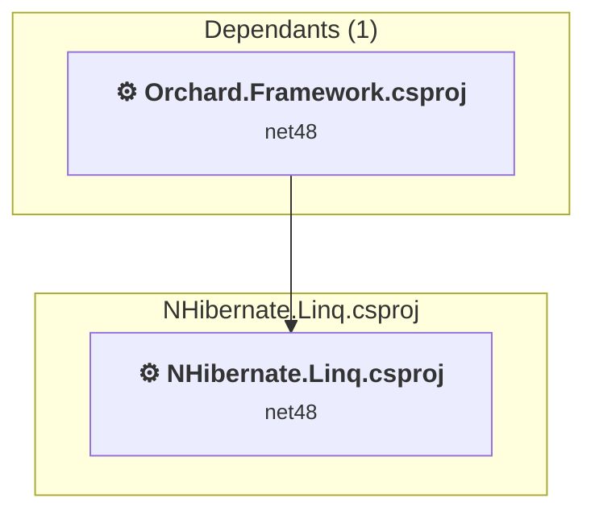

### API Compatibility

| Category | Count | Impact |
| :--- | :---: | :--- |
| 🔴 Binary Incompatible | 30 | High - Require code changes |
| 🟡 Source Incompatible | 0 | Medium - Needs re-compilation and potential conflicting API error fixing |
| 🔵 Behavioral change | 0 | Low - Behavioral changes that may require testing at runtime |
| ✅ Compatible | 3441 |  |
| ***Total APIs Analyzed*** | ***3471*** |  |

#### Project Technologies and Features

| Technology | Issues | Percentage | Migration Path |
| :--- | :---: | :---: | :--- |
| WCF Data Services | 30 | 100.0% | WCF Data Services (OData) APIs for exposing data through OData endpoints that are not supported in .NET Core/.NET. WCF Data Services provided OData v1-v3 support but is obsolete. Migrate to OData v4+ libraries or ASP.NET Core OData. |

<a id="orchardazuretestsorchardazuretestscsproj"></a>
### Orchard.Azure.Tests\Orchard.Azure.Tests.csproj

#### Project Info

- **Current Target Framework:** net48
- **Proposed Target Framework:** net10.0
- **SDK-style**: False
- **Project Kind:** ClassicClassLibrary
- **Dependencies**: 2
- **Dependants**: 0
- **Number of Files**: 4
- **Number of Files with Incidents**: 2
- **Lines of Code**: 526
- **Estimated LOC to modify**: 3+ (at least 0.6% of the project)

#### Dependency Graph

Legend:
📦 SDK-style project
⚙️ Classic project

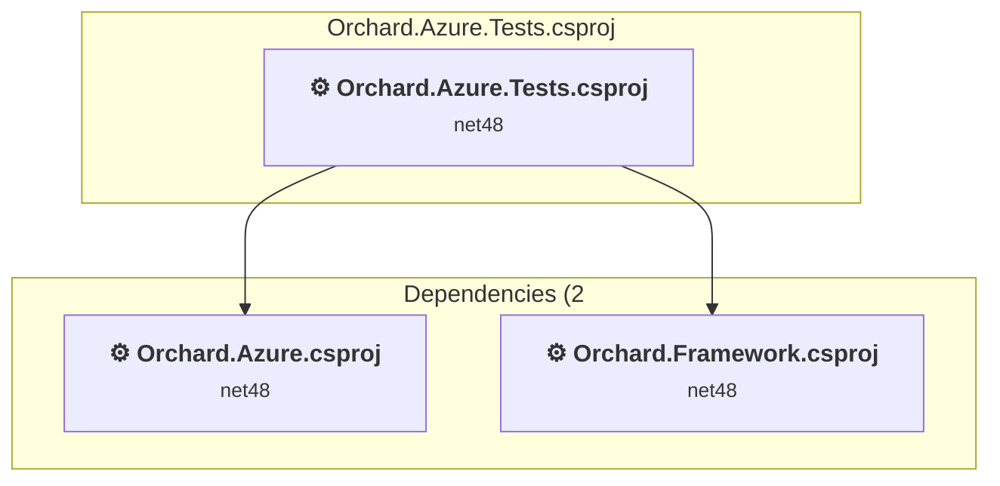

### API Compatibility

| Category | Count | Impact |
| :--- | :---: | :--- |
| 🔴 Binary Incompatible | 0 | High - Require code changes |
| 🟡 Source Incompatible | 3 | Medium - Needs re-compilation and potential conflicting API error fixing |
| 🔵 Behavioral change | 0 | Low - Behavioral changes that may require testing at runtime |
| ✅ Compatible | 353 |  |
| ***Total APIs Analyzed*** | ***356*** |  |

#### Project Technologies and Features

| Technology | Issues | Percentage | Migration Path |
| :--- | :---: | :---: | :--- |
| ASP.NET Framework (System.Web) | 3 | 100.0% | Legacy ASP.NET Framework APIs for web applications (System.Web.*) that don't exist in ASP.NET Core due to architectural differences. ASP.NET Core represents a complete redesign of the web framework. Migrate to ASP.NET Core equivalents or consider System.Web.Adapters package for compatibility. |

<a id="orchardcoretestsorchardcoretestscsproj"></a>
### Orchard.Core.Tests\Orchard.Core.Tests.csproj

#### Project Info

- **Current Target Framework:** net48
- **Proposed Target Framework:** net10.0
- **SDK-style**: False
- **Project Kind:** ClassicClassLibrary
- **Dependencies**: 4
- **Dependants**: 0
- **Number of Files**: 8
- **Number of Files with Incidents**: 4
- **Lines of Code**: 1603
- **Estimated LOC to modify**: 21+ (at least 1.3% of the project)

#### Dependency Graph

Legend:
📦 SDK-style project
⚙️ Classic project

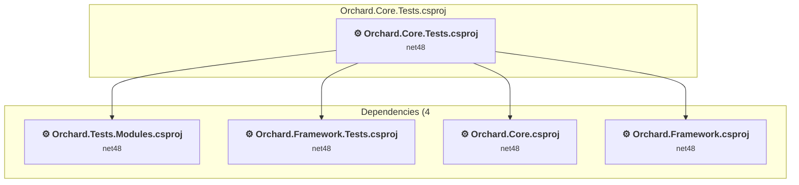

### API Compatibility

| Category | Count | Impact |
| :--- | :---: | :--- |
| 🔴 Binary Incompatible | 6 | High - Require code changes |
| 🟡 Source Incompatible | 15 | Medium - Needs re-compilation and potential conflicting API error fixing |
| 🔵 Behavioral change | 0 | Low - Behavioral changes that may require testing at runtime |
| ✅ Compatible | 403 |  |
| ***Total APIs Analyzed*** | ***424*** |  |

#### Project Technologies and Features

| Technology | Issues | Percentage | Migration Path |
| :--- | :---: | :---: | :--- |
| ASP.NET Framework (System.Web) | 6 | 28.6% | Legacy ASP.NET Framework APIs for web applications (System.Web.*) that don't exist in ASP.NET Core due to architectural differences. ASP.NET Core represents a complete redesign of the web framework. Migrate to ASP.NET Core equivalents or consider System.Web.Adapters package for compatibility. |

<a id="orchardprofileorchardprofilecsproj"></a>
### Orchard.Profile\Orchard.Profile.csproj

#### Project Info

- **Current Target Framework:** net48
- **Proposed Target Framework:** net10.0
- **SDK-style**: False
- **Project Kind:** ClassicClassLibrary
- **Dependencies**: 0
- **Dependants**: 0
- **Number of Files**: 9
- **Number of Files with Incidents**: 1
- **Lines of Code**: 273
- **Estimated LOC to modify**: 0+ (at least 0.0% of the project)

#### Dependency Graph

Legend:
📦 SDK-style project
⚙️ Classic project

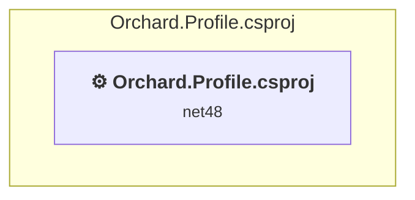

### API Compatibility

| Category | Count | Impact |
| :--- | :---: | :--- |
| 🔴 Binary Incompatible | 0 | High - Require code changes |
| 🟡 Source Incompatible | 0 | Medium - Needs re-compilation and potential conflicting API error fixing |
| 🔵 Behavioral change | 0 | Low - Behavioral changes that may require testing at runtime |
| ✅ Compatible | 0 |  |
| ***Total APIs Analyzed*** | ***0*** |  |

<a id="orchardspecsorchardspecscsproj"></a>
### Orchard.Specs\Orchard.Specs.csproj

#### Project Info

- **Current Target Framework:** net48
- **Proposed Target Framework:** net10.0
- **SDK-style**: False
- **Project Kind:** ClassicClassLibrary
- **Dependencies**: 6
- **Dependants**: 0
- **Number of Files**: 69
- **Number of Files with Incidents**: 1
- **Lines of Code**: 10069
- **Estimated LOC to modify**: 0+ (at least 0.0% of the project)

#### Dependency Graph

Legend:
📦 SDK-style project
⚙️ Classic project

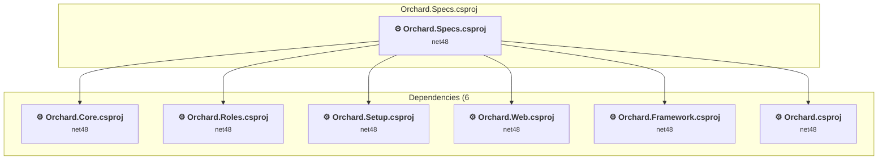

### API Compatibility

| Category | Count | Impact |
| :--- | :---: | :--- |
| 🔴 Binary Incompatible | 0 | High - Require code changes |
| 🟡 Source Incompatible | 0 | Medium - Needs re-compilation and potential conflicting API error fixing |
| 🔵 Behavioral change | 0 | Low - Behavioral changes that may require testing at runtime |
| ✅ Compatible | 928 |  |
| ***Total APIs Analyzed*** | ***928*** |  |

<a id="orchardtestsmodulesorchardtestsmodulescsproj"></a>
### Orchard.Tests.Modules\Orchard.Tests.Modules.csproj

#### Project Info

- **Current Target Framework:** net48
- **Proposed Target Framework:** net10.0
- **SDK-style**: False
- **Project Kind:** ClassicClassLibrary
- **Dependencies**: 28
- **Dependants**: 1
- **Number of Files**: 60
- **Number of Files with Incidents**: 8
- **Lines of Code**: 9916
- **Estimated LOC to modify**: 79+ (at least 0.8% of the project)

#### Dependency Graph

Legend:
📦 SDK-style project
⚙️ Classic project

```mermaid
flowchart TB
    subgraph upstream["Dependants (1)"]
        P9["<b>⚙️&nbsp;Orchard.Core.Tests.csproj</b><br/><small>net48</small>"]
        click P9 "#orchardcoretestsorchardcoretestscsproj"
    end
    subgraph current["Orchard.Tests.Modules.csproj"]
        MAIN["<b>⚙️&nbsp;Orchard.Tests.Modules.csproj</b><br/><small>net48</small>"]
        click MAIN "#orchardtestsmodulesorchardtestsmodulescsproj"
    end
    subgraph downstream["Dependencies (28"]
        P3["<b>⚙️&nbsp;Orchard.Framework.Tests.csproj</b><br/><small>net48</small>"]
        P8["<b>⚙️&nbsp;Orchard.Core.csproj</b><br/><small>net48</small>"]
        P30["<b>⚙️&nbsp;Lucene.csproj</b><br/><small>net48</small>"]
        P56["<b>⚙️&nbsp;Orchard.Autoroute.csproj</b><br/><small>net48</small>"]
        P32["<b>⚙️&nbsp;Orchard.CodeGeneration.csproj</b><br/><small>net48</small>"]
        P26["<b>⚙️&nbsp;Orchard.Comments.csproj</b><br/><small>net48</small>"]
        P81["<b>⚙️&nbsp;Orchard.Conditions.csproj</b><br/><small>net48</small>"]
        P41["<b>⚙️&nbsp;Orchard.DesignerTools.csproj</b><br/><small>net48</small>"]
        P79["<b>⚙️&nbsp;Orchard.DynamicForms.csproj</b><br/><small>net48</small>"]
        P25["<b>⚙️&nbsp;Orchard.Email.csproj</b><br/><small>net48</small>"]
        P44["<b>⚙️&nbsp;Orchard.ImportExport.csproj</b><br/><small>net48</small>"]
        P28["<b>⚙️&nbsp;Orchard.Indexing.csproj</b><br/><small>net48</small>"]
        P63["<b>⚙️&nbsp;Orchard.MediaProcessing.csproj</b><br/><small>net48</small>"]
        P24["<b>⚙️&nbsp;Orchard.Media.csproj</b><br/><small>net48</small>"]
        P17["<b>⚙️&nbsp;Orchard.Modules.csproj</b><br/><small>net48</small>"]
        P18["<b>⚙️&nbsp;Orchard.Packaging.csproj</b><br/><small>net48</small>"]
        P43["<b>⚙️&nbsp;Orchard.Recipes.csproj</b><br/><small>net48</small>"]
        P7["<b>⚙️&nbsp;Orchard.Roles.csproj</b><br/><small>net48</small>"]
        P39["<b>⚙️&nbsp;Orchard.Scripting.Dlr.csproj</b><br/><small>net48</small>"]
        P40["<b>⚙️&nbsp;Orchard.Scripting.csproj</b><br/><small>net48</small>"]
        P10["<b>⚙️&nbsp;Orchard.Setup.csproj</b><br/><small>net48</small>"]
        P21["<b>⚙️&nbsp;Orchard.Tags.csproj</b><br/><small>net48</small>"]
        P14["<b>⚙️&nbsp;Orchard.Themes.csproj</b><br/><small>net48</small>"]
        P5["<b>⚙️&nbsp;Orchard.Users.csproj</b><br/><small>net48</small>"]
        P45["<b>⚙️&nbsp;Orchard.Warmup.csproj</b><br/><small>net48</small>"]
        P31["<b>⚙️&nbsp;Orchard.Widgets.csproj</b><br/><small>net48</small>"]
        P62["<b>⚙️&nbsp;Orchard.Workflows.csproj</b><br/><small>net48</small>"]
        P2["<b>⚙️&nbsp;Orchard.Framework.csproj</b><br/><small>net48</small>"]
        click P3 "#orchardtestsorchardframeworktestscsproj"
        click P8 "#orchardwebcoreorchardcorecsproj"
        click P30 "#orchardwebmoduleslucenelucenecsproj"
        click P56 "#orchardwebmodulesorchardautorouteorchardautoroutecsproj"
        click P32 "#orchardwebmodulesorchardcodegenerationorchardcodegenerationcsproj"
        click P26 "#orchardwebmodulesorchardcommentsorchardcommentscsproj"
        click P81 "#orchardwebmodulesorchardconditionsorchardconditionscsproj"
        click P41 "#orchardwebmodulesorcharddesignertoolsorcharddesignertoolscsproj"
        click P79 "#orchardwebmodulesorcharddynamicformsorcharddynamicformscsproj"
        click P25 "#orchardwebmodulesorchardemailorchardemailcsproj"
        click P44 "#orchardwebmodulesorchardimportexportorchardimportexportcsproj"
        click P28 "#orchardwebmodulesorchardindexingorchardindexingcsproj"
        click P63 "#orchardwebmodulesorchardmediaprocessingorchardmediaprocessingcsproj"
        click P24 "#orchardwebmodulesorchardmediaorchardmediacsproj"
        click P17 "#orchardwebmodulesorchardmodulesorchardmodulescsproj"
        click P18 "#orchardwebmodulesorchardpackagingorchardpackagingcsproj"
        click P43 "#orchardwebmodulesorchardrecipesorchardrecipescsproj"
        click P7 "#orchardwebmodulesorchardrolesorchardrolescsproj"
        click P39 "#orchardwebmodulesorchardscriptingdlrorchardscriptingdlrcsproj"
        click P40 "#orchardwebmodulesorchardscriptingorchardscriptingcsproj"
        click P10 "#orchardwebmodulesorchardsetuporchardsetupcsproj"
        click P21 "#orchardwebmodulesorchardtagsorchardtagscsproj"
        click P14 "#orchardwebmodulesorchardthemesorchardthemescsproj"
        click P5 "#orchardwebmodulesorchardusersorcharduserscsproj"
        click P45 "#orchardwebmodulesorchardwarmuporchardwarmupcsproj"
        click P31 "#orchardwebmodulesorchardwidgetsorchardwidgetscsproj"
        click P62 "#orchardwebmodulesorchardworkflowsorchardworkflowscsproj"
        click P2 "#orchardorchardframeworkcsproj"
    end
    P9 --> MAIN
    MAIN --> P3
    MAIN --> P8
    MAIN --> P30
    MAIN --> P56
    MAIN --> P32
    MAIN --> P26
    MAIN --> P81
    MAIN --> P41
    MAIN --> P79
    MAIN --> P25
    MAIN --> P44
    MAIN --> P28
    MAIN --> P63
    MAIN --> P24
    MAIN --> P17
    MAIN --> P18
    MAIN --> P43
    MAIN --> P7
    MAIN --> P39
    MAIN --> P40
    MAIN --> P10
    MAIN --> P21
    MAIN --> P14
    MAIN --> P5
    MAIN --> P45
    MAIN --> P31
    MAIN --> P62
    MAIN --> P2

```

### API Compatibility

| Category | Count | Impact |
| :--- | :---: | :--- |
| 🔴 Binary Incompatible | 15 | High - Require code changes |
| 🟡 Source Incompatible | 59 | Medium - Needs re-compilation and potential conflicting API error fixing |
| 🔵 Behavioral change | 5 | Low - Behavioral changes that may require testing at runtime |
| ✅ Compatible | 5898 |  |
| ***Total APIs Analyzed*** | ***5977*** |  |

#### Project Technologies and Features

| Technology | Issues | Percentage | Migration Path |
| :--- | :---: | :---: | :--- |
| Legacy Cryptography | 2 | 2.5% | Obsolete or insecure cryptographic algorithms that have been deprecated for security reasons. These algorithms are no longer considered secure by modern standards. Migrate to modern cryptographic APIs using secure algorithms. |
| ASP.NET Framework (System.Web) | 35 | 44.3% | Legacy ASP.NET Framework APIs for web applications (System.Web.*) that don't exist in ASP.NET Core due to architectural differences. ASP.NET Core represents a complete redesign of the web framework. Migrate to ASP.NET Core equivalents or consider System.Web.Adapters package for compatibility. |

<a id="orchardtestsorchardframeworktestscsproj"></a>
### Orchard.Tests\Orchard.Framework.Tests.csproj

#### Project Info

- **Current Target Framework:** net48
- **Proposed Target Framework:** net10.0
- **SDK-style**: False
- **Project Kind:** ClassicClassLibrary
- **Dependencies**: 2
- **Dependants**: 3
- **Number of Files**: 179
- **Number of Files with Incidents**: 1
- **Lines of Code**: 23163
- **Estimated LOC to modify**: 0+ (at least 0.0% of the project)

#### Dependency Graph

Legend:
📦 SDK-style project
⚙️ Classic project

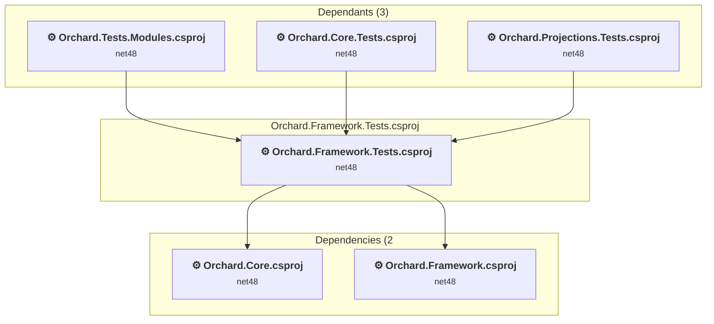

### API Compatibility

| Category | Count | Impact |
| :--- | :---: | :--- |
| 🔴 Binary Incompatible | 0 | High - Require code changes |
| 🟡 Source Incompatible | 0 | Medium - Needs re-compilation and potential conflicting API error fixing |
| 🔵 Behavioral change | 0 | Low - Behavioral changes that may require testing at runtime |
| ✅ Compatible | 3009 |  |
| ***Total APIs Analyzed*** | ***3009*** |  |

<a id="orchardwarmupstarterorchardwarmupstartercsproj"></a>
### Orchard.WarmupStarter\Orchard.WarmupStarter.csproj

#### Project Info

- **Current Target Framework:** net48
- **Proposed Target Framework:** net10.0
- **SDK-style**: False
- **Project Kind:** ClassicClassLibrary
- **Dependencies**: 0
- **Dependants**: 1
- **Number of Files**: 4
- **Number of Files with Incidents**: 4
- **Lines of Code**: 414
- **Estimated LOC to modify**: 60+ (at least 14.5% of the project)

#### Dependency Graph

Legend:
📦 SDK-style project
⚙️ Classic project

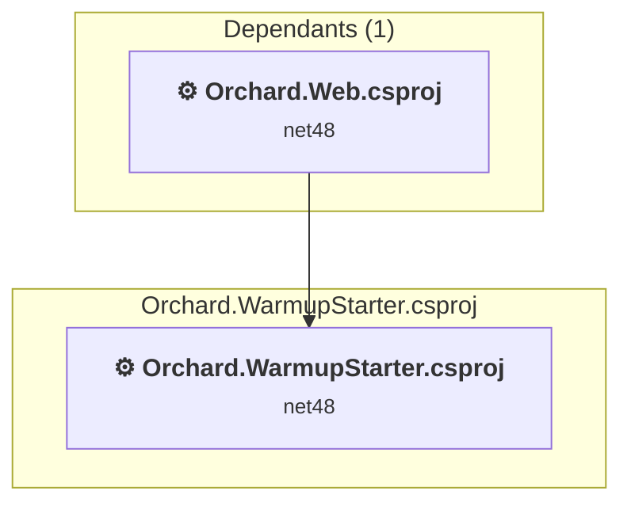

### API Compatibility

| Category | Count | Impact |
| :--- | :---: | :--- |
| 🔴 Binary Incompatible | 8 | High - Require code changes |
| 🟡 Source Incompatible | 51 | Medium - Needs re-compilation and potential conflicting API error fixing |
| 🔵 Behavioral change | 1 | Low - Behavioral changes that may require testing at runtime |
| ✅ Compatible | 162 |  |
| ***Total APIs Analyzed*** | ***222*** |  |

#### Project Technologies and Features

| Technology | Issues | Percentage | Migration Path |
| :--- | :---: | :---: | :--- |
| ASP.NET Framework (System.Web) | 59 | 98.3% | Legacy ASP.NET Framework APIs for web applications (System.Web.*) that don't exist in ASP.NET Core due to architectural differences. ASP.NET Core represents a complete redesign of the web framework. Migrate to ASP.NET Core equivalents or consider System.Web.Adapters package for compatibility. |

<a id="orchardwebtestsorchardwebtestscsproj"></a>
### Orchard.Web.Tests\Orchard.Web.Tests.csproj

#### Project Info

- **Current Target Framework:** net48
- **Proposed Target Framework:** net10.0
- **SDK-style**: False
- **Project Kind:** ClassicClassLibrary
- **Dependencies**: 2
- **Dependants**: 0
- **Number of Files**: 4
- **Number of Files with Incidents**: 4
- **Lines of Code**: 112
- **Estimated LOC to modify**: 18+ (at least 16.1% of the project)

#### Dependency Graph

Legend:
📦 SDK-style project
⚙️ Classic project

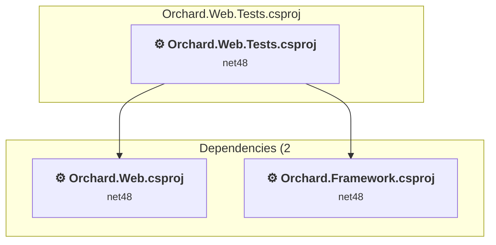

### API Compatibility

| Category | Count | Impact |
| :--- | :---: | :--- |
| 🔴 Binary Incompatible | 10 | High - Require code changes |
| 🟡 Source Incompatible | 8 | Medium - Needs re-compilation and potential conflicting API error fixing |
| 🔵 Behavioral change | 0 | Low - Behavioral changes that may require testing at runtime |
| ✅ Compatible | 22 |  |
| ***Total APIs Analyzed*** | ***40*** |  |

#### Project Technologies and Features

| Technology | Issues | Percentage | Migration Path |
| :--- | :---: | :---: | :--- |
| ASP.NET Framework (System.Web) | 18 | 100.0% | Legacy ASP.NET Framework APIs for web applications (System.Web.*) that don't exist in ASP.NET Core due to architectural differences. ASP.NET Core represents a complete redesign of the web framework. Migrate to ASP.NET Core equivalents or consider System.Web.Adapters package for compatibility. |

<a id="orchardwebcoreorchardcorecsproj"></a>
### Orchard.Web\Core\Orchard.Core.csproj

#### Project Info

- **Current Target Framework:** net48
- **Proposed Target Framework:** net10.0
- **SDK-style**: False
- **Project Kind:** Wap
- **Dependencies**: 1
- **Dependants**: 66
- **Number of Files**: 375
- **Number of Files with Incidents**: 32
- **Lines of Code**: 15341
- **Estimated LOC to modify**: 272+ (at least 1.8% of the project)

#### Dependency Graph

Legend:
📦 SDK-style project
⚙️ Classic project

```mermaid
flowchart TB
    subgraph upstream["Dependants (66)"]
        P1["<b>⚙️&nbsp;Orchard.Web.csproj</b><br/><small>net48</small>"]
        P3["<b>⚙️&nbsp;Orchard.Framework.Tests.csproj</b><br/><small>net48</small>"]
        P5["<b>⚙️&nbsp;Orchard.Users.csproj</b><br/><small>net48</small>"]
        P6["<b>⚙️&nbsp;Orchard.Tests.Modules.csproj</b><br/><small>net48</small>"]
        P7["<b>⚙️&nbsp;Orchard.Roles.csproj</b><br/><small>net48</small>"]
        P9["<b>⚙️&nbsp;Orchard.Core.Tests.csproj</b><br/><small>net48</small>"]
        P10["<b>⚙️&nbsp;Orchard.Setup.csproj</b><br/><small>net48</small>"]
        P12["<b>⚙️&nbsp;Orchard.Specs.csproj</b><br/><small>net48</small>"]
        P14["<b>⚙️&nbsp;Orchard.Themes.csproj</b><br/><small>net48</small>"]
        P19["<b>⚙️&nbsp;Orchard.ContentTypes.csproj</b><br/><small>net48</small>"]
        P20["<b>⚙️&nbsp;Orchard.Blogs.csproj</b><br/><small>net48</small>"]
        P21["<b>⚙️&nbsp;Orchard.Tags.csproj</b><br/><small>net48</small>"]
        P24["<b>⚙️&nbsp;Orchard.Media.csproj</b><br/><small>net48</small>"]
        P25["<b>⚙️&nbsp;Orchard.Email.csproj</b><br/><small>net48</small>"]
        P26["<b>⚙️&nbsp;Orchard.Comments.csproj</b><br/><small>net48</small>"]
        P27["<b>⚙️&nbsp;Orchard.ArchiveLater.csproj</b><br/><small>net48</small>"]
        P28["<b>⚙️&nbsp;Orchard.Indexing.csproj</b><br/><small>net48</small>"]
        P29["<b>⚙️&nbsp;Orchard.Search.csproj</b><br/><small>net48</small>"]
        P31["<b>⚙️&nbsp;Orchard.Widgets.csproj</b><br/><small>net48</small>"]
        P32["<b>⚙️&nbsp;Orchard.CodeGeneration.csproj</b><br/><small>net48</small>"]
        P33["<b>⚙️&nbsp;Orchard.Migrations.csproj</b><br/><small>net48</small>"]
        P35["<b>⚙️&nbsp;Orchard.PublishLater.csproj</b><br/><small>net48</small>"]
        P36["<b>⚙️&nbsp;Orchard.Lists.csproj</b><br/><small>net48</small>"]
        P37["<b>⚙️&nbsp;Orchard.Pages.csproj</b><br/><small>net48</small>"]
        P38["<b>⚙️&nbsp;Orchard.Localization.csproj</b><br/><small>net48</small>"]
        P42["<b>⚙️&nbsp;Orchard.MediaPicker.csproj</b><br/><small>net48</small>"]
        P44["<b>⚙️&nbsp;Orchard.ImportExport.csproj</b><br/><small>net48</small>"]
        P45["<b>⚙️&nbsp;Orchard.Warmup.csproj</b><br/><small>net48</small>"]
        P47["<b>⚙️&nbsp;Orchard.Tokens.csproj</b><br/><small>net48</small>"]
        P48["<b>⚙️&nbsp;Orchard.Forms.csproj</b><br/><small>net48</small>"]
        P49["<b>⚙️&nbsp;Orchard.Rules.csproj</b><br/><small>net48</small>"]
        P50["<b>⚙️&nbsp;Markdown.csproj</b><br/><small>net48</small>"]
        P51["<b>⚙️&nbsp;Orchard.Tokens.Tests.csproj</b><br/><small>net48</small>"]
        P52["<b>⚙️&nbsp;Orchard.Projections.csproj</b><br/><small>net48</small>"]
        P53["<b>⚙️&nbsp;Orchard.Projections.Tests.csproj</b><br/><small>net48</small>"]
        P54["<b>⚙️&nbsp;Orchard.Fields.csproj</b><br/><small>net48</small>"]
        P55["<b>⚙️&nbsp;Orchard.Alias.csproj</b><br/><small>net48</small>"]
        P56["<b>⚙️&nbsp;Orchard.Autoroute.csproj</b><br/><small>net48</small>"]
        P57["<b>⚙️&nbsp;Orchard.AntiSpam.csproj</b><br/><small>net48</small>"]
        P58["<b>⚙️&nbsp;Orchard.CustomForms.csproj</b><br/><small>net48</small>"]
        P59["<b>⚙️&nbsp;Orchard.ContentPicker.csproj</b><br/><small>net48</small>"]
        P60["<b>⚙️&nbsp;Orchard.ContentPermissions.csproj</b><br/><small>net48</small>"]
        P61["<b>⚙️&nbsp;SysCache.csproj</b><br/><small>net48</small>"]
        P62["<b>⚙️&nbsp;Orchard.Workflows.csproj</b><br/><small>net48</small>"]
        P63["<b>⚙️&nbsp;Orchard.MediaProcessing.csproj</b><br/><small>net48</small>"]
        P64["<b>⚙️&nbsp;Orchard.Scripting.CSharp.csproj</b><br/><small>net48</small>"]
        P65["<b>⚙️&nbsp;Orchard.Taxonomies.csproj</b><br/><small>net48</small>"]
        P66["<b>⚙️&nbsp;Orchard.ImageEditor.csproj</b><br/><small>net48</small>"]
        P67["<b>⚙️&nbsp;Orchard.MediaLibrary.csproj</b><br/><small>net48</small>"]
        P68["<b>⚙️&nbsp;Orchard.OutputCache.csproj</b><br/><small>net48</small>"]
        P69["<b>⚙️&nbsp;Upgrade.csproj</b><br/><small>net48</small>"]
        P71["<b>⚙️&nbsp;Orchard.SecureSocketsLayer.csproj</b><br/><small>net48</small>"]
        P72["<b>⚙️&nbsp;Orchard.Templates.csproj</b><br/><small>net48</small>"]
        P73["<b>⚙️&nbsp;Orchard.JobsQueue.csproj</b><br/><small>net48</small>"]
        P75["<b>⚙️&nbsp;Orchard.AuditTrail.csproj</b><br/><small>net48</small>"]
        P76["<b>⚙️&nbsp;Orchard.MessageBus.csproj</b><br/><small>net48</small>"]
        P77["<b>⚙️&nbsp;Orchard.Redis.csproj</b><br/><small>net48</small>"]
        P78["<b>⚙️&nbsp;Orchard.Layouts.csproj</b><br/><small>net48</small>"]
        P79["<b>⚙️&nbsp;Orchard.DynamicForms.csproj</b><br/><small>net48</small>"]
        P80["<b>⚙️&nbsp;Orchard.Dashboards.csproj</b><br/><small>net48</small>"]
        P81["<b>⚙️&nbsp;Orchard.Conditions.csproj</b><br/><small>net48</small>"]
        P82["<b>⚙️&nbsp;Orchard.Resources.csproj</b><br/><small>net48</small>"]
        P83["<b>⚙️&nbsp;Orchard.OpenId.csproj</b><br/><small>net48</small>"]
        P84["<b>⚙️&nbsp;Orchard.Glimpse.csproj</b><br/><small>net48</small>"]
        P85["<b>⚙️&nbsp;Orchard.ContentPreview.csproj</b><br/><small>net48</small>"]
        P86["<b>⚙️&nbsp;Orchard.MediaLibrary.WebSearch.csproj</b><br/><small>net48</small>"]
        click P1 "#orchardweborchardwebcsproj"
        click P3 "#orchardtestsorchardframeworktestscsproj"
        click P5 "#orchardwebmodulesorchardusersorcharduserscsproj"
        click P6 "#orchardtestsmodulesorchardtestsmodulescsproj"
        click P7 "#orchardwebmodulesorchardrolesorchardrolescsproj"
        click P9 "#orchardcoretestsorchardcoretestscsproj"
        click P10 "#orchardwebmodulesorchardsetuporchardsetupcsproj"
        click P12 "#orchardspecsorchardspecscsproj"
        click P14 "#orchardwebmodulesorchardthemesorchardthemescsproj"
        click P19 "#orchardwebmodulesorchardcontenttypesorchardcontenttypescsproj"
        click P20 "#orchardwebmodulesorchardblogsorchardblogscsproj"
        click P21 "#orchardwebmodulesorchardtagsorchardtagscsproj"
        click P24 "#orchardwebmodulesorchardmediaorchardmediacsproj"
        click P25 "#orchardwebmodulesorchardemailorchardemailcsproj"
        click P26 "#orchardwebmodulesorchardcommentsorchardcommentscsproj"
        click P27 "#orchardwebmodulesorchardarchivelaterorchardarchivelatercsproj"
        click P28 "#orchardwebmodulesorchardindexingorchardindexingcsproj"
        click P29 "#orchardwebmodulesorchardsearchorchardsearchcsproj"
        click P31 "#orchardwebmodulesorchardwidgetsorchardwidgetscsproj"
        click P32 "#orchardwebmodulesorchardcodegenerationorchardcodegenerationcsproj"
        click P33 "#orchardwebmodulesorchardmigrationsorchardmigrationscsproj"
        click P35 "#orchardwebmodulesorchardpublishlaterorchardpublishlatercsproj"
        click P36 "#orchardwebmodulesorchardlistsorchardlistscsproj"
        click P37 "#orchardwebmodulesorchardpagesorchardpagescsproj"
        click P38 "#orchardwebmodulesorchardlocalizationorchardlocalizationcsproj"
        click P42 "#orchardwebmodulesorchardmediapickerorchardmediapickercsproj"
        click P44 "#orchardwebmodulesorchardimportexportorchardimportexportcsproj"
        click P45 "#orchardwebmodulesorchardwarmuporchardwarmupcsproj"
        click P47 "#orchardwebmodulesorchardtokensorchardtokenscsproj"
        click P48 "#orchardwebmodulesorchardformsorchardformscsproj"
        click P49 "#orchardwebmodulesorchardrulesorchardrulescsproj"
        click P50 "#orchardwebmodulesmarkdownmarkdowncsproj"
        click P51 "#orchardwebmodulesorchardtokenstestsorchardtokenstestscsproj"
        click P52 "#orchardwebmodulesorchardprojectionsorchardprojectionscsproj"
        click P53 "#orchardwebmodulesorchardprojectionstestsorchardprojectionstestscsproj"
        click P54 "#orchardwebmodulesorchardfieldsorchardfieldscsproj"
        click P55 "#orchardwebmodulesorchardaliasorchardaliascsproj"
        click P56 "#orchardwebmodulesorchardautorouteorchardautoroutecsproj"
        click P57 "#orchardwebmodulesorchardantispamorchardantispamcsproj"
        click P58 "#orchardwebmodulesorchardcustomformsorchardcustomformscsproj"
        click P59 "#orchardwebmodulesorchardcontentpickerorchardcontentpickercsproj"
        click P60 "#orchardwebmodulesorchardcontentpermissionsorchardcontentpermissionscsproj"
        click P61 "#orchardwebmodulessyscachesyscachecsproj"
        click P62 "#orchardwebmodulesorchardworkflowsorchardworkflowscsproj"
        click P63 "#orchardwebmodulesorchardmediaprocessingorchardmediaprocessingcsproj"
        click P64 "#orchardwebmodulesorchardscriptingcsharporchardscriptingcsharpcsproj"
        click P65 "#orchardwebmodulesorchardtaxonomiesorchardtaxonomiescsproj"
        click P66 "#orchardwebmodulesorchardimageeditororchardimageeditorcsproj"
        click P67 "#orchardwebmodulesorchardmedialibraryorchardmedialibrarycsproj"
        click P68 "#orchardwebmodulesorchardoutputcacheorchardoutputcachecsproj"
        click P69 "#orchardwebmodulesupgradeupgradecsproj"
        click P71 "#orchardwebmodulesorchardsecuresocketslayerorchardsecuresocketslayercsproj"
        click P72 "#orchardwebmodulesorchardtemplatesorchardtemplatescsproj"
        click P73 "#orchardwebmodulesorchardjobsqueueorchardjobsqueuecsproj"
        click P75 "#orchardwebmodulesorchardaudittrailorchardaudittrailcsproj"
        click P76 "#orchardwebmodulesorchardmessagebusorchardmessagebuscsproj"
        click P77 "#orchardwebmodulesorchardredisorchardrediscsproj"
        click P78 "#orchardwebmodulesorchardlayoutsorchardlayoutscsproj"
        click P79 "#orchardwebmodulesorcharddynamicformsorcharddynamicformscsproj"
        click P80 "#orchardwebmodulesorcharddashboardsorcharddashboardscsproj"
        click P81 "#orchardwebmodulesorchardconditionsorchardconditionscsproj"
        click P82 "#orchardwebmodulesorchardresourcesorchardresourcescsproj"
        click P83 "#orchardwebmodulesorchardopenidorchardopenidcsproj"
        click P84 "#orchardwebmodulesorchardglimpseorchardglimpsecsproj"
        click P85 "#orchardwebmodulesorchardcontentprevieworchardcontentpreviewcsproj"
        click P86 "#orchardwebmodulesorchardmedialibrarywebsearchorchardmedialibrarywebsearchcsproj"
    end
    subgraph current["Orchard.Core.csproj"]
        MAIN["<b>⚙️&nbsp;Orchard.Core.csproj</b><br/><small>net48</small>"]
        click MAIN "#orchardwebcoreorchardcorecsproj"
    end
    subgraph downstream["Dependencies (1"]
        P2["<b>⚙️&nbsp;Orchard.Framework.csproj</b><br/><small>net48</small>"]
        click P2 "#orchardorchardframeworkcsproj"
    end
    P1 --> MAIN
    P3 --> MAIN
    P5 --> MAIN
    P6 --> MAIN
    P7 --> MAIN
    P9 --> MAIN
    P10 --> MAIN
    P12 --> MAIN
    P14 --> MAIN
    P19 --> MAIN
    P20 --> MAIN
    P21 --> MAIN
    P24 --> MAIN
    P25 --> MAIN
    P26 --> MAIN
    P27 --> MAIN
    P28 --> MAIN
    P29 --> MAIN
    P31 --> MAIN
    P32 --> MAIN
    P33 --> MAIN
    P35 --> MAIN
    P36 --> MAIN
    P37 --> MAIN
    P38 --> MAIN
    P42 --> MAIN
    P44 --> MAIN
    P45 --> MAIN
    P47 --> MAIN
    P48 --> MAIN
    P49 --> MAIN
    P50 --> MAIN
    P51 --> MAIN
    P52 --> MAIN
    P53 --> MAIN
    P54 --> MAIN
    P55 --> MAIN
    P56 --> MAIN
    P57 --> MAIN
    P58 --> MAIN
    P59 --> MAIN
    P60 --> MAIN
    P61 --> MAIN
    P62 --> MAIN
    P63 --> MAIN
    P64 --> MAIN
    P65 --> MAIN
    P66 --> MAIN
    P67 --> MAIN
    P68 --> MAIN
    P69 --> MAIN
    P71 --> MAIN
    P72 --> MAIN
    P73 --> MAIN
    P75 --> MAIN
    P76 --> MAIN
    P77 --> MAIN
    P78 --> MAIN
    P79 --> MAIN
    P80 --> MAIN
    P81 --> MAIN
    P82 --> MAIN
    P83 --> MAIN
    P84 --> MAIN
    P85 --> MAIN
    P86 --> MAIN
    MAIN --> P2

```

### API Compatibility

| Category | Count | Impact |
| :--- | :---: | :--- |
| 🔴 Binary Incompatible | 220 | High - Require code changes |
| 🟡 Source Incompatible | 48 | Medium - Needs re-compilation and potential conflicting API error fixing |
| 🔵 Behavioral change | 4 | Low - Behavioral changes that may require testing at runtime |
| ✅ Compatible | 8214 |  |
| ***Total APIs Analyzed*** | ***8486*** |  |

#### Project Technologies and Features

| Technology | Issues | Percentage | Migration Path |
| :--- | :---: | :---: | :--- |
| ASP.NET Framework (System.Web) | 267 | 98.2% | Legacy ASP.NET Framework APIs for web applications (System.Web.*) that don't exist in ASP.NET Core due to architectural differences. ASP.NET Core represents a complete redesign of the web framework. Migrate to ASP.NET Core equivalents or consider System.Web.Adapters package for compatibility. |

<a id="orchardwebmoduleslucenelucenecsproj"></a>
### Orchard.Web\Modules\Lucene\Lucene.csproj

#### Project Info

- **Current Target Framework:** net48
- **Proposed Target Framework:** net10.0
- **SDK-style**: False
- **Project Kind:** Wap
- **Dependencies**: 1
- **Dependants**: 1
- **Number of Files**: 20
- **Number of Files with Incidents**: 1
- **Lines of Code**: 1340
- **Estimated LOC to modify**: 0+ (at least 0.0% of the project)

#### Dependency Graph

Legend:
📦 SDK-style project
⚙️ Classic project

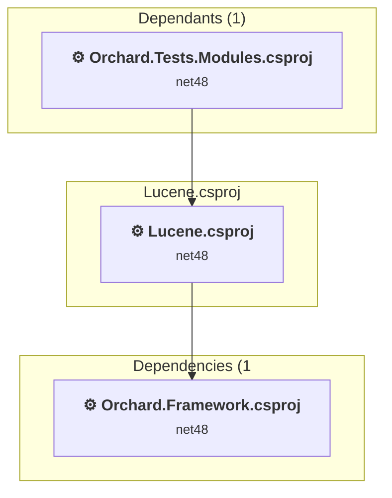

### API Compatibility

| Category | Count | Impact |
| :--- | :---: | :--- |
| 🔴 Binary Incompatible | 0 | High - Require code changes |
| 🟡 Source Incompatible | 0 | Medium - Needs re-compilation and potential conflicting API error fixing |
| 🔵 Behavioral change | 0 | Low - Behavioral changes that may require testing at runtime |
| ✅ Compatible | 727 |  |
| ***Total APIs Analyzed*** | ***727*** |  |

<a id="orchardwebmodulesmarkdownmarkdowncsproj"></a>
### Orchard.Web\Modules\Markdown\Markdown.csproj

#### Project Info

- **Current Target Framework:** net48
- **Proposed Target Framework:** net10.0
- **SDK-style**: False
- **Project Kind:** Wap
- **Dependencies**: 3
- **Dependants**: 1
- **Number of Files**: 30
- **Number of Files with Incidents**: 1
- **Lines of Code**: 226
- **Estimated LOC to modify**: 0+ (at least 0.0% of the project)

#### Dependency Graph

Legend:
📦 SDK-style project
⚙️ Classic project

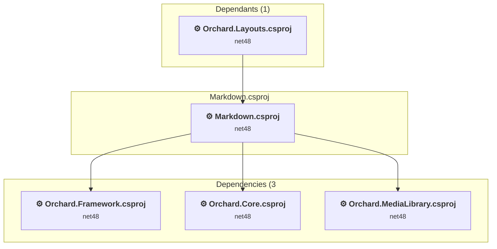

### API Compatibility

| Category | Count | Impact |
| :--- | :---: | :--- |
| 🔴 Binary Incompatible | 0 | High - Require code changes |
| 🟡 Source Incompatible | 0 | Medium - Needs re-compilation and potential conflicting API error fixing |
| 🔵 Behavioral change | 0 | Low - Behavioral changes that may require testing at runtime |
| ✅ Compatible | 70 |  |
| ***Total APIs Analyzed*** | ***70*** |  |

<a id="orchardwebmodulesorchardaliasorchardaliascsproj"></a>
### Orchard.Web\Modules\Orchard.Alias\Orchard.Alias.csproj

#### Project Info

- **Current Target Framework:** net48
- **Proposed Target Framework:** net10.0
- **SDK-style**: False
- **Project Kind:** Wap
- **Dependencies**: 2
- **Dependants**: 5
- **Number of Files**: 32
- **Number of Files with Incidents**: 10
- **Lines of Code**: 2214
- **Estimated LOC to modify**: 133+ (at least 6.0% of the project)

#### Dependency Graph

Legend:
📦 SDK-style project
⚙️ Classic project

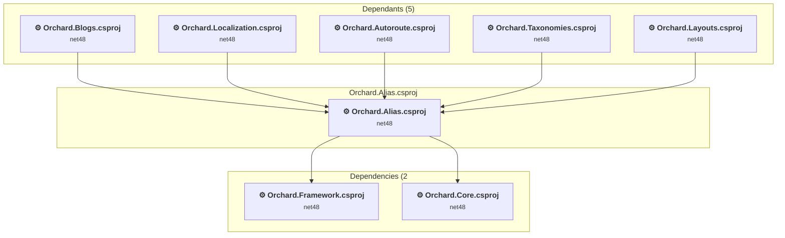

### API Compatibility

| Category | Count | Impact |
| :--- | :---: | :--- |
| 🔴 Binary Incompatible | 106 | High - Require code changes |
| 🟡 Source Incompatible | 22 | Medium - Needs re-compilation and potential conflicting API error fixing |
| 🔵 Behavioral change | 5 | Low - Behavioral changes that may require testing at runtime |
| ✅ Compatible | 1498 |  |
| ***Total APIs Analyzed*** | ***1631*** |  |

#### Project Technologies and Features

| Technology | Issues | Percentage | Migration Path |
| :--- | :---: | :---: | :--- |
| ASP.NET Framework (System.Web) | 128 | 96.2% | Legacy ASP.NET Framework APIs for web applications (System.Web.*) that don't exist in ASP.NET Core due to architectural differences. ASP.NET Core represents a complete redesign of the web framework. Migrate to ASP.NET Core equivalents or consider System.Web.Adapters package for compatibility. |

<a id="orchardwebmodulesorchardantispamorchardantispamcsproj"></a>
### Orchard.Web\Modules\Orchard.AntiSpam\Orchard.AntiSpam.csproj

#### Project Info

- **Current Target Framework:** net48
- **Proposed Target Framework:** net10.0
- **SDK-style**: False
- **Project Kind:** Wap
- **Dependencies**: 3
- **Dependants**: 1
- **Number of Files**: 60
- **Number of Files with Incidents**: 8
- **Lines of Code**: 2148
- **Estimated LOC to modify**: 58+ (at least 2.7% of the project)

#### Dependency Graph

Legend:
📦 SDK-style project
⚙️ Classic project

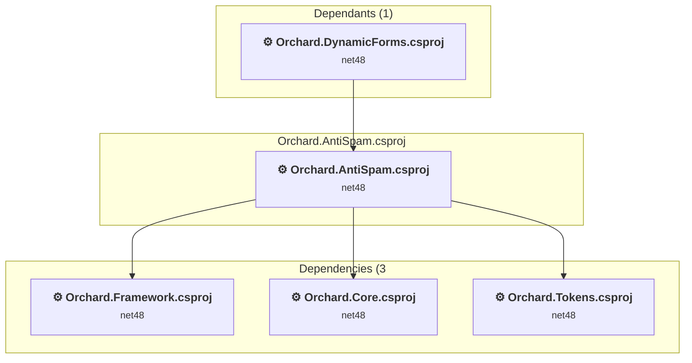

### API Compatibility

| Category | Count | Impact |
| :--- | :---: | :--- |
| 🔴 Binary Incompatible | 17 | High - Require code changes |
| 🟡 Source Incompatible | 40 | Medium - Needs re-compilation and potential conflicting API error fixing |
| 🔵 Behavioral change | 1 | Low - Behavioral changes that may require testing at runtime |
| ✅ Compatible | 874 |  |
| ***Total APIs Analyzed*** | ***932*** |  |

#### Project Technologies and Features

| Technology | Issues | Percentage | Migration Path |
| :--- | :---: | :---: | :--- |
| ASP.NET Framework (System.Web) | 55 | 94.8% | Legacy ASP.NET Framework APIs for web applications (System.Web.*) that don't exist in ASP.NET Core due to architectural differences. ASP.NET Core represents a complete redesign of the web framework. Migrate to ASP.NET Core equivalents or consider System.Web.Adapters package for compatibility. |

<a id="orchardwebmodulesorchardarchivelaterorchardarchivelatercsproj"></a>
### Orchard.Web\Modules\Orchard.ArchiveLater\Orchard.ArchiveLater.csproj

#### Project Info

- **Current Target Framework:** net48
- **Proposed Target Framework:** net10.0
- **SDK-style**: False
- **Project Kind:** Wap
- **Dependencies**: 2
- **Dependants**: 0
- **Number of Files**: 16
- **Number of Files with Incidents**: 1
- **Lines of Code**: 401
- **Estimated LOC to modify**: 0+ (at least 0.0% of the project)

#### Dependency Graph

Legend:
📦 SDK-style project
⚙️ Classic project

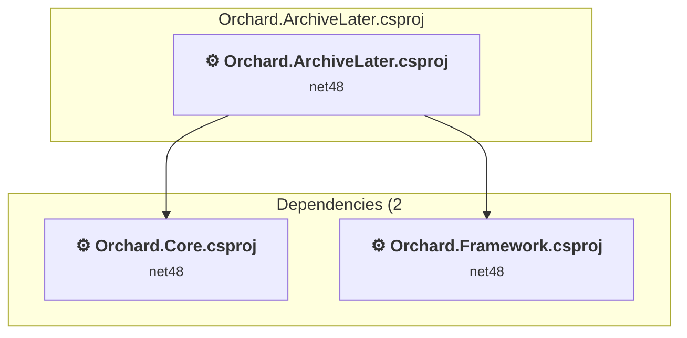

### API Compatibility

| Category | Count | Impact |
| :--- | :---: | :--- |
| 🔴 Binary Incompatible | 0 | High - Require code changes |
| 🟡 Source Incompatible | 0 | Medium - Needs re-compilation and potential conflicting API error fixing |
| 🔵 Behavioral change | 0 | Low - Behavioral changes that may require testing at runtime |
| ✅ Compatible | 159 |  |
| ***Total APIs Analyzed*** | ***159*** |  |

<a id="orchardwebmodulesorchardaudittrailorchardaudittrailcsproj"></a>
### Orchard.Web\Modules\Orchard.AuditTrail\Orchard.AuditTrail.csproj

#### Project Info

- **Current Target Framework:** net48
- **Proposed Target Framework:** net10.0
- **SDK-style**: False
- **Project Kind:** Wap
- **Dependencies**: 6
- **Dependants**: 0
- **Number of Files**: 185
- **Number of Files with Incidents**: 3
- **Lines of Code**: 5873
- **Estimated LOC to modify**: 8+ (at least 0.1% of the project)

#### Dependency Graph

Legend:
📦 SDK-style project
⚙️ Classic project

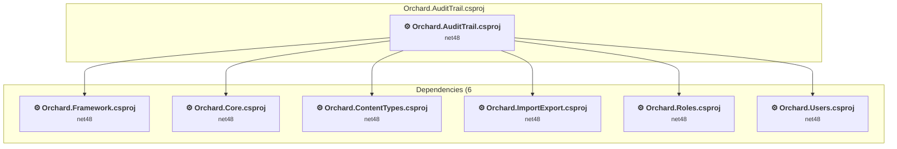

### API Compatibility

| Category | Count | Impact |
| :--- | :---: | :--- |
| 🔴 Binary Incompatible | 0 | High - Require code changes |
| 🟡 Source Incompatible | 6 | Medium - Needs re-compilation and potential conflicting API error fixing |
| 🔵 Behavioral change | 2 | Low - Behavioral changes that may require testing at runtime |
| ✅ Compatible | 2790 |  |
| ***Total APIs Analyzed*** | ***2798*** |  |

#### Project Technologies and Features

| Technology | Issues | Percentage | Migration Path |
| :--- | :---: | :---: | :--- |
| ASP.NET Framework (System.Web) | 3 | 37.5% | Legacy ASP.NET Framework APIs for web applications (System.Web.*) that don't exist in ASP.NET Core due to architectural differences. ASP.NET Core represents a complete redesign of the web framework. Migrate to ASP.NET Core equivalents or consider System.Web.Adapters package for compatibility. |

<a id="orchardwebmodulesorchardautorouteorchardautoroutecsproj"></a>
### Orchard.Web\Modules\Orchard.Autoroute\Orchard.Autoroute.csproj

#### Project Info

- **Current Target Framework:** net48
- **Proposed Target Framework:** net10.0
- **SDK-style**: False
- **Project Kind:** Wap
- **Dependencies**: 5
- **Dependants**: 8
- **Number of Files**: 39
- **Number of Files with Incidents**: 7
- **Lines of Code**: 2227
- **Estimated LOC to modify**: 40+ (at least 1.8% of the project)

#### Dependency Graph

Legend:
📦 SDK-style project
⚙️ Classic project

```mermaid
flowchart TB
    subgraph upstream["Dependants (8)"]
        P6["<b>⚙️&nbsp;Orchard.Tests.Modules.csproj</b><br/><small>net48</small>"]
        P20["<b>⚙️&nbsp;Orchard.Blogs.csproj</b><br/><small>net48</small>"]
        P21["<b>⚙️&nbsp;Orchard.Tags.csproj</b><br/><small>net48</small>"]
        P37["<b>⚙️&nbsp;Orchard.Pages.csproj</b><br/><small>net48</small>"]
        P38["<b>⚙️&nbsp;Orchard.Localization.csproj</b><br/><small>net48</small>"]
        P65["<b>⚙️&nbsp;Orchard.Taxonomies.csproj</b><br/><small>net48</small>"]
        P69["<b>⚙️&nbsp;Upgrade.csproj</b><br/><small>net48</small>"]
        P78["<b>⚙️&nbsp;Orchard.Layouts.csproj</b><br/><small>net48</small>"]
        click P6 "#orchardtestsmodulesorchardtestsmodulescsproj"
        click P20 "#orchardwebmodulesorchardblogsorchardblogscsproj"
        click P21 "#orchardwebmodulesorchardtagsorchardtagscsproj"
        click P37 "#orchardwebmodulesorchardpagesorchardpagescsproj"
        click P38 "#orchardwebmodulesorchardlocalizationorchardlocalizationcsproj"
        click P65 "#orchardwebmodulesorchardtaxonomiesorchardtaxonomiescsproj"
        click P69 "#orchardwebmodulesupgradeupgradecsproj"
        click P78 "#orchardwebmodulesorchardlayoutsorchardlayoutscsproj"
    end
    subgraph current["Orchard.Autoroute.csproj"]
        MAIN["<b>⚙️&nbsp;Orchard.Autoroute.csproj</b><br/><small>net48</small>"]
        click MAIN "#orchardwebmodulesorchardautorouteorchardautoroutecsproj"
    end
    subgraph downstream["Dependencies (5"]
        P2["<b>⚙️&nbsp;Orchard.Framework.csproj</b><br/><small>net48</small>"]
        P8["<b>⚙️&nbsp;Orchard.Core.csproj</b><br/><small>net48</small>"]
        P55["<b>⚙️&nbsp;Orchard.Alias.csproj</b><br/><small>net48</small>"]
        P19["<b>⚙️&nbsp;Orchard.ContentTypes.csproj</b><br/><small>net48</small>"]
        P47["<b>⚙️&nbsp;Orchard.Tokens.csproj</b><br/><small>net48</small>"]
        click P2 "#orchardorchardframeworkcsproj"
        click P8 "#orchardwebcoreorchardcorecsproj"
        click P55 "#orchardwebmodulesorchardaliasorchardaliascsproj"
        click P19 "#orchardwebmodulesorchardcontenttypesorchardcontenttypescsproj"
        click P47 "#orchardwebmodulesorchardtokensorchardtokenscsproj"
    end
    P6 --> MAIN
    P20 --> MAIN
    P21 --> MAIN
    P37 --> MAIN
    P38 --> MAIN
    P65 --> MAIN
    P69 --> MAIN
    P78 --> MAIN
    MAIN --> P2
    MAIN --> P8
    MAIN --> P55
    MAIN --> P19
    MAIN --> P47

```

### API Compatibility

| Category | Count | Impact |
| :--- | :---: | :--- |
| 🔴 Binary Incompatible | 29 | High - Require code changes |
| 🟡 Source Incompatible | 11 | Medium - Needs re-compilation and potential conflicting API error fixing |
| 🔵 Behavioral change | 0 | Low - Behavioral changes that may require testing at runtime |
| ✅ Compatible | 1686 |  |
| ***Total APIs Analyzed*** | ***1726*** |  |

#### Project Technologies and Features

| Technology | Issues | Percentage | Migration Path |
| :--- | :---: | :---: | :--- |
| ASP.NET Framework (System.Web) | 40 | 100.0% | Legacy ASP.NET Framework APIs for web applications (System.Web.*) that don't exist in ASP.NET Core due to architectural differences. ASP.NET Core represents a complete redesign of the web framework. Migrate to ASP.NET Core equivalents or consider System.Web.Adapters package for compatibility. |

<a id="orchardwebmodulesorchardazureorchardazurecsproj"></a>
### Orchard.Web\Modules\Orchard.Azure\Orchard.Azure.csproj

#### Project Info

- **Current Target Framework:** net48
- **Proposed Target Framework:** net10.0
- **SDK-style**: False
- **Project Kind:** Wap
- **Dependencies**: 1
- **Dependants**: 1
- **Number of Files**: 10
- **Number of Files with Incidents**: 4
- **Lines of Code**: 935
- **Estimated LOC to modify**: 20+ (at least 2.1% of the project)

#### Dependency Graph

Legend:
📦 SDK-style project
⚙️ Classic project

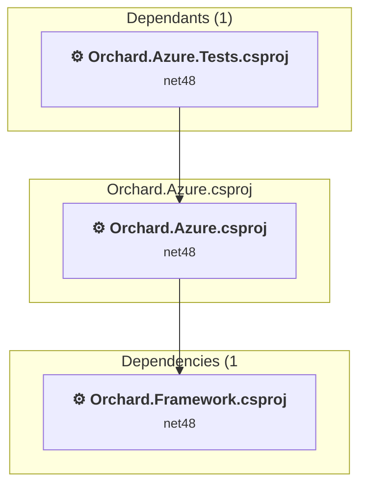

### API Compatibility

| Category | Count | Impact |
| :--- | :---: | :--- |
| 🔴 Binary Incompatible | 0 | High - Require code changes |
| 🟡 Source Incompatible | 11 | Medium - Needs re-compilation and potential conflicting API error fixing |
| 🔵 Behavioral change | 9 | Low - Behavioral changes that may require testing at runtime |
| ✅ Compatible | 642 |  |
| ***Total APIs Analyzed*** | ***662*** |  |

#### Project Technologies and Features

| Technology | Issues | Percentage | Migration Path |
| :--- | :---: | :---: | :--- |
| Legacy Configuration System | 11 | 55.0% | Legacy XML-based configuration system (app.config/web.config) that has been replaced by a more flexible configuration model in .NET Core. The old system was rigid and XML-based. Migrate to Microsoft.Extensions.Configuration with JSON/environment variables; use System.Configuration.ConfigurationManager NuGet package as interim bridge if needed. |

<a id="orchardwebmodulesorchardblogsorchardblogscsproj"></a>
### Orchard.Web\Modules\Orchard.Blogs\Orchard.Blogs.csproj

#### Project Info

- **Current Target Framework:** net48
- **Proposed Target Framework:** net10.0
- **SDK-style**: False
- **Project Kind:** Wap
- **Dependencies**: 7
- **Dependants**: 1
- **Number of Files**: 99
- **Number of Files with Incidents**: 14
- **Lines of Code**: 4738
- **Estimated LOC to modify**: 276+ (at least 5.8% of the project)

#### Dependency Graph

Legend:
📦 SDK-style project
⚙️ Classic project

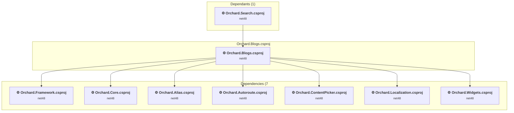

### API Compatibility

| Category | Count | Impact |
| :--- | :---: | :--- |
| 🔴 Binary Incompatible | 265 | High - Require code changes |
| 🟡 Source Incompatible | 11 | Medium - Needs re-compilation and potential conflicting API error fixing |
| 🔵 Behavioral change | 0 | Low - Behavioral changes that may require testing at runtime |
| ✅ Compatible | 2483 |  |
| ***Total APIs Analyzed*** | ***2759*** |  |

#### Project Technologies and Features

| Technology | Issues | Percentage | Migration Path |
| :--- | :---: | :---: | :--- |
| ASP.NET Framework (System.Web) | 276 | 100.0% | Legacy ASP.NET Framework APIs for web applications (System.Web.*) that don't exist in ASP.NET Core due to architectural differences. ASP.NET Core represents a complete redesign of the web framework. Migrate to ASP.NET Core equivalents or consider System.Web.Adapters package for compatibility. |

<a id="orchardwebmodulesorchardcachingorchardcachingcsproj"></a>
### Orchard.Web\Modules\Orchard.Caching\Orchard.Caching.csproj

#### Project Info

- **Current Target Framework:** net48
- **Proposed Target Framework:** net10.0
- **SDK-style**: False
- **Project Kind:** Wap
- **Dependencies**: 1
- **Dependants**: 2
- **Number of Files**: 8
- **Number of Files with Incidents**: 2
- **Lines of Code**: 262
- **Estimated LOC to modify**: 21+ (at least 8.0% of the project)

#### Dependency Graph

Legend:
📦 SDK-style project
⚙️ Classic project

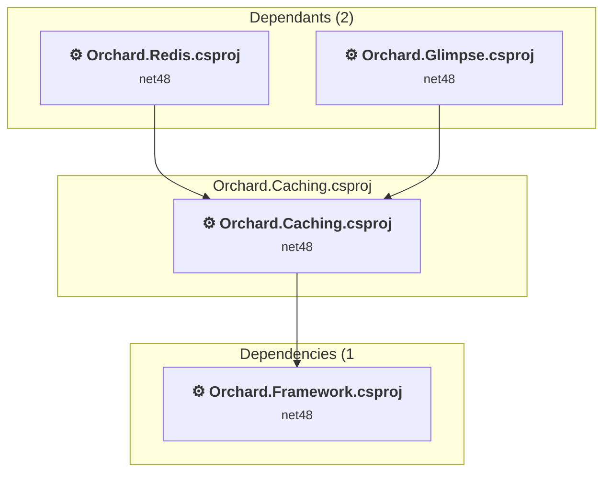

### API Compatibility

| Category | Count | Impact |
| :--- | :---: | :--- |
| 🔴 Binary Incompatible | 0 | High - Require code changes |
| 🟡 Source Incompatible | 21 | Medium - Needs re-compilation and potential conflicting API error fixing |
| 🔵 Behavioral change | 0 | Low - Behavioral changes that may require testing at runtime |
| ✅ Compatible | 124 |  |
| ***Total APIs Analyzed*** | ***145*** |  |

<a id="orchardwebmodulesorchardcodegenerationorchardcodegenerationcsproj"></a>
### Orchard.Web\Modules\Orchard.CodeGeneration\Orchard.CodeGeneration.csproj

#### Project Info

- **Current Target Framework:** net48
- **Proposed Target Framework:** net10.0
- **SDK-style**: False
- **Project Kind:** Wap
- **Dependencies**: 2
- **Dependants**: 1
- **Number of Files**: 22
- **Number of Files with Incidents**: 2
- **Lines of Code**: 783
- **Estimated LOC to modify**: 25+ (at least 3.2% of the project)

#### Dependency Graph

Legend:
📦 SDK-style project
⚙️ Classic project

```mermaid
flowchart TB
    subgraph upstream["Dependants (1)"]
        P6["<b>⚙️&nbsp;Orchard.Tests.Modules.csproj</b><br/><small>net48</small>"]
        click P6 "#orchardtestsmodulesorchardtestsmodulescsproj"
    end
    subgraph current["Orchard.CodeGeneration.csproj"]
        MAIN["<b>⚙️&nbsp;Orchard.CodeGeneration.csproj</b><br/><small>net48</small>"]
        click MAIN "#orchardwebmodulesorchardcodegenerationorchardcodegenerationcsproj"
    end
    subgraph downstream["Dependencies (2"]
        P2["<b>⚙️&nbsp;Orchard.Framework.csproj</b><br/><small>net48</small>"]
        P8["<b>⚙️&nbsp;Orchard.Core.csproj</b><br/><small>net48</small>"]
        click P2 "#orchardorchardframeworkcsproj"
        click P8 "#orchardwebcoreorchardcorecsproj"
    end
    P6 --> MAIN
    MAIN --> P2
    MAIN --> P8

```

### API Compatibility

| Category | Count | Impact |
| :--- | :---: | :--- |
| 🔴 Binary Incompatible | 14 | High - Require code changes |
| 🟡 Source Incompatible | 11 | Medium - Needs re-compilation and potential conflicting API error fixing |
| 🔵 Behavioral change | 0 | Low - Behavioral changes that may require testing at runtime |
| ✅ Compatible | 1037 |  |
| ***Total APIs Analyzed*** | ***1062*** |  |

#### Project Technologies and Features

| Technology | Issues | Percentage | Migration Path |
| :--- | :---: | :---: | :--- |
| ASP.NET Framework (System.Web) | 22 | 88.0% | Legacy ASP.NET Framework APIs for web applications (System.Web.*) that don't exist in ASP.NET Core due to architectural differences. ASP.NET Core represents a complete redesign of the web framework. Migrate to ASP.NET Core equivalents or consider System.Web.Adapters package for compatibility. |

<a id="orchardwebmodulesorchardcommentsorchardcommentscsproj"></a>
### Orchard.Web\Modules\Orchard.Comments\Orchard.Comments.csproj

#### Project Info

- **Current Target Framework:** net48
- **Proposed Target Framework:** net10.0
- **SDK-style**: False
- **Project Kind:** Wap
- **Dependencies**: 4
- **Dependants**: 1
- **Number of Files**: 73
- **Number of Files with Incidents**: 4
- **Lines of Code**: 3386
- **Estimated LOC to modify**: 18+ (at least 0.5% of the project)

#### Dependency Graph

Legend:
📦 SDK-style project
⚙️ Classic project

```mermaid
flowchart TB
    subgraph upstream["Dependants (1)"]
        P6["<b>⚙️&nbsp;Orchard.Tests.Modules.csproj</b><br/><small>net48</small>"]
        click P6 "#orchardtestsmodulesorchardtestsmodulescsproj"
    end
    subgraph current["Orchard.Comments.csproj"]
        MAIN["<b>⚙️&nbsp;Orchard.Comments.csproj</b><br/><small>net48</small>"]
        click MAIN "#orchardwebmodulesorchardcommentsorchardcommentscsproj"
    end
    subgraph downstream["Dependencies (4"]
        P2["<b>⚙️&nbsp;Orchard.Framework.csproj</b><br/><small>net48</small>"]
        P8["<b>⚙️&nbsp;Orchard.Core.csproj</b><br/><small>net48</small>"]
        P47["<b>⚙️&nbsp;Orchard.Tokens.csproj</b><br/><small>net48</small>"]
        P62["<b>⚙️&nbsp;Orchard.Workflows.csproj</b><br/><small>net48</small>"]
        click P2 "#orchardorchardframeworkcsproj"
        click P8 "#orchardwebcoreorchardcorecsproj"
        click P47 "#orchardwebmodulesorchardtokensorchardtokenscsproj"
        click P62 "#orchardwebmodulesorchardworkflowsorchardworkflowscsproj"
    end
    P6 --> MAIN
    MAIN --> P2
    MAIN --> P8
    MAIN --> P47
    MAIN --> P62

```

### API Compatibility

| Category | Count | Impact |
| :--- | :---: | :--- |
| 🔴 Binary Incompatible | 6 | High - Require code changes |
| 🟡 Source Incompatible | 12 | Medium - Needs re-compilation and potential conflicting API error fixing |
| 🔵 Behavioral change | 0 | Low - Behavioral changes that may require testing at runtime |
| ✅ Compatible | 1480 |  |
| ***Total APIs Analyzed*** | ***1498*** |  |

#### Project Technologies and Features

| Technology | Issues | Percentage | Migration Path |
| :--- | :---: | :---: | :--- |
| ASP.NET Framework (System.Web) | 17 | 94.4% | Legacy ASP.NET Framework APIs for web applications (System.Web.*) that don't exist in ASP.NET Core due to architectural differences. ASP.NET Core represents a complete redesign of the web framework. Migrate to ASP.NET Core equivalents or consider System.Web.Adapters package for compatibility. |

<a id="orchardwebmodulesorchardconditionsorchardconditionscsproj"></a>
### Orchard.Web\Modules\Orchard.Conditions\Orchard.Conditions.csproj

#### Project Info

- **Current Target Framework:** net48
- **Proposed Target Framework:** net10.0
- **SDK-style**: False
- **Project Kind:** Wap
- **Dependencies**: 3
- **Dependants**: 5
- **Number of Files**: 10
- **Number of Files with Incidents**: 2
- **Lines of Code**: 236
- **Estimated LOC to modify**: 7+ (at least 3.0% of the project)

#### Dependency Graph

Legend:
📦 SDK-style project
⚙️ Classic project

```mermaid
flowchart TB
    subgraph upstream["Dependants (5)"]
        P6["<b>⚙️&nbsp;Orchard.Tests.Modules.csproj</b><br/><small>net48</small>"]
        P31["<b>⚙️&nbsp;Orchard.Widgets.csproj</b><br/><small>net48</small>"]
        P52["<b>⚙️&nbsp;Orchard.Projections.csproj</b><br/><small>net48</small>"]
        P78["<b>⚙️&nbsp;Orchard.Layouts.csproj</b><br/><small>net48</small>"]
        P84["<b>⚙️&nbsp;Orchard.Glimpse.csproj</b><br/><small>net48</small>"]
        click P6 "#orchardtestsmodulesorchardtestsmodulescsproj"
        click P31 "#orchardwebmodulesorchardwidgetsorchardwidgetscsproj"
        click P52 "#orchardwebmodulesorchardprojectionsorchardprojectionscsproj"
        click P78 "#orchardwebmodulesorchardlayoutsorchardlayoutscsproj"
        click P84 "#orchardwebmodulesorchardglimpseorchardglimpsecsproj"
    end
    subgraph current["Orchard.Conditions.csproj"]
        MAIN["<b>⚙️&nbsp;Orchard.Conditions.csproj</b><br/><small>net48</small>"]
        click MAIN "#orchardwebmodulesorchardconditionsorchardconditionscsproj"
    end
    subgraph downstream["Dependencies (3"]
        P2["<b>⚙️&nbsp;Orchard.Framework.csproj</b><br/><small>net48</small>"]
        P8["<b>⚙️&nbsp;Orchard.Core.csproj</b><br/><small>net48</small>"]
        P40["<b>⚙️&nbsp;Orchard.Scripting.csproj</b><br/><small>net48</small>"]
        click P2 "#orchardorchardframeworkcsproj"
        click P8 "#orchardwebcoreorchardcorecsproj"
        click P40 "#orchardwebmodulesorchardscriptingorchardscriptingcsproj"
    end
    P6 --> MAIN
    P31 --> MAIN
    P52 --> MAIN
    P78 --> MAIN
    P84 --> MAIN
    MAIN --> P2
    MAIN --> P8
    MAIN --> P40

```

### API Compatibility

| Category | Count | Impact |
| :--- | :---: | :--- |
| 🔴 Binary Incompatible | 0 | High - Require code changes |
| 🟡 Source Incompatible | 7 | Medium - Needs re-compilation and potential conflicting API error fixing |
| 🔵 Behavioral change | 0 | Low - Behavioral changes that may require testing at runtime |
| ✅ Compatible | 124 |  |
| ***Total APIs Analyzed*** | ***131*** |  |

#### Project Technologies and Features

| Technology | Issues | Percentage | Migration Path |
| :--- | :---: | :---: | :--- |
| ASP.NET Framework (System.Web) | 7 | 100.0% | Legacy ASP.NET Framework APIs for web applications (System.Web.*) that don't exist in ASP.NET Core due to architectural differences. ASP.NET Core represents a complete redesign of the web framework. Migrate to ASP.NET Core equivalents or consider System.Web.Adapters package for compatibility. |

<a id="orchardwebmodulesorchardcontentpermissionsorchardcontentpermissionscsproj"></a>
### Orchard.Web\Modules\Orchard.ContentPermissions\Orchard.ContentPermissions.csproj

#### Project Info

- **Current Target Framework:** net48
- **Proposed Target Framework:** net10.0
- **SDK-style**: False
- **Project Kind:** Wap
- **Dependencies**: 3
- **Dependants**: 0
- **Number of Files**: 23
- **Number of Files with Incidents**: 1
- **Lines of Code**: 1434
- **Estimated LOC to modify**: 0+ (at least 0.0% of the project)

#### Dependency Graph

Legend:
📦 SDK-style project
⚙️ Classic project

```mermaid
flowchart TB
    subgraph current["Orchard.ContentPermissions.csproj"]
        MAIN["<b>⚙️&nbsp;Orchard.ContentPermissions.csproj</b><br/><small>net48</small>"]
        click MAIN "#orchardwebmodulesorchardcontentpermissionsorchardcontentpermissionscsproj"
    end
    subgraph downstream["Dependencies (3"]
        P2["<b>⚙️&nbsp;Orchard.Framework.csproj</b><br/><small>net48</small>"]
        P8["<b>⚙️&nbsp;Orchard.Core.csproj</b><br/><small>net48</small>"]
        P7["<b>⚙️&nbsp;Orchard.Roles.csproj</b><br/><small>net48</small>"]
        click P2 "#orchardorchardframeworkcsproj"
        click P8 "#orchardwebcoreorchardcorecsproj"
        click P7 "#orchardwebmodulesorchardrolesorchardrolescsproj"
    end
    MAIN --> P2
    MAIN --> P8
    MAIN --> P7

```

### API Compatibility

| Category | Count | Impact |
| :--- | :---: | :--- |
| 🔴 Binary Incompatible | 0 | High - Require code changes |
| 🟡 Source Incompatible | 0 | Medium - Needs re-compilation and potential conflicting API error fixing |
| 🔵 Behavioral change | 0 | Low - Behavioral changes that may require testing at runtime |
| ✅ Compatible | 1977 |  |
| ***Total APIs Analyzed*** | ***1977*** |  |

<a id="orchardwebmodulesorchardcontentpickerorchardcontentpickercsproj"></a>
### Orchard.Web\Modules\Orchard.ContentPicker\Orchard.ContentPicker.csproj

#### Project Info

- **Current Target Framework:** net48
- **Proposed Target Framework:** net10.0
- **SDK-style**: False
- **Project Kind:** Wap
- **Dependencies**: 4
- **Dependants**: 2
- **Number of Files**: 50
- **Number of Files with Incidents**: 5
- **Lines of Code**: 2038
- **Estimated LOC to modify**: 29+ (at least 1.4% of the project)

#### Dependency Graph

Legend:
📦 SDK-style project
⚙️ Classic project

```mermaid
flowchart TB
    subgraph upstream["Dependants (2)"]
        P20["<b>⚙️&nbsp;Orchard.Blogs.csproj</b><br/><small>net48</small>"]
        P37["<b>⚙️&nbsp;Orchard.Pages.csproj</b><br/><small>net48</small>"]
        click P20 "#orchardwebmodulesorchardblogsorchardblogscsproj"
        click P37 "#orchardwebmodulesorchardpagesorchardpagescsproj"
    end
    subgraph current["Orchard.ContentPicker.csproj"]
        MAIN["<b>⚙️&nbsp;Orchard.ContentPicker.csproj</b><br/><small>net48</small>"]
        click MAIN "#orchardwebmodulesorchardcontentpickerorchardcontentpickercsproj"
    end
    subgraph downstream["Dependencies (4"]
        P2["<b>⚙️&nbsp;Orchard.Framework.csproj</b><br/><small>net48</small>"]
        P8["<b>⚙️&nbsp;Orchard.Core.csproj</b><br/><small>net48</small>"]
        P38["<b>⚙️&nbsp;Orchard.Localization.csproj</b><br/><small>net48</small>"]
        P47["<b>⚙️&nbsp;Orchard.Tokens.csproj</b><br/><small>net48</small>"]
        click P2 "#orchardorchardframeworkcsproj"
        click P8 "#orchardwebcoreorchardcorecsproj"
        click P38 "#orchardwebmodulesorchardlocalizationorchardlocalizationcsproj"
        click P47 "#orchardwebmodulesorchardtokensorchardtokenscsproj"
    end
    P20 --> MAIN
    P37 --> MAIN
    MAIN --> P2
    MAIN --> P8
    MAIN --> P38
    MAIN --> P47

```

### API Compatibility

| Category | Count | Impact |
| :--- | :---: | :--- |
| 🔴 Binary Incompatible | 21 | High - Require code changes |
| 🟡 Source Incompatible | 8 | Medium - Needs re-compilation and potential conflicting API error fixing |
| 🔵 Behavioral change | 0 | Low - Behavioral changes that may require testing at runtime |
| ✅ Compatible | 952 |  |
| ***Total APIs Analyzed*** | ***981*** |  |

#### Project Technologies and Features

| Technology | Issues | Percentage | Migration Path |
| :--- | :---: | :---: | :--- |
| ASP.NET Framework (System.Web) | 29 | 100.0% | Legacy ASP.NET Framework APIs for web applications (System.Web.*) that don't exist in ASP.NET Core due to architectural differences. ASP.NET Core represents a complete redesign of the web framework. Migrate to ASP.NET Core equivalents or consider System.Web.Adapters package for compatibility. |

<a id="orchardwebmodulesorchardcontentprevieworchardcontentpreviewcsproj"></a>
### Orchard.Web\Modules\Orchard.ContentPreview\Orchard.ContentPreview.csproj

#### Project Info

- **Current Target Framework:** net48
- **Proposed Target Framework:** net10.0
- **SDK-style**: False
- **Project Kind:** Wap
- **Dependencies**: 2
- **Dependants**: 0
- **Number of Files**: 15
- **Number of Files with Incidents**: 2
- **Lines of Code**: 308
- **Estimated LOC to modify**: 4+ (at least 1.3% of the project)

#### Dependency Graph

Legend:
📦 SDK-style project
⚙️ Classic project

```mermaid
flowchart TB
    subgraph current["Orchard.ContentPreview.csproj"]
        MAIN["<b>⚙️&nbsp;Orchard.ContentPreview.csproj</b><br/><small>net48</small>"]
        click MAIN "#orchardwebmodulesorchardcontentprevieworchardcontentpreviewcsproj"
    end
    subgraph downstream["Dependencies (2"]
        P2["<b>⚙️&nbsp;Orchard.Framework.csproj</b><br/><small>net48</small>"]
        P8["<b>⚙️&nbsp;Orchard.Core.csproj</b><br/><small>net48</small>"]
        click P2 "#orchardorchardframeworkcsproj"
        click P8 "#orchardwebcoreorchardcorecsproj"
    end
    MAIN --> P2
    MAIN --> P8

```

### API Compatibility

| Category | Count | Impact |
| :--- | :---: | :--- |
| 🔴 Binary Incompatible | 0 | High - Require code changes |
| 🟡 Source Incompatible | 4 | Medium - Needs re-compilation and potential conflicting API error fixing |
| 🔵 Behavioral change | 0 | Low - Behavioral changes that may require testing at runtime |
| ✅ Compatible | 22 |  |
| ***Total APIs Analyzed*** | ***26*** |  |

#### Project Technologies and Features

| Technology | Issues | Percentage | Migration Path |
| :--- | :---: | :---: | :--- |
| ASP.NET Framework (System.Web) | 4 | 100.0% | Legacy ASP.NET Framework APIs for web applications (System.Web.*) that don't exist in ASP.NET Core due to architectural differences. ASP.NET Core represents a complete redesign of the web framework. Migrate to ASP.NET Core equivalents or consider System.Web.Adapters package for compatibility. |

<a id="orchardwebmodulesorchardcontenttypesorchardcontenttypescsproj"></a>
### Orchard.Web\Modules\Orchard.ContentTypes\Orchard.ContentTypes.csproj

#### Project Info

- **Current Target Framework:** net48
- **Proposed Target Framework:** net10.0
- **SDK-style**: False
- **Project Kind:** Wap
- **Dependencies**: 3
- **Dependants**: 5
- **Number of Files**: 86
- **Number of Files with Incidents**: 4
- **Lines of Code**: 3292
- **Estimated LOC to modify**: 30+ (at least 0.9% of the project)

#### Dependency Graph

Legend:
📦 SDK-style project
⚙️ Classic project

```mermaid
flowchart TB
    subgraph upstream["Dependants (5)"]
        P43["<b>⚙️&nbsp;Orchard.Recipes.csproj</b><br/><small>net48</small>"]
        P52["<b>⚙️&nbsp;Orchard.Projections.csproj</b><br/><small>net48</small>"]
        P56["<b>⚙️&nbsp;Orchard.Autoroute.csproj</b><br/><small>net48</small>"]
        P67["<b>⚙️&nbsp;Orchard.MediaLibrary.csproj</b><br/><small>net48</small>"]
        P75["<b>⚙️&nbsp;Orchard.AuditTrail.csproj</b><br/><small>net48</small>"]
        click P43 "#orchardwebmodulesorchardrecipesorchardrecipescsproj"
        click P52 "#orchardwebmodulesorchardprojectionsorchardprojectionscsproj"
        click P56 "#orchardwebmodulesorchardautorouteorchardautoroutecsproj"
        click P67 "#orchardwebmodulesorchardmedialibraryorchardmedialibrarycsproj"
        click P75 "#orchardwebmodulesorchardaudittrailorchardaudittrailcsproj"
    end
    subgraph current["Orchard.ContentTypes.csproj"]
        MAIN["<b>⚙️&nbsp;Orchard.ContentTypes.csproj</b><br/><small>net48</small>"]
        click MAIN "#orchardwebmodulesorchardcontenttypesorchardcontenttypescsproj"
    end
    subgraph downstream["Dependencies (3"]
        P2["<b>⚙️&nbsp;Orchard.Framework.csproj</b><br/><small>net48</small>"]
        P8["<b>⚙️&nbsp;Orchard.Core.csproj</b><br/><small>net48</small>"]
        P14["<b>⚙️&nbsp;Orchard.Themes.csproj</b><br/><small>net48</small>"]
        click P2 "#orchardorchardframeworkcsproj"
        click P8 "#orchardwebcoreorchardcorecsproj"
        click P14 "#orchardwebmodulesorchardthemesorchardthemescsproj"
    end
    P43 --> MAIN
    P52 --> MAIN
    P56 --> MAIN
    P67 --> MAIN
    P75 --> MAIN
    MAIN --> P2
    MAIN --> P8
    MAIN --> P14

```

### API Compatibility

| Category | Count | Impact |
| :--- | :---: | :--- |
| 🔴 Binary Incompatible | 20 | High - Require code changes |
| 🟡 Source Incompatible | 10 | Medium - Needs re-compilation and potential conflicting API error fixing |
| 🔵 Behavioral change | 0 | Low - Behavioral changes that may require testing at runtime |
| ✅ Compatible | 1977 |  |
| ***Total APIs Analyzed*** | ***2007*** |  |

#### Project Technologies and Features

| Technology | Issues | Percentage | Migration Path |
| :--- | :---: | :---: | :--- |
| ASP.NET Framework (System.Web) | 30 | 100.0% | Legacy ASP.NET Framework APIs for web applications (System.Web.*) that don't exist in ASP.NET Core due to architectural differences. ASP.NET Core represents a complete redesign of the web framework. Migrate to ASP.NET Core equivalents or consider System.Web.Adapters package for compatibility. |

<a id="orchardwebmodulesorchardcustomformsorchardcustomformscsproj"></a>
### Orchard.Web\Modules\Orchard.CustomForms\Orchard.CustomForms.csproj

#### Project Info

- **Current Target Framework:** net48
- **Proposed Target Framework:** net10.0
- **SDK-style**: False
- **Project Kind:** Wap
- **Dependencies**: 5
- **Dependants**: 0
- **Number of Files**: 34
- **Number of Files with Incidents**: 5
- **Lines of Code**: 1605
- **Estimated LOC to modify**: 30+ (at least 1.9% of the project)

#### Dependency Graph

Legend:
📦 SDK-style project
⚙️ Classic project

```mermaid
flowchart TB
    subgraph current["Orchard.CustomForms.csproj"]
        MAIN["<b>⚙️&nbsp;Orchard.CustomForms.csproj</b><br/><small>net48</small>"]
        click MAIN "#orchardwebmodulesorchardcustomformsorchardcustomformscsproj"
    end
    subgraph downstream["Dependencies (5"]
        P2["<b>⚙️&nbsp;Orchard.Framework.csproj</b><br/><small>net48</small>"]
        P8["<b>⚙️&nbsp;Orchard.Core.csproj</b><br/><small>net48</small>"]
        P48["<b>⚙️&nbsp;Orchard.Forms.csproj</b><br/><small>net48</small>"]
        P47["<b>⚙️&nbsp;Orchard.Tokens.csproj</b><br/><small>net48</small>"]
        P62["<b>⚙️&nbsp;Orchard.Workflows.csproj</b><br/><small>net48</small>"]
        click P2 "#orchardorchardframeworkcsproj"
        click P8 "#orchardwebcoreorchardcorecsproj"
        click P48 "#orchardwebmodulesorchardformsorchardformscsproj"
        click P47 "#orchardwebmodulesorchardtokensorchardtokenscsproj"
        click P62 "#orchardwebmodulesorchardworkflowsorchardworkflowscsproj"
    end
    MAIN --> P2
    MAIN --> P8
    MAIN --> P48
    MAIN --> P47
    MAIN --> P62

```

### API Compatibility

| Category | Count | Impact |
| :--- | :---: | :--- |
| 🔴 Binary Incompatible | 22 | High - Require code changes |
| 🟡 Source Incompatible | 8 | Medium - Needs re-compilation and potential conflicting API error fixing |
| 🔵 Behavioral change | 0 | Low - Behavioral changes that may require testing at runtime |
| ✅ Compatible | 614 |  |
| ***Total APIs Analyzed*** | ***644*** |  |

#### Project Technologies and Features

| Technology | Issues | Percentage | Migration Path |
| :--- | :---: | :---: | :--- |
| ASP.NET Framework (System.Web) | 30 | 100.0% | Legacy ASP.NET Framework APIs for web applications (System.Web.*) that don't exist in ASP.NET Core due to architectural differences. ASP.NET Core represents a complete redesign of the web framework. Migrate to ASP.NET Core equivalents or consider System.Web.Adapters package for compatibility. |

<a id="orchardwebmodulesorcharddashboardsorcharddashboardscsproj"></a>
### Orchard.Web\Modules\Orchard.Dashboards\Orchard.Dashboards.csproj

#### Project Info

- **Current Target Framework:** net48
- **Proposed Target Framework:** net10.0
- **SDK-style**: False
- **Project Kind:** Wap
- **Dependencies**: 3
- **Dependants**: 0
- **Number of Files**: 27
- **Number of Files with Incidents**: 2
- **Lines of Code**: 614
- **Estimated LOC to modify**: 33+ (at least 5.4% of the project)

#### Dependency Graph

Legend:
📦 SDK-style project
⚙️ Classic project

```mermaid
flowchart TB
    subgraph current["Orchard.Dashboards.csproj"]
        MAIN["<b>⚙️&nbsp;Orchard.Dashboards.csproj</b><br/><small>net48</small>"]
        click MAIN "#orchardwebmodulesorcharddashboardsorcharddashboardscsproj"
    end
    subgraph downstream["Dependencies (3"]
        P2["<b>⚙️&nbsp;Orchard.Framework.csproj</b><br/><small>net48</small>"]
        P8["<b>⚙️&nbsp;Orchard.Core.csproj</b><br/><small>net48</small>"]
        P78["<b>⚙️&nbsp;Orchard.Layouts.csproj</b><br/><small>net48</small>"]
        click P2 "#orchardorchardframeworkcsproj"
        click P8 "#orchardwebcoreorchardcorecsproj"
        click P78 "#orchardwebmodulesorchardlayoutsorchardlayoutscsproj"
    end
    MAIN --> P2
    MAIN --> P8
    MAIN --> P78

```

### API Compatibility

| Category | Count | Impact |
| :--- | :---: | :--- |
| 🔴 Binary Incompatible | 33 | High - Require code changes |
| 🟡 Source Incompatible | 0 | Medium - Needs re-compilation and potential conflicting API error fixing |
| 🔵 Behavioral change | 0 | Low - Behavioral changes that may require testing at runtime |
| ✅ Compatible | 142 |  |
| ***Total APIs Analyzed*** | ***175*** |  |

#### Project Technologies and Features

| Technology | Issues | Percentage | Migration Path |
| :--- | :---: | :---: | :--- |
| ASP.NET Framework (System.Web) | 33 | 100.0% | Legacy ASP.NET Framework APIs for web applications (System.Web.*) that don't exist in ASP.NET Core due to architectural differences. ASP.NET Core represents a complete redesign of the web framework. Migrate to ASP.NET Core equivalents or consider System.Web.Adapters package for compatibility. |

<a id="orchardwebmodulesorcharddesignertoolsorcharddesignertoolscsproj"></a>
### Orchard.Web\Modules\Orchard.DesignerTools\Orchard.DesignerTools.csproj

#### Project Info

- **Current Target Framework:** net48
- **Proposed Target Framework:** net10.0
- **SDK-style**: False
- **Project Kind:** Wap
- **Dependencies**: 2
- **Dependants**: 1
- **Number of Files**: 34
- **Number of Files with Incidents**: 4
- **Lines of Code**: 1322
- **Estimated LOC to modify**: 31+ (at least 2.3% of the project)

#### Dependency Graph

Legend:
📦 SDK-style project
⚙️ Classic project

```mermaid
flowchart TB
    subgraph upstream["Dependants (1)"]
        P6["<b>⚙️&nbsp;Orchard.Tests.Modules.csproj</b><br/><small>net48</small>"]
        click P6 "#orchardtestsmodulesorchardtestsmodulescsproj"
    end
    subgraph current["Orchard.DesignerTools.csproj"]
        MAIN["<b>⚙️&nbsp;Orchard.DesignerTools.csproj</b><br/><small>net48</small>"]
        click MAIN "#orchardwebmodulesorcharddesignertoolsorcharddesignertoolscsproj"
    end
    subgraph downstream["Dependencies (2"]
        P2["<b>⚙️&nbsp;Orchard.Framework.csproj</b><br/><small>net48</small>"]
        P31["<b>⚙️&nbsp;Orchard.Widgets.csproj</b><br/><small>net48</small>"]
        click P2 "#orchardorchardframeworkcsproj"
        click P31 "#orchardwebmodulesorchardwidgetsorchardwidgetscsproj"
    end
    P6 --> MAIN
    MAIN --> P2
    MAIN --> P31

```

### API Compatibility

| Category | Count | Impact |
| :--- | :---: | :--- |
| 🔴 Binary Incompatible | 8 | High - Require code changes |
| 🟡 Source Incompatible | 23 | Medium - Needs re-compilation and potential conflicting API error fixing |
| 🔵 Behavioral change | 0 | Low - Behavioral changes that may require testing at runtime |
| ✅ Compatible | 764 |  |
| ***Total APIs Analyzed*** | ***795*** |  |

#### Project Technologies and Features

| Technology | Issues | Percentage | Migration Path |
| :--- | :---: | :---: | :--- |
| ASP.NET Framework (System.Web) | 31 | 100.0% | Legacy ASP.NET Framework APIs for web applications (System.Web.*) that don't exist in ASP.NET Core due to architectural differences. ASP.NET Core represents a complete redesign of the web framework. Migrate to ASP.NET Core equivalents or consider System.Web.Adapters package for compatibility. |

<a id="orchardwebmodulesorcharddynamicformsorcharddynamicformscsproj"></a>
### Orchard.Web\Modules\Orchard.DynamicForms\Orchard.DynamicForms.csproj

#### Project Info

- **Current Target Framework:** net48
- **Proposed Target Framework:** net10.0
- **SDK-style**: False
- **Project Kind:** Wap
- **Dependencies**: 13
- **Dependants**: 1
- **Number of Files**: 257
- **Number of Files with Incidents**: 3
- **Lines of Code**: 7685
- **Estimated LOC to modify**: 9+ (at least 0.1% of the project)

#### Dependency Graph

Legend:
📦 SDK-style project
⚙️ Classic project

```mermaid
flowchart TB
    subgraph upstream["Dependants (1)"]
        P6["<b>⚙️&nbsp;Orchard.Tests.Modules.csproj</b><br/><small>net48</small>"]
        click P6 "#orchardtestsmodulesorchardtestsmodulescsproj"
    end
    subgraph current["Orchard.DynamicForms.csproj"]
        MAIN["<b>⚙️&nbsp;Orchard.DynamicForms.csproj</b><br/><small>net48</small>"]
        click MAIN "#orchardwebmodulesorcharddynamicformsorcharddynamicformscsproj"
    end
    subgraph downstream["Dependencies (13"]
        P2["<b>⚙️&nbsp;Orchard.Framework.csproj</b><br/><small>net48</small>"]
        P8["<b>⚙️&nbsp;Orchard.Core.csproj</b><br/><small>net48</small>"]
        P57["<b>⚙️&nbsp;Orchard.AntiSpam.csproj</b><br/><small>net48</small>"]
        P54["<b>⚙️&nbsp;Orchard.Fields.csproj</b><br/><small>net48</small>"]
        P48["<b>⚙️&nbsp;Orchard.Forms.csproj</b><br/><small>net48</small>"]
        P78["<b>⚙️&nbsp;Orchard.Layouts.csproj</b><br/><small>net48</small>"]
        P52["<b>⚙️&nbsp;Orchard.Projections.csproj</b><br/><small>net48</small>"]
        P64["<b>⚙️&nbsp;Orchard.Scripting.CSharp.csproj</b><br/><small>net48</small>"]
        P65["<b>⚙️&nbsp;Orchard.Taxonomies.csproj</b><br/><small>net48</small>"]
        P47["<b>⚙️&nbsp;Orchard.Tokens.csproj</b><br/><small>net48</small>"]
        P5["<b>⚙️&nbsp;Orchard.Users.csproj</b><br/><small>net48</small>"]
        P31["<b>⚙️&nbsp;Orchard.Widgets.csproj</b><br/><small>net48</small>"]
        P62["<b>⚙️&nbsp;Orchard.Workflows.csproj</b><br/><small>net48</small>"]
        click P2 "#orchardorchardframeworkcsproj"
        click P8 "#orchardwebcoreorchardcorecsproj"
        click P57 "#orchardwebmodulesorchardantispamorchardantispamcsproj"
        click P54 "#orchardwebmodulesorchardfieldsorchardfieldscsproj"
        click P48 "#orchardwebmodulesorchardformsorchardformscsproj"
        click P78 "#orchardwebmodulesorchardlayoutsorchardlayoutscsproj"
        click P52 "#orchardwebmodulesorchardprojectionsorchardprojectionscsproj"
        click P64 "#orchardwebmodulesorchardscriptingcsharporchardscriptingcsharpcsproj"
        click P65 "#orchardwebmodulesorchardtaxonomiesorchardtaxonomiescsproj"
        click P47 "#orchardwebmodulesorchardtokensorchardtokenscsproj"
        click P5 "#orchardwebmodulesorchardusersorcharduserscsproj"
        click P31 "#orchardwebmodulesorchardwidgetsorchardwidgetscsproj"
        click P62 "#orchardwebmodulesorchardworkflowsorchardworkflowscsproj"
    end
    P6 --> MAIN
    MAIN --> P2
    MAIN --> P8
    MAIN --> P57
    MAIN --> P54
    MAIN --> P48
    MAIN --> P78
    MAIN --> P52
    MAIN --> P64
    MAIN --> P65
    MAIN --> P47
    MAIN --> P5
    MAIN --> P31
    MAIN --> P62

```

### API Compatibility

| Category | Count | Impact |
| :--- | :---: | :--- |
| 🔴 Binary Incompatible | 0 | High - Require code changes |
| 🟡 Source Incompatible | 9 | Medium - Needs re-compilation and potential conflicting API error fixing |
| 🔵 Behavioral change | 0 | Low - Behavioral changes that may require testing at runtime |
| ✅ Compatible | 3323 |  |
| ***Total APIs Analyzed*** | ***3332*** |  |

#### Project Technologies and Features

| Technology | Issues | Percentage | Migration Path |
| :--- | :---: | :---: | :--- |
| ASP.NET Framework (System.Web) | 8 | 88.9% | Legacy ASP.NET Framework APIs for web applications (System.Web.*) that don't exist in ASP.NET Core due to architectural differences. ASP.NET Core represents a complete redesign of the web framework. Migrate to ASP.NET Core equivalents or consider System.Web.Adapters package for compatibility. |

<a id="orchardwebmodulesorchardemailorchardemailcsproj"></a>
### Orchard.Web\Modules\Orchard.Email\Orchard.Email.csproj

#### Project Info

- **Current Target Framework:** net48
- **Proposed Target Framework:** net10.0
- **SDK-style**: False
- **Project Kind:** Wap
- **Dependencies**: 4
- **Dependants**: 2
- **Number of Files**: 25
- **Number of Files with Incidents**: 5
- **Lines of Code**: 1428
- **Estimated LOC to modify**: 43+ (at least 3.0% of the project)

#### Dependency Graph

Legend:
📦 SDK-style project
⚙️ Classic project

```mermaid
flowchart TB
    subgraph upstream["Dependants (2)"]
        P6["<b>⚙️&nbsp;Orchard.Tests.Modules.csproj</b><br/><small>net48</small>"]
        P69["<b>⚙️&nbsp;Upgrade.csproj</b><br/><small>net48</small>"]
        click P6 "#orchardtestsmodulesorchardtestsmodulescsproj"
        click P69 "#orchardwebmodulesupgradeupgradecsproj"
    end
    subgraph current["Orchard.Email.csproj"]
        MAIN["<b>⚙️&nbsp;Orchard.Email.csproj</b><br/><small>net48</small>"]
        click MAIN "#orchardwebmodulesorchardemailorchardemailcsproj"
    end
    subgraph downstream["Dependencies (4"]
        P2["<b>⚙️&nbsp;Orchard.Framework.csproj</b><br/><small>net48</small>"]
        P8["<b>⚙️&nbsp;Orchard.Core.csproj</b><br/><small>net48</small>"]
        P48["<b>⚙️&nbsp;Orchard.Forms.csproj</b><br/><small>net48</small>"]
        P62["<b>⚙️&nbsp;Orchard.Workflows.csproj</b><br/><small>net48</small>"]
        click P2 "#orchardorchardframeworkcsproj"
        click P8 "#orchardwebcoreorchardcorecsproj"
        click P48 "#orchardwebmodulesorchardformsorchardformscsproj"
        click P62 "#orchardwebmodulesorchardworkflowsorchardworkflowscsproj"
    end
    P6 --> MAIN
    P69 --> MAIN
    MAIN --> P2
    MAIN --> P8
    MAIN --> P48
    MAIN --> P62

```

### API Compatibility

| Category | Count | Impact |
| :--- | :---: | :--- |
| 🔴 Binary Incompatible | 32 | High - Require code changes |
| 🟡 Source Incompatible | 11 | Medium - Needs re-compilation and potential conflicting API error fixing |
| 🔵 Behavioral change | 0 | Low - Behavioral changes that may require testing at runtime |
| ✅ Compatible | 650 |  |
| ***Total APIs Analyzed*** | ***693*** |  |

#### Project Technologies and Features

| Technology | Issues | Percentage | Migration Path |
| :--- | :---: | :---: | :--- |
| ASP.NET Framework (System.Web) | 5 | 11.6% | Legacy ASP.NET Framework APIs for web applications (System.Web.*) that don't exist in ASP.NET Core due to architectural differences. ASP.NET Core represents a complete redesign of the web framework. Migrate to ASP.NET Core equivalents or consider System.Web.Adapters package for compatibility. |
| Legacy Configuration System | 8 | 18.6% | Legacy XML-based configuration system (app.config/web.config) that has been replaced by a more flexible configuration model in .NET Core. The old system was rigid and XML-based. Migrate to Microsoft.Extensions.Configuration with JSON/environment variables; use System.Configuration.ConfigurationManager NuGet package as interim bridge if needed. |

<a id="orchardwebmodulesorchardfieldsorchardfieldscsproj"></a>
### Orchard.Web\Modules\Orchard.Fields\Orchard.Fields.csproj

#### Project Info

- **Current Target Framework:** net48
- **Proposed Target Framework:** net10.0
- **SDK-style**: False
- **Project Kind:** Wap
- **Dependencies**: 3
- **Dependants**: 1
- **Number of Files**: 52
- **Number of Files with Incidents**: 2
- **Lines of Code**: 2222
- **Estimated LOC to modify**: 1+ (at least 0.0% of the project)

#### Dependency Graph

Legend:
📦 SDK-style project
⚙️ Classic project

```mermaid
flowchart TB
    subgraph upstream["Dependants (1)"]
        P79["<b>⚙️&nbsp;Orchard.DynamicForms.csproj</b><br/><small>net48</small>"]
        click P79 "#orchardwebmodulesorcharddynamicformsorcharddynamicformscsproj"
    end
    subgraph current["Orchard.Fields.csproj"]
        MAIN["<b>⚙️&nbsp;Orchard.Fields.csproj</b><br/><small>net48</small>"]
        click MAIN "#orchardwebmodulesorchardfieldsorchardfieldscsproj"
    end
    subgraph downstream["Dependencies (3"]
        P2["<b>⚙️&nbsp;Orchard.Framework.csproj</b><br/><small>net48</small>"]
        P8["<b>⚙️&nbsp;Orchard.Core.csproj</b><br/><small>net48</small>"]
        P47["<b>⚙️&nbsp;Orchard.Tokens.csproj</b><br/><small>net48</small>"]
        click P2 "#orchardorchardframeworkcsproj"
        click P8 "#orchardwebcoreorchardcorecsproj"
        click P47 "#orchardwebmodulesorchardtokensorchardtokenscsproj"
    end
    P79 --> MAIN
    MAIN --> P2
    MAIN --> P8
    MAIN --> P47

```

### API Compatibility

| Category | Count | Impact |
| :--- | :---: | :--- |
| 🔴 Binary Incompatible | 0 | High - Require code changes |
| 🟡 Source Incompatible | 0 | Medium - Needs re-compilation and potential conflicting API error fixing |
| 🔵 Behavioral change | 1 | Low - Behavioral changes that may require testing at runtime |
| ✅ Compatible | 1170 |  |
| ***Total APIs Analyzed*** | ***1171*** |  |

<a id="orchardwebmodulesorchardformsorchardformscsproj"></a>
### Orchard.Web\Modules\Orchard.Forms\Orchard.Forms.csproj

#### Project Info

- **Current Target Framework:** net48
- **Proposed Target Framework:** net10.0
- **SDK-style**: False
- **Project Kind:** Wap
- **Dependencies**: 2
- **Dependants**: 12
- **Number of Files**: 13
- **Number of Files with Incidents**: 1
- **Lines of Code**: 985
- **Estimated LOC to modify**: 0+ (at least 0.0% of the project)

#### Dependency Graph

Legend:
📦 SDK-style project
⚙️ Classic project

```mermaid
flowchart TB
    subgraph upstream["Dependants (12)"]
        P5["<b>⚙️&nbsp;Orchard.Users.csproj</b><br/><small>net48</small>"]
        P7["<b>⚙️&nbsp;Orchard.Roles.csproj</b><br/><small>net48</small>"]
        P25["<b>⚙️&nbsp;Orchard.Email.csproj</b><br/><small>net48</small>"]
        P49["<b>⚙️&nbsp;Orchard.Rules.csproj</b><br/><small>net48</small>"]
        P52["<b>⚙️&nbsp;Orchard.Projections.csproj</b><br/><small>net48</small>"]
        P58["<b>⚙️&nbsp;Orchard.CustomForms.csproj</b><br/><small>net48</small>"]
        P62["<b>⚙️&nbsp;Orchard.Workflows.csproj</b><br/><small>net48</small>"]
        P63["<b>⚙️&nbsp;Orchard.MediaProcessing.csproj</b><br/><small>net48</small>"]
        P64["<b>⚙️&nbsp;Orchard.Scripting.CSharp.csproj</b><br/><small>net48</small>"]
        P73["<b>⚙️&nbsp;Orchard.JobsQueue.csproj</b><br/><small>net48</small>"]
        P78["<b>⚙️&nbsp;Orchard.Layouts.csproj</b><br/><small>net48</small>"]
        P79["<b>⚙️&nbsp;Orchard.DynamicForms.csproj</b><br/><small>net48</small>"]
        click P5 "#orchardwebmodulesorchardusersorcharduserscsproj"
        click P7 "#orchardwebmodulesorchardrolesorchardrolescsproj"
        click P25 "#orchardwebmodulesorchardemailorchardemailcsproj"
        click P49 "#orchardwebmodulesorchardrulesorchardrulescsproj"
        click P52 "#orchardwebmodulesorchardprojectionsorchardprojectionscsproj"
        click P58 "#orchardwebmodulesorchardcustomformsorchardcustomformscsproj"
        click P62 "#orchardwebmodulesorchardworkflowsorchardworkflowscsproj"
        click P63 "#orchardwebmodulesorchardmediaprocessingorchardmediaprocessingcsproj"
        click P64 "#orchardwebmodulesorchardscriptingcsharporchardscriptingcsharpcsproj"
        click P73 "#orchardwebmodulesorchardjobsqueueorchardjobsqueuecsproj"
        click P78 "#orchardwebmodulesorchardlayoutsorchardlayoutscsproj"
        click P79 "#orchardwebmodulesorcharddynamicformsorcharddynamicformscsproj"
    end
    subgraph current["Orchard.Forms.csproj"]
        MAIN["<b>⚙️&nbsp;Orchard.Forms.csproj</b><br/><small>net48</small>"]
        click MAIN "#orchardwebmodulesorchardformsorchardformscsproj"
    end
    subgraph downstream["Dependencies (2"]
        P2["<b>⚙️&nbsp;Orchard.Framework.csproj</b><br/><small>net48</small>"]
        P8["<b>⚙️&nbsp;Orchard.Core.csproj</b><br/><small>net48</small>"]
        click P2 "#orchardorchardframeworkcsproj"
        click P8 "#orchardwebcoreorchardcorecsproj"
    end
    P5 --> MAIN
    P7 --> MAIN
    P25 --> MAIN
    P49 --> MAIN
    P52 --> MAIN
    P58 --> MAIN
    P62 --> MAIN
    P63 --> MAIN
    P64 --> MAIN
    P73 --> MAIN
    P78 --> MAIN
    P79 --> MAIN
    MAIN --> P2
    MAIN --> P8

```

### API Compatibility

| Category | Count | Impact |
| :--- | :---: | :--- |
| 🔴 Binary Incompatible | 0 | High - Require code changes |
| 🟡 Source Incompatible | 0 | Medium - Needs re-compilation and potential conflicting API error fixing |
| 🔵 Behavioral change | 0 | Low - Behavioral changes that may require testing at runtime |
| ✅ Compatible | 494 |  |
| ***Total APIs Analyzed*** | ***494*** |  |

<a id="orchardwebmodulesorchardglimpseorchardglimpsecsproj"></a>
### Orchard.Web\Modules\Orchard.Glimpse\Orchard.Glimpse.csproj

#### Project Info

- **Current Target Framework:** net48
- **Proposed Target Framework:** net10.0
- **SDK-style**: False
- **Project Kind:** Wap
- **Dependencies**: 7
- **Dependants**: 1
- **Number of Files**: 50
- **Number of Files with Incidents**: 5
- **Lines of Code**: 2332
- **Estimated LOC to modify**: 28+ (at least 1.2% of the project)

#### Dependency Graph

Legend:
📦 SDK-style project
⚙️ Classic project

```mermaid
flowchart TB
    subgraph upstream["Dependants (1)"]
        P1["<b>⚙️&nbsp;Orchard.Web.csproj</b><br/><small>net48</small>"]
        click P1 "#orchardweborchardwebcsproj"
    end
    subgraph current["Orchard.Glimpse.csproj"]
        MAIN["<b>⚙️&nbsp;Orchard.Glimpse.csproj</b><br/><small>net48</small>"]
        click MAIN "#orchardwebmodulesorchardglimpseorchardglimpsecsproj"
    end
    subgraph downstream["Dependencies (7"]
        P2["<b>⚙️&nbsp;Orchard.Framework.csproj</b><br/><small>net48</small>"]
        P8["<b>⚙️&nbsp;Orchard.Core.csproj</b><br/><small>net48</small>"]
        P74["<b>⚙️&nbsp;Orchard.Caching.csproj</b><br/><small>net48</small>"]
        P81["<b>⚙️&nbsp;Orchard.Conditions.csproj</b><br/><small>net48</small>"]
        P47["<b>⚙️&nbsp;Orchard.Tokens.csproj</b><br/><small>net48</small>"]
        P5["<b>⚙️&nbsp;Orchard.Users.csproj</b><br/><small>net48</small>"]
        P31["<b>⚙️&nbsp;Orchard.Widgets.csproj</b><br/><small>net48</small>"]
        click P2 "#orchardorchardframeworkcsproj"
        click P8 "#orchardwebcoreorchardcorecsproj"
        click P74 "#orchardwebmodulesorchardcachingorchardcachingcsproj"
        click P81 "#orchardwebmodulesorchardconditionsorchardconditionscsproj"
        click P47 "#orchardwebmodulesorchardtokensorchardtokenscsproj"
        click P5 "#orchardwebmodulesorchardusersorcharduserscsproj"
        click P31 "#orchardwebmodulesorchardwidgetsorchardwidgetscsproj"
    end
    P1 --> MAIN
    MAIN --> P2
    MAIN --> P8
    MAIN --> P74
    MAIN --> P81
    MAIN --> P47
    MAIN --> P5
    MAIN --> P31

```

### API Compatibility

| Category | Count | Impact |
| :--- | :---: | :--- |
| 🔴 Binary Incompatible | 0 | High - Require code changes |
| 🟡 Source Incompatible | 28 | Medium - Needs re-compilation and potential conflicting API error fixing |
| 🔵 Behavioral change | 0 | Low - Behavioral changes that may require testing at runtime |
| ✅ Compatible | 1083 |  |
| ***Total APIs Analyzed*** | ***1111*** |  |

#### Project Technologies and Features

| Technology | Issues | Percentage | Migration Path |
| :--- | :---: | :---: | :--- |
| Legacy Configuration System | 2 | 7.1% | Legacy XML-based configuration system (app.config/web.config) that has been replaced by a more flexible configuration model in .NET Core. The old system was rigid and XML-based. Migrate to Microsoft.Extensions.Configuration with JSON/environment variables; use System.Configuration.ConfigurationManager NuGet package as interim bridge if needed. |
| ASP.NET Framework (System.Web) | 26 | 92.9% | Legacy ASP.NET Framework APIs for web applications (System.Web.*) that don't exist in ASP.NET Core due to architectural differences. ASP.NET Core represents a complete redesign of the web framework. Migrate to ASP.NET Core equivalents or consider System.Web.Adapters package for compatibility. |

<a id="orchardwebmodulesorchardimageeditororchardimageeditorcsproj"></a>
### Orchard.Web\Modules\Orchard.ImageEditor\Orchard.ImageEditor.csproj

#### Project Info

- **Current Target Framework:** net48
- **Proposed Target Framework:** net10.0
- **SDK-style**: False
- **Project Kind:** Wap
- **Dependencies**: 3
- **Dependants**: 0
- **Number of Files**: 39
- **Number of Files with Incidents**: 2
- **Lines of Code**: 973
- **Estimated LOC to modify**: 3+ (at least 0.3% of the project)

#### Dependency Graph

Legend:
📦 SDK-style project
⚙️ Classic project

```mermaid
flowchart TB
    subgraph current["Orchard.ImageEditor.csproj"]
        MAIN["<b>⚙️&nbsp;Orchard.ImageEditor.csproj</b><br/><small>net48</small>"]
        click MAIN "#orchardwebmodulesorchardimageeditororchardimageeditorcsproj"
    end
    subgraph downstream["Dependencies (3"]
        P2["<b>⚙️&nbsp;Orchard.Framework.csproj</b><br/><small>net48</small>"]
        P8["<b>⚙️&nbsp;Orchard.Core.csproj</b><br/><small>net48</small>"]
        P67["<b>⚙️&nbsp;Orchard.MediaLibrary.csproj</b><br/><small>net48</small>"]
        click P2 "#orchardorchardframeworkcsproj"
        click P8 "#orchardwebcoreorchardcorecsproj"
        click P67 "#orchardwebmodulesorchardmedialibraryorchardmedialibrarycsproj"
    end
    MAIN --> P2
    MAIN --> P8
    MAIN --> P67

```

### API Compatibility

| Category | Count | Impact |
| :--- | :---: | :--- |
| 🔴 Binary Incompatible | 0 | High - Require code changes |
| 🟡 Source Incompatible | 3 | Medium - Needs re-compilation and potential conflicting API error fixing |
| 🔵 Behavioral change | 0 | Low - Behavioral changes that may require testing at runtime |
| ✅ Compatible | 66 |  |
| ***Total APIs Analyzed*** | ***69*** |  |

<a id="orchardwebmodulesorchardimportexportorchardimportexportcsproj"></a>
### Orchard.Web\Modules\Orchard.ImportExport\Orchard.ImportExport.csproj

#### Project Info

- **Current Target Framework:** net48
- **Proposed Target Framework:** net10.0
- **SDK-style**: False
- **Project Kind:** Wap
- **Dependencies**: 4
- **Dependants**: 2
- **Number of Files**: 40
- **Number of Files with Incidents**: 3
- **Lines of Code**: 1523
- **Estimated LOC to modify**: 23+ (at least 1.5% of the project)

#### Dependency Graph

Legend:
📦 SDK-style project
⚙️ Classic project

```mermaid
flowchart TB
    subgraph upstream["Dependants (2)"]
        P6["<b>⚙️&nbsp;Orchard.Tests.Modules.csproj</b><br/><small>net48</small>"]
        P75["<b>⚙️&nbsp;Orchard.AuditTrail.csproj</b><br/><small>net48</small>"]
        click P6 "#orchardtestsmodulesorchardtestsmodulescsproj"
        click P75 "#orchardwebmodulesorchardaudittrailorchardaudittrailcsproj"
    end
    subgraph current["Orchard.ImportExport.csproj"]
        MAIN["<b>⚙️&nbsp;Orchard.ImportExport.csproj</b><br/><small>net48</small>"]
        click MAIN "#orchardwebmodulesorchardimportexportorchardimportexportcsproj"
    end
    subgraph downstream["Dependencies (4"]
        P2["<b>⚙️&nbsp;Orchard.Framework.csproj</b><br/><small>net48</small>"]
        P8["<b>⚙️&nbsp;Orchard.Core.csproj</b><br/><small>net48</small>"]
        P43["<b>⚙️&nbsp;Orchard.Recipes.csproj</b><br/><small>net48</small>"]
        P10["<b>⚙️&nbsp;Orchard.Setup.csproj</b><br/><small>net48</small>"]
        click P2 "#orchardorchardframeworkcsproj"
        click P8 "#orchardwebcoreorchardcorecsproj"
        click P43 "#orchardwebmodulesorchardrecipesorchardrecipescsproj"
        click P10 "#orchardwebmodulesorchardsetuporchardsetupcsproj"
    end
    P6 --> MAIN
    P75 --> MAIN
    MAIN --> P2
    MAIN --> P8
    MAIN --> P43
    MAIN --> P10

```

### API Compatibility

| Category | Count | Impact |
| :--- | :---: | :--- |
| 🔴 Binary Incompatible | 1 | High - Require code changes |
| 🟡 Source Incompatible | 22 | Medium - Needs re-compilation and potential conflicting API error fixing |
| 🔵 Behavioral change | 0 | Low - Behavioral changes that may require testing at runtime |
| ✅ Compatible | 950 |  |
| ***Total APIs Analyzed*** | ***973*** |  |

#### Project Technologies and Features

| Technology | Issues | Percentage | Migration Path |
| :--- | :---: | :---: | :--- |
| ASP.NET Framework (System.Web) | 23 | 100.0% | Legacy ASP.NET Framework APIs for web applications (System.Web.*) that don't exist in ASP.NET Core due to architectural differences. ASP.NET Core represents a complete redesign of the web framework. Migrate to ASP.NET Core equivalents or consider System.Web.Adapters package for compatibility. |

<a id="orchardwebmodulesorchardindexingorchardindexingcsproj"></a>
### Orchard.Web\Modules\Orchard.Indexing\Orchard.Indexing.csproj

#### Project Info

- **Current Target Framework:** net48
- **Proposed Target Framework:** net10.0
- **SDK-style**: False
- **Project Kind:** Wap
- **Dependencies**: 2
- **Dependants**: 1
- **Number of Files**: 34
- **Number of Files with Incidents**: 1
- **Lines of Code**: 1965
- **Estimated LOC to modify**: 0+ (at least 0.0% of the project)

#### Dependency Graph

Legend:
📦 SDK-style project
⚙️ Classic project

```mermaid
flowchart TB
    subgraph upstream["Dependants (1)"]
        P6["<b>⚙️&nbsp;Orchard.Tests.Modules.csproj</b><br/><small>net48</small>"]
        click P6 "#orchardtestsmodulesorchardtestsmodulescsproj"
    end
    subgraph current["Orchard.Indexing.csproj"]
        MAIN["<b>⚙️&nbsp;Orchard.Indexing.csproj</b><br/><small>net48</small>"]
        click MAIN "#orchardwebmodulesorchardindexingorchardindexingcsproj"
    end
    subgraph downstream["Dependencies (2"]
        P2["<b>⚙️&nbsp;Orchard.Framework.csproj</b><br/><small>net48</small>"]
        P8["<b>⚙️&nbsp;Orchard.Core.csproj</b><br/><small>net48</small>"]
        click P2 "#orchardorchardframeworkcsproj"
        click P8 "#orchardwebcoreorchardcorecsproj"
    end
    P6 --> MAIN
    MAIN --> P2
    MAIN --> P8

```

### API Compatibility

| Category | Count | Impact |
| :--- | :---: | :--- |
| 🔴 Binary Incompatible | 0 | High - Require code changes |
| 🟡 Source Incompatible | 0 | Medium - Needs re-compilation and potential conflicting API error fixing |
| 🔵 Behavioral change | 0 | Low - Behavioral changes that may require testing at runtime |
| ✅ Compatible | 1161 |  |
| ***Total APIs Analyzed*** | ***1161*** |  |

<a id="orchardwebmodulesorchardjobsqueueorchardjobsqueuecsproj"></a>
### Orchard.Web\Modules\Orchard.JobsQueue\Orchard.JobsQueue.csproj

#### Project Info

- **Current Target Framework:** net48
- **Proposed Target Framework:** net10.0
- **SDK-style**: False
- **Project Kind:** Wap
- **Dependencies**: 4
- **Dependants**: 0
- **Number of Files**: 31
- **Number of Files with Incidents**: 2
- **Lines of Code**: 687
- **Estimated LOC to modify**: 1+ (at least 0.1% of the project)

#### Dependency Graph

Legend:
📦 SDK-style project
⚙️ Classic project

```mermaid
flowchart TB
    subgraph current["Orchard.JobsQueue.csproj"]
        MAIN["<b>⚙️&nbsp;Orchard.JobsQueue.csproj</b><br/><small>net48</small>"]
        click MAIN "#orchardwebmodulesorchardjobsqueueorchardjobsqueuecsproj"
    end
    subgraph downstream["Dependencies (4"]
        P2["<b>⚙️&nbsp;Orchard.Framework.csproj</b><br/><small>net48</small>"]
        P8["<b>⚙️&nbsp;Orchard.Core.csproj</b><br/><small>net48</small>"]
        P48["<b>⚙️&nbsp;Orchard.Forms.csproj</b><br/><small>net48</small>"]
        P62["<b>⚙️&nbsp;Orchard.Workflows.csproj</b><br/><small>net48</small>"]
        click P2 "#orchardorchardframeworkcsproj"
        click P8 "#orchardwebcoreorchardcorecsproj"
        click P48 "#orchardwebmodulesorchardformsorchardformscsproj"
        click P62 "#orchardwebmodulesorchardworkflowsorchardworkflowscsproj"
    end
    MAIN --> P2
    MAIN --> P8
    MAIN --> P48
    MAIN --> P62

```

### API Compatibility

| Category | Count | Impact |
| :--- | :---: | :--- |
| 🔴 Binary Incompatible | 0 | High - Require code changes |
| 🟡 Source Incompatible | 1 | Medium - Needs re-compilation and potential conflicting API error fixing |
| 🔵 Behavioral change | 0 | Low - Behavioral changes that may require testing at runtime |
| ✅ Compatible | 247 |  |
| ***Total APIs Analyzed*** | ***248*** |  |

<a id="orchardwebmodulesorchardlayoutsorchardlayoutscsproj"></a>
### Orchard.Web\Modules\Orchard.Layouts\Orchard.Layouts.csproj

#### Project Info

- **Current Target Framework:** net48
- **Proposed Target Framework:** net10.0
- **SDK-style**: False
- **Project Kind:** Wap
- **Dependencies**: 11
- **Dependants**: 4
- **Number of Files**: 374
- **Number of Files with Incidents**: 14
- **Lines of Code**: 10447
- **Estimated LOC to modify**: 87+ (at least 0.8% of the project)

#### Dependency Graph

Legend:
📦 SDK-style project
⚙️ Classic project

```mermaid
flowchart TB
    subgraph upstream["Dependants (4)"]
        P31["<b>⚙️&nbsp;Orchard.Widgets.csproj</b><br/><small>net48</small>"]
        P34["<b>⚙️&nbsp;Themes.csproj</b><br/><small>net48</small>"]
        P79["<b>⚙️&nbsp;Orchard.DynamicForms.csproj</b><br/><small>net48</small>"]
        P80["<b>⚙️&nbsp;Orchard.Dashboards.csproj</b><br/><small>net48</small>"]
        click P31 "#orchardwebmodulesorchardwidgetsorchardwidgetscsproj"
        click P34 "#orchardwebthemesthemescsproj"
        click P79 "#orchardwebmodulesorcharddynamicformsorcharddynamicformscsproj"
        click P80 "#orchardwebmodulesorcharddashboardsorcharddashboardscsproj"
    end
    subgraph current["Orchard.Layouts.csproj"]
        MAIN["<b>⚙️&nbsp;Orchard.Layouts.csproj</b><br/><small>net48</small>"]
        click MAIN "#orchardwebmodulesorchardlayoutsorchardlayoutscsproj"
    end
    subgraph downstream["Dependencies (11"]
        P2["<b>⚙️&nbsp;Orchard.Framework.csproj</b><br/><small>net48</small>"]
        P8["<b>⚙️&nbsp;Orchard.Core.csproj</b><br/><small>net48</small>"]
        P50["<b>⚙️&nbsp;Markdown.csproj</b><br/><small>net48</small>"]
        P55["<b>⚙️&nbsp;Orchard.Alias.csproj</b><br/><small>net48</small>"]
        P56["<b>⚙️&nbsp;Orchard.Autoroute.csproj</b><br/><small>net48</small>"]
        P81["<b>⚙️&nbsp;Orchard.Conditions.csproj</b><br/><small>net48</small>"]
        P48["<b>⚙️&nbsp;Orchard.Forms.csproj</b><br/><small>net48</small>"]
        P67["<b>⚙️&nbsp;Orchard.MediaLibrary.csproj</b><br/><small>net48</small>"]
        P52["<b>⚙️&nbsp;Orchard.Projections.csproj</b><br/><small>net48</small>"]
        P14["<b>⚙️&nbsp;Orchard.Themes.csproj</b><br/><small>net48</small>"]
        P47["<b>⚙️&nbsp;Orchard.Tokens.csproj</b><br/><small>net48</small>"]
        click P2 "#orchardorchardframeworkcsproj"
        click P8 "#orchardwebcoreorchardcorecsproj"
        click P50 "#orchardwebmodulesmarkdownmarkdowncsproj"
        click P55 "#orchardwebmodulesorchardaliasorchardaliascsproj"
        click P56 "#orchardwebmodulesorchardautorouteorchardautoroutecsproj"
        click P81 "#orchardwebmodulesorchardconditionsorchardconditionscsproj"
        click P48 "#orchardwebmodulesorchardformsorchardformscsproj"
        click P67 "#orchardwebmodulesorchardmedialibraryorchardmedialibrarycsproj"
        click P52 "#orchardwebmodulesorchardprojectionsorchardprojectionscsproj"
        click P14 "#orchardwebmodulesorchardthemesorchardthemescsproj"
        click P47 "#orchardwebmodulesorchardtokensorchardtokenscsproj"
    end
    P31 --> MAIN
    P34 --> MAIN
    P79 --> MAIN
    P80 --> MAIN
    MAIN --> P2
    MAIN --> P8
    MAIN --> P50
    MAIN --> P55
    MAIN --> P56
    MAIN --> P81
    MAIN --> P48
    MAIN --> P67
    MAIN --> P52
    MAIN --> P14
    MAIN --> P47

```

### API Compatibility

| Category | Count | Impact |
| :--- | :---: | :--- |
| 🔴 Binary Incompatible | 36 | High - Require code changes |
| 🟡 Source Incompatible | 51 | Medium - Needs re-compilation and potential conflicting API error fixing |
| 🔵 Behavioral change | 0 | Low - Behavioral changes that may require testing at runtime |
| ✅ Compatible | 5455 |  |
| ***Total APIs Analyzed*** | ***5542*** |  |

#### Project Technologies and Features

| Technology | Issues | Percentage | Migration Path |
| :--- | :---: | :---: | :--- |
| ASP.NET Framework (System.Web) | 87 | 100.0% | Legacy ASP.NET Framework APIs for web applications (System.Web.*) that don't exist in ASP.NET Core due to architectural differences. ASP.NET Core represents a complete redesign of the web framework. Migrate to ASP.NET Core equivalents or consider System.Web.Adapters package for compatibility. |

<a id="orchardwebmodulesorchardlistsorchardlistscsproj"></a>
### Orchard.Web\Modules\Orchard.Lists\Orchard.Lists.csproj

#### Project Info

- **Current Target Framework:** net48
- **Proposed Target Framework:** net10.0
- **SDK-style**: False
- **Project Kind:** Wap
- **Dependencies**: 2
- **Dependants**: 0
- **Number of Files**: 59
- **Number of Files with Incidents**: 4
- **Lines of Code**: 1577
- **Estimated LOC to modify**: 65+ (at least 4.1% of the project)

#### Dependency Graph

Legend:
📦 SDK-style project
⚙️ Classic project

```mermaid
flowchart TB
    subgraph current["Orchard.Lists.csproj"]
        MAIN["<b>⚙️&nbsp;Orchard.Lists.csproj</b><br/><small>net48</small>"]
        click MAIN "#orchardwebmodulesorchardlistsorchardlistscsproj"
    end
    subgraph downstream["Dependencies (2"]
        P2["<b>⚙️&nbsp;Orchard.Framework.csproj</b><br/><small>net48</small>"]
        P8["<b>⚙️&nbsp;Orchard.Core.csproj</b><br/><small>net48</small>"]
        click P2 "#orchardorchardframeworkcsproj"
        click P8 "#orchardwebcoreorchardcorecsproj"
    end
    MAIN --> P2
    MAIN --> P8

```

### API Compatibility

| Category | Count | Impact |
| :--- | :---: | :--- |
| 🔴 Binary Incompatible | 65 | High - Require code changes |
| 🟡 Source Incompatible | 0 | Medium - Needs re-compilation and potential conflicting API error fixing |
| 🔵 Behavioral change | 0 | Low - Behavioral changes that may require testing at runtime |
| ✅ Compatible | 501 |  |
| ***Total APIs Analyzed*** | ***566*** |  |

#### Project Technologies and Features

| Technology | Issues | Percentage | Migration Path |
| :--- | :---: | :---: | :--- |
| ASP.NET Framework (System.Web) | 65 | 100.0% | Legacy ASP.NET Framework APIs for web applications (System.Web.*) that don't exist in ASP.NET Core due to architectural differences. ASP.NET Core represents a complete redesign of the web framework. Migrate to ASP.NET Core equivalents or consider System.Web.Adapters package for compatibility. |

<a id="orchardwebmodulesorchardlocalizationorchardlocalizationcsproj"></a>
### Orchard.Web\Modules\Orchard.Localization\Orchard.Localization.csproj

#### Project Info

- **Current Target Framework:** net48
- **Proposed Target Framework:** net10.0
- **SDK-style**: False
- **Project Kind:** Wap
- **Dependencies**: 5
- **Dependants**: 5
- **Number of Files**: 57
- **Number of Files with Incidents**: 10
- **Lines of Code**: 2612
- **Estimated LOC to modify**: 112+ (at least 4.3% of the project)

#### Dependency Graph

Legend:
📦 SDK-style project
⚙️ Classic project

```mermaid
flowchart TB
    subgraph upstream["Dependants (5)"]
        P20["<b>⚙️&nbsp;Orchard.Blogs.csproj</b><br/><small>net48</small>"]
        P31["<b>⚙️&nbsp;Orchard.Widgets.csproj</b><br/><small>net48</small>"]
        P59["<b>⚙️&nbsp;Orchard.ContentPicker.csproj</b><br/><small>net48</small>"]
        P65["<b>⚙️&nbsp;Orchard.Taxonomies.csproj</b><br/><small>net48</small>"]
        P67["<b>⚙️&nbsp;Orchard.MediaLibrary.csproj</b><br/><small>net48</small>"]
        click P20 "#orchardwebmodulesorchardblogsorchardblogscsproj"
        click P31 "#orchardwebmodulesorchardwidgetsorchardwidgetscsproj"
        click P59 "#orchardwebmodulesorchardcontentpickerorchardcontentpickercsproj"
        click P65 "#orchardwebmodulesorchardtaxonomiesorchardtaxonomiescsproj"
        click P67 "#orchardwebmodulesorchardmedialibraryorchardmedialibrarycsproj"
    end
    subgraph current["Orchard.Localization.csproj"]
        MAIN["<b>⚙️&nbsp;Orchard.Localization.csproj</b><br/><small>net48</small>"]
        click MAIN "#orchardwebmodulesorchardlocalizationorchardlocalizationcsproj"
    end
    subgraph downstream["Dependencies (5"]
        P2["<b>⚙️&nbsp;Orchard.Framework.csproj</b><br/><small>net48</small>"]
        P8["<b>⚙️&nbsp;Orchard.Core.csproj</b><br/><small>net48</small>"]
        P55["<b>⚙️&nbsp;Orchard.Alias.csproj</b><br/><small>net48</small>"]
        P56["<b>⚙️&nbsp;Orchard.Autoroute.csproj</b><br/><small>net48</small>"]
        P47["<b>⚙️&nbsp;Orchard.Tokens.csproj</b><br/><small>net48</small>"]
        click P2 "#orchardorchardframeworkcsproj"
        click P8 "#orchardwebcoreorchardcorecsproj"
        click P55 "#orchardwebmodulesorchardaliasorchardaliascsproj"
        click P56 "#orchardwebmodulesorchardautorouteorchardautoroutecsproj"
        click P47 "#orchardwebmodulesorchardtokensorchardtokenscsproj"
    end
    P20 --> MAIN
    P31 --> MAIN
    P59 --> MAIN
    P65 --> MAIN
    P67 --> MAIN
    MAIN --> P2
    MAIN --> P8
    MAIN --> P55
    MAIN --> P56
    MAIN --> P47

```

### API Compatibility

| Category | Count | Impact |
| :--- | :---: | :--- |
| 🔴 Binary Incompatible | 26 | High - Require code changes |
| 🟡 Source Incompatible | 79 | Medium - Needs re-compilation and potential conflicting API error fixing |
| 🔵 Behavioral change | 7 | Low - Behavioral changes that may require testing at runtime |
| ✅ Compatible | 1129 |  |
| ***Total APIs Analyzed*** | ***1241*** |  |

#### Project Technologies and Features

| Technology | Issues | Percentage | Migration Path |
| :--- | :---: | :---: | :--- |
| ASP.NET Framework (System.Web) | 105 | 93.8% | Legacy ASP.NET Framework APIs for web applications (System.Web.*) that don't exist in ASP.NET Core due to architectural differences. ASP.NET Core represents a complete redesign of the web framework. Migrate to ASP.NET Core equivalents or consider System.Web.Adapters package for compatibility. |

<a id="orchardwebmodulesorchardmediaorchardmediacsproj"></a>
### Orchard.Web\Modules\Orchard.Media\Orchard.Media.csproj

#### Project Info

- **Current Target Framework:** net48
- **Proposed Target Framework:** net10.0
- **SDK-style**: False
- **Project Kind:** Wap
- **Dependencies**: 2
- **Dependants**: 2
- **Number of Files**: 39
- **Number of Files with Incidents**: 4
- **Lines of Code**: 1723
- **Estimated LOC to modify**: 13+ (at least 0.8% of the project)

#### Dependency Graph

Legend:
📦 SDK-style project
⚙️ Classic project

```mermaid
flowchart TB
    subgraph upstream["Dependants (2)"]
        P6["<b>⚙️&nbsp;Orchard.Tests.Modules.csproj</b><br/><small>net48</small>"]
        P42["<b>⚙️&nbsp;Orchard.MediaPicker.csproj</b><br/><small>net48</small>"]
        click P6 "#orchardtestsmodulesorchardtestsmodulescsproj"
        click P42 "#orchardwebmodulesorchardmediapickerorchardmediapickercsproj"
    end
    subgraph current["Orchard.Media.csproj"]
        MAIN["<b>⚙️&nbsp;Orchard.Media.csproj</b><br/><small>net48</small>"]
        click MAIN "#orchardwebmodulesorchardmediaorchardmediacsproj"
    end
    subgraph downstream["Dependencies (2"]
        P2["<b>⚙️&nbsp;Orchard.Framework.csproj</b><br/><small>net48</small>"]
        P8["<b>⚙️&nbsp;Orchard.Core.csproj</b><br/><small>net48</small>"]
        click P2 "#orchardorchardframeworkcsproj"
        click P8 "#orchardwebcoreorchardcorecsproj"
    end
    P6 --> MAIN
    P42 --> MAIN
    MAIN --> P2
    MAIN --> P8

```

### API Compatibility

| Category | Count | Impact |
| :--- | :---: | :--- |
| 🔴 Binary Incompatible | 6 | High - Require code changes |
| 🟡 Source Incompatible | 7 | Medium - Needs re-compilation and potential conflicting API error fixing |
| 🔵 Behavioral change | 0 | Low - Behavioral changes that may require testing at runtime |
| ✅ Compatible | 843 |  |
| ***Total APIs Analyzed*** | ***856*** |  |

#### Project Technologies and Features

| Technology | Issues | Percentage | Migration Path |
| :--- | :---: | :---: | :--- |
| ASP.NET Framework (System.Web) | 13 | 100.0% | Legacy ASP.NET Framework APIs for web applications (System.Web.*) that don't exist in ASP.NET Core due to architectural differences. ASP.NET Core represents a complete redesign of the web framework. Migrate to ASP.NET Core equivalents or consider System.Web.Adapters package for compatibility. |

<a id="orchardwebmodulesorchardmedialibrarywebsearchorchardmedialibrarywebsearchcsproj"></a>
### Orchard.Web\Modules\Orchard.MediaLibrary.WebSearch\Orchard.MediaLibrary.WebSearch.csproj

#### Project Info

- **Current Target Framework:** net48
- **Proposed Target Framework:** net10.0
- **SDK-style**: False
- **Project Kind:** Wap
- **Dependencies**: 3
- **Dependants**: 0
- **Number of Files**: 34
- **Number of Files with Incidents**: 2
- **Lines of Code**: 992
- **Estimated LOC to modify**: 2+ (at least 0.2% of the project)

#### Dependency Graph

Legend:
📦 SDK-style project
⚙️ Classic project

```mermaid
flowchart TB
    subgraph current["Orchard.MediaLibrary.WebSearch.csproj"]
        MAIN["<b>⚙️&nbsp;Orchard.MediaLibrary.WebSearch.csproj</b><br/><small>net48</small>"]
        click MAIN "#orchardwebmodulesorchardmedialibrarywebsearchorchardmedialibrarywebsearchcsproj"
    end
    subgraph downstream["Dependencies (3"]
        P2["<b>⚙️&nbsp;Orchard.Framework.csproj</b><br/><small>net48</small>"]
        P8["<b>⚙️&nbsp;Orchard.Core.csproj</b><br/><small>net48</small>"]
        P67["<b>⚙️&nbsp;Orchard.MediaLibrary.csproj</b><br/><small>net48</small>"]
        click P2 "#orchardorchardframeworkcsproj"
        click P8 "#orchardwebcoreorchardcorecsproj"
        click P67 "#orchardwebmodulesorchardmedialibraryorchardmedialibrarycsproj"
    end
    MAIN --> P2
    MAIN --> P8
    MAIN --> P67

```

### API Compatibility

| Category | Count | Impact |
| :--- | :---: | :--- |
| 🔴 Binary Incompatible | 0 | High - Require code changes |
| 🟡 Source Incompatible | 2 | Medium - Needs re-compilation and potential conflicting API error fixing |
| 🔵 Behavioral change | 0 | Low - Behavioral changes that may require testing at runtime |
| ✅ Compatible | 339 |  |
| ***Total APIs Analyzed*** | ***341*** |  |

<a id="orchardwebmodulesorchardmedialibraryorchardmedialibrarycsproj"></a>
### Orchard.Web\Modules\Orchard.MediaLibrary\Orchard.MediaLibrary.csproj

#### Project Info

- **Current Target Framework:** net48
- **Proposed Target Framework:** net10.0
- **SDK-style**: False
- **Project Kind:** Wap
- **Dependencies**: 5
- **Dependants**: 7
- **Number of Files**: 170
- **Number of Files with Incidents**: 7
- **Lines of Code**: 6917
- **Estimated LOC to modify**: 24+ (at least 0.3% of the project)

#### Dependency Graph

Legend:
📦 SDK-style project
⚙️ Classic project

```mermaid
flowchart TB
    subgraph upstream["Dependants (7)"]
        P29["<b>⚙️&nbsp;Orchard.Search.csproj</b><br/><small>net48</small>"]
        P50["<b>⚙️&nbsp;Markdown.csproj</b><br/><small>net48</small>"]
        P63["<b>⚙️&nbsp;Orchard.MediaProcessing.csproj</b><br/><small>net48</small>"]
        P66["<b>⚙️&nbsp;Orchard.ImageEditor.csproj</b><br/><small>net48</small>"]
        P69["<b>⚙️&nbsp;Upgrade.csproj</b><br/><small>net48</small>"]
        P78["<b>⚙️&nbsp;Orchard.Layouts.csproj</b><br/><small>net48</small>"]
        P86["<b>⚙️&nbsp;Orchard.MediaLibrary.WebSearch.csproj</b><br/><small>net48</small>"]
        click P29 "#orchardwebmodulesorchardsearchorchardsearchcsproj"
        click P50 "#orchardwebmodulesmarkdownmarkdowncsproj"
        click P63 "#orchardwebmodulesorchardmediaprocessingorchardmediaprocessingcsproj"
        click P66 "#orchardwebmodulesorchardimageeditororchardimageeditorcsproj"
        click P69 "#orchardwebmodulesupgradeupgradecsproj"
        click P78 "#orchardwebmodulesorchardlayoutsorchardlayoutscsproj"
        click P86 "#orchardwebmodulesorchardmedialibrarywebsearchorchardmedialibrarywebsearchcsproj"
    end
    subgraph current["Orchard.MediaLibrary.csproj"]
        MAIN["<b>⚙️&nbsp;Orchard.MediaLibrary.csproj</b><br/><small>net48</small>"]
        click MAIN "#orchardwebmodulesorchardmedialibraryorchardmedialibrarycsproj"
    end
    subgraph downstream["Dependencies (5"]
        P2["<b>⚙️&nbsp;Orchard.Framework.csproj</b><br/><small>net48</small>"]
        P8["<b>⚙️&nbsp;Orchard.Core.csproj</b><br/><small>net48</small>"]
        P19["<b>⚙️&nbsp;Orchard.ContentTypes.csproj</b><br/><small>net48</small>"]
        P38["<b>⚙️&nbsp;Orchard.Localization.csproj</b><br/><small>net48</small>"]
        P47["<b>⚙️&nbsp;Orchard.Tokens.csproj</b><br/><small>net48</small>"]
        click P2 "#orchardorchardframeworkcsproj"
        click P8 "#orchardwebcoreorchardcorecsproj"
        click P19 "#orchardwebmodulesorchardcontenttypesorchardcontenttypescsproj"
        click P38 "#orchardwebmodulesorchardlocalizationorchardlocalizationcsproj"
        click P47 "#orchardwebmodulesorchardtokensorchardtokenscsproj"
    end
    P29 --> MAIN
    P50 --> MAIN
    P63 --> MAIN
    P66 --> MAIN
    P69 --> MAIN
    P78 --> MAIN
    P86 --> MAIN
    MAIN --> P2
    MAIN --> P8
    MAIN --> P19
    MAIN --> P38
    MAIN --> P47

```

### API Compatibility

| Category | Count | Impact |
| :--- | :---: | :--- |
| 🔴 Binary Incompatible | 6 | High - Require code changes |
| 🟡 Source Incompatible | 18 | Medium - Needs re-compilation and potential conflicting API error fixing |
| 🔵 Behavioral change | 0 | Low - Behavioral changes that may require testing at runtime |
| ✅ Compatible | 3014 |  |
| ***Total APIs Analyzed*** | ***3038*** |  |

#### Project Technologies and Features

| Technology | Issues | Percentage | Migration Path |
| :--- | :---: | :---: | :--- |
| ASP.NET Framework (System.Web) | 10 | 41.7% | Legacy ASP.NET Framework APIs for web applications (System.Web.*) that don't exist in ASP.NET Core due to architectural differences. ASP.NET Core represents a complete redesign of the web framework. Migrate to ASP.NET Core equivalents or consider System.Web.Adapters package for compatibility. |
| GDI+ / System.Drawing | 13 | 54.2% | System.Drawing APIs for 2D graphics, imaging, and printing that are available via NuGet package System.Drawing.Common. Note: Not recommended for server scenarios due to Windows dependencies; consider cross-platform alternatives like SkiaSharp or ImageSharp for new code. |

<a id="orchardwebmodulesorchardmediapickerorchardmediapickercsproj"></a>
### Orchard.Web\Modules\Orchard.MediaPicker\Orchard.MediaPicker.csproj

#### Project Info

- **Current Target Framework:** net48
- **Proposed Target Framework:** net10.0
- **SDK-style**: False
- **Project Kind:** Wap
- **Dependencies**: 3
- **Dependants**: 0
- **Number of Files**: 37
- **Number of Files with Incidents**: 1
- **Lines of Code**: 1407
- **Estimated LOC to modify**: 0+ (at least 0.0% of the project)

#### Dependency Graph

Legend:
📦 SDK-style project
⚙️ Classic project

```mermaid
flowchart TB
    subgraph current["Orchard.MediaPicker.csproj"]
        MAIN["<b>⚙️&nbsp;Orchard.MediaPicker.csproj</b><br/><small>net48</small>"]
        click MAIN "#orchardwebmodulesorchardmediapickerorchardmediapickercsproj"
    end
    subgraph downstream["Dependencies (3"]
        P2["<b>⚙️&nbsp;Orchard.Framework.csproj</b><br/><small>net48</small>"]
        P8["<b>⚙️&nbsp;Orchard.Core.csproj</b><br/><small>net48</small>"]
        P24["<b>⚙️&nbsp;Orchard.Media.csproj</b><br/><small>net48</small>"]
        click P2 "#orchardorchardframeworkcsproj"
        click P8 "#orchardwebcoreorchardcorecsproj"
        click P24 "#orchardwebmodulesorchardmediaorchardmediacsproj"
    end
    MAIN --> P2
    MAIN --> P8
    MAIN --> P24

```

### API Compatibility

| Category | Count | Impact |
| :--- | :---: | :--- |
| 🔴 Binary Incompatible | 0 | High - Require code changes |
| 🟡 Source Incompatible | 0 | Medium - Needs re-compilation and potential conflicting API error fixing |
| 🔵 Behavioral change | 0 | Low - Behavioral changes that may require testing at runtime |
| ✅ Compatible | 515 |  |
| ***Total APIs Analyzed*** | ***515*** |  |

<a id="orchardwebmodulesorchardmediaprocessingorchardmediaprocessingcsproj"></a>
### Orchard.Web\Modules\Orchard.MediaProcessing\Orchard.MediaProcessing.csproj

#### Project Info

- **Current Target Framework:** net48
- **Proposed Target Framework:** net10.0
- **SDK-style**: False
- **Project Kind:** Wap
- **Dependencies**: 5
- **Dependants**: 1
- **Number of Files**: 52
- **Number of Files with Incidents**: 4
- **Lines of Code**: 2580
- **Estimated LOC to modify**: 47+ (at least 1.8% of the project)

#### Dependency Graph

Legend:
📦 SDK-style project
⚙️ Classic project

```mermaid
flowchart TB
    subgraph upstream["Dependants (1)"]
        P6["<b>⚙️&nbsp;Orchard.Tests.Modules.csproj</b><br/><small>net48</small>"]
        click P6 "#orchardtestsmodulesorchardtestsmodulescsproj"
    end
    subgraph current["Orchard.MediaProcessing.csproj"]
        MAIN["<b>⚙️&nbsp;Orchard.MediaProcessing.csproj</b><br/><small>net48</small>"]
        click MAIN "#orchardwebmodulesorchardmediaprocessingorchardmediaprocessingcsproj"
    end
    subgraph downstream["Dependencies (5"]
        P2["<b>⚙️&nbsp;Orchard.Framework.csproj</b><br/><small>net48</small>"]
        P8["<b>⚙️&nbsp;Orchard.Core.csproj</b><br/><small>net48</small>"]
        P48["<b>⚙️&nbsp;Orchard.Forms.csproj</b><br/><small>net48</small>"]
        P67["<b>⚙️&nbsp;Orchard.MediaLibrary.csproj</b><br/><small>net48</small>"]
        P47["<b>⚙️&nbsp;Orchard.Tokens.csproj</b><br/><small>net48</small>"]
        click P2 "#orchardorchardframeworkcsproj"
        click P8 "#orchardwebcoreorchardcorecsproj"
        click P48 "#orchardwebmodulesorchardformsorchardformscsproj"
        click P67 "#orchardwebmodulesorchardmedialibraryorchardmedialibrarycsproj"
        click P47 "#orchardwebmodulesorchardtokensorchardtokenscsproj"
    end
    P6 --> MAIN
    MAIN --> P2
    MAIN --> P8
    MAIN --> P48
    MAIN --> P67
    MAIN --> P47

```

### API Compatibility

| Category | Count | Impact |
| :--- | :---: | :--- |
| 🔴 Binary Incompatible | 5 | High - Require code changes |
| 🟡 Source Incompatible | 37 | Medium - Needs re-compilation and potential conflicting API error fixing |
| 🔵 Behavioral change | 5 | Low - Behavioral changes that may require testing at runtime |
| ✅ Compatible | 1483 |  |
| ***Total APIs Analyzed*** | ***1530*** |  |

#### Project Technologies and Features

| Technology | Issues | Percentage | Migration Path |
| :--- | :---: | :---: | :--- |
| GDI+ / System.Drawing | 27 | 57.4% | System.Drawing APIs for 2D graphics, imaging, and printing that are available via NuGet package System.Drawing.Common. Note: Not recommended for server scenarios due to Windows dependencies; consider cross-platform alternatives like SkiaSharp or ImageSharp for new code. |
| ASP.NET Framework (System.Web) | 13 | 27.7% | Legacy ASP.NET Framework APIs for web applications (System.Web.*) that don't exist in ASP.NET Core due to architectural differences. ASP.NET Core represents a complete redesign of the web framework. Migrate to ASP.NET Core equivalents or consider System.Web.Adapters package for compatibility. |

<a id="orchardwebmodulesorchardmessagebusorchardmessagebuscsproj"></a>
### Orchard.Web\Modules\Orchard.MessageBus\Orchard.MessageBus.csproj

#### Project Info

- **Current Target Framework:** net48
- **Proposed Target Framework:** net10.0
- **SDK-style**: False
- **Project Kind:** Wap
- **Dependencies**: 2
- **Dependants**: 1
- **Number of Files**: 20
- **Number of Files with Incidents**: 4
- **Lines of Code**: 808
- **Estimated LOC to modify**: 50+ (at least 6.2% of the project)

#### Dependency Graph

Legend:
📦 SDK-style project
⚙️ Classic project

```mermaid
flowchart TB
    subgraph upstream["Dependants (1)"]
        P77["<b>⚙️&nbsp;Orchard.Redis.csproj</b><br/><small>net48</small>"]
        click P77 "#orchardwebmodulesorchardredisorchardrediscsproj"
    end
    subgraph current["Orchard.MessageBus.csproj"]
        MAIN["<b>⚙️&nbsp;Orchard.MessageBus.csproj</b><br/><small>net48</small>"]
        click MAIN "#orchardwebmodulesorchardmessagebusorchardmessagebuscsproj"
    end
    subgraph downstream["Dependencies (2"]
        P2["<b>⚙️&nbsp;Orchard.Framework.csproj</b><br/><small>net48</small>"]
        P8["<b>⚙️&nbsp;Orchard.Core.csproj</b><br/><small>net48</small>"]
        click P2 "#orchardorchardframeworkcsproj"
        click P8 "#orchardwebcoreorchardcorecsproj"
    end
    P77 --> MAIN
    MAIN --> P2
    MAIN --> P8

```

### API Compatibility

| Category | Count | Impact |
| :--- | :---: | :--- |
| 🔴 Binary Incompatible | 1 | High - Require code changes |
| 🟡 Source Incompatible | 49 | Medium - Needs re-compilation and potential conflicting API error fixing |
| 🔵 Behavioral change | 0 | Low - Behavioral changes that may require testing at runtime |
| ✅ Compatible | 387 |  |
| ***Total APIs Analyzed*** | ***437*** |  |

#### Project Technologies and Features

| Technology | Issues | Percentage | Migration Path |
| :--- | :---: | :---: | :--- |
| ASP.NET Framework (System.Web) | 5 | 10.0% | Legacy ASP.NET Framework APIs for web applications (System.Web.*) that don't exist in ASP.NET Core due to architectural differences. ASP.NET Core represents a complete redesign of the web framework. Migrate to ASP.NET Core equivalents or consider System.Web.Adapters package for compatibility. |

<a id="orchardwebmodulesorchardmigrationsorchardmigrationscsproj"></a>
### Orchard.Web\Modules\Orchard.Migrations\Orchard.Migrations.csproj

#### Project Info

- **Current Target Framework:** net48
- **Proposed Target Framework:** net10.0
- **SDK-style**: False
- **Project Kind:** Wap
- **Dependencies**: 2
- **Dependants**: 0
- **Number of Files**: 5
- **Number of Files with Incidents**: 1
- **Lines of Code**: 158
- **Estimated LOC to modify**: 0+ (at least 0.0% of the project)

#### Dependency Graph

Legend:
📦 SDK-style project
⚙️ Classic project

```mermaid
flowchart TB
    subgraph current["Orchard.Migrations.csproj"]
        MAIN["<b>⚙️&nbsp;Orchard.Migrations.csproj</b><br/><small>net48</small>"]
        click MAIN "#orchardwebmodulesorchardmigrationsorchardmigrationscsproj"
    end
    subgraph downstream["Dependencies (2"]
        P2["<b>⚙️&nbsp;Orchard.Framework.csproj</b><br/><small>net48</small>"]
        P8["<b>⚙️&nbsp;Orchard.Core.csproj</b><br/><small>net48</small>"]
        click P2 "#orchardorchardframeworkcsproj"
        click P8 "#orchardwebcoreorchardcorecsproj"
    end
    MAIN --> P2
    MAIN --> P8

```

### API Compatibility

| Category | Count | Impact |
| :--- | :---: | :--- |
| 🔴 Binary Incompatible | 0 | High - Require code changes |
| 🟡 Source Incompatible | 0 | Medium - Needs re-compilation and potential conflicting API error fixing |
| 🔵 Behavioral change | 0 | Low - Behavioral changes that may require testing at runtime |
| ✅ Compatible | 53 |  |
| ***Total APIs Analyzed*** | ***53*** |  |

<a id="orchardwebmodulesorchardmodulesorchardmodulescsproj"></a>
### Orchard.Web\Modules\Orchard.Modules\Orchard.Modules.csproj

#### Project Info

- **Current Target Framework:** net48
- **Proposed Target Framework:** net10.0
- **SDK-style**: False
- **Project Kind:** Wap
- **Dependencies**: 1
- **Dependants**: 2
- **Number of Files**: 37
- **Number of Files with Incidents**: 3
- **Lines of Code**: 1362
- **Estimated LOC to modify**: 9+ (at least 0.7% of the project)

#### Dependency Graph

Legend:
📦 SDK-style project
⚙️ Classic project

```mermaid
flowchart TB
    subgraph upstream["Dependants (2)"]
        P6["<b>⚙️&nbsp;Orchard.Tests.Modules.csproj</b><br/><small>net48</small>"]
        P18["<b>⚙️&nbsp;Orchard.Packaging.csproj</b><br/><small>net48</small>"]
        click P6 "#orchardtestsmodulesorchardtestsmodulescsproj"
        click P18 "#orchardwebmodulesorchardpackagingorchardpackagingcsproj"
    end
    subgraph current["Orchard.Modules.csproj"]
        MAIN["<b>⚙️&nbsp;Orchard.Modules.csproj</b><br/><small>net48</small>"]
        click MAIN "#orchardwebmodulesorchardmodulesorchardmodulescsproj"
    end
    subgraph downstream["Dependencies (1"]
        P2["<b>⚙️&nbsp;Orchard.Framework.csproj</b><br/><small>net48</small>"]
        click P2 "#orchardorchardframeworkcsproj"
    end
    P6 --> MAIN
    P18 --> MAIN
    MAIN --> P2

```

### API Compatibility

| Category | Count | Impact |
| :--- | :---: | :--- |
| 🔴 Binary Incompatible | 6 | High - Require code changes |
| 🟡 Source Incompatible | 3 | Medium - Needs re-compilation and potential conflicting API error fixing |
| 🔵 Behavioral change | 0 | Low - Behavioral changes that may require testing at runtime |
| ✅ Compatible | 857 |  |
| ***Total APIs Analyzed*** | ***866*** |  |

#### Project Technologies and Features

| Technology | Issues | Percentage | Migration Path |
| :--- | :---: | :---: | :--- |
| ASP.NET Framework (System.Web) | 9 | 100.0% | Legacy ASP.NET Framework APIs for web applications (System.Web.*) that don't exist in ASP.NET Core due to architectural differences. ASP.NET Core represents a complete redesign of the web framework. Migrate to ASP.NET Core equivalents or consider System.Web.Adapters package for compatibility. |

<a id="orchardwebmodulesorchardmultitenancyorchardmultitenancycsproj"></a>
### Orchard.Web\Modules\Orchard.MultiTenancy\Orchard.MultiTenancy.csproj

#### Project Info

- **Current Target Framework:** net48
- **Proposed Target Framework:** net10.0
- **SDK-style**: False
- **Project Kind:** Wap
- **Dependencies**: 1
- **Dependants**: 0
- **Number of Files**: 34
- **Number of Files with Incidents**: 3
- **Lines of Code**: 1404
- **Estimated LOC to modify**: 14+ (at least 1.0% of the project)

#### Dependency Graph

Legend:
📦 SDK-style project
⚙️ Classic project

```mermaid
flowchart TB
    subgraph current["Orchard.MultiTenancy.csproj"]
        MAIN["<b>⚙️&nbsp;Orchard.MultiTenancy.csproj</b><br/><small>net48</small>"]
        click MAIN "#orchardwebmodulesorchardmultitenancyorchardmultitenancycsproj"
    end
    subgraph downstream["Dependencies (1"]
        P2["<b>⚙️&nbsp;Orchard.Framework.csproj</b><br/><small>net48</small>"]
        click P2 "#orchardorchardframeworkcsproj"
    end
    MAIN --> P2

```

### API Compatibility

| Category | Count | Impact |
| :--- | :---: | :--- |
| 🔴 Binary Incompatible | 12 | High - Require code changes |
| 🟡 Source Incompatible | 2 | Medium - Needs re-compilation and potential conflicting API error fixing |
| 🔵 Behavioral change | 0 | Low - Behavioral changes that may require testing at runtime |
| ✅ Compatible | 976 |  |
| ***Total APIs Analyzed*** | ***990*** |  |

#### Project Technologies and Features

| Technology | Issues | Percentage | Migration Path |
| :--- | :---: | :---: | :--- |
| ASP.NET Framework (System.Web) | 12 | 85.7% | Legacy ASP.NET Framework APIs for web applications (System.Web.*) that don't exist in ASP.NET Core due to architectural differences. ASP.NET Core represents a complete redesign of the web framework. Migrate to ASP.NET Core equivalents or consider System.Web.Adapters package for compatibility. |

<a id="orchardwebmodulesorchardopenidorchardopenidcsproj"></a>
### Orchard.Web\Modules\Orchard.OpenId\Orchard.OpenId.csproj

#### Project Info

- **Current Target Framework:** net48
- **Proposed Target Framework:** net10.0
- **SDK-style**: False
- **Project Kind:** Wap
- **Dependencies**: 4
- **Dependants**: 0
- **Number of Files**: 62
- **Number of Files with Incidents**: 6
- **Lines of Code**: 2362
- **Estimated LOC to modify**: 58+ (at least 2.5% of the project)

#### Dependency Graph

Legend:
📦 SDK-style project
⚙️ Classic project

```mermaid
flowchart TB
    subgraph current["Orchard.OpenId.csproj"]
        MAIN["<b>⚙️&nbsp;Orchard.OpenId.csproj</b><br/><small>net48</small>"]
        click MAIN "#orchardwebmodulesorchardopenidorchardopenidcsproj"
    end
    subgraph downstream["Dependencies (4"]
        P2["<b>⚙️&nbsp;Orchard.Framework.csproj</b><br/><small>net48</small>"]
        P8["<b>⚙️&nbsp;Orchard.Core.csproj</b><br/><small>net48</small>"]
        P7["<b>⚙️&nbsp;Orchard.Roles.csproj</b><br/><small>net48</small>"]
        P5["<b>⚙️&nbsp;Orchard.Users.csproj</b><br/><small>net48</small>"]
        click P2 "#orchardorchardframeworkcsproj"
        click P8 "#orchardwebcoreorchardcorecsproj"
        click P7 "#orchardwebmodulesorchardrolesorchardrolescsproj"
        click P5 "#orchardwebmodulesorchardusersorcharduserscsproj"
    end
    MAIN --> P2
    MAIN --> P8
    MAIN --> P7
    MAIN --> P5

```

### API Compatibility

| Category | Count | Impact |
| :--- | :---: | :--- |
| 🔴 Binary Incompatible | 39 | High - Require code changes |
| 🟡 Source Incompatible | 12 | Medium - Needs re-compilation and potential conflicting API error fixing |
| 🔵 Behavioral change | 7 | Low - Behavioral changes that may require testing at runtime |
| ✅ Compatible | 1127 |  |
| ***Total APIs Analyzed*** | ***1185*** |  |

#### Project Technologies and Features

| Technology | Issues | Percentage | Migration Path |
| :--- | :---: | :---: | :--- |
| ASP.NET Framework (System.Web) | 51 | 87.9% | Legacy ASP.NET Framework APIs for web applications (System.Web.*) that don't exist in ASP.NET Core due to architectural differences. ASP.NET Core represents a complete redesign of the web framework. Migrate to ASP.NET Core equivalents or consider System.Web.Adapters package for compatibility. |

<a id="orchardwebmodulesorchardoutputcacheorchardoutputcachecsproj"></a>
### Orchard.Web\Modules\Orchard.OutputCache\Orchard.OutputCache.csproj

#### Project Info

- **Current Target Framework:** net48
- **Proposed Target Framework:** net10.0
- **SDK-style**: False
- **Project Kind:** Wap
- **Dependencies**: 3
- **Dependants**: 1
- **Number of Files**: 41
- **Number of Files with Incidents**: 10
- **Lines of Code**: 3292
- **Estimated LOC to modify**: 131+ (at least 4.0% of the project)

#### Dependency Graph

Legend:
📦 SDK-style project
⚙️ Classic project

```mermaid
flowchart TB
    subgraph upstream["Dependants (1)"]
        P77["<b>⚙️&nbsp;Orchard.Redis.csproj</b><br/><small>net48</small>"]
        click P77 "#orchardwebmodulesorchardredisorchardrediscsproj"
    end
    subgraph current["Orchard.OutputCache.csproj"]
        MAIN["<b>⚙️&nbsp;Orchard.OutputCache.csproj</b><br/><small>net48</small>"]
        click MAIN "#orchardwebmodulesorchardoutputcacheorchardoutputcachecsproj"
    end
    subgraph downstream["Dependencies (3"]
        P2["<b>⚙️&nbsp;Orchard.Framework.csproj</b><br/><small>net48</small>"]
        P8["<b>⚙️&nbsp;Orchard.Core.csproj</b><br/><small>net48</small>"]
        P7["<b>⚙️&nbsp;Orchard.Roles.csproj</b><br/><small>net48</small>"]
        click P2 "#orchardorchardframeworkcsproj"
        click P8 "#orchardwebcoreorchardcorecsproj"
        click P7 "#orchardwebmodulesorchardrolesorchardrolescsproj"
    end
    P77 --> MAIN
    MAIN --> P2
    MAIN --> P8
    MAIN --> P7

```

### API Compatibility

| Category | Count | Impact |
| :--- | :---: | :--- |
| 🔴 Binary Incompatible | 49 | High - Require code changes |
| 🟡 Source Incompatible | 79 | Medium - Needs re-compilation and potential conflicting API error fixing |
| 🔵 Behavioral change | 3 | Low - Behavioral changes that may require testing at runtime |
| ✅ Compatible | 2386 |  |
| ***Total APIs Analyzed*** | ***2517*** |  |

#### Project Technologies and Features

| Technology | Issues | Percentage | Migration Path |
| :--- | :---: | :---: | :--- |
| Deprecated Remoting & Serialization | 2 | 1.5% | Legacy .NET Remoting, BinaryFormatter, and related serialization APIs that are deprecated and removed for security reasons. Remoting provided distributed object communication but had significant security vulnerabilities. Migrate to gRPC, HTTP APIs, or modern serialization (System.Text.Json, protobuf). |
| ASP.NET Framework (System.Web) | 125 | 95.4% | Legacy ASP.NET Framework APIs for web applications (System.Web.*) that don't exist in ASP.NET Core due to architectural differences. ASP.NET Core represents a complete redesign of the web framework. Migrate to ASP.NET Core equivalents or consider System.Web.Adapters package for compatibility. |

<a id="orchardwebmodulesorchardpackagingorchardpackagingcsproj"></a>
### Orchard.Web\Modules\Orchard.Packaging\Orchard.Packaging.csproj

#### Project Info

- **Current Target Framework:** net48
- **Proposed Target Framework:** net10.0
- **SDK-style**: False
- **Project Kind:** Wap
- **Dependencies**: 2
- **Dependants**: 3
- **Number of Files**: 62
- **Number of Files with Incidents**: 11
- **Lines of Code**: 4808
- **Estimated LOC to modify**: 53+ (at least 1.1% of the project)

#### Dependency Graph

Legend:
📦 SDK-style project
⚙️ Classic project

```mermaid
flowchart TB
    subgraph upstream["Dependants (3)"]
        P6["<b>⚙️&nbsp;Orchard.Tests.Modules.csproj</b><br/><small>net48</small>"]
        P14["<b>⚙️&nbsp;Orchard.Themes.csproj</b><br/><small>net48</small>"]
        P43["<b>⚙️&nbsp;Orchard.Recipes.csproj</b><br/><small>net48</small>"]
        click P6 "#orchardtestsmodulesorchardtestsmodulescsproj"
        click P14 "#orchardwebmodulesorchardthemesorchardthemescsproj"
        click P43 "#orchardwebmodulesorchardrecipesorchardrecipescsproj"
    end
    subgraph current["Orchard.Packaging.csproj"]
        MAIN["<b>⚙️&nbsp;Orchard.Packaging.csproj</b><br/><small>net48</small>"]
        click MAIN "#orchardwebmodulesorchardpackagingorchardpackagingcsproj"
    end
    subgraph downstream["Dependencies (2"]
        P2["<b>⚙️&nbsp;Orchard.Framework.csproj</b><br/><small>net48</small>"]
        P17["<b>⚙️&nbsp;Orchard.Modules.csproj</b><br/><small>net48</small>"]
        click P2 "#orchardorchardframeworkcsproj"
        click P17 "#orchardwebmodulesorchardmodulesorchardmodulescsproj"
    end
    P6 --> MAIN
    P14 --> MAIN
    P43 --> MAIN
    MAIN --> P2
    MAIN --> P17

```

### API Compatibility

| Category | Count | Impact |
| :--- | :---: | :--- |
| 🔴 Binary Incompatible | 33 | High - Require code changes |
| 🟡 Source Incompatible | 1 | Medium - Needs re-compilation and potential conflicting API error fixing |
| 🔵 Behavioral change | 19 | Low - Behavioral changes that may require testing at runtime |
| ✅ Compatible | 2626 |  |
| ***Total APIs Analyzed*** | ***2679*** |  |

#### Project Technologies and Features

| Technology | Issues | Percentage | Migration Path |
| :--- | :---: | :---: | :--- |
| WCF Data Services | 17 | 32.1% | WCF Data Services (OData) APIs for exposing data through OData endpoints that are not supported in .NET Core/.NET. WCF Data Services provided OData v1-v3 support but is obsolete. Migrate to OData v4+ libraries or ASP.NET Core OData. |
| ASP.NET Framework (System.Web) | 13 | 24.5% | Legacy ASP.NET Framework APIs for web applications (System.Web.*) that don't exist in ASP.NET Core due to architectural differences. ASP.NET Core represents a complete redesign of the web framework. Migrate to ASP.NET Core equivalents or consider System.Web.Adapters package for compatibility. |

<a id="orchardwebmodulesorchardpagesorchardpagescsproj"></a>
### Orchard.Web\Modules\Orchard.Pages\Orchard.Pages.csproj

#### Project Info

- **Current Target Framework:** net48
- **Proposed Target Framework:** net10.0
- **SDK-style**: False
- **Project Kind:** Wap
- **Dependencies**: 4
- **Dependants**: 0
- **Number of Files**: 9
- **Number of Files with Incidents**: 1
- **Lines of Code**: 318
- **Estimated LOC to modify**: 0+ (at least 0.0% of the project)

#### Dependency Graph

Legend:
📦 SDK-style project
⚙️ Classic project

```mermaid
flowchart TB
    subgraph current["Orchard.Pages.csproj"]
        MAIN["<b>⚙️&nbsp;Orchard.Pages.csproj</b><br/><small>net48</small>"]
        click MAIN "#orchardwebmodulesorchardpagesorchardpagescsproj"
    end
    subgraph downstream["Dependencies (4"]
        P2["<b>⚙️&nbsp;Orchard.Framework.csproj</b><br/><small>net48</small>"]
        P8["<b>⚙️&nbsp;Orchard.Core.csproj</b><br/><small>net48</small>"]
        P56["<b>⚙️&nbsp;Orchard.Autoroute.csproj</b><br/><small>net48</small>"]
        P59["<b>⚙️&nbsp;Orchard.ContentPicker.csproj</b><br/><small>net48</small>"]
        click P2 "#orchardorchardframeworkcsproj"
        click P8 "#orchardwebcoreorchardcorecsproj"
        click P56 "#orchardwebmodulesorchardautorouteorchardautoroutecsproj"
        click P59 "#orchardwebmodulesorchardcontentpickerorchardcontentpickercsproj"
    end
    MAIN --> P2
    MAIN --> P8
    MAIN --> P56
    MAIN --> P59

```

### API Compatibility

| Category | Count | Impact |
| :--- | :---: | :--- |
| 🔴 Binary Incompatible | 0 | High - Require code changes |
| 🟡 Source Incompatible | 0 | Medium - Needs re-compilation and potential conflicting API error fixing |
| 🔵 Behavioral change | 0 | Low - Behavioral changes that may require testing at runtime |
| ✅ Compatible | 104 |  |
| ***Total APIs Analyzed*** | ***104*** |  |

<a id="orchardwebmodulesorchardprojectionsorchardprojectionscsproj"></a>
### Orchard.Web\Modules\Orchard.Projections\Orchard.Projections.csproj

#### Project Info

- **Current Target Framework:** net48
- **Proposed Target Framework:** net10.0
- **SDK-style**: False
- **Project Kind:** Wap
- **Dependencies**: 6
- **Dependants**: 4
- **Number of Files**: 177
- **Number of Files with Incidents**: 8
- **Lines of Code**: 11636
- **Estimated LOC to modify**: 38+ (at least 0.3% of the project)

#### Dependency Graph

Legend:
📦 SDK-style project
⚙️ Classic project

```mermaid
flowchart TB
    subgraph upstream["Dependants (4)"]
        P53["<b>⚙️&nbsp;Orchard.Projections.Tests.csproj</b><br/><small>net48</small>"]
        P69["<b>⚙️&nbsp;Upgrade.csproj</b><br/><small>net48</small>"]
        P78["<b>⚙️&nbsp;Orchard.Layouts.csproj</b><br/><small>net48</small>"]
        P79["<b>⚙️&nbsp;Orchard.DynamicForms.csproj</b><br/><small>net48</small>"]
        click P53 "#orchardwebmodulesorchardprojectionstestsorchardprojectionstestscsproj"
        click P69 "#orchardwebmodulesupgradeupgradecsproj"
        click P78 "#orchardwebmodulesorchardlayoutsorchardlayoutscsproj"
        click P79 "#orchardwebmodulesorcharddynamicformsorcharddynamicformscsproj"
    end
    subgraph current["Orchard.Projections.csproj"]
        MAIN["<b>⚙️&nbsp;Orchard.Projections.csproj</b><br/><small>net48</small>"]
        click MAIN "#orchardwebmodulesorchardprojectionsorchardprojectionscsproj"
    end
    subgraph downstream["Dependencies (6"]
        P2["<b>⚙️&nbsp;Orchard.Framework.csproj</b><br/><small>net48</small>"]
        P8["<b>⚙️&nbsp;Orchard.Core.csproj</b><br/><small>net48</small>"]
        P19["<b>⚙️&nbsp;Orchard.ContentTypes.csproj</b><br/><small>net48</small>"]
        P81["<b>⚙️&nbsp;Orchard.Conditions.csproj</b><br/><small>net48</small>"]
        P48["<b>⚙️&nbsp;Orchard.Forms.csproj</b><br/><small>net48</small>"]
        P47["<b>⚙️&nbsp;Orchard.Tokens.csproj</b><br/><small>net48</small>"]
        click P2 "#orchardorchardframeworkcsproj"
        click P8 "#orchardwebcoreorchardcorecsproj"
        click P19 "#orchardwebmodulesorchardcontenttypesorchardcontenttypescsproj"
        click P81 "#orchardwebmodulesorchardconditionsorchardconditionscsproj"
        click P48 "#orchardwebmodulesorchardformsorchardformscsproj"
        click P47 "#orchardwebmodulesorchardtokensorchardtokenscsproj"
    end
    P53 --> MAIN
    P69 --> MAIN
    P78 --> MAIN
    P79 --> MAIN
    MAIN --> P2
    MAIN --> P8
    MAIN --> P19
    MAIN --> P81
    MAIN --> P48
    MAIN --> P47

```

### API Compatibility

| Category | Count | Impact |
| :--- | :---: | :--- |
| 🔴 Binary Incompatible | 30 | High - Require code changes |
| 🟡 Source Incompatible | 7 | Medium - Needs re-compilation and potential conflicting API error fixing |
| 🔵 Behavioral change | 1 | Low - Behavioral changes that may require testing at runtime |
| ✅ Compatible | 7304 |  |
| ***Total APIs Analyzed*** | ***7342*** |  |

#### Project Technologies and Features

| Technology | Issues | Percentage | Migration Path |
| :--- | :---: | :---: | :--- |
| ASP.NET Framework (System.Web) | 37 | 97.4% | Legacy ASP.NET Framework APIs for web applications (System.Web.*) that don't exist in ASP.NET Core due to architectural differences. ASP.NET Core represents a complete redesign of the web framework. Migrate to ASP.NET Core equivalents or consider System.Web.Adapters package for compatibility. |

<a id="orchardwebmodulesorchardprojectionstestsorchardprojectionstestscsproj"></a>
### Orchard.Web\Modules\Orchard.Projections\Tests\Orchard.Projections.Tests.csproj

#### Project Info

- **Current Target Framework:** net48
- **Proposed Target Framework:** net10.0
- **SDK-style**: False
- **Project Kind:** ClassicClassLibrary
- **Dependencies**: 4
- **Dependants**: 0
- **Number of Files**: 4
- **Number of Files with Incidents**: 1
- **Lines of Code**: 487
- **Estimated LOC to modify**: 0+ (at least 0.0% of the project)

#### Dependency Graph

Legend:
📦 SDK-style project
⚙️ Classic project

```mermaid
flowchart TB
    subgraph current["Orchard.Projections.Tests.csproj"]
        MAIN["<b>⚙️&nbsp;Orchard.Projections.Tests.csproj</b><br/><small>net48</small>"]
        click MAIN "#orchardwebmodulesorchardprojectionstestsorchardprojectionstestscsproj"
    end
    subgraph downstream["Dependencies (4"]
        P3["<b>⚙️&nbsp;Orchard.Framework.Tests.csproj</b><br/><small>net48</small>"]
        P2["<b>⚙️&nbsp;Orchard.Framework.csproj</b><br/><small>net48</small>"]
        P8["<b>⚙️&nbsp;Orchard.Core.csproj</b><br/><small>net48</small>"]
        P52["<b>⚙️&nbsp;Orchard.Projections.csproj</b><br/><small>net48</small>"]
        click P3 "#orchardtestsorchardframeworktestscsproj"
        click P2 "#orchardorchardframeworkcsproj"
        click P8 "#orchardwebcoreorchardcorecsproj"
        click P52 "#orchardwebmodulesorchardprojectionsorchardprojectionscsproj"
    end
    MAIN --> P3
    MAIN --> P2
    MAIN --> P8
    MAIN --> P52

```

### API Compatibility

| Category | Count | Impact |
| :--- | :---: | :--- |
| 🔴 Binary Incompatible | 0 | High - Require code changes |
| 🟡 Source Incompatible | 0 | Medium - Needs re-compilation and potential conflicting API error fixing |
| 🔵 Behavioral change | 0 | Low - Behavioral changes that may require testing at runtime |
| ✅ Compatible | 189 |  |
| ***Total APIs Analyzed*** | ***189*** |  |

<a id="orchardwebmodulesorchardpublishlaterorchardpublishlatercsproj"></a>
### Orchard.Web\Modules\Orchard.PublishLater\Orchard.PublishLater.csproj

#### Project Info

- **Current Target Framework:** net48
- **Proposed Target Framework:** net10.0
- **SDK-style**: False
- **Project Kind:** Wap
- **Dependencies**: 2
- **Dependants**: 0
- **Number of Files**: 24
- **Number of Files with Incidents**: 2
- **Lines of Code**: 743
- **Estimated LOC to modify**: 7+ (at least 0.9% of the project)

#### Dependency Graph

Legend:
📦 SDK-style project
⚙️ Classic project

```mermaid
flowchart TB
    subgraph current["Orchard.PublishLater.csproj"]
        MAIN["<b>⚙️&nbsp;Orchard.PublishLater.csproj</b><br/><small>net48</small>"]
        click MAIN "#orchardwebmodulesorchardpublishlaterorchardpublishlatercsproj"
    end
    subgraph downstream["Dependencies (2"]
        P2["<b>⚙️&nbsp;Orchard.Framework.csproj</b><br/><small>net48</small>"]
        P8["<b>⚙️&nbsp;Orchard.Core.csproj</b><br/><small>net48</small>"]
        click P2 "#orchardorchardframeworkcsproj"
        click P8 "#orchardwebcoreorchardcorecsproj"
    end
    MAIN --> P2
    MAIN --> P8

```

### API Compatibility

| Category | Count | Impact |
| :--- | :---: | :--- |
| 🔴 Binary Incompatible | 0 | High - Require code changes |
| 🟡 Source Incompatible | 7 | Medium - Needs re-compilation and potential conflicting API error fixing |
| 🔵 Behavioral change | 0 | Low - Behavioral changes that may require testing at runtime |
| ✅ Compatible | 370 |  |
| ***Total APIs Analyzed*** | ***377*** |  |

#### Project Technologies and Features

| Technology | Issues | Percentage | Migration Path |
| :--- | :---: | :---: | :--- |
| ASP.NET Framework (System.Web) | 7 | 100.0% | Legacy ASP.NET Framework APIs for web applications (System.Web.*) that don't exist in ASP.NET Core due to architectural differences. ASP.NET Core represents a complete redesign of the web framework. Migrate to ASP.NET Core equivalents or consider System.Web.Adapters package for compatibility. |

<a id="orchardwebmodulesorchardrecipesorchardrecipescsproj"></a>
### Orchard.Web\Modules\Orchard.Recipes\Orchard.Recipes.csproj

#### Project Info

- **Current Target Framework:** net48
- **Proposed Target Framework:** net10.0
- **SDK-style**: False
- **Project Kind:** Wap
- **Dependencies**: 3
- **Dependants**: 3
- **Number of Files**: 52
- **Number of Files with Incidents**: 4
- **Lines of Code**: 2876
- **Estimated LOC to modify**: 17+ (at least 0.6% of the project)

#### Dependency Graph

Legend:
📦 SDK-style project
⚙️ Classic project

```mermaid
flowchart TB
    subgraph upstream["Dependants (3)"]
        P6["<b>⚙️&nbsp;Orchard.Tests.Modules.csproj</b><br/><small>net48</small>"]
        P10["<b>⚙️&nbsp;Orchard.Setup.csproj</b><br/><small>net48</small>"]
        P44["<b>⚙️&nbsp;Orchard.ImportExport.csproj</b><br/><small>net48</small>"]
        click P6 "#orchardtestsmodulesorchardtestsmodulescsproj"
        click P10 "#orchardwebmodulesorchardsetuporchardsetupcsproj"
        click P44 "#orchardwebmodulesorchardimportexportorchardimportexportcsproj"
    end
    subgraph current["Orchard.Recipes.csproj"]
        MAIN["<b>⚙️&nbsp;Orchard.Recipes.csproj</b><br/><small>net48</small>"]
        click MAIN "#orchardwebmodulesorchardrecipesorchardrecipescsproj"
    end
    subgraph downstream["Dependencies (3"]
        P2["<b>⚙️&nbsp;Orchard.Framework.csproj</b><br/><small>net48</small>"]
        P19["<b>⚙️&nbsp;Orchard.ContentTypes.csproj</b><br/><small>net48</small>"]
        P18["<b>⚙️&nbsp;Orchard.Packaging.csproj</b><br/><small>net48</small>"]
        click P2 "#orchardorchardframeworkcsproj"
        click P19 "#orchardwebmodulesorchardcontenttypesorchardcontenttypescsproj"
        click P18 "#orchardwebmodulesorchardpackagingorchardpackagingcsproj"
    end
    P6 --> MAIN
    P10 --> MAIN
    P44 --> MAIN
    MAIN --> P2
    MAIN --> P19
    MAIN --> P18

```

### API Compatibility

| Category | Count | Impact |
| :--- | :---: | :--- |
| 🔴 Binary Incompatible | 13 | High - Require code changes |
| 🟡 Source Incompatible | 4 | Medium - Needs re-compilation and potential conflicting API error fixing |
| 🔵 Behavioral change | 0 | Low - Behavioral changes that may require testing at runtime |
| ✅ Compatible | 1985 |  |
| ***Total APIs Analyzed*** | ***2002*** |  |

#### Project Technologies and Features

| Technology | Issues | Percentage | Migration Path |
| :--- | :---: | :---: | :--- |
| ASP.NET Framework (System.Web) | 17 | 100.0% | Legacy ASP.NET Framework APIs for web applications (System.Web.*) that don't exist in ASP.NET Core due to architectural differences. ASP.NET Core represents a complete redesign of the web framework. Migrate to ASP.NET Core equivalents or consider System.Web.Adapters package for compatibility. |

<a id="orchardwebmodulesorchardredisorchardrediscsproj"></a>
### Orchard.Web\Modules\Orchard.Redis\Orchard.Redis.csproj

#### Project Info

- **Current Target Framework:** net48
- **Proposed Target Framework:** net10.0
- **SDK-style**: False
- **Project Kind:** Wap
- **Dependencies**: 5
- **Dependants**: 0
- **Number of Files**: 13
- **Number of Files with Incidents**: 3
- **Lines of Code**: 737
- **Estimated LOC to modify**: 14+ (at least 1.9% of the project)

#### Dependency Graph

Legend:
📦 SDK-style project
⚙️ Classic project

```mermaid
flowchart TB
    subgraph current["Orchard.Redis.csproj"]
        MAIN["<b>⚙️&nbsp;Orchard.Redis.csproj</b><br/><small>net48</small>"]
        click MAIN "#orchardwebmodulesorchardredisorchardrediscsproj"
    end
    subgraph downstream["Dependencies (5"]
        P2["<b>⚙️&nbsp;Orchard.Framework.csproj</b><br/><small>net48</small>"]
        P8["<b>⚙️&nbsp;Orchard.Core.csproj</b><br/><small>net48</small>"]
        P74["<b>⚙️&nbsp;Orchard.Caching.csproj</b><br/><small>net48</small>"]
        P76["<b>⚙️&nbsp;Orchard.MessageBus.csproj</b><br/><small>net48</small>"]
        P68["<b>⚙️&nbsp;Orchard.OutputCache.csproj</b><br/><small>net48</small>"]
        click P2 "#orchardorchardframeworkcsproj"
        click P8 "#orchardwebcoreorchardcorecsproj"
        click P74 "#orchardwebmodulesorchardcachingorchardcachingcsproj"
        click P76 "#orchardwebmodulesorchardmessagebusorchardmessagebuscsproj"
        click P68 "#orchardwebmodulesorchardoutputcacheorchardoutputcachecsproj"
    end
    MAIN --> P2
    MAIN --> P8
    MAIN --> P74
    MAIN --> P76
    MAIN --> P68

```

### API Compatibility

| Category | Count | Impact |
| :--- | :---: | :--- |
| 🔴 Binary Incompatible | 0 | High - Require code changes |
| 🟡 Source Incompatible | 14 | Medium - Needs re-compilation and potential conflicting API error fixing |
| 🔵 Behavioral change | 0 | Low - Behavioral changes that may require testing at runtime |
| ✅ Compatible | 312 |  |
| ***Total APIs Analyzed*** | ***326*** |  |

#### Project Technologies and Features

| Technology | Issues | Percentage | Migration Path |
| :--- | :---: | :---: | :--- |
| Deprecated Remoting & Serialization | 2 | 14.3% | Legacy .NET Remoting, BinaryFormatter, and related serialization APIs that are deprecated and removed for security reasons. Remoting provided distributed object communication but had significant security vulnerabilities. Migrate to gRPC, HTTP APIs, or modern serialization (System.Text.Json, protobuf). |
| Legacy Configuration System | 11 | 78.6% | Legacy XML-based configuration system (app.config/web.config) that has been replaced by a more flexible configuration model in .NET Core. The old system was rigid and XML-based. Migrate to Microsoft.Extensions.Configuration with JSON/environment variables; use System.Configuration.ConfigurationManager NuGet package as interim bridge if needed. |

<a id="orchardwebmodulesorchardresourcesorchardresourcescsproj"></a>
### Orchard.Web\Modules\Orchard.Resources\Orchard.Resources.csproj

#### Project Info

- **Current Target Framework:** net48
- **Proposed Target Framework:** net10.0
- **SDK-style**: False
- **Project Kind:** Wap
- **Dependencies**: 2
- **Dependants**: 0
- **Number of Files**: 869
- **Number of Files with Incidents**: 1
- **Lines of Code**: 699
- **Estimated LOC to modify**: 0+ (at least 0.0% of the project)

#### Dependency Graph

Legend:
📦 SDK-style project
⚙️ Classic project

```mermaid
flowchart TB
    subgraph current["Orchard.Resources.csproj"]
        MAIN["<b>⚙️&nbsp;Orchard.Resources.csproj</b><br/><small>net48</small>"]
        click MAIN "#orchardwebmodulesorchardresourcesorchardresourcescsproj"
    end
    subgraph downstream["Dependencies (2"]
        P2["<b>⚙️&nbsp;Orchard.Framework.csproj</b><br/><small>net48</small>"]
        P8["<b>⚙️&nbsp;Orchard.Core.csproj</b><br/><small>net48</small>"]
        click P2 "#orchardorchardframeworkcsproj"
        click P8 "#orchardwebcoreorchardcorecsproj"
    end
    MAIN --> P2
    MAIN --> P8

```

### API Compatibility

| Category | Count | Impact |
| :--- | :---: | :--- |
| 🔴 Binary Incompatible | 0 | High - Require code changes |
| 🟡 Source Incompatible | 0 | Medium - Needs re-compilation and potential conflicting API error fixing |
| 🔵 Behavioral change | 0 | Low - Behavioral changes that may require testing at runtime |
| ✅ Compatible | 14 |  |
| ***Total APIs Analyzed*** | ***14*** |  |

<a id="orchardwebmodulesorchardrolesorchardrolescsproj"></a>
### Orchard.Web\Modules\Orchard.Roles\Orchard.Roles.csproj

#### Project Info

- **Current Target Framework:** net48
- **Proposed Target Framework:** net10.0
- **SDK-style**: False
- **Project Kind:** Wap
- **Dependencies**: 5
- **Dependants**: 6
- **Number of Files**: 78
- **Number of Files with Incidents**: 2
- **Lines of Code**: 3903
- **Estimated LOC to modify**: 4+ (at least 0.1% of the project)

#### Dependency Graph

Legend:
📦 SDK-style project
⚙️ Classic project

```mermaid
flowchart TB
    subgraph upstream["Dependants (6)"]
        P6["<b>⚙️&nbsp;Orchard.Tests.Modules.csproj</b><br/><small>net48</small>"]
        P12["<b>⚙️&nbsp;Orchard.Specs.csproj</b><br/><small>net48</small>"]
        P60["<b>⚙️&nbsp;Orchard.ContentPermissions.csproj</b><br/><small>net48</small>"]
        P68["<b>⚙️&nbsp;Orchard.OutputCache.csproj</b><br/><small>net48</small>"]
        P75["<b>⚙️&nbsp;Orchard.AuditTrail.csproj</b><br/><small>net48</small>"]
        P83["<b>⚙️&nbsp;Orchard.OpenId.csproj</b><br/><small>net48</small>"]
        click P6 "#orchardtestsmodulesorchardtestsmodulescsproj"
        click P12 "#orchardspecsorchardspecscsproj"
        click P60 "#orchardwebmodulesorchardcontentpermissionsorchardcontentpermissionscsproj"
        click P68 "#orchardwebmodulesorchardoutputcacheorchardoutputcachecsproj"
        click P75 "#orchardwebmodulesorchardaudittrailorchardaudittrailcsproj"
        click P83 "#orchardwebmodulesorchardopenidorchardopenidcsproj"
    end
    subgraph current["Orchard.Roles.csproj"]
        MAIN["<b>⚙️&nbsp;Orchard.Roles.csproj</b><br/><small>net48</small>"]
        click MAIN "#orchardwebmodulesorchardrolesorchardrolescsproj"
    end
    subgraph downstream["Dependencies (5"]
        P2["<b>⚙️&nbsp;Orchard.Framework.csproj</b><br/><small>net48</small>"]
        P8["<b>⚙️&nbsp;Orchard.Core.csproj</b><br/><small>net48</small>"]
        P48["<b>⚙️&nbsp;Orchard.Forms.csproj</b><br/><small>net48</small>"]
        P5["<b>⚙️&nbsp;Orchard.Users.csproj</b><br/><small>net48</small>"]
        P62["<b>⚙️&nbsp;Orchard.Workflows.csproj</b><br/><small>net48</small>"]
        click P2 "#orchardorchardframeworkcsproj"
        click P8 "#orchardwebcoreorchardcorecsproj"
        click P48 "#orchardwebmodulesorchardformsorchardformscsproj"
        click P5 "#orchardwebmodulesorchardusersorcharduserscsproj"
        click P62 "#orchardwebmodulesorchardworkflowsorchardworkflowscsproj"
    end
    P6 --> MAIN
    P12 --> MAIN
    P60 --> MAIN
    P68 --> MAIN
    P75 --> MAIN
    P83 --> MAIN
    MAIN --> P2
    MAIN --> P8
    MAIN --> P48
    MAIN --> P5
    MAIN --> P62

```

### API Compatibility

| Category | Count | Impact |
| :--- | :---: | :--- |
| 🔴 Binary Incompatible | 0 | High - Require code changes |
| 🟡 Source Incompatible | 4 | Medium - Needs re-compilation and potential conflicting API error fixing |
| 🔵 Behavioral change | 0 | Low - Behavioral changes that may require testing at runtime |
| ✅ Compatible | 2453 |  |
| ***Total APIs Analyzed*** | ***2457*** |  |

#### Project Technologies and Features

| Technology | Issues | Percentage | Migration Path |
| :--- | :---: | :---: | :--- |
| ASP.NET Framework (System.Web) | 4 | 100.0% | Legacy ASP.NET Framework APIs for web applications (System.Web.*) that don't exist in ASP.NET Core due to architectural differences. ASP.NET Core represents a complete redesign of the web framework. Migrate to ASP.NET Core equivalents or consider System.Web.Adapters package for compatibility. |

<a id="orchardwebmodulesorchardrulesorchardrulescsproj"></a>
### Orchard.Web\Modules\Orchard.Rules\Orchard.Rules.csproj

#### Project Info

- **Current Target Framework:** net48
- **Proposed Target Framework:** net10.0
- **SDK-style**: False
- **Project Kind:** Wap
- **Dependencies**: 5
- **Dependants**: 0
- **Number of Files**: 61
- **Number of Files with Incidents**: 2
- **Lines of Code**: 2556
- **Estimated LOC to modify**: 11+ (at least 0.4% of the project)

#### Dependency Graph

Legend:
📦 SDK-style project
⚙️ Classic project

```mermaid
flowchart TB
    subgraph current["Orchard.Rules.csproj"]
        MAIN["<b>⚙️&nbsp;Orchard.Rules.csproj</b><br/><small>net48</small>"]
        click MAIN "#orchardwebmodulesorchardrulesorchardrulescsproj"
    end
    subgraph downstream["Dependencies (5"]
        P2["<b>⚙️&nbsp;Orchard.Framework.csproj</b><br/><small>net48</small>"]
        P8["<b>⚙️&nbsp;Orchard.Core.csproj</b><br/><small>net48</small>"]
        P48["<b>⚙️&nbsp;Orchard.Forms.csproj</b><br/><small>net48</small>"]
        P40["<b>⚙️&nbsp;Orchard.Scripting.csproj</b><br/><small>net48</small>"]
        P47["<b>⚙️&nbsp;Orchard.Tokens.csproj</b><br/><small>net48</small>"]
        click P2 "#orchardorchardframeworkcsproj"
        click P8 "#orchardwebcoreorchardcorecsproj"
        click P48 "#orchardwebmodulesorchardformsorchardformscsproj"
        click P40 "#orchardwebmodulesorchardscriptingorchardscriptingcsproj"
        click P47 "#orchardwebmodulesorchardtokensorchardtokenscsproj"
    end
    MAIN --> P2
    MAIN --> P8
    MAIN --> P48
    MAIN --> P40
    MAIN --> P47

```

### API Compatibility

| Category | Count | Impact |
| :--- | :---: | :--- |
| 🔴 Binary Incompatible | 11 | High - Require code changes |
| 🟡 Source Incompatible | 0 | Medium - Needs re-compilation and potential conflicting API error fixing |
| 🔵 Behavioral change | 0 | Low - Behavioral changes that may require testing at runtime |
| ✅ Compatible | 1487 |  |
| ***Total APIs Analyzed*** | ***1498*** |  |

#### Project Technologies and Features

| Technology | Issues | Percentage | Migration Path |
| :--- | :---: | :---: | :--- |
| ASP.NET Framework (System.Web) | 11 | 100.0% | Legacy ASP.NET Framework APIs for web applications (System.Web.*) that don't exist in ASP.NET Core due to architectural differences. ASP.NET Core represents a complete redesign of the web framework. Migrate to ASP.NET Core equivalents or consider System.Web.Adapters package for compatibility. |

<a id="orchardwebmodulesorchardscriptingcsharporchardscriptingcsharpcsproj"></a>
### Orchard.Web\Modules\Orchard.Scripting.CSharp\Orchard.Scripting.CSharp.csproj

#### Project Info

- **Current Target Framework:** net48
- **Proposed Target Framework:** net10.0
- **SDK-style**: False
- **Project Kind:** Wap
- **Dependencies**: 4
- **Dependants**: 1
- **Number of Files**: 17
- **Number of Files with Incidents**: 1
- **Lines of Code**: 422
- **Estimated LOC to modify**: 0+ (at least 0.0% of the project)

#### Dependency Graph

Legend:
📦 SDK-style project
⚙️ Classic project

```mermaid
flowchart TB
    subgraph upstream["Dependants (1)"]
        P79["<b>⚙️&nbsp;Orchard.DynamicForms.csproj</b><br/><small>net48</small>"]
        click P79 "#orchardwebmodulesorcharddynamicformsorcharddynamicformscsproj"
    end
    subgraph current["Orchard.Scripting.CSharp.csproj"]
        MAIN["<b>⚙️&nbsp;Orchard.Scripting.CSharp.csproj</b><br/><small>net48</small>"]
        click MAIN "#orchardwebmodulesorchardscriptingcsharporchardscriptingcsharpcsproj"
    end
    subgraph downstream["Dependencies (4"]
        P2["<b>⚙️&nbsp;Orchard.Framework.csproj</b><br/><small>net48</small>"]
        P8["<b>⚙️&nbsp;Orchard.Core.csproj</b><br/><small>net48</small>"]
        P48["<b>⚙️&nbsp;Orchard.Forms.csproj</b><br/><small>net48</small>"]
        P62["<b>⚙️&nbsp;Orchard.Workflows.csproj</b><br/><small>net48</small>"]
        click P2 "#orchardorchardframeworkcsproj"
        click P8 "#orchardwebcoreorchardcorecsproj"
        click P48 "#orchardwebmodulesorchardformsorchardformscsproj"
        click P62 "#orchardwebmodulesorchardworkflowsorchardworkflowscsproj"
    end
    P79 --> MAIN
    MAIN --> P2
    MAIN --> P8
    MAIN --> P48
    MAIN --> P62

```

### API Compatibility

| Category | Count | Impact |
| :--- | :---: | :--- |
| 🔴 Binary Incompatible | 0 | High - Require code changes |
| 🟡 Source Incompatible | 0 | Medium - Needs re-compilation and potential conflicting API error fixing |
| 🔵 Behavioral change | 0 | Low - Behavioral changes that may require testing at runtime |
| ✅ Compatible | 144 |  |
| ***Total APIs Analyzed*** | ***144*** |  |

<a id="orchardwebmodulesorchardscriptingdlrorchardscriptingdlrcsproj"></a>
### Orchard.Web\Modules\Orchard.Scripting.Dlr\Orchard.Scripting.Dlr.csproj

#### Project Info

- **Current Target Framework:** net48
- **Proposed Target Framework:** net10.0
- **SDK-style**: False
- **Project Kind:** Wap
- **Dependencies**: 2
- **Dependants**: 1
- **Number of Files**: 8
- **Number of Files with Incidents**: 1
- **Lines of Code**: 237
- **Estimated LOC to modify**: 0+ (at least 0.0% of the project)

#### Dependency Graph

Legend:
📦 SDK-style project
⚙️ Classic project

```mermaid
flowchart TB
    subgraph upstream["Dependants (1)"]
        P6["<b>⚙️&nbsp;Orchard.Tests.Modules.csproj</b><br/><small>net48</small>"]
        click P6 "#orchardtestsmodulesorchardtestsmodulescsproj"
    end
    subgraph current["Orchard.Scripting.Dlr.csproj"]
        MAIN["<b>⚙️&nbsp;Orchard.Scripting.Dlr.csproj</b><br/><small>net48</small>"]
        click MAIN "#orchardwebmodulesorchardscriptingdlrorchardscriptingdlrcsproj"
    end
    subgraph downstream["Dependencies (2"]
        P2["<b>⚙️&nbsp;Orchard.Framework.csproj</b><br/><small>net48</small>"]
        P40["<b>⚙️&nbsp;Orchard.Scripting.csproj</b><br/><small>net48</small>"]
        click P2 "#orchardorchardframeworkcsproj"
        click P40 "#orchardwebmodulesorchardscriptingorchardscriptingcsproj"
    end
    P6 --> MAIN
    MAIN --> P2
    MAIN --> P40

```

### API Compatibility

| Category | Count | Impact |
| :--- | :---: | :--- |
| 🔴 Binary Incompatible | 0 | High - Require code changes |
| 🟡 Source Incompatible | 0 | Medium - Needs re-compilation and potential conflicting API error fixing |
| 🔵 Behavioral change | 0 | Low - Behavioral changes that may require testing at runtime |
| ✅ Compatible | 93 |  |
| ***Total APIs Analyzed*** | ***93*** |  |

<a id="orchardwebmodulesorchardscriptingorchardscriptingcsproj"></a>
### Orchard.Web\Modules\Orchard.Scripting\Orchard.Scripting.csproj

#### Project Info

- **Current Target Framework:** net48
- **Proposed Target Framework:** net10.0
- **SDK-style**: False
- **Project Kind:** Wap
- **Dependencies**: 1
- **Dependants**: 5
- **Number of Files**: 26
- **Number of Files with Incidents**: 1
- **Lines of Code**: 1732
- **Estimated LOC to modify**: 0+ (at least 0.0% of the project)

#### Dependency Graph

Legend:
📦 SDK-style project
⚙️ Classic project

```mermaid
flowchart TB
    subgraph upstream["Dependants (5)"]
        P6["<b>⚙️&nbsp;Orchard.Tests.Modules.csproj</b><br/><small>net48</small>"]
        P31["<b>⚙️&nbsp;Orchard.Widgets.csproj</b><br/><small>net48</small>"]
        P39["<b>⚙️&nbsp;Orchard.Scripting.Dlr.csproj</b><br/><small>net48</small>"]
        P49["<b>⚙️&nbsp;Orchard.Rules.csproj</b><br/><small>net48</small>"]
        P81["<b>⚙️&nbsp;Orchard.Conditions.csproj</b><br/><small>net48</small>"]
        click P6 "#orchardtestsmodulesorchardtestsmodulescsproj"
        click P31 "#orchardwebmodulesorchardwidgetsorchardwidgetscsproj"
        click P39 "#orchardwebmodulesorchardscriptingdlrorchardscriptingdlrcsproj"
        click P49 "#orchardwebmodulesorchardrulesorchardrulescsproj"
        click P81 "#orchardwebmodulesorchardconditionsorchardconditionscsproj"
    end
    subgraph current["Orchard.Scripting.csproj"]
        MAIN["<b>⚙️&nbsp;Orchard.Scripting.csproj</b><br/><small>net48</small>"]
        click MAIN "#orchardwebmodulesorchardscriptingorchardscriptingcsproj"
    end
    subgraph downstream["Dependencies (1"]
        P2["<b>⚙️&nbsp;Orchard.Framework.csproj</b><br/><small>net48</small>"]
        click P2 "#orchardorchardframeworkcsproj"
    end
    P6 --> MAIN
    P31 --> MAIN
    P39 --> MAIN
    P49 --> MAIN
    P81 --> MAIN
    MAIN --> P2

```

### API Compatibility

| Category | Count | Impact |
| :--- | :---: | :--- |
| 🔴 Binary Incompatible | 0 | High - Require code changes |
| 🟡 Source Incompatible | 0 | Medium - Needs re-compilation and potential conflicting API error fixing |
| 🔵 Behavioral change | 0 | Low - Behavioral changes that may require testing at runtime |
| ✅ Compatible | 651 |  |
| ***Total APIs Analyzed*** | ***651*** |  |

<a id="orchardwebmodulesorchardsearchorchardsearchcsproj"></a>
### Orchard.Web\Modules\Orchard.Search\Orchard.Search.csproj

#### Project Info

- **Current Target Framework:** net48
- **Proposed Target Framework:** net10.0
- **SDK-style**: False
- **Project Kind:** Wap
- **Dependencies**: 5
- **Dependants**: 0
- **Number of Files**: 56
- **Number of Files with Incidents**: 7
- **Lines of Code**: 2139
- **Estimated LOC to modify**: 51+ (at least 2.4% of the project)

#### Dependency Graph

Legend:
📦 SDK-style project
⚙️ Classic project

```mermaid
flowchart TB
    subgraph current["Orchard.Search.csproj"]
        MAIN["<b>⚙️&nbsp;Orchard.Search.csproj</b><br/><small>net48</small>"]
        click MAIN "#orchardwebmodulesorchardsearchorchardsearchcsproj"
    end
    subgraph downstream["Dependencies (5"]
        P2["<b>⚙️&nbsp;Orchard.Framework.csproj</b><br/><small>net48</small>"]
        P8["<b>⚙️&nbsp;Orchard.Core.csproj</b><br/><small>net48</small>"]
        P20["<b>⚙️&nbsp;Orchard.Blogs.csproj</b><br/><small>net48</small>"]
        P67["<b>⚙️&nbsp;Orchard.MediaLibrary.csproj</b><br/><small>net48</small>"]
        P31["<b>⚙️&nbsp;Orchard.Widgets.csproj</b><br/><small>net48</small>"]
        click P2 "#orchardorchardframeworkcsproj"
        click P8 "#orchardwebcoreorchardcorecsproj"
        click P20 "#orchardwebmodulesorchardblogsorchardblogscsproj"
        click P67 "#orchardwebmodulesorchardmedialibraryorchardmedialibrarycsproj"
        click P31 "#orchardwebmodulesorchardwidgetsorchardwidgetscsproj"
    end
    MAIN --> P2
    MAIN --> P8
    MAIN --> P20
    MAIN --> P67
    MAIN --> P31

```

### API Compatibility

| Category | Count | Impact |
| :--- | :---: | :--- |
| 🔴 Binary Incompatible | 38 | High - Require code changes |
| 🟡 Source Incompatible | 13 | Medium - Needs re-compilation and potential conflicting API error fixing |
| 🔵 Behavioral change | 0 | Low - Behavioral changes that may require testing at runtime |
| ✅ Compatible | 960 |  |
| ***Total APIs Analyzed*** | ***1011*** |  |

#### Project Technologies and Features

| Technology | Issues | Percentage | Migration Path |
| :--- | :---: | :---: | :--- |
| ASP.NET Framework (System.Web) | 51 | 100.0% | Legacy ASP.NET Framework APIs for web applications (System.Web.*) that don't exist in ASP.NET Core due to architectural differences. ASP.NET Core represents a complete redesign of the web framework. Migrate to ASP.NET Core equivalents or consider System.Web.Adapters package for compatibility. |

<a id="orchardwebmodulesorchardsecuresocketslayerorchardsecuresocketslayercsproj"></a>
### Orchard.Web\Modules\Orchard.SecureSocketsLayer\Orchard.SecureSocketsLayer.csproj

#### Project Info

- **Current Target Framework:** net48
- **Proposed Target Framework:** net10.0
- **SDK-style**: False
- **Project Kind:** Wap
- **Dependencies**: 2
- **Dependants**: 0
- **Number of Files**: 15
- **Number of Files with Incidents**: 4
- **Lines of Code**: 928
- **Estimated LOC to modify**: 72+ (at least 7.8% of the project)

#### Dependency Graph

Legend:
📦 SDK-style project
⚙️ Classic project

```mermaid
flowchart TB
    subgraph current["Orchard.SecureSocketsLayer.csproj"]
        MAIN["<b>⚙️&nbsp;Orchard.SecureSocketsLayer.csproj</b><br/><small>net48</small>"]
        click MAIN "#orchardwebmodulesorchardsecuresocketslayerorchardsecuresocketslayercsproj"
    end
    subgraph downstream["Dependencies (2"]
        P2["<b>⚙️&nbsp;Orchard.Framework.csproj</b><br/><small>net48</small>"]
        P8["<b>⚙️&nbsp;Orchard.Core.csproj</b><br/><small>net48</small>"]
        click P2 "#orchardorchardframeworkcsproj"
        click P8 "#orchardwebcoreorchardcorecsproj"
    end
    MAIN --> P2
    MAIN --> P8

```

### API Compatibility

| Category | Count | Impact |
| :--- | :---: | :--- |
| 🔴 Binary Incompatible | 48 | High - Require code changes |
| 🟡 Source Incompatible | 16 | Medium - Needs re-compilation and potential conflicting API error fixing |
| 🔵 Behavioral change | 8 | Low - Behavioral changes that may require testing at runtime |
| ✅ Compatible | 592 |  |
| ***Total APIs Analyzed*** | ***664*** |  |

#### Project Technologies and Features

| Technology | Issues | Percentage | Migration Path |
| :--- | :---: | :---: | :--- |
| ASP.NET Framework (System.Web) | 64 | 88.9% | Legacy ASP.NET Framework APIs for web applications (System.Web.*) that don't exist in ASP.NET Core due to architectural differences. ASP.NET Core represents a complete redesign of the web framework. Migrate to ASP.NET Core equivalents or consider System.Web.Adapters package for compatibility. |

<a id="orchardwebmodulesorchardsetuporchardsetupcsproj"></a>
### Orchard.Web\Modules\Orchard.Setup\Orchard.Setup.csproj

#### Project Info

- **Current Target Framework:** net48
- **Proposed Target Framework:** net10.0
- **SDK-style**: False
- **Project Kind:** Wap
- **Dependencies**: 4
- **Dependants**: 3
- **Number of Files**: 24
- **Number of Files with Incidents**: 4
- **Lines of Code**: 1211
- **Estimated LOC to modify**: 20+ (at least 1.7% of the project)

#### Dependency Graph

Legend:
📦 SDK-style project
⚙️ Classic project

```mermaid
flowchart TB
    subgraph upstream["Dependants (3)"]
        P6["<b>⚙️&nbsp;Orchard.Tests.Modules.csproj</b><br/><small>net48</small>"]
        P12["<b>⚙️&nbsp;Orchard.Specs.csproj</b><br/><small>net48</small>"]
        P44["<b>⚙️&nbsp;Orchard.ImportExport.csproj</b><br/><small>net48</small>"]
        click P6 "#orchardtestsmodulesorchardtestsmodulescsproj"
        click P12 "#orchardspecsorchardspecscsproj"
        click P44 "#orchardwebmodulesorchardimportexportorchardimportexportcsproj"
    end
    subgraph current["Orchard.Setup.csproj"]
        MAIN["<b>⚙️&nbsp;Orchard.Setup.csproj</b><br/><small>net48</small>"]
        click MAIN "#orchardwebmodulesorchardsetuporchardsetupcsproj"
    end
    subgraph downstream["Dependencies (4"]
        P2["<b>⚙️&nbsp;Orchard.Framework.csproj</b><br/><small>net48</small>"]
        P8["<b>⚙️&nbsp;Orchard.Core.csproj</b><br/><small>net48</small>"]
        P43["<b>⚙️&nbsp;Orchard.Recipes.csproj</b><br/><small>net48</small>"]
        P14["<b>⚙️&nbsp;Orchard.Themes.csproj</b><br/><small>net48</small>"]
        click P2 "#orchardorchardframeworkcsproj"
        click P8 "#orchardwebcoreorchardcorecsproj"
        click P43 "#orchardwebmodulesorchardrecipesorchardrecipescsproj"
        click P14 "#orchardwebmodulesorchardthemesorchardthemescsproj"
    end
    P6 --> MAIN
    P12 --> MAIN
    P44 --> MAIN
    MAIN --> P2
    MAIN --> P8
    MAIN --> P43
    MAIN --> P14

```

### API Compatibility

| Category | Count | Impact |
| :--- | :---: | :--- |
| 🔴 Binary Incompatible | 13 | High - Require code changes |
| 🟡 Source Incompatible | 7 | Medium - Needs re-compilation and potential conflicting API error fixing |
| 🔵 Behavioral change | 0 | Low - Behavioral changes that may require testing at runtime |
| ✅ Compatible | 591 |  |
| ***Total APIs Analyzed*** | ***611*** |  |

#### Project Technologies and Features

| Technology | Issues | Percentage | Migration Path |
| :--- | :---: | :---: | :--- |
| Legacy Cryptography | 2 | 10.0% | Obsolete or insecure cryptographic algorithms that have been deprecated for security reasons. These algorithms are no longer considered secure by modern standards. Migrate to modern cryptographic APIs using secure algorithms. |
| ASP.NET Framework (System.Web) | 16 | 80.0% | Legacy ASP.NET Framework APIs for web applications (System.Web.*) that don't exist in ASP.NET Core due to architectural differences. ASP.NET Core represents a complete redesign of the web framework. Migrate to ASP.NET Core equivalents or consider System.Web.Adapters package for compatibility. |

<a id="orchardwebmodulesorchardtagsorchardtagscsproj"></a>
### Orchard.Web\Modules\Orchard.Tags\Orchard.Tags.csproj

#### Project Info

- **Current Target Framework:** net48
- **Proposed Target Framework:** net10.0
- **SDK-style**: False
- **Project Kind:** Wap
- **Dependencies**: 4
- **Dependants**: 1
- **Number of Files**: 54
- **Number of Files with Incidents**: 3
- **Lines of Code**: 2192
- **Estimated LOC to modify**: 18+ (at least 0.8% of the project)

#### Dependency Graph

Legend:
📦 SDK-style project
⚙️ Classic project

```mermaid
flowchart TB
    subgraph upstream["Dependants (1)"]
        P6["<b>⚙️&nbsp;Orchard.Tests.Modules.csproj</b><br/><small>net48</small>"]
        click P6 "#orchardtestsmodulesorchardtestsmodulescsproj"
    end
    subgraph current["Orchard.Tags.csproj"]
        MAIN["<b>⚙️&nbsp;Orchard.Tags.csproj</b><br/><small>net48</small>"]
        click MAIN "#orchardwebmodulesorchardtagsorchardtagscsproj"
    end
    subgraph downstream["Dependencies (4"]
        P2["<b>⚙️&nbsp;Orchard.Framework.csproj</b><br/><small>net48</small>"]
        P8["<b>⚙️&nbsp;Orchard.Core.csproj</b><br/><small>net48</small>"]
        P56["<b>⚙️&nbsp;Orchard.Autoroute.csproj</b><br/><small>net48</small>"]
        P31["<b>⚙️&nbsp;Orchard.Widgets.csproj</b><br/><small>net48</small>"]
        click P2 "#orchardorchardframeworkcsproj"
        click P8 "#orchardwebcoreorchardcorecsproj"
        click P56 "#orchardwebmodulesorchardautorouteorchardautoroutecsproj"
        click P31 "#orchardwebmodulesorchardwidgetsorchardwidgetscsproj"
    end
    P6 --> MAIN
    MAIN --> P2
    MAIN --> P8
    MAIN --> P56
    MAIN --> P31

```

### API Compatibility

| Category | Count | Impact |
| :--- | :---: | :--- |
| 🔴 Binary Incompatible | 17 | High - Require code changes |
| 🟡 Source Incompatible | 0 | Medium - Needs re-compilation and potential conflicting API error fixing |
| 🔵 Behavioral change | 1 | Low - Behavioral changes that may require testing at runtime |
| ✅ Compatible | 1196 |  |
| ***Total APIs Analyzed*** | ***1214*** |  |

#### Project Technologies and Features

| Technology | Issues | Percentage | Migration Path |
| :--- | :---: | :---: | :--- |
| ASP.NET Framework (System.Web) | 17 | 94.4% | Legacy ASP.NET Framework APIs for web applications (System.Web.*) that don't exist in ASP.NET Core due to architectural differences. ASP.NET Core represents a complete redesign of the web framework. Migrate to ASP.NET Core equivalents or consider System.Web.Adapters package for compatibility. |

<a id="orchardwebmodulesorchardtaxonomiesorchardtaxonomiescsproj"></a>
### Orchard.Web\Modules\Orchard.Taxonomies\Orchard.Taxonomies.csproj

#### Project Info

- **Current Target Framework:** net48
- **Proposed Target Framework:** net10.0
- **SDK-style**: False
- **Project Kind:** Wap
- **Dependencies**: 6
- **Dependants**: 2
- **Number of Files**: 116
- **Number of Files with Incidents**: 8
- **Lines of Code**: 6941
- **Estimated LOC to modify**: 36+ (at least 0.5% of the project)

#### Dependency Graph

Legend:
📦 SDK-style project
⚙️ Classic project

```mermaid
flowchart TB
    subgraph upstream["Dependants (2)"]
        P69["<b>⚙️&nbsp;Upgrade.csproj</b><br/><small>net48</small>"]
        P79["<b>⚙️&nbsp;Orchard.DynamicForms.csproj</b><br/><small>net48</small>"]
        click P69 "#orchardwebmodulesupgradeupgradecsproj"
        click P79 "#orchardwebmodulesorcharddynamicformsorcharddynamicformscsproj"
    end
    subgraph current["Orchard.Taxonomies.csproj"]
        MAIN["<b>⚙️&nbsp;Orchard.Taxonomies.csproj</b><br/><small>net48</small>"]
        click MAIN "#orchardwebmodulesorchardtaxonomiesorchardtaxonomiescsproj"
    end
    subgraph downstream["Dependencies (6"]
        P2["<b>⚙️&nbsp;Orchard.Framework.csproj</b><br/><small>net48</small>"]
        P8["<b>⚙️&nbsp;Orchard.Core.csproj</b><br/><small>net48</small>"]
        P55["<b>⚙️&nbsp;Orchard.Alias.csproj</b><br/><small>net48</small>"]
        P56["<b>⚙️&nbsp;Orchard.Autoroute.csproj</b><br/><small>net48</small>"]
        P38["<b>⚙️&nbsp;Orchard.Localization.csproj</b><br/><small>net48</small>"]
        P47["<b>⚙️&nbsp;Orchard.Tokens.csproj</b><br/><small>net48</small>"]
        click P2 "#orchardorchardframeworkcsproj"
        click P8 "#orchardwebcoreorchardcorecsproj"
        click P55 "#orchardwebmodulesorchardaliasorchardaliascsproj"
        click P56 "#orchardwebmodulesorchardautorouteorchardautoroutecsproj"
        click P38 "#orchardwebmodulesorchardlocalizationorchardlocalizationcsproj"
        click P47 "#orchardwebmodulesorchardtokensorchardtokenscsproj"
    end
    P69 --> MAIN
    P79 --> MAIN
    MAIN --> P2
    MAIN --> P8
    MAIN --> P55
    MAIN --> P56
    MAIN --> P38
    MAIN --> P47

```

### API Compatibility

| Category | Count | Impact |
| :--- | :---: | :--- |
| 🔴 Binary Incompatible | 31 | High - Require code changes |
| 🟡 Source Incompatible | 4 | Medium - Needs re-compilation and potential conflicting API error fixing |
| 🔵 Behavioral change | 1 | Low - Behavioral changes that may require testing at runtime |
| ✅ Compatible | 3660 |  |
| ***Total APIs Analyzed*** | ***3696*** |  |

#### Project Technologies and Features

| Technology | Issues | Percentage | Migration Path |
| :--- | :---: | :---: | :--- |
| ASP.NET Framework (System.Web) | 35 | 97.2% | Legacy ASP.NET Framework APIs for web applications (System.Web.*) that don't exist in ASP.NET Core due to architectural differences. ASP.NET Core represents a complete redesign of the web framework. Migrate to ASP.NET Core equivalents or consider System.Web.Adapters package for compatibility. |

<a id="orchardwebmodulesorchardtemplatesorchardtemplatescsproj"></a>
### Orchard.Web\Modules\Orchard.Templates\Orchard.Templates.csproj

#### Project Info

- **Current Target Framework:** net48
- **Proposed Target Framework:** net10.0
- **SDK-style**: False
- **Project Kind:** Wap
- **Dependencies**: 4
- **Dependants**: 0
- **Number of Files**: 92
- **Number of Files with Incidents**: 4
- **Lines of Code**: 1293
- **Estimated LOC to modify**: 38+ (at least 2.9% of the project)

#### Dependency Graph

Legend:
📦 SDK-style project
⚙️ Classic project

```mermaid
flowchart TB
    subgraph current["Orchard.Templates.csproj"]
        MAIN["<b>⚙️&nbsp;Orchard.Templates.csproj</b><br/><small>net48</small>"]
        click MAIN "#orchardwebmodulesorchardtemplatesorchardtemplatescsproj"
    end
    subgraph downstream["Dependencies (4"]
        P2["<b>⚙️&nbsp;Orchard.Framework.csproj</b><br/><small>net48</small>"]
        P8["<b>⚙️&nbsp;Orchard.Core.csproj</b><br/><small>net48</small>"]
        P14["<b>⚙️&nbsp;Orchard.Themes.csproj</b><br/><small>net48</small>"]
        P47["<b>⚙️&nbsp;Orchard.Tokens.csproj</b><br/><small>net48</small>"]
        click P2 "#orchardorchardframeworkcsproj"
        click P8 "#orchardwebcoreorchardcorecsproj"
        click P14 "#orchardwebmodulesorchardthemesorchardthemescsproj"
        click P47 "#orchardwebmodulesorchardtokensorchardtokenscsproj"
    end
    MAIN --> P2
    MAIN --> P8
    MAIN --> P14
    MAIN --> P47

```

### API Compatibility

| Category | Count | Impact |
| :--- | :---: | :--- |
| 🔴 Binary Incompatible | 10 | High - Require code changes |
| 🟡 Source Incompatible | 28 | Medium - Needs re-compilation and potential conflicting API error fixing |
| 🔵 Behavioral change | 0 | Low - Behavioral changes that may require testing at runtime |
| ✅ Compatible | 665 |  |
| ***Total APIs Analyzed*** | ***703*** |  |

#### Project Technologies and Features

| Technology | Issues | Percentage | Migration Path |
| :--- | :---: | :---: | :--- |
| CodeDom & Dynamic Code Generation | 16 | 42.1% | Runtime code generation, compilation, and scripting APIs including CodeDom and JScript that have limited support in .NET Core/.NET. These were used for dynamic code generation but are largely obsolete. Consider Roslyn APIs for code generation or alternative scripting solutions. |
| Legacy Cryptography | 1 | 2.6% | Obsolete or insecure cryptographic algorithms that have been deprecated for security reasons. These algorithms are no longer considered secure by modern standards. Migrate to modern cryptographic APIs using secure algorithms. |
| ASP.NET Framework (System.Web) | 21 | 55.3% | Legacy ASP.NET Framework APIs for web applications (System.Web.*) that don't exist in ASP.NET Core due to architectural differences. ASP.NET Core represents a complete redesign of the web framework. Migrate to ASP.NET Core equivalents or consider System.Web.Adapters package for compatibility. |

<a id="orchardwebmodulesorchardthemesorchardthemescsproj"></a>
### Orchard.Web\Modules\Orchard.Themes\Orchard.Themes.csproj

#### Project Info

- **Current Target Framework:** net48
- **Proposed Target Framework:** net10.0
- **SDK-style**: False
- **Project Kind:** Wap
- **Dependencies**: 3
- **Dependants**: 6
- **Number of Files**: 42
- **Number of Files with Incidents**: 9
- **Lines of Code**: 1677
- **Estimated LOC to modify**: 37+ (at least 2.2% of the project)

#### Dependency Graph

Legend:
📦 SDK-style project
⚙️ Classic project

```mermaid
flowchart TB
    subgraph upstream["Dependants (6)"]
        P6["<b>⚙️&nbsp;Orchard.Tests.Modules.csproj</b><br/><small>net48</small>"]
        P10["<b>⚙️&nbsp;Orchard.Setup.csproj</b><br/><small>net48</small>"]
        P19["<b>⚙️&nbsp;Orchard.ContentTypes.csproj</b><br/><small>net48</small>"]
        P31["<b>⚙️&nbsp;Orchard.Widgets.csproj</b><br/><small>net48</small>"]
        P72["<b>⚙️&nbsp;Orchard.Templates.csproj</b><br/><small>net48</small>"]
        P78["<b>⚙️&nbsp;Orchard.Layouts.csproj</b><br/><small>net48</small>"]
        click P6 "#orchardtestsmodulesorchardtestsmodulescsproj"
        click P10 "#orchardwebmodulesorchardsetuporchardsetupcsproj"
        click P19 "#orchardwebmodulesorchardcontenttypesorchardcontenttypescsproj"
        click P31 "#orchardwebmodulesorchardwidgetsorchardwidgetscsproj"
        click P72 "#orchardwebmodulesorchardtemplatesorchardtemplatescsproj"
        click P78 "#orchardwebmodulesorchardlayoutsorchardlayoutscsproj"
    end
    subgraph current["Orchard.Themes.csproj"]
        MAIN["<b>⚙️&nbsp;Orchard.Themes.csproj</b><br/><small>net48</small>"]
        click MAIN "#orchardwebmodulesorchardthemesorchardthemescsproj"
    end
    subgraph downstream["Dependencies (3"]
        P2["<b>⚙️&nbsp;Orchard.Framework.csproj</b><br/><small>net48</small>"]
        P8["<b>⚙️&nbsp;Orchard.Core.csproj</b><br/><small>net48</small>"]
        P18["<b>⚙️&nbsp;Orchard.Packaging.csproj</b><br/><small>net48</small>"]
        click P2 "#orchardorchardframeworkcsproj"
        click P8 "#orchardwebcoreorchardcorecsproj"
        click P18 "#orchardwebmodulesorchardpackagingorchardpackagingcsproj"
    end
    P6 --> MAIN
    P10 --> MAIN
    P19 --> MAIN
    P31 --> MAIN
    P72 --> MAIN
    P78 --> MAIN
    MAIN --> P2
    MAIN --> P8
    MAIN --> P18

```

### API Compatibility

| Category | Count | Impact |
| :--- | :---: | :--- |
| 🔴 Binary Incompatible | 10 | High - Require code changes |
| 🟡 Source Incompatible | 27 | Medium - Needs re-compilation and potential conflicting API error fixing |
| 🔵 Behavioral change | 0 | Low - Behavioral changes that may require testing at runtime |
| ✅ Compatible | 951 |  |
| ***Total APIs Analyzed*** | ***988*** |  |

#### Project Technologies and Features

| Technology | Issues | Percentage | Migration Path |
| :--- | :---: | :---: | :--- |
| ASP.NET Framework (System.Web) | 37 | 100.0% | Legacy ASP.NET Framework APIs for web applications (System.Web.*) that don't exist in ASP.NET Core due to architectural differences. ASP.NET Core represents a complete redesign of the web framework. Migrate to ASP.NET Core equivalents or consider System.Web.Adapters package for compatibility. |

<a id="orchardwebmodulesorchardtokensorchardtokenscsproj"></a>
### Orchard.Web\Modules\Orchard.Tokens\Orchard.Tokens.csproj

#### Project Info

- **Current Target Framework:** net48
- **Proposed Target Framework:** net10.0
- **SDK-style**: False
- **Project Kind:** Wap
- **Dependencies**: 2
- **Dependants**: 18
- **Number of Files**: 37
- **Number of Files with Incidents**: 5
- **Lines of Code**: 2175
- **Estimated LOC to modify**: 36+ (at least 1.7% of the project)

#### Dependency Graph

Legend:
📦 SDK-style project
⚙️ Classic project

```mermaid
flowchart TB
    subgraph upstream["Dependants (18)"]
        P26["<b>⚙️&nbsp;Orchard.Comments.csproj</b><br/><small>net48</small>"]
        P38["<b>⚙️&nbsp;Orchard.Localization.csproj</b><br/><small>net48</small>"]
        P49["<b>⚙️&nbsp;Orchard.Rules.csproj</b><br/><small>net48</small>"]
        P51["<b>⚙️&nbsp;Orchard.Tokens.Tests.csproj</b><br/><small>net48</small>"]
        P52["<b>⚙️&nbsp;Orchard.Projections.csproj</b><br/><small>net48</small>"]
        P54["<b>⚙️&nbsp;Orchard.Fields.csproj</b><br/><small>net48</small>"]
        P56["<b>⚙️&nbsp;Orchard.Autoroute.csproj</b><br/><small>net48</small>"]
        P57["<b>⚙️&nbsp;Orchard.AntiSpam.csproj</b><br/><small>net48</small>"]
        P58["<b>⚙️&nbsp;Orchard.CustomForms.csproj</b><br/><small>net48</small>"]
        P59["<b>⚙️&nbsp;Orchard.ContentPicker.csproj</b><br/><small>net48</small>"]
        P62["<b>⚙️&nbsp;Orchard.Workflows.csproj</b><br/><small>net48</small>"]
        P63["<b>⚙️&nbsp;Orchard.MediaProcessing.csproj</b><br/><small>net48</small>"]
        P65["<b>⚙️&nbsp;Orchard.Taxonomies.csproj</b><br/><small>net48</small>"]
        P67["<b>⚙️&nbsp;Orchard.MediaLibrary.csproj</b><br/><small>net48</small>"]
        P72["<b>⚙️&nbsp;Orchard.Templates.csproj</b><br/><small>net48</small>"]
        P78["<b>⚙️&nbsp;Orchard.Layouts.csproj</b><br/><small>net48</small>"]
        P79["<b>⚙️&nbsp;Orchard.DynamicForms.csproj</b><br/><small>net48</small>"]
        P84["<b>⚙️&nbsp;Orchard.Glimpse.csproj</b><br/><small>net48</small>"]
        click P26 "#orchardwebmodulesorchardcommentsorchardcommentscsproj"
        click P38 "#orchardwebmodulesorchardlocalizationorchardlocalizationcsproj"
        click P49 "#orchardwebmodulesorchardrulesorchardrulescsproj"
        click P51 "#orchardwebmodulesorchardtokenstestsorchardtokenstestscsproj"
        click P52 "#orchardwebmodulesorchardprojectionsorchardprojectionscsproj"
        click P54 "#orchardwebmodulesorchardfieldsorchardfieldscsproj"
        click P56 "#orchardwebmodulesorchardautorouteorchardautoroutecsproj"
        click P57 "#orchardwebmodulesorchardantispamorchardantispamcsproj"
        click P58 "#orchardwebmodulesorchardcustomformsorchardcustomformscsproj"
        click P59 "#orchardwebmodulesorchardcontentpickerorchardcontentpickercsproj"
        click P62 "#orchardwebmodulesorchardworkflowsorchardworkflowscsproj"
        click P63 "#orchardwebmodulesorchardmediaprocessingorchardmediaprocessingcsproj"
        click P65 "#orchardwebmodulesorchardtaxonomiesorchardtaxonomiescsproj"
        click P67 "#orchardwebmodulesorchardmedialibraryorchardmedialibrarycsproj"
        click P72 "#orchardwebmodulesorchardtemplatesorchardtemplatescsproj"
        click P78 "#orchardwebmodulesorchardlayoutsorchardlayoutscsproj"
        click P79 "#orchardwebmodulesorcharddynamicformsorcharddynamicformscsproj"
        click P84 "#orchardwebmodulesorchardglimpseorchardglimpsecsproj"
    end
    subgraph current["Orchard.Tokens.csproj"]
        MAIN["<b>⚙️&nbsp;Orchard.Tokens.csproj</b><br/><small>net48</small>"]
        click MAIN "#orchardwebmodulesorchardtokensorchardtokenscsproj"
    end
    subgraph downstream["Dependencies (2"]
        P2["<b>⚙️&nbsp;Orchard.Framework.csproj</b><br/><small>net48</small>"]
        P8["<b>⚙️&nbsp;Orchard.Core.csproj</b><br/><small>net48</small>"]
        click P2 "#orchardorchardframeworkcsproj"
        click P8 "#orchardwebcoreorchardcorecsproj"
    end
    P26 --> MAIN
    P38 --> MAIN
    P49 --> MAIN
    P51 --> MAIN
    P52 --> MAIN
    P54 --> MAIN
    P56 --> MAIN
    P57 --> MAIN
    P58 --> MAIN
    P59 --> MAIN
    P62 --> MAIN
    P63 --> MAIN
    P65 --> MAIN
    P67 --> MAIN
    P72 --> MAIN
    P78 --> MAIN
    P79 --> MAIN
    P84 --> MAIN
    MAIN --> P2
    MAIN --> P8

```

### API Compatibility

| Category | Count | Impact |
| :--- | :---: | :--- |
| 🔴 Binary Incompatible | 18 | High - Require code changes |
| 🟡 Source Incompatible | 18 | Medium - Needs re-compilation and potential conflicting API error fixing |
| 🔵 Behavioral change | 0 | Low - Behavioral changes that may require testing at runtime |
| ✅ Compatible | 1574 |  |
| ***Total APIs Analyzed*** | ***1610*** |  |

#### Project Technologies and Features

| Technology | Issues | Percentage | Migration Path |
| :--- | :---: | :---: | :--- |
| ASP.NET Framework (System.Web) | 36 | 100.0% | Legacy ASP.NET Framework APIs for web applications (System.Web.*) that don't exist in ASP.NET Core due to architectural differences. ASP.NET Core represents a complete redesign of the web framework. Migrate to ASP.NET Core equivalents or consider System.Web.Adapters package for compatibility. |

<a id="orchardwebmodulesorchardtokenstestsorchardtokenstestscsproj"></a>
### Orchard.Web\Modules\Orchard.Tokens\Tests\Orchard.Tokens.Tests.csproj

#### Project Info

- **Current Target Framework:** net48
- **Proposed Target Framework:** net10.0
- **SDK-style**: False
- **Project Kind:** ClassicClassLibrary
- **Dependencies**: 3
- **Dependants**: 0
- **Number of Files**: 12
- **Number of Files with Incidents**: 2
- **Lines of Code**: 1046
- **Estimated LOC to modify**: 2+ (at least 0.2% of the project)

#### Dependency Graph

Legend:
📦 SDK-style project
⚙️ Classic project

```mermaid
flowchart TB
    subgraph current["Orchard.Tokens.Tests.csproj"]
        MAIN["<b>⚙️&nbsp;Orchard.Tokens.Tests.csproj</b><br/><small>net48</small>"]
        click MAIN "#orchardwebmodulesorchardtokenstestsorchardtokenstestscsproj"
    end
    subgraph downstream["Dependencies (3"]
        P2["<b>⚙️&nbsp;Orchard.Framework.csproj</b><br/><small>net48</small>"]
        P8["<b>⚙️&nbsp;Orchard.Core.csproj</b><br/><small>net48</small>"]
        P47["<b>⚙️&nbsp;Orchard.Tokens.csproj</b><br/><small>net48</small>"]
        click P2 "#orchardorchardframeworkcsproj"
        click P8 "#orchardwebcoreorchardcorecsproj"
        click P47 "#orchardwebmodulesorchardtokensorchardtokenscsproj"
    end
    MAIN --> P2
    MAIN --> P8
    MAIN --> P47

```

### API Compatibility

| Category | Count | Impact |
| :--- | :---: | :--- |
| 🔴 Binary Incompatible | 0 | High - Require code changes |
| 🟡 Source Incompatible | 2 | Medium - Needs re-compilation and potential conflicting API error fixing |
| 🔵 Behavioral change | 0 | Low - Behavioral changes that may require testing at runtime |
| ✅ Compatible | 689 |  |
| ***Total APIs Analyzed*** | ***691*** |  |

#### Project Technologies and Features

| Technology | Issues | Percentage | Migration Path |
| :--- | :---: | :---: | :--- |
| ASP.NET Framework (System.Web) | 2 | 100.0% | Legacy ASP.NET Framework APIs for web applications (System.Web.*) that don't exist in ASP.NET Core due to architectural differences. ASP.NET Core represents a complete redesign of the web framework. Migrate to ASP.NET Core equivalents or consider System.Web.Adapters package for compatibility. |

<a id="orchardwebmodulesorchardusersorcharduserscsproj"></a>
### Orchard.Web\Modules\Orchard.Users\Orchard.Users.csproj

#### Project Info

- **Current Target Framework:** net48
- **Proposed Target Framework:** net10.0
- **SDK-style**: False
- **Project Kind:** Wap
- **Dependencies**: 4
- **Dependants**: 6
- **Number of Files**: 108
- **Number of Files with Incidents**: 16
- **Lines of Code**: 5969
- **Estimated LOC to modify**: 143+ (at least 2.4% of the project)

#### Dependency Graph

Legend:
📦 SDK-style project
⚙️ Classic project

```mermaid
flowchart TB
    subgraph upstream["Dependants (6)"]
        P6["<b>⚙️&nbsp;Orchard.Tests.Modules.csproj</b><br/><small>net48</small>"]
        P7["<b>⚙️&nbsp;Orchard.Roles.csproj</b><br/><small>net48</small>"]
        P75["<b>⚙️&nbsp;Orchard.AuditTrail.csproj</b><br/><small>net48</small>"]
        P79["<b>⚙️&nbsp;Orchard.DynamicForms.csproj</b><br/><small>net48</small>"]
        P83["<b>⚙️&nbsp;Orchard.OpenId.csproj</b><br/><small>net48</small>"]
        P84["<b>⚙️&nbsp;Orchard.Glimpse.csproj</b><br/><small>net48</small>"]
        click P6 "#orchardtestsmodulesorchardtestsmodulescsproj"
        click P7 "#orchardwebmodulesorchardrolesorchardrolescsproj"
        click P75 "#orchardwebmodulesorchardaudittrailorchardaudittrailcsproj"
        click P79 "#orchardwebmodulesorcharddynamicformsorcharddynamicformscsproj"
        click P83 "#orchardwebmodulesorchardopenidorchardopenidcsproj"
        click P84 "#orchardwebmodulesorchardglimpseorchardglimpsecsproj"
    end
    subgraph current["Orchard.Users.csproj"]
        MAIN["<b>⚙️&nbsp;Orchard.Users.csproj</b><br/><small>net48</small>"]
        click MAIN "#orchardwebmodulesorchardusersorcharduserscsproj"
    end
    subgraph downstream["Dependencies (4"]
        P2["<b>⚙️&nbsp;Orchard.Framework.csproj</b><br/><small>net48</small>"]
        P8["<b>⚙️&nbsp;Orchard.Core.csproj</b><br/><small>net48</small>"]
        P48["<b>⚙️&nbsp;Orchard.Forms.csproj</b><br/><small>net48</small>"]
        P62["<b>⚙️&nbsp;Orchard.Workflows.csproj</b><br/><small>net48</small>"]
        click P2 "#orchardorchardframeworkcsproj"
        click P8 "#orchardwebcoreorchardcorecsproj"
        click P48 "#orchardwebmodulesorchardformsorchardformscsproj"
        click P62 "#orchardwebmodulesorchardworkflowsorchardworkflowscsproj"
    end
    P6 --> MAIN
    P7 --> MAIN
    P75 --> MAIN
    P79 --> MAIN
    P83 --> MAIN
    P84 --> MAIN
    MAIN --> P2
    MAIN --> P8
    MAIN --> P48
    MAIN --> P62

```

### API Compatibility

| Category | Count | Impact |
| :--- | :---: | :--- |
| 🔴 Binary Incompatible | 125 | High - Require code changes |
| 🟡 Source Incompatible | 18 | Medium - Needs re-compilation and potential conflicting API error fixing |
| 🔵 Behavioral change | 0 | Low - Behavioral changes that may require testing at runtime |
| ✅ Compatible | 2686 |  |
| ***Total APIs Analyzed*** | ***2829*** |  |

#### Project Technologies and Features

| Technology | Issues | Percentage | Migration Path |
| :--- | :---: | :---: | :--- |
| Legacy Cryptography | 1 | 0.7% | Obsolete or insecure cryptographic algorithms that have been deprecated for security reasons. These algorithms are no longer considered secure by modern standards. Migrate to modern cryptographic APIs using secure algorithms. |
| ASP.NET Framework (System.Web) | 139 | 97.2% | Legacy ASP.NET Framework APIs for web applications (System.Web.*) that don't exist in ASP.NET Core due to architectural differences. ASP.NET Core represents a complete redesign of the web framework. Migrate to ASP.NET Core equivalents or consider System.Web.Adapters package for compatibility. |

<a id="orchardwebmodulesorchardwarmuporchardwarmupcsproj"></a>
### Orchard.Web\Modules\Orchard.WarmUp\Orchard.Warmup.csproj

#### Project Info

- **Current Target Framework:** net48
- **Proposed Target Framework:** net10.0
- **SDK-style**: False
- **Project Kind:** Wap
- **Dependencies**: 2
- **Dependants**: 1
- **Number of Files**: 30
- **Number of Files with Incidents**: 5
- **Lines of Code**: 946
- **Estimated LOC to modify**: 9+ (at least 1.0% of the project)

#### Dependency Graph

Legend:
📦 SDK-style project
⚙️ Classic project

```mermaid
flowchart TB
    subgraph upstream["Dependants (1)"]
        P6["<b>⚙️&nbsp;Orchard.Tests.Modules.csproj</b><br/><small>net48</small>"]
        click P6 "#orchardtestsmodulesorchardtestsmodulescsproj"
    end
    subgraph current["Orchard.Warmup.csproj"]
        MAIN["<b>⚙️&nbsp;Orchard.Warmup.csproj</b><br/><small>net48</small>"]
        click MAIN "#orchardwebmodulesorchardwarmuporchardwarmupcsproj"
    end
    subgraph downstream["Dependencies (2"]
        P2["<b>⚙️&nbsp;Orchard.Framework.csproj</b><br/><small>net48</small>"]
        P8["<b>⚙️&nbsp;Orchard.Core.csproj</b><br/><small>net48</small>"]
        click P2 "#orchardorchardframeworkcsproj"
        click P8 "#orchardwebcoreorchardcorecsproj"
    end
    P6 --> MAIN
    MAIN --> P2
    MAIN --> P8

```

### API Compatibility

| Category | Count | Impact |
| :--- | :---: | :--- |
| 🔴 Binary Incompatible | 2 | High - Require code changes |
| 🟡 Source Incompatible | 6 | Medium - Needs re-compilation and potential conflicting API error fixing |
| 🔵 Behavioral change | 1 | Low - Behavioral changes that may require testing at runtime |
| ✅ Compatible | 497 |  |
| ***Total APIs Analyzed*** | ***506*** |  |

#### Project Technologies and Features

| Technology | Issues | Percentage | Migration Path |
| :--- | :---: | :---: | :--- |
| ASP.NET Framework (System.Web) | 7 | 77.8% | Legacy ASP.NET Framework APIs for web applications (System.Web.*) that don't exist in ASP.NET Core due to architectural differences. ASP.NET Core represents a complete redesign of the web framework. Migrate to ASP.NET Core equivalents or consider System.Web.Adapters package for compatibility. |

<a id="orchardwebmodulesorchardwidgetsorchardwidgetscsproj"></a>
### Orchard.Web\Modules\Orchard.Widgets\Orchard.Widgets.csproj

#### Project Info

- **Current Target Framework:** net48
- **Proposed Target Framework:** net10.0
- **SDK-style**: False
- **Project Kind:** Wap
- **Dependencies**: 7
- **Dependants**: 8
- **Number of Files**: 75
- **Number of Files with Incidents**: 3
- **Lines of Code**: 3105
- **Estimated LOC to modify**: 26+ (at least 0.8% of the project)

#### Dependency Graph

Legend:
📦 SDK-style project
⚙️ Classic project

```mermaid
flowchart TB
    subgraph upstream["Dependants (8)"]
        P6["<b>⚙️&nbsp;Orchard.Tests.Modules.csproj</b><br/><small>net48</small>"]
        P20["<b>⚙️&nbsp;Orchard.Blogs.csproj</b><br/><small>net48</small>"]
        P21["<b>⚙️&nbsp;Orchard.Tags.csproj</b><br/><small>net48</small>"]
        P29["<b>⚙️&nbsp;Orchard.Search.csproj</b><br/><small>net48</small>"]
        P41["<b>⚙️&nbsp;Orchard.DesignerTools.csproj</b><br/><small>net48</small>"]
        P69["<b>⚙️&nbsp;Upgrade.csproj</b><br/><small>net48</small>"]
        P79["<b>⚙️&nbsp;Orchard.DynamicForms.csproj</b><br/><small>net48</small>"]
        P84["<b>⚙️&nbsp;Orchard.Glimpse.csproj</b><br/><small>net48</small>"]
        click P6 "#orchardtestsmodulesorchardtestsmodulescsproj"
        click P20 "#orchardwebmodulesorchardblogsorchardblogscsproj"
        click P21 "#orchardwebmodulesorchardtagsorchardtagscsproj"
        click P29 "#orchardwebmodulesorchardsearchorchardsearchcsproj"
        click P41 "#orchardwebmodulesorcharddesignertoolsorcharddesignertoolscsproj"
        click P69 "#orchardwebmodulesupgradeupgradecsproj"
        click P79 "#orchardwebmodulesorcharddynamicformsorcharddynamicformscsproj"
        click P84 "#orchardwebmodulesorchardglimpseorchardglimpsecsproj"
    end
    subgraph current["Orchard.Widgets.csproj"]
        MAIN["<b>⚙️&nbsp;Orchard.Widgets.csproj</b><br/><small>net48</small>"]
        click MAIN "#orchardwebmodulesorchardwidgetsorchardwidgetscsproj"
    end
    subgraph downstream["Dependencies (7"]
        P8["<b>⚙️&nbsp;Orchard.Core.csproj</b><br/><small>net48</small>"]
        P2["<b>⚙️&nbsp;Orchard.Framework.csproj</b><br/><small>net48</small>"]
        P81["<b>⚙️&nbsp;Orchard.Conditions.csproj</b><br/><small>net48</small>"]
        P78["<b>⚙️&nbsp;Orchard.Layouts.csproj</b><br/><small>net48</small>"]
        P38["<b>⚙️&nbsp;Orchard.Localization.csproj</b><br/><small>net48</small>"]
        P40["<b>⚙️&nbsp;Orchard.Scripting.csproj</b><br/><small>net48</small>"]
        P14["<b>⚙️&nbsp;Orchard.Themes.csproj</b><br/><small>net48</small>"]
        click P8 "#orchardwebcoreorchardcorecsproj"
        click P2 "#orchardorchardframeworkcsproj"
        click P81 "#orchardwebmodulesorchardconditionsorchardconditionscsproj"
        click P78 "#orchardwebmodulesorchardlayoutsorchardlayoutscsproj"
        click P38 "#orchardwebmodulesorchardlocalizationorchardlocalizationcsproj"
        click P40 "#orchardwebmodulesorchardscriptingorchardscriptingcsproj"
        click P14 "#orchardwebmodulesorchardthemesorchardthemescsproj"
    end
    P6 --> MAIN
    P20 --> MAIN
    P21 --> MAIN
    P29 --> MAIN
    P41 --> MAIN
    P69 --> MAIN
    P79 --> MAIN
    P84 --> MAIN
    MAIN --> P8
    MAIN --> P2
    MAIN --> P81
    MAIN --> P78
    MAIN --> P38
    MAIN --> P40
    MAIN --> P14

```

### API Compatibility

| Category | Count | Impact |
| :--- | :---: | :--- |
| 🔴 Binary Incompatible | 26 | High - Require code changes |
| 🟡 Source Incompatible | 0 | Medium - Needs re-compilation and potential conflicting API error fixing |
| 🔵 Behavioral change | 0 | Low - Behavioral changes that may require testing at runtime |
| ✅ Compatible | 1495 |  |
| ***Total APIs Analyzed*** | ***1521*** |  |

#### Project Technologies and Features

| Technology | Issues | Percentage | Migration Path |
| :--- | :---: | :---: | :--- |
| ASP.NET Framework (System.Web) | 26 | 100.0% | Legacy ASP.NET Framework APIs for web applications (System.Web.*) that don't exist in ASP.NET Core due to architectural differences. ASP.NET Core represents a complete redesign of the web framework. Migrate to ASP.NET Core equivalents or consider System.Web.Adapters package for compatibility. |

<a id="orchardwebmodulesorchardworkflowsorchardworkflowscsproj"></a>
### Orchard.Web\Modules\Orchard.Workflows\Orchard.Workflows.csproj

#### Project Info

- **Current Target Framework:** net48
- **Proposed Target Framework:** net10.0
- **SDK-style**: False
- **Project Kind:** Wap
- **Dependencies**: 4
- **Dependants**: 10
- **Number of Files**: 89
- **Number of Files with Incidents**: 5
- **Lines of Code**: 4312
- **Estimated LOC to modify**: 25+ (at least 0.6% of the project)

#### Dependency Graph

Legend:
📦 SDK-style project
⚙️ Classic project

```mermaid
flowchart TB
    subgraph upstream["Dependants (10)"]
        P5["<b>⚙️&nbsp;Orchard.Users.csproj</b><br/><small>net48</small>"]
        P6["<b>⚙️&nbsp;Orchard.Tests.Modules.csproj</b><br/><small>net48</small>"]
        P7["<b>⚙️&nbsp;Orchard.Roles.csproj</b><br/><small>net48</small>"]
        P25["<b>⚙️&nbsp;Orchard.Email.csproj</b><br/><small>net48</small>"]
        P26["<b>⚙️&nbsp;Orchard.Comments.csproj</b><br/><small>net48</small>"]
        P58["<b>⚙️&nbsp;Orchard.CustomForms.csproj</b><br/><small>net48</small>"]
        P64["<b>⚙️&nbsp;Orchard.Scripting.CSharp.csproj</b><br/><small>net48</small>"]
        P69["<b>⚙️&nbsp;Upgrade.csproj</b><br/><small>net48</small>"]
        P73["<b>⚙️&nbsp;Orchard.JobsQueue.csproj</b><br/><small>net48</small>"]
        P79["<b>⚙️&nbsp;Orchard.DynamicForms.csproj</b><br/><small>net48</small>"]
        click P5 "#orchardwebmodulesorchardusersorcharduserscsproj"
        click P6 "#orchardtestsmodulesorchardtestsmodulescsproj"
        click P7 "#orchardwebmodulesorchardrolesorchardrolescsproj"
        click P25 "#orchardwebmodulesorchardemailorchardemailcsproj"
        click P26 "#orchardwebmodulesorchardcommentsorchardcommentscsproj"
        click P58 "#orchardwebmodulesorchardcustomformsorchardcustomformscsproj"
        click P64 "#orchardwebmodulesorchardscriptingcsharporchardscriptingcsharpcsproj"
        click P69 "#orchardwebmodulesupgradeupgradecsproj"
        click P73 "#orchardwebmodulesorchardjobsqueueorchardjobsqueuecsproj"
        click P79 "#orchardwebmodulesorcharddynamicformsorcharddynamicformscsproj"
    end
    subgraph current["Orchard.Workflows.csproj"]
        MAIN["<b>⚙️&nbsp;Orchard.Workflows.csproj</b><br/><small>net48</small>"]
        click MAIN "#orchardwebmodulesorchardworkflowsorchardworkflowscsproj"
    end
    subgraph downstream["Dependencies (4"]
        P2["<b>⚙️&nbsp;Orchard.Framework.csproj</b><br/><small>net48</small>"]
        P8["<b>⚙️&nbsp;Orchard.Core.csproj</b><br/><small>net48</small>"]
        P48["<b>⚙️&nbsp;Orchard.Forms.csproj</b><br/><small>net48</small>"]
        P47["<b>⚙️&nbsp;Orchard.Tokens.csproj</b><br/><small>net48</small>"]
        click P2 "#orchardorchardframeworkcsproj"
        click P8 "#orchardwebcoreorchardcorecsproj"
        click P48 "#orchardwebmodulesorchardformsorchardformscsproj"
        click P47 "#orchardwebmodulesorchardtokensorchardtokenscsproj"
    end
    P5 --> MAIN
    P6 --> MAIN
    P7 --> MAIN
    P25 --> MAIN
    P26 --> MAIN
    P58 --> MAIN
    P64 --> MAIN
    P69 --> MAIN
    P73 --> MAIN
    P79 --> MAIN
    MAIN --> P2
    MAIN --> P8
    MAIN --> P48
    MAIN --> P47

```

### API Compatibility

| Category | Count | Impact |
| :--- | :---: | :--- |
| 🔴 Binary Incompatible | 13 | High - Require code changes |
| 🟡 Source Incompatible | 8 | Medium - Needs re-compilation and potential conflicting API error fixing |
| 🔵 Behavioral change | 4 | Low - Behavioral changes that may require testing at runtime |
| ✅ Compatible | 2049 |  |
| ***Total APIs Analyzed*** | ***2074*** |  |

#### Project Technologies and Features

| Technology | Issues | Percentage | Migration Path |
| :--- | :---: | :---: | :--- |
| ASP.NET Framework (System.Web) | 21 | 84.0% | Legacy ASP.NET Framework APIs for web applications (System.Web.*) that don't exist in ASP.NET Core due to architectural differences. ASP.NET Core represents a complete redesign of the web framework. Migrate to ASP.NET Core equivalents or consider System.Web.Adapters package for compatibility. |

<a id="orchardwebmodulessyscachesyscachecsproj"></a>
### Orchard.Web\Modules\SysCache\SysCache.csproj

#### Project Info

- **Current Target Framework:** net48
- **Proposed Target Framework:** net10.0
- **SDK-style**: False
- **Project Kind:** Wap
- **Dependencies**: 2
- **Dependants**: 0
- **Number of Files**: 5
- **Number of Files with Incidents**: 1
- **Lines of Code**: 70
- **Estimated LOC to modify**: 0+ (at least 0.0% of the project)

#### Dependency Graph

Legend:
📦 SDK-style project
⚙️ Classic project

```mermaid
flowchart TB
    subgraph current["SysCache.csproj"]
        MAIN["<b>⚙️&nbsp;SysCache.csproj</b><br/><small>net48</small>"]
        click MAIN "#orchardwebmodulessyscachesyscachecsproj"
    end
    subgraph downstream["Dependencies (2"]
        P2["<b>⚙️&nbsp;Orchard.Framework.csproj</b><br/><small>net48</small>"]
        P8["<b>⚙️&nbsp;Orchard.Core.csproj</b><br/><small>net48</small>"]
        click P2 "#orchardorchardframeworkcsproj"
        click P8 "#orchardwebcoreorchardcorecsproj"
    end
    MAIN --> P2
    MAIN --> P8

```

### API Compatibility

| Category | Count | Impact |
| :--- | :---: | :--- |
| 🔴 Binary Incompatible | 0 | High - Require code changes |
| 🟡 Source Incompatible | 0 | Medium - Needs re-compilation and potential conflicting API error fixing |
| 🔵 Behavioral change | 0 | Low - Behavioral changes that may require testing at runtime |
| ✅ Compatible | 12 |  |
| ***Total APIs Analyzed*** | ***12*** |  |

<a id="orchardwebmodulestinymcetinymcecsproj"></a>
### Orchard.Web\Modules\TinyMce\TinyMce.csproj

#### Project Info

- **Current Target Framework:** net48
- **Proposed Target Framework:** net10.0
- **SDK-style**: False
- **Project Kind:** Wap
- **Dependencies**: 1
- **Dependants**: 0
- **Number of Files**: 247
- **Number of Files with Incidents**: 1
- **Lines of Code**: 323
- **Estimated LOC to modify**: 0+ (at least 0.0% of the project)

#### Dependency Graph

Legend:
📦 SDK-style project
⚙️ Classic project

```mermaid
flowchart TB
    subgraph current["TinyMce.csproj"]
        MAIN["<b>⚙️&nbsp;TinyMce.csproj</b><br/><small>net48</small>"]
        click MAIN "#orchardwebmodulestinymcetinymcecsproj"
    end
    subgraph downstream["Dependencies (1"]
        P2["<b>⚙️&nbsp;Orchard.Framework.csproj</b><br/><small>net48</small>"]
        click P2 "#orchardorchardframeworkcsproj"
    end
    MAIN --> P2

```

### API Compatibility

| Category | Count | Impact |
| :--- | :---: | :--- |
| 🔴 Binary Incompatible | 0 | High - Require code changes |
| 🟡 Source Incompatible | 0 | Medium - Needs re-compilation and potential conflicting API error fixing |
| 🔵 Behavioral change | 0 | Low - Behavioral changes that may require testing at runtime |
| ✅ Compatible | 190 |  |
| ***Total APIs Analyzed*** | ***190*** |  |

<a id="orchardwebmodulesupgradeupgradecsproj"></a>
### Orchard.Web\Modules\Upgrade\Upgrade.csproj

#### Project Info

- **Current Target Framework:** net48
- **Proposed Target Framework:** net10.0
- **SDK-style**: False
- **Project Kind:** Wap
- **Dependencies**: 9
- **Dependants**: 0
- **Number of Files**: 29
- **Number of Files with Incidents**: 1
- **Lines of Code**: 2594
- **Estimated LOC to modify**: 0+ (at least 0.0% of the project)

#### Dependency Graph

Legend:
📦 SDK-style project
⚙️ Classic project

```mermaid
flowchart TB
    subgraph current["Upgrade.csproj"]
        MAIN["<b>⚙️&nbsp;Upgrade.csproj</b><br/><small>net48</small>"]
        click MAIN "#orchardwebmodulesupgradeupgradecsproj"
    end
    subgraph downstream["Dependencies (9"]
        P2["<b>⚙️&nbsp;Orchard.Framework.csproj</b><br/><small>net48</small>"]
        P8["<b>⚙️&nbsp;Orchard.Core.csproj</b><br/><small>net48</small>"]
        P56["<b>⚙️&nbsp;Orchard.Autoroute.csproj</b><br/><small>net48</small>"]
        P25["<b>⚙️&nbsp;Orchard.Email.csproj</b><br/><small>net48</small>"]
        P67["<b>⚙️&nbsp;Orchard.MediaLibrary.csproj</b><br/><small>net48</small>"]
        P65["<b>⚙️&nbsp;Orchard.Taxonomies.csproj</b><br/><small>net48</small>"]
        P52["<b>⚙️&nbsp;Orchard.Projections.csproj</b><br/><small>net48</small>"]
        P31["<b>⚙️&nbsp;Orchard.Widgets.csproj</b><br/><small>net48</small>"]
        P62["<b>⚙️&nbsp;Orchard.Workflows.csproj</b><br/><small>net48</small>"]
        click P2 "#orchardorchardframeworkcsproj"
        click P8 "#orchardwebcoreorchardcorecsproj"
        click P56 "#orchardwebmodulesorchardautorouteorchardautoroutecsproj"
        click P25 "#orchardwebmodulesorchardemailorchardemailcsproj"
        click P67 "#orchardwebmodulesorchardmedialibraryorchardmedialibrarycsproj"
        click P65 "#orchardwebmodulesorchardtaxonomiesorchardtaxonomiescsproj"
        click P52 "#orchardwebmodulesorchardprojectionsorchardprojectionscsproj"
        click P31 "#orchardwebmodulesorchardwidgetsorchardwidgetscsproj"
        click P62 "#orchardwebmodulesorchardworkflowsorchardworkflowscsproj"
    end
    MAIN --> P2
    MAIN --> P8
    MAIN --> P56
    MAIN --> P25
    MAIN --> P67
    MAIN --> P65
    MAIN --> P52
    MAIN --> P31
    MAIN --> P62

```

### API Compatibility

| Category | Count | Impact |
| :--- | :---: | :--- |
| 🔴 Binary Incompatible | 0 | High - Require code changes |
| 🟡 Source Incompatible | 0 | Medium - Needs re-compilation and potential conflicting API error fixing |
| 🔵 Behavioral change | 0 | Low - Behavioral changes that may require testing at runtime |
| ✅ Compatible | 1296 |  |
| ***Total APIs Analyzed*** | ***1296*** |  |

<a id="orchardweborchardwebcsproj"></a>
### Orchard.Web\Orchard.Web.csproj

#### Project Info

- **Current Target Framework:** net48
- **Proposed Target Framework:** net10.0
- **SDK-style**: False
- **Project Kind:** Wap
- **Dependencies**: 5
- **Dependants**: 2
- **Number of Files**: 7
- **Number of Files with Incidents**: 2
- **Lines of Code**: 112
- **Estimated LOC to modify**: 0+ (at least 0.0% of the project)

#### Dependency Graph

Legend:
📦 SDK-style project
⚙️ Classic project

```mermaid
flowchart TB
    subgraph upstream["Dependants (2)"]
        P4["<b>⚙️&nbsp;Orchard.Web.Tests.csproj</b><br/><small>net48</small>"]
        P12["<b>⚙️&nbsp;Orchard.Specs.csproj</b><br/><small>net48</small>"]
        click P4 "#orchardwebtestsorchardwebtestscsproj"
        click P12 "#orchardspecsorchardspecscsproj"
    end
    subgraph current["Orchard.Web.csproj"]
        MAIN["<b>⚙️&nbsp;Orchard.Web.csproj</b><br/><small>net48</small>"]
        click MAIN "#orchardweborchardwebcsproj"
    end
    subgraph downstream["Dependencies (5"]
        P46["<b>⚙️&nbsp;Orchard.WarmupStarter.csproj</b><br/><small>net48</small>"]
        P2["<b>⚙️&nbsp;Orchard.Framework.csproj</b><br/><small>net48</small>"]
        P13["<b>⚙️&nbsp;Orchard.csproj</b><br/><small>net48</small>"]
        P8["<b>⚙️&nbsp;Orchard.Core.csproj</b><br/><small>net48</small>"]
        P84["<b>⚙️&nbsp;Orchard.Glimpse.csproj</b><br/><small>net48</small>"]
        click P46 "#orchardwarmupstarterorchardwarmupstartercsproj"
        click P2 "#orchardorchardframeworkcsproj"
        click P13 "#toolsorchardorchardcsproj"
        click P8 "#orchardwebcoreorchardcorecsproj"
        click P84 "#orchardwebmodulesorchardglimpseorchardglimpsecsproj"
    end
    P4 --> MAIN
    P12 --> MAIN
    MAIN --> P46
    MAIN --> P2
    MAIN --> P13
    MAIN --> P8
    MAIN --> P84

```

### API Compatibility

| Category | Count | Impact |
| :--- | :---: | :--- |
| 🔴 Binary Incompatible | 0 | High - Require code changes |
| 🟡 Source Incompatible | 0 | Medium - Needs re-compilation and potential conflicting API error fixing |
| 🔵 Behavioral change | 0 | Low - Behavioral changes that may require testing at runtime |
| ✅ Compatible | 9 |  |
| ***Total APIs Analyzed*** | ***9*** |  |

<a id="orchardwebthemesthemescsproj"></a>
### Orchard.Web\Themes\Themes.csproj

#### Project Info

- **Current Target Framework:** net48
- **Proposed Target Framework:** net10.0
- **SDK-style**: False
- **Project Kind:** Wap
- **Dependencies**: 2
- **Dependants**: 0
- **Number of Files**: 70
- **Number of Files with Incidents**: 1
- **Lines of Code**: 749
- **Estimated LOC to modify**: 0+ (at least 0.0% of the project)

#### Dependency Graph

Legend:
📦 SDK-style project
⚙️ Classic project

```mermaid
flowchart TB
    subgraph current["Themes.csproj"]
        MAIN["<b>⚙️&nbsp;Themes.csproj</b><br/><small>net48</small>"]
        click MAIN "#orchardwebthemesthemescsproj"
    end
    subgraph downstream["Dependencies (2"]
        P2["<b>⚙️&nbsp;Orchard.Framework.csproj</b><br/><small>net48</small>"]
        P78["<b>⚙️&nbsp;Orchard.Layouts.csproj</b><br/><small>net48</small>"]
        click P2 "#orchardorchardframeworkcsproj"
        click P78 "#orchardwebmodulesorchardlayoutsorchardlayoutscsproj"
    end
    MAIN --> P2
    MAIN --> P78

```

### API Compatibility

| Category | Count | Impact |
| :--- | :---: | :--- |
| 🔴 Binary Incompatible | 0 | High - Require code changes |
| 🟡 Source Incompatible | 0 | Medium - Needs re-compilation and potential conflicting API error fixing |
| 🔵 Behavioral change | 0 | Low - Behavioral changes that may require testing at runtime |
| ✅ Compatible | 0 |  |
| ***Total APIs Analyzed*** | ***0*** |  |

<a id="orchardorchardframeworkcsproj"></a>
### Orchard\Orchard.Framework.csproj

#### Project Info

- **Current Target Framework:** net48
- **Proposed Target Framework:** net10.0
- **SDK-style**: False
- **Project Kind:** ClassicClassLibrary
- **Dependencies**: 1
- **Dependants**: 81
- **Number of Files**: 795
- **Number of Files with Incidents**: 123
- **Lines of Code**: 55824
- **Estimated LOC to modify**: 1664+ (at least 3.0% of the project)

#### Dependency Graph

Legend:
📦 SDK-style project
⚙️ Classic project

```mermaid
flowchart TB
    subgraph upstream["Dependants (81)"]
        P1["<b>⚙️&nbsp;Orchard.Web.csproj</b><br/><small>net48</small>"]
        P3["<b>⚙️&nbsp;Orchard.Framework.Tests.csproj</b><br/><small>net48</small>"]
        P4["<b>⚙️&nbsp;Orchard.Web.Tests.csproj</b><br/><small>net48</small>"]
        P5["<b>⚙️&nbsp;Orchard.Users.csproj</b><br/><small>net48</small>"]
        P6["<b>⚙️&nbsp;Orchard.Tests.Modules.csproj</b><br/><small>net48</small>"]
        P7["<b>⚙️&nbsp;Orchard.Roles.csproj</b><br/><small>net48</small>"]
        P8["<b>⚙️&nbsp;Orchard.Core.csproj</b><br/><small>net48</small>"]
        P9["<b>⚙️&nbsp;Orchard.Core.Tests.csproj</b><br/><small>net48</small>"]
        P10["<b>⚙️&nbsp;Orchard.Setup.csproj</b><br/><small>net48</small>"]
        P12["<b>⚙️&nbsp;Orchard.Specs.csproj</b><br/><small>net48</small>"]
        P14["<b>⚙️&nbsp;Orchard.Themes.csproj</b><br/><small>net48</small>"]
        P17["<b>⚙️&nbsp;Orchard.Modules.csproj</b><br/><small>net48</small>"]
        P18["<b>⚙️&nbsp;Orchard.Packaging.csproj</b><br/><small>net48</small>"]
        P19["<b>⚙️&nbsp;Orchard.ContentTypes.csproj</b><br/><small>net48</small>"]
        P20["<b>⚙️&nbsp;Orchard.Blogs.csproj</b><br/><small>net48</small>"]
        P21["<b>⚙️&nbsp;Orchard.Tags.csproj</b><br/><small>net48</small>"]
        P22["<b>⚙️&nbsp;TinyMce.csproj</b><br/><small>net48</small>"]
        P23["<b>⚙️&nbsp;Orchard.MultiTenancy.csproj</b><br/><small>net48</small>"]
        P24["<b>⚙️&nbsp;Orchard.Media.csproj</b><br/><small>net48</small>"]
        P25["<b>⚙️&nbsp;Orchard.Email.csproj</b><br/><small>net48</small>"]
        P26["<b>⚙️&nbsp;Orchard.Comments.csproj</b><br/><small>net48</small>"]
        P27["<b>⚙️&nbsp;Orchard.ArchiveLater.csproj</b><br/><small>net48</small>"]
        P28["<b>⚙️&nbsp;Orchard.Indexing.csproj</b><br/><small>net48</small>"]
        P29["<b>⚙️&nbsp;Orchard.Search.csproj</b><br/><small>net48</small>"]
        P30["<b>⚙️&nbsp;Lucene.csproj</b><br/><small>net48</small>"]
        P31["<b>⚙️&nbsp;Orchard.Widgets.csproj</b><br/><small>net48</small>"]
        P32["<b>⚙️&nbsp;Orchard.CodeGeneration.csproj</b><br/><small>net48</small>"]
        P33["<b>⚙️&nbsp;Orchard.Migrations.csproj</b><br/><small>net48</small>"]
        P34["<b>⚙️&nbsp;Themes.csproj</b><br/><small>net48</small>"]
        P35["<b>⚙️&nbsp;Orchard.PublishLater.csproj</b><br/><small>net48</small>"]
        P36["<b>⚙️&nbsp;Orchard.Lists.csproj</b><br/><small>net48</small>"]
        P37["<b>⚙️&nbsp;Orchard.Pages.csproj</b><br/><small>net48</small>"]
        P38["<b>⚙️&nbsp;Orchard.Localization.csproj</b><br/><small>net48</small>"]
        P39["<b>⚙️&nbsp;Orchard.Scripting.Dlr.csproj</b><br/><small>net48</small>"]
        P40["<b>⚙️&nbsp;Orchard.Scripting.csproj</b><br/><small>net48</small>"]
        P41["<b>⚙️&nbsp;Orchard.DesignerTools.csproj</b><br/><small>net48</small>"]
        P42["<b>⚙️&nbsp;Orchard.MediaPicker.csproj</b><br/><small>net48</small>"]
        P43["<b>⚙️&nbsp;Orchard.Recipes.csproj</b><br/><small>net48</small>"]
        P44["<b>⚙️&nbsp;Orchard.ImportExport.csproj</b><br/><small>net48</small>"]
        P45["<b>⚙️&nbsp;Orchard.Warmup.csproj</b><br/><small>net48</small>"]
        P47["<b>⚙️&nbsp;Orchard.Tokens.csproj</b><br/><small>net48</small>"]
        P48["<b>⚙️&nbsp;Orchard.Forms.csproj</b><br/><small>net48</small>"]
        P49["<b>⚙️&nbsp;Orchard.Rules.csproj</b><br/><small>net48</small>"]
        P50["<b>⚙️&nbsp;Markdown.csproj</b><br/><small>net48</small>"]
        P51["<b>⚙️&nbsp;Orchard.Tokens.Tests.csproj</b><br/><small>net48</small>"]
        P52["<b>⚙️&nbsp;Orchard.Projections.csproj</b><br/><small>net48</small>"]
        P53["<b>⚙️&nbsp;Orchard.Projections.Tests.csproj</b><br/><small>net48</small>"]
        P54["<b>⚙️&nbsp;Orchard.Fields.csproj</b><br/><small>net48</small>"]
        P55["<b>⚙️&nbsp;Orchard.Alias.csproj</b><br/><small>net48</small>"]
        P56["<b>⚙️&nbsp;Orchard.Autoroute.csproj</b><br/><small>net48</small>"]
        P57["<b>⚙️&nbsp;Orchard.AntiSpam.csproj</b><br/><small>net48</small>"]
        P58["<b>⚙️&nbsp;Orchard.CustomForms.csproj</b><br/><small>net48</small>"]
        P59["<b>⚙️&nbsp;Orchard.ContentPicker.csproj</b><br/><small>net48</small>"]
        P60["<b>⚙️&nbsp;Orchard.ContentPermissions.csproj</b><br/><small>net48</small>"]
        P61["<b>⚙️&nbsp;SysCache.csproj</b><br/><small>net48</small>"]
        P62["<b>⚙️&nbsp;Orchard.Workflows.csproj</b><br/><small>net48</small>"]
        P63["<b>⚙️&nbsp;Orchard.MediaProcessing.csproj</b><br/><small>net48</small>"]
        P64["<b>⚙️&nbsp;Orchard.Scripting.CSharp.csproj</b><br/><small>net48</small>"]
        P65["<b>⚙️&nbsp;Orchard.Taxonomies.csproj</b><br/><small>net48</small>"]
        P66["<b>⚙️&nbsp;Orchard.ImageEditor.csproj</b><br/><small>net48</small>"]
        P67["<b>⚙️&nbsp;Orchard.MediaLibrary.csproj</b><br/><small>net48</small>"]
        P68["<b>⚙️&nbsp;Orchard.OutputCache.csproj</b><br/><small>net48</small>"]
        P69["<b>⚙️&nbsp;Upgrade.csproj</b><br/><small>net48</small>"]
        P70["<b>⚙️&nbsp;Orchard.Azure.csproj</b><br/><small>net48</small>"]
        P71["<b>⚙️&nbsp;Orchard.SecureSocketsLayer.csproj</b><br/><small>net48</small>"]
        P72["<b>⚙️&nbsp;Orchard.Templates.csproj</b><br/><small>net48</small>"]
        P73["<b>⚙️&nbsp;Orchard.JobsQueue.csproj</b><br/><small>net48</small>"]
        P74["<b>⚙️&nbsp;Orchard.Caching.csproj</b><br/><small>net48</small>"]
        P75["<b>⚙️&nbsp;Orchard.AuditTrail.csproj</b><br/><small>net48</small>"]
        P76["<b>⚙️&nbsp;Orchard.MessageBus.csproj</b><br/><small>net48</small>"]
        P77["<b>⚙️&nbsp;Orchard.Redis.csproj</b><br/><small>net48</small>"]
        P78["<b>⚙️&nbsp;Orchard.Layouts.csproj</b><br/><small>net48</small>"]
        P79["<b>⚙️&nbsp;Orchard.DynamicForms.csproj</b><br/><small>net48</small>"]
        P80["<b>⚙️&nbsp;Orchard.Dashboards.csproj</b><br/><small>net48</small>"]
        P81["<b>⚙️&nbsp;Orchard.Conditions.csproj</b><br/><small>net48</small>"]
        P82["<b>⚙️&nbsp;Orchard.Resources.csproj</b><br/><small>net48</small>"]
        P83["<b>⚙️&nbsp;Orchard.OpenId.csproj</b><br/><small>net48</small>"]
        P84["<b>⚙️&nbsp;Orchard.Glimpse.csproj</b><br/><small>net48</small>"]
        P85["<b>⚙️&nbsp;Orchard.ContentPreview.csproj</b><br/><small>net48</small>"]
        P86["<b>⚙️&nbsp;Orchard.MediaLibrary.WebSearch.csproj</b><br/><small>net48</small>"]
        P88["<b>⚙️&nbsp;Orchard.Azure.Tests.csproj</b><br/><small>net48</small>"]
        click P1 "#orchardweborchardwebcsproj"
        click P3 "#orchardtestsorchardframeworktestscsproj"
        click P4 "#orchardwebtestsorchardwebtestscsproj"
        click P5 "#orchardwebmodulesorchardusersorcharduserscsproj"
        click P6 "#orchardtestsmodulesorchardtestsmodulescsproj"
        click P7 "#orchardwebmodulesorchardrolesorchardrolescsproj"
        click P8 "#orchardwebcoreorchardcorecsproj"
        click P9 "#orchardcoretestsorchardcoretestscsproj"
        click P10 "#orchardwebmodulesorchardsetuporchardsetupcsproj"
        click P12 "#orchardspecsorchardspecscsproj"
        click P14 "#orchardwebmodulesorchardthemesorchardthemescsproj"
        click P17 "#orchardwebmodulesorchardmodulesorchardmodulescsproj"
        click P18 "#orchardwebmodulesorchardpackagingorchardpackagingcsproj"
        click P19 "#orchardwebmodulesorchardcontenttypesorchardcontenttypescsproj"
        click P20 "#orchardwebmodulesorchardblogsorchardblogscsproj"
        click P21 "#orchardwebmodulesorchardtagsorchardtagscsproj"
        click P22 "#orchardwebmodulestinymcetinymcecsproj"
        click P23 "#orchardwebmodulesorchardmultitenancyorchardmultitenancycsproj"
        click P24 "#orchardwebmodulesorchardmediaorchardmediacsproj"
        click P25 "#orchardwebmodulesorchardemailorchardemailcsproj"
        click P26 "#orchardwebmodulesorchardcommentsorchardcommentscsproj"
        click P27 "#orchardwebmodulesorchardarchivelaterorchardarchivelatercsproj"
        click P28 "#orchardwebmodulesorchardindexingorchardindexingcsproj"
        click P29 "#orchardwebmodulesorchardsearchorchardsearchcsproj"
        click P30 "#orchardwebmoduleslucenelucenecsproj"
        click P31 "#orchardwebmodulesorchardwidgetsorchardwidgetscsproj"
        click P32 "#orchardwebmodulesorchardcodegenerationorchardcodegenerationcsproj"
        click P33 "#orchardwebmodulesorchardmigrationsorchardmigrationscsproj"
        click P34 "#orchardwebthemesthemescsproj"
        click P35 "#orchardwebmodulesorchardpublishlaterorchardpublishlatercsproj"
        click P36 "#orchardwebmodulesorchardlistsorchardlistscsproj"
        click P37 "#orchardwebmodulesorchardpagesorchardpagescsproj"
        click P38 "#orchardwebmodulesorchardlocalizationorchardlocalizationcsproj"
        click P39 "#orchardwebmodulesorchardscriptingdlrorchardscriptingdlrcsproj"
        click P40 "#orchardwebmodulesorchardscriptingorchardscriptingcsproj"
        click P41 "#orchardwebmodulesorcharddesignertoolsorcharddesignertoolscsproj"
        click P42 "#orchardwebmodulesorchardmediapickerorchardmediapickercsproj"
        click P43 "#orchardwebmodulesorchardrecipesorchardrecipescsproj"
        click P44 "#orchardwebmodulesorchardimportexportorchardimportexportcsproj"
        click P45 "#orchardwebmodulesorchardwarmuporchardwarmupcsproj"
        click P47 "#orchardwebmodulesorchardtokensorchardtokenscsproj"
        click P48 "#orchardwebmodulesorchardformsorchardformscsproj"
        click P49 "#orchardwebmodulesorchardrulesorchardrulescsproj"
        click P50 "#orchardwebmodulesmarkdownmarkdowncsproj"
        click P51 "#orchardwebmodulesorchardtokenstestsorchardtokenstestscsproj"
        click P52 "#orchardwebmodulesorchardprojectionsorchardprojectionscsproj"
        click P53 "#orchardwebmodulesorchardprojectionstestsorchardprojectionstestscsproj"
        click P54 "#orchardwebmodulesorchardfieldsorchardfieldscsproj"
        click P55 "#orchardwebmodulesorchardaliasorchardaliascsproj"
        click P56 "#orchardwebmodulesorchardautorouteorchardautoroutecsproj"
        click P57 "#orchardwebmodulesorchardantispamorchardantispamcsproj"
        click P58 "#orchardwebmodulesorchardcustomformsorchardcustomformscsproj"
        click P59 "#orchardwebmodulesorchardcontentpickerorchardcontentpickercsproj"
        click P60 "#orchardwebmodulesorchardcontentpermissionsorchardcontentpermissionscsproj"
        click P61 "#orchardwebmodulessyscachesyscachecsproj"
        click P62 "#orchardwebmodulesorchardworkflowsorchardworkflowscsproj"
        click P63 "#orchardwebmodulesorchardmediaprocessingorchardmediaprocessingcsproj"
        click P64 "#orchardwebmodulesorchardscriptingcsharporchardscriptingcsharpcsproj"
        click P65 "#orchardwebmodulesorchardtaxonomiesorchardtaxonomiescsproj"
        click P66 "#orchardwebmodulesorchardimageeditororchardimageeditorcsproj"
        click P67 "#orchardwebmodulesorchardmedialibraryorchardmedialibrarycsproj"
        click P68 "#orchardwebmodulesorchardoutputcacheorchardoutputcachecsproj"
        click P69 "#orchardwebmodulesupgradeupgradecsproj"
        click P70 "#orchardwebmodulesorchardazureorchardazurecsproj"
        click P71 "#orchardwebmodulesorchardsecuresocketslayerorchardsecuresocketslayercsproj"
        click P72 "#orchardwebmodulesorchardtemplatesorchardtemplatescsproj"
        click P73 "#orchardwebmodulesorchardjobsqueueorchardjobsqueuecsproj"
        click P74 "#orchardwebmodulesorchardcachingorchardcachingcsproj"
        click P75 "#orchardwebmodulesorchardaudittrailorchardaudittrailcsproj"
        click P76 "#orchardwebmodulesorchardmessagebusorchardmessagebuscsproj"
        click P77 "#orchardwebmodulesorchardredisorchardrediscsproj"
        click P78 "#orchardwebmodulesorchardlayoutsorchardlayoutscsproj"
        click P79 "#orchardwebmodulesorcharddynamicformsorcharddynamicformscsproj"
        click P80 "#orchardwebmodulesorcharddashboardsorcharddashboardscsproj"
        click P81 "#orchardwebmodulesorchardconditionsorchardconditionscsproj"
        click P82 "#orchardwebmodulesorchardresourcesorchardresourcescsproj"
        click P83 "#orchardwebmodulesorchardopenidorchardopenidcsproj"
        click P84 "#orchardwebmodulesorchardglimpseorchardglimpsecsproj"
        click P85 "#orchardwebmodulesorchardcontentprevieworchardcontentpreviewcsproj"
        click P86 "#orchardwebmodulesorchardmedialibrarywebsearchorchardmedialibrarywebsearchcsproj"
        click P88 "#orchardazuretestsorchardazuretestscsproj"
    end
    subgraph current["Orchard.Framework.csproj"]
        MAIN["<b>⚙️&nbsp;Orchard.Framework.csproj</b><br/><small>net48</small>"]
        click MAIN "#orchardorchardframeworkcsproj"
    end
    subgraph downstream["Dependencies (1"]
        P87["<b>⚙️&nbsp;NHibernate.Linq.csproj</b><br/><small>net48</small>"]
        click P87 "#librariesnhibernatenhibernatelinqnhibernatelinqcsproj"
    end
    P1 --> MAIN
    P3 --> MAIN
    P4 --> MAIN
    P5 --> MAIN
    P6 --> MAIN
    P7 --> MAIN
    P8 --> MAIN
    P9 --> MAIN
    P10 --> MAIN
    P12 --> MAIN
    P14 --> MAIN
    P17 --> MAIN
    P18 --> MAIN
    P19 --> MAIN
    P20 --> MAIN
    P21 --> MAIN
    P22 --> MAIN
    P23 --> MAIN
    P24 --> MAIN
    P25 --> MAIN
    P26 --> MAIN
    P27 --> MAIN
    P28 --> MAIN
    P29 --> MAIN
    P30 --> MAIN
    P31 --> MAIN
    P32 --> MAIN
    P33 --> MAIN
    P34 --> MAIN
    P35 --> MAIN
    P36 --> MAIN
    P37 --> MAIN
    P38 --> MAIN
    P39 --> MAIN
    P40 --> MAIN
    P41 --> MAIN
    P42 --> MAIN
    P43 --> MAIN
    P44 --> MAIN
    P45 --> MAIN
    P47 --> MAIN
    P48 --> MAIN
    P49 --> MAIN
    P50 --> MAIN
    P51 --> MAIN
    P52 --> MAIN
    P53 --> MAIN
    P54 --> MAIN
    P55 --> MAIN
    P56 --> MAIN
    P57 --> MAIN
    P58 --> MAIN
    P59 --> MAIN
    P60 --> MAIN
    P61 --> MAIN
    P62 --> MAIN
    P63 --> MAIN
    P64 --> MAIN
    P65 --> MAIN
    P66 --> MAIN
    P67 --> MAIN
    P68 --> MAIN
    P69 --> MAIN
    P70 --> MAIN
    P71 --> MAIN
    P72 --> MAIN
    P73 --> MAIN
    P74 --> MAIN
    P75 --> MAIN
    P76 --> MAIN
    P77 --> MAIN
    P78 --> MAIN
    P79 --> MAIN
    P80 --> MAIN
    P81 --> MAIN
    P82 --> MAIN
    P83 --> MAIN
    P84 --> MAIN
    P85 --> MAIN
    P86 --> MAIN
    P88 --> MAIN
    MAIN --> P87

```

### API Compatibility

| Category | Count | Impact |
| :--- | :---: | :--- |
| 🔴 Binary Incompatible | 692 | High - Require code changes |
| 🟡 Source Incompatible | 940 | Medium - Needs re-compilation and potential conflicting API error fixing |
| 🔵 Behavioral change | 32 | Low - Behavioral changes that may require testing at runtime |
| ✅ Compatible | 35833 |  |
| ***Total APIs Analyzed*** | ***37497*** |  |

#### Project Technologies and Features

| Technology | Issues | Percentage | Migration Path |
| :--- | :---: | :---: | :--- |
| WCF Client APIs | 17 | 1.0% | WCF client-side APIs for building service clients that communicate with WCF services. These APIs are available as exact equivalents via NuGet packages - add System.ServiceModel.* NuGet packages (System.ServiceModel.Http, System.ServiceModel.Primitives, System.ServiceModel.NetTcp, etc.) |
| Legacy Cryptography | 3 | 0.2% | Obsolete or insecure cryptographic algorithms that have been deprecated for security reasons. These algorithms are no longer considered secure by modern standards. Migrate to modern cryptographic APIs using secure algorithms. |
| Windows Access Control Lists (ACLs) | 2 | 0.1% | Windows Access Control List (ACL) APIs for file, directory, and synchronization object security that have moved to extension methods or different types. While .NET Core supports Windows ACLs, the APIs have been reorganized. Use System.IO.FileSystem.AccessControl and similar packages for ACL functionality. |
| Legacy Configuration System | 21 | 1.3% | Legacy XML-based configuration system (app.config/web.config) that has been replaced by a more flexible configuration model in .NET Core. The old system was rigid and XML-based. Migrate to Microsoft.Extensions.Configuration with JSON/environment variables; use System.Configuration.ConfigurationManager NuGet package as interim bridge if needed. |
| CodeDom & Dynamic Code Generation | 14 | 0.8% | Runtime code generation, compilation, and scripting APIs including CodeDom and JScript that have limited support in .NET Core/.NET. These were used for dynamic code generation but are largely obsolete. Consider Roslyn APIs for code generation or alternative scripting solutions. |
| Deprecated Remoting & Serialization | 12 | 0.7% | Legacy .NET Remoting, BinaryFormatter, and related serialization APIs that are deprecated and removed for security reasons. Remoting provided distributed object communication but had significant security vulnerabilities. Migrate to gRPC, HTTP APIs, or modern serialization (System.Text.Json, protobuf). |
| ASP.NET Framework (System.Web) | 1514 | 91.0% | Legacy ASP.NET Framework APIs for web applications (System.Web.*) that don't exist in ASP.NET Core due to architectural differences. ASP.NET Core represents a complete redesign of the web framework. Migrate to ASP.NET Core equivalents or consider System.Web.Adapters package for compatibility. |

<a id="toolsmsbuildorchardtasksmsbuildorchardtaskscsproj"></a>
### Tools\MSBuild.Orchard.Tasks\MSBuild.Orchard.Tasks.csproj

#### Project Info

- **Current Target Framework:** net48
- **Proposed Target Framework:** net10.0
- **SDK-style**: False
- **Project Kind:** ClassicClassLibrary
- **Dependencies**: 0
- **Dependants**: 0
- **Number of Files**: 5
- **Number of Files with Incidents**: 1
- **Lines of Code**: 446
- **Estimated LOC to modify**: 0+ (at least 0.0% of the project)

#### Dependency Graph

Legend:
📦 SDK-style project
⚙️ Classic project

```mermaid
flowchart TB
    subgraph current["MSBuild.Orchard.Tasks.csproj"]
        MAIN["<b>⚙️&nbsp;MSBuild.Orchard.Tasks.csproj</b><br/><small>net48</small>"]
        click MAIN "#toolsmsbuildorchardtasksmsbuildorchardtaskscsproj"
    end

```

### API Compatibility

| Category | Count | Impact |
| :--- | :---: | :--- |
| 🔴 Binary Incompatible | 0 | High - Require code changes |
| 🟡 Source Incompatible | 0 | Medium - Needs re-compilation and potential conflicting API error fixing |
| 🔵 Behavioral change | 0 | Low - Behavioral changes that may require testing at runtime |
| ✅ Compatible | 260 |  |
| ***Total APIs Analyzed*** | ***260*** |  |

<a id="toolsorchardtestsorchardtestscsproj"></a>
### Tools\Orchard.Tests\Orchard.Tests.csproj

#### Project Info

- **Current Target Framework:** net48
- **Proposed Target Framework:** net10.0
- **SDK-style**: False
- **Project Kind:** ClassicClassLibrary
- **Dependencies**: 1
- **Dependants**: 0
- **Number of Files**: 2
- **Number of Files with Incidents**: 1
- **Lines of Code**: 234
- **Estimated LOC to modify**: 0+ (at least 0.0% of the project)

#### Dependency Graph

Legend:
📦 SDK-style project
⚙️ Classic project

```mermaid
flowchart TB
    subgraph current["Orchard.Tests.csproj"]
        MAIN["<b>⚙️&nbsp;Orchard.Tests.csproj</b><br/><small>net48</small>"]
        click MAIN "#toolsorchardtestsorchardtestscsproj"
    end
    subgraph downstream["Dependencies (1"]
        P13["<b>⚙️&nbsp;Orchard.csproj</b><br/><small>net48</small>"]
        click P13 "#toolsorchardorchardcsproj"
    end
    MAIN --> P13

```

### API Compatibility

| Category | Count | Impact |
| :--- | :---: | :--- |
| 🔴 Binary Incompatible | 0 | High - Require code changes |
| 🟡 Source Incompatible | 0 | Medium - Needs re-compilation and potential conflicting API error fixing |
| 🔵 Behavioral change | 0 | Low - Behavioral changes that may require testing at runtime |
| ✅ Compatible | 139 |  |
| ***Total APIs Analyzed*** | ***139*** |  |

<a id="toolsorchardorchardcsproj"></a>
### Tools\Orchard\Orchard.csproj

#### Project Info

- **Current Target Framework:** net48
- **Proposed Target Framework:** net10.0
- **SDK-style**: False
- **Project Kind:** ClassicDotNetApp
- **Dependencies**: 0
- **Dependants**: 3
- **Number of Files**: 18
- **Number of Files with Incidents**: 3
- **Lines of Code**: 1068
- **Estimated LOC to modify**: 29+ (at least 2.7% of the project)

#### Dependency Graph

Legend:
📦 SDK-style project
⚙️ Classic project

```mermaid
flowchart TB
    subgraph upstream["Dependants (3)"]
        P1["<b>⚙️&nbsp;Orchard.Web.csproj</b><br/><small>net48</small>"]
        P12["<b>⚙️&nbsp;Orchard.Specs.csproj</b><br/><small>net48</small>"]
        P16["<b>⚙️&nbsp;Orchard.Tests.csproj</b><br/><small>net48</small>"]
        click P1 "#orchardweborchardwebcsproj"
        click P12 "#orchardspecsorchardspecscsproj"
        click P16 "#toolsorchardtestsorchardtestscsproj"
    end
    subgraph current["Orchard.csproj"]
        MAIN["<b>⚙️&nbsp;Orchard.csproj</b><br/><small>net48</small>"]
        click MAIN "#toolsorchardorchardcsproj"
    end
    P1 --> MAIN
    P12 --> MAIN
    P16 --> MAIN

```

### API Compatibility

| Category | Count | Impact |
| :--- | :---: | :--- |
| 🔴 Binary Incompatible | 25 | High - Require code changes |
| 🟡 Source Incompatible | 4 | Medium - Needs re-compilation and potential conflicting API error fixing |
| 🔵 Behavioral change | 0 | Low - Behavioral changes that may require testing at runtime |
| ✅ Compatible | 940 |  |
| ***Total APIs Analyzed*** | ***969*** |  |

#### Project Technologies and Features

| Technology | Issues | Percentage | Migration Path |
| :--- | :---: | :---: | :--- |
| Deprecated Remoting & Serialization | 5 | 17.2% | Legacy .NET Remoting, BinaryFormatter, and related serialization APIs that are deprecated and removed for security reasons. Remoting provided distributed object communication but had significant security vulnerabilities. Migrate to gRPC, HTTP APIs, or modern serialization (System.Text.Json, protobuf). |
| ASP.NET Framework (System.Web) | 16 | 55.2% | Legacy ASP.NET Framework APIs for web applications (System.Web.*) that don't exist in ASP.NET Core due to architectural differences. ASP.NET Core represents a complete redesign of the web framework. Migrate to ASP.NET Core equivalents or consider System.Web.Adapters package for compatibility. |

