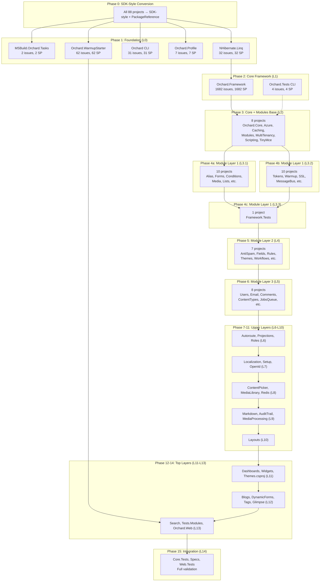

# Phased Modernization Plan: Orchard CMS

**Target:** `net10.0`
**Projects:** 88
**Total Issues:** 5,016 (2,928 mandatory)
**Generated:** 2026-04-11

## Dependency Diagram

## Phase Summary

| Phase | Layer | Projects | Story Points | Est. Max LOC | Key Work |
|-------|-------|----------|-------------|-------------|----------|
| 0 | All | 88 | — | — | SDK-style conversion + PackageReference |
| 1 | L0 | 5 | 134 | 121 | Foundation: NHibernate.Linq, WarmupStarter, CLI tools |
| 2 | L1 | 2 | 1,686 | 1,664 | **Orchard.Framework** (core hub — 1,682 SP) |
| 3 | L2 | 8 | 367 | 297 | Orchard.Core, Azure, Caching, Modules, Scripting |
| 4a | L3.1 | 10 | 530 | 453 | Alias, Forms, Conditions, Media, Lists, Packaging |
| 4b | L3.2 | 10 | 366 | 276 | Tokens, Warmup, SSL, MessageBus, Resources |
| 4c | L3.3 | 1 | 16 | 0 | Framework.Tests |
| 5 | L4 | 7 | 148 | 76 | AntiSpam, Fields, Rules, Themes, Workflows |
| 6 | L5 | 8 | 348 | 234 | Users, Email, Comments, ContentTypes, Templates |
| 7 | L6 | 4 | 129 | 99 | Autoroute, Projections, Recipes, Roles |
| 8 | L7 | 6 | 381 | 321 | Localization, Setup, OpenId, OutputCache |
| 9 | L8 | 5 | 165 | 118 | ContentPicker, ImportExport, MediaLibrary, Redis, Taxonomies |
| 10 | L9 | 6 | 166 | 90 | Markdown, AuditTrail, ImageEditor, MediaProcessing, Pages |
| 11 | L10 | 1 | 100 | 87 | Layouts |
| 12 | L11 | 3 | 80 | 66 | Dashboards, Widgets, Themes |
| 13 | L12 | 6 | 421 | 338 | Blogs, DynamicForms, Tags, DesignerTools, Glimpse, Upgrade |
| 14 | L13 | 3 | 169 | 124 | Search, Tests.Modules, **Orchard.Web** |
| 15 | L14 | 3 | 66 | 39 | Core.Tests, Specs, Web.Tests — **full validation** |

**Total Phases:** 18 (Phase 0 + 15 layer phases + 2 sub-layer splits in L3)

## Phase Details

### Phase 0: SDK-Style Conversion (Solution-Wide)

**Scope:** All 88 projects — single large mechanical PR
**PR Type:** Solution-wide, mechanical transformation

Tasks:
- [ ] Convert all `.csproj` to SDK-style format
- [ ] Migrate `packages.config` → `PackageReference`
- [ ] Add `Directory.Packages.props` for Central Package Management
- [ ] Add `Directory.Build.props` for shared properties
- [ ] Resolve transitive dependency version conflicts
- [ ] Validate solution builds on `net48`
- [ ] Delete all `packages.config` files

**Risks:**
- Transitive dependency version collisions
- Assembly binding redirect mismatches
- Build scripts referencing old project structure

---

### Phase 1: Foundation (Level 0) — 5 projects

**Story Points:** 134 | **Est. Max LOC:** 121
**Unblocks:** Orchard.Framework (Phase 2)

| Project | Issues | SP | Max LOC | Notes |
|---------|--------|----|---------|-------|
| MSBuild.Orchard.Tasks.csproj | 2 | 2 | 0 | Build tooling — standalone |
| NHibernate.Linq.csproj | 32 | 32 | 30 | Binary compat issues (Api.0001) |
| Orchard.csproj (CLI) | 31 | 31 | 29 | System.Web.Hosting + Remoting |
| Orchard.Profile.csproj | 7 | 7 | 0 | Standalone profiler |
| Orchard.WarmupStarter.csproj | 62 | 62 | 60 | System.Web dependency |

All 5 projects can be modernized **in parallel** — no inter-dependencies.

---

### Phase 2: Core Framework (Level 1) — 2 projects

**Story Points:** 1,686 | **Est. Max LOC:** 1,664
**Unblocks:** All 60+ modules, Orchard.Core, test projects

| Project | Issues | SP | Max LOC | Notes |
|---------|--------|----|---------|-------|
| **Orchard.Framework.csproj** | 1,682 | 1,682 | 1,664 | **Core hub** — heaviest project |
| Orchard.Tests.csproj (CLI) | 4 | 4 | 0 | CLI test project |

**Orchard.Framework** is the critical path. It has:
- 709 mandatory issues
- SystemWeb (bulk of solution-wide 3,741 issues)
- Legacy Cryptography, GDI+, CodeDom, WCF, Remoting
- 60+ downstream dependents

Consider splitting Framework modernization into sub-PRs by feature area
(e.g. Data/, Mvc/, Security/, ContentManagement/).

---

### Phase 3: Core + Module Base (Level 2) — 8 projects

**Story Points:** 367 | **Est. Max LOC:** 297
**Unblocks:** ~50 modules in Levels 3-12

| Project | Issues | SP | Max LOC | Notes |
|---------|--------|----|---------|-------|
| Orchard.Core.csproj | 279 | 279 | 272 | Core content types & services |
| Orchard.Azure.csproj | 33 | 33 | 20 | Azure storage/service bus |
| Orchard.Caching.csproj | 27 | 27 | 21 | Caching infrastructure |
| Orchard.Modules.csproj | 17 | 17 | 9 | Module management |
| Orchard.MultiTenancy.csproj | 22 | 22 | 14 | Multi-tenant support |
| Orchard.Scripting.csproj | 2 | 2 | 0 | Scripting base |
| TinyMce.csproj | 7 | 7 | 0 | Rich text editor |

All 8 can be modernized **in parallel** — they only depend on Framework.

---

### Phase 4a: Module Layer 1 — First Batch (Level 3.1) — 10 projects

**Story Points:** 530 | **Est. Max LOC:** 453

| Project | Issues | SP | Max LOC |
|---------|--------|----|---------|
| Orchard.Alias.csproj | 140 | 140 | 133 |
| Orchard.Forms.csproj | 7 | 7 | 0 |
| Orchard.Conditions.csproj | 13 | 13 | 7 |
| Orchard.Media.csproj | 20 | 20 | 13 |
| Orchard.Lists.csproj | 72 | 72 | 65 |
| Orchard.Packaging.csproj | 60 | 60 | 53 |
| Orchard.Tokens.csproj | 43 | 43 | 36 |
| Orchard.Warmup.csproj | 16 | 16 | 9 |
| Orchard.SecureSocketsLayer.csproj | 81 | 81 | 72 |
| Orchard.MessageBus.csproj | 56 | 56 | 50 |

### Phase 4b: Module Layer 1 — Second Batch (Level 3.2) — 10 projects

**Story Points:** 366 | **Est. Max LOC:** 276

| Project | Issues | SP | Max LOC |
|---------|--------|----|---------|
| SysCache.csproj | 3 | 3 | 0 |
| Orchard.Scripting.Dlr.csproj | 2 | 2 | 0 |
| Orchard.Resources.csproj | 7 | 7 | 0 |
| Orchard.PublishLater.csproj | 14 | 14 | 7 |
| Orchard.Migrations.csproj | 6 | 6 | 0 |
| Orchard.Indexing.csproj | 7 | 7 | 0 |
| Orchard.CodeGeneration.csproj | 31 | 31 | 25 |
| Orchard.ContentPreview.csproj | 16 | 16 | 4 |
| Orchard.ArchiveLater.csproj | 7 | 7 | 0 |
| Orchard.Azure.Tests.csproj | 12 | 12 | 3 |

**Phases 4a and 4b can run in parallel** — both only depend on L0–L2.

### Phase 4c: Framework Tests (Level 3.3) — 1 project

| Project | Issues | SP | Max LOC |
|---------|--------|----|---------|
| Orchard.Framework.Tests.csproj | 16 | 16 | 0 |

---

### Phase 5: Module Layer 2 (Level 4) — 7 projects

**Story Points:** 148 | **Est. Max LOC:** 76

| Project | Issues | SP | Max LOC |
|---------|--------|----|---------|
| Orchard.AntiSpam.csproj | 66 | 66 | 58 |
| Orchard.Fields.csproj | 8 | 8 | 1 |
| Orchard.MediaPicker.csproj | 7 | 7 | 0 |
| Orchard.Rules.csproj | 18 | 18 | 11 |
| Orchard.Themes.csproj | 44 | 44 | 37 |
| Orchard.Tokens.Tests.csproj | 5 | 5 | 2 |
| Orchard.Workflows.csproj | 33 | 33 | 25 |

---

### Phase 6: Module Layer 3 (Level 5) — 8 projects

**Story Points:** 348 | **Est. Max LOC:** 234

| Project | Issues | SP | Max LOC |
|---------|--------|----|---------|
| Orchard.Comments.csproj | 25 | 25 | 18 |
| Orchard.ContentTypes.csproj | 37 | 37 | 30 |
| Orchard.CustomForms.csproj | 37 | 37 | 30 |
| Orchard.Email.csproj | 57 | 57 | 43 |
| Orchard.JobsQueue.csproj | 9 | 9 | 1 |
| Orchard.Scripting.CSharp.csproj | 8 | 8 | 0 |
| Orchard.Templates.csproj | 45 | 45 | 38 |
| Orchard.Users.csproj | 150 | 150 | 143 |

---

### Phase 7: Level 6 — 4 projects

**Story Points:** 129 | **Est. Max LOC:** 99

| Project | Issues | SP | Max LOC |
|---------|--------|----|---------|
| Orchard.Autoroute.csproj | 47 | 47 | 40 |
| Orchard.Projections.csproj | 45 | 45 | 38 |
| Orchard.Recipes.csproj | 25 | 25 | 17 |
| Orchard.Roles.csproj | 12 | 12 | 4 |

---

### Phase 8: Level 7 — 6 projects

**Story Points:** 381 | **Est. Max LOC:** 321

| Project | Issues | SP | Max LOC |
|---------|--------|----|---------|
| Orchard.ContentPermissions.csproj | 7 | 7 | 0 |
| Orchard.Localization.csproj | 119 | 119 | 112 |
| Orchard.OpenId.csproj | 82 | 82 | 58 |
| Orchard.OutputCache.csproj | 139 | 139 | 131 |
| Orchard.Projections.Tests.csproj | 5 | 5 | 0 |
| Orchard.Setup.csproj | 28 | 28 | 20 |

---

### Phase 9: Level 8 — 5 projects

**Story Points:** 165 | **Est. Max LOC:** 118

| Project | Issues | SP | Max LOC |
|---------|--------|----|---------|
| Orchard.ContentPicker.csproj | 36 | 36 | 28 |
| Orchard.ImportExport.csproj | 31 | 31 | 9 |
| Orchard.MediaLibrary.csproj | 32 | 32 | 24 |
| Orchard.Redis.csproj | 17 | 17 | 14 |
| Orchard.Taxonomies.csproj | 49 | 49 | 43 |

---

### Phase 10: Level 9 — 6 projects

**Story Points:** 166 | **Est. Max LOC:** 90

| Project | Issues | SP | Max LOC |
|---------|--------|----|---------|
| Markdown.csproj | 10 | 10 | 0 |
| Orchard.AuditTrail.csproj | 17 | 17 | 8 |
| Orchard.ImageEditor.csproj | 10 | 10 | 3 |
| Orchard.MediaLibrary.WebSearch.csproj | 19 | 19 | 2 |
| Orchard.MediaProcessing.csproj | 55 | 55 | 47 |
| Orchard.Pages.csproj | 2 | 2 | 0 |

---

### Phase 11: Level 10 — 1 project

**Story Points:** 100 | **Est. Max LOC:** 87

| Project | Issues | SP | Max LOC |
|---------|--------|----|---------|
| Orchard.Layouts.csproj | 100 | 100 | 87 |

---

### Phase 12: Level 11 — 3 projects

**Story Points:** 80 | **Est. Max LOC:** 66

| Project | Issues | SP | Max LOC |
|---------|--------|----|---------|
| Orchard.Dashboards.csproj | 40 | 40 | 33 |
| Orchard.Widgets.csproj | 33 | 33 | 26 |
| Themes.csproj | 7 | 7 | 0 |

---

### Phase 13: Level 12 — 6 projects

**Story Points:** 421 | **Est. Max LOC:** 338

| Project | Issues | SP | Max LOC |
|---------|--------|----|---------|
| Orchard.Blogs.csproj | 283 | 283 | 276 |
| Orchard.DesignerTools.csproj | 38 | 38 | 31 |
| Orchard.DynamicForms.csproj | 17 | 17 | 7 |
| Orchard.Glimpse.csproj | 45 | 45 | 28 |
| Orchard.Tags.csproj | 25 | 25 | 18 |
| Upgrade.csproj | 13 | 13 | 0 |

---

### Phase 14: Level 13 — 3 projects

**Story Points:** 169 | **Est. Max LOC:** 124

| Project | Issues | SP | Max LOC |
|---------|--------|----|---------|
| Orchard.Search.csproj | 58 | 58 | 51 |
| Orchard.Tests.Modules.csproj | 90 | 90 | 79 |
| **Orchard.Web.csproj** | 21 | 21 | 0 |

---

### Phase 15: Integration & Validation (Level 14) — 3 projects

**Story Points:** 66 | **Est. Max LOC:** 39

| Project | Issues | SP | Max LOC |
|---------|--------|----|---------|
| Orchard.Core.Tests.csproj | 30 | 30 | 21 |
| Orchard.Specs.csproj | 14 | 14 | 0 |
| Orchard.Web.Tests.csproj | 22 | 22 | 18 |

Tasks:
- [ ] Run full test suite
- [ ] Validate end-to-end application startup
- [ ] Remove any multi-targeting TFMs
- [ ] Update CI/CD pipeline for `net10.0`
