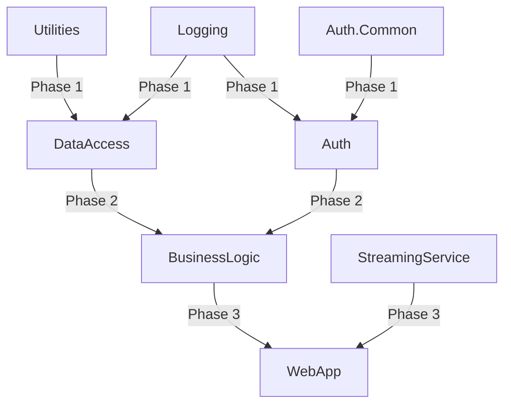

# ContosoLegacy — Sample .NET App for AppMod Demos

This is a sample "legacy" .NET Framework application designed for demonstrating
agentic .NET application modernization workflows.

## Solution Structure

The solution is organized into dependency layers to demonstrate the leaf-first
upgrade approach:

```text
ContosoLegacy.sln
├── src/
│   ├── ContosoLegacy.Utilities/          # Phase 1 (Leaf) - Common utilities
│   ├── ContosoLegacy.Logging/            # Phase 1 (Leaf) - Logging abstractions
│   ├── ContosoLegacy.Auth.Common/        # Phase 1 (Leaf) - Auth primitives
│   ├── ContosoLegacy.DataAccess/         # Phase 2 - Depends on Utilities, Logging
│   ├── ContosoLegacy.Auth/               # Phase 2 - Depends on Auth.Common, Logging
│   ├── ContosoLegacy.BusinessLogic/      # Phase 3 - Depends on DataAccess, Auth
│   ├── ContosoLegacy.StreamingService/   # Phase 3 - WCF streaming service (for Demo 4)
│   └── ContosoLegacy.WebApp/             # Phase 4 - ASP.NET Framework web app
└── tests/
    ├── ContosoLegacy.Utilities.Tests/
    ├── ContosoLegacy.DataAccess.Tests/
    └── ContosoLegacy.BusinessLogic.Tests/
```

## Dependency Graph



## Demo Usage

### Demo 1 — Skill Building

Use any project to demonstrate creating skills for common AppMod edge cases.

### Demo 2 — Dependency Analysis

Ask the agent to analyze the solution's dependency tree and generate a
multi-layer upgrade plan.

### Demo 3 — Async Parallel Execution

Modernize the three Phase 1 leaf projects in parallel.

### Demo 4 — /troubleshoot & 100× Pattern

Use `ContosoLegacy.StreamingService` (a WCF streaming service) to trigger
a known edge case and demonstrate the feedback loop.

## Workspace MCP Configuration

The `mcp.json` at the solution root configures the AppMod MCP NuGet package
for consistent naming across the team:

```json
{
  "servers": {
    "appmod": {
      "type": "stdio",
      "command": "dotnet",
      "args": ["mcp", "run", "Microsoft.GitHubCopilot.AppModernization.Mcp"]
    }
  }
}
```

## Notes

- This is a simplified sample for demo purposes
- The actual Vista workshop used a 10M LOC application
- The patterns demonstrated here apply at any scale
