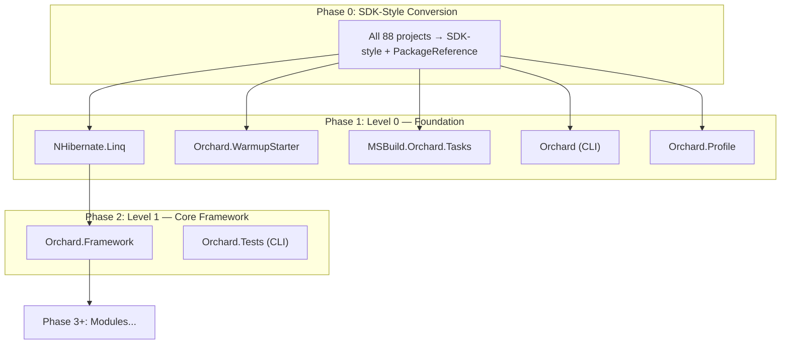

# AppMod Layer Planner

Generate a phased .NET modernization plan from upgrade assessment data by
extracting project dependency layers and sizing each phase for PR-reviewable
scope.

## Prerequisites

- An active `dotnet-version-upgrade` scenario with a completed assessment
  (`.github/upgrades/scenarios/dotnet-version-upgrade/assessment.json`).
- The `mcp_microsoft_git_query_dotnet_assessment` tool available (for
  `get_projects_graph` query).
- PowerShell 7+ (Windows) or Bash (macOS/Linux) for the layer-extraction
  script.

## Process

### Step 1 — Collect Inputs

Gather parameters. If the user has already specified values, use them.
Otherwise ask:

| Parameter | Default | Description |
|-----------|---------|-------------|
| `maxPerLayer` | 10 | Maximum projects in any single phase/sub-layer |
| `assessmentPath` | `.github/upgrades/scenarios/dotnet-version-upgrade/assessment.json` | Path to the assessment file |
| `targetFramework` | (from assessment) | The target TFM (e.g. `net10.0`) |

### Step 2 — Extract the Dependency Graph

Use the MCP tool to get the dependency hierarchy:

```text
mcp_microsoft_git_query_dotnet_assessment
  query: {"query": "get_projects_graph", "scope": "global"}
```

This returns a level-based graph (Level 0 = foundation/no dependencies,
Level N = depends on Levels 0 through N-1). Record each project's:

- **Level** (dependency depth)
- **Dependencies** (which projects it depends on)
- **Used by** (downstream consumers)
- **Issues** (total, mandatory count)
- **Story points** (from assessment `storyPoints` field)

### Step 3 — Split Thick Layers

If any level contains more than `maxPerLayer` projects, split it into
sub-layers using these heuristics (in priority order):

1. **Dependency ordering within the level** — if project A at level N
   depends on project B also at level N, B goes into an earlier sub-layer.
2. **Story point grouping** — group projects so each sub-layer's total
   story points stays roughly even, targeting PR-reviewable size.
3. **Functional cohesion** — keep related modules together (e.g. all
   `Orchard.Media*` modules in the same sub-layer).
4. **Leaf-node priority** — projects with no downstream dependents within
   the layer go first (safest to modernize).

Name sub-layers as `Level N.1`, `Level N.2`, etc.

### Step 4 — Build the Phase Plan

Structure the plan as sequential phases:

#### Phase 0 — SDK-Style Conversion (Solution-Wide)

This is always the first phase. It covers ALL projects simultaneously
because SDK-style conversion and `packages.config → PackageReference`
migration are tightly coupled.

- Convert all `.csproj` files from classic format to SDK-style.
- Migrate `packages.config` to `PackageReference`.
- Resolve transitive dependency version conflicts.
- Validate the solution builds after conversion.

This is the largest single PR and the hardest to decompose. Document
this constraint explicitly in the plan output.

#### Phase 1..N — Layer-by-Layer Modernization

For each (sub-)layer, starting from Level 0 upward:

1. List the projects in this phase.
2. Sum the story points and estimated lines to change.
3. Identify the issue categories (Api.0001, NuGet.0001, etc.).
4. Note which downstream projects are unblocked when this phase completes.
5. Flag projects that can be modernized in parallel within the phase.

#### Final Phase — Integration & Validation

- Wire up the top-level web host (`Orchard.Web.csproj`).
- Run full test suite (all test projects).
- Validate end-to-end application startup.

### Step 5 — Generate the Mermaid Diagram

Produce a Mermaid flowchart showing the dependency layers. Use this
structure:



For solutions with many projects, group by sub-layer and show counts
rather than individual project nodes (e.g. `"Level 3.1 (8 modules)"`).

Use the `references/PHASING-STRATEGY.md` file for detailed guidance on
SDK-style conversion risks and package upgrade grouping.

### Step 6 — Format the Output

Generate the plan as a markdown document with this layout:

```markdown
# Phased Modernization Plan: {SolutionName}

**Target:** {targetFramework}
**Projects:** {count}
**Total Issues:** {issues} ({mandatory} mandatory)

## Dependency Diagram

{Mermaid diagram from Step 5}

## Phase Summary

| Phase | Layer | Projects | Story Points | Est. LOC Change | Key Work |
|-------|-------|----------|-------------|-----------------|----------|
| 0     | All   | 88       | —           | —               | SDK-style conversion |
| 1     | L0    | 5        | 133         | 60              | Foundation libs |
| ...   | ...   | ...      | ...         | ...             | ...      |

## Phase Details

### Phase 0: SDK-Style Conversion
{details}

### Phase 1: Foundation (Level 0)
{per-project breakdown}

### Phase N: ...
```

### Step 7 — Write the Plan File

Save the output to:
`.github/upgrades/scenarios/dotnet-version-upgrade/layer-plan.md`

Present the summary to the user and ask whether to adjust `maxPerLayer`
or regroup any projects.

## Script Usage

For automated layer extraction from `assessment.json`, use the bundled
scripts. See `scripts/Build-LayerPlan.ps1` or `scripts/build-layer-plan.sh`.

```powershell
./scripts/Build-LayerPlan.ps1 `
    -AssessmentPath ".github/upgrades/scenarios/dotnet-version-upgrade/assessment.json" `
    -MaxPerLayer 10 `
    -OutputPath ".github/upgrades/scenarios/dotnet-version-upgrade/layer-plan.md"
```

```bash
./scripts/build-layer-plan.sh \
    --assessment-path ".github/upgrades/scenarios/dotnet-version-upgrade/assessment.json" \
    --max-per-layer 10 \
    --output-path ".github/upgrades/scenarios/dotnet-version-upgrade/layer-plan.md"
```

## Edge Cases

- **Circular dependencies**: If the assessment graph contains cycles,
  report them as errors — cycles must be broken before phasing.
- **Single-project layers**: Valid — some layers naturally have one
  project (e.g. `Orchard.Framework` as the core hub).
- **Test projects**: Group test projects with the production project
  they test when possible. If a test project spans multiple layers
  (e.g. `Orchard.Tests.Modules`), place it in the highest layer of
  its dependencies.
- **No assessment file**: If assessment.json does not exist, instruct
  the user to run `mcp_microsoft_git_generate_dotnet_upgrade_assessment`
  first.
