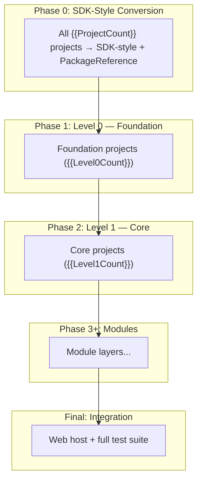

# Phased Modernization Plan: {{SolutionName}}

**Target:** {{TargetFramework}}
**Projects:** {{ProjectCount}}
**Total Issues:** {{TotalIssues}} ({{MandatoryIssues}} mandatory)
**Generated:** {{Date}}

## Dependency Diagram

## Phase Summary

| Phase | Layer | Projects | Story Points | Est. LOC Change | Key Work |
|-------|-------|----------|-------------|-----------------|----------|
| 0 | All | {{ProjectCount}} | — | — | SDK-style conversion + PackageReference |
<!-- Repeat for each phase -->
| 1 | L0 | {{Level0Count}} | {{Level0SP}} | {{Level0LOC}} | Foundation libraries |
| Final | All | — | — | — | Integration & validation |

## Phase Details

### Phase 0: SDK-Style Conversion (Solution-Wide)

**Scope:** All {{ProjectCount}} projects
**PR Type:** Single large mechanical PR

Tasks:

- [ ] Convert all `.csproj` to SDK-style format
- [ ] Migrate `packages.config` → `PackageReference`
- [ ] Add `Directory.Packages.props` for Central Package Management
- [ ] Add `Directory.Build.props` for shared properties
- [ ] Resolve transitive dependency version conflicts
- [ ] Validate solution builds on `net48`
- [ ] Delete all `packages.config` files

**Risks:**

- Transitive dependency version collisions
- Assembly binding redirect mismatches
- Build scripts that reference old project structure

---

### Phase {{N}}: {{LayerName}} (Level {{L}})

**Scope:** {{PhaseProjectCount}} projects
**Story Points:** {{PhaseSP}}
**Estimated LOC Change:** {{PhaseLOC}}
**Unblocks:** {{UnblockedProjects}}

| Project | Issues | Story Points | LOC Change | Key Technologies |
|---------|--------|-------------|------------|------------------|
<!-- Per-project rows -->

Tasks:

- [ ] Retarget to `{{TargetFramework}}`
- [ ] Resolve mandatory API compatibility issues
- [ ] Update NuGet packages per assessment recommendations
- [ ] Fix source-incompatible API calls
- [ ] Address behavioral changes
- [ ] Validate build and tests

---

### Final Phase: Integration & Validation

**Scope:** End-to-end application validation

Tasks:

- [ ] Wire up top-level web host on `{{TargetFramework}}`
- [ ] Run full test suite
- [ ] Validate application startup and core workflows
- [ ] Remove any `net48` multi-targeting
- [ ] Update CI/CD pipeline for new TFM
