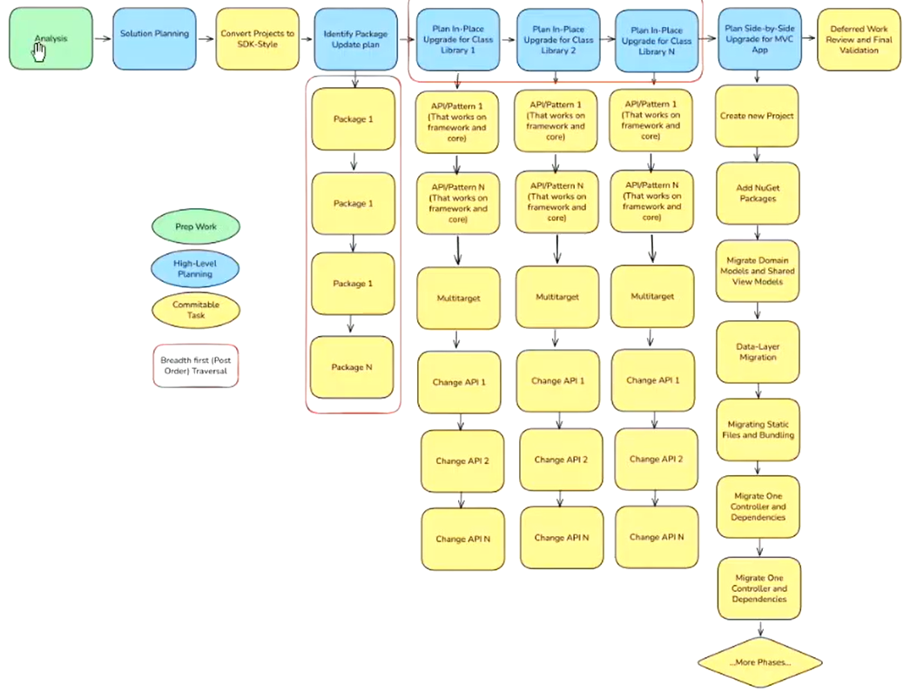
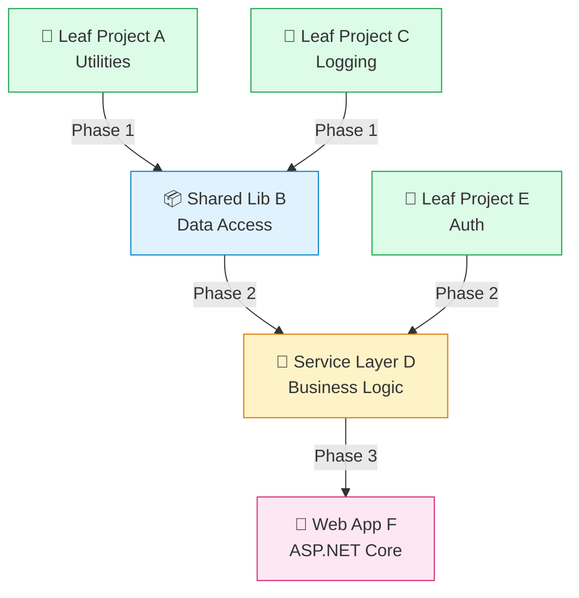

<!-- ═══════════════════════════════════════════════════════════
     SLIDE 1 — TITLE HERO                                ~1 min
     ═══════════════════════════════════════════════════════════ -->

  

    
    <a href="https://danielscottraynsford.com/plagueho.learn/agentic-dotnet-appmod" target="_blank" class="hero-qr-url">danielscottraynsford.com/plagueho.learn/agentic-dotnet-appmod</a>
  

  
AppMod MCP · Skills · Dependency Layers · /troubleshoot · Async Execution

  <h1 class="hero-heading">Agentic .NET AppMod</h1>
  

    What works, what doesn't and how to fix it — lessons from a week with the
    Microsoft .NET AppMod CAT team modernizing a <strong>10M LOC, 30-year-old app</strong>
    using <strong>AppMod MCP</strong>, <strong>dependency layers</strong>, and <strong>reusable skills</strong>.
  

  

    Daniel Scott-Raynsford (DSR)
    Sr. Partner Solution Architect · Cloud &amp; AI Apps · Microsoft EPS
    45 minutes · unplugged · demo-heavy
  

  

    

      <strong>🔧 Skills &gt; Prompts</strong>
      20+ skills built in 4 days
    

    

      <strong>📦 Break it down</strong>
      Dependency layers, leaf-first
    

    

      <strong>⚡ Go async</strong>
      Stop watching agents
    

    

      <strong>🔍 100× pattern</strong>
      /troubleshoot + update skill
    

  

<!--
Frame this as a candid, lessons-learned session — not a sizzle reel. Everything
here was earned over 4 days of real work on a real 10M LOC app with the
Microsoft AppMod CAT team. "We did it, we learned, we're sharing."
-->

---
transition: fade-out
---

<!-- ═══════════════════════════════════════════════════════════
     SLIDE 2 — ABOUT ME                                  ~1 min
     ═══════════════════════════════════════════════════════════ -->

  

    <h1>About Me</h1>
  

  

    

      

        

          
          
          
        

        daniel-scott-raynsford — Visual Studio Code Insiders
      

      

        
📄 about.json

        

      

      

        

          
1 2 3 4 5 6 7 8 9 10 11 12 13

          
{  "👤 name": "Daniel Scott-Raynsford",  "🏷️ alias": "PlagueHO",  "💼 role": "Partner Solution Architect",  "🏢 team": "Cloud &amp; AI Apps · Microsoft EPS",  "💻 origin": "Recovering software engineer",  "🔗 links": {  "🌐 web": <a href="https://danielscottraynsford.com" target="_blank" class="j-link">"danielscottraynsford.com"</a>,  "💼 linkedin": <a href="https://www.linkedin.com/in/dscottraynsford/" target="_blank" class="j-link">"linkedin.com/in/dscottraynsford"</a>,  "🐙 github": <a href="https://github.com/PlagueHO" target="_blank" class="j-link">"github.com/PlagueHO"</a>  }}

        

      

      

        ⎇ main
        ✓ GitHub Copilot
        JSON
        UTF-8
        Ln 12, Col 1
      

    

  

<!--
Keep this quick — 60 seconds max. Set the tone: this is a conversation, not
a lecture. Ask questions anytime. Demo-heavy. "I'm going to share things that
actually happened, not things I think should happen."
-->

---
transition: slide-up
---

<!-- ═══════════════════════════════════════════════════════════
     SLIDE 3 — AGENDA                                    ~30 sec
     ═══════════════════════════════════════════════════════════ -->

  

    

    

    

  

  

    
45 MINUTES · 5 LIVE DEMOS · UNPLUGGED

    <h1 class="agenda-title">Agenda</h1>
  

  

    

      

      01
      <h2>The Hard Truth</h2>
      
No sizzle reels — what large-scale AppMod actually looks like

    

    

      

      02
      <h2>Toolchain &amp; Tool Discipline</h2>
      
VS Code Insiders, AppMod MCP, workspace config, tool hygiene

    

    

      

      03
      <h2>Layers, Skills &amp; Build-Fix</h2>
      
Dependency layers, skills over prompts, the build-fix loop

    

    

      

      04
      <h2>Async &amp; Observability</h2>
      
Go async, the 100× pattern, what to do now

    

  

  

    

      
      
        🎬 Demo 1
        Assessment
      
    

    

      
      
        🎬 Demo 2
        Dependency Layers
      
    

    

      
      
        🎬 Demo 3
        Prompt→Skill
      
    

    

      
      
        🎬 Demo 4
        Async Execution
      
    

    

      
      
        🎬 Demo 5
        /troubleshoot &amp; 100×
      
    

  

<!--
Quick scan of the agenda — don't dwell. Point out the 5 demo markers so
people know when we'll jump to live code. "This is an unplugged session —
ask questions anytime, challenge anything, let's make it a conversation."
-->

---
transition: fade-out
---

<!-- ═══════════════════════════════════════════════════════════
     SLIDE 4 — THE WORKSHOP CONTEXT                       ~2 min
     ═══════════════════════════════════════════════════════════ -->

  

    <h1>The Workshop Context</h1>
  

  

    

      <strong>"Completely game changing"</strong> — 4 days, all recorded, learnings we want every partner to have
    

    

      

        🏢 Who
        <ul class="agent-pattern-list">
          <li>Microsoft Director, DevDiv CoreAI AppMod</li>
          <li>Microsoft Principal Engineer, AppMod</li>
          <li>Microsoft EPS, Partner Solution Architects, Cloud and AI Apps</li>
        </ul>
      

      

        🎯 What
        <ul class="agent-pattern-list">
          <li>SDC engagement with partner a in New Zealand</li>
          <li>Target: <strong>10M LOC, 30-year-old .NET application</strong></li>
          <li>Goal: realistic AppMod at enterprise scale using AI</li>
        </ul>
      

      

        💡 Why This Talk
        <ul class="agent-pattern-list">
          <li>The AppMod CAT team brought techniques customers rarely see</li>
          <li>We want to enable any organization to run workshops like this</li>
          <li>These learnings are <strong>directly applicable</strong> to any organization performing app modernization</li>
        </ul>
      

    

  

---
transition: fade-out
---

<!-- ═══════════════════════════════════════════════════════════
     SLIDE 5 — THE HARD TRUTH                             ~4 min
     ═══════════════════════════════════════════════════════════ -->

  

    <h1>The Hard Truth About Large-Scale AppMod</h1>
  

  

    

      <strong>⚠️</strong> "Everybody wants push a button… but the reality is it's not for any large or complex applications."
    

    

      

        

          ❌ What Doesn't Work
          <ul class="agent-pattern-list" style="font-size: 1.03rem; margin-top: 0.15rem;">
            <li>"Single-click" AI AppMod for non-trivial apps</li>
            <li>Problem isn't code conversion — it's package support, validation, tech debt</li>
            <li>If your app is <strong>small enough for single-click</strong>, it's small enough to <strong>rebuild entirely with AI</strong></li>
          </ul>
        

        

          ✅ What Does Work
          <ul class="agent-pattern-list" style="font-size: 1.03rem; margin-top: 0.15rem;">
            <li>Follow <strong>standard .NET AppMod approach</strong> — then leverage AI to automate and make it repeatable</li>
            <li>AI is an acceleration mechanism, <strong>not a blind code-rewriter</strong></li>
            <li>On big PRs: <strong>"No one's gonna review that."</strong></li>
          </ul>
        

      

      

        🗺️ Upgrade process
        
        

          <strong>📺 Pre-requisite:</strong> You MUST understand standard .NET AppMod before starting.
          <a href="https://www.youtube.com/watch?v=umcl-Ooaay4" target="_blank">Auckland .NET User Group recording</a>
        

      

    

  

<!--
This is the "what doesn't work" part of the title. Set expectations correctly.
The AppMod CAT team's own words: stop promising magic. The incremental approach
was repeatedly stressed — "maintain confidence at every step". Point attendees
to the Auckland recording as essential prep.
-->

---
transition: fade-out
---

<!-- ═══════════════════════════════════════════════════════════
     SLIDE 6 — THE RIGHT TOOLCHAIN & TOOL DISCIPLINE      ~3 min
     ═══════════════════════════════════════════════════════════ -->

  

    <h1>The Right Toolchain &amp; Tool Discipline</h1>
  

  

    

      

        💬
        "Everyone in DevDiv uses Insiders, no one uses stable. We recommend all customers use Insiders if they can."
      

      

    

    

      

        💻 VS Code Insiders
        
AI Dev moves so fast that by the time a feature reaches Stable, <strong>the state of the art has moved on</strong>

      

      

        ⬆️ Update Aggressively
        
Every day we started with an update. Solutions to <strong>yesterday's problems</strong> often arrived in <strong>today's update</strong>

      

      

        📦 AppMod MCP NuGet
        
Use <code>Microsoft.GitHubCopilot.AppModernization.Mcp</code> — the official AppMod tools and agents

      

    

    

      

        ⚠️ Extension Hygiene
        
<strong>Remove all</strong> AppMod extensions. Use <strong>only</strong> the NuGet MCP package. Multiple competing extensions confuse agents.

      

      

        🔧 Tool Wrangling Is a Discipline
        
When things went wrong, tools had been disabled/enabled by different agents. <strong>Restrict tool surface area.</strong>

        
💭 <em>"I can review it and I don't understand it. It's too much."</em>

      

      

        📋 Workspace Config
        
Commit <code>mcp.json</code>, shared prompts in <code>.github/skills</code>, <code>.github/agents</code>, <code>custom-instructions.md</code>

        
<strong>Repeatability across repos</strong>, not per-developer setup

      

    

  

---
transition: fade-out
---

<!-- ═══════════════════════════════════════════════════════════
     SLIDE 7 — DEMO 1: MODERNIZATION ASSESSMENT           ~3 min
     ═══════════════════════════════════════════════════════════ -->

  
📋

  <h1 class="demo-title">Demo 1: Modernization Assessment — First Steps</h1>
  
Configure the toolchain, run the baseline assessment, understand your starting point

  
🎬 ~3 minutes

  

    
▸ Show workspace <code>.vscode/mcp.json</code> with AppMod MCP server configured

    
▸ Run <code>#discover_upgrade_scenarios</code> → target .NET 10

    
▸ Walk through assessment: 88 projects, 286K LOC, 5,016 issues

    
▸ Show how the baseline report drives all subsequent planning

  

<!--
DEMO SCRIPT — Modernization Assessment (~3 min)
═════════════════════════════════════════════════

SETUP: VS Code Insiders with Orchard CMS repo, AppMod MCP NuGet installed.

1. SHOW CONFIG (30 sec)
   - Open .vscode/mcp.json — show the Microsoft.GitHubCopilot.AppModernization.Mcp
     server configuration plus context7 MCP
   - Point out: workspace-level config, committed to repo, same for everyone

2. RUN ASSESSMENT (1 min)
   - Run: #discover_upgrade_scenarios
   - Respond: "Yes, target .NET 10"
   - Show generated files: assessment.csv, assessment.md, assessment.json, scenario.json

3. WALK THROUGH REPORT (1.5 min)
   - 88 projects, all require upgrade (all net48, all non-SDK-style)
   - 93 NuGet packages (41 need upgrade)
   - 286K LOC across 4,549 code files — 5,016 issues found
   - Most modules rated 🔴 High difficulty (WAP project type)
   - "This baseline drives everything: layers, skill selection, migration ordering"
-->

---
transition: fade-out
---

<!-- ═══════════════════════════════════════════════════════════
     SLIDE 8 — BREAKING DOWN THE MONSTER                   ~4 min
     ═══════════════════════════════════════════════════════════ -->

  

    <h1>Breaking Down the Monster — Dependency Layers</h1>
  

  

    

      

        

          <strong>⚠️ A 10K LOC PR is unacceptable and will never get merged</strong> — AppMod stalls.
        

        

          📋 The Approach
          
<strong>1.</strong> Build a <strong>dependency tree</strong>, identify leaf nodes

          
<strong>2.</strong> Modernize leaves first — breadth-first layered traversal

          
<strong>3.</strong> Each phase = <strong>working app + reviewable PR</strong>

          
<strong>4.</strong> Projects within the same layer can be modernized <strong>in parallel</strong>

        

        

          🔄 SDK-Style Conversion First
          
Convert to SDK-style + PackageReference is the <strong>mandatory gating step</strong>

          
Often the largest single PR — mixing old/new format is "hit or miss"

        

        

          🌿 Strangler Fig for ASP.NET
          
Core app sits in front, proxies unmigrated routes to legacy Framework app, migrate incrementally

        

      

      

        

      

    

  

<!--
Break the problem into dependency layers, start at the leaves, keep PRs small.
AI makes this repeatable. SDK-style conversion is the biggest hurdle — plan for
a large PR and get it done first. The layered approach enables parallelization
within each layer. For web apps, Strangler Fig was explicitly and strongly
recommended by the CAT team — Core in front, proxy to Framework, migrate
incrementally. Avoids the "turn it on at the end and hope" anti-pattern.
-->

---
transition: fade-out
---

<!-- ═══════════════════════════════════════════════════════════
     SLIDE 9 — DEMO 2: DEPENDENCY LAYER EXTRACTION         ~5 min
     ═══════════════════════════════════════════════════════════ -->

  
📦

  <h1 class="demo-title">Demo 2: Dependency Layer Extraction — Orchard CMS</h1>
  
Run the appmod-layer-planner skill against Orchard CMS (~88 projects)

  
🎬 ~5 minutes

  

    
▸ Run appmod-layer-planner skill against Orchard.sln

    
▸ Show generated layer-plan.md — Mermaid diagram, 15 phases

    
▸ Phase 0: SDK-style conversion (all 88 projects, gating step)

    
▸ Phase 2: Orchard.Framework — critical path bottleneck (1,682 story pts)

    
▸ Show how the layer plan feeds into build-fix and parallel execution

  

<!--
DEMO SCRIPT — Dependency Layer Extraction (~5 min)
═══════════════════════════════════════════════════

SETUP: Orchard CMS repo with assessment from Demo 1 already generated.

1. RUN THE SKILL (2 min)
   - Run the appmod-layer-planner skill against Orchard.sln
   - Show the generated layer-plan.md with Mermaid dependency diagram
   - Walk through: Phase 0 (SDK-style) → Phase 1 (5 leaf projects) →
     Phase 2 (Orchard.Framework bottleneck) → Phases 4a/4b (20 modules)

2. KEY FINDINGS (2 min)
   - Phase 0: all 88 projects must convert to SDK-style first (gating step)
   - Phase 1 foundation: NHibernate.Linq, WarmupStarter, CLI tools — parallelizable
   - Phase 2: Orchard.Framework is the critical path (709 mandatory issues)
   - Phase 15: integration tests as the final validation gate

3. WRAP (1 min)
   - "This plan drives everything — which agents to launch, what skills to
     build, how to parallelize. Without it, you're flying blind."
-->

---
transition: fade-out
---

<!-- ═══════════════════════════════════════════════════════════
     SLIDE 10 — SKILLS OVER PROMPTS                        ~5 min
     ═══════════════════════════════════════════════════════════ -->

  

    <h1>Skills Over Prompts — The Shift That Changed Everything</h1>
  

  

    

      

        

          📈 The Workshop Arc
          <ul class="agent-pattern-list" style="font-size: 1.1rem; line-height: 1.35; margin-top: 0.1rem;">
            <li><strong>Day 1:</strong> Engineers build prompts (familiar, comfortable)</li>
            <li><strong>Day 2:</strong> Prompts hit limits — skills emerge as better fit</li>
            <li><strong>Day 3-4:</strong> Team becomes a "Skill &amp; Agent factory"</li>
            <li><strong>End of week:</strong> 20+ skills, only ~2 prompts remain</li>
          </ul>
        

      

      

        

          <a class="pyramid-layer" href="https://code.visualstudio.com/docs/copilot/customization/custom-instructions" target="_blank" style="margin: 0 0; background: linear-gradient(90deg, #0a2e4a, #103954); text-decoration: none; cursor: pointer;">
            1
            Instructions
            Always-on repo/path conventions
          </a>
          <a class="pyramid-layer pyramid-layer-faded" href="https://code.visualstudio.com/docs/copilot/customization/prompt-files" target="_blank" style="margin: 0 0.5rem; background: linear-gradient(90deg, #114D8B, #1a5ea8); text-decoration: none; cursor: pointer;">
            2
            Prompts
            Fading away — convert to skills
          </a>
          <a class="pyramid-layer" href="https://code.visualstudio.com/docs/copilot/customization/mcp-servers" target="_blank" style="margin: 0 1.1rem; background: linear-gradient(90deg, #085f92, #0d83c0); text-decoration: none; cursor: pointer;">
            3
            MCP
            AppMod MCP NuGet — core tooling
          </a>
          <a class="pyramid-layer" href="https://code.visualstudio.com/docs/copilot/customization/custom-agents" target="_blank" style="margin: 0 1.8rem; background: linear-gradient(90deg, #0c6484, #1088ac); text-decoration: none; cursor: pointer;">
            4
            Agents
            Specialist personas with tool scopes
          </a>
          <a class="pyramid-layer" href="https://code.visualstudio.com/docs/copilot/customization/agent-skills" target="_blank" style="margin: 0 2.7rem; background: linear-gradient(90deg, #077769, #08a08d); text-decoration: none; cursor: pointer;">
            5
            Skills
            ★ 20+ built during workshop
          </a>
          <a class="pyramid-layer" href="https://code.visualstudio.com/docs/copilot/customization/hooks" target="_blank" style="margin: 0 3.7rem; background: linear-gradient(90deg, #0a7f59, #0da977); text-decoration: none; cursor: pointer;">
            6
            Hooks
            Deterministic lifecycle commands
          </a>
          <a class="pyramid-layer" href="https://code.visualstudio.com/docs/copilot/customization/agent-plugins" target="_blank" style="margin: 0 4.8rem; background: linear-gradient(90deg, #5635a0, #7850c0); text-decoration: none; cursor: pointer;">
            7
            Plugins
            Package &amp; share via org marketplace
          </a>
        

        

          

            🧩 Skills = Building Blocks
            
Deterministic, portable, discoverable

            
<a href="https://agentskills.io/" target="_blank">agentskills.io</a> open standard

          

          

            🏢 Org Marketplace
            
<a href="https://code.visualstudio.com/docs/copilot/customization/agent-plugins" target="_blank">Agent Plugins</a> for sharing

            
Private marketplace at scale

          

        

      

    

    

      <strong>Key insight:</strong> "The tool is not to modernize the code — the tool is to help you build the <em>process</em> to modernize the code."
    

  

<!--
This is the core operating model shift. Skills are deterministic, portable,
discoverable. Prompts are throwaway. The workshop proved this over 4 days.

Show the 7-layer customization stack but highlight where the workshop focused:
Skills (layer 5) and MCP (layer 3) did 90% of the heavy lifting. Prompts
(layer 2) faded. Plugins (layer 7) are how you share everything with your org.

Key tools: Sensei for skill quality validation, Skill Creator for scaffolding,
Prompt→Skill converter for migrating existing prompts.
-->

---
transition: fade-out
---

<!-- ═══════════════════════════════════════════════════════════
     SLIDE 11 — DEMO 3: THE PROMPT→SKILL PIPELINE          ~5 min
     ═══════════════════════════════════════════════════════════ -->

  
🔧

  <h1 class="demo-title">Demo 3: The Prompt→Skill Pipeline</h1>
  
Create, refine, and share skills — the workflow the team used every day

  
🎬 ~5 minutes

  

    
▸ Create a skill using skill-creator (scaffold + validate with Sensei)

    
▸ Show the prompt→skill refinement loop: run → inspect → adjust → re-run

    
▸ Introduce Agent Plugins — package and share skills as installable units

    
▸ Show agent selecting the skill automatically

  

<!--
DEMO SCRIPT — The Prompt→Skill Pipeline (~5 min)
═════════════════════════════════════════════════════════

SETUP: VS Code Insiders with .github/skills/ configured, Sensei installed.

1. CREATE A SKILL (2 min)
   - Use skill-creator to scaffold a new skill
   - Show the generated SKILL.md with frontmatter
   - Run Sensei to validate — show before/after improvements
   - The appmod-layer-planner was created this way

2. REFINEMENT LOOP (1.5 min)
   - Show how the layer planner evolved from a naive prompt into a skill
   - Day 1: prompt choked — context window pressure, output too large
   - Day 2: refined into incremental, loop-based skill
   - "The little loop of create→test→refine is normal and expected"

3. AGENT PLUGINS (1 min)
   - Show Agent Plugins for packaging and sharing
   - Show github/awesome-copilot — the community marketplace
   - "Every org should create their own agent plugin repo"

4. WRAP (30 sec)
   - "By day 3, the team was a Skill & Agent factory.
     Each skill amplified everyone."
-->

---
transition: fade-out
---

<!-- ═══════════════════════════════════════════════════════════
     SLIDE 12 — THE BUILD-FIX LOOP & TESTING               ~4 min
     ═══════════════════════════════════════════════════════════ -->

  

    <h1>The Build-Fix Loop &amp; Testing</h1>
  

  

    

      
🎯 Add Target

      →
      
🔴 Build Fails

      →
      
🤖 Agent Fixes

      →
      
🟢 Build Clean

      →
      
✅ Commit

      →
      
➡️ Next Project

    

    

      

        🔄The Inner Engine
        
Agents run <code>dotnet build</code>, observe failures, apply fixes, and repeat until stable.

        
Enable <strong>auto-approval</strong> for safe commands and intervene at <strong>review + commit boundaries</strong>.

      

      

        🧪Testing Strategy
        
<strong>Testing is the primary constraint</strong> on safe modernization when legacy suites are thin.

        
Prioritize <strong>integration and end-to-end tests</strong> for behavioral parity over implementation-level rewrites.

      

      

        🏗️Orchard CMS Example
        
Convert Orchard.Tags to SDK-style, fix NHibernate package failures, build clean, commit, and move to the next module.

      

    

    

      <strong>💬</strong> "Make changes that are required to get you to modern .NET. Don't do all sorts of nice fluffy things."
    

  

<!--
The build-fix loop is the inner engine of the migration. Once you trust it,
agents can churn through dozens of projects. Scope it: one project at a time,
commit at each boundary. Testing was repeatedly described as the primary
constraint — don't chase unit coverage on legacy code, focus on behavioral
parity at the integration level. The goal is confidence, not coverage metrics.
-->

---
transition: fade-out
---

<!-- ═══════════════════════════════════════════════════════════
     SLIDE 13 — GO ASYNC                                   ~3 min
     ═══════════════════════════════════════════════════════════ -->

  

    <h1>Go Async — Stop Watching Agents</h1>
  

  

    

      <strong>💬</strong> "Just shove it to the background. Let's go do something else, right?" and "You can't watch it."
    

    

      

        📈The Confidence Curve
        <ul class="agent-pattern-list" style="margin-top: 0.2rem; font-size: 1.26rem;">
          <li><strong>Day 1-2:</strong> Engineers watched every step.</li>
          <li><strong>Day 3:</strong> First attempts at parallelization.</li>
          <li><strong>Day 4:</strong> Async execution drove massive acceleration.</li>
        </ul>
      

      

        ⚡Parallelization Tools
        <ul class="agent-pattern-list" style="margin-top: 0.2rem; font-size: 1.26rem;">
          <li><strong>Agent Panel:</strong> multiple agent conversations.</li>
          <li><strong>#runSubagent:</strong> delegate subtasks to isolated contexts.</li>
          <li><strong>Fleets / Squads:</strong> coordinated multi-agent teams.</li>
        </ul>
      

      

        📦Layer-Based Parallelization
        <ul class="agent-pattern-list" style="margin-top: 0.2rem; font-size: 1.26rem;">
          <li>Dependency layers unlock safe concurrency.</li>
          <li>Projects in the same layer can run in parallel.</li>
          <li><strong>Orchard CMS:</strong> 5 leaf modules modernized as independent PRs.</li>
        </ul>
      

    

    

      <strong>💡 Key insight:</strong> confidence took 2-3 days to build, enabled by skills, dependency layers, and /troubleshoot.
    

  

<!--
The acceleration from async execution was dramatic. But it didn't happen on
day 1. Engineers needed the confidence that comes from skills (deterministic
behavior), dependency layers (bounded scope), and /troubleshoot (diagnosis when
things go wrong). Once those were in place, going async was natural. The
dependency layer plan is what makes parallelization possible — projects in
the same layer have no inter-dependencies.
-->

---
transition: fade-out
---

<!-- ═══════════════════════════════════════════════════════════
     SLIDE 14 — DEMO 4: ASYNC PARALLEL EXECUTION           ~3 min
     ═══════════════════════════════════════════════════════════ -->

  
⚡

  <h1 class="demo-title">Demo 4: Async Parallel Execution — Orchard Modules</h1>
  
Fire off parallel AppMod tasks across Orchard CMS leaf modules

  
🎬 ~3 minutes

  

    
▸ Identify Phase 1 leaf projects from the layer plan

    
▸ Open multiple Agent Panels — one per leaf module

    
▸ Fire off parallel modernizations (NHibernate.Linq, WarmupStarter, Orchard CLI)

    
▸ Show context isolation — each agent works independently

    
▸ Review results — each produces an independent, reviewable PR

  

<!--
DEMO SCRIPT — Async Parallel Execution (~3 min)
═════════════════════════════════════════════════

SETUP: Orchard CMS with layer plan generated. Leaf modules identified.

1. PARALLEL LAUNCH (1 min)
   - Open 3 Agent Panel conversations
   - Agent 1: "Modernize NHibernate.Linq to SDK-style for net10.0"
   - Agent 2: "Modernize WarmupStarter to SDK-style for net10.0"
   - Agent 3: "Modernize Orchard CLI to SDK-style for net10.0"

2. CONTEXT ISOLATION (1 min)
   - Show that each agent runs independently
   - No shared context pollution
   - Each creates its own branch and commit

3. WRAP (1 min)
   - "Day 4 looked like this. Fire and forget. Review and merge.
     The parallelization is where the 10× comes from."
-->

---
transition: fade-out
---

<!-- ═══════════════════════════════════════════════════════════
     SLIDE 15 — OBSERVABILITY & THE 100× PATTERN           ~3 min
     ═══════════════════════════════════════════════════════════ -->

  

    <h1>The 100× Pattern</h1>
  

  

    

      

        🧠
        When agents fail, how do we fix it <em>and ensure it never happens again?</em>
      

      

    

    

      

        🔍Observe
        <strong>Chat Debug / /troubleshoot</strong> — Started the week as the <em>most useful tool</em> for understanding when/why AppMod MCP and skills "go astray". On day 4, VS Code Insiders enabled enhanced Chat Debug — <strong>game changing!</strong>
      

      

        🔧Diagnose
        <strong>10×: /troubleshoot</strong> — Ask why: <code>/troubleshoot Why did you do X rather than Y?</code> Understand the agent's reasoning and pinpoint mistakes.
      

      

        ⚡Fix Permanently
        <strong>100×: /troubleshoot + Update Skill</strong> — Ask and fix: <code>/troubleshoot Why did you do X rather than Y and then update Skill Z so you don't do that again?</code> Feedback loop that <strong>permanently fixes behavior</strong>.
      

    

    

      <strong>This is the most important operational pattern from the entire workshop.</strong> The 100× comes from compounding — every fix makes the system permanently smarter.
    

  

<!--
Build this progressively: /troubleshoot alone is 10× because you can diagnose.
Adding "and update the skill" makes it 100× because the fix is permanent.
Every time you close this loop, the system gets smarter. Over 4 days, the
team closed dozens of these loops — the cumulative effect was extraordinary.
Observability is essential for safe scaling — a prerequisite for agent autonomy.
-->

---
transition: fade-out
---

<!-- ═══════════════════════════════════════════════════════════
     SLIDE 16 — DEMO 5: /troubleshoot & 100× PATTERN      ~5 min
     ═══════════════════════════════════════════════════════════ -->

  
🔍

  <h1 class="demo-title">Demo 5: /troubleshoot &amp; The 100× Pattern</h1>
  
Observe, diagnose, update the skill — permanently fix the behavior

  
🎬 ~5 minutes

  

    
▸ Trigger an AppMod task that makes a known mistake

    
▸ Use /troubleshoot to diagnose WHY

    
▸ Ask: "update Skill Z so you don't do that again"

    
▸ Re-run — show the behavior is permanently fixed

  

<!--
DEMO SCRIPT — /troubleshoot & The 100× Pattern (~5 min)
════════════════════════════════════════════════════════

SETUP: A skill that has a known edge case it handles incorrectly.

1. TRIGGER THE MISTAKE (1 min)
   - Run an AppMod task on an Orchard module that goes astray
   - e.g., agent incorrectly rewrites NHibernate session management
   - Show the incorrect behavior in the output

2. DIAGNOSE WITH /TROUBLESHOOT (1.5 min)
   - Run: /troubleshoot why did you use X approach rather than Y?
   - Walk through the diagnosis output
   - Show the Chat Debug view

3. THE 100× FIX (2 min)
   - Ask: "Why did you do X rather than Y and update Skill Z"
   - Show the skill being updated with new instructions
   - Re-run the same task — show correct behavior

4. WRAP (30 sec)
   - "This loop is the 100× multiplier. Every fix is permanent.
     The team gets smarter every session."
-->

---
transition: fade-out
---

<!-- ═══════════════════════════════════════════════════════════
     SLIDE 17 — WHAT TO DO NOW                             ~2 min
     ═══════════════════════════════════════════════════════════ -->

  

    <h1>What To Do Now</h1>
  

  

    

      

        💻1. VS Code Insiders + MCP
        
Install <code>Microsoft.GitHubCopilot.AppModernization.Mcp</code> NuGet. Update daily. Remove competing extensions.

      

      

        📋2. Workspace Config
        
Configure <code>mcp.json</code> + <code>custom-instructions.md</code> for team consistency and repeatability.

      

      

        🎯3. Practice on Orchard CMS
        
Start with <a href="https://github.com/OrchardCMS/Orchard" target="_blank">Orchard CMS</a> — experience the full workflow before a customer engagement.

      

      

        🔧4. Convert Prompts to Skills
        
Use <a href="https://github.com/spboyer/sensei" target="_blank">Sensei</a> to validate. Create an org plugin marketplace for sharing.

      

      

        📦5. Dependency Plan First
        
Build the layer plan before touching code. Add target → build → fix → commit → next.

      

      

        🔍6. Implement 100× Pattern
        
/troubleshoot → diagnose → update skill → permanently fix. Close the feedback loop.

      

    

    

      Many customers claim AI Dev expertise but are <strong>months out of date</strong> — and in Agentic AI, <strong>months = years</strong>. Running workshops like this is a huge opportunity to differentiate.
    

  

<!--
Each action maps to a section they just saw. This entire approach is teachable
and repeatable. Emphasize: many customers claim expertise but are months behind.
Running workshops like this is the partner opportunity.
-->

---
transition: slide-up
---

<!-- ═══════════════════════════════════════════════════════════
     SLIDE 18 — KEY TAKEAWAYS                              ~2 min
     ═══════════════════════════════════════════════════════════ -->

  

    <h1>Key Takeaways — Seven Learnings</h1>
  

  

    

      

        1
        
<strong>There is no single-click AppMod for real apps.</strong> Stop promising it. Start structuring it.

      

      

        2
        
<strong>Skills &gt; Prompts.</strong> The team that builds skills accelerates the entire org.

      

      

        3
        
<strong>Break the monster into layers.</strong> Leaf-first, small PRs, always shippable.

      

      

        4
        
<strong>SDK-style conversion is the hardest step.</strong> Plan for a large PR and get it done first.

      

      

        5
        
<strong>Strangler Fig for ASP.NET.</strong> Core in front, proxy back to Framework, shrink incrementally.

      

      

        6
        
<strong>Go async or go home.</strong> Parallelization is where the 10× comes from.

      

      

        7
        
<strong>Close the feedback loop.</strong> /troubleshoot + skill update = 100× compounding improvement.

      

    

  

<!--
Progressive reveal — build each principle one click at a time.
These seven principles are battle-tested on a 10M LOC app with the Microsoft
AppMod CAT team. They map directly to the workshop experience.
-->

---
transition: fade-out
---

<!-- ═══════════════════════════════════════════════════════════
     SLIDE 19 — CHEAT SHEET (photographable reference card)
     ═══════════════════════════════════════════════════════════ -->

  

    <h1>📸 Cheat Sheet — Photograph This!</h1>
  

  

    

      

        

          <h3>1. No magic single-click</h3>
          
Standard .NET AppMod + AI automation. Phases, leaf-first, small PRs. <strong>Structure, not sizzle.</strong>

        

        

          <h3>2. Skills &gt; Prompts</h3>
          
Convert prompts to skills. Validate with Sensei. Build an org skill library. <strong>Deterministic, portable.</strong>

        

        

          <h3>3. Dependency layers</h3>
          
Multi-layer upgrade plan. Start at leaves. Each phase = working app + mergeable PR.

        

        

          <h3>4. SDK-style first</h3>
          
Mandatory gating step. Largest single PR. Once done, everything else gets easier.

        

      

      

        

          <h3>5. Strangler Fig</h3>
          
Core in front, proxy to Framework, migrate incrementally. Never "turn it on and hope."

        

        

          <h3>6. Go async</h3>
          
Agent Panel, subagents, fleets. Stop watching. <strong>Parallelization = 10×.</strong>

        

        

          <h3>7. The 100× pattern</h3>
          
/troubleshoot → diagnose → update skill → permanent fix. <strong>Compounding improvement.</strong>

        

        

          <strong>Start here: </strong>
          <a href="https://www.nuget.org/packages/Microsoft.GitHubCopilot.AppModernization.Mcp">AppMod MCP NuGet</a> ·
          <a href="https://github.com/spboyer/sensei">Sensei</a> ·
          <a href="https://agentskills.io/">agentskills.io</a> ·
          <a href="https://code.visualstudio.com/docs/copilot/customization/agent-plugins">Agent Plugins</a> ·
          <a href="https://learn.microsoft.com/en-us/training/support/mcp">MS Learn MCP</a>
        

      

    

  

<!--
This is the "photograph this" slide — pause here and let people take photos.
Condensed reference card of the 7 principles plus key links. Everything they
need to get started after the session.
-->

---
layout: center
class: text-center
---

<!-- ═══════════════════════════════════════════════════════════
     SLIDE 20 — THANK YOU / Q&A                           ~5 min
     ═══════════════════════════════════════════════════════════ -->

  <h1 style="font-size: 2.8rem;">Thank You!</h1>
  

    Questions? Let's go deeper on anything — or I can spin up a live demo on the spot.
  

  

    <a href="https://github.com/PlagueHO" target="_blank">GitHub</a>
    <a href="https://danielscottraynsford.com" target="_blank">Website</a>
    <a href="https://github.com/PlagueHO/plagueho.learn" target="_blank">Slides Source</a>
  

  

    

      
Key Links

      

        <a href="https://www.nuget.org/packages/Microsoft.GitHubCopilot.AppModernization.Mcp" target="_blank" style="color: rgba(255,255,255,0.85);">AppMod MCP NuGet</a> ·
        <a href="https://github.com/spboyer/sensei" target="_blank" style="color: rgba(255,255,255,0.85);">Sensei</a> ·
        <a href="https://agentskills.io/" target="_blank" style="color: rgba(255,255,255,0.85);">agentskills.io</a> ·
        <a href="https://code.visualstudio.com/docs/copilot/customization/agent-plugins" target="_blank" style="color: rgba(255,255,255,0.85);">Agent Plugins</a> ·
        <a href="https://learn.microsoft.com/en-us/training/support/mcp" target="_blank" style="color: rgba(255,255,255,0.85);">MS Learn MCP</a> ·
        <a href="https://www.youtube.com/watch?v=umcl-Ooaay4" target="_blank" style="color: rgba(255,255,255,0.85);">Auckland .NET UG</a> ·
        <a href="https://github.com/PlagueHO/plagueho.learn" target="_blank" style="color: rgba(255,255,255,0.85);">Slides Source</a>
      

    

  

<!--
Open for questions. Offer to walk through any demo in more detail.
Encourage partners to reach out about running workshops for their customers.
-->
