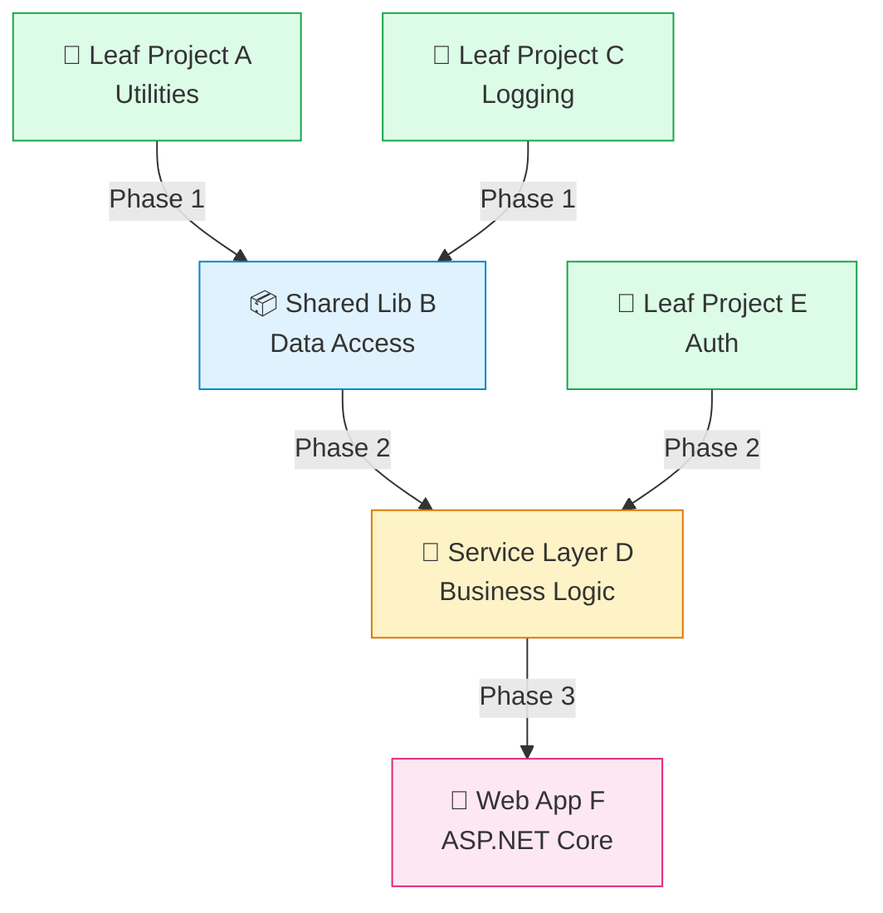

<!-- ═══════════════════════════════════════════════════════════
     SLIDE 1 — TITLE HERO                                ~1 min
     ═══════════════════════════════════════════════════════════ -->

  

    
    <a href="https://github.com/PlagueHO/plagueho.learn" target="_blank" class="hero-qr-url">github.com/PlagueHO/plagueho.learn</a>
  

  
AppMod MCP · Skills · Dependency Layers · /troubleshoot · Async Execution

  <h1 class="hero-heading">Agentic .NET AppMod</h1>
  

    What works, what doesn't and how to fix it — lessons from a week with the
    Microsoft .NET AppMod CAT team modernizing a <strong>10M LOC, 30-year-old app</strong>
    using <strong>AppMod MCP</strong>, <strong>dependency layers</strong>, and <strong>reusable skills</strong>.
  

  

    Daniel Scott-Raynsford (DSR)
    Sr. Partner Solution Architect · Cloud &amp; AI Apps · Microsoft EPS
    45 minutes · unplugged · demo-heavy
  

  

    

      <strong>🔧 Skills &gt; Prompts</strong>
      20+ skills built in 4 days
    

    

      <strong>📦 Break it down</strong>
      Dependency layers, leaf-first
    

    

      <strong>⚡ Go async</strong>
      Stop watching agents
    

    

      <strong>🔍 100× pattern</strong>
      /troubleshoot + update skill
    

  

<!--
Frame this as a candid, lessons-learned session — not a sizzle reel. Everything
here was earned over 4 days of real work on a real 10M LOC app with the
Microsoft AppMod CAT team. "We did it, we learned, we're sharing."
-->

---
transition: fade-out
---

<!-- ═══════════════════════════════════════════════════════════
     SLIDE 2 — ABOUT ME                                  ~1 min
     ═══════════════════════════════════════════════════════════ -->

  

    <h1>About Me</h1>
  

  

    

      

        

          
          
          
        

        daniel-scott-raynsford — Visual Studio Code Insiders
      

      

        
📄 about.json

        

      

      

        

          
1 2 3 4 5 6 7 8 9 10 11 12 13

          
{  "👤 name": "Daniel Scott-Raynsford",  "🏷️ alias": "PlagueHO",  "💼 role": "Partner Solution Architect",  "🏢 team": "Cloud &amp; AI Apps · Microsoft EPS",  "💻 origin": "Recovering software engineer",  "🔗 links": {  "🌐 web": <a href="https://danielscottraynsford.com" target="_blank" class="j-link">"danielscottraynsford.com"</a>,  "💼 linkedin": <a href="https://www.linkedin.com/in/dscottraynsford/" target="_blank" class="j-link">"linkedin.com/in/dscottraynsford"</a>,  "🐙 github": <a href="https://github.com/PlagueHO" target="_blank" class="j-link">"github.com/PlagueHO"</a>  }}

        

      

      

        ⎇ main
        ✓ GitHub Copilot
        JSON
        UTF-8
        Ln 12, Col 1
      

    

  

<!--
Keep this quick — 60 seconds max. Set the tone: this is a conversation, not
a lecture. Ask questions anytime. Demo-heavy. "I'm going to share things that
actually happened, not things I think should happen."
-->

---
transition: slide-up
---

<!-- ═══════════════════════════════════════════════════════════
     SLIDE 3 — AGENDA                                    ~30 sec
     ═══════════════════════════════════════════════════════════ -->

  

    

    

    

  

  

    
45 MINUTES · 4 LIVE DEMOS · UNPLUGGED

    <h1 class="agenda-title">Agenda</h1>
  

  

    <a href="/5" class="agenda-card agenda-card-1">
      

      01
      <h2>The Hard Truth</h2>
      
No sizzle reels — what large-scale AppMod actually looks like

    </a>
    <a href="/7" class="agenda-card agenda-card-2">
      

      02
      <h2>Toolchain &amp; Skills</h2>
      
VS Code Insiders, AppMod MCP, Skills &gt; Prompts

    </a>
    <a href="/10" class="agenda-card agenda-card-3">
      

      03
      <h2>Break It Down &amp; Go Async</h2>
      
Dependency layers, leaf-first, parallel execution

    </a>
    <a href="/14" class="agenda-card agenda-card-4">
      

      04
      <h2>Observability &amp; Playbook</h2>
      
The 100× pattern, tool wrangling, partner opportunity

    </a>
  

  

    <a href="/9" class="agenda-demo-pill">
      
      
        🎬 Demo 1
        Building Skills
      
    </a>
    <a href="/12" class="agenda-demo-pill">
      
      
        🎬 Demo 2
        Dependency Analysis
      
    </a>
    <a href="/13" class="agenda-demo-pill">
      
      
        🎬 Demo 3
        Async Execution
      
    </a>
    <a href="/16" class="agenda-demo-pill">
      
      
        🎬 Demo 4
        /troubleshoot &amp; 100×
      
    </a>
  

<!--
Quick scan of the agenda — don't dwell. Point out the 4 demo markers so
people know when we'll jump to live code. "This is an unplugged session —
ask questions anytime, challenge anything, let's make it a conversation."
-->

---
transition: fade-out
---

<!-- ═══════════════════════════════════════════════════════════
     SLIDE 4 — THE WORKSHOP CONTEXT                       ~2 min
     ═══════════════════════════════════════════════════════════ -->

  

    <h1>The Workshop Context</h1>
  

  

    

      <strong>"Completely game changing"</strong> — 4 days, all recorded, learnings we want every partner to have
    

    

      

        <h3>🏢 Who</h3>
        
<strong>Jay Schmelzer</strong> — Director, DevDiv CoreAI AppMod

        
<strong>Taylor Southwick</strong> — Principal Engineer, AppMod

        
<strong>Steve Hornblow</strong> &amp; <strong>DSR</strong> — Microsoft EPS hosts

      

      

        <h3>🎯 What</h3>
        
SDC engagement with partner a in New Zealand

        
Target: <strong>10M LOC, 30-year-old .NET application</strong>

        
Goal: realistic AppMod at enterprise scale using AI

      

      

        <h3>💡 Why This Talk</h3>
        
The AppMod CAT team brought techniques customers rarely see

        
We want <strong>every Agentic DevOps partner</strong> running workshops like this

        
These learnings are <strong>directly applicable</strong> to your customer engagements

      

    

  

<!--
Establish credibility — this isn't theoretical. We did it with the actual
Microsoft AppMod engineering team on a real 10M LOC application. Jay Schmelzer
runs the AppMod org. Taylor Southwick is the principal engineer building the
tooling. Everything in this talk comes from that week.
-->

---
transition: fade-out
---

<!-- ═══════════════════════════════════════════════════════════
     SLIDE 5 — THE HARD TRUTH                             ~4 min
     ═══════════════════════════════════════════════════════════ -->

  

    <h1>The Hard Truth About Large-Scale AppMod</h1>
  

  

    

      <strong>⚠️ From the AppMod CAT team:</strong> "We get frustrated with AppMod sizzle reels that show magic single-click AI-driven modernization. This is generally not the real and lived experience."
    

    

      

        

          <h3>❌ What Doesn't Work</h3>
          
"Single-click" AI AppMod for non-trivial apps

          
If your app is <strong>small enough for single-click</strong>, it's small enough to <strong>rebuild entirely with AI</strong>

          
Promising magic leads to <strong>disappointment</strong>

        

        

          <h3>✅ What Does Work</h3>
          
Follow <strong>standard .NET AppMod approach</strong> and techniques

          
Leverage AI to <strong>automate and make it repeatable</strong>

          
Break into <strong>phases with small, reviewable PRs</strong>

        

      

      

        

          <h3>📏 The Scale Threshold</h3>
          
<strong>&lt; 50K LOC</strong> — AI can probably handle most of it with guidance

          
<strong>50K–500K LOC</strong> — structured AI-assisted approach essential

          
<strong>500K+ LOC</strong> — multi-layer dependency planning, custom skills, incremental phases

        

        

          <strong>📺 Pre-requisite:</strong> You MUST understand standard .NET AppMod before starting. Auckland .NET User Group recording — <em>Modernizing ASP.NET Framework to Core in 2026</em>
        

      

    

  

<!--
This is the "what doesn't work" part of the title. Set expectations correctly.
The AppMod CAT team's own words: stop promising magic. If your customer has a
50K+ LOC app, single-click won't work. But structured AI-assisted modernization
is incredibly effective — that's the rest of this talk.
-->

---
transition: fade-out
---

<!-- ═══════════════════════════════════════════════════════════
     SLIDE 6 — THE RIGHT TOOLCHAIN                        ~3 min
     ═══════════════════════════════════════════════════════════ -->

  

    <h1>The Right Toolchain</h1>
  

  

    

      <strong>💬 Jay Schmelzer (Director, DevDiv CoreAI AppMod):</strong> "Everyone in DevDiv uses Insiders, no one uses stable. We recommend all customers use Insiders unless they have some compliance reason not to or are restricted from installing their own tools."
    

    

      

        <h3>💻 VS Code Insiders</h3>
        
AI Dev moves so fast that by the time a feature reaches Stable, <strong>the state of the art has moved on</strong>

        
When developers complain "Claude does X but GitHub doesn't" — <strong>it's because they're on old builds</strong>

      

      

        <h3>⬆️ Update Aggressively</h3>
        
Every day we started with an update

        
Solutions to <strong>yesterday's problems</strong> often arrived in <strong>today's update</strong>

        
New features appeared <strong>every single day</strong> that were beneficial

      

    

    

      

        <h3>📦 AppMod MCP NuGet</h3>
        
Use <code>Microsoft.GitHubCopilot.AppModernization.Mcp</code> NuGet package

        
This gives you access to the <strong>official App Mod tools and agents</strong>

      

      

        <h3>⚠️ Extension Hygiene</h3>
        
Multiple competing AppMod extensions from Microsoft — <strong>they confuse agents</strong>

        
<strong>Remove all</strong> AppMod extensions. Use <strong>only</strong> the NuGet MCP package.

        
We ran into far fewer issues this way

      

    

  

<!--
This is practical, day-1 advice. Before you write a single line of code, get
your toolchain right. Insiders + daily updates + AppMod MCP NuGet + remove
competing extensions. This alone eliminated half our issues in the first two days.
-->

---
transition: fade-out
---

<!-- ═══════════════════════════════════════════════════════════
     SLIDE 7 — SKILLS OVER PROMPTS                        ~5 min
     ═══════════════════════════════════════════════════════════ -->

  

    <h1>Skills Over Prompts — The Shift That Changed Everything</h1>
  

  

    

      

        

          <h3>📈 The Workshop Arc</h3>
          
<strong>Day 1:</strong> Engineers build prompts (familiar, comfortable)

          
<strong>Day 2:</strong> Prompts hit limits — skills emerge as better fit

          
<strong>Day 3–4:</strong> Team becomes a "Skill &amp; Agent factory"

          
<strong>End of week:</strong> 20+ skills, only ~2 prompts remain

        

        

          <strong>DevDiv note:</strong> "We expect prompts to fade away." Very few use cases where a skill isn't a better fit.
        

      

      

        

          <h3>🔄 The Skill Workflow</h3>
          
Use your <strong>agent conversation</strong> to construct and refine skills

          
Skills are repeatable process building blocks called by agents <strong>like tools</strong>

          
Once engineers felt comfortable, they <strong>amplified the entire team</strong> — "more repeatable and deterministic"

        

        

          <h3>🛠️ Key Tools</h3>
          
<a href="https://github.com/spboyer/sensei" target="_blank"><strong>Sensei</strong></a> — ensure agents select the correct skill

          
<a href="https://github.com/PlagueHO/plagueho.os/tree/main/.github/skills/skill-creator" target="_blank"><strong>Skill Creator</strong></a> — build skills correctly &amp; optimally

          
<a href="https://github.com/PlagueHO/plagueho.os/tree/main/.github/skills/convert-prompt-to-skill" target="_blank"><strong>Prompt → Skill</strong></a> — convert existing prompts

        

      

    

  

<!--
This is the core operating model shift. Skills are deterministic, portable,
discoverable. Prompts are throwaway. The workshop proved this over 4 days with
real engineers working on a real 10M LOC app.

Key insight: once engineers started building skills instead of prompts, they
became a factory — each skill amplified everyone on the team. This is the
multiplier effect.
-->

---
transition: fade-out
---

<!-- ═══════════════════════════════════════════════════════════
     SLIDE 8 — SKILLS DEEP DIVE: THE ECOSYSTEM            ~2 min
     ═══════════════════════════════════════════════════════════ -->

  

    <h1>The Skills Ecosystem</h1>
  

  

    

      

        <a class="pyramid-layer" href="https://code.visualstudio.com/docs/copilot/customization/custom-instructions" target="_blank" style="margin: 0 0; background: linear-gradient(90deg, #0a2e4a, #103954); text-decoration: none; cursor: pointer;">
          1
          Instructions
          Always-on repo/path conventions
        </a>
        <a class="pyramid-layer pyramid-layer-faded" href="https://code.visualstudio.com/docs/copilot/customization/prompt-files" target="_blank" style="margin: 0 0.5rem; background: linear-gradient(90deg, #114D8B, #1a5ea8); text-decoration: none; cursor: pointer;">
          2
          Prompts
          Fading away — convert to skills
        </a>
        <a class="pyramid-layer" href="https://code.visualstudio.com/docs/copilot/customization/mcp-servers" target="_blank" style="margin: 0 1.1rem; background: linear-gradient(90deg, #085f92, #0d83c0); text-decoration: none; cursor: pointer;">
          3
          MCP
          AppMod MCP NuGet — the core tooling
        </a>
        <a class="pyramid-layer" href="https://code.visualstudio.com/docs/copilot/customization/custom-agents" target="_blank" style="margin: 0 1.8rem; background: linear-gradient(90deg, #0c6484, #1088ac); text-decoration: none; cursor: pointer;">
          4
          Agents
          Specialist personas with tool scopes
        </a>
        <a class="pyramid-layer" href="https://code.visualstudio.com/docs/copilot/customization/agent-skills" target="_blank" style="margin: 0 2.7rem; background: linear-gradient(90deg, #077769, #08a08d); text-decoration: none; cursor: pointer;">
          5
          Skills
          ★ 20+ built during workshop
        </a>
        <a class="pyramid-layer" href="https://code.visualstudio.com/docs/copilot/customization/hooks" target="_blank" style="margin: 0 3.7rem; background: linear-gradient(90deg, #0a7f59, #0da977); text-decoration: none; cursor: pointer;">
          6
          Hooks
          Deterministic lifecycle commands
        </a>
        <a class="pyramid-layer" href="https://code.visualstudio.com/docs/copilot/customization/agent-plugins" target="_blank" style="margin: 0 4.8rem; background: linear-gradient(90deg, #5635a0, #7850c0); text-decoration: none; cursor: pointer;">
          7
          Plugins
          Package &amp; share via org marketplace
        </a>
      

    

    

      

        <h3>🧩 Skills = Repeatable Building Blocks</h3>
        
Each skill handles a specialized AppMod edge case. Agents call them like tools. <a href="https://agentskills.io/" target="_blank">agentskills.io</a> open standard.

      

      

        <h3>🏢 Organizational Marketplace</h3>
        
Package as <a href="https://code.visualstudio.com/docs/copilot/customization/agent-plugins" target="_blank">Agent Plugins</a>. Create a <strong>private marketplace</strong> for your org. Discoverability &amp; sharing at scale.

      

    

  

<!--
Show the 7-layer customization stack but highlight where the workshop focused:
Skills (layer 5) and MCP (layer 3) did 90% of the heavy lifting. Prompts
(layer 2) faded. Plugins (layer 7) are how you share everything with your org.
-->

---
transition: fade-out
---

<!-- ═══════════════════════════════════════════════════════════
     SLIDE 9 — DEMO 1: Building & Refining Skills         ~5 min
     ═══════════════════════════════════════════════════════════ -->

  
🔧

  <h1 class="demo-title">Demo 1: Building &amp; Refining Skills</h1>
  
From prompt to skill — the workflow the team used every day

  
🎬 ~5 minutes

  

    
▸ Start with a prompt that handles an AppMod edge case

    
▸ Convert it to a skill using convert-prompt-to-skill

    
▸ Run Sensei to validate skill quality &amp; routing

    
▸ Show the agent selecting the skill automatically

  

<!--
DEMO SCRIPT — Building & Refining Skills (~5 min)
═════════════════════════════════════════════════════════

SETUP: VS Code Insiders open with sample .NET app and .github/skills/ configured.

1. PROMPT → SKILL (2 min)
   - Show a prompt that handles a common AppMod edge case
   - Run: "convert this prompt to a skill"
   - Walk through the generated SKILL.md frontmatter
   - Point out: triggers, description, anti-triggers

2. SENSEI VALIDATION (1.5 min)
   - Run: "run sensei on the new skill"
   - Show before/after frontmatter improvements
   - Key message: "Sensei ensures agents route to the right skill"

3. LIVE ROUTING (1 min)
   - Chat: "modernize this WCF service"
   - Watch Copilot discover and select the skill automatically
   - Key message: "The skill IS the repeatable process"

4. WRAP (30 sec)
   - "By day 3, the team was a Skill & Agent factory.
     Each skill amplified everyone."
-->

---
transition: fade-out
---

<!-- ═══════════════════════════════════════════════════════════
     SLIDE 10 — BREAKING DOWN THE MONSTER                  ~5 min
     ═══════════════════════════════════════════════════════════ -->

  

    <h1>Breaking Down the Monster — Dependency Layers</h1>
  

  

    

      

        

          <strong>⚠️ A 10K LOC PR is unacceptable and will never get merged</strong> — AppMod stalls and never makes progress.
        

        

          <h3>📋 The Approach</h3>
          
<strong>1.</strong> Use AI AppMod tools to build a <strong>multi-layer dependency upgrade plan</strong>

          
<strong>2.</strong> Start at <strong>leaf projects</strong> — work up through the dependency tree

          
<strong>3.</strong> Each phase = <strong>working application + reviewable PR</strong>

          
<strong>4.</strong> Continuous small incremental change using AI tools, agents &amp; skills

        

      

      

        

      

    

  

<!--
This is the "how to fix it" part. The key insight: break the problem into
dependency layers, start at the leaves, keep PRs small. AI makes this
repeatable, not magical.

Walk through the Mermaid diagram: leaves (green) → shared libs (blue) →
services (orange) → web app (pink). Each arrow is a phase boundary.
Each phase produces a working app and a mergeable PR.
-->

---
transition: fade-out
---

<!-- ═══════════════════════════════════════════════════════════
     SLIDE 11 — DEMO 2: Dependency Analysis                ~5 min
     ═══════════════════════════════════════════════════════════ -->

  
📦

  <h1 class="demo-title">Demo 2: Dependency Analysis &amp; Upgrade Planning</h1>
  
Use AppMod MCP to build a multi-layer dependency upgrade plan

  
🎬 ~5 minutes

  

    
▸ Analyze the sample app's project dependency tree

    
▸ Generate a multi-layer upgrade plan (leaf-first)

    
▸ Show how each phase produces a reviewable PR

    
▸ Start modernizing a leaf project with AppMod MCP

  

<!--
DEMO SCRIPT — Dependency Analysis & Upgrade Planning (~5 min)
═════════════════════════════════════════════════════════════

SETUP: Sample .NET Framework solution open with multiple projects.
AppMod MCP NuGet installed.

1. DEPENDENCY ANALYSIS (2 min)
   - Chat: "Analyze the dependency tree of this solution and create a
     multi-layer upgrade plan starting from leaf projects"
   - Walk through the generated plan
   - Point out: leaf identification, phase boundaries, PR scope

2. LEAF MODERNIZATION (2 min)
   - Chat: "Modernize the utilities leaf project in Phase 1"
   - Watch AppMod MCP handle the conversion
   - Show the resulting changes are small and reviewable

3. WRAP (1 min)
   - "Each phase is a working app. Each PR is reviewable.
     The AI handles the repetitive work, you handle the review."
-->

---
transition: fade-out
---

<!-- ═══════════════════════════════════════════════════════════
     SLIDE 12 — GO ASYNC                                   ~4 min
     ═══════════════════════════════════════════════════════════ -->

  

    <h1>Go Async — Stop Watching Agents</h1>
  

  

    

      

        

          <h3>📈 The Confidence Curve</h3>
          
<strong>Day 1–2:</strong> Engineers watched every agent step. Slow, cautious, serial.

          
<strong>Day 3:</strong> Confidence builds. First attempts at parallelization.

          
<strong>Day 4:</strong> Firing off parallel tasks, reviewing results async. <strong>Massive acceleration.</strong>

        

        

          <strong>Key insight:</strong> It took 2–3 days to build confidence around async execution. The other practices in this talk (skills, dependency layers, /troubleshoot) are what enabled that confidence.
        

      

      

        

          <h3>⚡ Parallelization Tools</h3>
          
<strong>Agent Panel</strong> — multiple agent conversations

          
<strong>#runSubagent</strong> — delegate subtasks

          
<strong>Fleets</strong> — parallel task execution

          
<strong>Squads</strong> — coordinated multi-agent teams

        

        

          <h3>🏢 Agent Plugins</h3>
          
Package agentic assets as <a href="https://code.visualstudio.com/docs/copilot/customization/agent-plugins" target="_blank">Agent Plugins</a>

          
Create a <strong>private marketplace</strong> for your org

          
Discoverability &amp; sharing of capabilities at scale

        

      

    

  

<!--
The acceleration from async execution was dramatic. But it didn't happen on
day 1. Engineers needed the confidence that comes from skills (deterministic
behavior), dependency layers (bounded scope), and /troubleshoot (diagnosis when
things go wrong). Once those were in place, going async was natural.
-->

---
transition: fade-out
---

<!-- ═══════════════════════════════════════════════════════════
     SLIDE 13 — DEMO 3: Async Execution                   ~3 min
     ═══════════════════════════════════════════════════════════ -->

  
⚡

  <h1 class="demo-title">Demo 3: Async Parallel Execution</h1>
  
Fire off multiple AppMod tasks and stop watching — review results later

  
🎬 ~3 minutes

  

    
▸ Open multiple Agent Panel conversations

    
▸ Fire off parallel leaf project modernizations

    
▸ Switch away — do other work while agents run

    
▸ Come back and review completed results

  

<!--
DEMO SCRIPT — Async Parallel Execution (~3 min)
═════════════════════════════════════════════════

SETUP: Multiple leaf projects ready for modernization.

1. PARALLEL LAUNCH (1 min)
   - Open 2-3 Agent Panel conversations
   - In each: "Modernize leaf project X using the dependency upgrade plan"
   - Point out: each agent runs independently with its own context

2. ASYNC REVIEW (1.5 min)
   - Switch to a different task or show another feature
   - Come back and show all agents have completed
   - Review results — each produced a small, focused change

3. WRAP (30 sec)
   - "Day 4 looked like this. Fire and forget. Review and merge.
     The parallelization is where the 10× comes from."
-->

---
transition: fade-out
---

<!-- ═══════════════════════════════════════════════════════════
     SLIDE 14 — TOOL WRANGLING & WORKSPACE MCP             ~3 min
     ═══════════════════════════════════════════════════════════ -->

  

    <h1>Tool Wrangling &amp; Workspace MCP</h1>
  

  

    

      <strong>‍✈️ Tool Wrangling is a thing.</strong> A lot of times when things went wrong, it was because tools had become disabled/enabled by different agents.
    

    

      

        <h3>❌ What Goes Wrong</h3>
        
Different agents enable/disable different tools

        
Agents get confused when too many tools are available

        
MCP servers with different names across team members break consistency

      

      

        <h3>✅ How to Fix It</h3>
        
<strong>Rationalize tools:</strong> ensure agents have only what they need

        
<strong>Workspace MCPs:</strong> use <code>mcp.json</code> for consistent naming

        
<strong><a href="https://learn.microsoft.com/en-us/training/support/mcp" target="_blank">Microsoft Learn MCP</a></strong> is critical — but everyone must use the same server names

      

      

        <h3>🔑 Practical Tips</h3>
        
Commit <code>mcp.json</code> to the repo — workspace-level config

        
Remove all AppMod extensions — rely on NuGet MCP only

        
Check tool state before starting each session

        
Make tool wrangling a <strong>team discipline</strong>

      

    

  

<!--
This is one of the "what doesn't work" items that catches even experienced
teams. Tool wrangling is a real discipline. When things go wrong, check what
tools are enabled before looking at anything else.
-->

---
transition: fade-out
---

<!-- ═══════════════════════════════════════════════════════════
     SLIDE 15 — OBSERVABILITY & THE 100× PATTERN           ~5 min
     ═══════════════════════════════════════════════════════════ -->

  

    <h1>The 100× Pattern</h1>
  

  

    

      

        

          <h3>🔍 Chat Debug / /troubleshoot</h3>
          
Started the week as the <strong>most useful tool</strong> for understanding when/why AppMod MCP and skills "go astray"

          
On day 4, VS Code Insiders enabled enhanced Chat Debug — <strong>game changing!</strong>

        

        

          <h3>🔍 10×: /troubleshoot</h3>
          
/troubleshoot Why did you do X rather than Y?

          
Understand the agent's reasoning and diagnose mistakes

        

      

      

        

          <h3>🚀 100×: /troubleshoot + Update Skill</h3>
          
/troubleshoot Why did you do X rather than Y <strong>and then update Skill Z so you don't do that again?</strong>

          
The feedback loop that <strong>permanently fixes behavior</strong>:

          
<strong>Observe</strong> → <strong>Diagnose</strong> → <strong>Update Skill</strong> → <strong>Never happen again</strong>

        

        

          <strong>This is the most important operational pattern from the entire workshop.</strong> The 100× comes from compounding — every fix makes the system permanently smarter.
        

      

    

  

<!--
Build this progressively: /troubleshoot alone is 10× because you can diagnose.
Adding "and update the skill" makes it 100× because the fix is permanent.
Every time you close this loop, the system gets smarter. Over 4 days, the
team closed dozens of these loops — the cumulative effect was extraordinary.
-->

---
transition: fade-out
---

<!-- ═══════════════════════════════════════════════════════════
     SLIDE 16 — DEMO 4: /troubleshoot & 100× Pattern      ~5 min
     ═══════════════════════════════════════════════════════════ -->

  
🔍

  <h1 class="demo-title">Demo 4: /troubleshoot &amp; The 100× Pattern</h1>
  
Observe, diagnose, update the skill — permanently fix the behavior

  
🎬 ~5 minutes

  

    
▸ Trigger an AppMod task that makes a known mistake

    
▸ Use /troubleshoot to diagnose WHY

    
▸ Ask: "update Skill Z so you don't do that again"

    
▸ Re-run — show the behavior is permanently fixed

  

<!--
DEMO SCRIPT — /troubleshoot & The 100× Pattern (~5 min)
════════════════════════════════════════════════════════

SETUP: A skill that has a known edge case it handles incorrectly.

1. TRIGGER THE MISTAKE (1 min)
   - Run an AppMod task that hits the known edge case
   - Show the incorrect behavior in the output
   - "This is a real mistake we saw during the workshop"

2. DIAGNOSE WITH /TROUBLESHOOT (1.5 min)
   - Run: /troubleshoot why did you use X approach rather than Y?
   - Walk through the diagnosis output
   - Point out: the skill's instructions led to this choice

3. THE 100× FIX (2 min)
   - Ask: "Update the AppMod skill so you use Y approach instead of X
     for this type of case, and explain why in the skill"
   - Show the skill being updated with new instructions
   - Re-run the same task — show correct behavior

4. WRAP (30 sec)
   - "This loop is the 100× multiplier. Every fix is permanent.
     The team gets smarter every session."
-->

---
transition: fade-out
---

<!-- ═══════════════════════════════════════════════════════════
     SLIDE 17 — PARTNER PLAYBOOK                           ~3 min
     ═══════════════════════════════════════════════════════════ -->

  

    <h1>What To Do Now — Partner Playbook</h1>
  

  

    

      

        <h3>💻 1. VS Code Insiders + Daily Updates</h3>
        
Non-negotiable. Install today, update every morning.

      

      

        <h3>📦 2. Install AppMod MCP NuGet</h3>
        
<code>Microsoft.GitHubCopilot.AppModernization.Mcp</code> — remove competing extensions.

      

      

        <h3>🔧 3. Convert Prompts to Skills</h3>
        
Start immediately. Use Sensei to validate. Build a skill library.

      

      

        <h3>📋 4. Dependency-Layer Plan First</h3>
        
Build the upgrade plan before touching code. Leaf-first, small PRs.

      

      

        <h3>⚡ 5. Go Async</h3>
        
Agent Panel, subagents, fleets — stop watching agents.

      

      

        <h3>🔍 6. Implement the 100× Pattern</h3>
        
/troubleshoot → diagnose → update skill → permanent fix.

      

      

        <h3>🏢 7. Build an Org Plugin Marketplace</h3>
        
Share skills, agents, MCPs across your organization.

      

      

        <h3>🎓 8. Run This Workshop</h3>
        
Run this format with your customers. Huge partner opportunity.

      

    

  

<!--
This is the actionable checklist. Each item maps to a section they just saw.
Emphasize that this entire approach is teachable and repeatable — that's why
item 8 is "run this workshop with your customers."
-->

---
transition: fade-out
---

<!-- ═══════════════════════════════════════════════════════════
     SLIDE 18 — KEY TAKEAWAYS                              ~2 min
     ═══════════════════════════════════════════════════════════ -->

  

    <h1>Key Takeaways</h1>
  

  

    

      

        1
        
<strong>There is no single-click AppMod for real apps.</strong> Stop promising it. Start structuring it. Follow standard .NET AppMod, then automate with AI.

      

      

        2
        
<strong>Skills &gt; Prompts.</strong> The team that builds skills accelerates the entire org. 20+ skills in 4 days. DevDiv expects prompts to fade away.

      

      

        3
        
<strong>Break the monster into layers.</strong> Leaf-first dependency planning. Small PRs. Always shippable. A 10K LOC PR will never get merged.

      

      

        4
        
<strong>Go async or go home.</strong> Parallelization is where the 10× comes from. It takes 2–3 days to build confidence — the other practices enable it.

      

      

        5
        
<strong>Close the feedback loop.</strong> /troubleshoot + skill update = 100× compounding improvement. Every fix makes the system permanently smarter.

      

    

  

<!--
Progressive reveal — build each takeaway one click at a time.
These five principles map directly to the workshop experience. They're
battle-tested on a 10M LOC app with the Microsoft AppMod CAT team.
-->

---
transition: fade-out
---

<!-- ═══════════════════════════════════════════════════════════
     SLIDE 19 — CHEAT SHEET (photographable reference card)
     ═══════════════════════════════════════════════════════════ -->

  

    <h1>📸 Cheat Sheet — Photograph This!</h1>
  

  

    

      

        

          <h3>1. No magic single-click</h3>
          
Standard .NET AppMod approach + AI automation. Break into phases, leaf-first, small PRs. <strong>Structure, not sizzle.</strong>

        

        

          <h3>2. Skills &gt; Prompts</h3>
          
Convert prompts to skills. Validate with Sensei. Build an org skill library. <strong>Deterministic, portable, discoverable.</strong>

        

        

          <h3>3. Dependency layers</h3>
          
Multi-layer upgrade plan. Start at leaves. Each phase = working app + mergeable PR. <strong>Never a 10K LOC PR.</strong>

        

      

      

        

          <h3>4. Go async</h3>
          
Agent Panel, subagents, fleets. Stop watching. Confidence builds over days, not hours. <strong>Parallelization = 10×.</strong>

        

        

          <h3>5. The 100× pattern</h3>
          
/troubleshoot → diagnose → update skill → permanent fix. Every loop makes the system smarter. <strong>Compounding improvement.</strong>

        

        

          <strong>Start here: </strong>
          <a href="https://www.nuget.org/packages/Microsoft.GitHubCopilot.AppModernization.Mcp">AppMod MCP NuGet</a> ·
          <a href="https://github.com/spboyer/sensei">Sensei</a> ·
          <a href="https://agentskills.io/">agentskills.io</a> ·
          <a href="https://code.visualstudio.com/docs/copilot/customization/agent-plugins">Agent Plugins</a> ·
          <a href="https://learn.microsoft.com/en-us/training/support/mcp">MS Learn MCP</a>
        

      

    

  

<!--
This is the "photograph this" slide — pause here and let people take photos.
Condensed reference card of the 5 principles plus key links. Everything they
need to get started after the session.
-->

---
transition: fade-out
---

<!-- ═══════════════════════════════════════════════════════════
     SLIDE 20 — THE PARTNER OPPORTUNITY                    ~2 min
     ═══════════════════════════════════════════════════════════ -->

  

    <h1>The Partner Opportunity</h1>
  

  

    

      <strong>I've seen many customers exclaim that they're experts and extremely capable with AI Dev</strong> — yet I've seen few of them implementing any of the above practices at scale. Their capabilities are often <strong>months out of date</strong> — and when it comes to the rate of Agentic AI change, <strong>months = years</strong>.
    

    

      

        <h3>🎓 Workshop-as-a-Service</h3>
        
Run this workshop format with your customers

        
4-day format with the AppMod tools and techniques from this talk

        
Reusable skill libraries and demo apps included

        
<strong>Huge differentiation opportunity for partners</strong>

      

      

        <h3>📈 Customer Impact</h3>
        
Level up customers from "months behind" to current best practices

        
Build organizational skill libraries that compound over time

        
Establish plugin marketplaces for enterprise-wide sharing

        
<strong>AppMod-as-a-service using agentic tools</strong>

      

    

  

<!--
The call to action for partners: this is your opportunity to differentiate.
You can run this workshop format. The tools and skills are reusable. Your
customers NEED this — most of them are months behind on agentic practices
and don't know it.
-->

---
layout: center
class: text-center
---

<!-- ═══════════════════════════════════════════════════════════
     SLIDE 21 — THANK YOU / Q&A                           ~5 min
     ═══════════════════════════════════════════════════════════ -->

  <h1 style="font-size: 2.8rem;">Thank You!</h1>
  

    Questions? Let's go deeper on anything — or I can spin up a live demo on the spot.
  

  

    <a href="https://github.com/PlagueHO" target="_blank">GitHub</a>
    <a href="https://danielscottraynsford.com" target="_blank">Website</a>
    <a href="https://github.com/PlagueHO/plagueho.learn" target="_blank">Slides Source</a>
  

  

    

      
Key Links

      

        <a href="https://www.nuget.org/packages/Microsoft.GitHubCopilot.AppModernization.Mcp" target="_blank" style="color: rgba(255,255,255,0.85);">AppMod MCP NuGet</a> ·
        <a href="https://github.com/spboyer/sensei" target="_blank" style="color: rgba(255,255,255,0.85);">Sensei</a> ·
        <a href="https://agentskills.io/" target="_blank" style="color: rgba(255,255,255,0.85);">agentskills.io</a> ·
        <a href="https://code.visualstudio.com/docs/copilot/customization/agent-plugins" target="_blank" style="color: rgba(255,255,255,0.85);">Agent Plugins</a> ·
        <a href="https://learn.microsoft.com/en-us/training/support/mcp" target="_blank" style="color: rgba(255,255,255,0.85);">MS Learn MCP</a> ·
        <a href="https://github.com/PlagueHO/plagueho.learn" target="_blank" style="color: rgba(255,255,255,0.85);">Slides Source</a>
      

    

  

<!--
Open for questions. Offer to walk through any demo in more detail.
Encourage partners to reach out about running workshops for their customers.
-->
