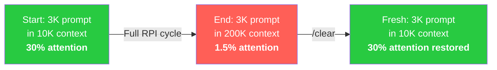

<!-- ═══════════════════════════════════════════════════════════
     SLIDE 1 — TITLE HERO
     ═══════════════════════════════════════════════════════════ -->

<div class="hero-shell">
  <p class="eyebrow">HVE · HVE-Core · RPI · GitHub Copilot</p>
  <h1 class="hero-heading">Hypervelocity<br />Engineering</h1>
  <p class="hero-sub">
    From Concept to Code with <strong>HVE-Core</strong> — a 90-minute deep dive into disciplined
    AI-assisted engineering, the <strong>RPI workflow</strong>, and practical tooling that turns
    uncertainty into verified, traceable, production-quality outcomes.
  </p>

  <div class="hero-meta">
    <span>Daniel Scott-Raynsford (DSR)</span>
    <span>Sr. Partner Solution Architect · Cloud &amp; AI Apps · Microsoft EPS</span>
    <span>90 min · Engineers &amp; Architects · Demo-heavy</span>
  </div>

  <div class="hero-badge-grid">
    <div class="badge-card">
      <strong>🧠 HVE Concepts</strong>
      <span>Principles &amp; pillars</span>
    </div>
    <div class="badge-card">
      <strong>🛠️ HVE-Core</strong>
      <span>Agents, collections, lifecycle</span>
    </div>
    <div class="badge-card">
      <strong>🔬 RPI Workflow</strong>
      <span>Research → Plan → Implement → Review</span>
    </div>
    <div class="badge-card">
      <strong>🎬 Live Demos</strong>
      <span>Soup-to-nuts app build</span>
    </div>
  </div>
</div>

<!--
Welcome everyone. This is a 90-minute session split into two halves.
First 30 minutes covers HVE as a concept — why it exists and what it means.
Last 60 minutes is hands-on with HVE-Core: we'll do a full RPI workflow
building a real app, then look at GitHub Backlog Manager.
This is demo-heavy by design.
-->

---
transition: fade-out
---

<!-- ═══════════════════════════════════════════════════════════
     SLIDE 2 — ABOUT ME (VS Code window)
     ═══════════════════════════════════════════════════════════ -->

<div class="absolute inset-0 flex flex-col" style="background: var(--theme-bg-cool);">
  <div class="slide-banner">
    <h1>About Me</h1>
  </div>
  <div style="flex:1;display:flex;align-items:stretch;padding:0.65rem 1.35rem 0.75rem;min-height:0;">
    <div class="vscode-window">
      <div class="vscode-titlebar">
        <div class="vscode-dots">
          <span class="dot dot-red"></span>
          <span class="dot dot-yellow"></span>
          <span class="dot dot-green"></span>
        </div>
        <span class="vscode-wintitle">daniel-scott-raynsford — Visual Studio Code Insiders</span>
      </div>
      <div class="vscode-tabbar">
        <div class="vscode-tab vscode-tab-json"><span>📄</span> about.json</div>
        <div style="flex:1;background:#252526;"></div>
      </div>
      <div class="vscode-editor-area">
        <div class="vscode-editor-pane">
          <div class="vscode-line-nums">1<br>2<br>3<br>4<br>5<br>6<br>7<br>8<br>9<br>10<br>11<br>12<br>13</div>
          <div class="vscode-code-content"><span class="type-line" style="--li:0;"><span class="j-brace">{</span></span><span class="type-line" style="--li:1;">  <span class="j-key">"👤 name"</span><span class="j-colon">:</span> <span class="j-str">"Daniel Scott-Raynsford"</span><span class="j-punc">,</span></span><span class="type-line" style="--li:2;">  <span class="j-key">"🏷️ alias"</span><span class="j-colon">:</span> <span class="j-str">"PlagueHO"</span><span class="j-punc">,</span></span><span class="type-line" style="--li:3;">  <span class="j-key">"💼 role"</span><span class="j-colon">:</span> <span class="j-str">"Partner Solution Architect"</span><span class="j-punc">,</span></span><span class="type-line" style="--li:4;">  <span class="j-key">"🏢 team"</span><span class="j-colon">:</span> <span class="j-str">"Cloud &amp; AI Apps · Microsoft EPS"</span><span class="j-punc">,</span></span><span class="type-line" style="--li:5;">  <span class="j-key">"💻 origin"</span><span class="j-colon">:</span> <span class="j-str">"Recovering software engineer"</span><span class="j-punc">,</span></span><span class="type-line" style="--li:6;">  <span class="j-key">"🔗 links"</span><span class="j-colon">:</span> <span class="j-brace">{</span></span><span class="type-line" style="--li:7; padding-left: 2ch;">  <span class="j-key">"🌐 web"</span><span class="j-colon">:</span> <a href="https://danielscottraynsford.com" target="_blank" class="j-link">"danielscottraynsford.com"</a><span class="j-punc">,</span></span><span class="type-line" style="--li:8; padding-left: 2ch;">  <span class="j-key">"💼 linkedin"</span><span class="j-colon">:</span> <a href="https://www.linkedin.com/in/dscottraynsford/" target="_blank" class="j-link">"linkedin.com/in/dscottraynsford"</a><span class="j-punc">,</span></span><span class="type-line" style="--li:9; padding-left: 2ch;">  <span class="j-key">"🐙 github"</span><span class="j-colon">:</span> <a href="https://github.com/PlagueHO" target="_blank" class="j-link">"github.com/PlagueHO"</a></span><span class="type-line" style="--li:10;">  <span class="j-brace">}</span></span><span class="type-line" style="--li:11;"><span class="j-brace">}</span><span class="cs-cursor"></span></span></div>
        </div>
      </div>
      <div class="vscode-statusbar">
        <span>⎇ main</span>
        <span>✓ GitHub Copilot</span>
        <span style="margin-left:auto;">JSON</span>
        <span>UTF-8</span>
        <span>Ln 12, Col 1</span>
      </div>
    </div>
  </div>
</div>

<!--
Quick intro — 60 seconds max.
Recovering software engineer, now focused on helping engineering teams
adopt AI-assisted practices at scale.
-->

---
transition: slide-up
---

<!-- ═══════════════════════════════════════════════════════════
     SLIDE 3 — AGENDA
     ═══════════════════════════════════════════════════════════ -->

<div class="agenda-shell">
  <div class="agenda-orbs-layer">
    <div class="agenda-orb agenda-orb-1"></div>
    <div class="agenda-orb agenda-orb-2"></div>
    <div class="agenda-orb agenda-orb-3"></div>
  </div>

  <div class="agenda-header">
    <p class="agenda-eyebrow">90 MINUTES · 2 LIVE DEMOS</p>
    <h1 class="agenda-title">Agenda</h1>
  </div>

  <div class="agenda-grid">
    <a href="/5" class="agenda-card agenda-card-1">
      <div class="agenda-card-accent"></div>
      <span class="agenda-num">01</span>
      <h2>The AI Engineering Problem</h2>
      <p>Why speed without rigor is dangerous</p>
    </a>
    <a href="/6" class="agenda-card agenda-card-2">
      <div class="agenda-card-accent"></div>
      <span class="agenda-num">02</span>
      <h2>What is HVE?</h2>
      <p>Four pillars, principles, fundamentals</p>
    </a>
    <a href="/10" class="agenda-card agenda-card-3">
      <div class="agenda-card-accent"></div>
      <span class="agenda-num">03</span>
      <h2>HVE-Core Overview</h2>
      <p>Collections, lifecycle, roles, tooling</p>
    </a>
    <a href="/16" class="agenda-card agenda-card-4">
      <div class="agenda-card-accent"></div>
      <span class="agenda-num">04</span>
      <h2>RPI Deep Dive &amp; Demos</h2>
      <p>The methodology that makes AI reliable</p>
    </a>
  </div>

  <div class="agenda-demos">
    <a href="/20" class="agenda-demo-pill">
      <span class="agenda-demo-pulse"></span>
      <span class="agenda-demo-text">
        <span class="agenda-demo-num">🎬 Demo 1</span>
        <span class="agenda-demo-desc">RPI Soup-to-Nuts — Build a Node.js CLI</span>
      </span>
    </a>
    <a href="/28" class="agenda-demo-pill">
      <span class="agenda-demo-pulse"></span>
      <span class="agenda-demo-text">
        <span class="agenda-demo-num">🎬 Demo 2</span>
        <span class="agenda-demo-desc">GitHub Backlog Manager in action</span>
      </span>
    </a>
  </div>
</div>

<!--
Quick scan of the agenda. Part 1 is concepts (30 min), Part 2 is hands-on (60 min).
The RPI demo is the centerpiece — 20 minutes of live workflow.
-->

---
transition: fade-out
---

<!-- ═══════════════════════════════════════════════════════════
     SLIDE 4 — PART 1 SECTION DIVIDER: Why HVE?
     ═══════════════════════════════════════════════════════════ -->

<div class="absolute inset-0 flex flex-col">
  <div class="slide-banner">
    <h1>Part 1 — Why HVE?</h1>
  </div>
  <div class="slide-body" style="flex-direction: column; gap: 1.2rem; align-items: center; justify-content: center;">
    <div class="hero-quote">
      <span class="hero-quote-emoji">⚡</span>
      <span>The most dangerous outcome of AI-assisted engineering isn't bad code — it's <em>solving the wrong problem faster than ever before.</em></span>
    </div>
    <p style="color: var(--theme-muted); font-size: 0.92rem; max-width: 40rem; text-align: center;">
      30 minutes on the principles, pillars, and tooling foundation of Hypervelocity Engineering.
    </p>
  </div>
</div>

<!--
Set the tone. This isn't about AI being bad — it's about AI being fast and
confidently wrong without the right guardrails.
-->

---
transition: fade-out
---

<!-- ═══════════════════════════════════════════════════════════
     SLIDE 5 — THE AI ENGINEERING PROBLEM
     ═══════════════════════════════════════════════════════════ -->

<div class="absolute inset-0 flex flex-col" style="background: var(--theme-bg-cool);">
  <div class="slide-banner">
    <h1>The AI Engineering Problem</h1>
  </div>
  <div class="slide-body" style="flex-direction:column;align-items:stretch;">
    <div class="scenario-banner">
      <span>The gap isn't model quality — it's process quality.</span>
    </div>
    <div class="comparison-grid" style="width:100%;">
      <div class="comparison-col before">
        <span class="comparison-label before">😰 Vibe Coding</span>
        <ul class="dense-list" style="font-size: 0.82rem;">
          <li v-click>AI writes first, thinks never</li>
          <li v-click>Invents <em>plausible</em> patterns instead of verified ones</li>
          <li v-click>No traceability — "the AI wrote it this way"</li>
          <li v-click>Tribal knowledge stays in your head</li>
          <li v-click>Frequent rework when assumptions fail</li>
          <li v-click>Solving the wrong problem faster</li>
        </ul>
      </div>
      <div class="comparison-col after" v-click>
        <span class="comparison-label after">🎯 Disciplined AI Engineering</span>
        <ul class="dense-list" style="font-size: 0.82rem;">
          <li>Research before implementing</li>
          <li>Uses verified existing patterns with file/line citations</li>
          <li>Full traceability through research documents</li>
          <li>Knowledge transfer through artifacts</li>
          <li>Rare rework — assumptions are validated</li>
          <li>Solving the <strong>right</strong> problems with confidence</li>
        </ul>
      </div>
    </div>
  </div>
</div>

<!--
AI coding assistants can't tell the difference between investigating and
implementing. When you ask for code, they write code — without verifying
patterns match existing modules or APIs actually exist.
This is the fundamental problem HVE addresses.
-->

---
transition: fade-out
---

<!-- ═══════════════════════════════════════════════════════════
     SLIDE 6 — WHAT IS HVE?
     ═══════════════════════════════════════════════════════════ -->

<div class="absolute inset-0 flex flex-col" style="background: var(--theme-bg-cool);">
  <div class="slide-banner">
    <h1>What is Hypervelocity Engineering?</h1>
  </div>
  <div class="slide-body" style="flex-direction: column; gap: 0.55rem; align-items: stretch; padding: 0.4rem 1.8rem 0.8rem;">
    <p style="font-size: 1.1rem; color: var(--theme-ink); margin: 0;">
      A <strong>practical way of working</strong> to deliver high-value AI outcomes — not a product, not a framework, a set of principles and practices.
    </p>
    <ul class="dense-list">
      <li v-click>Focuses on <strong>right problems, right context, right people</strong>, and responsible AI</li>
      <li v-click>Originated from Microsoft ISE (Industry Solutions Engineering) field experience</li>
      <li v-click>Applies to <strong>any engineering team</strong>, not just FDE/ISE</li>
      <li v-click>Not a replacement for existing processes — an evolution of how teams work with AI</li>
      <li v-click>Key distinction: <strong>HVE = the methodology</strong>; <strong>HVE-Core = the tooling</strong> that operationalizes it</li>
    </ul>
    <div class="callout" v-click>
      HVE is about disciplined speed — going fast <em>and</em> going right. The four pillars coming next are the structural foundation.
    </div>
  </div>
</div>

<!--
Emphasize that HVE is a way of working, not a product.
It emerged from real project delivery at Microsoft ISE.
The tooling (HVE-Core) came later to codify these practices.
-->

---
transition: fade-out
---

<!-- ═══════════════════════════════════════════════════════════
     SLIDE 7 — FOUR PILLARS OF HVE
     ═══════════════════════════════════════════════════════════ -->

<div class="absolute inset-0 flex flex-col">
  <div class="slide-banner">
    <h1>The Four Pillars of HVE</h1>
  </div>
  <div class="slide-body" style="flex-direction:column;gap:0.4rem;align-items:stretch;">
    <div class="section-grid">
      <div class="section-card" v-click>
        <span class="section-number">01</span>
        <h2>Multidisciplinary Teams</h2>
        <p>Tight teams with deep domain expertise — developers, designers, PMs, security architects, data scientists. The "crew model."</p>
      </div>
      <div class="section-card" v-click>
        <span class="section-number">02</span>
        <h2>Design Thinking</h2>
        <p>Focused on business value, not technology features. Understand the problem before building the solution. Human-centered design.</p>
      </div>
      <div class="section-card" v-click>
        <span class="section-number">03</span>
        <h2>Production-Ready Starting Points</h2>
        <p>HVE Accelerators — proven, battle-tested templates and patterns. Don't start from scratch; start from something that works.</p>
      </div>
      <div class="section-card" v-click>
        <span class="section-number">04</span>
        <h2>AI Agents &amp; Tools</h2>
        <p>AI across the full lifecycle — research, planning, implementation, review, backlog management, security assessment, documentation.</p>
      </div>
    </div>
    <div class="callout-teal callout" style="text-align:center;" v-click>
      Pillar 4 (AI tooling) only works because Pillars 1-3 provide the right team, problem, and starting point.
    </div>
  </div>
</div>

<!--
Walk through each pillar. Without the right team (P1), problem (P2),
and starting point (P3), even the best AI tooling (P4)
will produce the wrong outcome faster.
-->

---
transition: fade-out
---

<!-- ═══════════════════════════════════════════════════════════
     SLIDE 8 — PRINCIPLES IN ACTION
     ═══════════════════════════════════════════════════════════ -->

<div class="absolute inset-0 flex flex-col" style="background: var(--theme-bg-cool);">
  <div class="slide-banner">
    <h1>Principles in Action</h1>
  </div>
  <div class="slide-body" style="flex-direction: column; gap: 0.5rem; align-items: stretch; padding: 0.5rem 1.8rem 0.8rem;">
    <div class="section-grid">
      <div class="section-card" v-click>
        <span class="section-number">🔄</span>
        <h2>Iterate in Small Steps</h2>
        <p>Small, verifiable increments. Each step produces a testable artifact. This is why RPI breaks work into separate phases.</p>
      </div>
      <div class="section-card" v-click>
        <span class="section-number">✅</span>
        <h2>Validate and Verify</h2>
        <p>Don't assume AI output is correct. Check against reality. This is why the Task Reviewer exists as a separate agent.</p>
      </div>
      <div class="section-card" v-click>
        <span class="section-number">💎</span>
        <h2>Prioritize Business Value</h2>
        <p>Every engineering decision ties back to a business outcome. Outcome-driven metrics from day one — not story points.</p>
      </div>
      <div class="section-card" v-click>
        <span class="section-number">🔒</span>
        <h2>Embed Security &amp; Quality</h2>
        <p>Not bolted on at the end. Security, observability, and responsible AI are woven into every phase of the lifecycle.</p>
      </div>
    </div>
    <p style="text-align:center;color:var(--theme-muted);font-size:0.85rem;margin:0;" v-click>
      Also: <strong>Include users in the team</strong> · <strong>Leverage team expertise</strong>
    </p>
  </div>
</div>

<!--
These principles sound obvious, but they're the ones most often violated
when teams adopt AI tooling without discipline.
-->

---
transition: fade-out
---

<!-- ═══════════════════════════════════════════════════════════
     SLIDE 9 — ENGINEERING FUNDAMENTALS & MEASURING SUCCESS
     ═══════════════════════════════════════════════════════════ -->

<div class="absolute inset-0 flex flex-col" style="background: var(--theme-bg-cool);">
  <div class="slide-banner">
    <h1>Fundamentals &amp; Measuring Success</h1>
  </div>
  <div class="slide-body" style="flex-direction:column;gap:0.45rem;align-items:stretch;justify-content:flex-start;">
    <div class="three-col-grid">
      <div class="section-card" v-click>
        <span class="section-number">Foundation</span>
        <h2>Engineering Fundamentals</h2>
        <ul class="dense-list" style="font-size: 0.82rem;">
          <li>Security, observability, responsible AI embedded throughout</li>
          <li>Automated testing, monitoring, governance</li>
          <li>AI + accelerators reduce cost of fundamentals</li>
        </ul>
      </div>
      <div class="section-card" v-click>
        <span class="section-number">Metrics</span>
        <h2>Measuring Success</h2>
        <ul class="dense-list" style="font-size: 0.82rem;">
          <li>Outcome-driven metrics from day one</li>
          <li>Avoid activity without impact</li>
          <li>Measure business value delivered</li>
        </ul>
      </div>
      <div class="section-card" v-click>
        <span class="section-number">Pitfalls</span>
        <h2>What to Avoid</h2>
        <ul class="dense-list" style="font-size: 0.82rem;">
          <li>❌ Bolt AI onto Scrum and call it done</li>
          <li>❌ Skip research, jump to implementation</li>
          <li>✅ Rebuild processes around AI capabilities</li>
        </ul>
      </div>
    </div>
    <div class="model-warning-callout" v-click>
      <span class="model-warning-icon">💡</span>
      <span class="model-warning-text"><strong>When AI handles boilerplate</strong> (tests, docs, CI config), teams can afford engineering fundamentals they previously skipped due to time pressure.</span>
    </div>
  </div>
</div>

<!--
The cost reduction point is key. AI handling boilerplate means teams can
afford proper fundamentals. The pitfalls column transitions us to HVE-Core —
the tooling that prevents these anti-patterns.
-->

---
transition: fade-out
---

<!-- ═══════════════════════════════════════════════════════════
     SLIDE 10 — HVE-CORE: THE TOOLING LAYER
     ═══════════════════════════════════════════════════════════ -->

<div class="absolute inset-0 flex flex-col" style="background: var(--theme-bg-cool);">
  <div class="slide-banner">
    <h1>HVE-Core: The Tooling Layer</h1>
  </div>
  <div class="slide-body" style="flex-direction: column; gap: 0.55rem; align-items: stretch; padding: 0.4rem 1.8rem 0.8rem;">
    <p style="font-size: 1.1rem; color: var(--theme-ink); margin: 0;">
      <strong>AI-Driven Software Development Across the Full Lifecycle</strong>
    </p>
    <ul class="dense-list">
      <li v-click>Production-ready <strong>agents, prompts, coding instructions, and skills</strong> for GitHub Copilot</li>
      <li v-click>Structured workflows (<strong>RPI</strong>), schema-enforced quality gates, role-specific tooling</li>
      <li v-click>Covers <strong>10 engineering roles</strong> across a <strong>9-stage project lifecycle</strong></li>
      <li v-click>Install from VS Code Marketplace: <code>ise-hve-essentials.hve-core</code></li>
      <li v-click>Two options: <strong>HVE Core All</strong> (221 artifacts) or <strong>HVE Installer</strong> (selective)</li>
      <li v-click>Open source: <a href="https://github.com/microsoft/hve-core" target="_blank">github.com/microsoft/hve-core</a></li>
    </ul>
    <div class="callout" v-click>
      Everything we've discussed as principles (HVE) is now operationalized as tooling (HVE-Core). It enhances GitHub Copilot with structured workflows — not a separate product.
    </div>
  </div>
</div>

<!--
This is the bridge slide. HVE principles become HVE-Core tooling.
The extension installs agents, prompts, instructions, and skills
directly into your GitHub Copilot environment.
-->

---
transition: fade-out
---

<!-- ═══════════════════════════════════════════════════════════
     SLIDE 11 — COLLECTIONS
     ═══════════════════════════════════════════════════════════ -->

<div class="absolute inset-0 flex flex-col" style="background: var(--theme-bg-cool);">
  <div class="slide-banner">
    <h1>Collections — Domain-Specific Bundles</h1>
  </div>
  <div class="slide-body" style="flex-direction: column; gap: 0.55rem; align-items: stretch; padding: 0.4rem 1.8rem 0.8rem;">
    <table style="width:100%;font-size:0.8rem;">
      <tr><th>Collection</th><th>Status</th><th>Artifacts</th><th>Purpose</th></tr>
      <tr v-click><td><strong>hve-core</strong></td><td>🟢 STABLE</td><td>40</td><td>RPI workflow, planning, implementation</td></tr>
      <tr v-click><td>coding-standards</td><td>🟢 STABLE</td><td>22</td><td>Language-specific conventions</td></tr>
      <tr v-click><td>github</td><td>🟢 STABLE</td><td>13</td><td>Issue backlogs and triage</td></tr>
      <tr v-click><td>project-planning</td><td>🟢 STABLE</td><td>48</td><td>ADRs, requirements, architecture</td></tr>
      <tr v-click><td>design-thinking</td><td>🟡 PREVIEW</td><td>58</td><td>AI-enhanced Design Thinking</td></tr>
      <tr v-click><td>security</td><td>🔬 EXPERIMENTAL</td><td>48</td><td>Security review &amp; incident response</td></tr>
      <tr v-click><td>ado</td><td>🟢 STABLE</td><td>21</td><td>Azure DevOps integration</td></tr>
      <tr v-click><td>data-science</td><td>🟢 STABLE</td><td>18</td><td>Data specs and notebooks</td></tr>
      <tr v-click><td>rai-planning</td><td>🔬 EXPERIMENTAL</td><td>12</td><td>Responsible AI assessment</td></tr>
    </table>
    <div class="callout" v-click>
      Collections are additive — start with <strong>hve-core</strong> for RPI, add <strong>github</strong> for backlog management, add <strong>security</strong> when ready. Don't adopt everything at once.
    </div>
  </div>
</div>

<!--
hve-core (40 artifacts) is the foundation — that's where RPI lives.
Collections let teams adopt incrementally.
-->

---
transition: fade-out
---

<!-- ═══════════════════════════════════════════════════════════
     SLIDE 12 — AI-ASSISTED PROJECT LIFECYCLE
     ═══════════════════════════════════════════════════════════ -->

<div class="absolute inset-0 flex flex-col" style="background: var(--theme-bg-cool);">
  <div class="slide-banner">
    <h1>AI-Assisted Project Lifecycle</h1>
  </div>
  <div class="slide-body" style="flex-direction: column; gap: 0.8rem; align-items: stretch; padding: 0.6rem 1.8rem 0.8rem;">
    <div class="flow-pipeline" style="justify-content: center; gap: 0.35rem; flex-wrap: wrap;">
      <div class="flow-step" v-click>1️⃣ Setup</div>
      <span class="flow-arrow">→</span>
      <div class="flow-step" v-click>2️⃣ Discovery</div>
      <span class="flow-arrow">→</span>
      <div class="flow-step" v-click>3️⃣ Product Def</div>
      <span class="flow-arrow">→</span>
      <div class="flow-step" v-click>4️⃣ Decompose</div>
      <span class="flow-arrow">→</span>
      <div class="flow-step" v-click>5️⃣ Sprint Plan</div>
      <span class="flow-arrow">→</span>
      <div class="flow-step flow-step-active" v-click>6️⃣ Implement</div>
      <span class="flow-arrow">→</span>
      <div class="flow-step" v-click>7️⃣ Review</div>
      <span class="flow-arrow">→</span>
      <div class="flow-step" v-click>8️⃣ Delivery</div>
      <span class="flow-arrow">→</span>
      <div class="flow-step" v-click>9️⃣ Operations</div>
    </div>
    <div style="display: flex; gap: 0.65rem; align-items: stretch;">
      <div class="card" style="flex: 1;" v-click>
        <h3>Stage 6 — Implementation</h3>
        <p>30 artifacts (35% of all assignments). This is where RPI lives — and where most AI-assisted work happens.</p>
      </div>
      <div class="card" style="flex: 1;" v-click>
        <h3>Rework Loops</h3>
        <p>Review → Implementation, Delivery → next sprint, Operations → Discovery. Built-in iteration paths.</p>
      </div>
      <div class="card" style="flex: 1;" v-click>
        <h3>Each Stage Has Agents</h3>
        <p>From task-researcher in Discovery to doc-ops in Operations. AI tooling spans the full lifecycle.</p>
      </div>
    </div>
  </div>
</div>

<!--
The lifecycle is the structural backbone.
Stage 6 (Implementation) is the largest concentration of tooling —
that's where RPI lives and where the most can go wrong without structure.
-->

---
transition: fade-out
---

<!-- ═══════════════════════════════════════════════════════════
     SLIDE 13 — 10 ENGINEERING ROLES
     ═══════════════════════════════════════════════════════════ -->

<div class="absolute inset-0 flex flex-col" style="background: var(--theme-bg-cool);">
  <div class="slide-banner">
    <h1>10 Engineering Roles</h1>
  </div>
  <div class="slide-body" style="flex-direction: column; gap: 0.55rem; align-items: stretch; padding: 0.4rem 1.8rem 0.8rem;">
    <p style="font-size: 0.95rem; color: var(--theme-ink); margin: 0;">
      Each role gets curated agents, prompts, stage walkthroughs, and collaboration patterns.
    </p>
    <div class="section-grid" style="grid-template-columns: repeat(5, minmax(0, 1fr));">
      <div class="section-card" style="padding:0.6rem;" v-click><h2 style="font-size:0.9rem;">👨‍💻 Engineer</h2></div>
      <div class="section-card" style="padding:0.6rem;" v-click><h2 style="font-size:0.9rem;">📋 TPM</h2></div>
      <div class="section-card" style="padding:0.6rem;" v-click><h2 style="font-size:0.9rem;">🏗️ Tech Lead</h2></div>
      <div class="section-card" style="padding:0.6rem;" v-click><h2 style="font-size:0.9rem;">🔐 Security Arch</h2></div>
      <div class="section-card" style="padding:0.6rem;" v-click><h2 style="font-size:0.9rem;">📊 Data Scientist</h2></div>
      <div class="section-card" style="padding:0.6rem;" v-click><h2 style="font-size:0.9rem;">⚙️ SRE/Ops</h2></div>
      <div class="section-card" style="padding:0.6rem;" v-click><h2 style="font-size:0.9rem;">💼 Biz PM</h2></div>
      <div class="section-card" style="padding:0.6rem;" v-click><h2 style="font-size:0.9rem;">🆕 New Contrib</h2></div>
      <div class="section-card" style="padding:0.6rem;" v-click><h2 style="font-size:0.9rem;">🎨 UX Designer</h2></div>
      <div class="section-card" style="padding:0.6rem;" v-click><h2 style="font-size:0.9rem;">🔧 Utility</h2></div>
    </div>
    <div class="callout" v-click>
      <strong>HVE isn't just for developers</strong> — it's for the entire engineering team. A Security Architect gets different agents than an Engineer.
    </div>
  </div>
</div>

<!--
Quick slide — don't dwell. The role model means each role
gets different agents and workflows.
-->

---
transition: fade-out
---

<!-- ═══════════════════════════════════════════════════════════
     SLIDE 14 — TRANSITION TO PART 2
     ═══════════════════════════════════════════════════════════ -->

<div class="absolute inset-0 flex flex-col">
  <div class="slide-banner">
    <h1>The Key Insight</h1>
  </div>
  <div class="slide-body" style="flex-direction: column; gap: 1.2rem; align-items: center; justify-content: center;">
    <div class="hero-quote">
      <span class="hero-quote-emoji">🧠</span>
      <span>The solution isn't teaching AI to be smarter. It's <em>preventing AI from doing certain things at certain times.</em></span>
    </div>
    <p style="color: var(--theme-muted); font-size: 0.92rem; max-width: 40rem; text-align: center;">
      Part 2 — Let's see how this works in practice with RPI, live demos, and GitHub Backlog Manager.
    </p>
  </div>
</div>

<!--
The counterintuitive insight: you make AI better by giving it less freedom.
When the Task Researcher knows it cannot implement, it stops optimizing for
"plausible code" and starts optimizing for "verified truth."
Now let's go hands-on.
-->

---
transition: fade-out
---

<!-- ═══════════════════════════════════════════════════════════
     SLIDE 15 — PART 2 SECTION DIVIDER: RPI
     ═══════════════════════════════════════════════════════════ -->

<div class="absolute inset-0 flex flex-col">
  <div class="slide-banner">
    <h1>Part 2 — RPI Deep Dive</h1>
  </div>
  <div class="slide-body" style="flex-direction: column; gap: 1.2rem; align-items: center; justify-content: center;">
    <div class="hero-quote">
      <span class="hero-quote-emoji">🔬</span>
      <span>Research → Plan → Implement → Review</span>
    </div>
    <p style="color: var(--theme-muted); font-size: 0.92rem; max-width: 40rem; text-align: center;">
      Transforming uncertainty into verified, traceable, production-quality code.
    </p>
  </div>
</div>

<!--
We're now in the hands-on half. Everything from here is about
how RPI actually works and why it produces better outcomes.
-->

---
transition: fade-out
---

<!-- ═══════════════════════════════════════════════════════════
     SLIDE 16 — WHY RPI WORKS
     ═══════════════════════════════════════════════════════════ -->

<div class="absolute inset-0 flex flex-col" style="background: var(--theme-bg-cool);">
  <div class="slide-banner">
    <h1>Why RPI Works — The Core Insight</h1>
  </div>
  <div class="slide-body" style="flex-direction:column;align-items:stretch;">
    <div class="comparison-grid" style="width:100%;">
      <div class="comparison-col before">
        <span class="comparison-label before">Without RPI</span>
        <ul class="dense-list" style="font-size: 0.8rem;">
          <li v-click>"This looks like a reasonable variable name. I'll use <code>prefix</code>."</li>
          <li v-click>Invents plausible patterns</li>
          <li v-click>"The AI wrote it this way" — no traceability</li>
          <li v-click>Frequent rework</li>
        </ul>
      </div>
      <div class="comparison-col after" v-click>
        <span class="comparison-label after">With RPI</span>
        <ul class="dense-list" style="font-size: 0.8rem;">
          <li>Task Researcher finds: <em>"12 existing modules use <code>resource_prefix</code>, not <code>prefix</code>. See <code>variables.tf#L47</code>."</em></li>
          <li>Uses verified existing patterns</li>
          <li>Every decision traced to files and line numbers</li>
          <li>Rare rework</li>
        </ul>
      </div>
    </div>
    <table style="width:100%;font-size:0.75rem;margin-top:0.4rem;" v-click>
      <tr><th>Aspect</th><th>Without RPI</th><th>With RPI</th></tr>
      <tr><td>Pattern matching</td><td>Invents plausible</td><td>Uses verified existing</td></tr>
      <tr><td>Traceability</td><td>"The AI wrote it"</td><td>"Research cites lines 47-52"</td></tr>
      <tr><td>Knowledge transfer</td><td>Tribal knowledge</td><td>Research docs anyone follows</td></tr>
      <tr><td>Rework</td><td>Frequent</td><td>Rare</td></tr>
    </table>
  </div>
</div>

<!--
The prefix vs resource_prefix example is the killer anecdote.
When constrained to research-only mode, the AI actually reads
the codebase and finds existing patterns.
-->

---
transition: fade-out
---

<!-- ═══════════════════════════════════════════════════════════
     SLIDE 17 — THE FOUR PHASES OF RPI
     ═══════════════════════════════════════════════════════════ -->

<div class="absolute inset-0 flex flex-col" style="background: var(--theme-bg-cool);">
  <div class="slide-banner">
    <h1>The Four Phases of RPI</h1>
  </div>
  <div class="slide-body" style="flex-direction: column; gap: 0.6rem; align-items: stretch; padding: 0.6rem 1.8rem 0.8rem;">
    <div class="flow-pipeline" style="justify-content: center; gap: 0.5rem;">
      <div class="flow-step" v-click>🔍 Research</div>
      <span class="flow-arrow" style="color:var(--theme-accent);">/clear →</span>
      <div class="flow-step" v-click>📋 Plan</div>
      <span class="flow-arrow" style="color:var(--theme-accent);">/clear →</span>
      <div class="flow-step flow-step-active" v-click>⚡ Implement</div>
      <span class="flow-arrow" style="color:var(--theme-accent);">/clear →</span>
      <div class="flow-step" v-click>✅ Review</div>
    </div>
    <div style="display: flex; gap: 0.5rem; align-items: stretch;">
      <div class="card" style="flex: 1;" v-click>
        <h3>🔍 Research</h3>
        <p style="font-size:0.78rem;">Task Researcher investigates codebase, APIs, docs. Documents with evidence. ONE recommended approach.<br><code>→ research.md</code></p>
      </div>
      <div class="card" style="flex: 1;" v-click>
        <h3>📋 Plan</h3>
        <p style="font-size:0.78rem;">Task Planner creates phased checklist linked to research with line numbers.<br><code>→ plan.instructions.md + details.md</code></p>
      </div>
      <div class="card" style="flex: 1;" v-click>
        <h3>⚡ Implement</h3>
        <p style="font-size:0.78rem;">Task Implementor executes plan task by task. Tracks changes. Stop controls for review.<br><code>→ code + changes.md</code></p>
      </div>
      <div class="card" style="flex: 1;" v-click>
        <h3>✅ Review</h3>
        <p style="font-size:0.78rem;">Task Reviewer validates against specs. Runs lint/build/test. Identifies follow-up work.<br><code>→ review.md</code></p>
      </div>
    </div>
    <div class="model-warning-callout" v-click>
      <span class="model-warning-icon">⚠️</span>
      <span class="model-warning-text"><strong>Critical rule: Clear context between phases</strong> — <code>/clear</code> or new chat. Artifacts carry context through files, not chat history.</span>
    </div>
  </div>
</div>

<!--
Walk through each phase. The /clear between phases is context engineering.
Each agent has different instructions; accumulated context causes drift.
The artifacts carry context through files on disk.
-->

---
transition: fade-out
---

<!-- ═══════════════════════════════════════════════════════════
     SLIDE 18 — CONTEXT ENGINEERING
     ═══════════════════════════════════════════════════════════ -->

<div class="absolute inset-0 flex flex-col">
  <div class="slide-banner">
    <h1>Context Engineering — Why /clear Matters</h1>
  </div>
  <div class="slide-body" style="flex-direction: column; gap: 0.6rem; align-items: center; justify-content: center;">



  <div style="display: flex; gap: 0.65rem; max-width: 52rem;">
    <div class="card" style="flex: 1;" v-click>
      <h3>Signs of Degradation</h3>
      <ul class="dense-list" style="font-size:0.78rem;">
        <li>Agent skips phases</li>
        <li>Ignores system prompt</li>
        <li>Output quality drops</li>
      </ul>
    </div>
    <div class="card" style="flex: 1;" v-click>
      <h3>/clear vs /compact</h3>
      <ul class="dense-list" style="font-size:0.78rem;">
        <li><code>/clear</code>: Between phases (always)</li>
        <li><code>/compact</code>: Mid-phase when long</li>
        <li>Artifacts persist on disk either way</li>
      </ul>
    </div>
  </div>
  </div>
</div>

<!--
Technical explanation for why RPI uses separate agents and context clearing.
The model's attention gives less weight to system instructions as context grows.
Clearing between phases restores each agent's instructions to full strength.
-->

---
transition: fade-out
---

<!-- ═══════════════════════════════════════════════════════════
     SLIDE 19 — WHEN TO USE RPI
     ═══════════════════════════════════════════════════════════ -->

<div class="absolute inset-0 flex flex-col" style="background: var(--theme-bg-cool);">
  <div class="slide-banner">
    <h1>When to Use RPI</h1>
  </div>
  <div class="slide-body" style="flex-direction:column;align-items:stretch;">
    <div class="comparison-grid" style="width:100%;">
      <div class="comparison-col after">
        <span class="comparison-label after">✅ Use RPI</span>
        <ul class="dense-list" style="font-size: 0.82rem;">
          <li v-click>Changes span multiple files</li>
          <li v-click>Learning new patterns or APIs</li>
          <li v-click>External dependencies involved</li>
          <li v-click>Requirements are unclear</li>
          <li v-click>Team needs knowledge transfer</li>
        </ul>
      </div>
      <div class="comparison-col before">
        <span class="comparison-label before">⏭️ Skip RPI</span>
        <ul class="dense-list" style="font-size: 0.82rem;">
          <li v-click>Fixing a typo</li>
          <li v-click>Adding a log statement</li>
          <li v-click>Refactoring &lt; 50 lines</li>
          <li v-click>Change is obvious and self-contained</li>
        </ul>
      </div>
    </div>
    <div class="callout" style="text-align:center;" v-click>
      <strong>Rule of thumb:</strong> <em>"If you need to understand something before implementing, use RPI."</em>
    </div>
    <div class="card" style="margin-top:0.3rem;" v-click>
      <h3>Strict RPI vs rpi-agent</h3>
      <p style="font-size:0.8rem;"><strong>Strict RPI</strong>: Deep research, no context contamination, complete audit trail. Best for complex/team work.<br>
      <strong>rpi-agent</strong>: Moderate research, inline, summary only. Best for simple/solo work.<br>
      <em>Start with rpi-agent; escalate to strict when complexity appears.</em></p>
    </div>
  </div>
</div>

<!--
Be honest about when RPI is overkill. The rule of thumb is the key message.
Many teams start with rpi-agent and escalate to strict RPI when they hit complexity.
-->

---
transition: fade-out
---

<!-- ═══════════════════════════════════════════════════════════
     SLIDE 20 — DEMO 1 TITLE
     ═══════════════════════════════════════════════════════════ -->

<div class="demo-shell">
  <div class="demo-icon">🔬</div>
  <h1 class="demo-title">Demo: RPI Soup-to-Nuts</h1>
  <p class="demo-subtitle">Build a Node.js CLI tool with the full Research → Plan → Implement → Review cycle</p>

  <div class="demo-badge">🎬 ~20 minutes</div>

  <div class="demo-checklist">
    <div class="demo-item"><span class="check">▸</span> Task Researcher investigates GitHub API, CLI frameworks, patterns</div>
    <div class="demo-item"><span class="check">▸</span> /clear → Task Planner creates phased implementation plan</div>
    <div class="demo-item"><span class="check">▸</span> /clear → Task Implementor builds the app following the plan</div>
    <div class="demo-item"><span class="check">▸</span> /clear → Task Reviewer validates against research and plan</div>
  </div>

  <p style="color: rgba(255,255,255,0.4); font-size: 0.75rem; margin-top: 0.8rem;">
    Building: <code>gh-repo-stats</code> — fetches GitHub repository statistics and displays in a formatted table
  </p>
</div>

<!--
DEMO SCRIPT:
We're building a real (small) app from scratch using the full RPI cycle.
Watch for: (1) how the Task Researcher discovers real patterns,
(2) the quality of plan output with line references,
(3) how the Implementor follows the plan systematically,
(4) Review catching anything missed.
-->

---
transition: fade-out
---

<!-- ═══════════════════════════════════════════════════════════
     SLIDE 21 — DEMO 1: RESEARCH PHASE
     ═══════════════════════════════════════════════════════════ -->

<div class="absolute inset-0 flex flex-col" style="background: var(--theme-bg-cool);">
  <div class="slide-banner">
    <h1>Demo 1 — Research Phase</h1>
  </div>
  <p class="slide-subtitle">Task Researcher: Investigating, Not Guessing</p>
</div>

<div style="position:absolute;top:150px;left:50px;right:660px;bottom:90px;">
<div class="code-card-title">Invoke Task Researcher</div>
<div class="code-panel-header">
  <span class="code-panel-lang">Copilot Chat</span>
  <span class="code-panel-file">VS Code</span>
</div>

```bash
/task-research Create a Node.js CLI tool that
  fetches GitHub repo stats (stars, forks, issues,
  top contributors) and displays them in a
  formatted terminal table. Use GitHub REST API
  without authentication for public repos.
```

</div>

<div style="position:absolute;top:150px;left:660px;right:50px;bottom:90px;">
<div class="code-card-title">Output → research.md</div>
<div class="code-panel-header">
  <span class="code-panel-lang">Markdown</span>
  <span class="code-panel-file">.copilot-tracking/research/</span>
</div>

```markdown
## Recommended Approach
- GitHub REST API: /repos/{owner}/{repo}
- CLI framework: Commander.js (most adopted)
- Table formatting: cli-table3
- Rate limit: 60 req/hr unauthenticated

## Evidence
- Commander.js: 25K+ GitHub stars, active
- cli-table3: Used in 12 existing projects
- API response shape verified at...
```

</div>

<div style="position:absolute;left:50px;right:50px;bottom:30px;">
  <div class="callout" style="font-size: 0.82rem; padding: 0.55rem 0.9rem;">
    The researcher works <strong>autonomously for 20-60 minutes</strong> — investigating, documenting with evidence, and recommending ONE approach per scenario.
  </div>
</div>

<!--
LIVE DEMO: Let the audience see the researcher work.
Point out specific line references and file citations.
Show the research.md artifact — this persists long after the chat ends.
-->

---
transition: fade-out
---

<!-- ═══════════════════════════════════════════════════════════
     SLIDE 22 — DEMO 1: PLAN PHASE
     ═══════════════════════════════════════════════════════════ -->

<div class="absolute inset-0 flex flex-col" style="background: var(--theme-bg-cool);">
  <div class="slide-banner">
    <h1>Demo 1 — Plan Phase</h1>
  </div>
  <p class="slide-subtitle">Task Planner: Sequencing, Not Improvising</p>
</div>

<div style="position:absolute;top:150px;left:50px;right:660px;bottom:90px;">
<div class="code-card-title">Invoke Task Planner</div>
<div class="code-panel-header">
  <span class="code-panel-lang">Copilot Chat</span>
  <span class="code-panel-file">VS Code (after /clear)</span>
</div>

```bash
# Step 1: Clear context
/clear

# Step 2: Switch to Task Planner
/task-plan
```

</div>

<div style="position:absolute;top:150px;left:660px;right:50px;bottom:90px;">
<div class="code-card-title">Output → plan.instructions.md</div>
<div class="code-panel-header">
  <span class="code-panel-lang">Markdown</span>
  <span class="code-panel-file">.copilot-tracking/plans/</span>
</div>

```markdown
## Phase 1: Project Setup
- [ ] Initialize npm project
- [ ] Install commander, cli-table3, node-fetch
  → See details.md#L12-L18

## Phase 2: GitHub API Client
- [ ] Create src/github-client.js
  → See research.md#L24 for API shape
- [ ] Implement fetchRepoStats()
- [ ] Implement fetchContributors()

## Phase 3: CLI Entry Point
- [ ] Create cli.js with Commander
  → See research.md#L31 for args
```

</div>

<div style="position:absolute;left:50px;right:50px;bottom:30px;">
  <div class="callout" style="font-size: 0.82rem; padding: 0.55rem 0.9rem;">
    The planner <strong>validates research exists</strong> before proceeding — it won't plan without evidence. Line references create the traceability chain: Plan → Research → Source.
  </div>
</div>

<!--
LIVE DEMO: Point out that the planner validates research exists.
Show the checkbox structure — this is what the Implementor follows.
The line references are the traceability chain.
-->

---
transition: fade-out
---

<!-- ═══════════════════════════════════════════════════════════
     SLIDE 23 — DEMO 1: IMPLEMENT PHASE
     ═══════════════════════════════════════════════════════════ -->

<div class="absolute inset-0 flex flex-col" style="background: var(--theme-bg-cool);">
  <div class="slide-banner">
    <h1>Demo 1 — Implement Phase</h1>
  </div>
  <p class="slide-subtitle">Task Implementor: Following, Not Inventing</p>
</div>

<div style="position:absolute;top:150px;left:50px;right:660px;bottom:90px;">
<div class="code-card-title">Invoke Task Implementor</div>
<div class="code-panel-header">
  <span class="code-panel-lang">Copilot Chat</span>
  <span class="code-panel-file">VS Code (after /clear)</span>
</div>

```bash
# Clear context again
/clear

# Switch to Task Implementor
/task-implement

# Implementor reads plan phase by phase
# Pauses at phase stops (phaseStop=true)
# Tracks all changes in changes.md
```

</div>

<div style="position:absolute;top:150px;left:660px;right:50px;bottom:90px;">
<div class="code-card-title">Run the Result</div>
<div class="code-panel-header">
  <span class="code-panel-lang">Terminal</span>
  <span class="code-panel-file">~/gh-repo-stats</span>
</div>

```bash
$ node cli.js --repo microsoft/hve-core

┌──────────────┬──────────┐
│ Metric       │ Value    │
├──────────────┼──────────┤
│ ⭐ Stars     │ 1,247    │
│ 🍴 Forks     │ 183      │
│ 🐛 Issues    │ 42       │
│ 👥 Contrib.  │ 28       │
└──────────────┴──────────┘
Top contributors: user1, user2, user3
```

</div>

<div style="position:absolute;left:50px;right:50px;bottom:30px;">
  <div class="callout" style="font-size: 0.82rem; padding: 0.55rem 0.9rem;">
    The Implementor follows the plan <strong>systematically</strong> — no improvisation. Every change is tracked in <code>changes.md</code>. Phase stops provide governance checkpoints.
  </div>
</div>

<!--
LIVE DEMO: Key moment — the Implementor follows the plan rather than improvising.
Point out the changes log. Show the working CLI tool.
The code follows patterns identified in research, not invented ones.
-->

---
transition: fade-out
---

<!-- ═══════════════════════════════════════════════════════════
     SLIDE 24 — DEMO 1: REVIEW PHASE
     ═══════════════════════════════════════════════════════════ -->

<div class="absolute inset-0 flex flex-col" style="background: var(--theme-bg-cool);">
  <div class="slide-banner">
    <h1>Demo 1 — Review Phase</h1>
  </div>
  <p class="slide-subtitle">Task Reviewer: Validating, Not Assuming</p>
</div>

<div style="position:absolute;top:150px;left:50px;right:660px;bottom:90px;">
<div class="code-card-title">Invoke Task Reviewer</div>
<div class="code-panel-header">
  <span class="code-panel-lang">Copilot Chat</span>
  <span class="code-panel-file">VS Code (after /clear)</span>
</div>

```bash
# Clear context one final time
/clear

# Switch to Task Reviewer
/task-review

# Reviewer validates against:
# - Research findings
# - Plan specifications
# - Coding conventions
# - Lint/build/test results
```

</div>

<div style="position:absolute;top:150px;left:660px;right:50px;bottom:90px;">
<div class="code-card-title">Output → review.md</div>
<div class="code-panel-header">
  <span class="code-panel-lang">Markdown</span>
  <span class="code-panel-file">.copilot-tracking/changes/</span>
</div>

```markdown
## Review Summary
Status: ✅ COMPLETE

## Findings
- [✅] API patterns match research#L24
- [✅] Commander.js usage per research#L31
- [✅] Error handling covers rate limits
- [⚠️] Consider adding --format flag
  (nice-to-have, not blocking)

## Iteration Path
→ Complete — ready to commit

## Handoff Options
📋 Create follow-up plan for --format
⚡ Commit changes
```

</div>

<div style="position:absolute;left:50px;right:50px;bottom:30px;">
  <div class="callout" style="font-size: 0.82rem; padding: 0.55rem 0.9rem;">
    The Review phase checks against <strong>actual research findings</strong> — not just "does it work" but "does it match what we learned." Handoff buttons make iteration loops seamless.
  </div>
</div>

<!--
LIVE DEMO: Show the reviewer checking against research findings.
The handoff buttons make it easy to loop back if needed.
-->

---
transition: fade-out
---

<!-- ═══════════════════════════════════════════════════════════
     SLIDE 25 — RPI RECAP
     ═══════════════════════════════════════════════════════════ -->

<div class="absolute inset-0 flex flex-col" style="background: var(--theme-bg-cool);">
  <div class="slide-banner">
    <h1>RPI Recap — What Just Happened</h1>
  </div>
  <div class="slide-body" style="flex-direction: column; gap: 0.6rem; align-items: stretch; padding: 0.6rem 1.8rem 0.8rem;">
    <div class="flow-pipeline" style="justify-content: center; gap: 0.5rem;">
      <div class="flow-step">🔍 Research</div>
      <span class="flow-arrow">→</span>
      <div class="flow-step">📋 Plan</div>
      <span class="flow-arrow">→</span>
      <div class="flow-step">⚡ Implement</div>
      <span class="flow-arrow">→</span>
      <div class="flow-step">✅ Review</div>
    </div>
    <div style="display: flex; gap: 0.5rem; align-items: stretch;">
      <div class="card" style="flex: 1;">
        <h3>Artifacts Persist</h3>
        <p style="font-size:0.78rem;">All outputs live in <code>.copilot-tracking/</code> — knowledge transfer, audit trail, onboarding material. These outlive the chat session.</p>
      </div>
      <div class="card" style="flex: 1;">
        <h3>Quick Start Commands</h3>
        <p style="font-size:0.78rem;"><code>/task-research &lt;topic&gt;</code><br><code>/task-plan</code><br><code>/task-implement</code><br><code>/task-review</code></p>
      </div>
      <div class="card" style="flex: 1;">
        <h3>Session Persistence</h3>
        <p style="font-size:0.78rem;">💾 Save → resume with <code>/checkpoint continue</code>. Perfect for multi-day workflows.</p>
      </div>
    </div>
    <div class="callout" style="text-align:center;">
      <strong>The paradigm shift:</strong> Stop asking AI <em>"Write this code."</em> Start asking <em>"Help me research, plan, then implement with evidence."</em>
    </div>
  </div>
</div>

<!--
Brief recap. Emphasize the artifact chain as the lasting value.
These files outlive the chat session and serve as documentation,
onboarding material, and audit trail.
-->

---
transition: fade-out
---

<!-- ═══════════════════════════════════════════════════════════
     SLIDE 26 — GITHUB BACKLOG MANAGER
     ═══════════════════════════════════════════════════════════ -->

<div class="absolute inset-0 flex flex-col" style="background: var(--theme-bg-cool);">
  <div class="slide-banner">
    <h1>GitHub Backlog Manager</h1>
  </div>
  <div class="slide-body" style="flex-direction: column; gap: 0.55rem; align-items: stretch; padding: 0.4rem 1.8rem 0.8rem;">
    <p style="font-size: 1rem; color: var(--theme-ink); margin: 0;">
      Automates issue lifecycle management across GitHub repositories with <strong>five workflows</strong>.
    </p>
    <div style="display: flex; gap: 0.5rem; align-items: stretch;">
      <div class="card" style="flex: 1;" v-click>
        <h3>1. Discovery</h3>
        <p style="font-size:0.75rem;">Finds &amp; categorizes issues from multiple sources — user-centric, artifact-driven, search-based</p>
      </div>
      <div class="card" style="flex: 1;" v-click>
        <h3>2. Triage</h3>
        <p style="font-size:0.75rem;">17-label taxonomy, priority assessment, duplicate detection (4-aspect similarity)</p>
      </div>
      <div class="card" style="flex: 1;" v-click>
        <h3>3. Sprint Planning</h3>
        <p style="font-size:0.75rem;">Organizes triaged issues into milestones with capacity awareness (6-step discovery)</p>
      </div>
      <div class="card" style="flex: 1;" v-click>
        <h3>4. Execution</h3>
        <p style="font-size:0.75rem;">Creates/updates/closes issues via handoff files, tracks operations with checkboxes</p>
      </div>
      <div class="card" style="flex: 1;" v-click>
        <h3>5. Quick Add</h3>
        <p style="font-size:0.75rem;">Single-issue shortcut for filing one issue with standard labels &amp; milestone</p>
      </div>
    </div>
    <div class="card" v-click>
      <h3>Autonomy Levels</h3>
      <p style="font-size:0.8rem;"><strong>Full</strong>: All auto · <strong>Partial</strong> (default): Gates on create/close · <strong>Manual</strong>: Gates on everything. Teams tune how much control they retain vs. delegate.</p>
    </div>
  </div>
</div>

<!--
The Backlog Manager handles the full issue lifecycle — from discovering
what needs to be done through organizing sprints to managing GitHub issues.
The autonomy levels are the governance layer.
-->

---
transition: fade-out
---

<!-- ═══════════════════════════════════════════════════════════
     SLIDE 27 — WHEN TO USE BACKLOG MANAGER
     ═══════════════════════════════════════════════════════════ -->

<div class="absolute inset-0 flex flex-col" style="background: var(--theme-bg-cool);">
  <div class="slide-banner">
    <h1>GitHub Backlog Manager — When to Use</h1>
  </div>
  <div class="slide-body" style="flex-direction:column;align-items:stretch;">
    <div class="comparison-grid" style="width:100%;">
      <div class="comparison-col after">
        <span class="comparison-label after">✅ Good Fit</span>
        <ul class="dense-list" style="font-size: 0.85rem;">
          <li v-click>Managing 20+ open issues</li>
          <li v-click>Multiple contributors need consistent triage</li>
          <li v-click>Sprint planning requires milestones &amp; capacity</li>
          <li v-click>Cross-repo issue discovery needed</li>
        </ul>
      </div>
      <div class="comparison-col before">
        <span class="comparison-label before">⏭️ Not Needed</span>
        <ul class="dense-list" style="font-size: 0.85rem;">
          <li v-click>Fewer than 10 issues</li>
          <li v-click>Single maintainer with full context</li>
          <li v-click>No milestone-based planning</li>
          <li v-click>All issues from a single source</li>
        </ul>
      </div>
    </div>
    <div class="callout" style="text-align:center;" v-click>
      Sweet spot: teams with <strong>20-100 open issues</strong> across one or more repos where manual triage is a bottleneck.
    </div>
  </div>
</div>

<!--
Be honest about scope. The Backlog Manager shines at scale.
For small repos with a single maintainer, it's overkill.
-->

---
transition: fade-out
---

<!-- ═══════════════════════════════════════════════════════════
     SLIDE 28 — DEMO 2 TITLE
     ═══════════════════════════════════════════════════════════ -->

<div class="demo-shell">
  <div class="demo-icon">📋</div>
  <h1 class="demo-title">Demo: GitHub Backlog Manager</h1>
  <p class="demo-subtitle">Automated issue lifecycle — Discovery, Triage, Sprint Planning, and Quick Add</p>

  <div class="demo-badge">🎬 ~8 minutes</div>

  <div class="demo-checklist">
    <div class="demo-item"><span class="check">▸</span> Discovery: Agent scans repo for issues from multiple sources</div>
    <div class="demo-item"><span class="check">▸</span> Triage: 17-label taxonomy applied with priority assessment</div>
    <div class="demo-item"><span class="check">▸</span> Sprint Planning: Milestone assignment with capacity awareness</div>
    <div class="demo-item"><span class="check">▸</span> Quick Add: Single issue creation shortcut</div>
  </div>
</div>

<!--
DEMO SCRIPT:
Show Backlog Manager workflows in VS Code using a real GitHub repo.
Highlight autonomy level controls (Partial default — gates on create/close).
-->

---
transition: fade-out
---

<!-- ═══════════════════════════════════════════════════════════
     SLIDE 29 — DEMO 2: LIVE
     ═══════════════════════════════════════════════════════════ -->

<div class="absolute inset-0 flex flex-col" style="background: var(--theme-bg-cool);">
  <div class="slide-banner">
    <h1>Demo 2 — GitHub Backlog Manager Live</h1>
  </div>
  <p class="slide-subtitle">Discovery → Triage → Sprint Planning → Quick Add</p>
</div>

<div style="position:absolute;top:150px;left:50px;right:660px;bottom:90px;">
<div class="code-card-title">Backlog Manager Workflows</div>
<div class="code-panel-header">
  <span class="code-panel-lang">Copilot Chat</span>
  <span class="code-panel-file">VS Code</span>
</div>

```bash
# Discovery — find issues from all sources
@github-backlog-manager discover issues

# Triage — categorize and prioritize
@github-backlog-manager triage

# Sprint Planning — organize into milestones
@github-backlog-manager plan sprint

# Quick Add — file a single issue
@github-backlog-manager quick-add
  "Add rate limit retry logic"
```

</div>

<div style="position:absolute;top:150px;left:660px;right:50px;bottom:90px;">
<div class="code-card-title">Autonomy Controls</div>
<div class="code-panel-header">
  <span class="code-panel-lang">Config</span>
  <span class="code-panel-file">Governance</span>
</div>

```yaml
Autonomy Levels:
  Full:
    Create: Auto    Label: Auto
    Close:  Auto    Milestone: Auto

  Partial (default):
    Create: ⛔ Gate  Label: Auto
    Close:  ⛔ Gate  Milestone: Auto

  Manual:
    Create: ⛔ Gate  Label: ⛔ Gate
    Close:  ⛔ Gate  Milestone: ⛔ Gate

# Gates require human approval
# before the action executes
```

</div>

<div style="position:absolute;left:50px;right:50px;bottom:30px;">
  <div class="callout" style="font-size: 0.82rem; padding: 0.55rem 0.9rem;">
    The agent <strong>proposes and waits for approval</strong> at gates (Partial mode). Handoff files chain workflows together.
  </div>
</div>

<!--
LIVE DEMO: Show the Backlog Manager workflows.
Talk through autonomy levels. Show handoff files between workflows.
-->

---
transition: fade-out
---

<!-- ═══════════════════════════════════════════════════════════
     SLIDE 30 — DESIGN THINKING INTEGRATION
     ═══════════════════════════════════════════════════════════ -->

<div class="absolute inset-0 flex flex-col" style="background: var(--theme-bg-cool);">
  <div class="slide-banner">
    <h1>Design Thinking → RPI Integration</h1>
  </div>
  <div class="slide-body" style="flex-direction: column; gap: 0.8rem; align-items: stretch; padding: 0.6rem 1.8rem 0.8rem;">
    <div class="flow-pipeline" style="justify-content: center; gap: 0.4rem;">
      <div class="flow-step">🎯 Problem</div>
      <span class="flow-arrow">→</span>
      <div class="flow-step">💡 Solution</div>
      <span class="flow-arrow">→</span>
      <div class="flow-step">🧪 Validation</div>
      <span class="flow-arrow">→</span>
      <div class="flow-step flow-step-active">🔬 RPI</div>
    </div>
    <div style="display: flex; gap: 0.65rem; align-items: stretch;">
      <div class="card" style="flex: 1;" v-click>
        <h3>Exit 1 — After Method 3</h3>
        <p style="font-size:0.78rem;">Input Synthesis → problem statement → Task Researcher</p>
      </div>
      <div class="card" style="flex: 1;" v-click>
        <h3>Exit 2 — After Method 6</h3>
        <p style="font-size:0.78rem;">Lo-Fi Prototypes → validated concept → Task Researcher</p>
      </div>
      <div class="card" style="flex: 1;" v-click>
        <h3>Exit 3 — After Method 9</h3>
        <p style="font-size:0.78rem;">Iteration at Scale → implementation spec → Task Researcher</p>
      </div>
    </div>
    <div class="callout" style="text-align:center;" v-click>
      58 artifacts in the Design Thinking collection. Two agents: <strong>dt-coach</strong> (guides all 9 methods) and <strong>dt-learning-tutor</strong> (teaches curriculum).
    </div>
  </div>
</div>

<!--
Quick mention — Design Thinking helps teams understand the problem
before RPI helps them solve it. The exit points ensure a clean handoff.
-->

---
transition: fade-out
---

<!-- ═══════════════════════════════════════════════════════════
     SLIDE 31 — GETTING STARTED: YOUR FIRST 15 MINUTES
     ═══════════════════════════════════════════════════════════ -->

<div class="agenda-shell">
  <div class="agenda-orbs-layer">
    <div class="agenda-orb agenda-orb-1"></div>
    <div class="agenda-orb agenda-orb-2"></div>
    <div class="agenda-orb agenda-orb-3"></div>
  </div>

  <div class="agenda-header">
    <p class="agenda-eyebrow">NEXT STEPS</p>
    <h1 class="agenda-title">Your First 15 Minutes</h1>
  </div>

  <div class="agenda-grid" style="grid-template-columns: repeat(3, minmax(0, 1fr));">
    <div class="agenda-card agenda-card-1" v-click>
      <div class="agenda-card-accent"></div>
      <span class="agenda-num">01</span>
      <h2>Install (1 min)</h2>
      <p>Install HVE-Core from VS Code Marketplace: <code>ise-hve-essentials.hve-core</code>. Add <code>.copilot-tracking/</code> to <code>.gitignore</code>.</p>
    </div>
    <div class="agenda-card agenda-card-2" v-click>
      <div class="agenda-card-accent"></div>
      <span class="agenda-num">02</span>
      <h2>First Research (5 min)</h2>
      <p>Pick a real task from your backlog. Run <code>/task-research &lt;task&gt;</code>. Read the output — see the difference from unconstrained AI.</p>
    </div>
    <div class="agenda-card agenda-card-3" v-click>
      <div class="agenda-card-accent"></div>
      <span class="agenda-num">03</span>
      <h2>Full RPI (15 min)</h2>
      <p>Continue: <code>/task-plan</code> → <code>/task-implement</code> → <code>/task-review</code>. Remember: <code>/clear</code> between phases. Compare the result.</p>
    </div>
  </div>
</div>

<!--
Make this actionable. Every attendee can do this within 15 minutes
of returning to their desk. The "compare" step makes the value concrete.
-->

---
transition: fade-out
---

<!-- ═══════════════════════════════════════════════════════════
     SLIDE 32 — SCALING ADOPTION
     ═══════════════════════════════════════════════════════════ -->

<div class="absolute inset-0 flex flex-col">
  <div class="slide-banner">
    <h1>Scaling Adoption</h1>
  </div>
  <div class="slide-body" style="flex-direction:column;gap:0.5rem;align-items:stretch;justify-content:center;">
    <div style="display:flex;flex-direction:column;align-items:center;justify-content:center;gap:0.25rem;">
      <div class="thought-bubble">
        <span class="thought-bubble-emoji">🚀</span>
        <span>Start with one engineer, one task, <em>one RPI cycle.</em></span>
      </div>
      <div class="thought-dots"><span></span><span></span><span></span></div>
    </div>
    <div class="highlight-strip">
      <div class="highlight-pill" v-click="1">
        <span class="hl-icon">👤</span>
        <span class="hl-label">Individual</span>
        <span class="hl-desc">One engineer uses RPI on personal tasks. Install, try, see the difference.</span>
      </div>
      <div class="highlight-pill" v-click="2">
        <span class="hl-icon">👥</span>
        <span class="hl-label">Team</span>
        <span class="hl-desc">Team adopts hve-core + github collections. Shared conventions. Research as team knowledge.</span>
      </div>
      <div class="highlight-pill" v-click="3">
        <span class="hl-icon">🏢</span>
        <span class="hl-label">Organization</span>
        <span class="hl-desc">Multiple teams with governance. Collections curated per role. Ambassador program.</span>
      </div>
    </div>
    <div class="intelligence-arrow" v-click="4">
      <div class="ia-track">
        <div class="ia-gradient"></div>
        <div class="ia-arrowhead"></div>
      </div>
      <div class="ia-labels">
        <span class="ia-label ia-low">Try it</span>
        <span class="ia-label ia-mid">Adopt it</span>
        <span class="ia-label ia-high">Scale it</span>
      </div>
      <div class="ia-caption">Progressive adoption → compound value</div>
    </div>
    <div class="callout-teal callout" style="text-align:center;" v-click="5">
      Supporting resources: <strong>HVE Foundations</strong> (L100) · <strong>HVE &amp; FDE Essentials</strong> (L200) · <strong>Ambassador Program</strong>
    </div>
  </div>
</div>

<!--
Adoption is progressive. Don't try to roll out 221 artifacts to an org at once.
The ambassador program helps scale from Level 1 to Level 3.
-->

---
transition: slide-up
---

<!-- ═══════════════════════════════════════════════════════════
     SLIDE 33 — KEY TAKEAWAYS
     ═══════════════════════════════════════════════════════════ -->

<div class="absolute inset-0 flex flex-col" style="background: var(--theme-bg-cool);">
  <div class="slide-banner">
    <h1>Key Takeaways</h1>
  </div>
  <div class="slide-body" style="align-items: stretch; padding: 0.8rem 1.8rem;">
    <div class="takeaway-grid" style="width: 100%; flex: 1;">
      <div class="takeaway-item" v-click>
        <span class="takeaway-num">1</span>
        <span class="takeaway-text"><strong>HVE is a way of working</strong> — four pillars of multidisciplinary teams, design thinking, production-ready starting points, and AI tooling.</span>
      </div>
      <div class="takeaway-item" v-click>
        <span class="takeaway-num">2</span>
        <span class="takeaway-text"><strong>HVE-Core operationalizes HVE</strong> — 221 artifacts across 12 collections, 10 roles, and a 9-stage project lifecycle.</span>
      </div>
      <div class="takeaway-item" v-click>
        <span class="takeaway-num">3</span>
        <span class="takeaway-text"><strong>RPI constrains AI by phase</strong> — when AI can't implement, it stops guessing and starts verifying. Dramatically better, traceable outcomes.</span>
      </div>
      <div class="takeaway-item" v-click>
        <span class="takeaway-num">4</span>
        <span class="takeaway-text"><strong>Context engineering matters</strong> — <code>/clear</code> between phases isn't a workaround; it's the architectural decision that makes RPI work.</span>
      </div>
      <div class="takeaway-item" v-click>
        <span class="takeaway-num">5</span>
        <span class="takeaway-text"><strong>Start small</strong> — install the extension, try RPI on one real task, then scale to your team.</span>
      </div>
    </div>
  </div>
</div>

<!--
Reinforce the key messages. The paradigm shift:
Stop asking AI "write this code." Start asking
"help me research, plan, then implement with evidence."
First workflow feels slower. By the third feature, it's natural.
-->

---
transition: fade-out
---

<!-- ═══════════════════════════════════════════════════════════
     SLIDE 34 — RESOURCES & LINKS
     ═══════════════════════════════════════════════════════════ -->

<div class="absolute inset-0 flex flex-col" style="background: var(--theme-bg-cool);">
  <div class="slide-banner">
    <h1>Resources &amp; Links</h1>
  </div>
  <div class="slide-body" style="flex-direction: column; gap: 0.55rem; align-items: stretch; padding: 0.4rem 1.8rem 0.8rem;">
    <div style="display: flex; gap: 0.65rem; align-items: stretch; flex: 1;">
      <a href="https://microsoft.github.io/hve-core/docs/" target="_blank" class="card card-link" style="flex: 1; display: flex; flex-direction: row; align-items: flex-start; gap: 0.9rem; padding: 0.95rem 1.1rem; border-color: color-mix(in srgb, var(--theme-accent2) 50%, white); border-width: 2px;">
        <div class="icon-circle" style="flex-shrink: 0; margin: 0; background: linear-gradient(135deg, #085f92, #38A4DC);">📚</div>
        <div>
          <h3 style="background: linear-gradient(135deg, #085f92 0%, #38A4DC 100%); -webkit-background-clip: text; -webkit-text-fill-color: transparent; background-clip: text; margin: 0 0 0.35em; font-size: 1.05em;">HVE-Core Docs</h3>
          <p style="margin: 0; font-size: 0.82em;">Full documentation, guides, and references</p>
        </div>
        <span class="card-link-arrow">↗</span>
      </a>
      <a href="https://microsoft.github.io/hve-core/docs/rpi/" target="_blank" class="card card-link" style="flex: 1; display: flex; flex-direction: row; align-items: flex-start; gap: 0.9rem; padding: 0.95rem 1.1rem; border-color: color-mix(in srgb, #c2410c 50%, white); border-width: 2px;">
        <div class="icon-circle" style="flex-shrink: 0; margin: 0; background: linear-gradient(135deg, #c2410c, #f97316);">🔬</div>
        <div>
          <h3 style="background: linear-gradient(135deg, #c2410c 0%, #f97316 100%); -webkit-background-clip: text; -webkit-text-fill-color: transparent; background-clip: text; margin: 0 0 0.35em; font-size: 1.05em;">RPI Methodology</h3>
          <p style="margin: 0; font-size: 0.82em;">Deep dive into Research → Plan → Implement → Review</p>
        </div>
        <span class="card-link-arrow">↗</span>
      </a>
      <a href="https://github.com/microsoft/hve-core" target="_blank" class="card card-link" style="flex: 1; display: flex; flex-direction: row; align-items: flex-start; gap: 0.9rem; padding: 0.95rem 1.1rem; border-color: color-mix(in srgb, #5635a0 50%, white); border-width: 2px;">
        <div class="icon-circle" style="flex-shrink: 0; margin: 0; background: linear-gradient(135deg, #5635a0, #7850c0);">🐙</div>
        <div>
          <h3 style="background: linear-gradient(135deg, #5635a0 0%, #9c79e0 100%); -webkit-background-clip: text; -webkit-text-fill-color: transparent; background-clip: text; margin: 0 0 0.35em; font-size: 1.05em;">GitHub Repo</h3>
          <p style="margin: 0; font-size: 0.82em;">Open source — star it, fork it, contribute</p>
        </div>
        <span class="card-link-arrow">↗</span>
      </a>
    </div>
    <div class="card" style="border-color: color-mix(in srgb, var(--theme-accent5) 50%, white); border-width: 2px; display: flex; flex-direction: row; align-items: center; gap: 0.9rem; padding: 0.85rem 1.1rem;">
      <div class="icon-circle" style="flex-shrink: 0; margin: 0;">⚡</div>
      <div>
        <h3 style="font-size: 1.05em; margin: 0 0 0.3em;">Install Now</h3>
        <p style="margin: 0; font-size: 0.88em;">VS Code Marketplace: <code>ise-hve-essentials.hve-core</code> — start with the Getting Started page for a 1-min → 5-min → 15-min progressive path.</p>
      </div>
    </div>
  </div>
</div>

<!--
Encourage attendees to start with the Getting Started page.
-->

---
layout: center
class: text-center
---

<!-- ═══════════════════════════════════════════════════════════
     SLIDE 35 — THANK YOU / Q&A
     ═══════════════════════════════════════════════════════════ -->

<div class="thankyou-shell">
  <h1 style="font-size: 2.8rem;">Thank You!</h1>
  <p style="color: var(--theme-muted); font-size: 1.1rem; max-width: 32rem;">
    Questions? Let's go deeper on anything you saw — or I can spin up a live demo on the spot.
  </p>

  <div class="thankyou-links">
    <a href="https://github.com/PlagueHO" target="_blank">GitHub</a>
    <a href="https://danielscottraynsford.com" target="_blank">Website</a>
    <a href="https://www.linkedin.com/in/dscottraynsford/" target="_blank">LinkedIn</a>
  </div>

  <div class="cta-box" style="max-width: 40rem; margin-top: 0.8rem;">
    <div>
      <p><strong>Install HVE-Core today. Try RPI on your next task. See the difference.</strong></p>
      <p>The first workflow feels slower. By the third feature, it's natural. The value compounds over time.</p>
    </div>
    <div class="cta-link">
      <a href="https://microsoft.github.io/hve-core/docs/getting-started/" target="_blank">microsoft.github.io/hve-core/docs/getting-started</a>
    </div>
  </div>
</div>

<!--
Open for questions. Keep answers concise.
Remind people of the install → try → scale path.
-->
