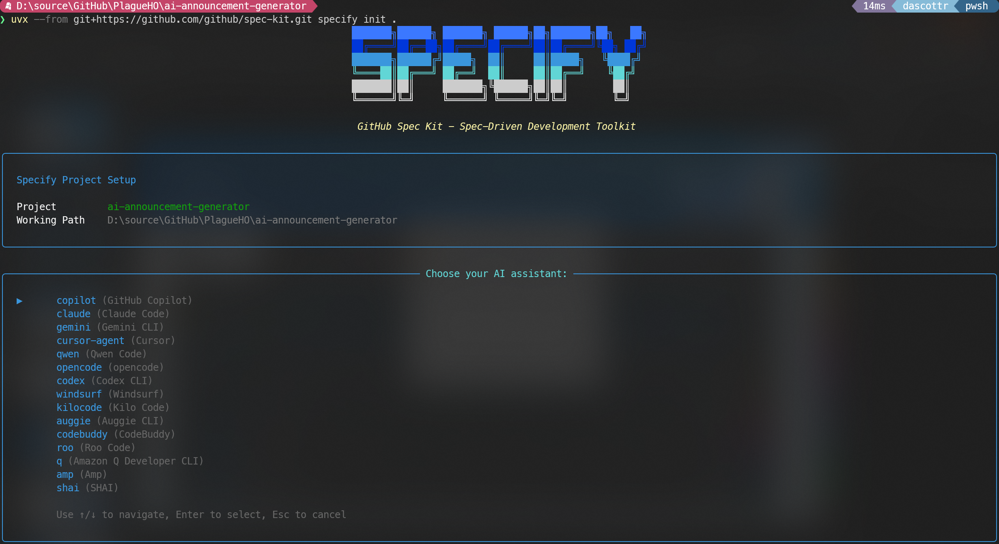
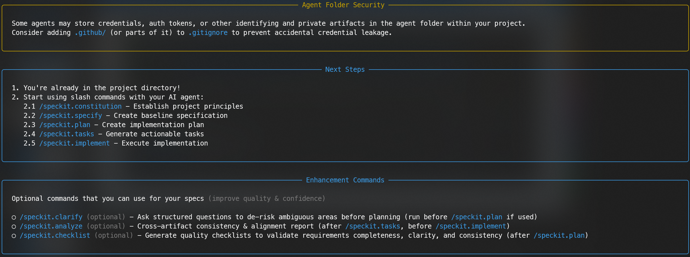
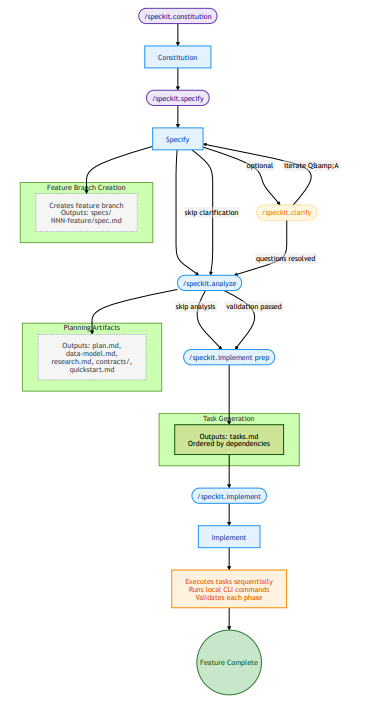

<!-- Slide 1: Title -->

  

    

      

        

        

        

        

      

      Microsoft
    

    

      <h1 class="title-hero-heading">
        Spec-Driven 
        Development with AI: 
        Spec Kit
      </h1>
      

        
Daniel Scott-Raynsford

        
Partner Solution Architect | Microsoft EPS

        
… recovering software engineer

      

    

    
November 26, 2025

  

  

  

---
transition: fade-out
---

<!-- Slide 2: The Problem with Traditional Development -->

  

    <h1>The Problem with Traditional Development</h1>
    
  

  

    

      

        

          
📋

          <h3>Code-Centric Approach Issues</h3>
          
Traditional development focuses heavily on code, often discarding initial specifications during the process.

        

        

          
⚡

          <h3>Limitations of Vibe-Coding</h3>
          
Traditional vibe-coding often fails in complex applications due to unclear or incomplete instructions.

        

        

          
🎯

          <h3>Need for Precise Instructions</h3>
          
AI coding agents require clear, unambiguous guidance to produce functional and reliable code.

        

        

          
⚠️

          <h3>Technical Debt Accumulation</h3>
          
Ignoring clear specifications causes technical debt, complicating maintenance and scalability.

        

      

      

        
      

    

  

---
transition: fade-out
---

<!-- Slide 3: What is SDD? -->

  

    <h1>What is Spec-Driven Development (SDD)?</h1>
    
  

  

    

      

        

          
📝

          <h3>Spec-Driven Development</h3>
          
Shifts focus from coding to creating executable specifications that directly generate implementations.

        

        

          
👤

          <h3>User-Centered Focus</h3>
          
Emphasizes understanding users, their problems, and interactions before technical design decisions.

        

        

          
🔄

          <h3>Dynamic Specification Evolution</h3>
          
The specification evolves with insights, guiding the entire development lifecycle adaptively.

        

        

          
✅

          <h3>Improved Code Generation and Validation</h3>
          
Starting with specs helps developers and AI generate, test, and validate code accurately.

        

      

      

        
      

    

  

---
transition: fade-out
---

<!-- Slide 4: What is Spec Kit? -->

  

    

      <h1>What is Spec Kit?</h1>
      

        <a href="https://github.com/github/spec-kit" target="_blank" class="!text-sm !text-white/80">https://github.com/github/spec-kit</a>
        
      

    

    
  

  

    

      <ul class="bullet-list">
        <li>An <strong>open-source toolkit</strong> that allows you to focus on product scenarios and predictable outcomes instead of vibe coding every piece from scratch.</li>
        <li>Supports <strong>popular AI coding agents</strong>, including of course GitHub Copilot.</li>
        <li>Installs <strong>custom prompts</strong> and <strong>scripts</strong> into repo to help you adopt SDD in a green fields or brown fields project.</li>
      </ul>
    

  

<!--
AI-Powered Development
Leverages AI to help developers focus on what to build rather than how to build it.
Faster Development Cycles
Eliminates the gap between specification and implementation, accelerating development timelines.
Improved Product Focus
Enables teams to maintain clear focus on product scenarios and business goals.
-->

---
transition: fade-out
---

<!-- Slide 5: Setup -->

  

    

      <h1>Setup</h1>
      

        <a href="https://github.com/github/spec-kit" target="_blank" class="!text-sm !text-white/80">https://github.com/github/spec-kit</a>
        
      

    

    
  

  

    

      

        New project
        <code>uvx --from git+https://github.com/github/spec-kit.git specify init my-app</code>
      

      

        Existing project
        <code>uvx --from git+https://github.com/github/spec-kit.git specify init .</code>
      

    

    

      
    

  

---
transition: fade-out
---

<!-- Slide 6: Setup (cont.) -->

  

    

      <h1>Setup (cont.)</h1>
      

        <a href="https://github.com/github/spec-kit" target="_blank" class="!text-sm !text-white/80">https://github.com/github/spec-kit</a>
        
      

    

    
  

  

    

      
    

  

---
transition: fade-out
---

<!-- Slide 7: Spec-Kit Commands -->

  

    

      <h1>Spec-Kit Commands</h1>
      

        https://github.com/github/spec-kit
        

      

    

    
  

  

    

      

        

          

            
Command

            
Description

            
Usage

          

          

            
<code>/speckit.constitution</code>

            
Create project governing principles and development guidelines

            
Run first to establish project standards

          

          

            
<code>/speckit.specify</code>

            
Define what you want to build (requirements and user stories)

            
Focus on the what and why, not tech stack

          

          

            
<code>/speckit.clarify</code>

            
Clarify underspecified areas through structured questioning

            
Must run before /plan unless explicitly skipped

          

          

            
<code>/speckit.plan</code>

            
Create technical implementation plans with chosen tech stack

            
Specify architecture, frameworks, and technical decisions

          

          

            
<code>/speckit.tasks</code>

            
Generate actionable task lists for implementation

            
Breaks down plan into executable steps

          

          

            
<code>/speckit.analyze</code>

            
Cross-artifact consistency and coverage analysis

            
Run after /tasks, before /implement

          

          

            
<code>/speckit.implement</code>

            
Execute all tasks to build the feature according to plan

            
Generates working code from specifications

          

        

        
Recently added: <code>/speckit.checklist</code> and <code>/speckit.taskstoissues</code>

      

      

        
      

    

  

---
transition: slide-up
---

<!-- Slide 8: Demo -->

  

    <h1 class="!text-6xl" style="color: #103954;">Demo</h1>
  

---
transition: fade-out
---

<!-- Slide 9: Key Takeaways -->

  

    <h1 class="!text-2xl !mt-4">Key Takeaways</h1>
    
  

  

    

      1
      
<strong>Spec-Driven Development: Build Better Software, Faster.</strong>

    

    

      2
      
<strong>Specs become executable—</strong>Code serves specifications. Stop fighting documentation drift. Specifications generate implementation and stay the single source of truth.

    

    

      3
      
<strong>Accelerate feature delivery with structured automation.</strong> Use /speckit.* commands to generate PRDs, design docs, and technical specs—reducing manual documentation effort and keeping artifacts consistent.

    

    

      4
      
<strong>Handle requirement changes without rewrites.</strong> Pivots become systematic: update the spec, regenerate implementation. No manual propagation, no technical debt accumulation.

    

    

      5
      
<strong>Focus on problem-solving, not translation.</strong> Define what users need and why. Let AI handle mechanical code generation while you architect solutions and make critical decisions.

    

    

      6
      
<strong>Tech stack and tool agnostic.</strong> Works with any language, framework, or AI agent (Claude, Copilot, Cursor, Gemini, Windsurf). Version specs like code—branch, review, merge as a team.

    

    

      7
      
<strong>Hands-on outcome: Production-ready workflow.</strong> Leave with a working project using the complete SDD lifecycle—immediately applicable to your team's real work.

    

  

---
transition: slide-up
---

<!-- Slide 10: Q&A -->

  

    <h1 class="!text-6xl" style="color: #103954;">Q&A</h1>
  

---
transition: fade-out
---

<!-- Slide 11: Thank You -->

  

    <h1 class="!text-xl !mt-2 !leading-snug">Thank you for attending this workshop! Next steps…</h1>
    
  

  

    

      

        1
        

          <strong>Install Spec Kit</strong> — Run the setup command in your project
        

      

      

        2
        

          <strong>Try the workflow</strong> — Start with <code class="!bg-gray-200 !text-gray-900">/speckit.constitution</code> and work through the lifecycle
        

      

      

        3
        

          <strong>Adopt SDD in your team</strong> — Share the workflow, version specs alongside code, iterate on specifications
        

      

    

    

      

        
Is this where your learning journey concludes?

        
Check out this presentation in my repo

      

      

        <a href="https://github.com/PlagueHO/plagueho.learn" target="_blank">github.com/PlagueHO/plagueho.learn</a>
      

    

  

