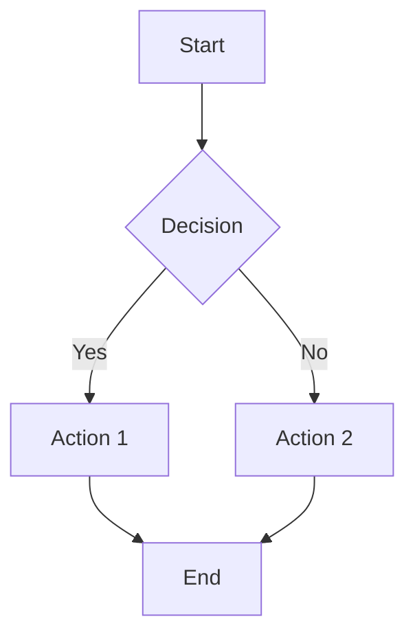

# Presentation Title

Subtitle or tagline goes here

<div class="abs-br m-6 flex gap-2">
  <a href="https://github.com/PlagueHO" target="_blank" alt="GitHub" title="PlagueHO on GitHub"
    class="text-xl slidev-icon-btn opacity-50 !border-none !hover:text-white">
    <carbon-logo-github />
  </a>
</div>

---
transition: fade-out
---

# About Me

- **Daniel Scott-Raynsford** (PlagueHO)
- Sr. Partner Solution Architect, Cloud and AI Apps, Microsoft EPS Asia
- Open Source Contributor and Recovering Software Engineer
- https://danielscottraynsford.com
- https://github.com/PlagueHO

<br>

<v-click>

> "Replace this with your own introduction"

</v-click>

---
layout: default
---

# Table of Contents

<Toc columns="2" minDepth="1" maxDepth="2" />

---
transition: slide-up
level: 2
---

# Topic One

Content for the first topic.

- Point one
- Point two
- Point three

<v-clicks>

- This appears on click 1
- This appears on click 2
- This appears on click 3

</v-clicks>

---

# Code Example

Use code snippets with syntax highlighting and line focusing:

```ts {2,3|5|all}
function greet(name: string): string {
  const message = `Hello, ${name}!`
  console.log(message)

  return message
}
```

<arrow v-click="3" x1="500" y1="200" x2="350" y2="310" color="#564" width="3" arrowSize="1" />

---
level: 2
---

# Shiki Magic Move

Animate code changes between steps:

````md magic-move {lines: true}
```ts {*|2|*}
// Step 1: Basic function
function add(a: number, b: number) {
  return a + b
}
```

```ts {*|3-5|*}
// Step 2: Add validation
function add(a: number, b: number) {
  if (typeof a !== 'number' || typeof b !== 'number') {
    throw new Error('Both arguments must be numbers')
  }
  return a + b
}
```

```ts {*|7|*}
// Step 3: Add logging
function add(a: number, b: number) {
  if (typeof a !== 'number' || typeof b !== 'number') {
    throw new Error('Both arguments must be numbers')
  }
  const result = a + b
  console.log(`${a} + ${b} = ${result}`)
  return result
}
```
````

---
layout: image-right
image: https://cover.sli.dev
---

# Two-Column Layout

Use the `image-right` layout to show content alongside an image.

- Great for diagrams
- Architecture overviews
- Screenshot walkthroughs

---
layout: two-cols
layoutClass: gap-16
---

# Left Column

Content on the left side.

- Feature A
- Feature B
- Feature C

::right::

# Right Column

Content on the right side.

```yaml
config:
  setting: value
  enabled: true
```

---

# Diagrams with Mermaid



---
class: px-20
---

# Key Takeaways

<v-clicks>

1. First key takeaway from this presentation
2. Second key takeaway to remember
3. Third important point
4. Call to action or next steps

</v-clicks>

---
layout: center
class: text-center
---

# Thank You

Questions?

[GitHub](https://github.com/PlagueHO) · [Slides Source](https://github.com/PlagueHO/plagueho.learn)
