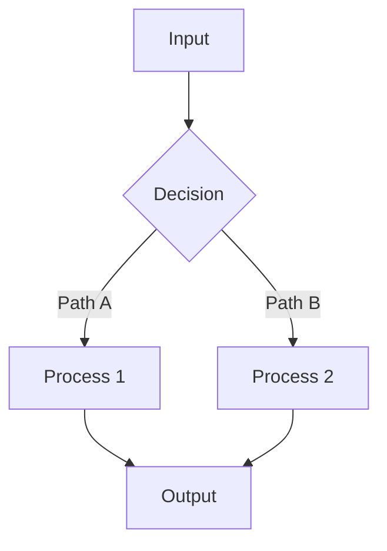

<!-- ═══════════════════════════════════════════════════════════
     SLIDE 1 — TITLE HERO (dark immersive)
     ═══════════════════════════════════════════════════════════ -->

<div class="hero-shell">
  <p class="eyebrow">Topic 1 · Topic 2 · Topic 3</p>
  <h1 class="hero-heading">Presentation<br />Title</h1>
  <p class="hero-sub">
    A brief description of the presentation — what the audience will learn and why it matters.
    Use <strong>bold highlights</strong> for key phrases.
  </p>

  <div class="hero-meta">
    <span>Daniel Scott-Raynsford (DSR)</span>
    <span>Sr. Partner Solution Architect · Cloud &amp; AI Apps · Microsoft EPS</span>
    <span>Duration · audience · focus</span>
  </div>

  <div class="hero-badge-grid">
    <div class="badge-card">
      <strong>🛠️ Badge One</strong>
      <span>Short description of this theme</span>
    </div>
    <div class="badge-card">
      <strong>🧠 Badge Two</strong>
      <span>Short description of this theme</span>
    </div>
    <div class="badge-card">
      <strong>📐 Badge Three</strong>
      <span>Short description of this theme</span>
    </div>
    <div class="badge-card">
      <strong>🤖 Badge Four</strong>
      <span>Short description of this theme</span>
    </div>
  </div>
</div>

<!--
Speaker notes for the title slide.
-->

---
transition: fade-out
---

<!-- ═══════════════════════════════════════════════════════════
     SLIDE 2 — ABOUT ME (VS Code window)
     ═══════════════════════════════════════════════════════════ -->

<div class="absolute inset-0 flex flex-col" style="background: var(--theme-bg-cool);">
  <div class="slide-banner">
    <h1>About Me</h1>
    
  </div>
  <div style="flex:1;display:flex;align-items:stretch;padding:0.65rem 1.35rem 0.75rem;min-height:0;">
    <div class="vscode-window">
      <div class="vscode-titlebar">
        <div class="vscode-dots">
          <span class="dot dot-red"></span>
          <span class="dot dot-yellow"></span>
          <span class="dot dot-green"></span>
        </div>
        <span class="vscode-wintitle">daniel-scott-raynsford — Visual Studio Code Insiders</span>
      </div>
      <div class="vscode-tabbar">
        <div class="vscode-tab vscode-tab-json"><span>📄</span> about.json</div>
        <div style="flex:1;background:#252526;"></div>
      </div>
      <div class="vscode-editor-area">
        <div class="vscode-editor-pane">
          <div class="vscode-line-nums">1<br>2<br>3<br>4<br>5<br>6<br>7<br>8<br>9<br>10<br>11<br>12<br>13</div>
          <div class="vscode-code-content"><span class="type-line" style="--li:0;"><span class="j-brace">{</span></span><span class="type-line" style="--li:1;">  <span class="j-key">"👤 name"</span><span class="j-colon">:</span> <span class="j-str">"Daniel Scott-Raynsford"</span><span class="j-punc">,</span></span><span class="type-line" style="--li:2;">  <span class="j-key">"🏷️ alias"</span><span class="j-colon">:</span> <span class="j-str">"PlagueHO"</span><span class="j-punc">,</span></span><span class="type-line" style="--li:3;">  <span class="j-key">"💼 role"</span><span class="j-colon">:</span> <span class="j-str">"Partner Solution Architect"</span><span class="j-punc">,</span></span><span class="type-line" style="--li:4;">  <span class="j-key">"🏢 team"</span><span class="j-colon">:</span> <span class="j-str">"Cloud &amp; AI Apps · Microsoft EPS"</span><span class="j-punc">,</span></span><span class="type-line" style="--li:5;">  <span class="j-key">"💻 origin"</span><span class="j-colon">:</span> <span class="j-str">"Recovering software engineer"</span><span class="j-punc">,</span></span><span class="type-line" style="--li:6;">  <span class="j-key">"🔗 links"</span><span class="j-colon">:</span> <span class="j-brace">{</span></span><span class="type-line" style="--li:7; padding-left: 2ch;">  <span class="j-key">"🌐 web"</span><span class="j-colon">:</span> <a href="https://danielscottraynsford.com" target="_blank" class="j-link">"danielscottraynsford.com"</a><span class="j-punc">,</span></span><span class="type-line" style="--li:8; padding-left: 2ch;">  <span class="j-key">"💼 linkedin"</span><span class="j-colon">:</span> <a href="https://www.linkedin.com/in/dscottraynsford/" target="_blank" class="j-link">"linkedin.com/in/dscottraynsford"</a><span class="j-punc">,</span></span><span class="type-line" style="--li:9; padding-left: 2ch;">  <span class="j-key">"🐙 github"</span><span class="j-colon">:</span> <a href="https://github.com/PlagueHO" target="_blank" class="j-link">"github.com/PlagueHO"</a></span><span class="type-line" style="--li:10;">  <span class="j-brace">}</span></span><span class="type-line" style="--li:11;"><span class="j-brace">}</span><span class="cs-cursor"></span></span></div>
        </div>
      </div>
      <div class="vscode-statusbar">
        <span>⎇ main</span>
        <span>✓ GitHub Copilot</span>
        <span style="margin-left:auto;">JSON</span>
        <span>UTF-8</span>
        <span>Ln 12, Col 1</span>
      </div>
    </div>
  </div>
</div>

<!--
Keep this quick — 60 seconds max.
-->

---
transition: slide-up
---

<!-- ═══════════════════════════════════════════════════════════
     SLIDE 3 — AGENDA (dark animated cards with orbs)
     ═══════════════════════════════════════════════════════════ -->

<div class="agenda-shell">
  <div class="agenda-orbs-layer">
    <div class="agenda-orb agenda-orb-1"></div>
    <div class="agenda-orb agenda-orb-2"></div>
    <div class="agenda-orb agenda-orb-3"></div>
  </div>

  <div class="agenda-header">
    <p class="agenda-eyebrow">DURATION · N LIVE DEMOS</p>
    <h1 class="agenda-title">Agenda</h1>
  </div>

  <div class="agenda-grid">
    <a href="/4" class="agenda-card agenda-card-1">
      <div class="agenda-card-accent"></div>
      <span class="agenda-num">01</span>
      <h2>Section Title</h2>
      <p>Brief description of this section</p>
    </a>
    <a href="/5" class="agenda-card agenda-card-2">
      <div class="agenda-card-accent"></div>
      <span class="agenda-num">02</span>
      <h2>Section Title</h2>
      <p>Brief description of this section</p>
    </a>
    <a href="/6" class="agenda-card agenda-card-3">
      <div class="agenda-card-accent"></div>
      <span class="agenda-num">03</span>
      <h2>Section Title</h2>
      <p>Brief description of this section</p>
    </a>
    <a href="/7" class="agenda-card agenda-card-4">
      <div class="agenda-card-accent"></div>
      <span class="agenda-num">04</span>
      <h2>Section Title</h2>
      <p>Brief description of this section</p>
    </a>
  </div>

  <div class="agenda-demos">
    <a href="/8" class="agenda-demo-pill">
      <span class="agenda-demo-pulse"></span>
      <span class="agenda-demo-text">
        <span class="agenda-demo-num">🎬 Demo 1</span>
        <span class="agenda-demo-desc">Demo description</span>
      </span>
    </a>
    <a href="/9" class="agenda-demo-pill">
      <span class="agenda-demo-pulse"></span>
      <span class="agenda-demo-text">
        <span class="agenda-demo-num">🎬 Demo 2</span>
        <span class="agenda-demo-desc">Demo description</span>
      </span>
    </a>
  </div>
</div>

<!--
Quick scan of the agenda.
-->

---
transition: fade-out
---

<!-- ═══════════════════════════════════════════════════════════
     SLIDE 4 — BANNER + CONTENT (standard content slide)
     ═══════════════════════════════════════════════════════════ -->

<div class="absolute inset-0 flex flex-col" style="background: var(--theme-bg-cool);">
  <div class="slide-banner">
    <h1>Standard Content Slide</h1>
    
  </div>
  <div class="slide-body" style="flex-direction: column; gap: 0.55rem; align-items: stretch; padding: 0.4rem 1.8rem 0.8rem;">
    <p style="font-size: 1.1rem; color: var(--theme-ink); margin: 0;">
      Use this layout for standard content with a dark gradient banner and a product icon. The body area is flexible.
    </p>
    <ul class="dense-list">
      <li>Point one with supporting detail</li>
      <li>Point two with supporting detail</li>
      <li>Point three with supporting detail</li>
    </ul>
    <div class="callout">
      This is a standard callout — use it to highlight a key message or insight.
    </div>
  </div>
</div>

<!--
Speaker notes for this slide.
-->

---
transition: fade-out
---

<!-- ═══════════════════════════════════════════════════════════
     SLIDE 5 — COMPARISON GRID (before / after columns)
     ═══════════════════════════════════════════════════════════ -->

<div class="absolute inset-0 flex flex-col" style="background: var(--theme-bg-cool);">
  <div class="slide-banner">
    <h1>Before vs. After Comparison</h1>
    
  </div>
  <div class="slide-body" style="flex-direction:column;align-items:stretch;">
    <div class="scenario-banner">
      <span>Scenario: describe the context for this comparison.</span>
    </div>
    <div class="comparison-grid" style="width:100%;">
      <div class="comparison-col before">
        <span class="comparison-label before">Before Approach</span>
        <div class="chat-flow-diagram">
          <span class="chat-pill">👤 Step 1</span>
          <span class="chat-flow-arrow">↓</span>
          <span class="chat-pill">📄 Step 2</span>
          <span class="chat-flow-arrow">↓</span>
          <span class="chat-pill">💬 Step 3</span>
        </div>
        <p class="approach-message">💬 Summary of the old approach and its limitations.</p>
      </div>
      <div class="comparison-col after" v-click>
        <span class="comparison-label after">After Approach</span>
        <ul class="dense-list">
          <li>Improved capability one</li>
          <li>Improved capability two</li>
          <li>Improved capability three</li>
        </ul>
        <p class="approach-message">🎯 Summary of the new approach and its benefits.</p>
      </div>
    </div>
  </div>
</div>

<!--
Speaker notes.
-->

---
transition: slide-up
---

<!-- ═══════════════════════════════════════════════════════════
     SLIDE 6 — THOUGHT BUBBLE + HIGHLIGHT STRIP
     ═══════════════════════════════════════════════════════════ -->

<div class="absolute inset-0 flex flex-col">
  <div class="slide-banner">
    <h1>Evolution / Progression</h1>
  </div>
  <div class="slide-body" style="flex-direction:column;gap:0.5rem;align-items:stretch;justify-content:center;">
    <div style="display:flex;flex-direction:column;align-items:center;justify-content:center;gap:0.25rem;">
      <div class="thought-bubble">
        <span class="thought-bubble-emoji">😰</span>
        <span>A provocative statement or <em>key insight.</em></span>
      </div>
      <div class="thought-dots"><span></span><span></span><span></span></div>
    </div>
    <div class="highlight-strip">
      <div class="highlight-pill" v-click="1">
        <span class="hl-icon">🔌</span>
        <span class="hl-label">Level 1</span>
        <span class="hl-desc">Description of the first level</span>
      </div>
      <div class="highlight-pill" v-click="2">
        <span class="hl-icon">🧠</span>
        <span class="hl-label">Level 2</span>
        <span class="hl-desc">Description of the second level</span>
      </div>
      <div class="highlight-pill" v-click="3">
        <span class="hl-icon">🤖</span>
        <span class="hl-label">Level 3</span>
        <span class="hl-desc">Description of the third level</span>
      </div>
    </div>
    <div class="intelligence-arrow" v-click="4">
      <div class="ia-track">
        <div class="ia-gradient"></div>
        <div class="ia-arrowhead"></div>
      </div>
      <div class="ia-labels">
        <span class="ia-label ia-low">Simple</span>
        <span class="ia-label ia-mid">Intermediate</span>
        <span class="ia-label ia-high">Advanced</span>
      </div>
      <div class="ia-caption">Higher capability → higher value</div>
    </div>
    <div class="callout-teal callout" style="text-align:center;" v-click="5">
      A strong closing statement for this slide.
    </div>
  </div>
</div>

<!--
Speaker notes — use this for tool evolution, skill maturity, or any spectrum.
-->

---
transition: fade-out
---

<!-- ═══════════════════════════════════════════════════════════
     SLIDE 7 — THREE PATTERN CARDS (agent/architecture patterns)
     ═══════════════════════════════════════════════════════════ -->

<div class="absolute inset-0 flex flex-col" style="background: var(--theme-bg-cool);">
  <div class="slide-banner">
    <h1>Three Patterns / Options</h1>
    
  </div>
  <div class="slide-body" style="flex-direction:column;align-items:stretch;">
    <div class="agent-pattern-grid">
      <div class="agent-pattern-card" style="border-top: 4px solid #78909c;" v-click>
        <span class="agent-pattern-label" style="color: #78909c; background: rgba(120,144,156,0.1);">Pattern A</span>
        <p style="margin: 0.2rem 0 0; font-size: 0.82rem; color: var(--theme-muted);">Description of pattern A — when to use, key characteristics, and trade-offs.</p>
      </div>
      <div class="agent-pattern-card" style="border-top: 4px solid var(--theme-accent2);" v-click>
        <span class="agent-pattern-label">Pattern B (Recommended)</span>
        <p style="margin: 0.2rem 0 0; font-size: 0.82rem; color: var(--theme-muted);">Description of pattern B — when to use, key characteristics, and trade-offs.</p>
      </div>
      <div class="agent-pattern-card" style="border-top: 4px solid var(--iq-foundry);" v-click>
        <span class="agent-pattern-label" style="color: #0a5e0a; background: rgba(16,124,16,0.1);">Pattern C</span>
        <p style="margin: 0.2rem 0 0; font-size: 0.82rem; color: var(--theme-muted);">Description of pattern C — when to use, key characteristics, and trade-offs.</p>
      </div>
    </div>
  </div>
</div>

<!--
Speaker notes.
-->

---
transition: fade-out
---

<!-- ═══════════════════════════════════════════════════════════
     SLIDE 8 — IQ PILLAR CARDS (product/service grid)
     ═══════════════════════════════════════════════════════════ -->

<div class="absolute inset-0 flex flex-col">
  <div class="slide-banner">
    <h1>Product / Service Pillars</h1>
    
  </div>
  <div class="slide-body" style="flex-direction:column;gap:0.4rem;align-items:stretch;">
    <div class="iq-grid" style="grid-template-columns: repeat(3, minmax(0, 1fr));">
      <div class="iq-pillar iq-work" v-click>
        <span class="iq-header-pill iq-header-work"><span class="iq-header-icon"></span><span>Work IQ</span></span>
        <p class="iq-card-summary">Organizational knowledge from Microsoft 365 — email, Teams, calendars, and docs.</p>
      </div>
      <div class="iq-pillar iq-fabric" v-click>
        <span class="iq-header-pill iq-header-fabric"><span class="iq-header-icon"></span><span>Fabric IQ</span></span>
        <p class="iq-card-summary">Business data, ontology, and rules with semantic context for agent reasoning.</p>
      </div>
      <div class="iq-pillar iq-foundry" v-click>
        <span class="iq-header-pill iq-header-foundry"><span class="iq-header-icon"></span><span>Foundry IQ</span></span>
        <p class="iq-card-summary">Enterprise knowledge and grounding across internal sources for governed decisions.</p>
      </div>
    </div>
    <div class="callout-teal callout" style="text-align:center;" v-click>
      A summary statement tying the pillars together.
    </div>
  </div>
</div>

<!--
Speaker notes.
-->

---
transition: fade-out
---

<!-- ═══════════════════════════════════════════════════════════
     SLIDE 9 — PYRAMID STACK (layered architecture)
     ═══════════════════════════════════════════════════════════ -->

<div class="absolute inset-0 flex flex-col" style="background: var(--theme-bg-cool);">
  <div class="slide-banner">
    <h1>Layered Architecture / Stack</h1>
    
  </div>
  <div class="slide-body" style="flex-direction: column; gap: 0.5rem; align-items: stretch; padding: 0.5rem 1.8rem 0.8rem;">
    <div style="display: flex; flex-direction: column; align-items: center;">
      <div class="pyramid-stack" style="width: 60%;">
        <div class="pyramid-layer" style="margin: 0 0; background: linear-gradient(90deg, #0a2e4a, #103954);">
          <span class="pyramid-num">1</span>
          <span class="pyramid-name">Foundation</span>
          <span class="pyramid-desc">Always-on base layer</span>
        </div>
        <div class="pyramid-layer" style="margin: 0 0.5rem; background: linear-gradient(90deg, #114D8B, #1a5ea8);">
          <span class="pyramid-num">2</span>
          <span class="pyramid-name">Templates</span>
          <span class="pyramid-desc">Reusable patterns</span>
        </div>
        <div class="pyramid-layer" style="margin: 0 1.1rem; background: linear-gradient(90deg, #085f92, #0d83c0);">
          <span class="pyramid-num">3</span>
          <span class="pyramid-name">Integrations</span>
          <span class="pyramid-desc">External connections</span>
        </div>
        <div class="pyramid-layer" style="margin: 0 1.8rem; background: linear-gradient(90deg, #0c6484, #1088ac);">
          <span class="pyramid-num">4</span>
          <span class="pyramid-name">Specialists</span>
          <span class="pyramid-desc">Domain-specific capabilities</span>
        </div>
        <div class="pyramid-layer" style="margin: 0 2.7rem; background: linear-gradient(90deg, #077769, #08a08d);">
          <span class="pyramid-num">5</span>
          <span class="pyramid-name">Expertise</span>
          <span class="pyramid-desc">Demand-loaded knowledge</span>
        </div>
      </div>
    </div>
    <div style="display: flex; gap: 0.7rem; align-items: stretch;">
      <div class="card" style="flex: 1; border-color: color-mix(in srgb, var(--theme-accent2) 50%, white); border-width: 2px;">
        <h3>Supporting Point A</h3>
        <p>Additional context about the stack.</p>
      </div>
      <div class="card" style="flex: 1; border-color: color-mix(in srgb, #5635a0 50%, white); border-width: 2px;">
        <h3>Supporting Point B</h3>
        <p>Additional context about the stack.</p>
      </div>
    </div>
  </div>
</div>

<!--
Speaker notes.
-->

---
transition: fade-out
---

<!-- ═══════════════════════════════════════════════════════════
     SLIDE 10 — CARD GRID (icon cards, link cards)
     ═══════════════════════════════════════════════════════════ -->

<div class="absolute inset-0 flex flex-col" style="background: var(--theme-bg-cool);">
  <div class="slide-banner">
    <h1>Tools &amp; Resources</h1>
    
  </div>
  <div class="slide-body" style="flex-direction: column; gap: 0.55rem; align-items: stretch; padding: 0.4rem 1.8rem 0.8rem;">
    <div style="display: flex; gap: 0.65rem; align-items: stretch; flex: 1;">
      <a href="#" target="_blank" class="card card-link" style="flex: 1; display: flex; flex-direction: row; align-items: flex-start; gap: 0.9rem; padding: 0.95rem 1.1rem; border-color: color-mix(in srgb, #c2410c 50%, white); border-width: 2px;">
        <div class="icon-circle" style="flex-shrink: 0; margin: 0; background: linear-gradient(135deg, #c2410c, #f97316);">📐</div>
        <div>
          <h3 style="background: linear-gradient(135deg, #c2410c 0%, #f97316 100%); -webkit-background-clip: text; -webkit-text-fill-color: transparent; background-clip: text; margin: 0 0 0.35em; font-size: 1.05em;">Tool One</h3>
          <p style="margin: 0; font-size: 0.88em;">Description of this tool and what it does for the audience.</p>
        </div>
        <span class="card-link-arrow">↗</span>
      </a>
      <a href="#" target="_blank" class="card card-link" style="flex: 1; display: flex; flex-direction: row; align-items: flex-start; gap: 0.9rem; padding: 0.95rem 1.1rem; border-color: color-mix(in srgb, var(--theme-accent2) 50%, white); border-width: 2px;">
        <div class="icon-circle" style="flex-shrink: 0; margin: 0; background: linear-gradient(135deg, #085f92, #38A4DC);">⚙️</div>
        <div>
          <h3 style="background: linear-gradient(135deg, #085f92 0%, #38A4DC 100%); -webkit-background-clip: text; -webkit-text-fill-color: transparent; background-clip: text; margin: 0 0 0.35em; font-size: 1.05em;">Tool Two</h3>
          <p style="margin: 0; font-size: 0.88em;">Description of this tool and what it does for the audience.</p>
        </div>
        <span class="card-link-arrow">↗</span>
      </a>
      <a href="#" target="_blank" class="card card-link" style="flex: 1; display: flex; flex-direction: row; align-items: flex-start; gap: 0.9rem; padding: 0.95rem 1.1rem; border-color: color-mix(in srgb, #5635a0 50%, white); border-width: 2px;">
        <div class="icon-circle" style="flex-shrink: 0; margin: 0; background: linear-gradient(135deg, #5635a0, #7850c0);">💼</div>
        <div>
          <h3 style="background: linear-gradient(135deg, #5635a0 0%, #9c79e0 100%); -webkit-background-clip: text; -webkit-text-fill-color: transparent; background-clip: text; margin: 0 0 0.35em; font-size: 1.05em;">Tool Three</h3>
          <p style="margin: 0; font-size: 0.88em;">Description of this tool and what it does for the audience.</p>
        </div>
        <span class="card-link-arrow">↗</span>
      </a>
    </div>
    <div class="card" style="border-color: color-mix(in srgb, var(--theme-accent5) 50%, white); border-width: 2px; display: flex; flex-direction: row; align-items: center; gap: 0.9rem; padding: 0.85rem 1.1rem;">
      <div class="icon-circle" style="flex-shrink: 0; margin: 0;">🔍</div>
      <div>
        <h3 style="font-size: 1.05em; margin: 0 0 0.3em;">Full-Width Card</h3>
        <p style="margin: 0; font-size: 0.88em;">Use this for a wider detail card spanning the full width below the icon cards.</p>
      </div>
    </div>
  </div>
</div>

<!--
Speaker notes.
-->

---
transition: fade-out
---

<!-- ═══════════════════════════════════════════════════════════
     SLIDE 11 — FLOW PIPELINE (process steps)
     ═══════════════════════════════════════════════════════════ -->

<div class="absolute inset-0 flex flex-col" style="background: var(--theme-bg-cool);">
  <div class="slide-banner">
    <h1>Process / Workflow</h1>
    
  </div>
  <div class="slide-body" style="flex-direction: column; gap: 0.8rem; align-items: stretch; padding: 0.6rem 1.8rem 0.8rem;">
    <div class="flow-pipeline" style="justify-content: center; gap: 0.6rem;">
      <div class="flow-step">🔍 Research</div>
      <span class="flow-arrow">→</span>
      <div class="flow-step">📋 Plan</div>
      <span class="flow-arrow">→</span>
      <div class="flow-step flow-step-active">⚡ Build</div>
      <span class="flow-arrow">→</span>
      <div class="flow-step">🧪 Test</div>
      <span class="flow-arrow">→</span>
      <div class="flow-step">🚀 Deploy</div>
    </div>
    <div style="display: flex; gap: 0.65rem; align-items: stretch;">
      <div class="card" style="flex: 1;">
        <h3>Step Detail A</h3>
        <p>Description of this step in the workflow, including inputs and outputs.</p>
      </div>
      <div class="card" style="flex: 1;">
        <h3>Step Detail B</h3>
        <p>Description of this step in the workflow, including inputs and outputs.</p>
      </div>
      <div class="card" style="flex: 1;">
        <h3>Step Detail C</h3>
        <p>Description of this step in the workflow, including inputs and outputs.</p>
      </div>
    </div>
    <div class="callout-teal callout" style="text-align:center;">
      Each phase produces artifacts. Context flows forward through the pipeline.
    </div>
  </div>
</div>

<!--
Speaker notes.
-->

---
transition: fade-out
---

<!-- ═══════════════════════════════════════════════════════════
     SLIDE 12 — SECTION CARD GRID (2x2 overview)
     ═══════════════════════════════════════════════════════════ -->

<div class="absolute inset-0 flex flex-col" style="background: var(--theme-bg-cool);">
  <div class="slide-banner">
    <h1>Overview Grid</h1>
    
  </div>
  <div class="slide-body" style="flex-direction: column; gap: 0.5rem; align-items: stretch; padding: 0.5rem 1.8rem 0.8rem;">
    <div class="section-grid">
      <div class="section-card" v-click>
        <span class="section-number">01</span>
        <h2>Topic One</h2>
        <p>Description of this topic area, key points, and why it matters.</p>
      </div>
      <div class="section-card" v-click>
        <span class="section-number">02</span>
        <h2>Topic Two</h2>
        <p>Description of this topic area, key points, and why it matters.</p>
      </div>
      <div class="section-card" v-click>
        <span class="section-number">03</span>
        <h2>Topic Three</h2>
        <p>Description of this topic area, key points, and why it matters.</p>
      </div>
      <div class="section-card" v-click>
        <span class="section-number">04</span>
        <h2>Topic Four</h2>
        <p>Description of this topic area, key points, and why it matters.</p>
      </div>
    </div>
  </div>
</div>

<!--
Speaker notes.
-->

---
transition: fade-out
---

<!-- ═══════════════════════════════════════════════════════════
     SLIDE 13 — DEMO SLIDE (dramatic dark)
     ═══════════════════════════════════════════════════════════ -->

<div class="demo-shell">
  <div class="demo-icon">🔬</div>
  <h1 class="demo-title">Demo: Title of Demo</h1>
  <p class="demo-subtitle">Brief description of what the demo will show</p>

  <div class="demo-badge">🎬 ~5 minutes</div>

  <div class="demo-checklist">
    <div class="demo-item"><span class="check">▸</span> Demo step one</div>
    <div class="demo-item"><span class="check">▸</span> Demo step two</div>
    <div class="demo-item"><span class="check">▸</span> Demo step three</div>
    <div class="demo-item"><span class="check">▸</span> Demo step four</div>
  </div>
</div>

<!--
DEMO SCRIPT:
1. ...
2. ...
3. ...
-->

---
transition: fade-out
---

<!-- ═══════════════════════════════════════════════════════════
     SLIDE 14 — THREE-COLUMN GOVERNANCE GRID
     ═══════════════════════════════════════════════════════════ -->

<div class="absolute inset-0 flex flex-col" style="background: var(--theme-bg-cool);">
  <div class="slide-banner">
    <h1>Guidelines / Governance</h1>
    
  </div>
  <div class="slide-body" style="flex-direction:column;gap:0.45rem;align-items:stretch;justify-content:flex-start;">
    <div class="three-col-grid">
      <div class="section-card" v-click>
        <span class="section-number">Design</span>
        <h2>Define Principles</h2>
        <ul class="dense-list" style="font-size: 0.82rem;">
          <li>Guideline one</li>
          <li>Guideline two</li>
          <li>Guideline three</li>
        </ul>
      </div>
      <div class="section-card" v-click>
        <span class="section-number">Build</span>
        <h2>Implement Controls</h2>
        <ul class="dense-list" style="font-size: 0.82rem;">
          <li>Guideline one</li>
          <li>Guideline two</li>
          <li>Guideline three</li>
        </ul>
      </div>
      <div class="section-card" v-click>
        <span class="section-number">Evaluate</span>
        <h2>Measure Impact</h2>
        <ul class="dense-list" style="font-size: 0.82rem;">
          <li>Guideline one</li>
          <li>Guideline two</li>
          <li>Guideline three</li>
        </ul>
      </div>
    </div>
    <div class="comparison-grid" style="gap:0.45rem;">
      <div class="comparison-col before" style="padding:0.7rem 0.8rem;" v-click>
        <span class="comparison-label before">Bad Example</span>
        <pre class="terminal-snippet" style="font-size:0.75rem;">❌ Poor pattern shown here</pre>
      </div>
      <div class="comparison-col after" style="padding:0.7rem 0.8rem;" v-click>
        <span class="comparison-label after">Good Example</span>
        <pre class="terminal-snippet" style="font-size:0.75rem;">✅ Correct pattern shown here</pre>
      </div>
    </div>
    <div class="model-warning-callout" v-click>
      <span class="model-warning-icon">⚠️</span>
      <span class="model-warning-text"><strong>Important warning message</strong> — re-evaluate after every change.</span>
    </div>
  </div>
</div>

<!--
Speaker notes.
-->

---
transition: fade-out
---

<!-- ═══════════════════════════════════════════════════════════
     SLIDE 15 — CODE PANELS (syntax highlighted, interactive)
     ═══════════════════════════════════════════════════════════ -->

<div class="absolute inset-0 flex flex-col" style="background: var(--theme-bg-cool);">
  <div class="slide-banner">
    <h1>Code &amp; Terminal</h1>
    
  </div>
  <p class="slide-subtitle">Side-by-side panels with Shiki syntax highlighting, line focusing, and one-click copy</p>
</div>

<div style="position:absolute;top:150px;left:50px;right:660px;bottom:90px;">
<div class="code-card-title">Application Code</div>
<div class="code-panel-header">
  <span class="code-panel-lang">TypeScript</span>
  <span class="code-panel-file">greet.ts</span>
</div>

```ts {2,3|5|all}
function greet(name: string): string {
  const message = `Hello, ${name}!`
  console.log(message)

  return message
}
```

</div>

<div style="position:absolute;top:150px;left:660px;right:50px;bottom:90px;">
<div class="code-card-title">Dev Server Output</div>
<div class="code-panel-header">
  <span class="code-panel-lang">Terminal</span>
  <span class="code-panel-file">~/project</span>
</div>

```bash
$ pnpm slidev presentations/my-talk/slides.md
# Starts dev server with hot reload
  ➜  Local:   http://localhost:3030/
  ➜  Network: http://192.168.1.10:3030/
```

</div>

<div style="position:absolute;left:50px;right:50px;bottom:30px;">
  <div class="callout" style="font-size: 0.82rem; padding: 0.55rem 0.9rem;">
    Slidev uses <strong>Shiki</strong> for syntax highlighting — supports line focusing, click reveals, and Magic Move transitions.
  </div>
</div>

<!--
Speaker notes.
-->

---
transition: fade-out
---

<!-- ═══════════════════════════════════════════════════════════
     SLIDE 16 — HERO QUOTE (big fun statement)
     ═══════════════════════════════════════════════════════════ -->

<div class="absolute inset-0 flex flex-col">
  <div class="slide-banner">
    <h1>Key Insight</h1>
  </div>
  <div class="slide-body" style="flex-direction: column; gap: 1.2rem; align-items: center; justify-content: center;">
    <div class="hero-quote">
      <span class="hero-quote-emoji">💡</span>
      <span>A powerful quote or insight that deserves its own slide — use <em>italic emphasis</em> for the key phrase.</span>
    </div>
    <p style="color: var(--theme-muted); font-size: 0.92rem; max-width: 40rem; text-align: center;">
      Optional supporting context that adds depth to the quote above.
    </p>
  </div>
</div>

<!--
Speaker notes.
-->

---
transition: fade-out
---

<!-- ═══════════════════════════════════════════════════════════
     SLIDE 17 — ACTION GRID (what to do now)
     ═══════════════════════════════════════════════════════════ -->

<div class="agenda-shell">
  <div class="agenda-orbs-layer">
    <div class="agenda-orb agenda-orb-1"></div>
    <div class="agenda-orb agenda-orb-2"></div>
    <div class="agenda-orb agenda-orb-3"></div>
  </div>

  <div class="agenda-header">
    <p class="agenda-eyebrow">NEXT STEPS</p>
    <h1 class="agenda-title">What To Do Now</h1>
  </div>

  <div class="agenda-grid">
    <div class="agenda-card agenda-card-1" v-click>
      <div class="agenda-card-accent"></div>
      <span class="agenda-num">01</span>
      <h2>First Action</h2>
      <p>Practical step the audience can take immediately after this talk.</p>
    </div>
    <div class="agenda-card agenda-card-2" v-click>
      <div class="agenda-card-accent"></div>
      <span class="agenda-num">02</span>
      <h2>Second Action</h2>
      <p>Practical step the audience can take immediately after this talk.</p>
    </div>
    <div class="agenda-card agenda-card-3" v-click>
      <div class="agenda-card-accent"></div>
      <span class="agenda-num">03</span>
      <h2>Third Action</h2>
      <p>Practical step the audience can take immediately after this talk.</p>
    </div>
  </div>
</div>

<!--
Speaker notes.
-->

---
transition: slide-up
---

<!-- ═══════════════════════════════════════════════════════════
     SLIDE 18 — KEY TAKEAWAYS
     ═══════════════════════════════════════════════════════════ -->

<div class="absolute inset-0 flex flex-col" style="background: var(--theme-bg-cool);">
  <div class="slide-banner">
    <h1>Key Takeaways</h1>
    
  </div>
  <div class="slide-body" style="align-items: stretch; padding: 0.8rem 1.8rem;">
    <div class="takeaway-grid" style="width: 100%; flex: 1;">
      <div class="takeaway-item" v-click>
        <span class="takeaway-num">1</span>
        <span class="takeaway-text"><strong>First takeaway</strong> — concise statement about what to remember.</span>
      </div>
      <div class="takeaway-item" v-click>
        <span class="takeaway-num">2</span>
        <span class="takeaway-text"><strong>Second takeaway</strong> — concise statement about what to remember.</span>
      </div>
      <div class="takeaway-item" v-click>
        <span class="takeaway-num">3</span>
        <span class="takeaway-text"><strong>Third takeaway</strong> — concise statement about what to remember.</span>
      </div>
      <div class="takeaway-item" v-click>
        <span class="takeaway-num">4</span>
        <span class="takeaway-text"><strong>Fourth takeaway</strong> — concise statement about what to remember.</span>
      </div>
      <div class="takeaway-item" v-click>
        <span class="takeaway-num">5</span>
        <span class="takeaway-text"><strong>Fifth takeaway</strong> — concise statement about what to remember.</span>
      </div>
    </div>
  </div>
</div>

<!--
Speaker notes.
-->

---
transition: fade-out
---

<!-- ═══════════════════════════════════════════════════════════
     SLIDE 19 — MERMAID DIAGRAM
     ═══════════════════════════════════════════════════════════ -->

<div class="absolute inset-0 flex flex-col">
  <div class="slide-banner">
    <h1>Architecture / Flow Diagram</h1>
    
  </div>
  <div class="slide-body" style="flex-direction: column; gap: 0.6rem; align-items: center; justify-content: center;">


```mermaid {theme: 'neutral', scale: 0.8}
graph TD
    A[Input] --> B{Decision}
    B -->|Path A| C[Process 1]
    B -->|Path B| D[Process 2]
    C --> E[Output]
    D --> E
```

  <div class="callout-teal callout" style="max-width: 40rem; text-align: center;">
    Use Mermaid diagrams for architecture overviews, flow charts, and sequence diagrams.
  </div>
  </div>
</div>

<!--
Speaker notes.
-->

---
transition: fade-out
---

<!-- ═══════════════════════════════════════════════════════════
     SLIDE 20 — MAGIC MOVE (animated code transitions)
     ═══════════════════════════════════════════════════════════ -->

<div class="absolute inset-0 flex flex-col">
  <div class="slide-banner">
    <h1>Code Evolution</h1>
    
  </div>
  <div class="slide-body" style="flex-direction: column; gap: 0.5rem; align-items: stretch; padding: 0.5rem 1.8rem;">

````md magic-move {lines: true}
```ts {*|2|*}
// Step 1: Basic function
function process(data: string) {
  return data.trim()
}
```

```ts {*|3-5|*}
// Step 2: Add validation
function process(data: string) {
  if (!data || data.length === 0) {
    throw new Error('Input cannot be empty')
  }
  return data.trim()
}
```

```ts {*|7|*}
// Step 3: Add logging
function process(data: string) {
  if (!data || data.length === 0) {
    throw new Error('Input cannot be empty')
  }
  const result = data.trim()
  console.log(`Processed: ${result}`)
  return result
}
```
````

  </div>
</div>

<!--
Speaker notes.
-->

---
layout: center
class: text-center
---

<!-- ═══════════════════════════════════════════════════════════
     SLIDE 21 — THANK YOU / Q&A
     ═══════════════════════════════════════════════════════════ -->

<div class="thankyou-shell">
  <h1 style="font-size: 2.8rem;">Thank You!</h1>
  <p style="color: var(--theme-muted); font-size: 1.1rem; max-width: 32rem;">
    Questions? Let's go deeper on anything you saw — or I can spin up a live demo on the spot.
  </p>

  <div class="thankyou-links">
    <a href="https://github.com/PlagueHO" target="_blank">GitHub</a>
    <a href="https://danielscottraynsford.com" target="_blank">Website</a>
    <a href="https://github.com/PlagueHO/plagueho.learn" target="_blank">Slides Source</a>
  </div>

  <div class="cta-box" style="max-width: 40rem; margin-top: 0.8rem;">
    <div>
      <p><strong>Clone the repo and use this template</strong></p>
      <p>Everything in this talk is in the repo — clone it, use it, extend it.</p>
    </div>
    <div class="cta-link">
      <a href="https://github.com/PlagueHO/plagueho.learn" target="_blank">github.com/PlagueHO/plagueho.learn</a>
    </div>
  </div>
</div>

<!--
Open for questions.
-->
